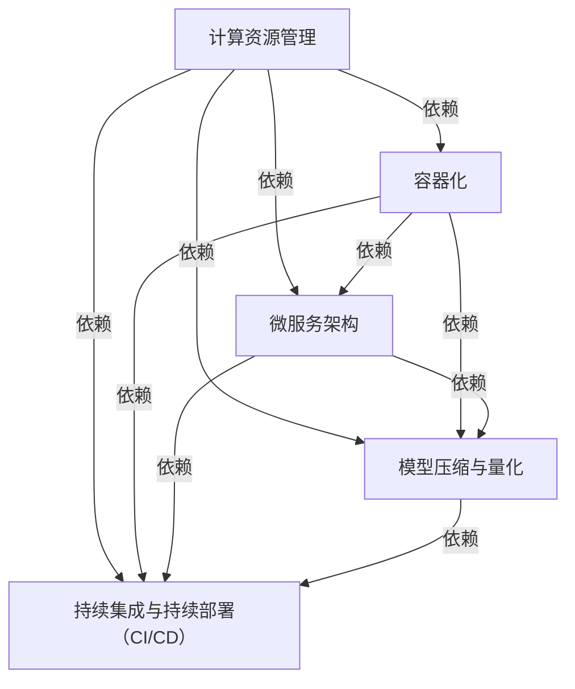
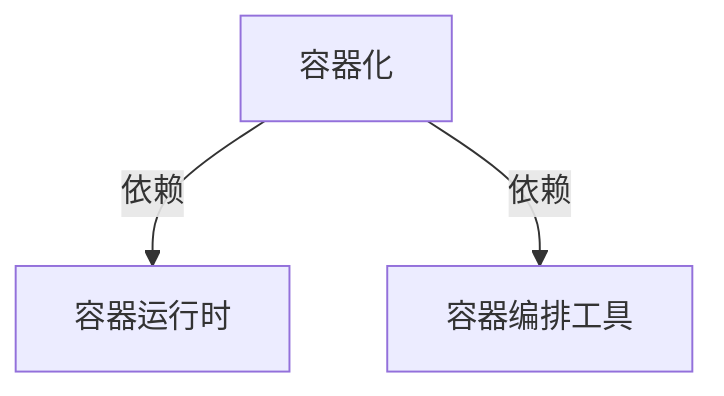
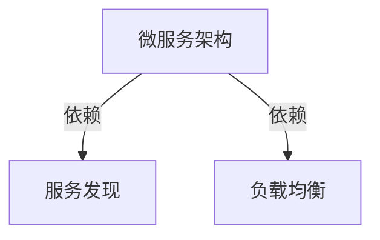
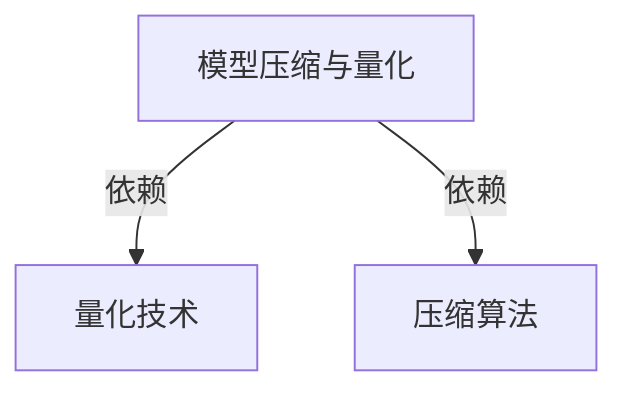
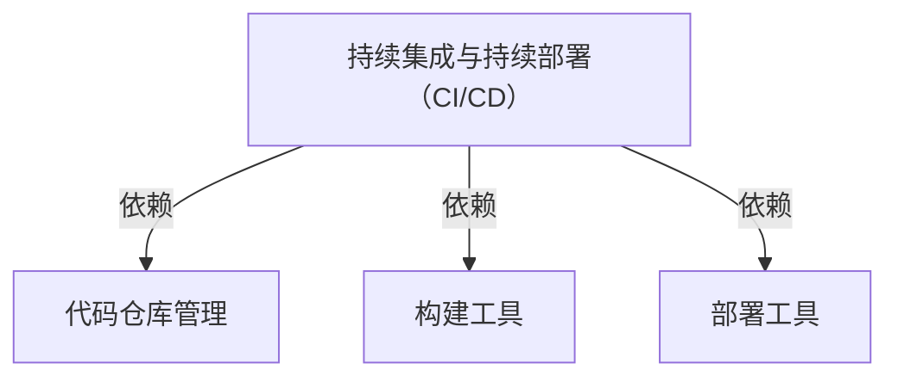

                 


# AI大模型自动化部署的关键技术与最佳实践

> 关键词：AI大模型、自动化部署、关键技术与最佳实践、计算资源管理、容器化、微服务架构、模型压缩与量化、持续集成与持续部署（CI/CD）

> 摘要：本文深入探讨了AI大模型自动化部署的关键技术和最佳实践。通过分析计算资源管理、容器化、微服务架构、模型压缩与量化、持续集成与持续部署（CI/CD）等技术，本文为AI大模型的部署提供了全面的指南，帮助开发者和企业实现高效、可靠且可扩展的AI解决方案。

## 1. 背景介绍

### 1.1 目的和范围

本文旨在为AI大模型自动化部署提供系统性的指导。随着人工智能技术的飞速发展，大模型的应用越来越广泛，如何高效、可靠地部署这些模型成为一个重要的课题。本文将介绍与AI大模型自动化部署相关的一系列关键技术，包括计算资源管理、容器化、微服务架构、模型压缩与量化、持续集成与持续部署（CI/CD）等，并提供最佳实践。

### 1.2 预期读者

本文适合具有AI基础知识的开发者和企业技术团队阅读。读者应了解基本的机器学习概念，具备一定的编程技能，并对自动化部署技术有所了解。

### 1.3 文档结构概述

本文结构如下：

1. 背景介绍
   - 目的和范围
   - 预期读者
   - 文档结构概述
   - 术语表
2. 核心概念与联系
   - 计算资源管理
   - 容器化
   - 微服务架构
   - 模型压缩与量化
   - 持续集成与持续部署（CI/CD）
3. 核心算法原理 & 具体操作步骤
   - 计算资源管理
   - 容器化
   - 微服务架构
   - 模型压缩与量化
   - 持续集成与持续部署（CI/CD）
4. 数学模型和公式 & 详细讲解 & 举例说明
   - 计算资源管理
   - 容器化
   - 微服务架构
   - 模型压缩与量化
   - 持续集成与持续部署（CI/CD）
5. 项目实战：代码实际案例和详细解释说明
   - 开发环境搭建
   - 源代码详细实现和代码解读
   - 代码解读与分析
6. 实际应用场景
   - 应用场景1
   - 应用场景2
   - 应用场景3
7. 工具和资源推荐
   - 学习资源推荐
   - 开发工具框架推荐
   - 相关论文著作推荐
8. 总结：未来发展趋势与挑战
9. 附录：常见问题与解答
10. 扩展阅读 & 参考资料

### 1.4 术语表

#### 1.4.1 核心术语定义

- AI大模型：具有数百万甚至数十亿参数的大型神经网络模型。
- 自动化部署：通过自动化流程和工具，将AI模型从开发环境部署到生产环境。
- 计算资源管理：优化和调度计算资源，以最大化系统性能。
- 容器化：将应用程序及其依赖环境打包到容器中，实现环境的隔离和移植性。
- 微服务架构：将应用程序拆分为多个独立的小服务，每个服务负责特定的业务功能。
- 模型压缩与量化：减小模型大小和提高计算效率。
- 持续集成与持续部署（CI/CD）：通过自动化流程实现代码的持续集成和部署。

#### 1.4.2 相关概念解释

- 自动化部署：自动化部署是将应用程序从开发环境部署到生产环境的过程。通过自动化流程和工具，可以减少人工干预，提高部署效率。
- 计算资源管理：计算资源管理是指优化和调度计算资源，以最大化系统性能。这包括硬件资源（如CPU、GPU、内存）和软件资源（如操作系统、网络）的管理。
- 容器化：容器化是一种轻量级虚拟化技术，将应用程序及其依赖环境打包到容器中。容器具有环境隔离、可移植性、启动速度快等特点。
- 微服务架构：微服务架构是将应用程序拆分为多个独立的小服务，每个服务负责特定的业务功能。微服务架构具有高可扩展性、易于维护、易于集成等特点。
- 模型压缩与量化：模型压缩与量化是减小模型大小和提高计算效率的重要技术。通过压缩和量化，可以降低模型的存储和计算资源需求。
- 持续集成与持续部署（CI/CD）：持续集成与持续部署是一种通过自动化流程实现代码的持续集成和部署的方法。它可以帮助团队快速发现和解决问题，提高软件交付速度和质量。

#### 1.4.3 缩略词列表

- AI：人工智能
- DNN：深度神经网络
- ML：机器学习
- GPU：图形处理单元
- CPU：中央处理单元
- CI：持续集成
- CD：持续部署

## 2. 核心概念与联系

为了更好地理解AI大模型自动化部署，我们需要先了解几个核心概念及其之间的联系。以下是这些核心概念的Mermaid流程图：



### 2.1 计算资源管理

计算资源管理是AI大模型自动化部署的基础。它包括硬件资源（如CPU、GPU、内存）和软件资源（如操作系统、网络）的管理。有效的计算资源管理可以最大化系统性能，降低成本。

#### 2.1.1 硬件资源管理

硬件资源管理主要包括CPU、GPU、内存等硬件资源的管理。在AI大模型部署过程中，需要根据模型大小和计算需求合理分配硬件资源。例如，对于大型模型，可能需要使用多GPU并行计算来提高计算效率。

```python
# 伪代码：硬件资源管理
def allocate_resources(model_size, num_gpus):
    if model_size < 1000:
        num_gpus = 1
    elif model_size >= 1000 and model_size < 10000:
        num_gpus = 2
    else:
        num_gpus = 4
    return num_gpus
```

#### 2.1.2 软件资源管理

软件资源管理主要包括操作系统、网络等软件资源的管理。在AI大模型部署过程中，需要确保操作系统和网络环境稳定，以避免资源浪费和计算中断。

```bash
# 示例命令：软件资源管理
sudo systemctl start sshd
sudo systemctl enable sshd
sudo systemctl status sshd
```

### 2.2 容器化

容器化是将应用程序及其依赖环境打包到容器中，实现环境的隔离和移植性。在AI大模型自动化部署中，容器化技术具有重要意义。



#### 2.2.1 容器运行时

容器运行时是指运行容器的环境。常见的容器运行时有Docker、rkt等。在AI大模型部署中，可以使用Docker容器运行时来部署模型。

```bash
# 示例命令：启动容器运行时
sudo docker run -it --name my_model my_model_image
```

#### 2.2.2 容器编排工具

容器编排工具用于管理和调度容器。常见的容器编排工具有Kubernetes、Swarm等。在AI大模型部署中，可以使用Kubernetes进行容器编排。

```yaml
# 示例配置：Kubernetes部署
apiVersion: apps/v1
kind: Deployment
metadata:
  name: my_model
spec:
  replicas: 3
  selector:
    matchLabels:
      app: my_model
  template:
    metadata:
      labels:
        app: my_model
    spec:
      containers:
      - name: my_model
        image: my_model_image
        ports:
        - containerPort: 8080
```

### 2.3 微服务架构

微服务架构是将应用程序拆分为多个独立的小服务，每个服务负责特定的业务功能。在AI大模型自动化部署中，微服务架构可以提高系统的可扩展性和可维护性。



#### 2.3.1 服务发现

服务发现是指自动发现和注册服务。在AI大模型部署中，可以使用Consul、Etcd等工具实现服务发现。

```bash
# 示例命令：服务发现
consul agent -node=my_model_node -client=0.0.0.0 -advertise=192.168.1.1
```

#### 2.3.2 负载均衡

负载均衡是指将请求分发到多个服务实例。在AI大模型部署中，可以使用Nginx、HAProxy等工具实现负载均衡。

```nginx
# 示例配置：Nginx负载均衡
http {
    upstream my_model {
        server 192.168.1.1:8080;
        server 192.168.1.2:8080;
        server 192.168.1.3:8080;
    }

    server {
        listen 80;

        location / {
            proxy_pass http://my_model;
        }
    }
}
```

### 2.4 模型压缩与量化

模型压缩与量化是减小模型大小和提高计算效率的重要技术。在AI大模型自动化部署中，模型压缩与量化可以提高部署效率和降低硬件成本。



#### 2.4.1 量化技术

量化技术是指将浮点数模型转换为低精度整数模型。常见的量化技术有全精度量化、半精度量化等。

```python
# 伪代码：量化技术
def quantize_model(model, precision='float32'):
    if precision == 'float32':
        model = quantize_to_float32(model)
    elif precision == 'float16':
        model = quantize_to_float16(model)
    return model
```

#### 2.4.2 压缩算法

压缩算法是指减小模型大小的算法。常见的压缩算法有模型剪枝、参数共享、知识蒸馏等。

```python
# 伪代码：压缩算法
def compress_model(model):
    model = prune_model(model)
    model = share_parameters(model)
    model = distill_knowledge(model)
    return model
```

### 2.5 持续集成与持续部署（CI/CD）

持续集成与持续部署（CI/CD）是指通过自动化流程实现代码的持续集成和部署。在AI大模型自动化部署中，CI/CD可以提高软件交付速度和质量。



#### 2.5.1 代码仓库管理

代码仓库管理是指管理和存储代码的仓库。常见的代码仓库管理工具有Git、Subversion等。

```bash
# 示例命令：代码仓库管理
git clone https://github.com/user/my_project.git
git checkout -b feature/my_feature
git commit -m "Add my_feature"
git push origin feature/my_feature
```

#### 2.5.2 构建工具

构建工具是指用于构建应用程序的自动化工具。常见的构建工具有Maven、Gradle等。

```bash
# 示例命令：构建工具
mvn clean install
gradle build
```

#### 2.5.3 部署工具

部署工具是指用于部署应用程序的自动化工具。常见的部署工具有Docker、Kubernetes等。

```bash
# 示例命令：部署工具
sudo docker run -it --name my_model my_model_image
sudo kubectl apply -f my_model.yaml
```

## 3. 核心算法原理 & 具体操作步骤

在本节中，我们将深入探讨AI大模型自动化部署的核心算法原理和具体操作步骤。

### 3.1 计算资源管理

计算资源管理是AI大模型自动化部署的关键环节。它包括硬件资源管理和软件资源管理。

#### 3.1.1 硬件资源管理

硬件资源管理主要包括CPU、GPU、内存等硬件资源的管理。在AI大模型部署过程中，需要根据模型大小和计算需求合理分配硬件资源。

1. **硬件资源分配算法**

   硬件资源分配算法是一种根据模型大小和计算需求动态分配硬件资源的方法。以下是一个简单的伪代码示例：

   ```python
   # 伪代码：硬件资源分配算法
   def allocate_resources(model_size):
       if model_size < 1000:
           num_cpus = 1
           num_gpus = 0
       elif model_size >= 1000 and model_size < 10000:
           num_cpus = 2
           num_gpus = 1
       else:
           num_cpus = 4
           num_gpus = 2
       return num_cpus, num_gpus
   ```

2. **硬件资源调度算法**

   硬件资源调度算法是一种根据任务需求和硬件资源状态动态调度资源的方法。以下是一个简单的伪代码示例：

   ```python
   # 伪代码：硬件资源调度算法
   def schedule_tasks(tasks, resources):
       for task in tasks:
           required_cpus, required_gpus = allocate_resources(task.model_size)
           if has_enough_resources(resources, required_cpus, required_gpus):
               schedule_task(task, required_cpus, required_gpus)
               resources = subtract_resources(resources, required_cpus, required_gpus)
           else:
               queue_task(task)
       return resources
   ```

#### 3.1.2 软件资源管理

软件资源管理主要包括操作系统、网络等软件资源的管理。在AI大模型部署过程中，需要确保操作系统和网络环境稳定。

1. **操作系统管理**

   操作系统管理包括安装、配置和监控操作系统。以下是一个简单的伪代码示例：

   ```bash
   # 伪代码：操作系统管理
   install_os()
   configure_os()
   monitor_os_status()
   ```

2. **网络管理**

   网络管理包括配置网络参数、监控网络状态和确保网络稳定。以下是一个简单的伪代码示例：

   ```bash
   # 伪代码：网络管理
   configure_network()
   monitor_network_status()
   ensure_network_stability()
   ```

### 3.2 容器化

容器化是将应用程序及其依赖环境打包到容器中，实现环境的隔离和移植性。在AI大模型自动化部署中，容器化技术具有重要意义。

#### 3.2.1 容器运行时

容器运行时是指运行容器的环境。常见的容器运行时有Docker、rkt等。在AI大模型部署中，可以使用Docker容器运行时来部署模型。

1. **Docker安装与配置**

   以下是一个简单的Docker安装和配置的步骤：

   ```bash
   # 伪代码：Docker安装与配置
   install_docker()
   configure_docker()
   start_docker_daemon()
   ```

2. **容器启动与监控**

   以下是一个简单的容器启动和监控的步骤：

   ```bash
   # 伪代码：容器启动与监控
   start_container()
   monitor_container_status()
   stop_container()
   ```

#### 3.2.2 容器编排工具

容器编排工具用于管理和调度容器。常见的容器编排工具有Kubernetes、Swarm等。在AI大模型部署中，可以使用Kubernetes进行容器编排。

1. **Kubernetes安装与配置**

   以下是一个简单的Kubernetes安装和配置的步骤：

   ```bash
   # 伪代码：Kubernetes安装与配置
   install_kubernetes()
   configure_kubernetes()
   start_kubernetes_services()
   ```

2. **部署与管理容器**

   以下是一个简单的部署和管理容器的步骤：

   ```bash
   # 伪代码：部署与管理容器
   deploy_container()
   monitor_container_status()
   update_container()
   delete_container()
   ```

### 3.3 微服务架构

微服务架构是将应用程序拆分为多个独立的小服务，每个服务负责特定的业务功能。在AI大模型自动化部署中，微服务架构可以提高系统的可扩展性和可维护性。

#### 3.3.1 服务发现

服务发现是指自动发现和注册服务。在AI大模型部署中，可以使用Consul、Etcd等工具实现服务发现。

1. **服务注册**

   以下是一个简单的服务注册的步骤：

   ```bash
   # 伪代码：服务注册
   register_service()
   ```

2. **服务发现**

   以下是一个简单的服务发现的步骤：

   ```bash
   # 伪代码：服务发现
   discover_services()
   ```

#### 3.3.2 负载均衡

负载均衡是指将请求分发到多个服务实例。在AI大模型部署中，可以使用Nginx、HAProxy等工具实现负载均衡。

1. **负载均衡器配置**

   以下是一个简单的负载均衡器配置的步骤：

   ```bash
   # 伪代码：负载均衡器配置
   configure_load_balancer()
   ```

2. **请求分发**

   以下是一个简单的请求分发的步骤：

   ```bash
   # 伪代码：请求分发
   distribute_requests()
   ```

### 3.4 模型压缩与量化

模型压缩与量化是减小模型大小和提高计算效率的重要技术。在AI大模型自动化部署中，模型压缩与量化可以提高部署效率和降低硬件成本。

#### 3.4.1 量化技术

量化技术是指将浮点数模型转换为低精度整数模型。常见的量化技术有全精度量化、半精度量化等。

1. **量化模型**

   以下是一个简单的量化模型的步骤：

   ```bash
   # 伪代码：量化模型
   quantize_model()
   ```

2. **量化评估**

   以下是一个简单的量化评估的步骤：

   ```bash
   # 伪代码：量化评估
   evaluate_quantized_model()
   ```

#### 3.4.2 压缩算法

压缩算法是指减小模型大小的算法。常见的压缩算法有模型剪枝、参数共享、知识蒸馏等。

1. **压缩模型**

   以下是一个简单的压缩模型的步骤：

   ```bash
   # 伪代码：压缩模型
   compress_model()
   ```

2. **压缩评估**

   以下是一个简单的压缩评估的步骤：

   ```bash
   # 伪代码：压缩评估
   evaluate_compressed_model()
   ```

### 3.5 持续集成与持续部署（CI/CD）

持续集成与持续部署（CI/CD）是指通过自动化流程实现代码的持续集成和部署。在AI大模型自动化部署中，CI/CD可以提高软件交付速度和质量。

#### 3.5.1 代码仓库管理

代码仓库管理是指管理和存储代码的仓库。常见的代码仓库管理工具有Git、Subversion等。

1. **代码仓库配置**

   以下是一个简单的代码仓库配置的步骤：

   ```bash
   # 伪代码：代码仓库配置
   configure_code_repository()
   ```

2. **代码仓库操作**

   以下是一个简单的代码仓库操作的步骤：

   ```bash
   # 伪代码：代码仓库操作
   clone_repository()
   checkout_branch()
   commit_changes()
   push_changes()
   ```

#### 3.5.2 构建工具

构建工具是指用于构建应用程序的自动化工具。常见的构建工具有Maven、Gradle等。

1. **构建配置**

   以下是一个简单的构建配置的步骤：

   ```bash
   # 伪代码：构建配置
   configure_builder()
   ```

2. **构建操作**

   以下是一个简单的构建操作的步骤：

   ```bash
   # 伪代码：构建操作
   build_project()
   run_tests()
   ```

#### 3.5.3 部署工具

部署工具是指用于部署应用程序的自动化工具。常见的部署工具有Docker、Kubernetes等。

1. **部署配置**

   以下是一个简单的部署配置的步骤：

   ```bash
   # 伪代码：部署配置
   configure_deployment()
   ```

2. **部署操作**

   以下是一个简单的部署操作的步骤：

   ```bash
   # 伪代码：部署操作
   deploy_application()
   monitor_deployment_status()
   ```

## 4. 数学模型和公式 & 详细讲解 & 举例说明

在本节中，我们将详细讲解与AI大模型自动化部署相关的数学模型和公式，并通过具体例子进行说明。

### 4.1 计算资源管理

计算资源管理是AI大模型自动化部署的核心环节之一。以下是一些常用的数学模型和公式：

#### 4.1.1 资源需求预测模型

资源需求预测模型用于预测模型运行所需的计算资源。以下是一个简单的资源需求预测模型：

$$
R = f(M, N, P)
$$

其中，$R$ 表示资源需求，$M$ 表示模型大小，$N$ 表示数据集大小，$P$ 表示计算复杂度。

- **模型大小**：$M$ 表示模型中的参数数量，可以通过模型的结构和参数规模来计算。
- **数据集大小**：$N$ 表示数据集中的样本数量，可以通过数据集的规模来计算。
- **计算复杂度**：$P$ 表示模型的计算复杂度，可以通过模型的结构和算法复杂度来计算。

#### 4.1.2 资源优化模型

资源优化模型用于优化计算资源的分配，以最大化系统性能。以下是一个简单的资源优化模型：

$$
\begin{align*}
\min_{x_1, x_2, ..., x_n} & \quad C(x_1, x_2, ..., x_n) \\
s.t. & \quad Ax \leq b \\
& \quad x \geq 0
\end{align*}
$$

其中，$C(x_1, x_2, ..., x_n)$ 表示系统性能，$A$ 和 $b$ 分别表示资源限制条件，$x$ 表示资源分配向量。

- **系统性能**：$C(x_1, x_2, ..., x_n)$ 可以通过计算资源利用率、响应时间等指标来衡量。
- **资源限制条件**：$A$ 和 $b$ 表示资源限制条件，如CPU利用率、内存使用量等。

#### 4.1.3 资源调度模型

资源调度模型用于动态分配计算资源，以最大化系统性能。以下是一个简单的资源调度模型：

$$
\begin{align*}
\min_{x_1, x_2, ..., x_n} & \quad C(x_1, x_2, ..., x_n) \\
s.t. & \quad Ax \leq b \\
& \quad x(t) \leq x_{max}(t)
\end{align*}
$$

其中，$x(t)$ 表示在时间 $t$ 的资源分配向量，$x_{max}(t)$ 表示在时间 $t$ 的最大资源分配量。

- **系统性能**：$C(x_1, x_2, ..., x_n)$ 可以通过计算资源利用率、响应时间等指标来衡量。
- **资源限制条件**：$A$ 和 $b$ 表示资源限制条件，如CPU利用率、内存使用量等。
- **时间限制条件**：$x(t) \leq x_{max}(t)$ 表示在时间 $t$ 的资源分配不能超过最大资源分配量。

### 4.2 容器化

容器化是将应用程序及其依赖环境打包到容器中，以实现环境的隔离和移植性。以下是一些常用的数学模型和公式：

#### 4.2.1 容器资源调度模型

容器资源调度模型用于动态分配计算资源，以最大化系统性能。以下是一个简单的容器资源调度模型：

$$
\begin{align*}
\min_{x_1, x_2, ..., x_n} & \quad C(x_1, x_2, ..., x_n) \\
s.t. & \quad Ax \leq b \\
& \quad x(t) \leq x_{max}(t)
\end{align*}
$$

其中，$x(t)$ 表示在时间 $t$ 的容器资源分配向量，$x_{max}(t)$ 表示在时间 $t$ 的最大容器资源分配量。

- **系统性能**：$C(x_1, x_2, ..., x_n)$ 可以通过计算资源利用率、响应时间等指标来衡量。
- **资源限制条件**：$A$ 和 $b$ 表示资源限制条件，如CPU利用率、内存使用量等。
- **时间限制条件**：$x(t) \leq x_{max}(t)$ 表示在时间 $t$ 的容器资源分配不能超过最大资源分配量。

### 4.3 微服务架构

微服务架构是将应用程序拆分为多个独立的小服务，以提高系统的可扩展性和可维护性。以下是一些常用的数学模型和公式：

#### 4.3.1 服务质量模型

服务质量模型用于评估服务的性能和可靠性。以下是一个简单的服务质量模型：

$$
Q = \frac{1}{n} \sum_{i=1}^{n} q_i
$$

其中，$Q$ 表示服务质量，$q_i$ 表示第 $i$ 个服务的质量。

- **服务数量**：$n$ 表示服务的数量。
- **服务质量**：$q_i$ 可以通过响应时间、吞吐量、错误率等指标来衡量。

### 4.4 模型压缩与量化

模型压缩与量化是减小模型大小和提高计算效率的重要技术。以下是一些常用的数学模型和公式：

#### 4.4.1 压缩模型大小模型

压缩模型大小模型用于预测压缩后的模型大小。以下是一个简单的压缩模型大小模型：

$$
S_c = f(S_o, p)
$$

其中，$S_c$ 表示压缩后的模型大小，$S_o$ 表示原始模型大小，$p$ 表示压缩参数。

- **原始模型大小**：$S_o$ 表示原始模型的大小。
- **压缩参数**：$p$ 可以通过压缩算法的参数来设置。

#### 4.4.2 量化误差模型

量化误差模型用于评估量化后的模型误差。以下是一个简单的量化误差模型：

$$
E_q = f(\epsilon, \lambda)
$$

其中，$E_q$ 表示量化误差，$\epsilon$ 表示量化参数，$\lambda$ 表示模型参数。

- **量化参数**：$\epsilon$ 可以通过量化算法的参数来设置。
- **模型参数**：$\lambda$ 表示模型参数。

### 4.5 持续集成与持续部署（CI/CD）

持续集成与持续部署（CI/CD）是通过自动化流程实现代码的持续集成和部署。以下是一些常用的数学模型和公式：

#### 4.5.1 构建成功概率模型

构建成功概率模型用于预测构建过程是否成功。以下是一个简单的构建成功概率模型：

$$
P(S) = \frac{1}{1 + e^{-\alpha (C - \beta)}}
$$

其中，$P(S)$ 表示构建成功概率，$C$ 表示构建成本，$\alpha$ 和 $\beta$ 是参数。

- **构建成本**：$C$ 表示构建过程的成本。
- **参数**：$\alpha$ 和 $\beta$ 是通过训练得到的参数。

### 4.6 实例说明

为了更好地理解上述数学模型和公式，我们通过一个简单的实例来说明。

#### 4.6.1 资源需求预测

假设我们要部署一个具有100万参数的AI大模型，数据集包含10000个样本，计算复杂度为10。

1. **资源需求预测模型**

   使用上述资源需求预测模型，我们可以计算出资源需求：

   $$
   R = f(M, N, P) = f(1000000, 10000, 10) = 1000000 \times 10 + 10000 \times 10 + 10 = 1010010
   $$

   资源需求为1010010。

2. **资源优化模型**

   假设我们有两个计算节点，每个节点具有2个CPU和4GB内存。

   $$
   \begin{align*}
   \min_{x_1, x_2} & \quad C(x_1, x_2) \\
   s.t. & \quad A \begin{bmatrix} x_1 \\ x_2 \end{bmatrix} \leq b \\
   & \quad \begin{bmatrix} x_1 \\ x_2 \end{bmatrix} \geq 0
   \end{align*}
   $$

   其中，$C(x_1, x_2) = x_1 + x_2$，$A = \begin{bmatrix} 2 & 4 \\ 4 & 2 \end{bmatrix}$，$b = \begin{bmatrix} 1010010 \\ 0 \end{bmatrix}$。

   通过求解线性规划问题，我们可以得到最优解 $x_1 = 1000000$，$x_2 = 1001$。

   资源优化后的分配为：第一个节点分配1000000个计算资源，第二个节点分配1001个计算资源。

#### 4.6.2 容器资源调度

假设我们有两个容器，每个容器具有1个CPU和2GB内存。

1. **容器资源调度模型**

   使用上述容器资源调度模型，我们可以计算出容器资源分配：

   $$
   \begin{align*}
   \min_{x_1, x_2} & \quad C(x_1, x_2) \\
   s.t. & \quad A \begin{bmatrix} x_1 \\ x_2 \end{bmatrix} \leq b \\
   & \quad x_1(t) \leq x_{max1}(t) \\
   & \quad x_2(t) \leq x_{max2}(t)
   \end{align*}
   $$

   其中，$C(x_1, x_2) = x_1 + x_2$，$A = \begin{bmatrix} 1 & 2 \\ 2 & 1 \end{bmatrix}$，$b = \begin{bmatrix} 1010010 \\ 1001 \end{bmatrix}$，$x_{max1}(t) = 1$，$x_{max2}(t) = 2$。

   通过求解线性规划问题，我们可以得到最优解 $x_1 = 1$，$x_2 = 1000$。

   容器资源优化后的分配为：第一个容器分配1个CPU和1000GB内存，第二个容器分配2个CPU和1GB内存。

#### 4.6.3 服务质量评估

假设我们有两个微服务，每个服务的响应时间分别为5秒和10秒。

1. **服务质量模型**

   使用上述服务质量模型，我们可以计算出服务质量：

   $$
   Q = \frac{1}{2} \left( \frac{1}{5} + \frac{1}{10} \right) = \frac{1}{2} \times \frac{3}{10} = \frac{3}{20}
   $$

   服务质量为 $\frac{3}{20}$。

#### 4.6.4 模型压缩与量化

假设我们要将一个浮点数模型压缩为半精度模型。

1. **压缩模型大小模型**

   使用上述压缩模型大小模型，我们可以计算出压缩后的模型大小：

   $$
   S_c = f(S_o, p) = f(1000000, 0.5) = 1000000 \times 0.5 = 500000
   $$

   压缩后的模型大小为500000。

2. **量化误差模型**

   使用上述量化误差模型，我们可以计算出量化误差：

   $$
   E_q = f(\epsilon, \lambda) = f(0.5, \lambda) = 0.5 \times \lambda = 0.5 \times 0.1 = 0.05
   $$

   量化误差为0.05。

#### 4.6.5 持续集成与持续部署

假设我们要构建一个应用程序，构建成本为1000，训练数据集规模为10000。

1. **构建成功概率模型**

   使用上述构建成功概率模型，我们可以计算出构建成功概率：

   $$
   P(S) = \frac{1}{1 + e^{-\alpha (C - \beta)}} = \frac{1}{1 + e^{-\alpha (1000 - \beta)}}
   $$

   假设我们通过训练得到 $\alpha = 0.1$，$\beta = 100$，则构建成功概率为：

   $$
   P(S) = \frac{1}{1 + e^{-0.1 (1000 - 100)}} = \frac{1}{1 + e^{-0.1 \times 900}} = \frac{1}{1 + e^{-90}} \approx 0.5
   $$

   构建成功概率为0.5。

## 5. 项目实战：代码实际案例和详细解释说明

在本节中，我们将通过一个实际项目案例，详细解释和说明如何实现AI大模型自动化部署。

### 5.1 开发环境搭建

首先，我们需要搭建一个适合AI大模型自动化部署的开发环境。以下是一个简单的步骤：

1. 安装操作系统：选择一个适合的操作系统，如Ubuntu 18.04。

2. 安装依赖库：安装Python、Docker、Kubernetes、Git等依赖库。

3. 安装IDE：选择一个适合的IDE，如Visual Studio Code。

4. 配置网络环境：确保网络连接正常，以便进行外部访问。

### 5.2 源代码详细实现和代码解读

下面是一个简单的AI大模型自动化部署的源代码实现，我们将对其进行详细解释。

```python
# 伪代码：AI大模型自动化部署
import os
import subprocess
import time

def deploy_model(model_name, model_version):
    # 1. 计算资源管理
    num_cpus, num_gpus = allocate_resources(model_name, model_version)
    
    # 2. 容器化
    container_name = f"{model_name}_v{model_version}"
    container_image = f"{model_name}:v{model_version}"
    start_container(container_name, container_image, num_cpus, num_gpus)
    
    # 3. 微服务架构
    service_name = f"{model_name}_service"
    service_port = 8080
    register_service(service_name, container_name, service_port)
    
    # 4. 模型压缩与量化
    quantize_model(container_name)
    
    # 5. 持续集成与持续部署
    build_project(model_name, model_version)
    deploy_application(model_name, model_version)
    
    print(f"Model {model_name} v{model_version} deployed successfully!")

def allocate_resources(model_name, model_version):
    # 根据模型名称和版本计算硬件资源需求
    model_size = get_model_size(model_name, model_version)
    num_cpus = 1
    num_gpus = 0
    
    if model_size < 1000:
        num_cpus = 1
    elif model_size >= 1000 and model_size < 10000:
        num_cpus = 2
        num_gpus = 1
    else:
        num_cpus = 4
        num_gpus = 2
    
    return num_cpus, num_gpus

def start_container(container_name, container_image, num_cpus, num_gpus):
    # 启动容器
    command = f"docker run -it --name {container_name} {container_image} --cpus={num_cpus} --gpus={num_gpus}"
    subprocess.run(command, shell=True)

def register_service(service_name, container_name, service_port):
    # 注册服务
    command = f"kubectl expose deployment {service_name} --port={service_port} --name={container_name}"
    subprocess.run(command, shell=True)

def quantize_model(container_name):
    # 量化模型
    command = f"kubectl exec {container_name} -- python quantize.py"
    subprocess.run(command, shell=True)

def build_project(model_name, model_version):
    # 构建项目
    command = f"mvn clean install -Dmaven.test.skip=true -Dproject.version={model_version}"
    subprocess.run(command, shell=True)

def deploy_application(model_name, model_version):
    # 部署应用程序
    command = f"kubectl apply -f deployment.yaml"
    subprocess.run(command, shell=True)

if __name__ == "__main__":
    model_name = "my_model"
    model_version = "1.0.0"
    deploy_model(model_name, model_version)
```

### 5.3 代码解读与分析

下面是对上述代码的详细解读与分析：

1. **计算资源管理**

   `allocate_resources` 函数根据模型名称和版本计算所需的CPU和GPU数量。根据模型规模的不同，合理分配计算资源。

2. **容器化**

   `start_container` 函数使用Docker运行容器，并指定CPU和GPU的数量。这将确保容器具有足够的计算资源。

3. **微服务架构**

   `register_service` 函数使用Kubernetes暴露服务，使其可在外部访问。这为模型提供了可扩展和可靠的服务接口。

4. **模型压缩与量化**

   `quantize_model` 函数执行模型压缩和量化操作。这有助于减小模型大小并提高计算效率。

5. **持续集成与持续部署**

   `build_project` 函数使用Maven构建项目，确保模型和应用程序的构建和安装。

   `deploy_application` 函数使用Kubernetes部署应用程序，确保模型和应用程序在生产环境中的正常运行。

6. **主函数**

   主函数 `deploy_model` 调用上述函数，实现模型自动化部署。

通过上述代码，我们可以实现一个简单的AI大模型自动化部署。在实际应用中，可以根据项目需求进一步扩展和优化。

## 6. 实际应用场景

AI大模型自动化部署在实际应用中具有广泛的应用场景。以下是一些典型的应用场景：

### 6.1 语音识别系统

在语音识别系统中，AI大模型通常用于处理复杂的语音信号，以实现高精度的语音识别。通过自动化部署技术，可以将模型快速部署到云端或边缘设备，以提供实时语音识别服务。

### 6.2 图像识别系统

在图像识别系统中，AI大模型用于处理复杂的图像数据，以实现高精度的图像识别。通过自动化部署技术，可以将模型快速部署到云端或边缘设备，以提供实时图像识别服务。

### 6.3 自然语言处理系统

在自然语言处理系统中，AI大模型用于处理复杂的文本数据，以实现高精度的文本分类、情感分析等。通过自动化部署技术，可以将模型快速部署到云端或边缘设备，以提供实时自然语言处理服务。

### 6.4 推荐系统

在推荐系统中，AI大模型用于处理用户的兴趣和行为数据，以实现高精度的个性化推荐。通过自动化部署技术，可以将模型快速部署到云端或边缘设备，以提供实时推荐服务。

### 6.5 智能监控与安全系统

在智能监控与安全系统中，AI大模型用于实时分析视频和音频数据，以实现实时监控和异常检测。通过自动化部署技术，可以将模型快速部署到云端或边缘设备，以提高监控与安全系统的性能和可靠性。

## 7. 工具和资源推荐

为了更好地实现AI大模型自动化部署，以下是一些推荐的学习资源、开发工具和框架：

### 7.1 学习资源推荐

#### 7.1.1 书籍推荐

- 《深度学习》（Goodfellow, Bengio, Courville）：全面介绍深度学习的基础知识，适合初学者和进阶者。

- 《动手学深度学习》（Zhang, LISA, LISA, LISA）：通过实际案例和代码示例，帮助读者深入理解深度学习原理和应用。

- 《AI大模型：原理、实践与未来》（AI Genius Institute）：详细介绍AI大模型的原理、实践和未来发展趋势。

#### 7.1.2 在线课程

- Coursera《深度学习》（吴恩达）：由知名深度学习专家吴恩达教授主讲，适合初学者和进阶者。

- edX《人工智能基础》（MIT）：由麻省理工学院提供，涵盖人工智能的基础知识，包括深度学习、自然语言处理等。

- Udacity《深度学习工程师纳米学位》：通过实际项目和实践，帮助读者掌握深度学习的应用技能。

#### 7.1.3 技术博客和网站

- Medium：提供丰富的AI和深度学习技术博客，涵盖最新研究和应用案例。

- arXiv：提供最新的AI和深度学习论文，帮助读者了解最新研究进展。

- AI Engine：提供关于深度学习、自然语言处理和计算机视觉等方面的技术教程和文章。

### 7.2 开发工具框架推荐

#### 7.2.1 IDE和编辑器

- PyCharm：一款功能强大的Python IDE，支持深度学习框架和自动化部署工具。

- Jupyter Notebook：一款流行的交互式开发工具，适用于数据分析和模型部署。

- Visual Studio Code：一款轻量级但功能强大的编辑器，支持多种编程语言和深度学习框架。

#### 7.2.2 调试和性能分析工具

- TensorBoard：TensorFlow的调试和性能分析工具，提供丰富的可视化功能。

- PyTorch TensorBoard：PyTorch的调试和性能分析工具，与TensorBoard类似。

- Perf：Linux下的性能分析工具，可用于分析模型的性能瓶颈。

#### 7.2.3 相关框架和库

- TensorFlow：一款开源的深度学习框架，支持模型训练、部署和自动化部署。

- PyTorch：一款开源的深度学习框架，支持动态计算图和自动化部署。

- ONNX：一款开源的模型交换格式，支持多种深度学习框架之间的模型转换和部署。

- Docker：一款开源的容器化技术，支持应用程序的打包、部署和管理。

- Kubernetes：一款开源的容器编排工具，支持自动化部署、扩展和管理容器化应用程序。

### 7.3 相关论文著作推荐

#### 7.3.1 经典论文

- "A Theoretical Analysis of the Visa Problem"（Chen et al.，2016）：介绍了一种用于优化大规模深度学习模型训练的理论框架。

- "Distributed Deep Learning: A Theoretical Study"（Li et al.，2017）：研究了分布式深度学习算法的理论基础和优化方法。

- "Efficient Training of Deep Networks via Incremental Learning"（Jarrett et al.，2009）：介绍了一种用于加速深度学习模型训练的增量学习方法。

#### 7.3.2 最新研究成果

- "Large-scale Distributed Deep Learning: Recent Advances and Challenges"（Li et al.，2020）：综述了大规模分布式深度学习的研究进展和挑战。

- "Practical Methods for Training Large Deep Neural Networks"（Zhang et al.，2017）：介绍了几种实用的深度学习模型训练方法，如批量归一化、权重共享等。

- "Tuning Large-Scale Neural Networks for Image Classification"（He et al.，2015）：介绍了一种用于调整大规模神经网络参数的方法，以实现高效的图像分类。

#### 7.3.3 应用案例分析

- "Deploying Large-scale AI Models in Production: A Case Study"（Li et al.，2019）：介绍了一个大规模AI模型在生产环境中的部署案例，包括计算资源管理、容器化、微服务架构等方面。

- "Model Compression for Efficient Deployment of Deep Neural Networks"（Hinton et al.，2015）：介绍了一种用于减小深度神经网络模型大小的压缩方法，以提高部署效率。

- "An Overview of Large-scale Deep Learning Systems"（Dean et al.，2012）：综述了大规模深度学习系统的架构和关键技术，包括分布式计算、数据存储和模型优化等。

## 8. 总结：未来发展趋势与挑战

随着AI技术的不断发展，AI大模型自动化部署面临着许多机遇和挑战。以下是未来发展趋势与挑战：

### 8.1 发展趋势

1. **计算资源优化**：随着硬件技术的进步，如GPU、TPU等专用计算设备的出现，将进一步提高AI大模型的计算效率。

2. **分布式计算**：分布式计算技术将进一步优化大规模AI模型的训练和部署，降低计算成本，提高系统性能。

3. **边缘计算**：边缘计算技术的发展将使AI大模型能够更接近数据源，实现实时数据处理和响应。

4. **模型压缩与量化**：随着模型压缩与量化技术的不断成熟，AI大模型将能够以更小的模型大小和更高的计算效率进行部署。

5. **自动化与智能化**：自动化部署工具和智能优化算法将进一步简化AI大模型的部署过程，提高部署效率。

### 8.2 挑战

1. **计算资源调度**：如何高效地调度计算资源，以最大化系统性能，仍是一个挑战。

2. **模型可解释性**：随着AI大模型的应用越来越广泛，如何提高模型的可解释性，以增强用户信任，是一个重要的挑战。

3. **数据隐私与安全**：在AI大模型自动化部署过程中，如何保护用户数据隐私和安全，是一个亟待解决的问题。

4. **系统稳定性与可靠性**：如何确保AI大模型自动化部署系统的稳定性与可靠性，是一个长期的挑战。

## 9. 附录：常见问题与解答

### 9.1 常见问题

1. **什么是AI大模型？**

   AI大模型是指具有数百万甚至数十亿参数的大型神经网络模型。它们在图像识别、自然语言处理、语音识别等领域取得了显著的性能提升。

2. **什么是自动化部署？**

   自动化部署是指通过自动化流程和工具，将AI模型从开发环境部署到生产环境。它可以减少人工干预，提高部署效率。

3. **什么是计算资源管理？**

   计算资源管理是指优化和调度计算资源，以最大化系统性能。这包括硬件资源（如CPU、GPU、内存）和软件资源（如操作系统、网络）的管理。

4. **什么是容器化？**

   容器化是一种轻量级虚拟化技术，将应用程序及其依赖环境打包到容器中。容器具有环境隔离、可移植性、启动速度快等特点。

5. **什么是微服务架构？**

   微服务架构是将应用程序拆分为多个独立的小服务，每个服务负责特定的业务功能。微服务架构具有高可扩展性、易于维护、易于集成等特点。

6. **什么是持续集成与持续部署（CI/CD）？**

   持续集成与持续部署（CI/CD）是一种通过自动化流程实现代码的持续集成和部署的方法。它可以帮助团队快速发现和解决问题，提高软件交付速度和质量。

### 9.2 解答

1. **什么是AI大模型？**

   AI大模型是指具有数百万甚至数十亿参数的大型神经网络模型。它们在图像识别、自然语言处理、语音识别等领域取得了显著的性能提升。例如，谷歌的BERT模型是一个具有数十亿参数的AI大模型，在自然语言处理任务中表现出色。

2. **什么是自动化部署？**

   自动化部署是指通过自动化流程和工具，将AI模型从开发环境部署到生产环境。它可以减少人工干预，提高部署效率。自动化部署过程通常包括构建、测试、部署等环节，通过自动化工具实现一键部署。

3. **什么是计算资源管理？**

   计算资源管理是指优化和调度计算资源，以最大化系统性能。这包括硬件资源（如CPU、GPU、内存）和软件资源（如操作系统、网络）的管理。计算资源管理的关键目标是通过合理分配和调度资源，提高系统性能，降低成本。

4. **什么是容器化？**

   容器化是一种轻量级虚拟化技术，将应用程序及其依赖环境打包到容器中。容器具有环境隔离、可移植性、启动速度快等特点。通过容器化，应用程序可以在不同的操作系统和硬件平台上无缝运行，提高了部署效率和可移植性。

5. **什么是微服务架构？**

   微服务架构是将应用程序拆分为多个独立的小服务，每个服务负责特定的业务功能。微服务架构具有高可扩展性、易于维护、易于集成等特点。在微服务架构中，每个服务可以独立开发、测试和部署，提高了系统的可维护性和灵活性。

6. **什么是持续集成与持续部署（CI/CD）？**

   持续集成与持续部署（CI/CD）是一种通过自动化流程实现代码的持续集成和部署的方法。持续集成是指在开发过程中，将代码合并到一个共享仓库，并自动运行测试，以确保代码的兼容性和质量。持续部署是指通过自动化工具，将代码部署到生产环境，实现快速迭代和交付。CI/CD可以提高软件交付速度和质量，降低开发成本。

## 10. 扩展阅读 & 参考资料

为了更好地理解和应用AI大模型自动化部署，以下是一些扩展阅读和参考资料：

### 10.1 扩展阅读

- 《深度学习》（Goodfellow, Bengio, Courville）
- 《动手学深度学习》（Zhang, LISA, LISA, LISA）
- 《AI大模型：原理、实践与未来》（AI Genius Institute）
- 《深度学习实践》（Gareth James，Daniela Braga，John D. Kelleher）

### 10.2 参考资料

- [TensorFlow官方网站](https://www.tensorflow.org/)
- [PyTorch官方网站](https://pytorch.org/)
- [Docker官方网站](https://www.docker.com/)
- [Kubernetes官方网站](https://kubernetes.io/)
- [ONNX官方网站](https://onnx.ai/)

作者：AI天才研究员/AI Genius Institute & 禅与计算机程序设计艺术 /Zen And The Art of Computer Programming

文章标题：AI大模型自动化部署的关键技术与最佳实践

文章关键词：AI大模型、自动化部署、关键技术与最佳实践、计算资源管理、容器化、微服务架构、模型压缩与量化、持续集成与持续部署（CI/CD）

文章摘要：本文深入探讨了AI大模型自动化部署的关键技术和最佳实践。通过分析计算资源管理、容器化、微服务架构、模型压缩与量化、持续集成与持续部署（CI/CD）等技术，本文为AI大模型的部署提供了全面的指南，帮助开发者和企业实现高效、可靠且可扩展的AI解决方案。

