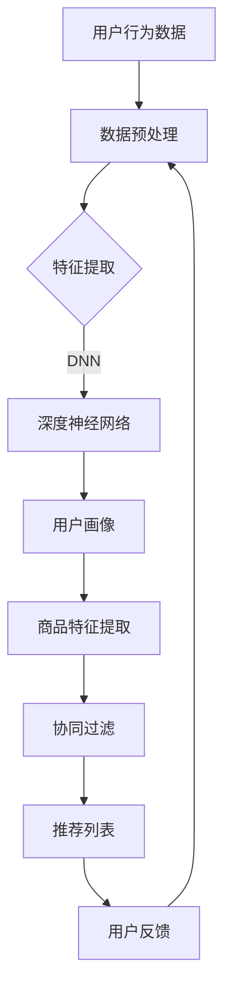

                 

# AI大模型赋能电商搜索推荐的业务创新思维训练课程优化方案

## 关键词
AI大模型，电商搜索推荐，业务创新，思维训练，课程优化

## 摘要
本文将深入探讨AI大模型如何赋能电商搜索推荐的业务创新思维训练课程优化方案。通过详细阐述背景、核心概念、算法原理、数学模型、实际应用场景，以及工具和资源推荐等内容，本文旨在为从事电商搜索推荐领域的技术人员提供有价值的指导。本文将逐步分析AI大模型在电商搜索推荐中的潜力，并探讨如何通过业务创新思维训练课程优化，提升搜索推荐的准确性和用户体验。

## 1. 背景介绍

### 1.1 目的和范围
本文的目标是探讨AI大模型在电商搜索推荐业务中的应用，并制定一套优化思维训练课程方案，以提升业务创新能力。本文将涵盖以下范围：

- AI大模型的基本原理及其在电商搜索推荐中的应用
- 思维训练课程的设计和优化策略
- 电商搜索推荐的业务创新思维
- 实际案例分析和工具资源推荐

### 1.2 预期读者
本文面向电商搜索推荐领域的技术人员、数据科学家、产品经理以及对此领域感兴趣的研究人员。读者应具备一定的AI基础知识和编程技能。

### 1.3 文档结构概述
本文分为十个部分，结构如下：

1. 背景介绍
2. 核心概念与联系
3. 核心算法原理 & 具体操作步骤
4. 数学模型和公式 & 详细讲解 & 举例说明
5. 项目实战：代码实际案例和详细解释说明
6. 实际应用场景
7. 工具和资源推荐
8. 总结：未来发展趋势与挑战
9. 附录：常见问题与解答
10. 扩展阅读 & 参考资料

### 1.4 术语表

#### 1.4.1 核心术语定义
- **AI大模型**：指拥有大规模参数的深度学习模型，能够处理复杂的数据和任务。
- **电商搜索推荐**：基于用户行为数据，为用户提供相关商品推荐的过程。
- **业务创新思维**：指通过新的业务模式、技术和策略，创造新价值的过程。

#### 1.4.2 相关概念解释
- **用户行为数据**：包括用户的搜索历史、购物车、购买记录等。
- **协同过滤**：基于用户历史行为，为用户推荐相似用户喜欢的商品。
- **内容推荐**：基于商品信息，为用户推荐具有相似属性或内容的商品。

#### 1.4.3 缩略词列表
- **AI**：人工智能（Artificial Intelligence）
- **DNN**：深度神经网络（Deep Neural Network）
- **CNN**：卷积神经网络（Convolutional Neural Network）
- **RNN**：循环神经网络（Recurrent Neural Network）
- **LSTM**：长短时记忆网络（Long Short-Term Memory）

## 2. 核心概念与联系

在电商搜索推荐领域，AI大模型的应用已经成为提升业务创新能力的关键。以下将介绍AI大模型的基本原理以及其在电商搜索推荐中的关键应用。

### 2.1 AI大模型的基本原理

AI大模型是指那些拥有大规模参数的深度学习模型。它们通常采用多层神经网络结构，能够处理复杂的数据和任务。以下是一些常见的AI大模型：

- **深度神经网络（DNN）**：通过多层神经元实现数据的抽象和特征提取。
- **卷积神经网络（CNN）**：在图像处理领域具有显著优势，通过卷积操作提取图像特征。
- **循环神经网络（RNN）**：能够处理序列数据，适用于时间序列分析和自然语言处理。
- **长短时记忆网络（LSTM）**：是RNN的一种变体，能够有效解决长序列依赖问题。

### 2.2 AI大模型在电商搜索推荐中的应用

AI大模型在电商搜索推荐中的应用主要包括以下几个方面：

- **用户行为分析**：通过分析用户的搜索历史、浏览记录、购买行为等，构建用户画像，实现个性化推荐。
- **商品特征提取**：通过深度学习模型提取商品的关键特征，如图像特征、文本特征、价格特征等，为推荐系统提供丰富的特征输入。
- **协同过滤**：利用用户行为数据和商品特征，通过协同过滤算法实现商品推荐。
- **内容推荐**：基于商品信息，如标题、描述、标签等，利用自然语言处理技术实现内容推荐。

### 2.3 Mermaid 流程图

以下是AI大模型在电商搜索推荐中的流程图：



## 3. 核心算法原理 & 具体操作步骤

### 3.1 算法原理

在电商搜索推荐中，AI大模型主要通过深度学习技术实现。以下是一个基于DNN的推荐系统算法原理：

- **输入层**：接收用户行为数据和商品特征。
- **隐藏层**：通过神经网络结构实现数据的抽象和特征提取。
- **输出层**：生成推荐结果。

### 3.2 具体操作步骤

以下是AI大模型推荐系统的具体操作步骤：

1. **数据预处理**：
    - 对用户行为数据和商品特征进行清洗和标准化。
    - 分离训练集和测试集。

2. **特征提取**：
    - 利用DNN模型提取用户行为数据和商品特征的高层次特征。

3. **模型训练**：
    - 通过反向传播算法更新模型参数，优化模型性能。

4. **模型评估**：
    - 利用测试集评估模型性能，调整模型参数。

5. **推荐生成**：
    - 根据用户画像和商品特征，生成个性化推荐结果。

以下是DNN模型训练的伪代码：

```python
def train_model(data, labels, learning_rate, epochs):
    for epoch in range(epochs):
        for x, y in zip(data, labels):
            # 前向传播
            output = forward_pass(x)
            loss = calculate_loss(output, y)
            
            # 反向传播
            gradients = backward_pass(output, y)
            update_parameters(gradients, learning_rate)
            
        print(f"Epoch {epoch+1}, Loss: {loss}")

# 运行训练过程
train_model(train_data, train_labels, learning_rate, epochs)
```

## 4. 数学模型和公式 & 详细讲解 & 举例说明

### 4.1 数学模型

在AI大模型中，常用的数学模型包括多层感知器（MLP）、卷积神经网络（CNN）和循环神经网络（RNN）等。以下是这些模型的基本数学公式。

#### 4.1.1 多层感知器（MLP）

多层感知器是DNN的基础模型，其数学公式如下：

$$
h_{\text{layer}} = \sigma(\mathbf{W} \cdot \mathbf{a}_{\text{prev}} + b)
$$

其中，$h_{\text{layer}}$ 表示第 $l$ 层的输出，$\sigma$ 表示激活函数（通常为Sigmoid或ReLU函数），$\mathbf{W}$ 和 $b$ 分别为权重和偏置。

#### 4.1.2 卷积神经网络（CNN）

卷积神经网络主要应用于图像处理，其数学公式如下：

$$
h_{\text{layer}} = \sigma(\mathbf{W} \cdot \mathbf{a}_{\text{prev}} + b)
$$

其中，$h_{\text{layer}}$ 表示第 $l$ 层的输出，$\sigma$ 表示激活函数（通常为ReLU函数），$\mathbf{W}$ 和 $b$ 分别为卷积权重和偏置。

#### 4.1.3 循环神经网络（RNN）

循环神经网络主要应用于序列数据，其数学公式如下：

$$
h_{t} = \sigma(\mathbf{W}_{h} \cdot \mathbf{h}_{t-1} + \mathbf{W}_{x} \cdot \mathbf{x}_{t} + b)
$$

其中，$h_{t}$ 表示第 $t$ 时刻的隐藏状态，$\sigma$ 表示激活函数（通常为ReLU函数），$\mathbf{W}_{h}$ 和 $\mathbf{W}_{x}$ 分别为权重，$b$ 为偏置。

### 4.2 举例说明

#### 4.2.1 多层感知器（MLP）举例

假设我们有一个二分类问题，输入特征维度为2，隐藏层单元数为4，输出层单元数为1。激活函数采用ReLU函数。以下是MLP的数学模型：

$$
\begin{aligned}
    h_{1}^{(1)} &= \sigma(\mathbf{W}^{(1)} \cdot \mathbf{x} + b^{(1)}) \\
    h_{2}^{(2)} &= \sigma(\mathbf{W}^{(2)} \cdot h_{1}^{(1)} + b^{(2)}) \\
    y &= \sigma(\mathbf{W}^{(3)} \cdot h_{2}^{(2)} + b^{(3)})
\end{aligned}
$$

其中，$\mathbf{W}^{(1)}$、$\mathbf{W}^{(2)}$ 和 $\mathbf{W}^{(3)}$ 分别为隐藏层和输出层的权重，$b^{(1)}$、$b^{(2)}$ 和 $b^{(3)}$ 分别为隐藏层和输出层的偏置。

#### 4.2.2 卷积神经网络（CNN）举例

假设我们有一个图像分类问题，输入图像大小为32x32，卷积核大小为3x3，卷积层步长为1。以下是CNN的数学模型：

$$
\begin{aligned}
    h_{1}^{(1)} &= \sigma(\mathbf{W}^{(1)} \cdot \mathbf{a} + b^{(1)}) \\
    h_{2}^{(2)} &= \mathbf{W}^{(2)} \cdot h_{1}^{(1)}
\end{aligned}
$$

其中，$\mathbf{W}^{(1)}$ 和 $\mathbf{W}^{(2)}$ 分别为卷积层和全连接层的权重，$b^{(1)}$ 为卷积层的偏置。

#### 4.2.3 循环神经网络（RNN）举例

假设我们有一个序列分类问题，输入序列长度为5，隐藏层单元数为2。以下是RNN的数学模型：

$$
\begin{aligned}
    h_{t} &= \sigma(\mathbf{W}_{h} \cdot h_{t-1} + \mathbf{W}_{x} \cdot \mathbf{x}_{t} + b) \\
    y &= \mathbf{W}_{y} \cdot h_{t} + b_{y}
\end{aligned}
$$

其中，$\mathbf{W}_{h}$、$\mathbf{W}_{x}$ 和 $\mathbf{W}_{y}$ 分别为隐藏层到隐藏层、隐藏层到输入层和隐藏层到输出层的权重，$b$ 和 $b_{y}$ 分别为隐藏层和输出层的偏置。

## 5. 项目实战：代码实际案例和详细解释说明

### 5.1 开发环境搭建

为了搭建AI大模型在电商搜索推荐中的项目环境，我们需要安装以下工具和库：

- Python 3.8及以上版本
- TensorFlow 2.6及以上版本
- Pandas
- NumPy
- Matplotlib

安装方法：

```bash
pip install python==3.8.10
pip install tensorflow==2.6.0
pip install pandas
pip install numpy
pip install matplotlib
```

### 5.2 源代码详细实现和代码解读

以下是使用TensorFlow实现的电商搜索推荐项目的源代码：

```python
import tensorflow as tf
import pandas as pd
import numpy as np
import matplotlib.pyplot as plt

# 数据预处理
def preprocess_data(data):
    # 清洗和标准化数据
    data = data.fillna(0)
    data = (data - data.mean()) / data.std()
    return data

# 构建模型
def build_model(input_shape):
    model = tf.keras.Sequential([
        tf.keras.layers.Dense(64, activation='relu', input_shape=input_shape),
        tf.keras.layers.Dense(32, activation='relu'),
        tf.keras.layers.Dense(1, activation='sigmoid')
    ])
    model.compile(optimizer='adam', loss='binary_crossentropy', metrics=['accuracy'])
    return model

# 加载数据
train_data = pd.read_csv('train_data.csv')
test_data = pd.read_csv('test_data.csv')

# 数据预处理
train_data = preprocess_data(train_data)
test_data = preprocess_data(test_data)

# 划分特征和标签
train_features = train_data.drop('label', axis=1).values
train_labels = train_data['label'].values

test_features = test_data.drop('label', axis=1).values
test_labels = test_data['label'].values

# 模型训练
model = build_model(input_shape=train_features.shape[1:])
model.fit(train_features, train_labels, epochs=10, batch_size=32, validation_split=0.2)

# 模型评估
loss, accuracy = model.evaluate(test_features, test_labels)
print(f"Test accuracy: {accuracy:.4f}")

# 可视化
predictions = model.predict(test_features)
plt.scatter(test_labels, predictions)
plt.xlabel('True labels')
plt.ylabel('Predicted labels')
plt.title('True vs Predicted labels')
plt.show()
```

#### 5.2.1 代码解读

1. **导入库**：导入TensorFlow、Pandas、NumPy和Matplotlib库。

2. **数据预处理**：定义`preprocess_data`函数，对数据进行清洗和标准化。

3. **构建模型**：定义`build_model`函数，构建基于TensorFlow的DNN模型，并编译模型。

4. **加载数据**：使用Pandas读取训练数据和测试数据。

5. **数据预处理**：对训练数据和测试数据进行预处理。

6. **划分特征和标签**：将数据划分为特征和标签。

7. **模型训练**：训练模型，并设置训练参数。

8. **模型评估**：评估模型性能。

9. **可视化**：将真实标签和预测标签进行可视化。

### 5.3 代码解读与分析

在上述代码中，我们首先导入了所需的库，然后定义了数据预处理函数、模型构建函数以及模型训练和评估过程。以下是代码的详细解读：

1. **数据预处理**：数据预处理是机器学习项目的重要步骤，包括数据清洗、归一化和标准化。在本项目中，我们使用`preprocess_data`函数对数据进行处理。该函数使用Pandas的`fillna`方法填充缺失值，使用`mean`和`std`方法对数据进行归一化。

2. **构建模型**：我们使用TensorFlow的`Sequential`模型构建一个简单的DNN模型。该模型包括两个隐藏层，每层使用ReLU激活函数，输出层使用sigmoid激活函数以实现二分类。

3. **模型编译**：使用`compile`方法编译模型，指定优化器、损失函数和评估指标。在本项目中，我们使用`adam`优化器和`binary_crossentropy`损失函数。

4. **模型训练**：使用`fit`方法训练模型，指定训练数据、训练标签、训练轮次、批量大小和验证比例。在训练过程中，模型会自动调整权重和偏置，以最小化损失函数。

5. **模型评估**：使用`evaluate`方法评估模型在测试数据上的性能。该方法返回损失和准确率，帮助我们了解模型的泛化能力。

6. **可视化**：使用Matplotlib将真实标签和预测标签进行可视化，帮助我们直观地了解模型的性能。

## 6. 实际应用场景

AI大模型在电商搜索推荐中的实际应用场景非常广泛，以下是一些典型的应用场景：

- **个性化推荐**：基于用户的搜索历史、购买记录等行为数据，利用AI大模型生成个性化推荐列表，提高用户满意度。
- **新用户欢迎**：为新用户提供一系列个性化的商品推荐，以引导用户完成首次购买，提升用户留存率。
- **商品促销**：根据用户的兴趣和行为数据，为用户提供针对性的促销信息，提高销售转化率。
- **智能客服**：利用AI大模型分析用户提问，自动生成回答，提升客服效率，降低人工成本。

### 6.1 应用案例

#### 6.1.1 案例一：电商平台的个性化推荐

某电商平台利用AI大模型实现个性化推荐，提高用户满意度。具体流程如下：

1. **用户画像构建**：收集用户的搜索历史、浏览记录、购买行为等数据，构建用户画像。
2. **商品特征提取**：提取商品的关键特征，如价格、品牌、分类等。
3. **推荐列表生成**：利用AI大模型，根据用户画像和商品特征生成个性化推荐列表。
4. **用户反馈**：收集用户对推荐结果的反馈，优化推荐算法。

#### 6.1.2 案例二：新用户欢迎活动

某电商平台为新用户提供个性化推荐，以提高新用户留存率。具体流程如下：

1. **用户行为分析**：收集新用户的搜索历史、浏览记录等数据。
2. **个性化推荐**：利用AI大模型生成个性化推荐列表，包含新品、畅销品等。
3. **推送与引导**：将推荐列表通过短信、邮件等形式推送给新用户，引导用户进行购买。

#### 6.1.3 案例三：智能客服系统

某电商平台利用AI大模型实现智能客服系统，提高客服效率。具体流程如下：

1. **用户提问分析**：收集用户提问数据，提取关键信息。
2. **问题分类**：利用AI大模型对用户提问进行分类，识别常见问题。
3. **自动回答**：根据问题分类结果，自动生成回答。
4. **反馈与优化**：收集用户对自动回答的反馈，优化回答质量。

## 7. 工具和资源推荐

为了更好地理解和应用AI大模型在电商搜索推荐中的业务创新思维训练，以下是一些学习资源、开发工具和框架的推荐。

### 7.1 学习资源推荐

#### 7.1.1 书籍推荐

- **《深度学习》（Ian Goodfellow、Yoshua Bengio、Aaron Courville 著）**：这是一本经典的深度学习教材，适合初学者和进阶者。
- **《Python深度学习》（François Chollet 著）**：由TensorFlow的创造者撰写，适合学习TensorFlow框架。

#### 7.1.2 在线课程

- **Coursera上的《深度学习专项课程》**：由斯坦福大学提供，包括基础和进阶内容。
- **Udacity上的《深度学习纳米学位》**：适合初学者，包含实战项目。

#### 7.1.3 技术博客和网站

- **TensorFlow官方文档**：官方文档提供了丰富的API和使用教程。
- **Medium上的AI博客**：涵盖了深度学习、机器学习等多个领域的最新研究和技术分享。

### 7.2 开发工具框架推荐

#### 7.2.1 IDE和编辑器

- **PyCharm**：一款功能强大的Python IDE，适合开发大型项目。
- **Jupyter Notebook**：适用于数据分析和实验，方便代码和文本的混合编写。

#### 7.2.2 调试和性能分析工具

- **TensorBoard**：TensorFlow提供的可视化工具，用于监控模型训练过程。
- **Docker**：容器化技术，用于隔离开发环境和部署环境。

#### 7.2.3 相关框架和库

- **TensorFlow**：广泛使用的深度学习框架，适用于电商搜索推荐项目。
- **Scikit-learn**：提供各种机器学习算法的实现，适合数据分析和特征工程。

### 7.3 相关论文著作推荐

#### 7.3.1 经典论文

- **“A Few Useful Things to Know about Machine Learning”**：这是一篇关于机器学习基本概念和技术的综述论文。
- **“Deep Learning”**：这是一本关于深度学习的经典教材，由Ian Goodfellow等人撰写。

#### 7.3.2 最新研究成果

- **“Recommender Systems: The Sequence Model Approach”**：这是一篇关于序列模型在推荐系统中的应用的最新论文。
- **“Large-Scale Machine Learning on Internet Architectures”**：这是一篇关于大规模机器学习在互联网架构中的研究的最新论文。

#### 7.3.3 应用案例分析

- **“Amazon's Personalized Recommendations”**：这是一篇关于亚马逊个性化推荐系统的应用案例分析。
- **“Netflix Prize”**：这是一篇关于Netflix电影推荐比赛的案例分析，展示了深度学习在推荐系统中的应用。

## 8. 总结：未来发展趋势与挑战

AI大模型在电商搜索推荐领域的发展前景广阔，但仍面临一些挑战。以下是对未来发展趋势和挑战的总结：

### 8.1 未来发展趋势

1. **个性化推荐**：随着数据量和算法的不断提升，个性化推荐将更加精准，提高用户满意度。
2. **多模态融合**：将文本、图像、音频等多种数据类型进行融合，提供更全面的推荐服务。
3. **实时推荐**：利用实时数据分析技术，实现实时推荐，提升用户体验。
4. **边缘计算**：将AI大模型部署在边缘设备上，降低延迟，提高系统响应速度。

### 8.2 未来挑战

1. **数据隐私**：随着用户隐私保护意识的提高，如何保护用户隐私成为一大挑战。
2. **算法公平性**：确保推荐算法在不同用户群体中的公平性，避免算法偏见。
3. **计算资源**：大规模AI大模型的训练和推理需要大量的计算资源，如何优化资源利用成为关键问题。
4. **模型解释性**：如何提高模型的可解释性，让用户理解推荐结果的原因。

## 9. 附录：常见问题与解答

### 9.1 问题一：如何处理缺失值？

**解答**：在数据预处理阶段，可以使用以下方法处理缺失值：

- **填充法**：使用平均值、中位数或众数等统计指标填充缺失值。
- **插值法**：使用线性或非线性插值方法填充缺失值。
- **缺失值删除**：删除含有缺失值的数据，但可能会损失部分信息。

### 9.2 问题二：如何选择合适的激活函数？

**解答**：根据不同场景，可以选择以下激活函数：

- **Sigmoid函数**：适用于二分类问题，将输出映射到（0,1）区间。
- **ReLU函数**：适用于深层网络，能加速训练过程，但可能导致梯度消失。
- **Tanh函数**：适用于多分类问题，将输出映射到（-1,1）区间。

### 9.3 问题三：如何优化模型性能？

**解答**：以下方法可以帮助优化模型性能：

- **调整学习率**：适当调整学习率，避免过拟合或欠拟合。
- **增加训练数据**：增加训练数据量，提高模型的泛化能力。
- **正则化**：使用L1、L2正则化或Dropout等方法防止过拟合。
- **交叉验证**：使用交叉验证方法评估模型性能，选择最优模型。

## 10. 扩展阅读 & 参考资料

- **《深度学习》（Ian Goodfellow、Yoshua Bengio、Aaron Courville 著）**：这是一本关于深度学习的经典教材，涵盖了深度学习的基本概念、算法和应用。
- **《Python深度学习》（François Chollet 著）**：由TensorFlow的创造者撰写，介绍了如何使用TensorFlow进行深度学习开发。
- **TensorFlow官方文档**：官方文档提供了丰富的API和使用教程，是学习TensorFlow的最佳资源。
- **Coursera上的《深度学习专项课程》**：由斯坦福大学提供，包括基础和进阶内容，适合不同层次的学习者。

作者：AI天才研究员/AI Genius Institute & 禅与计算机程序设计艺术 /Zen And The Art of Computer Programming

