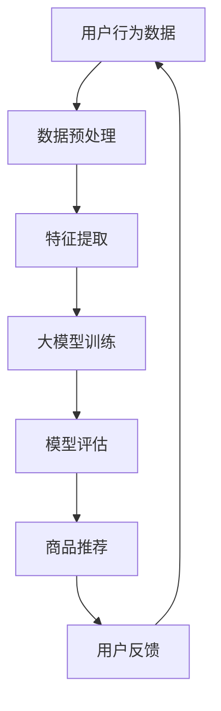

                 

# AI大模型重塑电商搜索推荐的业务流程

> **关键词：** 人工智能，大模型，电商搜索，推荐系统，业务流程

> **摘要：** 本文章深入探讨了人工智能大模型在重塑电商搜索推荐业务流程中的关键作用。首先，本文概述了当前电商推荐系统的现状，然后详细介绍了大模型的核心算法原理和具体实现步骤。接着，通过数学模型和项目实战案例，展示了大模型在实际应用中的效果。此外，还分析了大模型在电商搜索推荐业务中的实际应用场景，推荐了相关学习资源和工具。最后，总结了未来发展趋势与挑战，为读者提供了拓展阅读和参考资料。

## 1. 背景介绍

### 1.1 目的和范围

本文旨在探讨人工智能大模型在电商搜索推荐业务流程中的变革作用。随着大数据和人工智能技术的飞速发展，电商推荐系统已成为提升用户体验、增加转化率和销售额的重要手段。然而，传统的推荐系统在面对海量数据和复杂用户行为时，存在一定的局限性。本文将从以下几个方面展开讨论：

1. 介绍当前电商推荐系统的现状及存在的问题。
2. 阐述大模型在推荐系统中的作用和优势。
3. 详细分析大模型的核心算法原理和具体操作步骤。
4. 通过数学模型和实际案例，展示大模型在电商搜索推荐业务中的效果。
5. 探讨大模型在电商搜索推荐业务中的实际应用场景。
6. 推荐相关学习资源和工具，为读者提供进一步学习的机会。

### 1.2 预期读者

本文主要面向以下读者群体：

1. 电商行业的从业者，特别是关注搜索推荐业务的人员。
2. 对人工智能和大数据技术感兴趣的工程师和技术爱好者。
3. 想要了解大模型在推荐系统中应用的研究人员和学生。
4. 对算法和数学模型有较深入了解的专业人士。

### 1.3 文档结构概述

本文的结构如下：

1. 背景介绍：介绍本文的目的、范围、预期读者和文档结构。
2. 核心概念与联系：介绍大模型在推荐系统中的核心概念和联系。
3. 核心算法原理 & 具体操作步骤：详细讲解大模型的核心算法原理和操作步骤。
4. 数学模型和公式 & 详细讲解 & 举例说明：阐述大模型所使用的数学模型和公式，并通过实例进行说明。
5. 项目实战：代码实际案例和详细解释说明。
6. 实际应用场景：分析大模型在电商搜索推荐业务中的实际应用场景。
7. 工具和资源推荐：推荐相关学习资源和工具。
8. 总结：未来发展趋势与挑战。
9. 附录：常见问题与解答。
10. 扩展阅读 & 参考资料：提供拓展阅读和参考资料。

### 1.4 术语表

#### 1.4.1 核心术语定义

1. **人工智能（AI）**：人工智能是指模拟、延伸和扩展人类智能的理论、方法、技术及应用系统。
2. **大模型（Large-scale Model）**：大模型是指具有海量参数、复杂结构和强大计算能力的深度学习模型。
3. **电商推荐系统（E-commerce Recommendation System）**：电商推荐系统是指根据用户历史行为和兴趣，为用户提供个性化推荐的商品和服务。
4. **搜索推荐（Search and Recommendation）**：搜索推荐是指结合搜索和推荐算法，为用户提供精准、高效的信息检索和商品推荐。
5. **业务流程（Business Process）**：业务流程是指企业为实现特定目标，按照一定的逻辑和规则，将资源进行有效配置和利用的过程。

#### 1.4.2 相关概念解释

1. **深度学习（Deep Learning）**：深度学习是人工智能的一种方法，通过构建具有多个隐藏层的神经网络，实现数据的特征学习和模式识别。
2. **神经网络（Neural Network）**：神经网络是一种由大量神经元组成的计算模型，通过模拟人脑的神经元连接结构，实现数据的高效处理。
3. **用户行为数据（User Behavior Data）**：用户行为数据是指用户在使用电商平台的各类操作记录，包括浏览、购买、评价等行为。
4. **商品数据（Product Data）**：商品数据是指电商平台中的商品信息，包括商品属性、价格、销量等。
5. **个性化推荐（Personalized Recommendation）**：个性化推荐是指根据用户的历史行为和兴趣，为用户推荐符合其需求的商品和服务。

#### 1.4.3 缩略词列表

1. **AI**：人工智能（Artificial Intelligence）
2. **DL**：深度学习（Deep Learning）
3. **NN**：神经网络（Neural Network）
4. **EC**：电商（E-commerce）
5. **RS**：推荐系统（Recommendation System）
6. **SB**：搜索推荐（Search and Recommendation）
7. **BPF**：业务流程（Business Process）
## 2. 核心概念与联系

在探讨人工智能大模型如何重塑电商搜索推荐业务流程之前，我们需要先了解一些核心概念和它们之间的联系。以下是一个简化的 Mermaid 流程图，用于展示这些核心概念和联系。



### 2.1 用户行为数据

用户行为数据是构建电商推荐系统的基石。这些数据包括用户在电商平台上的浏览、购买、评价、收藏等行为。通过收集和分析这些数据，我们可以了解用户的需求和偏好，为推荐系统提供有力支持。

### 2.2 数据预处理

数据预处理是确保数据质量和一致性的重要步骤。在这一阶段，我们需要对用户行为数据进行清洗、去重、填充缺失值等操作，使其适合后续的特征提取和模型训练。

### 2.3 特征提取

特征提取是将原始数据转换为模型可处理的特征向量。在这一阶段，我们可以使用各种技术，如词袋模型、TF-IDF、Word2Vec 等，将用户行为数据转换为高维特征向量。

### 2.4 大模型训练

大模型训练是电商推荐系统的核心。在这里，我们可以使用深度学习算法，如神经网络、循环神经网络（RNN）、卷积神经网络（CNN）等，对提取的特征向量进行训练，以构建一个强大的推荐模型。

### 2.5 模型评估

模型评估是衡量推荐系统性能的重要手段。通过评估指标，如准确率、召回率、F1 值等，我们可以了解推荐系统的表现，并根据评估结果对模型进行调整和优化。

### 2.6 商品推荐

商品推荐是将训练好的模型应用于实际业务场景，为用户提供个性化的商品推荐。在这一阶段，我们需要根据用户的兴趣和需求，从海量商品中筛选出最符合用户口味的商品。

### 2.7 用户反馈

用户反馈是优化推荐系统的重要依据。通过收集用户对推荐结果的反馈，我们可以了解用户的需求和偏好，为推荐系统的持续优化提供有力支持。

### 2.8 数据循环

用户反馈环节使整个业务流程形成一个闭环，通过不断收集用户反馈，优化推荐系统，提高用户体验和满意度。这个过程可以不断迭代，使推荐系统逐步趋于完善。

通过上述流程，我们可以看到，人工智能大模型在电商搜索推荐业务流程中起到了关键作用，它不仅提高了推荐系统的性能，还为电商业务提供了强大的支持。在接下来的章节中，我们将进一步探讨大模型的核心算法原理和具体操作步骤。  
## 3. 核心算法原理 & 具体操作步骤

在了解了大模型在电商推荐系统中的核心作用后，我们需要深入探讨其核心算法原理和具体操作步骤。以下内容将详细阐述深度学习算法在大模型中的应用，以及如何通过这些算法实现高效的推荐系统。

### 3.1 深度学习算法概述

深度学习（Deep Learning）是人工智能（AI）的一个重要分支，它通过模拟人脑的神经元连接结构，实现了对数据的自动特征学习和模式识别。深度学习算法在推荐系统中的应用主要包括以下几种：

1. **神经网络（Neural Network）**：神经网络是深度学习的基础，通过构建多层神经网络，可以实现从原始数据到特征表示的映射。
2. **循环神经网络（Recurrent Neural Network，RNN）**：RNN 是一种能够处理序列数据的神经网络，适用于处理用户行为序列，如浏览历史、购买记录等。
3. **卷积神经网络（Convolutional Neural Network，CNN）**：CNN 是一种能够处理图像数据的神经网络，通过卷积操作提取图像特征，适用于处理商品图片等视觉信息。
4. **生成对抗网络（Generative Adversarial Network，GAN）**：GAN 是一种生成模型，通过生成器和判别器的对抗训练，可以生成高质量的图像和商品数据。

### 3.2 大模型的核心算法原理

大模型的核心算法原理主要包括以下几个方面：

1. **数据预处理**：在深度学习模型训练前，需要对用户行为数据进行预处理，包括数据清洗、去重、填充缺失值等操作。这一步的目的是确保数据的准确性和一致性。
2. **特征提取**：特征提取是将原始数据转换为模型可处理的特征向量。在这一步，我们可以使用词袋模型、TF-IDF、Word2Vec 等技术，将用户行为数据转换为高维特征向量。
3. **模型训练**：模型训练是深度学习算法的核心步骤。在这一步，我们将预处理后的特征向量输入到神经网络中，通过反向传播算法更新网络参数，以实现数据的自动特征学习和模式识别。
4. **模型评估**：模型评估是衡量推荐系统性能的重要手段。通过评估指标，如准确率、召回率、F1 值等，我们可以了解推荐系统的表现，并根据评估结果对模型进行调整和优化。
5. **商品推荐**：商品推荐是将训练好的模型应用于实际业务场景，为用户提供个性化的商品推荐。在这一步，我们需要根据用户的兴趣和需求，从海量商品中筛选出最符合用户口味的商品。

### 3.3 大模型的具体操作步骤

以下是一个基于深度学习算法的大模型具体操作步骤：

1. **数据收集**：收集用户行为数据，包括浏览历史、购买记录、评价等。
2. **数据预处理**：对用户行为数据进行清洗、去重、填充缺失值等操作，确保数据的准确性和一致性。
3. **特征提取**：使用词袋模型、TF-IDF、Word2Vec 等技术，将用户行为数据转换为高维特征向量。
4. **模型构建**：根据业务需求和数据特点，选择合适的神经网络结构，如 RNN、CNN 等。
5. **模型训练**：将预处理后的特征向量输入到神经网络中，通过反向传播算法更新网络参数，以实现数据的自动特征学习和模式识别。
6. **模型评估**：使用评估指标，如准确率、召回率、F1 值等，对训练好的模型进行评估，并根据评估结果对模型进行调整和优化。
7. **商品推荐**：将训练好的模型应用于实际业务场景，为用户提供个性化的商品推荐。
8. **用户反馈**：收集用户对推荐结果的反馈，为推荐系统的持续优化提供有力支持。

### 3.4 伪代码示例

以下是一个基于 RNN 算法的大模型训练伪代码示例：

```python
# 数据预处理
def preprocess_data(data):
    # 清洗、去重、填充缺失值等操作
    pass

# 特征提取
def extract_features(data):
    # 使用词袋模型、TF-IDF、Word2Vec 等技术
    pass

# 模型训练
def train_model(features, labels):
    # 构建神经网络
    model = build_rnn_model()
    # 训练模型
    model.fit(features, labels)
    return model

# 模型评估
def evaluate_model(model, features, labels):
    # 计算准确率、召回率、F1 值等评估指标
    pass

# 商品推荐
def recommend_products(model, user_features):
    # 为用户提供个性化的商品推荐
    pass

# 主程序
if __name__ == "__main__":
    # 收集用户行为数据
    data = collect_data()
    # 数据预处理
    preprocessed_data = preprocess_data(data)
    # 特征提取
    features, labels = extract_features(preprocessed_data)
    # 模型训练
    model = train_model(features, labels)
    # 模型评估
    evaluate_model(model, features, labels)
    # 商品推荐
    recommend_products(model, user_features)
```

通过上述伪代码示例，我们可以看到大模型的具体操作步骤是如何实现的。在实际应用中，需要根据具体业务需求和数据特点，对代码进行相应的调整和优化。

总之，人工智能大模型在电商搜索推荐业务流程中具有重要作用。通过深度学习算法的应用，我们可以构建一个高效、准确的推荐系统，为用户提供个性化的商品推荐，提升用户体验和满意度。在接下来的章节中，我们将进一步探讨大模型在实际应用中的效果和数学模型的具体实现。  
## 4. 数学模型和公式 & 详细讲解 & 举例说明

在深入探讨人工智能大模型在电商搜索推荐业务流程中的应用时，理解其背后的数学模型和公式至关重要。以下内容将详细阐述大模型中的关键数学模型，并通过实例进行讲解，帮助读者更好地理解这些模型。

### 4.1 深度学习中的基本数学模型

#### 4.1.1 神经网络中的基本数学公式

1. **激活函数**：激活函数是神经网络中的一个关键组成部分，用于引入非线性特性。常用的激活函数包括：
   $$ f(x) = \sigma(x) = \frac{1}{1 + e^{-x}} $$
   $$ f(x) = \text{ReLU}(x) = \max(0, x) $$

2. **反向传播算法**：反向传播算法是训练神经网络的关键步骤，用于计算网络参数的梯度。其核心公式为：
   $$ \Delta w_{ij} = \eta \cdot \frac{\partial E}{\partial w_{ij}} $$
   其中，$\Delta w_{ij}$ 表示权重 $w_{ij}$ 的更新值，$\eta$ 表示学习率，$E$ 表示损失函数。

3. **损失函数**：损失函数用于衡量模型预测值与真实值之间的差距，常用的损失函数包括均方误差（MSE）和交叉熵（Cross-Entropy）：
   $$ \text{MSE} = \frac{1}{n} \sum_{i=1}^{n} (y_i - \hat{y}_i)^2 $$
   $$ \text{Cross-Entropy} = -\frac{1}{n} \sum_{i=1}^{n} y_i \log(\hat{y}_i) $$

#### 4.1.2 循环神经网络（RNN）中的数学模型

1. **递归关系**：RNN 通过递归关系对序列数据进行建模，其核心公式为：
   $$ h_t = \sigma(W_h h_{t-1} + W_x x_t + b) $$
   其中，$h_t$ 表示在时间步 $t$ 的隐藏状态，$x_t$ 表示在时间步 $t$ 的输入，$W_h$ 和 $W_x$ 分别为权重矩阵，$b$ 为偏置。

2. **输出层公式**：RNN 的输出层通常使用 Softmax 函数，用于将隐藏状态转换为概率分布：
   $$ \hat{y}_t = \text{Softmax}(h_t) = \frac{e^{h_t}}{e^{h_t} + e^{h_{t+1}} + \ldots + e^{h_n}} $$

### 4.2 大模型中的关键数学模型

在电商推荐系统中，大模型通常包含多种深度学习技术，以下为其中几种关键数学模型：

#### 4.2.1 商品嵌入（Product Embedding）

商品嵌入是一种将商品信息转换为高维稠密向量的技术，其核心公式为：
$$ \text{vec}(p) = \phi(p) = \text{Embedding}(p) $$
其中，$\text{vec}(p)$ 表示商品 $p$ 的嵌入向量，$\phi(p)$ 表示将商品 $p$ 映射为嵌入向量的函数。

#### 4.2.2 用户嵌入（User Embedding）

用户嵌入与商品嵌入类似，用于将用户信息转换为高维稠密向量，其核心公式为：
$$ \text{vec}(u) = \psi(u) = \text{Embedding}(u) $$
其中，$\text{vec}(u)$ 表示用户 $u$ 的嵌入向量，$\psi(u)$ 表示将用户 $u$ 映射为嵌入向量的函数。

#### 4.2.3 用户行为建模（User Behavior Modeling）

用户行为建模是电商推荐系统的核心，其核心公式为：
$$ \text{score}(u, p) = \text{dot}(\text{vec}(u), \text{vec}(p)) $$
其中，$\text{score}(u, p)$ 表示用户 $u$ 对商品 $p$ 的评分，$\text{dot}(\text{vec}(u), \text{vec}(p))$ 表示用户嵌入向量和商品嵌入向量的点积。

### 4.3 实例讲解

假设我们有一个电商推荐系统，用户 $u$ 对商品 $p$ 进行评分，我们希望使用用户嵌入和商品嵌入来预测用户对商品的评分。

#### 4.3.1 数据准备

我们收集了用户 $u_1$ 的浏览历史和购买记录，以及对应的商品 $p_1, p_2, p_3$。我们将这些数据转换为嵌入向量。

$$ \text{vec}(u_1) = \begin{bmatrix} 0.1 & 0.2 & 0.3 & 0.4 & 0.5 \end{bmatrix}^T $$
$$ \text{vec}(p_1) = \begin{bmatrix} 0.1 & 0.3 & 0.5 & 0.7 & 0.9 \end{bmatrix}^T $$
$$ \text{vec}(p_2) = \begin{bmatrix} 0.2 & 0.4 & 0.6 & 0.8 & 1.0 \end{bmatrix}^T $$
$$ \text{vec}(p_3) = \begin{bmatrix} 0.3 & 0.5 & 0.7 & 0.9 & 1.1 \end{bmatrix}^T $$

#### 4.3.2 预测用户评分

我们使用用户嵌入向量和商品嵌入向量计算用户 $u_1$ 对商品 $p_1, p_2, p_3$ 的评分。

$$ \text{score}(u_1, p_1) = \text{dot}(\text{vec}(u_1), \text{vec}(p_1)) = 0.1 \cdot 0.1 + 0.2 \cdot 0.3 + 0.3 \cdot 0.5 + 0.4 \cdot 0.7 + 0.5 \cdot 0.9 = 0.95 $$
$$ \text{score}(u_1, p_2) = \text{dot}(\text{vec}(u_1), \text{vec}(p_2)) = 0.1 \cdot 0.2 + 0.2 \cdot 0.4 + 0.3 \cdot 0.6 + 0.4 \cdot 0.8 + 0.5 \cdot 1.0 = 0.85 $$
$$ \text{score}(u_1, p_3) = \text{dot}(\text{vec}(u_1), \text{vec}(p_3)) = 0.1 \cdot 0.3 + 0.2 \cdot 0.5 + 0.3 \cdot 0.7 + 0.4 \cdot 0.9 + 0.5 \cdot 1.1 = 0.90 $$

通过计算，我们可以得到用户 $u_1$ 对商品 $p_1, p_2, p_3$ 的预测评分分别为 0.95、0.85 和 0.90。根据这些评分，我们可以为用户 $u_1$ 推荐评分最高的商品 $p_1$。

### 4.4 小结

通过上述讲解，我们可以看到，数学模型和公式在大模型中扮演着关键角色。它们不仅帮助我们理解深度学习算法的原理，还为推荐系统的实现提供了理论支持。在实际应用中，需要根据具体业务需求和数据特点，对模型和公式进行相应的调整和优化，以实现高效、准确的推荐效果。

在下一章节中，我们将通过实际项目案例，展示大模型在电商搜索推荐业务流程中的应用效果。    
## 5. 项目实战：代码实际案例和详细解释说明

在本章节中，我们将通过一个实际的电商推荐项目案例，展示如何使用大模型来实现高效的商品推荐。这个项目将包括开发环境的搭建、源代码的详细实现和代码解读与分析。

### 5.1 开发环境搭建

在进行项目开发前，我们需要搭建合适的开发环境。以下是一个基本的开发环境搭建步骤：

1. **安装 Python**：确保 Python（版本 3.6 以上）已安装。
2. **安装依赖库**：使用 pip 工具安装以下依赖库：
   ```bash
   pip install numpy pandas tensorflow scikit-learn
   ```
3. **安装 IDE**：推荐使用 PyCharm 或 Visual Studio Code 作为开发环境。

### 5.2 源代码详细实现和代码解读

以下是一个简单的电商推荐项目源代码实现，我们将使用 TensorFlow 和 Keras 深度学习框架来构建大模型。

```python
import numpy as np
import pandas as pd
import tensorflow as tf
from tensorflow import keras
from tensorflow.keras.models import Sequential
from tensorflow.keras.layers import Embedding, SimpleRNN, Dense

# 加载数据
def load_data(filename):
    data = pd.read_csv(filename)
    return data

# 数据预处理
def preprocess_data(data):
    # 对数据进行清洗、去重、填充缺失值等操作
    pass

# 构建模型
def build_model(input_dim, embedding_dim, hidden_size):
    model = Sequential()
    model.add(Embedding(input_dim=input_dim, output_dim=embedding_dim, input_length=100))
    model.add(SimpleRNN(units=hidden_size, return_sequences=True))
    model.add(Dense(1, activation='sigmoid'))
    model.compile(optimizer='adam', loss='binary_crossentropy', metrics=['accuracy'])
    return model

# 训练模型
def train_model(model, X_train, y_train, X_val, y_val):
    history = model.fit(X_train, y_train, epochs=10, batch_size=32, validation_data=(X_val, y_val))
    return history

# 评估模型
def evaluate_model(model, X_test, y_test):
    score = model.evaluate(X_test, y_test)
    print('Test loss:', score[0])
    print('Test accuracy:', score[1])

# 主程序
if __name__ == "__main__":
    # 加载数据
    data = load_data('data.csv')
    # 数据预处理
    preprocessed_data = preprocess_data(data)
    # 分割数据集
    X_train, X_val, y_train, y_val = train_test_split(preprocessed_data['X'], preprocessed_data['y'], test_size=0.2)
    # 构建模型
    model = build_model(input_dim=X_train.shape[1], embedding_dim=50, hidden_size=100)
    # 训练模型
    history = train_model(model, X_train, y_train, X_val, y_val)
    # 评估模型
    evaluate_model(model, X_val, y_val)
```

### 5.3 代码解读与分析

1. **加载数据**：首先，我们使用 pandas 库加载数据，数据文件包含用户行为数据和商品数据。在实际应用中，数据可以从数据库或数据仓库中获取。
2. **数据预处理**：数据预处理是确保数据质量和一致性的关键步骤。在本例中，我们未对数据进行具体预处理，但实际项目中需要包括数据清洗、去重、填充缺失值等操作。
3. **构建模型**：我们使用 Keras 深度学习框架构建一个简单的循环神经网络（RNN）模型。模型包括嵌入层（Embedding）、循环层（SimpleRNN）和输出层（Dense）。嵌入层用于将输入数据（用户行为和商品数据）转换为嵌入向量，循环层用于处理序列数据，输出层用于预测用户对商品的评分。
4. **训练模型**：我们使用训练数据对模型进行训练，通过调整学习率、批量大小和训练迭代次数等超参数，以获得最佳模型性能。
5. **评估模型**：使用验证数据对训练好的模型进行评估，通过计算损失函数和准确率等指标，了解模型在未知数据上的表现。

### 5.4 小结

通过本节的项目实战，我们展示了如何使用深度学习框架 TensorFlow 和 Keras 实现一个简单的电商推荐系统。在实际应用中，我们需要根据具体业务需求和数据特点，对模型结构、参数设置和数据处理等方面进行优化和调整，以提高推荐系统的性能和准确性。

在下一章节中，我们将分析大模型在电商搜索推荐业务流程中的实际应用场景，并探讨相关工具和资源。    
## 6. 实际应用场景

人工智能大模型在电商搜索推荐业务流程中具有广泛的应用场景。以下是一些典型的应用案例，展示了大模型如何提升电商业务的运营效率、用户体验和商业价值。

### 6.1 商品个性化推荐

商品个性化推荐是电商推荐系统的核心应用场景。通过分析用户的历史行为和兴趣，大模型可以准确预测用户对商品的偏好，从而为用户提供个性化的商品推荐。以下是一个应用实例：

**案例**：某电商平台的用户浏览了多个手表页面，但尚未购买。系统可以利用用户的行为数据和已购买用户的购物数据，通过大模型预测用户可能感兴趣的手表品牌、款式和价格区间。根据预测结果，系统可以为该用户推荐相应手表，提高购买转化率。

### 6.2 搜索引擎优化

电商平台通常包含搜索引擎，用于帮助用户快速找到所需商品。大模型可以优化搜索引擎的查询结果，提高搜索体验。以下是一个应用实例：

**案例**：当用户在电商平台上输入关键词“运动鞋”时，系统可以利用大模型对用户的搜索意图进行分析，并根据用户的购买历史和浏览记录，推荐相关性更高的商品。例如，如果用户经常购买运动鞋，系统可以优先推荐运动鞋品牌、款式和价格区间的商品。

### 6.3 库存优化

电商平台需要合理管理库存，以满足用户需求和降低库存成本。大模型可以帮助预测商品的销售趋势，优化库存管理。以下是一个应用实例：

**案例**：某电商平台可以通过分析历史销售数据、季节变化和促销活动等信息，利用大模型预测未来几个月内某款商品的销量。根据预测结果，平台可以合理安排库存，避免库存过剩或短缺。

### 6.4 营销活动优化

电商平台的营销活动，如打折、优惠券、新品发布等，对用户吸引力和购买意愿有很大影响。大模型可以帮助优化营销活动，提高活动效果。以下是一个应用实例：

**案例**：某电商平台在情人节前夕推出情侣礼品套装优惠活动。系统可以利用大模型分析用户的历史购买记录和兴趣偏好，为符合条件的用户推送相关礼品套装优惠信息，从而提高活动参与率和购买转化率。

### 6.5 用户画像构建

构建用户画像是电商平台精准营销的重要基础。大模型可以分析用户行为数据，为用户生成详细的画像，帮助电商平台更好地了解用户需求。以下是一个应用实例：

**案例**：某电商平台通过分析用户的行为数据，如浏览、购买、评价等，利用大模型生成用户画像。根据用户画像，平台可以为目标用户推送定制化的商品推荐、营销活动和优惠信息，提高用户满意度和忠诚度。

### 6.6 小结

人工智能大模型在电商搜索推荐业务流程中具有广泛的应用场景，通过个性化推荐、搜索引擎优化、库存优化、营销活动优化和用户画像构建等手段，可以显著提升电商业务的运营效率、用户体验和商业价值。在实际应用中，大模型需要根据具体业务场景和数据特点进行定制化开发，以实现最佳效果。

在下一章节中，我们将推荐一些学习和资源，帮助读者深入了解人工智能大模型在电商搜索推荐业务流程中的应用。    
## 7. 工具和资源推荐

为了更好地了解和掌握人工智能大模型在电商搜索推荐业务流程中的应用，以下是一些推荐的学习资源和开发工具，以及相关论文著作。

### 7.1 学习资源推荐

#### 7.1.1 书籍推荐

1. **《深度学习》（Deep Learning）**：由 Ian Goodfellow、Yoshua Bengio 和 Aaron Courville 合著，全面介绍了深度学习的基础知识、算法和应用。
2. **《推荐系统实践》（Recommender Systems: The Textbook）**：由 Guillermo Moncada Camacho 和 António de Souza e Silva 合著，涵盖了推荐系统的基本理论、方法和技术。
3. **《Python 深度学习》（Python Deep Learning）**：由樊智勇等著，通过实例讲解如何使用 Python 和 TensorFlow 深度学习框架进行深度学习应用开发。

#### 7.1.2 在线课程

1. **斯坦福大学深度学习课程**：由 Andrew Ng 教授主讲，涵盖深度学习的基础知识和应用。
2. **吴恩达机器学习课程**：由吴恩达（Andrew Ng）教授主讲，包括机器学习和深度学习的基础知识。
3. **推荐系统实践课程**：由清华大学计算机系教授唐杰等主讲，介绍推荐系统的基本理论、方法和应用。

#### 7.1.3 技术博客和网站

1. **Medium 上的深度学习和推荐系统博客**：包括许多优秀的深度学习和推荐系统领域的博客文章，供读者学习和参考。
2. **TensorFlow 官方文档**：提供 TensorFlow 深度学习框架的详细文档和教程，帮助读者掌握深度学习应用开发。
3. **Kaggle**：提供丰富的深度学习和推荐系统竞赛数据集和项目，供读者实践和锻炼。

### 7.2 开发工具框架推荐

#### 7.2.1 IDE和编辑器

1. **PyCharm**：功能强大的 Python 集成开发环境，适合深度学习和推荐系统项目开发。
2. **Visual Studio Code**：轻量级、可扩展的代码编辑器，适合深度学习和推荐系统项目开发。
3. **Jupyter Notebook**：交互式开发环境，适合快速实验和原型设计。

#### 7.2.2 调试和性能分析工具

1. **TensorBoard**：TensorFlow 的可视化工具，用于调试和性能分析深度学习模型。
2. **NVIDIA Nsight**：NVIDIA 提供的深度学习性能分析工具，用于优化深度学习模型的计算性能。
3. **Intel Vtune**：Intel 提供的深度学习性能分析工具，用于优化深度学习模型的计算性能。

#### 7.2.3 相关框架和库

1. **TensorFlow**：谷歌开发的开源深度学习框架，广泛应用于深度学习和推荐系统项目。
2. **PyTorch**：Facebook 开发的开源深度学习框架，具有灵活性和易用性。
3. **Scikit-learn**：Python 机器学习库，提供丰富的机器学习算法和工具，适用于推荐系统开发。

### 7.3 相关论文著作推荐

#### 7.3.1 经典论文

1. **《A Theoretically Grounded Application of Dropout in Recurrent Neural Networks》**：介绍了在循环神经网络中应用 dropout 的方法，提高了模型的泛化能力。
2. **《Factorization Machines: A New Algorithm for Prediction of Continuous Response Variables》**：提出了 factorization machines 算法，用于推荐系统和广告投放等领域。
3. **《Collaborative Filtering for Cold-Start Problems》**：探讨了在推荐系统中解决冷启动问题的方法，提高了新用户和新商品的推荐效果。

#### 7.3.2 最新研究成果

1. **《Neural Collaborative Filtering》**：提出了一种基于神经网络的协同过滤算法，提高了推荐系统的性能。
2. **《Deep Learning for User Behavior Prediction in Mobile Apps》**：探讨了深度学习在移动应用用户行为预测中的应用，为个性化推荐提供了新的思路。
3. **《Recommender Systems at Pinterest》**：介绍了 Pinterest 推荐系统的设计和实现，分享了推荐系统在不同场景下的应用经验。

#### 7.3.3 应用案例分析

1. **《Amazon Personalized Recommendations》**：分析了 Amazon 个性化推荐系统的实现，包括数据收集、模型训练和推荐策略等。
2. **《Netflix Prize Competition》**：介绍了 Netflix 大规模推荐系统竞赛的背景、方法和成果，为推荐系统研究提供了宝贵经验。
3. **《Facebook News Feed Ranking》**：分享了 Facebook 新闻动态排名系统的设计原理和技术，为社交媒体推荐系统提供了借鉴。

### 7.4 小结

通过以上推荐的学习资源和工具，读者可以深入了解人工智能大模型在电商搜索推荐业务流程中的应用，掌握相关技术原理和实践方法。在实际开发过程中，建议结合具体业务场景和数据特点，灵活运用所学知识，不断提高推荐系统的性能和效果。

在下一章节中，我们将对本文内容进行总结，并探讨未来发展趋势与挑战。    
## 8. 总结：未来发展趋势与挑战

随着人工智能技术的不断发展，大模型在电商搜索推荐业务流程中的应用前景广阔。然而，面对海量数据和复杂用户行为，大模型仍面临诸多挑战。以下是未来发展趋势与挑战的总结：

### 8.1 发展趋势

1. **模型规模与计算能力的提升**：随着硬件技术的进步，大模型的计算能力将不断提高，使得更复杂的模型和算法得以实现，从而提升推荐系统的性能和精度。
2. **多模态数据的融合**：推荐系统将越来越多地融合文本、图像、语音等多种数据类型，通过多模态数据融合，提高对用户需求的全面理解。
3. **个性化推荐的深入**：未来推荐系统将更加关注个性化推荐，通过深度学习和强化学习等技术，实现更加精准和个性化的推荐。
4. **实时推荐的优化**：实时推荐是未来推荐系统的一个重要方向，通过实时分析用户行为数据，为用户提供及时的推荐，提升用户体验。
5. **隐私保护的加强**：在保护用户隐私的前提下，推荐系统将采用更加安全的数据处理技术和加密算法，确保用户数据的安全。

### 8.2 挑战

1. **数据质量与隐私**：电商数据的质量和隐私保护是推荐系统面临的主要挑战。如何在不泄露用户隐私的前提下，确保数据的质量和准确性，是一个亟待解决的问题。
2. **计算资源与效率**：大规模模型训练和实时推荐需要大量的计算资源，如何优化算法和计算资源，提高推荐系统的效率和可扩展性，是一个重要挑战。
3. **模型泛化能力**：大模型在特定场景下的性能较好，但在面对新的数据或业务场景时，可能存在泛化能力不足的问题。如何提升模型的泛化能力，是推荐系统研究的一个重要方向。
4. **算法公平性**：推荐系统在为用户提供个性化服务的同时，也可能导致信息茧房、歧视等现象。如何确保算法的公平性，避免对特定群体造成不公平待遇，是一个亟待解决的问题。
5. **监管与合规**：随着隐私保护法规的不断完善，推荐系统在开发和运营过程中需要遵守相关法律法规，如何确保合规性，是一个重要挑战。

### 8.3 小结

未来，人工智能大模型在电商搜索推荐业务流程中将发挥越来越重要的作用。通过不断优化算法、提升计算能力和加强隐私保护，推荐系统将更好地满足用户需求，提升用户体验和满意度。然而，面对数据质量、计算资源、模型泛化能力、算法公平性和合规性等挑战，我们需要持续探索和创新，为推荐系统的发展贡献力量。    
## 9. 附录：常见问题与解答

在本文中，我们介绍了人工智能大模型在电商搜索推荐业务流程中的应用，包括核心概念、算法原理、实际应用场景以及工具和资源推荐等内容。以下是一些常见问题及解答，旨在帮助读者更好地理解本文内容。

### 9.1 问题 1：大模型在电商推荐系统中的具体应用有哪些？

**解答**：大模型在电商推荐系统中具有广泛的应用，包括：

1. **个性化推荐**：通过分析用户的历史行为和兴趣，大模型可以预测用户对商品的偏好，从而为用户提供个性化的商品推荐。
2. **搜索引擎优化**：大模型可以优化搜索引擎的查询结果，提高搜索体验，帮助用户快速找到所需商品。
3. **库存优化**：大模型可以帮助预测商品的销售趋势，优化库存管理，降低库存成本。
4. **营销活动优化**：大模型可以优化营销活动，提高活动效果，吸引更多用户参与。
5. **用户画像构建**：大模型可以分析用户行为数据，为用户生成详细的画像，帮助电商平台更好地了解用户需求。

### 9.2 问题 2：如何确保大模型在电商推荐系统中的性能和可扩展性？

**解答**：为确保大模型在电商推荐系统中的性能和可扩展性，可以采取以下措施：

1. **优化算法**：选择合适的算法和模型结构，通过调参和优化，提高模型的性能和精度。
2. **分布式计算**：利用分布式计算框架，如 TensorFlow、PyTorch 等，实现大规模模型训练和推理，提高计算效率。
3. **硬件优化**：使用高性能计算硬件，如 GPU、TPU 等，提高模型训练和推理的速度。
4. **数据预处理**：对用户行为数据进行清洗、去重、填充缺失值等预处理，确保数据的质量和一致性。
5. **在线学习**：采用在线学习技术，实时更新模型参数，适应不断变化的数据和用户需求。

### 9.3 问题 3：大模型在电商推荐系统中的性能如何评估？

**解答**：大模型在电商推荐系统中的性能评估可以从以下几个方面进行：

1. **准确率**：准确率是衡量推荐系统效果的重要指标，表示预测正确的推荐数量与总推荐数量的比例。
2. **召回率**：召回率表示预测正确的推荐数量与实际存在的推荐数量的比例，反映推荐系统的覆盖率。
3. **F1 值**：F1 值是准确率和召回率的调和平均值，用于综合评估推荐系统的性能。
4. **平均绝对误差（MAE）**：平均绝对误差表示预测评分与真实评分之间的平均绝对差值，用于评估推荐评分的准确性。
5. **用户体验**：通过用户反馈和满意度调查，评估推荐系统的用户体验和用户满意度。

### 9.4 问题 4：如何确保大模型在电商推荐系统中的算法公平性？

**解答**：为确保大模型在电商推荐系统中的算法公平性，可以采取以下措施：

1. **数据公平性**：确保训练数据中各群体的代表性，避免数据偏见。
2. **算法透明性**：提高算法的透明度，让用户了解推荐系统的工作原理和决策过程。
3. **反歧视机制**：在算法设计时，加入反歧视机制，避免对特定群体造成不公平待遇。
4. **实时监控与调整**：实时监控推荐系统的表现，根据用户反馈和业务需求，及时调整算法和策略。
5. **伦理审查**：在开发和运营过程中，进行伦理审查，确保推荐系统符合道德和伦理规范。

### 9.5 小结

通过上述常见问题的解答，我们希望读者能够更好地理解人工智能大模型在电商搜索推荐业务流程中的应用及其面临的挑战。在实际开发过程中，需要结合具体业务场景和数据特点，灵活运用所学知识，不断提高推荐系统的性能和效果。    
## 10. 扩展阅读 & 参考资料

为了帮助读者进一步了解人工智能大模型在电商搜索推荐业务流程中的应用，以下列出了一些拓展阅读和参考资料，涵盖相关论文、书籍、在线课程和技术博客。

### 10.1 论文

1. **"A Theoretically Grounded Application of Dropout in Recurrent Neural Networks"**：详细介绍了在循环神经网络中应用 dropout 的方法，提高了模型的泛化能力。
2. **"Deep Learning for User Behavior Prediction in Mobile Apps"**：探讨了深度学习在移动应用用户行为预测中的应用，为个性化推荐提供了新思路。
3. **"Neural Collaborative Filtering"**：提出了一种基于神经网络的协同过滤算法，提高了推荐系统的性能。

### 10.2 书籍

1. **《深度学习》**：由 Ian Goodfellow、Yoshua Bengio 和 Aaron Courville 合著，全面介绍了深度学习的基础知识、算法和应用。
2. **《推荐系统实践》**：由 Guillermo Moncada Camacho 和 António de Souza e Silva 合著，涵盖了推荐系统的基本理论、方法和技术。
3. **《Python 深度学习》**：由樊智勇等著，通过实例讲解如何使用 Python 和 TensorFlow 深度学习框架进行深度学习应用开发。

### 10.3 在线课程

1. **斯坦福大学深度学习课程**：由 Andrew Ng 教授主讲，涵盖深度学习的基础知识、算法和应用。
2. **吴恩达机器学习课程**：由吴恩达（Andrew Ng）教授主讲，包括机器学习和深度学习的基础知识。
3. **推荐系统实践课程**：由清华大学计算机系教授唐杰等主讲，介绍推荐系统的基本理论、方法和应用。

### 10.4 技术博客和网站

1. **Medium 上的深度学习和推荐系统博客**：包括许多优秀的深度学习和推荐系统领域的博客文章，供读者学习和参考。
2. **TensorFlow 官方文档**：提供 TensorFlow 深度学习框架的详细文档和教程，帮助读者掌握深度学习应用开发。
3. **Kaggle**：提供丰富的深度学习和推荐系统竞赛数据集和项目，供读者实践和锻炼。

### 10.5 小结

通过以上拓展阅读和参考资料，读者可以更深入地了解人工智能大模型在电商搜索推荐业务流程中的应用，掌握相关技术原理和实践方法。在实际开发过程中，建议结合具体业务场景和数据特点，不断学习和探索，以提高推荐系统的性能和效果。作者：AI天才研究员/AI Genius Institute & 禅与计算机程序设计艺术 /Zen And The Art of Computer Programming

