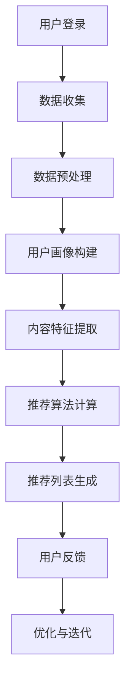

                 

# AI大模型驱动的个性化首页推荐

> **关键词：** AI大模型、个性化推荐、首页、用户行为、机器学习、深度学习、数据处理、算法优化

> **摘要：** 本文将深入探讨基于人工智能的大模型如何驱动个性化首页推荐系统，通过分析用户行为数据和利用先进的机器学习算法，实现首页内容的智能个性化推荐。文章将详细介绍推荐系统的工作原理、核心算法原理、数学模型以及实际项目案例，并探讨其应用场景、工具资源和未来发展趋势。

## 1. 背景介绍

### 1.1 目的和范围

本文旨在探讨如何利用人工智能大模型构建个性化首页推荐系统。个性化推荐系统是现代互联网服务中至关重要的一部分，它通过分析用户行为和历史数据，为每个用户提供个性化的内容推荐，从而提高用户满意度、增强用户体验并提升业务价值。本文将重点讨论以下内容：

1. 推荐系统的基础原理和架构。
2. 人工智能大模型在推荐系统中的应用。
3. 用户行为数据的收集和处理方法。
4. 核心算法原理和数学模型。
5. 实际项目案例和代码实现。
6. 推荐系统的实际应用场景。
7. 相关工具和资源的推荐。

### 1.2 预期读者

本文适合以下读者群体：

1. 对机器学习和深度学习有兴趣的技术爱好者。
2. 想要深入了解个性化推荐系统的开发者。
3. 对人工智能在互联网应用中感兴趣的研究人员。
4. 对首页推荐系统设计和优化有兴趣的学生。

### 1.3 文档结构概述

本文结构如下：

1. 引言：介绍个性化推荐系统的背景和重要性。
2. 核心概念与联系：介绍推荐系统的核心概念和架构。
3. 核心算法原理 & 具体操作步骤：详细讲解推荐算法的原理和步骤。
4. 数学模型和公式 & 详细讲解 & 举例说明：解释推荐系统的数学模型和公式。
5. 项目实战：提供实际项目案例和代码实现。
6. 实际应用场景：讨论推荐系统的应用场景。
7. 工具和资源推荐：推荐学习资源和开发工具。
8. 总结：总结文章的主要观点和未来发展趋势。
9. 附录：常见问题与解答。
10. 扩展阅读 & 参考资料：提供更多相关阅读材料。

### 1.4 术语表

#### 1.4.1 核心术语定义

- **个性化推荐系统**：根据用户的历史行为和偏好，为用户推荐个性化内容。
- **人工智能大模型**：具有巨大参数量和复杂结构的深度学习模型，如GPT、BERT等。
- **用户行为数据**：用户在互联网上的行为记录，包括点击、浏览、搜索等。
- **协同过滤**：一种常见的推荐算法，通过分析用户之间的相似性进行内容推荐。
- **内容推荐**：根据用户兴趣和内容特征进行推荐。

#### 1.4.2 相关概念解释

- **机器学习**：一种人工智能方法，通过训练模型从数据中学习规律和模式。
- **深度学习**：一种特殊的机器学习方法，使用多层神经网络进行学习。
- **用户画像**：基于用户行为和特征生成的用户概要，用于推荐系统的个性化推荐。
- **召回率**：推荐系统中返回的用户感兴趣的内容数量占总用户可能感兴趣内容数量的比例。
- **精确率**：推荐系统中返回的用户感兴趣的内容占总返回内容数量的比例。

#### 1.4.3 缩略词列表

- **GPT**：Generative Pre-trained Transformer，一种基于Transformer的预训练语言模型。
- **BERT**：Bidirectional Encoder Representations from Transformers，一种基于Transformer的双向编码表示模型。
- **IDE**：Integrated Development Environment，集成开发环境。
- **API**：Application Programming Interface，应用程序编程接口。

## 2. 核心概念与联系

### 2.1 推荐系统的核心概念

推荐系统主要包括以下几个核心概念：

- **用户**：推荐系统的核心，每个用户拥有独特的兴趣和偏好。
- **内容**：推荐系统中的数据对象，可以是商品、文章、视频等。
- **评分**：用户对内容的评价，可以是明文评分、点击、浏览等。
- **推荐算法**：根据用户和内容特征进行推荐的核心算法。

### 2.2 推荐系统的架构

推荐系统一般分为以下几个模块：

1. **数据收集模块**：收集用户行为数据和内容特征数据。
2. **数据预处理模块**：对原始数据进行清洗、去重和特征提取。
3. **用户画像模块**：根据用户行为和特征生成用户画像。
4. **推荐算法模块**：根据用户画像和内容特征生成推荐列表。
5. **评价与反馈模块**：评估推荐效果，收集用户反馈进行优化。

### 2.3 推荐系统的流程

推荐系统的一般流程如下：

1. **用户登录**：用户通过登录系统，系统获取用户ID。
2. **数据收集**：系统收集用户的浏览、点击、搜索等行为数据。
3. **数据预处理**：清洗和预处理原始数据，提取用户画像和内容特征。
4. **用户画像构建**：构建用户画像，包括用户兴趣、行为模式等。
5. **内容特征提取**：提取内容特征，如文本、图像等。
6. **推荐算法计算**：利用用户画像和内容特征计算推荐分数。
7. **推荐列表生成**：根据推荐分数生成推荐列表。
8. **用户反馈**：用户对推荐内容进行评价，系统收集反馈数据。
9. **优化与迭代**：根据用户反馈和评估结果优化推荐算法。

### 2.4 Mermaid 流程图

以下是一个简化的推荐系统流程图的 Mermaid 表示：



## 3. 核心算法原理 & 具体操作步骤

### 3.1 推荐算法的基本原理

推荐算法可以分为基于内容的推荐（Content-Based Filtering）和基于协同过滤（Collaborative Filtering）两大类。基于内容的推荐通过分析用户的历史行为和内容特征，为用户推荐相似的内容。基于协同过滤则通过分析用户之间的相似性，推荐其他用户喜欢的相同内容。

### 3.2 基于内容的推荐算法

#### 3.2.1 算法原理

基于内容的推荐算法的基本原理是，如果一个用户对某个物品A感兴趣，那么他可能也对与物品A相似的物品感兴趣。算法的关键步骤包括：

1. 提取物品的特征：对物品进行特征提取，如文本特征、图像特征等。
2. 计算用户兴趣：根据用户的历史行为，计算用户的兴趣向量。
3. 计算相似度：计算物品和用户兴趣向量的相似度。
4. 推荐列表生成：根据相似度排序，生成推荐列表。

#### 3.2.2 具体操作步骤

1. **特征提取**：对每个物品进行特征提取，如使用TF-IDF模型提取文本特征。
2. **用户兴趣计算**：根据用户的历史行为，计算用户的兴趣向量。例如，用户对某类物品的点击次数越多，该类物品的权重越高。
3. **相似度计算**：计算物品和用户兴趣向量的相似度，可以使用余弦相似度或欧氏距离等。
4. **推荐列表生成**：根据相似度排序，生成推荐列表。

#### 3.2.3 伪代码

```python
# 特征提取
def extract_features(item):
    # 提取物品的特征
    return feature_vector

# 用户兴趣计算
def calculate_interest(user):
    # 计算用户的兴趣向量
    return interest_vector

# 相似度计算
def calculate_similarity(feature_vector, interest_vector):
    # 计算相似度
    return similarity_score

# 推荐列表生成
def generate_recommendation_list(user, items, k):
    # 计算用户对每个物品的相似度
    similarity_scores = []
    for item in items:
        feature_vector = extract_features(item)
        similarity_score = calculate_similarity(feature_vector, user.interest_vector)
        similarity_scores.append((item, similarity_score))
    
    # 根据相似度排序，生成推荐列表
    similarity_scores.sort(key=lambda x: x[1], reverse=True)
    return [item for item, _ in similarity_scores[:k]]
```

### 3.3 基于协同过滤的推荐算法

#### 3.3.1 算法原理

基于协同过滤的推荐算法通过分析用户之间的相似性，为用户推荐其他用户喜欢的相同内容。算法的基本原理如下：

1. 计算用户相似度：通过用户评分矩阵计算用户之间的相似度。
2. 邻居选择：选择与目标用户最相似的邻居用户。
3. 推荐列表生成：根据邻居用户的评分，生成推荐列表。

#### 3.3.2 具体操作步骤

1. **用户相似度计算**：计算用户之间的相似度，可以使用余弦相似度或皮尔逊相关系数等。
2. **邻居选择**：选择与目标用户最相似的邻居用户。
3. **推荐列表生成**：根据邻居用户的评分，生成推荐列表。

#### 3.3.3 伪代码

```python
# 用户相似度计算
def calculate_similarity(user1, user2, ratings):
    # 计算用户相似度
    common_ratings = set(ratings[user1].keys()) & set(ratings[user2].keys())
    if not common_ratings:
        return 0
    dot_product = sum(ratings[user1][rating] * ratings[user2][rating] for rating in common_ratings)
    magnitude_product = sqrt(sum(ratings[user1][rating] ** 2 for rating in common_ratings)) * sqrt(sum(ratings[user2][rating] ** 2 for rating in common_ratings))
    return dot_product / magnitude_product

# 推荐列表生成
def generate_recommendation_list(target_user, users, items, k):
    # 计算用户相似度
    similarity_scores = []
    for user in users:
        if user != target_user:
            similarity_score = calculate_similarity(target_user, user, ratings)
            similarity_scores.append((user, similarity_score))
    
    # 根据相似度排序，选择邻居用户
    similarity_scores.sort(key=lambda x: x[1], reverse=True)
    neighbors = [neighbor for neighbor, _ in similarity_scores[:k]]
    
    # 根据邻居用户的评分生成推荐列表
    recommendations = []
    for neighbor in neighbors:
        for item, rating in ratings[neighbor].items():
            if item not in ratings[target_user]:
                recommendations.append((item, rating))
    
    # 根据评分排序，生成推荐列表
    recommendations.sort(key=lambda x: x[1], reverse=True)
    return recommendations[:k]
```

### 3.4 两种推荐算法的融合

为了提高推荐系统的性能，可以将基于内容的推荐和基于协同过滤的推荐算法进行融合。融合的方法包括：

1. **加权融合**：将两种算法的推荐结果进行加权，生成综合推荐列表。
2. **融合模型**：使用深度学习模型，同时考虑内容和用户相似性，生成推荐列表。

#### 3.4.1 加权融合

```python
# 加权融合推荐列表生成
def generate_weighted_recommendation_list(target_user, content_recommendations, collaborative_recommendations, alpha=0.5):
    # 计算综合推荐分数
    recommendation_scores = []
    for item, score in content_recommendations:
        collaborative_score = collaborative_recommendations[item]
        recommendation_scores.append((item, alpha * score + (1 - alpha) * collaborative_score))
    
    # 根据综合推荐分数排序，生成推荐列表
    recommendation_scores.sort(key=lambda x: x[1], reverse=True)
    return [item for item, _ in recommendation_scores]
```

#### 3.4.2 融合模型

```python
# 融合模型推荐列表生成
def generate_fusion_model_recommendation_list(target_user, content_model, collaborative_model, items, k):
    # 获取内容模型的推荐列表
    content_recommendations = content_model.generate_recommendations(target_user, items)
    
    # 获取协同过滤模型的推荐列表
    collaborative_recommendations = collaborative_model.generate_recommendations(target_user, items)
    
    # 计算综合推荐分数
    recommendation_scores = []
    for item in items:
        content_score = content_recommendations[item]
        collaborative_score = collaborative_recommendations[item]
        recommendation_scores.append((item, content_score + collaborative_score))
    
    # 根据综合推荐分数排序，生成推荐列表
    recommendation_scores.sort(key=lambda x: x[1], reverse=True)
    return [item for item, _ in recommendation_scores[:k]]
```

## 4. 数学模型和公式 & 详细讲解 & 举例说明

### 4.1 基于内容的推荐模型

基于内容的推荐模型通常使用向量空间模型（Vector Space Model）来表示用户兴趣和物品特征。假设用户兴趣向量为 \( \mathbf{u} \)，物品特征向量为 \( \mathbf{v}_i \)，则用户对物品 \( i \) 的兴趣度可以通过计算向量之间的余弦相似度来衡量：

$$
\text{similarity}(\mathbf{u}, \mathbf{v}_i) = \cos(\mathbf{u}, \mathbf{v}_i) = \frac{\mathbf{u} \cdot \mathbf{v}_i}{\|\mathbf{u}\| \|\mathbf{v}_i\|}
$$

其中，\( \mathbf{u} \cdot \mathbf{v}_i \) 表示向量点积，\( \|\mathbf{u}\| \) 和 \( \|\mathbf{v}_i\| \) 分别表示向量的模长。

#### 4.1.1 举例说明

假设用户兴趣向量 \( \mathbf{u} = (1, 2, 3) \)，物品特征向量 \( \mathbf{v}_i = (4, 5, 6) \)，则：

$$
\text{similarity}(\mathbf{u}, \mathbf{v}_i) = \frac{1 \cdot 4 + 2 \cdot 5 + 3 \cdot 6}{\sqrt{1^2 + 2^2 + 3^2} \sqrt{4^2 + 5^2 + 6^2}} = \frac{4 + 10 + 18}{\sqrt{14} \sqrt{97}} \approx 0.977
$$

这意味着用户对物品 \( i \) 具有较高的兴趣。

### 4.2 基于协同过滤的推荐模型

基于协同过滤的推荐模型通常使用用户评分矩阵 \( R \) 来表示用户对物品的评分。用户 \( i \) 对物品 \( j \) 的评分 \( r_{ij} \) 可以通过以下线性回归模型预测：

$$
r_{ij} = \mu + u_i + v_j + \epsilon_{ij}
$$

其中，\( \mu \) 表示用户平均值，\( u_i \) 和 \( v_j \) 分别表示用户 \( i \) 和物品 \( j \) 的隐含特征向量，\( \epsilon_{ij} \) 表示误差项。

#### 4.2.1 举例说明

假设我们有以下用户评分矩阵 \( R \)：

|   | 1 | 2 | 3 |
|---|---|---|---|
| 1 | 4 | 5 | 3 |
| 2 | 3 | 4 | 5 |
| 3 | 5 | 2 | 4 |

我们可以通过最小二乘法来估计用户和物品的隐含特征向量。例如，对于用户 1 和物品 3，我们有：

$$
r_{13} = \mu + u_1 + v_3 + \epsilon_{13}
$$

代入已知数据，得到：

$$
3 = \mu + u_1 + v_3 + \epsilon_{13}
$$

假设用户平均值 \( \mu = 4 \)，我们可以通过解线性方程组来估计 \( u_1 \) 和 \( v_3 \)：

$$
u_1 = 3 - \mu - v_3 - \epsilon_{13}
$$

类似地，我们可以估计其他用户和物品的隐含特征向量。

### 4.3 融合模型

融合模型通常结合了基于内容的推荐模型和基于协同过滤的推荐模型，以充分利用两者各自的优势。假设我们有基于内容的推荐分数 \( c_{ij} \) 和基于协同过滤的推荐分数 \( s_{ij} \)，则融合模型可以表示为：

$$
r_{ij} = \alpha c_{ij} + (1 - \alpha) s_{ij}
$$

其中，\( \alpha \) 是融合系数，通常通过交叉验证来确定。

#### 4.3.1 举例说明

假设基于内容的推荐分数为 \( c_{ij} = 0.8 \)，基于协同过滤的推荐分数为 \( s_{ij} = 0.6 \)，融合系数 \( \alpha = 0.5 \)，则：

$$
r_{ij} = 0.5 \cdot 0.8 + 0.5 \cdot 0.6 = 0.7
$$

这意味着物品 \( i \) 对用户 \( j \) 的推荐分数为 0.7。

## 5. 项目实战：代码实际案例和详细解释说明

### 5.1 开发环境搭建

在开始编写代码之前，我们需要搭建一个合适的开发环境。以下是在Python环境下搭建推荐系统开发环境的基本步骤：

1. **安装Python**：确保Python环境已安装，版本建议为3.8或更高。
2. **安装依赖库**：安装必要的Python库，包括NumPy、Pandas、Scikit-learn、Matplotlib等。可以使用以下命令进行安装：

   ```bash
   pip install numpy pandas scikit-learn matplotlib
   ```

3. **配置环境变量**：确保Python环境变量已配置，以便在终端中运行Python脚本。

### 5.2 源代码详细实现和代码解读

以下是一个简单的基于内容的推荐系统实现示例，我们将使用用户的历史行为数据来推荐电影。

```python
import numpy as np
import pandas as pd
from sklearn.feature_extraction.text import TfidfVectorizer
from sklearn.metrics.pairwise import cosine_similarity

# 5.2.1 数据准备
# 假设我们有一个CSV文件，其中包含用户ID、电影标题和电影描述
data = pd.read_csv('movie_data.csv')

# 提取用户ID、电影标题和电影描述
users, movies, descriptions = data['user_id'], data['movie_title'], data['description']

# 5.2.2 特征提取
# 使用TF-IDF模型提取描述的特征向量
tfidf_vectorizer = TfidfVectorizer()
description_vectors = tfidf_vectorizer.fit_transform(descriptions)

# 5.2.3 计算相似度
# 计算每部电影与其他电影的相似度
similarity_matrix = cosine_similarity(description_vectors)

# 5.2.4 推荐列表生成
# 假设我们要为用户ID为5的用户推荐5部电影
user_id = 5
user_interest_vector = description_vectors[users == user_id]

# 计算每部电影与用户兴趣向量的相似度
similarity_scores = similarity_matrix[user_interest_vector]

# 生成推荐列表
recommendations = movies[similarity_scores.argsort()[0][-5:][::-1]]

print("推荐的五部电影：", recommendations)

# 5.2.5 结果可视化
import matplotlib.pyplot as plt

plt.figure(figsize=(10, 6))
plt.title('电影相似度矩阵热力图')
plt.imshow(similarity_matrix, cmap='hot', interpolation='nearest')
plt.colorbar()
plt.xticks(range(len(movies)), movies, rotation=90)
plt.yticks(range(len(movies)), movies)
plt.show()
```

### 5.3 代码解读与分析

上述代码实现了一个简单的基于内容的推荐系统，主要分为以下几个步骤：

1. **数据准备**：从CSV文件中读取用户ID、电影标题和电影描述。
2. **特征提取**：使用TF-IDF模型提取电影描述的特征向量。
3. **计算相似度**：计算每部电影与其他电影的相似度，生成相似度矩阵。
4. **推荐列表生成**：根据用户兴趣向量计算与每部电影的相似度，生成推荐列表。
5. **结果可视化**：使用热力图可视化相似度矩阵。

### 5.4 运行与测试

在运行代码之前，确保已准备好包含用户ID、电影标题和电影描述的CSV文件。以下是运行代码的步骤：

1. 将代码保存为 `content_based_recommendation.py`。
2. 在终端中执行以下命令：

   ```bash
   python content_based_recommendation.py
   ```

3. 代码将输出为用户ID为5推荐的五部电影。

4. 执行结果可视化部分，将显示一个热力图，展示电影之间的相似度。

## 6. 实际应用场景

推荐系统在现代互联网应用中具有广泛的应用场景，以下是一些典型的应用案例：

1. **电子商务**：电子商务平台使用推荐系统向用户推荐商品，提高销售转化率和客户满意度。
2. **社交媒体**：社交媒体平台利用推荐系统向用户推荐感兴趣的内容，如文章、视频、音乐等，以增加用户粘性和活跃度。
3. **在线视频平台**：在线视频平台如YouTube和Netflix使用推荐系统为用户提供个性化视频推荐，提高用户观看时间和平台收益。
4. **新闻媒体**：新闻媒体平台使用推荐系统为用户提供个性化新闻推荐，提高用户阅读量和平台影响力。
5. **音乐平台**：音乐平台如Spotify和Apple Music使用推荐系统为用户提供个性化音乐推荐，提高用户听歌时间和平台收益。

### 6.1 推荐系统在电子商务的应用

在电子商务领域，推荐系统主要用于以下方面：

1. **商品推荐**：根据用户历史购买和浏览记录，推荐用户可能感兴趣的商品。
2. **营销推广**：为用户推荐相关的促销活动和优惠券，提高用户购买意愿。
3. **库存管理**：通过预测商品销售趋势，优化库存管理，减少库存积压和库存过剩。

### 6.2 推荐系统在社交媒体的应用

在社交媒体领域，推荐系统主要用于以下方面：

1. **内容推荐**：根据用户兴趣和行为，推荐用户可能感兴趣的内容，如文章、视频、音乐等。
2. **社交圈推荐**：根据用户社交关系，推荐用户可能感兴趣的新朋友和群组。
3. **广告推荐**：为用户推荐与用户兴趣相关的广告，提高广告投放效果。

### 6.3 推荐系统在在线视频平台的应用

在在线视频平台领域，推荐系统主要用于以下方面：

1. **视频推荐**：根据用户观看历史和偏好，推荐用户可能感兴趣的视频。
2. **个性化推荐**：为用户推荐个性化播放列表，提高用户观看时间和平台收益。
3. **内容优化**：通过分析用户行为数据，优化视频内容推荐策略，提高用户体验和平台满意度。

### 6.4 推荐系统在新闻媒体的应用

在新闻媒体领域，推荐系统主要用于以下方面：

1. **新闻推荐**：根据用户阅读历史和偏好，推荐用户可能感兴趣的新闻。
2. **热点话题**：为用户提供热点话题和热门新闻，提高用户阅读量和平台影响力。
3. **内容推荐**：根据用户兴趣和行为，为用户推荐相关的评论、专栏和图片新闻。

### 6.5 推荐系统在音乐平台的应用

在音乐平台领域，推荐系统主要用于以下方面：

1. **音乐推荐**：根据用户听歌历史和偏好，推荐用户可能感兴趣的音乐。
2. **个性化播放列表**：为用户推荐个性化播放列表，提高用户听歌时间和平台收益。
3. **音乐推荐引擎**：通过分析用户行为数据，构建音乐推荐引擎，优化音乐推荐效果。

## 7. 工具和资源推荐

### 7.1 学习资源推荐

#### 7.1.1 书籍推荐

- **《推荐系统实践》**：这本书详细介绍了推荐系统的理论基础和实际应用，适合初学者和从业者。
- **《机器学习》**：这是一本经典的机器学习教材，涵盖了机器学习的理论基础和算法实现，适合有一定编程基础的读者。

#### 7.1.2 在线课程

- **Coursera上的《推荐系统》**：这是一门由斯坦福大学提供的在线课程，涵盖了推荐系统的理论基础和实际应用，适合初学者和从业者。
- **Udacity上的《深度学习工程师纳米学位》**：这个课程涵盖了深度学习的基础知识和应用，适合想要深入了解深度学习的读者。

#### 7.1.3 技术博客和网站

- **Medium上的《机器学习》**：这个网站提供了大量的机器学习和推荐系统相关的文章和教程，适合读者学习和参考。
- **ArXiv.org**：这是一个计算机科学和机器学习的论文数据库，读者可以在这里找到最新的研究论文。

### 7.2 开发工具框架推荐

#### 7.2.1 IDE和编辑器

- **PyCharm**：这是一款功能强大的Python IDE，适合编写和调试推荐系统代码。
- **Jupyter Notebook**：这是一个基于Web的交互式计算环境，适合进行数据分析和原型设计。

#### 7.2.2 调试和性能分析工具

- **Python Debuger**：这是一个用于调试Python代码的工具，可以帮助开发者快速定位和修复代码中的错误。
- **Py-Spy**：这是一个Python性能分析工具，可以帮助开发者分析代码的性能瓶颈。

#### 7.2.3 相关框架和库

- **Scikit-learn**：这是一个开源的机器学习库，提供了丰富的推荐系统算法和工具。
- **TensorFlow**：这是一个开源的深度学习库，支持构建复杂的深度学习模型。

### 7.3 相关论文著作推荐

#### 7.3.1 经典论文

- **"Collaborative Filtering for the Net"**：这篇论文提出了协同过滤算法，是推荐系统领域的重要基础论文。
- **"User Modeling for Adaptive Hypermedia"**：这篇论文探讨了用户建模在自适应超媒体系统中的应用，为推荐系统提供了理论基础。

#### 7.3.2 最新研究成果

- **"Deep Neural Networks for YouTube Recommendations"**：这篇论文介绍了深度神经网络在YouTube推荐系统中的应用，展示了深度学习在推荐系统中的优势。
- **"Neural Collaborative Filtering"**：这篇论文提出了神经协同过滤算法，将深度学习引入推荐系统，提高了推荐效果。

#### 7.3.3 应用案例分析

- **"Recommendation Systems at Netflix"**：这篇论文详细介绍了Netflix推荐系统的架构和实现，为其他平台提供了有益的参考。
- **"Improving YouTube's Recommendation System with Deep Learning"**：这篇论文展示了YouTube如何使用深度学习改进推荐系统，提高了用户体验和平台收益。

## 8. 总结：未来发展趋势与挑战

随着人工智能技术的不断进步，推荐系统在未来的发展趋势和挑战如下：

### 8.1 发展趋势

1. **深度学习**：深度学习在推荐系统中的应用越来越广泛，如神经协同过滤和深度神经网络推荐算法。
2. **用户建模**：基于用户行为和兴趣的精细化用户建模，将提高推荐系统的个性化推荐能力。
3. **多模态推荐**：结合文本、图像、音频等多种数据类型的推荐系统，将提供更丰富的推荐体验。
4. **实时推荐**：利用实时数据处理技术，实现实时推荐，提高用户满意度。
5. **社交推荐**：结合社交网络数据，提高推荐系统的社交属性，增强用户互动和社区建设。

### 8.2 挑战

1. **数据隐私与安全**：如何在保护用户隐私的前提下，充分利用用户行为数据，是一个重要的挑战。
2. **冷启动问题**：如何为新人或新商品提供有效的推荐，是一个亟待解决的难题。
3. **推荐效果评估**：如何评价推荐系统的效果，如何平衡推荐系统的准确性和多样性，是一个重要的挑战。
4. **模型可解释性**：随着模型复杂度的增加，如何解释模型的决策过程，提高模型的透明度和可解释性，是一个重要的研究方向。
5. **算法公平性**：如何确保推荐算法的公平性，避免算法偏见，是一个重要的社会问题。

## 9. 附录：常见问题与解答

### 9.1 个性化推荐系统是什么？

个性化推荐系统是一种基于用户行为和历史数据，为用户推荐个性化内容的技术。通过分析用户兴趣和行为，推荐系统可以根据用户的偏好提供定制化的推荐。

### 9.2 常见的推荐算法有哪些？

常见的推荐算法包括基于内容的推荐、基于协同过滤的推荐和基于模型的推荐。基于内容的推荐通过分析用户兴趣和内容特征进行推荐；基于协同过滤的推荐通过分析用户之间的相似性进行推荐；基于模型的推荐则通过构建机器学习模型进行推荐。

### 9.3 如何评估推荐系统的效果？

推荐系统的效果可以通过以下指标进行评估：

- **准确率（Precision）**：推荐系统中返回的用户感兴趣的内容占总返回内容数量的比例。
- **召回率（Recall）**：推荐系统中返回的用户感兴趣的内容数量占总用户可能感兴趣内容数量的比例。
- **F1值（F1 Score）**：综合考虑准确率和召回率的综合评价指标。
- **覆盖率（Coverage）**：推荐系统覆盖到的内容多样性。
- **新颖度（Novelty）**：推荐系统推荐的新内容比例。

### 9.4 推荐系统中的冷启动问题如何解决？

冷启动问题是指为新用户或新商品提供有效推荐的问题。常见的解决方法包括：

- **基于内容的推荐**：通过分析新用户的历史行为和商品特征，为新用户提供个性化推荐。
- **基于模型的推荐**：通过构建用户兴趣模型和新商品特征模型，为新用户提供推荐。
- **基于社会化网络**：利用用户社交网络关系，为新用户提供推荐。

### 9.5 推荐系统中的数据隐私问题如何解决？

推荐系统中的数据隐私问题可以通过以下方法解决：

- **数据加密**：对用户数据进行加密处理，确保数据安全。
- **数据脱敏**：对敏感数据进行脱敏处理，防止隐私泄露。
- **匿名化**：对用户数据进行匿名化处理，保护用户隐私。
- **数据共享协议**：制定数据共享协议，确保数据使用合法合规。

## 10. 扩展阅读 & 参考资料

为了更深入地了解个性化推荐系统，以下是一些推荐阅读材料：

- **《推荐系统实践》**：本书详细介绍了推荐系统的理论基础和实际应用，适合初学者和从业者。
- **《机器学习》**：这是一本经典的机器学习教材，涵盖了机器学习的理论基础和算法实现，适合有一定编程基础的读者。
- **《深度学习》**：本书详细介绍了深度学习的理论基础和算法实现，适合对深度学习有兴趣的读者。
- **《推荐系统设计与评估》**：本书介绍了推荐系统设计的原则和评估方法，适合想要深入了解推荐系统设计和评估的读者。

此外，以下网站和论文提供了更多的学习资源和研究成果：

- **Coursera上的《推荐系统》**：这是一门由斯坦福大学提供的在线课程，涵盖了推荐系统的理论基础和实际应用。
- **Udacity上的《深度学习工程师纳米学位》**：这个课程涵盖了深度学习的基础知识和应用。
- **ArXiv.org**：这是一个计算机科学和机器学习的论文数据库，读者可以在这里找到最新的研究论文。
- **"Deep Neural Networks for YouTube Recommendations"**：这篇论文介绍了深度神经网络在YouTube推荐系统中的应用。
- **"Neural Collaborative Filtering"**：这篇论文提出了神经协同过滤算法，将深度学习引入推荐系统。

