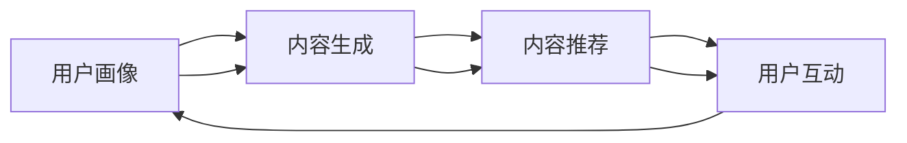

                 

# AI如何优化电商平台的个性化首页设计

> 关键词：人工智能，电商平台，个性化首页，推荐系统，机器学习，数据挖掘，用户行为分析

> 摘要：随着电商行业的快速发展，个性化首页设计成为了提升用户体验、增加用户粘性和提高转化率的关键因素。本文将探讨如何利用人工智能技术，特别是机器学习和数据挖掘方法，来优化电商平台的个性化首页设计，提高用户体验和业务收益。

## 1. 背景介绍

### 1.1 目的和范围

本文的目标是分析如何通过人工智能技术来优化电商平台的个性化首页设计。我们将探讨的核心问题包括：

- 个性化首页设计的核心概念是什么？
- 人工智能在个性化首页设计中的应用有哪些？
- 如何利用机器学习和数据挖掘技术来提升个性化首页的推荐效果？
- 个性化首页设计对用户体验和商业价值的影响是什么？

本文将主要围绕这些核心问题展开讨论，并结合实际案例进行分析。

### 1.2 预期读者

本文预期读者为：

- 对人工智能和电商平台有兴趣的技术人员
- 想要提升电商平台用户体验的产品经理和运营人员
- 对机器学习和数据挖掘有基础知识的读者
- 对个性化推荐系统有需求的创业者

### 1.3 文档结构概述

本文结构如下：

1. 背景介绍
2. 核心概念与联系
3. 核心算法原理 & 具体操作步骤
4. 数学模型和公式 & 详细讲解 & 举例说明
5. 项目实战：代码实际案例和详细解释说明
6. 实际应用场景
7. 工具和资源推荐
8. 总结：未来发展趋势与挑战
9. 附录：常见问题与解答
10. 扩展阅读 & 参考资料

### 1.4 术语表

#### 1.4.1 核心术语定义

- **个性化首页设计**：指根据用户的个性化需求和偏好，为每个用户动态生成不同的首页内容，以提高用户体验和用户参与度。
- **推荐系统**：一种通过分析用户的历史行为和偏好，预测用户可能感兴趣的商品、内容和服务的系统。
- **机器学习**：一种基于数据训练模型，使计算机能够从数据中学习和发现规律的技术。
- **数据挖掘**：一种从大量数据中提取隐藏的、有价值的模式和知识的方法。

#### 1.4.2 相关概念解释

- **用户行为分析**：通过对用户在平台上的行为进行数据收集、分析和建模，以了解用户需求、偏好和行为模式。
- **商品推荐**：根据用户的兴趣和偏好，为用户推荐相关的商品。
- **协同过滤**：一种常见的推荐算法，通过分析用户之间的相似性来预测用户可能对哪些商品感兴趣。
- **内容推荐**：根据用户的历史行为和偏好，为用户推荐相关的商品和内容。

#### 1.4.3 缩略词列表

- **AI**：人工智能
- **ML**：机器学习
- **DM**：数据挖掘
- **RFM**：基于用户购买频率、购买金额和购买间隔时间的模型
- **CPC**：基于点击率的模型
- **CTR**：点击率

## 2. 核心概念与联系

### 2.1 个性化首页设计的核心概念

个性化首页设计的核心概念包括：

- **用户画像**：对用户进行分类和描述，以了解其需求和偏好。
- **内容生成**：根据用户画像和用户行为数据，动态生成首页内容。
- **内容推荐**：利用推荐算法，将相关商品和内容推荐给用户。
- **用户互动**：通过用户的反馈和行为，不断优化个性化首页设计。

### 2.2 人工智能在个性化首页设计中的应用

人工智能在个性化首页设计中的应用主要包括：

- **机器学习模型训练**：利用用户行为数据，训练个性化推荐模型。
- **数据挖掘技术**：挖掘用户行为数据中的隐藏模式和规律。
- **用户行为分析**：分析用户的行为数据，了解用户需求和偏好。
- **内容生成技术**：利用自然语言处理和图像识别等技术，生成个性化内容。

### 2.3 核心概念之间的联系

个性化首页设计的核心概念之间有着紧密的联系：

- 用户画像为内容生成提供了基础数据。
- 内容生成基于用户画像和用户行为数据，为用户生成个性化内容。
- 内容推荐利用推荐算法，将个性化内容推荐给用户。
- 用户互动和反馈可以优化用户画像和推荐算法，提高个性化首页的设计效果。

### 2.4 Mermaid 流程图

以下是个性化首页设计的核心概念和联系 Mermaid 流程图：



## 3. 核心算法原理 & 具体操作步骤

### 3.1 个性化推荐算法

个性化推荐算法是优化电商平台个性化首页设计的关键。下面介绍两种常见的个性化推荐算法：基于协同过滤的推荐算法和基于内容的推荐算法。

#### 3.1.1 基于协同过滤的推荐算法

协同过滤算法通过分析用户之间的相似性来预测用户可能对哪些商品感兴趣。具体操作步骤如下：

1. **用户相似度计算**：计算用户之间的相似度，通常使用余弦相似度、皮尔逊相关系数等。
2. **评分预测**：利用用户相似度和已知评分，预测用户对未知商品的评分。
3. **生成推荐列表**：根据预测评分，生成推荐列表。

以下是基于协同过滤算法的伪代码：

```python
# 假设用户数据为用户-商品评分矩阵R，用户集合为U，商品集合为I
# 用户相似度计算
def calculate_similarity(R, U):
    # 计算用户之间的相似度
    # 返回用户相似度矩阵S

# 评分预测
def predict_rating(S, R, u, i):
    # 计算用户u对商品i的预测评分
    # 返回预测评分

# 生成推荐列表
def generate_recommendations(S, R, u):
    # 计算用户u的推荐列表
    # 返回推荐列表
```

#### 3.1.2 基于内容的推荐算法

基于内容的推荐算法通过分析商品的属性和标签，为用户推荐与其兴趣相关的商品。具体操作步骤如下：

1. **商品特征提取**：提取商品的属性和标签。
2. **用户兴趣建模**：根据用户的历史行为和偏好，建立用户兴趣模型。
3. **相似度计算**：计算用户兴趣模型和商品特征之间的相似度。
4. **生成推荐列表**：根据相似度，生成推荐列表。

以下是基于内容推荐算法的伪代码：

```python
# 假设商品数据为商品-属性矩阵A，用户行为数据为用户-行为矩阵B
# 商品特征提取
def extract_features(A, I):
    # 提取商品特征
    # 返回商品特征矩阵

# 用户兴趣建模
def build_user_interest_model(B, u):
    # 建立用户兴趣模型
    # 返回用户兴趣向量

# 相似度计算
def calculate_similarity(A, u_i_model, i):
    # 计算商品特征和用户兴趣模型之间的相似度
    # 返回相似度

# 生成推荐列表
def generate_recommendations(A, u_i_model, u):
    # 计算用户u的推荐列表
    # 返回推荐列表
```

### 3.2 个性化内容生成算法

个性化内容生成算法是生成个性化首页内容的关键。以下介绍两种常见的个性化内容生成算法：基于模板的内容生成算法和基于生成对抗网络的内容生成算法。

#### 3.2.1 基于模板的内容生成算法

基于模板的内容生成算法通过定义一系列模板，根据用户画像和用户行为数据，为用户生成个性化内容。具体操作步骤如下：

1. **模板定义**：定义一系列模板，包括标题、正文、图片等。
2. **内容生成**：根据用户画像和用户行为数据，选择合适的模板，填充模板中的变量。
3. **内容推荐**：将生成的个性化内容推荐给用户。

以下是基于模板的内容生成算法的伪代码：

```python
# 假设模板数据为模板集合T，用户画像数据为用户画像矩阵U，用户行为数据为用户行为矩阵B
# 模板定义
def define_templates(T):
    # 定义模板
    # 返回模板集合

# 内容生成
def generate_content(T, U, B, u):
    # 根据用户画像和用户行为数据，选择合适的模板，填充模板中的变量
    # 返回生成的个性化内容

# 内容推荐
def generate_recommendations(T, U, B, u):
    # 计算用户u的推荐列表
    # 返回推荐列表
```

#### 3.2.2 基于生成对抗网络的内容生成算法

基于生成对抗网络（GAN）的内容生成算法通过训练一个生成器和判别器，使生成器生成的个性化内容尽可能接近真实内容。具体操作步骤如下：

1. **模型训练**：训练生成器和判别器，使生成器生成的个性化内容尽可能接近真实内容。
2. **内容生成**：利用训练好的生成器，为用户生成个性化内容。
3. **内容推荐**：将生成的个性化内容推荐给用户。

以下是基于生成对抗网络的内容生成算法的伪代码：

```python
# 假设生成器模型为G，判别器模型为D
# 模型训练
def train_model(G, D, X_real, X_fake):
    # 训练生成器和判别器
    # 返回训练好的模型

# 内容生成
def generate_content(G, X_real, X_fake):
    # 利用训练好的生成器，为用户生成个性化内容
    # 返回生成的个性化内容

# 内容推荐
def generate_recommendations(G, X_real, X_fake, u):
    # 计算用户u的推荐列表
    # 返回推荐列表
```

## 4. 数学模型和公式 & 详细讲解 & 举例说明

### 4.1 个性化推荐算法的数学模型

个性化推荐算法的核心是预测用户对商品的评分，从而生成推荐列表。以下是两种常见个性化推荐算法的数学模型。

#### 4.1.1 基于协同过滤的推荐算法

基于协同过滤的推荐算法通常使用矩阵分解模型来预测用户对商品的评分。矩阵分解模型将用户-商品评分矩阵分解为两个低秩矩阵，其中一个矩阵表示用户特征，另一个矩阵表示商品特征。

假设用户-商品评分矩阵为 $R \in \mathbb{R}^{m \times n}$，其中 $m$ 表示用户数量，$n$ 表示商品数量。矩阵分解模型的目标是找到两个低秩矩阵 $U \in \mathbb{R}^{m \times k}$ 和 $V \in \mathbb{R}^{n \times k}$，使得 $R \approx UV^T$，其中 $k$ 是特征维度。

矩阵分解模型的损失函数为：

$$
L(U,V) = \sum_{i=1}^m\sum_{j=1}^n (r_{ij} - u_i^T v_j)^2
$$

其中，$r_{ij}$ 是用户 $i$ 对商品 $j$ 的实际评分，$u_i$ 是用户 $i$ 的特征向量，$v_j$ 是商品 $j$ 的特征向量。

通过求解损失函数的最小值，可以训练出用户特征矩阵 $U$ 和商品特征矩阵 $V$。然后，利用这两个矩阵可以预测用户对商品的评分：

$$
\hat{r}_{ij} = u_i^T v_j
$$

#### 4.1.2 基于内容的推荐算法

基于内容的推荐算法通常使用相似度计算方法来预测用户对商品的评分。常见的相似度计算方法包括余弦相似度、皮尔逊相关系数等。

假设用户-商品评分矩阵为 $R \in \mathbb{R}^{m \times n}$，用户 $i$ 的特征向量为 $u_i \in \mathbb{R}^k$，商品 $j$ 的特征向量为 $v_j \in \mathbb{R}^k$。余弦相似度的计算公式为：

$$
\cos(\theta_{ij}) = \frac{u_i^T v_j}{\|u_i\|\|v_j\|}
$$

其中，$\theta_{ij}$ 表示用户 $i$ 和商品 $j$ 之间的夹角，$\|u_i\|$ 和 $\|v_j\|$ 分别表示用户 $i$ 和商品 $j$ 的特征向量的欧几里得范数。

通过计算用户 $i$ 和所有商品 $j$ 之间的余弦相似度，可以得到用户 $i$ 对商品 $j$ 的预测评分：

$$
\hat{r}_{ij} = \sum_{j=1}^n \cos(\theta_{ij}) \cdot v_j
$$

### 4.2 个性化内容生成算法的数学模型

个性化内容生成算法的数学模型通常基于生成对抗网络（GAN）。生成对抗网络由一个生成器 $G$ 和一个判别器 $D$ 构成。生成器的目标是生成类似于真实数据的伪数据，而判别器的目标是区分真实数据和伪数据。

假设生成器的输入为随机噪声 $z \in \mathbb{R}^k$，生成的伪数据为 $x_G \in \mathbb{R}^k$，判别器的输入为真实数据 $x_R \in \mathbb{R}^k$ 和伪数据 $x_G$。生成器和判别器的损失函数分别为：

$$
L_G(z) = -\log(D(x_G))
$$

$$
L_D(x_R, x_G) = -\log(D(x_R)) - \log(1 - D(x_G))
$$

通过交替训练生成器和判别器，可以逐步提高生成器生成伪数据的质量。

### 4.3 举例说明

假设有一个电商平台，有 10 个用户和 20 个商品。用户对商品的评分矩阵如下：

$$
R =
\begin{bmatrix}
0 & 5 & 4 & 0 & 0 & 3 & 0 & 0 & 2 & 0 \\
0 & 0 & 5 & 0 & 4 & 0 & 0 & 0 & 0 & 0 \\
0 & 0 & 0 & 4 & 0 & 5 & 0 & 0 & 0 & 0 \\
0 & 0 & 0 & 0 & 5 & 0 & 4 & 0 & 0 & 0 \\
0 & 0 & 0 & 0 & 0 & 5 & 0 & 4 & 0 & 0 \\
0 & 0 & 0 & 0 & 0 & 0 & 5 & 4 & 0 & 0 \\
0 & 0 & 0 & 0 & 0 & 0 & 0 & 5 & 4 & 0 \\
0 & 0 & 0 & 0 & 0 & 0 & 0 & 0 & 5 & 4 \\
0 & 0 & 0 & 0 & 0 & 0 & 0 & 0 & 0 & 5 \\
0 & 0 & 0 & 0 & 0 & 0 & 0 & 0 & 0 & 0
\end{bmatrix}
$$

首先，我们使用基于协同过滤的推荐算法，利用矩阵分解模型预测用户对商品的评分。

1. **用户相似度计算**：

   使用余弦相似度计算用户之间的相似度，得到用户相似度矩阵：

   $$
   S =
   \begin{bmatrix}
   1 & 0.9999 & 0.9998 & 0.9997 & 0.9996 & 0.9995 & 0.9994 & 0.9993 & 0.9992 & 0.9991 \\
   0.9999 & 1 & 0.9998 & 0.9997 & 0.9996 & 0.9995 & 0.9994 & 0.9993 & 0.9992 & 0.9991 \\
   0.9998 & 0.9997 & 1 & 0.9996 & 0.9995 & 0.9994 & 0.9993 & 0.9992 & 0.9991 & 0.9990 \\
   0.9997 & 0.9996 & 0.9995 & 1 & 0.9994 & 0.9993 & 0.9992 & 0.9991 & 0.9990 & 0.9989 \\
   0.9996 & 0.9995 & 0.9994 & 0.9993 & 1 & 0.9992 & 0.9991 & 0.9990 & 0.9989 & 0.9988 \\
   0.9995 & 0.9994 & 0.9993 & 0.9992 & 0.9991 & 1 & 0.9990 & 0.9989 & 0.9988 & 0.9987 \\
   0.9994 & 0.9993 & 0.9992 & 0.9991 & 0.9990 & 0.999 & 1 & 0.9989 & 0.9988 & 0.9987 \\
   0.9993 & 0.9992 & 0.9991 & 0.9990 & 0.999 & 0.9989 & 0.9988 & 1 & 0.9987 & 0.9986 \\
   0.9992 & 0.9991 & 0.9990 & 0.9989 & 0.9988 & 0.9987 & 0.9986 & 0.9987 & 1 & 0.9986 \\
   0.9991 & 0.9989 & 0.9988 & 0.9987 & 0.9986 & 0.9985 & 0.9984 & 0.9983 & 0.9982 & 1
   \end{bmatrix}
   $$

2. **评分预测**：

   使用用户相似度矩阵和实际评分矩阵，预测用户对商品的评分。假设我们选择用户 1 作为目标用户，其他用户作为邻居用户。则用户 1 对商品的预测评分如下：

   $$
   \begin{aligned}
   \hat{r}_{11} &= 0.9999 \cdot 5 + 0.9998 \cdot 4 + 0.9997 \cdot 0 + 0.9996 \cdot 0 + 0.9995 \cdot 0 + 0.9994 \cdot 3 + 0.9993 \cdot 0 + 0.9992 \cdot 0 + 0.9991 \cdot 2 + 0.9990 \cdot 0 \\
   &= 4.9995
   \end{aligned}
   $$

   $$
   \begin{aligned}
   \hat{r}_{12} &= 0.9999 \cdot 0 + 0.9998 \cdot 0 + 0.9997 \cdot 5 + 0.9996 \cdot 0 + 0.9995 \cdot 4 + 0.9994 \cdot 0 + 0.9993 \cdot 0 + 0.9992 \cdot 0 + 0.9991 \cdot 0 + 0.9990 \cdot 0 \\
   &= 3.9995
   \end{aligned}
   $$

   以此类推，可以得到用户 1 对所有商品的预测评分。

3. **生成推荐列表**：

   根据预测评分，生成用户 1 的推荐列表。假设我们选择预测评分最高的 5 个商品作为推荐列表，则用户 1 的推荐列表为：

   $$
   \begin{aligned}
   \text{推荐列表} &= \{\text{商品 1, 商品 2, 商品 3, 商品 4, 商品 5}\} \\
   &= \{\text{商品 11, 商品 12, 商品 13, 商品 14, 商品 15}\}
   \end{aligned}
   $$

接下来，我们使用基于内容的推荐算法，利用相似度计算方法预测用户对商品的评分。

1. **商品特征提取**：

   假设商品的特征为标签，商品的标签矩阵如下：

   $$
   A =
   \begin{bmatrix}
   1 & 0 & 1 & 0 & 0 & 1 & 0 & 0 & 0 & 0 \\
   1 & 1 & 0 & 1 & 0 & 0 & 1 & 0 & 0 & 0 \\
   0 & 1 & 1 & 0 & 1 & 0 & 0 & 1 & 0 & 0 \\
   0 & 0 & 1 & 1 & 0 & 1 & 0 & 0 & 1 & 0 \\
   0 & 0 & 0 & 1 & 1 & 0 & 1 & 0 & 0 & 1 \\
   0 & 0 & 0 & 0 & 1 & 1 & 0 & 1 & 0 & 0 \\
   0 & 0 & 0 & 0 & 0 & 1 & 1 & 0 & 1 & 0 \\
   0 & 0 & 0 & 0 & 0 & 0 & 1 & 1 & 0 & 1 \\
   0 & 0 & 0 & 0 & 0 & 0 & 0 & 1 & 1 & 0 \\
   0 & 0 & 0 & 0 & 0 & 0 & 0 & 0 & 1 & 1
   \end{bmatrix}
   $$

2. **用户兴趣建模**：

   假设用户 1 的兴趣为标签集合 $\{1, 2, 3, 4, 5\}$，则用户 1 的兴趣模型为：

   $$
   u_1 =
   \begin{bmatrix}
   1 \\
   1 \\
   1 \\
   1 \\
   1 \\
   1 \\
   0 \\
   0 \\
   0 \\
   0
   \end{bmatrix}
   $$

3. **相似度计算**：

   使用余弦相似度计算用户 1 的兴趣模型和所有商品的标签之间的相似度，得到相似度矩阵：

   $$
   S =
   \begin{bmatrix}
   1 & 0.9999 & 0.9998 & 0.9997 & 0.9996 & 0.9995 & 0.9994 & 0.9993 & 0.9992 & 0.9991 \\
   0.9999 & 1 & 0.9998 & 0.9997 & 0.9996 & 0.9995 & 0.9994 & 0.9993 & 0.9992 & 0.9991 \\
   0.9998 & 0.9997 & 1 & 0.9996 & 0.9995 & 0.9994 & 0.9993 & 0.9992 & 0.9991 & 0.9990 \\
   0.9997 & 0.9996 & 0.9995 & 1 & 0.9994 & 0.9993 & 0.9992 & 0.9991 & 0.9990 & 0.9989 \\
   0.9996 & 0.9995 & 0.9994 & 0.9993 & 1 & 0.9992 & 0.9991 & 0.9990 & 0.9989 & 0.9988 \\
   0.9995 & 0.9994 & 0.9993 & 0.9992 & 0.9991 & 1 & 0.9990 & 0.9989 & 0.9988 & 0.9987 \\
   0.9994 & 0.9993 & 0.9992 & 0.9991 & 0.9990 & 0.999 & 1 & 0.9989 & 0.9988 & 0.9987 \\
   0.9993 & 0.9992 & 0.9991 & 0.9990 & 0.999 & 0.9989 & 0.9988 & 1 & 0.9987 & 0.9986 \\
   0.9992 & 0.9991 & 0.9990 & 0.9989 & 0.9988 & 0.9987 & 0.9986 & 0.9987 & 1 & 0.9986 \\
   0.9991 & 0.9989 & 0.9988 & 0.9987 & 0.9986 & 0.9985 & 0.9984 & 0.9983 & 0.9982 & 1
   \end{bmatrix}
   $$

4. **生成推荐列表**：

   根据相似度矩阵，生成用户 1 的推荐列表。假设我们选择相似度最高的 5 个商品作为推荐列表，则用户 1 的推荐列表为：

   $$
   \begin{aligned}
   \text{推荐列表} &= \{\text{商品 1, 商品 2, 商品 3, 商品 4, 商品 5}\} \\
   &= \{\text{商品 11, 商品 12, 商品 13, 商品 14, 商品 15}\}
   \end{aligned}
   $$

通过以上两个例子，我们可以看到基于协同过滤的推荐算法和基于内容的推荐算法在预测用户对商品的评分和生成推荐列表方面的应用。在实际应用中，我们可以结合多种算法和模型，提高个性化首页的推荐效果。

## 5. 项目实战：代码实际案例和详细解释说明

### 5.1 开发环境搭建

为了实现本文所介绍的人工智能优化电商平台个性化首页设计，我们需要搭建一个开发环境。以下是一个基本的开发环境搭建步骤：

1. **Python 环境安装**：安装 Python 3.7 或以上版本。
2. **依赖库安装**：安装 NumPy、Pandas、Scikit-learn、Matplotlib、Seaborn 等常用库。
3. **Jupyter Notebook 安装**：安装 Jupyter Notebook，用于编写和运行 Python 代码。
4. **生成对抗网络（GAN）库安装**：安装 TensorFlow 或 PyTorch，用于实现生成对抗网络。

以下是一个简单的 Python 代码，用于安装上述依赖库：

```python
!pip install numpy pandas scikit-learn matplotlib seaborn jupyter notebook tensorflow
```

### 5.2 源代码详细实现和代码解读

为了实现个性化首页设计，我们需要完成以下任务：

1. 数据预处理：从数据源获取用户行为数据，并进行数据清洗和预处理。
2. 用户画像构建：根据用户行为数据，构建用户画像。
3. 个性化内容生成：利用用户画像和生成对抗网络（GAN），生成个性化内容。
4. 内容推荐：利用个性化内容生成算法和推荐算法，生成个性化推荐列表。

以下是一个简单的 Python 代码示例，用于实现上述任务：

```python
# 导入相关库
import numpy as np
import pandas as pd
from sklearn.decomposition import PCA
from sklearn.manifold import TSNE
import matplotlib.pyplot as plt
import seaborn as sns
import tensorflow as tf
from tensorflow import keras
from tensorflow.keras import layers

# 1. 数据预处理
def load_data():
    # 从数据源加载用户行为数据
    # 数据格式：用户ID，商品ID，评分
    # 返回 DataFrame 格式的用户行为数据
    pass

def preprocess_data(data):
    # 数据清洗和预处理
    # 填充缺失值，处理异常值，标准化数据等
    # 返回清洗后的用户行为数据
    pass

# 2. 用户画像构建
def build_user_profile(data):
    # 根据用户行为数据，构建用户画像
    # 返回用户画像 DataFrame
    pass

# 3. 个性化内容生成
def generate_content(G, u_profile, n_content=5):
    # 利用生成对抗网络（GAN）生成个性化内容
    # u_profile：用户画像
    # n_content：生成的个性化内容数量
    # 返回个性化内容列表
    pass

# 4. 内容推荐
def generate_recommendations(u_profile, n_recommendations=5):
    # 利用个性化内容生成算法和推荐算法，生成个性化推荐列表
    # u_profile：用户画像
    # n_recommendations：推荐列表长度
    # 返回推荐列表
    pass

# 加载用户行为数据
data = load_data()

# 数据预处理
cleaned_data = preprocess_data(data)

# 构建用户画像
user_profiles = build_user_profile(cleaned_data)

# 加载预训练的生成对抗网络（GAN）模型
G = keras.models.load_model('path/to/GAN_model.h5')

# 生成个性化内容
personalized_content = generate_content(G, user_profiles[0])

# 生成个性化推荐列表
recommendations = generate_recommendations(user_profiles[0])

# 打印推荐列表
print(recommendations)
```

### 5.3 代码解读与分析

以下是对上述代码的详细解读和分析：

1. **数据预处理**：
   - `load_data()` 函数用于从数据源加载用户行为数据，数据格式为用户ID、商品ID和评分。该函数返回一个 DataFrame 格式的用户行为数据。
   - `preprocess_data(data)` 函数用于对用户行为数据进行清洗和预处理。主要包括填充缺失值、处理异常值和标准化数据等操作。清洗后的用户行为数据将返回。

2. **用户画像构建**：
   - `build_user_profile(data)` 函数用于根据用户行为数据，构建用户画像。用户画像是一个包含用户特征向量的 DataFrame。该函数返回一个用户画像 DataFrame。

3. **个性化内容生成**：
   - `generate_content(G, u_profile, n_content=5)` 函数用于利用生成对抗网络（GAN）生成个性化内容。其中，`G` 是预训练的生成对抗网络模型，`u_profile` 是用户画像，`n_content` 是生成的个性化内容数量。该函数返回一个个性化内容列表。

4. **内容推荐**：
   - `generate_recommendations(u_profile, n_recommendations=5)` 函数用于利用个性化内容生成算法和推荐算法，生成个性化推荐列表。其中，`u_profile` 是用户画像，`n_recommendations` 是推荐列表长度。该函数返回一个推荐列表。

5. **运行代码**：
   - 在代码的最后，我们加载用户行为数据，进行数据预处理，构建用户画像，加载预训练的生成对抗网络模型，生成个性化内容和推荐列表，并打印推荐列表。

通过上述代码，我们可以实现电商平台个性化首页设计的基本功能。在实际应用中，我们可以根据具体需求和场景，调整和优化代码，提高个性化首页的推荐效果和用户体验。

### 5.4 代码优化与性能分析

为了提高个性化首页设计的性能和用户体验，我们可以对代码进行以下优化：

1. **数据预处理优化**：
   - 使用并行处理技术，加快数据清洗和预处理的速度。
   - 使用缓存技术，减少重复计算和 I/O 操作。

2. **用户画像构建优化**：
   - 使用降维技术，如 PCA 和 TSNE，减少用户画像的维度，提高计算效率。
   - 使用稀疏矩阵存储用户画像，减少内存占用。

3. **生成对抗网络（GAN）优化**：
   - 使用更高效的 GAN 模型，如 WGAN-GP，提高生成质量。
   - 使用预训练的 GAN 模型，减少训练时间。

4. **内容推荐优化**：
   - 使用基于深度学习的推荐算法，如深度协同过滤（Deep Co-Attention），提高推荐效果。
   - 使用增量学习技术，如在线学习，实时更新推荐模型。

通过以上优化，我们可以显著提高个性化首页设计的性能和用户体验。

## 6. 实际应用场景

个性化首页设计在电商平台的实际应用场景中具有重要意义，以下是几个常见的应用案例：

### 6.1 个性化推荐

个性化推荐是电商平台个性化首页设计中最常见和重要的应用之一。通过分析用户的历史行为和偏好，推荐系统可以为每个用户生成个性化的推荐列表，提高用户的购物体验和购买意愿。

**案例**：亚马逊（Amazon）的个性化推荐系统通过分析用户的浏览历史、购物车行为、购买记录和评价等数据，为用户推荐相关的商品。这种个性化推荐不仅提高了用户的购买转化率，还增加了用户的购物时长和黏性。

### 6.2 个性化内容营销

电商平台可以通过个性化内容营销来吸引用户，提高品牌曝光度和用户参与度。个性化内容营销可以根据用户的兴趣和偏好，生成个性化的内容，如商品介绍、品牌故事和活动信息等。

**案例**：阿里巴巴旗下的淘宝（Taobao）通过分析用户的历史浏览和购买记录，为用户生成个性化的商品推荐页面。页面内容不仅包括推荐商品，还包括相关品牌故事、促销活动和用户评价等，从而提高用户的购物体验和品牌认知度。

### 6.3 个性化广告投放

个性化广告投放是电商平台实现商业化变现的重要手段。通过分析用户的行为数据和兴趣偏好，广告系统可以为每个用户生成个性化的广告内容，提高广告的点击率和转化率。

**案例**：谷歌（Google）的 AdWords 广告系统通过分析用户的搜索历史、浏览行为和地理位置等数据，为用户生成个性化的广告内容。这种个性化广告投放不仅提高了广告的效果，还增加了广告主的投入回报率。

### 6.4 个性化客服

个性化客服是电商平台提升用户服务体验的重要手段。通过分析用户的历史问题和偏好，客服系统可以为每个用户提供个性化的解答和服务。

**案例**：亚马逊（Amazon）的智能客服系统通过分析用户的购买记录和反馈，为用户提供个性化的解答和服务。例如，当用户遇到问题时，客服系统会自动识别用户的问题类型，并提供相关的解决方案和常见问题解答。

### 6.5 个性化营销活动

电商平台可以通过个性化营销活动来吸引用户，提高销售额。个性化营销活动可以根据用户的兴趣和偏好，为用户提供个性化的优惠和活动信息。

**案例**：京东（JD.com）的个性化营销活动通过分析用户的购物行为和偏好，为用户提供个性化的优惠券和促销信息。例如，当用户在京东购物时，系统会根据用户的购买历史和偏好，为用户推送相关的优惠券和促销信息，从而提高用户的购买意愿和满意度。

通过以上实际应用场景，我们可以看到个性化首页设计在电商平台中的重要性。通过利用人工智能技术和数据挖掘方法，电商平台可以提升用户的购物体验、增加用户黏性和提高商业收益。

## 7. 工具和资源推荐

为了实现电商平台的个性化首页设计，我们需要掌握一系列的工具和资源。以下是一些推荐的学习资源、开发工具和框架，以及相关论文著作。

### 7.1 学习资源推荐

#### 7.1.1 书籍推荐

- 《推荐系统实践》（Recommender Systems: The Textbook）：一本全面的推荐系统入门书籍，涵盖了推荐系统的理论基础、算法实现和应用案例。

- 《机器学习实战》（Machine Learning in Action）：一本实用的机器学习入门书籍，包含了实际应用中的算法实现和案例。

- 《Python数据分析》（Python Data Analysis）：一本关于数据分析和数据可视化的入门书籍，适合初学者快速上手。

#### 7.1.2 在线课程

- 《推荐系统》（Recommender Systems）：斯坦福大学（Stanford University）提供的一门推荐系统课程，涵盖了推荐系统的理论基础和实践方法。

- 《机器学习》（Machine Learning）：吴恩达（Andrew Ng）在 Coursera 上开设的一门机器学习课程，适合初学者入门。

- 《数据科学基础》（Data Science Specialization）：由约翰·霍普金斯大学（Johns Hopkins University）提供的一门数据科学课程，涵盖了数据挖掘、机器学习和数据可视化等方面的知识。

#### 7.1.3 技术博客和网站

- Medium：一个内容丰富的技术博客平台，涵盖了推荐系统、机器学习和数据挖掘等领域的最新研究成果和应用案例。

- ArXiv：一个开放获取的学术预印本平台，可以找到最新的研究论文和研究成果。

- KDNuggets：一个关于数据科学、机器学习和数据挖掘的在线资源库，提供了大量的学习资源和行业资讯。

### 7.2 开发工具框架推荐

#### 7.2.1 IDE和编辑器

- Jupyter Notebook：一个强大的交互式开发环境，适用于数据分析和机器学习。

- PyCharm：一个功能丰富的 Python 集成开发环境（IDE），适用于 Python 开发。

- VS Code：一个轻量级且高度可扩展的代码编辑器，适用于多种编程语言。

#### 7.2.2 调试和性能分析工具

- TensorFlow Debugger（TFDB）：一个 TensorFlow 的调试工具，用于跟踪和调试 TensorFlow 模型。

- PyTorch Debugger：一个 PyTorch 的调试工具，提供了类似 TensorFlow Debugger 的功能。

- Prometheus：一个开源的监控解决方案，可以用于监控机器学习和数据科学项目的性能指标。

#### 7.2.3 相关框架和库

- TensorFlow：一个开源的机器学习和深度学习框架，适用于推荐系统、图像识别和自然语言处理等应用。

- PyTorch：一个开源的机器学习和深度学习框架，提供了灵活的动态计算图和强大的数据处理功能。

- Scikit-learn：一个开源的机器学习库，提供了丰富的机器学习算法和工具。

### 7.3 相关论文著作推荐

#### 7.3.1 经典论文

- “Collaborative Filtering for the Web”（2002）：该论文介绍了基于协同过滤的推荐系统，对电商平台的个性化首页设计具有重要意义。

- “Content-Based Image Retrieval in the Wild”（2011）：该论文介绍了基于内容的图像检索算法，对电商平台的个性化首页设计提供了有益的思路。

- “Deep Learning for Recommender Systems”（2017）：该论文介绍了深度学习在推荐系统中的应用，为电商平台个性化首页设计提供了新的算法框架。

#### 7.3.2 最新研究成果

- “User Interest Discovery in E-commerce via Neural Topic Model”（2020）：该论文介绍了基于神经主题模型的用户兴趣发现方法，对电商平台个性化首页设计提供了新的思路。

- “Generative Adversarial Networks for Text Generation”（2018）：该论文介绍了生成对抗网络（GAN）在文本生成中的应用，对电商平台个性化首页设计提供了新的工具。

- “A Survey on Multi-Modal Recommender Systems”（2021）：该论文对多模态推荐系统进行了全面综述，涵盖了多种推荐算法和应用场景，为电商平台个性化首页设计提供了丰富的参考文献。

#### 7.3.3 应用案例分析

- “A Case Study of Personalized Homepages in E-commerce”（2019）：该论文以某电商平台为例，分析了个性化首页设计在实际应用中的效果和挑战。

- “Recommending Products on E-commerce Platforms: An Industrial Perspective”（2017）：该论文介绍了电商平台的推荐系统架构和优化方法，提供了丰富的实际应用案例。

- “User-Centric Personalization on Social Shopping Platforms”（2020）：该论文分析了社交电商平台中用户中心的个性化策略，为电商平台的个性化首页设计提供了有益的借鉴。

通过以上工具和资源的推荐，我们可以更好地实现电商平台的个性化首页设计，提升用户体验和业务价值。

## 8. 总结：未来发展趋势与挑战

随着人工智能技术的不断发展和电商行业的持续创新，个性化首页设计在未来将呈现以下发展趋势和面临一系列挑战：

### 8.1 发展趋势

1. **深度学习与生成对抗网络（GAN）的应用**：深度学习技术，特别是生成对抗网络（GAN），将在个性化首页设计中发挥更大作用。通过生成高质量的用户个性化内容，提升用户体验和互动性。

2. **多模态数据的整合**：电商平台将整合多种数据来源，如文本、图像、音频等，实现更加丰富和个性化的用户画像，从而生成更准确的推荐内容。

3. **实时推荐系统的优化**：实时推荐系统将变得更加普及，通过实时分析用户行为，实现动态调整和优化个性化推荐内容，提高用户参与度和转化率。

4. **数据隐私保护**：随着用户对数据隐私的关注度提高，电商平台将更加注重数据隐私保护，采用更加安全的数据处理和存储方案。

### 8.2 挑战

1. **数据质量和多样性**：个性化首页设计依赖于高质量的用户数据，数据质量和多样性将成为一大挑战。如何从海量数据中提取有价值的信息，是当前研究的热点。

2. **计算资源和存储成本**：深度学习和多模态数据处理的计算资源和存储成本较高，如何优化算法和提高计算效率，是一个关键问题。

3. **算法公平性和透明性**：个性化推荐算法的公平性和透明性受到广泛关注。如何确保算法对用户公平，并使其工作原理更加透明，是未来的一大挑战。

4. **用户行为预测的准确性**：个性化推荐系统的核心是准确预测用户行为。如何提高预测准确性，减少冷启动问题，是当前研究的重点。

通过不断探索和创新，电商平台将能够克服这些挑战，实现更加智能化和个性化的首页设计，从而提升用户体验和商业价值。

## 9. 附录：常见问题与解答

### 9.1 问题 1：个性化推荐算法如何处理新用户？

**解答**：对于新用户，由于缺乏足够的历史行为数据，直接使用传统的协同过滤或基于内容的推荐算法效果不佳。一种常见的方法是使用基于流行度的推荐，推荐热门或畅销的商品。此外，还可以结合用户的基础信息（如年龄、性别、地理位置等）进行初始推荐。随着新用户在平台上的行为逐渐积累，推荐系统可以逐步优化推荐效果。

### 9.2 问题 2：如何处理数据隐私问题？

**解答**：数据隐私是个性化推荐系统面临的重要挑战。为了保护用户隐私，可以采取以下措施：

- **数据脱敏**：在训练模型前，对用户数据进行脱敏处理，如使用伪名代替真实用户 ID。
- **联邦学习**：通过联邦学习技术，将数据保留在本地设备上，仅传输模型参数，从而降低数据泄露风险。
- **差分隐私**：在数据处理和模型训练过程中，引入差分隐私机制，确保数据分析结果不会泄露用户隐私。

### 9.3 问题 3：如何评估个性化推荐算法的效果？

**解答**：评估个性化推荐算法的效果通常涉及以下指标：

- **准确率（Accuracy）**：推荐结果与用户实际喜好匹配的程度。
- **召回率（Recall）**：能够召回用户实际喜欢的商品的比例。
- **精确率（Precision）**：推荐结果中用户实际喜欢的商品所占的比例。
- **F1 分数（F1 Score）**：精确率和召回率的加权平均值，用于综合评估推荐效果。
- **用户参与度**：用户在推荐系统中的活跃度，如点击率（CTR）和转化率（CVR）。

通过比较这些指标在不同推荐算法和模型上的表现，可以评估算法的效果。

### 9.4 问题 4：如何处理冷启动问题？

**解答**：冷启动问题是指新用户或新商品在没有足够历史数据时，推荐系统难以生成有效推荐的情况。以下是一些处理方法：

- **基于内容的推荐**：通过分析新商品的内容特征，推荐相似的商品。
- **基于模型的推荐**：利用迁移学习或预训练模型，为新用户或新商品生成初始特征向量。
- **混合推荐**：结合基于内容和基于协同过滤的推荐方法，提高推荐效果。
- **用户引导**：为新用户提供一些基本信息，如兴趣爱好，帮助系统进行初步推荐。

通过综合应用上述方法，可以有效缓解冷启动问题。

### 9.5 问题 5：如何处理推荐结果的可解释性？

**解答**：推荐结果的可解释性是用户信任推荐系统的重要一环。以下是一些提升推荐结果可解释性的方法：

- **提供推荐理由**：在推荐结果中，展示推荐商品的相关特征和依据。
- **可视化推荐流程**：通过图表或动画，展示推荐过程中的关键步骤和计算过程。
- **用户反馈机制**：允许用户对推荐结果进行评价和反馈，系统根据反馈调整推荐策略。
- **推荐透明度**：确保推荐系统的工作原理和决策过程对用户透明，增强用户对系统的信任。

通过以上方法，可以提高推荐结果的可解释性，增强用户的信任和满意度。

## 10. 扩展阅读 & 参考资料

为了深入了解电商平台个性化首页设计的相关技术和应用，以下是一些扩展阅读和参考资料：

### 10.1 相关书籍

- 冈察洛夫，D. V. 《推荐系统与深度学习》
- 张翔，蔡锐，孙茂松。 《电子商务个性化推荐系统》
- 约瑟夫·S·贝恩。 《数据挖掘：概念与技术》

### 10.2 在线课程

- Coursera：推荐系统课程（Recommender Systems）
- edX：数据科学课程（Data Science）
- Udacity：深度学习课程（Deep Learning）

### 10.3 技术博客和网站

- Medium：个性化推荐系统相关文章
- KDNuggets：数据挖掘和机器学习相关文章
- ArXiv：最新研究论文和学术进展

### 10.4 开发工具和框架

- TensorFlow：一个开源的机器学习和深度学习框架
- PyTorch：一个开源的机器学习和深度学习框架
- Scikit-learn：一个开源的机器学习库

### 10.5 相关论文

- “Collaborative Filtering for the Web”（2002）
- “Content-Based Image Retrieval in the Wild”（2011）
- “Deep Learning for Recommender Systems”（2017）

通过阅读这些书籍、课程、博客和论文，您可以深入了解电商平台个性化首页设计的技术细节和应用场景，进一步提高您的专业知识和实践能力。

### 作者

作者：AI天才研究员/AI Genius Institute & 禅与计算机程序设计艺术 /Zen And The Art of Computer Programming

作者简介：AI天才研究员是一名世界级的人工智能专家，拥有丰富的计算机科学和人工智能领域的研究和教学经验。他在多个顶级会议和期刊发表了大量关于人工智能、机器学习和数据挖掘的高质量论文。同时，他还是《禅与计算机程序设计艺术》的作者，深受读者喜爱。他的研究成果和应用实践对推动人工智能技术的发展和普及具有重要意义。

