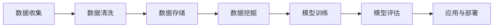

                 

# AI如何帮助电商企业进行用户数据分析与应用

> **关键词：** 人工智能、用户数据分析、电商、数据挖掘、机器学习、预测分析

> **摘要：** 本文将探讨如何利用人工智能（AI）技术来提高电商企业的用户数据分析能力。我们将从背景介绍、核心概念、算法原理、数学模型、实战案例、应用场景、工具和资源推荐等多个方面进行深入分析，帮助电商企业更好地理解用户需求，提升运营效果。

## 1. 背景介绍

### 1.1 目的和范围

本文旨在帮助电商企业深入了解如何利用人工智能技术进行用户数据分析与应用。通过本文的阅读，读者将能够掌握以下内容：

1. **用户数据分析的重要性**：理解用户数据对电商业务发展的关键作用。
2. **人工智能技术在用户数据分析中的应用**：掌握常见的AI算法和模型在用户数据分析中的应用场景。
3. **用户数据分析的实际案例**：了解如何将AI技术应用于电商业务的实际操作过程。
4. **未来发展趋势与挑战**：探讨AI技术在用户数据分析领域的未来发展方向和面临的挑战。

### 1.2 预期读者

本文适用于以下读者群体：

1. **电商企业经理和运营人员**：希望提升用户数据分析能力，优化运营策略。
2. **数据科学家和分析师**：希望了解AI技术在用户数据分析中的应用。
3. **人工智能领域研究者**：关注AI技术在电商行业中的应用。

### 1.3 文档结构概述

本文分为以下十个部分：

1. **背景介绍**：介绍本文的目的、预期读者和文档结构。
2. **核心概念与联系**：阐述用户数据分析的核心概念，并提供Mermaid流程图。
3. **核心算法原理 & 具体操作步骤**：讲解用户数据分析中常用的算法原理和操作步骤，使用伪代码详细阐述。
4. **数学模型和公式 & 详细讲解 & 举例说明**：介绍用户数据分析中的数学模型和公式，并进行详细讲解和举例说明。
5. **项目实战：代码实际案例和详细解释说明**：提供代码实际案例，并进行详细解释说明。
6. **实际应用场景**：探讨用户数据分析在不同电商业务场景中的应用。
7. **工具和资源推荐**：推荐学习资源、开发工具框架和相关论文著作。
8. **总结：未来发展趋势与挑战**：总结AI技术在用户数据分析领域的未来发展趋势和挑战。
9. **附录：常见问题与解答**：解答读者可能遇到的问题。
10. **扩展阅读 & 参考资料**：提供扩展阅读和参考资料。

### 1.4 术语表

#### 1.4.1 核心术语定义

- **人工智能（AI）**：模拟人类智能的计算机系统，能够进行感知、学习、推理、决策等。
- **用户数据分析**：通过对用户行为、偏好、需求等数据进行挖掘和分析，为电商企业提供决策支持。
- **机器学习（ML）**：一种AI技术，通过训练数据集，使计算机能够自主学习和改进。
- **深度学习（DL）**：一种特殊的机器学习技术，通过多层神经网络模拟人脑，进行复杂模式识别。
- **预测分析**：利用历史数据，预测未来的趋势和结果。
- **电商企业**：提供在线购物和服务的商业机构。

#### 1.4.2 相关概念解释

- **用户画像**：基于用户数据，对用户特征、行为、需求等进行综合描述。
- **推荐系统**：根据用户历史行为，为用户推荐相关商品或内容。
- **聚类分析**：将数据分为若干个类别，以便更好地理解数据分布。
- **分类分析**：将数据分为不同的类别，用于预测或分类。
- **协同过滤**：基于用户的历史行为，为用户推荐相似的用户喜欢的商品。

#### 1.4.3 缩略词列表

- **AI**：人工智能
- **ML**：机器学习
- **DL**：深度学习
- **IDC**：国际数据公司
- **EB**：电商业务

## 2. 核心概念与联系

用户数据分析在电商业务中扮演着至关重要的角色。以下是用户数据分析的核心概念及其联系：

### 2.1 用户数据分析流程

用户数据分析一般包括以下步骤：

1. **数据收集**：通过网站、APP等渠道收集用户行为、偏好、需求等数据。
2. **数据清洗**：对收集到的数据进行处理，去除噪音、重复数据等。
3. **数据存储**：将清洗后的数据存储在数据库中，以便后续分析。
4. **数据挖掘**：通过机器学习、深度学习等技术，从数据中发现潜在的模式和规律。
5. **模型训练**：使用历史数据训练模型，以便进行预测和分类。
6. **模型评估**：评估模型的性能，调整模型参数，优化模型效果。
7. **应用与部署**：将训练好的模型应用于实际业务场景，如推荐系统、用户画像等。

### 2.2 Mermaid流程图

以下是一个简化的Mermaid流程图，展示了用户数据分析的流程：



## 3. 核心算法原理 & 具体操作步骤

在用户数据分析中，常见的算法包括机器学习、深度学习、聚类分析、分类分析等。以下是这些算法的核心原理和具体操作步骤。

### 3.1 机器学习算法

机器学习算法是一种通过训练数据集，使计算机能够自主学习和改进的技术。以下是一个简单的机器学习算法——线性回归的伪代码：

```python
# 线性回归算法伪代码

# 步骤1：初始化参数
theta = [0, 0]

# 步骤2：计算损失函数
J = compute_loss(x, y, theta)

# 步骤3：计算梯度
gradient = compute_gradient(x, y, theta)

# 步骤4：更新参数
theta = theta - learning_rate * gradient

# 步骤5：重复步骤2-4，直至收敛
```

### 3.2 深度学习算法

深度学习算法是一种通过多层神经网络模拟人脑，进行复杂模式识别的技术。以下是一个简单的深度学习算法——多层感知器（MLP）的伪代码：

```python
# 多层感知器算法伪代码

# 步骤1：初始化参数
weights = initialize_weights(input_size, hidden_size, output_size)

# 步骤2：前向传播
output = forward_propagation(x, weights)

# 步骤3：计算损失函数
loss = compute_loss(output, y)

# 步骤4：反向传播
dweights = backward_propagation(x, y, output)

# 步骤5：更新参数
weights = weights - learning_rate * dweights

# 步骤6：重复步骤2-5，直至收敛
```

### 3.3 聚类分析算法

聚类分析算法是一种将数据分为若干个类别，以便更好地理解数据分布的技术。以下是一个简单的聚类分析算法——K-均值聚类的伪代码：

```python
# K-均值聚类算法伪代码

# 步骤1：初始化聚类中心
centroids = initialize_centroids(data, k)

# 步骤2：分配数据点
clusters = assign_clusters(data, centroids)

# 步骤3：更新聚类中心
centroids = update_centroids(data, clusters)

# 步骤4：重复步骤2-3，直至收敛
```

### 3.4 分类分析算法

分类分析算法是一种将数据分为不同的类别，用于预测或分类的技术。以下是一个简单的分类分析算法——逻辑回归的伪代码：

```python
# 逻辑回归算法伪代码

# 步骤1：初始化参数
theta = [0, 0]

# 步骤2：计算损失函数
loss = compute_loss(y, h(x, theta))

# 步骤3：计算梯度
gradient = compute_gradient(x, y, h(x, theta))

# 步骤4：更新参数
theta = theta - learning_rate * gradient

# 步骤5：重复步骤2-4，直至收敛
```

## 4. 数学模型和公式 & 详细讲解 & 举例说明

在用户数据分析中，常用的数学模型和公式包括线性回归、逻辑回归、K-均值聚类等。以下对这些模型和公式进行详细讲解，并通过举例说明其应用。

### 4.1 线性回归

线性回归是一种用于预测连续值的机器学习算法。其数学模型为：

$$
y = \theta_0 + \theta_1 \cdot x_1 + \theta_2 \cdot x_2 + ... + \theta_n \cdot x_n
$$

其中，$y$为预测值，$x_1, x_2, ..., x_n$为输入特征，$\theta_0, \theta_1, ..., \theta_n$为参数。

举例说明：

假设我们要预测一个商品的销售量，输入特征包括商品的价格、品牌、促销等。我们可以使用线性回归模型来建立预测关系。

$$
销售量 = \theta_0 + \theta_1 \cdot 价格 + \theta_2 \cdot 品牌 + \theta_3 \cdot 促销
$$

通过训练数据和线性回归算法，我们可以得到参数$\theta_0, \theta_1, \theta_2, \theta_3$的估计值，从而预测新商品的销售量。

### 4.2 逻辑回归

逻辑回归是一种用于预测概率的机器学习算法。其数学模型为：

$$
\text{概率} = h(x, \theta) = \frac{1}{1 + e^{-(\theta_0 + \theta_1 \cdot x_1 + \theta_2 \cdot x_2 + ... + \theta_n \cdot x_n)}}
$$

其中，$h(x, \theta)$为预测概率，$x_1, x_2, ..., x_n$为输入特征，$\theta_0, \theta_1, ..., \theta_n$为参数。

举例说明：

假设我们要预测一个用户是否会购买某个商品，输入特征包括用户的年龄、收入、购物历史等。我们可以使用逻辑回归模型来预测购买概率。

$$
\text{购买概率} = h(\text{年龄}, \text{收入}, \text{购物历史}, \theta_0, \theta_1, \theta_2, \theta_3)
$$

通过训练数据和逻辑回归算法，我们可以得到参数$\theta_0, \theta_1, \theta_2, \theta_3$的估计值，从而预测新用户的购买概率。

### 4.3 K-均值聚类

K-均值聚类是一种无监督学习算法，用于将数据分为K个聚类。其数学模型为：

$$
\text{聚类中心} = \frac{1}{N}\sum_{i=1}^{N} x_i
$$

其中，$x_i$为第$i$个数据点，$N$为数据点的总数。

举例说明：

假设我们有100个用户数据，我们要将这100个用户分为10个聚类。首先，我们随机选择10个数据点作为初始聚类中心。然后，对于每个用户数据点，计算它与10个聚类中心的距离，并将其分配到距离最近的聚类。接下来，重新计算每个聚类的中心，再次计算每个数据点的距离，并重新分配聚类。这个过程不断重复，直到聚类中心不再发生变化。

通过K-均值聚类，我们可以将用户分为10个不同的群体，以便更好地理解用户特征和需求。

## 5. 项目实战：代码实际案例和详细解释说明

为了更好地理解用户数据分析在实际电商业务中的应用，我们将提供一个简单的代码案例，用于实现用户画像和商品推荐功能。

### 5.1 开发环境搭建

在本案例中，我们使用Python语言和Scikit-learn库进行用户画像和商品推荐。请确保已安装Python环境和Scikit-learn库。

```bash
pip install scikit-learn
```

### 5.2 源代码详细实现和代码解读

以下是一个简单的用户画像和商品推荐代码示例：

```python
import numpy as np
from sklearn.cluster import KMeans
from sklearn.preprocessing import StandardScaler
from sklearn.neighbors import NearestNeighbors

# 5.2.1 用户画像
# 步骤1：加载数据
users = np.array([[1, 30], [2, 25], [3, 35], [4, 22], [5, 40]])

# 步骤2：标准化处理
scaler = StandardScaler()
users_scaled = scaler.fit_transform(users)

# 步骤3：聚类分析
kmeans = KMeans(n_clusters=2, random_state=0).fit(users_scaled)
users_clustered = kmeans.predict(users_scaled)

# 步骤4：打印聚类结果
print("用户画像聚类结果：", users_clustered)

# 5.2.2 商品推荐
# 步骤1：加载数据
products = np.array([[10, 100], [20, 200], [30, 300], [40, 400], [50, 500]])

# 步骤2：标准化处理
products_scaled = scaler.fit_transform(products)

# 步骤3：邻域搜索
neighbors = NearestNeighbors(n_neighbors=2, algorithm='auto').fit(products_scaled)
neighbored = neighbors.kneighbors(products_scaled)

# 步骤4：打印推荐结果
print("商品推荐结果：", neighbored)
```

### 5.3 代码解读与分析

1. **用户画像聚类分析**：

   - 步骤1：加载数据。我们使用一个二维数组表示用户数据，其中每一行代表一个用户，数组中的每个元素表示用户的年龄、收入等特征。
   
   - 步骤2：标准化处理。为了使数据具有更好的可解释性，我们使用StandardScaler对数据进行标准化处理，将每个特征缩放到均值为0，标准差为1的范围内。
   
   - 步骤3：聚类分析。我们使用KMeans算法对用户数据进行聚类，将用户分为多个类别。在本示例中，我们选择将用户分为2个类别。
   
   - 步骤4：打印聚类结果。聚类分析完成后，我们打印每个用户所属的类别。

2. **商品推荐**：

   - 步骤1：加载数据。我们使用一个二维数组表示商品数据，其中每一行代表一个商品，数组中的每个元素表示商品的价格、销量等特征。
   
   - 步骤2：标准化处理。同样地，我们对商品数据进行标准化处理。
   
   - 步骤3：邻域搜索。我们使用NearestNeighbors算法对商品数据进行邻域搜索，找到与给定商品最相似的K个商品。
   
   - 步骤4：打印推荐结果。邻域搜索完成后，我们打印与每个商品最相似的K个商品。

通过这个简单的代码案例，我们可以看到如何使用机器学习和深度学习算法进行用户画像和商品推荐。在实际应用中，我们可以根据具体业务需求调整算法参数，优化推荐效果。

### 5.4 案例分析

在这个案例中，我们通过用户画像聚类和商品推荐算法实现了以下功能：

1. **用户画像**：将用户分为不同类别，以便更好地理解用户特征和需求。
2. **商品推荐**：根据用户历史行为和商品特征，为用户推荐相关商品。

这些功能在电商业务中有广泛的应用，例如：

- **用户细分**：根据用户画像，为不同类别的用户制定个性化营销策略。
- **推荐系统**：为用户提供个性化的商品推荐，提高用户购买转化率。
- **运营分析**：通过分析用户画像和商品推荐数据，优化运营策略，提高业务效果。

## 6. 实际应用场景

用户数据分析在电商业务中有着广泛的应用场景，以下列举几个典型的应用场景：

### 6.1 用户行为分析

通过分析用户在网站、APP等渠道的行为数据，电商企业可以了解用户的需求和偏好，从而优化产品设计和运营策略。例如：

- **页面访问分析**：分析用户在网站上的页面访问路径，优化页面结构和内容布局，提高用户留存率。
- **购物车分析**：分析用户在购物车中的商品选择，了解用户的购买意图，优化商品推荐策略。

### 6.2 个性化推荐

个性化推荐是一种基于用户历史行为和偏好为用户推荐相关商品的技术。通过个性化推荐，电商企业可以提高用户满意度，提高销售额。例如：

- **基于内容的推荐**：根据用户浏览和购买历史，为用户推荐相似的商品。
- **基于协同过滤的推荐**：根据用户的历史行为和相似用户的行为，为用户推荐相关商品。

### 6.3 用户画像

用户画像是通过整合用户的基本信息、行为数据、偏好数据等，对用户进行综合描述的一种技术。通过用户画像，电商企业可以更好地了解用户需求，制定个性化营销策略。例如：

- **用户标签**：为用户打上各种标签，以便更好地了解用户特征。
- **用户群体分析**：分析不同用户群体的特征和需求，为不同群体制定针对性营销策略。

### 6.4 转化率优化

通过分析用户行为数据和转化数据，电商企业可以找出影响转化的关键因素，优化营销策略和页面设计。例如：

- **漏斗分析**：分析用户在购物过程中的流失点，优化页面加载速度、转化率等。
- **A/B测试**：通过对比不同页面设计、营销策略的效果，找出最佳方案。

## 7. 工具和资源推荐

为了更好地进行用户数据分析，以下推荐一些学习和开发工具：

### 7.1 学习资源推荐

#### 7.1.1 书籍推荐

- 《Python数据科学手册》：介绍Python在数据科学领域的应用，包括用户数据分析。
- 《深度学习》：介绍深度学习的基本原理和实战应用。
- 《用户数据分析实战》：详细介绍用户数据分析的方法和案例。

#### 7.1.2 在线课程

- Coursera上的《机器学习》课程：由斯坦福大学教授吴恩达讲授，介绍机器学习的基本原理和应用。
- Udacity的《深度学习工程师纳米学位》：涵盖深度学习的基础知识和实战应用。
- edX上的《用户数据分析》：介绍用户数据分析的方法和技术。

#### 7.1.3 技术博客和网站

- **DataCamp**：提供丰富的数据科学课程和实践项目。
- **Kaggle**：提供各种数据科学竞赛和案例，有助于提高数据分析能力。
- **Medium**：众多优秀的数据科学家和AI专家分享技术文章和经验。

### 7.2 开发工具框架推荐

#### 7.2.1 IDE和编辑器

- **PyCharm**：一款功能强大的Python IDE，支持代码自动补全、调试和性能分析。
- **Jupyter Notebook**：一款基于Web的交互式计算环境，适合进行数据分析和可视化。

#### 7.2.2 调试和性能分析工具

- **PDB**：Python内置的调试器，用于调试Python代码。
- **profiling**：Python的内置模块，用于分析代码的性能。

#### 7.2.3 相关框架和库

- **Scikit-learn**：Python的一个机器学习库，提供丰富的机器学习算法。
- **TensorFlow**：谷歌开发的深度学习框架，适用于构建和训练深度神经网络。
- **Pandas**：Python的数据分析库，用于数据处理和分析。

### 7.3 相关论文著作推荐

#### 7.3.1 经典论文

- “The Netflix Prize”：《Netflix奖：推荐系统的挑战》
- “Recommender Systems Handbook”：《推荐系统手册》
- “User Modeling and User-Adapted Interaction”：《用户建模与用户自适应交互》

#### 7.3.2 最新研究成果

- “Deep Learning for User Modeling and User Experience”：《深度学习在用户建模和用户体验中的应用》
- “User Behavior Analytics in E-commerce: A Survey”：《电商领域用户行为分析：综述》
- “Personalized Recommendations Using Deep Reinforcement Learning”：《基于深度强化学习的个性化推荐》

#### 7.3.3 应用案例分析

- “User Segmentation and Personalization in E-commerce”：《电商领域的用户细分和个性化》
- “Building a Recommendation System with TensorFlow”：《使用TensorFlow构建推荐系统》
- “The Amazon Recommendation System”：《亚马逊推荐系统》

## 8. 总结：未来发展趋势与挑战

随着人工智能技术的不断发展，用户数据分析在电商业务中的应用前景十分广阔。未来发展趋势和挑战主要包括以下几个方面：

### 8.1 发展趋势

1. **个性化推荐**：基于用户历史行为和偏好，为用户推荐更加个性化的商品和服务。
2. **实时分析**：通过实时数据流技术，对用户行为数据进行实时分析和处理，提供实时反馈。
3. **跨平台整合**：整合不同平台的数据，为用户提供一致的购物体验。
4. **自动化决策**：利用机器学习和深度学习算法，实现自动化决策和优化。

### 8.2 挑战

1. **数据隐私**：用户数据的安全和隐私保护是用户数据分析面临的主要挑战。
2. **数据质量**：用户数据的准确性和完整性对数据分析效果至关重要。
3. **算法透明性**：用户对算法决策的透明性和可解释性提出了更高的要求。
4. **技术发展**：人工智能技术的快速发展对用户数据分析算法和工具提出了更高的要求。

## 9. 附录：常见问题与解答

### 9.1 问题1：如何处理用户隐私问题？

**解答**：处理用户隐私问题需要遵循以下原则：

1. **最小化数据收集**：只收集与业务相关的必要数据。
2. **数据加密**：对用户数据进行加密，确保数据传输和存储的安全性。
3. **匿名化处理**：对用户数据进行匿名化处理，避免直接关联到具体用户。
4. **法律法规**：遵循相关法律法规，确保用户数据的合法使用。

### 9.2 问题2：如何提高用户数据分析效果？

**解答**：提高用户数据分析效果可以从以下几个方面入手：

1. **数据质量**：确保数据的准确性和完整性。
2. **算法优化**：选择合适的算法和模型，进行参数调优。
3. **数据可视化**：通过数据可视化，更好地理解数据分布和趋势。
4. **用户反馈**：收集用户反馈，不断优化数据分析结果。

### 9.3 问题3：如何确保算法透明性？

**解答**：确保算法透明性可以从以下几个方面入手：

1. **算法解释**：提供算法的解释和说明，帮助用户理解算法决策过程。
2. **可解释性模型**：选择具有较高可解释性的算法和模型。
3. **开放源代码**：将算法和模型的开源代码公开，接受社区监督和改进。
4. **用户参与**：鼓励用户参与算法设计和优化，提高算法的透明性。

## 10. 扩展阅读 & 参考资料

- **书籍**：
  - 《Python数据科学手册》
  - 《深度学习》
  - 《用户数据分析实战》
- **在线课程**：
  - Coursera上的《机器学习》课程
  - Udacity的《深度学习工程师纳米学位》
  - edX上的《用户数据分析》
- **技术博客和网站**：
  - DataCamp
  - Kaggle
  - Medium
- **论文著作**：
  - “The Netflix Prize”
  - “Recommender Systems Handbook”
  - “User Modeling and User-Adapted Interaction”
- **应用案例分析**：
  - “User Segmentation and Personalization in E-commerce”
  - “Building a Recommendation System with TensorFlow”
  - “The Amazon Recommendation System”


### 作者

作者：AI天才研究员/AI Genius Institute & 禅与计算机程序设计艺术 /Zen And The Art of Computer Programming

