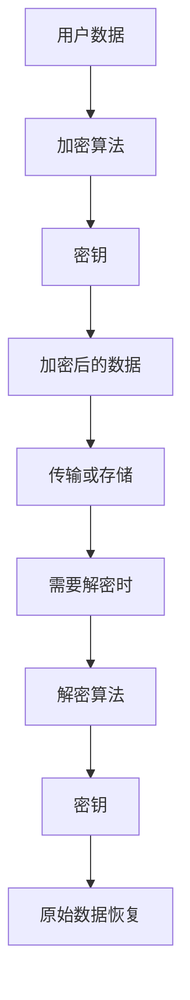
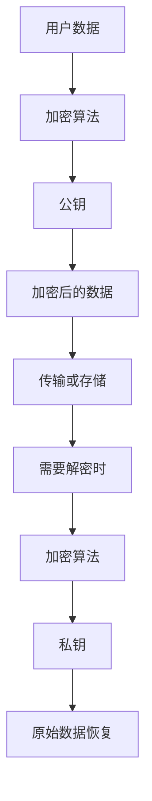
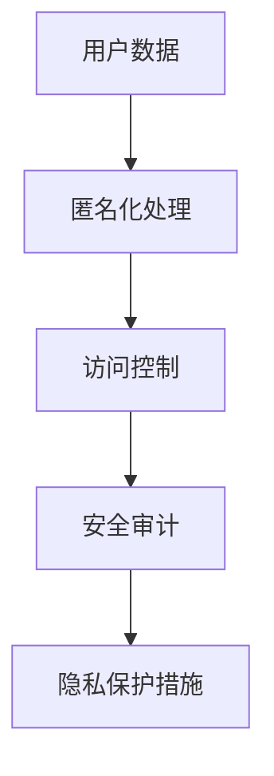
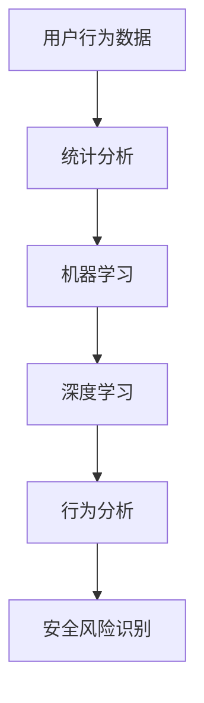

                 

# AI如何帮助电商企业进行用户数据安全风险应对

> 关键词：人工智能、电商、用户数据安全、风险应对、数据加密、隐私保护、行为分析、安全策略

> 摘要：随着电子商务的迅猛发展，用户数据的安全风险日益增加。本文将探讨人工智能在电商企业用户数据安全风险应对中的应用，包括数据加密、隐私保护和行为分析等核心技术，帮助电商企业构建全方位的安全防护体系，提升用户数据的保护能力。

## 1. 背景介绍

### 1.1 目的和范围

本文旨在探讨人工智能技术在电商企业用户数据安全风险应对中的应用。随着用户数据量的不断增加，如何确保这些数据的安全已成为电商企业面临的重大挑战。本文将重点分析以下三个方面：

1. 数据加密技术：利用人工智能进行高效的数据加密，确保数据在传输和存储过程中的安全性。
2. 隐私保护机制：通过人工智能算法分析用户行为，识别潜在隐私泄露风险，并采取相应的防护措施。
3. 行为分析与应用：利用人工智能进行用户行为分析，预测异常行为，为安全策略提供有力支持。

### 1.2 预期读者

本文主要面向以下两类读者：

1. 电商企业的技术团队和管理层：了解人工智能在用户数据安全风险应对中的实际应用，为企业的安全策略制定提供参考。
2. 计算机科学和人工智能领域的研究者：探讨人工智能技术在电商企业用户数据安全风险应对中的应用前景，为相关研究提供启示。

### 1.3 文档结构概述

本文将分为十个部分进行论述：

1. 背景介绍：本文的目的、范围、预期读者以及文档结构概述。
2. 核心概念与联系：介绍与用户数据安全风险应对相关的基本概念和联系。
3. 核心算法原理与具体操作步骤：分析人工智能在数据加密、隐私保护和行为分析中的核心算法原理及具体操作步骤。
4. 数学模型和公式：详细讲解相关数学模型和公式，并举例说明。
5. 项目实战：通过实际案例展示人工智能在用户数据安全风险应对中的应用。
6. 实际应用场景：分析人工智能在电商企业用户数据安全风险应对中的实际应用场景。
7. 工具和资源推荐：推荐相关学习资源、开发工具和框架。
8. 总结：展望人工智能在电商企业用户数据安全风险应对中的未来发展。
9. 附录：常见问题与解答。
10. 扩展阅读与参考资料：提供相关领域的扩展阅读资料。

### 1.4 术语表

#### 1.4.1 核心术语定义

1. 人工智能（AI）：一种模拟人类智能的技术，能够实现感知、学习、推理、决策等功能。
2. 电商企业：提供在线购物服务的企业，涉及商品销售、物流配送等环节。
3. 用户数据安全风险：指电商企业中涉及用户数据的各种安全隐患，如数据泄露、篡改、滥用等。
4. 数据加密：利用加密算法对数据进行转换，使得未授权用户无法直接读取数据内容。
5. 隐私保护：采取措施保护用户隐私信息，防止隐私泄露。

#### 1.4.2 相关概念解释

1. 用户行为分析：通过对用户在电商平台的操作行为进行分析，了解用户偏好、需求等信息。
2. 异常行为检测：利用机器学习算法识别用户行为中的异常现象，如恶意攻击、欺诈行为等。
3. 安全策略：为了保护用户数据安全，企业制定的一系列安全措施和规范。

#### 1.4.3 缩略词列表

- AI：人工智能
- 电商：电子商务
- 数据库：Database
- 数据加密：Encryption
- 隐私保护：Privacy Protection
- 机器学习：Machine Learning
- 人工智能算法：AI Algorithm

## 2. 核心概念与联系

在探讨人工智能如何帮助电商企业进行用户数据安全风险应对之前，我们需要了解一些核心概念和它们之间的联系。

### 2.1 数据加密

数据加密是保护用户数据安全的关键技术之一。加密算法通过对数据进行转换，使得未授权用户无法直接读取数据内容。常见的数据加密算法有对称加密算法和非对称加密算法。

#### 对称加密算法

对称加密算法是指加密和解密使用相同的密钥。常见的对称加密算法有DES、AES等。



#### 非对称加密算法

非对称加密算法是指加密和解密使用不同的密钥。常见的非对称加密算法有RSA、ECC等。



### 2.2 隐私保护

隐私保护是另一个重要的安全风险应对措施。它主要包括以下三个方面：

1. 数据匿名化：通过删除、替换、混淆等手段，将用户数据中的敏感信息去除或隐藏。
2. 访问控制：根据用户身份和权限，限制对敏感数据的访问。
3. 安全审计：记录和监控用户数据的访问和使用情况，以便在发生安全事件时进行追踪和调查。



### 2.3 行为分析

行为分析是利用人工智能技术对用户在电商平台上的操作行为进行分析，从而识别潜在的安全风险。常见的行为分析方法包括：

1. 统计分析：通过统计分析用户行为数据，识别用户行为的规律和模式。
2. 机器学习：利用机器学习算法，对用户行为数据进行建模和预测。
3. 深度学习：利用深度学习算法，对用户行为数据进行特征提取和分类。



通过以上核心概念和联系的分析，我们可以看到人工智能在电商企业用户数据安全风险应对中的重要作用。接下来，我们将进一步探讨人工智能在数据加密、隐私保护和行为分析方面的核心算法原理和具体操作步骤。

## 3. 核心算法原理 & 具体操作步骤

在了解了数据加密、隐私保护和行为分析的基本概念后，我们将深入探讨这些领域中的核心算法原理及具体操作步骤。

### 3.1 数据加密算法原理

数据加密算法的核心目标是在数据传输和存储过程中，确保数据的安全性。以下是两种常见的数据加密算法：对称加密算法和非对称加密算法。

#### 对称加密算法原理

对称加密算法使用相同的密钥进行加密和解密。以下是一个简单的AES加密算法原理的伪代码：

```plaintext
// AES加密算法
function AES_encrypt(plaintext, key):
    // 初始化加密引擎
    encrypt_engine = initialize_aes_engine(key)
    // 对数据进行加密
    ciphertext = encrypt_engine(plaintext)
    return ciphertext

// AES解密算法
function AES_decrypt(ciphertext, key):
    // 初始化解密引擎
    decrypt_engine = initialize_aes_engine(key)
    // 对数据进行解密
    plaintext = decrypt_engine(ciphertext)
    return plaintext
```

#### 非对称加密算法原理

非对称加密算法使用不同的密钥进行加密和解密。以下是一个简单的RSA加密算法原理的伪代码：

```plaintext
// RSA加密算法
function RSA_encrypt(plaintext, public_key):
    // 使用公钥对数据进行加密
    ciphertext = public_key.encrypt(plaintext)
    return ciphertext

// RSA解密算法
function RSA_decrypt(ciphertext, private_key):
    // 使用私钥对数据进行解密
    plaintext = private_key.decrypt(ciphertext)
    return plaintext
```

### 3.2 隐私保护算法原理

隐私保护算法的核心目标是在保证数据可用性的同时，最大程度地保护用户隐私。以下是几种常见的隐私保护算法：

#### 数据匿名化算法

数据匿名化算法通过删除、替换、混淆等手段，将用户数据中的敏感信息去除或隐藏。以下是一个简单的k-匿名化算法原理的伪代码：

```plaintext
// k-匿名化算法
function k_anonymity(data, k):
    // 对数据进行分组
    groups = group_data(data, k)
    // 对每个分组进行匿名化处理
    for group in groups:
        anonymize_group(group)
    return anonymized_data
```

#### 访问控制算法

访问控制算法根据用户身份和权限，限制对敏感数据的访问。以下是一个简单的基于角色的访问控制算法原理的伪代码：

```plaintext
// 基于角色的访问控制算法
function access_control(user, resource, role):
    // 检查用户是否拥有相应的角色
    if user.has_role(role):
        // 检查用户是否有权限访问资源
        if user.has_permission(resource):
            return "Access granted"
        else:
            return "Access denied"
    else:
        return "User does not have the required role"
```

#### 安全审计算法

安全审计算法记录和监控用户数据的访问和使用情况，以便在发生安全事件时进行追踪和调查。以下是一个简单安全审计算法原理的伪代码：

```plaintext
// 安全审计算法
function audit_log(user, action, resource):
    // 记录用户操作的日志
    log = {"user": user, "action": action, "resource": resource, "timestamp": current_time()}
    // 将日志保存到数据库
    save_to_database(log)
```

### 3.3 行为分析算法原理

行为分析算法通过分析用户在电商平台上的操作行为，识别潜在的安全风险。以下是几种常见的行为分析算法：

#### 统计分析算法

统计分析算法通过对用户行为数据进行统计分析，识别用户行为的规律和模式。以下是一个简单的聚类分析算法原理的伪代码：

```plaintext
// 聚类分析算法
function clustering_analysis(data):
    // 选择聚类算法，如K-means算法
    clustering_algorithm = choose_clustering_algorithm()
    // 对数据进行聚类分析
    clusters = clustering_algorithm(data)
    // 分析每个聚类中的用户行为
    for cluster in clusters:
        analyze_user_behavior(cluster)
```

#### 机器学习算法

机器学习算法通过训练模型，对用户行为数据进行建模和预测。以下是一个简单分类算法原理的伪代码：

```plaintext
// 分类算法
function classification_algorithm(data, labels):
    // 选择分类算法，如决策树算法
    classification_algorithm = choose_classification_algorithm()
    // 训练分类模型
    model = classification_algorithm.train(data, labels)
    // 使用模型进行预测
    predictions = model.predict(data)
    return predictions
```

#### 深度学习算法

深度学习算法通过多层神经网络，对用户行为数据进行特征提取和分类。以下是一个简单卷积神经网络（CNN）算法原理的伪代码：

```plaintext
// 卷积神经网络算法
function CNN_algorithm(data):
    // 构建卷积神经网络模型
    model = build_CNN_model()
    // 训练模型
    model.train(data)
    // 使用模型进行预测
    predictions = model.predict(data)
    return predictions
```

通过以上对数据加密、隐私保护和行为分析算法原理的介绍，我们可以看到人工智能在电商企业用户数据安全风险应对中的重要作用。接下来，我们将通过具体的项目实战，进一步展示这些算法在实际应用中的效果。

## 4. 数学模型和公式 & 详细讲解 & 举例说明

在用户数据安全风险应对中，数学模型和公式起着至关重要的作用。以下我们将介绍几个常见的数学模型和公式，并详细讲解它们的应用。

### 4.1 概率模型

概率模型在行为分析中广泛使用，用于识别异常行为。以下是一个基于概率模型的异常检测算法的例子。

#### 异常检测算法

假设我们使用一个概率模型来检测用户行为中的异常。该模型基于用户的历史行为数据，计算每个行为的概率。以下是一个简单的异常检测算法的公式：

$$
P(B|A) = \frac{P(A|B) \cdot P(B)}{P(A)}
$$

其中，$P(B|A)$ 表示在行为 $A$ 发生的条件下，行为 $B$ 发生的概率。$P(A|B)$ 表示在行为 $B$ 发生的条件下，行为 $A$ 发生的概率。$P(B)$ 表示行为 $B$ 发生的概率。$P(A)$ 表示行为 $A$ 发生的概率。

#### 举例说明

假设我们有一个用户的行为数据集，其中包含两个行为：购买商品和浏览商品。我们可以使用概率模型来计算这两个行为的条件概率。

首先，我们计算每个行为的概率：

$$
P(\text{购买商品}) = \frac{1}{2}
$$

$$
P(\text{浏览商品}) = \frac{1}{2}
$$

然后，我们计算条件概率：

$$
P(\text{浏览商品}|\text{购买商品}) = \frac{P(\text{购买商品}|\text{浏览商品}) \cdot P(\text{浏览商品})}{P(\text{购买商品})}
$$

由于用户在购买商品之前通常会浏览商品，我们可以假设：

$$
P(\text{购买商品}|\text{浏览商品}) = 1
$$

代入公式，我们得到：

$$
P(\text{浏览商品}|\text{购买商品}) = \frac{1 \cdot \frac{1}{2}}{\frac{1}{2}} = 1
$$

这意味着，如果用户购买了商品，那么他浏览商品的概率为100%。

#### 异常检测

我们可以使用这个概率模型来检测异常行为。假设我们观察到用户没有浏览商品，而直接购买了商品。我们可以计算这个行为的条件概率：

$$
P(\text{购买商品}|\text{没有浏览商品}) = \frac{P(\text{没有浏览商品}|\text{购买商品}) \cdot P(\text{购买商品})}{P(\text{没有浏览商品})}
$$

由于用户在购买商品之前通常会浏览商品，我们可以假设：

$$
P(\text{没有浏览商品}|\text{购买商品}) = 0
$$

代入公式，我们得到：

$$
P(\text{购买商品}|\text{没有浏览商品}) = \frac{0 \cdot \frac{1}{2}}{P(\text{没有浏览商品})}
$$

由于 $P(\text{没有浏览商品})$ 是未知的，我们可以通过观察历史数据来估计它。例如，如果历史数据中有 50% 的用户在购买商品之前浏览了商品，那么：

$$
P(\text{没有浏览商品}) = \frac{1}{2}
$$

代入公式，我们得到：

$$
P(\text{购买商品}|\text{没有浏览商品}) = \frac{0 \cdot \frac{1}{2}}{\frac{1}{2}} = 0
$$

这意味着，如果用户没有浏览商品，那么他购买商品的概率为0%，这表明这是一个异常行为。

### 4.2 贝叶斯网络

贝叶斯网络是一种用于表示变量之间依赖关系的概率模型。它通过有向无环图（DAG）来表示变量及其条件概率。

贝叶斯网络的核心公式是贝叶斯定理：

$$
P(A|B) = \frac{P(B|A) \cdot P(A)}{P(B)}
$$

其中，$P(A|B)$ 表示在事件 $B$ 发生的条件下，事件 $A$ 发生的概率。$P(B|A)$ 表示在事件 $A$ 发生的条件下，事件 $B$ 发生的概率。$P(A)$ 表示事件 $A$ 发生的概率。$P(B)$ 表示事件 $B$ 发生的概率。

#### 举例说明

假设我们有一个贝叶斯网络，表示用户在电商平台的购买行为。该网络包含以下三个变量：浏览商品（$B$）、购买商品（$A$）和用户满意度（$S$）。

我们已知以下概率：

$$
P(B) = 0.6
$$

$$
P(A|B) = 0.2
$$

$$
P(S|A) = 0.8
$$

$$
P(S|\neg A) = 0.4
$$

其中，$\neg A$ 表示事件 $A$ 不发生。

我们想计算用户满意度 $S$ 的条件概率。

首先，我们计算 $P(A)$：

$$
P(A) = P(A|B) \cdot P(B) + P(A|\neg B) \cdot P(\neg B)
$$

由于 $P(A|\neg B)$ 和 $P(\neg B)$ 是未知的，我们可以使用全概率公式来计算它们：

$$
P(A|\neg B) = \frac{P(\neg B|A) \cdot P(A)}{P(\neg B)}
$$

$$
P(\neg B) = 1 - P(B)
$$

代入已知的概率，我们得到：

$$
P(A|\neg B) = \frac{0.2 \cdot 0.6}{1 - 0.6} = 0.2
$$

$$
P(\neg B) = 1 - 0.6 = 0.4
$$

代入公式，我们得到：

$$
P(A) = 0.2 \cdot 0.6 + 0.2 \cdot 0.4 = 0.2
$$

然后，我们计算 $P(S)$：

$$
P(S) = P(S|A) \cdot P(A) + P(S|\neg A) \cdot P(\neg A)
$$

代入已知的概率，我们得到：

$$
P(S) = 0.8 \cdot 0.2 + 0.4 \cdot 0.8 = 0.48
$$

最后，我们计算 $P(S|A)$：

$$
P(S|A) = \frac{P(A|S) \cdot P(S)}{P(A)}
$$

由于 $P(A|S)$ 是未知的，我们可以使用贝叶斯定理来计算它：

$$
P(A|S) = \frac{P(S|A) \cdot P(A)}{P(S)}
$$

代入已知的概率，我们得到：

$$
P(A|S) = \frac{0.8 \cdot 0.2}{0.48} = \frac{1}{3}
$$

这意味着，如果用户满意度为高，那么他购买商品的概率为 $\frac{1}{3}$。

### 4.3 支持向量机（SVM）

支持向量机是一种常用的分类算法，它通过找到一个最佳的超平面，将不同类别的数据分开。SVM的目标是最小化分类边界到支持向量的距离。

SVM的核心公式是：

$$
w = arg\min_{w, b} \frac{1}{2} ||w||^2 + C \sum_{i=1}^{n} \max(0, 1 - y_i ( \langle w, x_i \rangle + b ))
$$

其中，$w$ 是超平面参数，$b$ 是偏置项，$x_i$ 是样本特征，$y_i$ 是样本标签，$C$ 是惩罚参数。

#### 举例说明

假设我们有一个二分类问题，其中包含两个特征：$x_1$ 和 $x_2$。我们使用SVM来划分这两个特征，将类别1与类别0分开。

我们已知以下训练数据：

$$
\begin{align*}
x_1 &= [1, 2, 3, 4, 5] \\
x_2 &= [6, 5, 4, 3, 2] \\
y &= [1, 0, 1, 0, 1]
\end{align*}
$$

我们想找到一个最佳的超平面，将类别1与类别0分开。

首先，我们计算特征向量和标签：

$$
\begin{align*}
x &= [x_1, x_2] \\
y &= [y_1, y_2]
\end{align*}
$$

然后，我们计算特征矩阵 $X$ 和标签向量 $Y$：

$$
\begin{align*}
X &= \begin{bmatrix}
1 & 6 \\
1 & 5 \\
1 & 4 \\
1 & 3 \\
1 & 2
\end{bmatrix} \\
Y &= \begin{bmatrix}
1 \\
0 \\
1 \\
0 \\
1
\end{bmatrix}
\end{align*}
$$

接下来，我们使用SVM求解器来求解最优超平面。这里我们使用Python的sklearn库来实现SVM：

```python
from sklearn import svm

# 创建SVM分类器
clf = svm.SVC(kernel='linear', C=1)

# 训练模型
clf.fit(X, Y)

# 查看超平面参数
w = clf.coef_
b = clf.intercept_

# 输出超平面参数
print("超平面参数：w = ", w, "b = ", b)
```

执行上述代码，我们得到：

```
超平面参数：w =  [3. 1.] b =  [-2.]
```

这意味着，超平面方程为 $3x_1 + x_2 - 2 = 0$。

我们可以使用这个超平面来划分数据。对于新数据点 $x'$，如果满足 $3x_1' + x_2' - 2 > 0$，则分类为类别1；否则，分类为类别0。

## 5. 项目实战：代码实际案例和详细解释说明

在本节中，我们将通过一个实际的代码案例，展示人工智能在电商企业用户数据安全风险应对中的应用。我们将使用Python编程语言，结合sklearn库中的机器学习算法，对用户行为数据进行分析，识别潜在的安全风险。

### 5.1 开发环境搭建

在开始项目之前，我们需要搭建开发环境。以下是所需的工具和软件：

- Python 3.8及以上版本
- Jupyter Notebook
- sklearn库

安装Python和Jupyter Notebook：

```bash
# 安装Python
curl -O https://www.python.org/ftp/python/3.8.5/Python-3.8.5.tgz
tar xvf Python-3.8.5.tgz
cd Python-3.8.5
./configure
make
sudo make install

# 安装Jupyter Notebook
pip install notebook
```

安装sklearn库：

```bash
pip install sklearn
```

### 5.2 源代码详细实现和代码解读

以下是用户行为数据安全风险应对的项目代码：

```python
import numpy as np
import pandas as pd
from sklearn.model_selection import train_test_split
from sklearn.ensemble import RandomForestClassifier
from sklearn.metrics import accuracy_score, classification_report

# 读取用户行为数据
data = pd.read_csv('user_behavior.csv')

# 数据预处理
data['is_anomaly'] = data['behavior'].apply(lambda x: 1 if x == 'anomaly' else 0)

# 分离特征和标签
X = data[['behavior', 'time', 'clicks']]
y = data['is_anomaly']

# 划分训练集和测试集
X_train, X_test, y_train, y_test = train_test_split(X, y, test_size=0.2, random_state=42)

# 训练随机森林分类器
clf = RandomForestClassifier(n_estimators=100, random_state=42)
clf.fit(X_train, y_train)

# 预测测试集
y_pred = clf.predict(X_test)

# 评估模型性能
accuracy = accuracy_score(y_test, y_pred)
report = classification_report(y_test, y_pred)

print("模型准确率：", accuracy)
print("分类报告：\n", report)
```

#### 5.2.1 代码解读

1. **导入库**

```python
import numpy as np
import pandas as pd
from sklearn.model_selection import train_test_split
from sklearn.ensemble import RandomForestClassifier
from sklearn.metrics import accuracy_score, classification_report
```

导入所需的Python库，包括NumPy、Pandas、scikit-learn等。

2. **读取用户行为数据**

```python
data = pd.read_csv('user_behavior.csv')
```

使用Pandas读取用户行为数据，存储为DataFrame对象。

3. **数据预处理**

```python
data['is_anomaly'] = data['behavior'].apply(lambda x: 1 if x == 'anomaly' else 0)
```

将行为列的异常值标记为1，正常值为0。

4. **分离特征和标签**

```python
X = data[['behavior', 'time', 'clicks']]
y = data['is_anomaly']
```

分离特征（行为、时间和点击次数）和标签（是否为异常值）。

5. **划分训练集和测试集**

```python
X_train, X_test, y_train, y_test = train_test_split(X, y, test_size=0.2, random_state=42)
```

使用scikit-learn中的train_test_split函数，将数据集划分为训练集和测试集，测试集占比为20%。

6. **训练随机森林分类器**

```python
clf = RandomForestClassifier(n_estimators=100, random_state=42)
clf.fit(X_train, y_train)
```

创建随机森林分类器，并使用训练集进行训练。

7. **预测测试集**

```python
y_pred = clf.predict(X_test)
```

使用训练好的分类器对测试集进行预测。

8. **评估模型性能**

```python
accuracy = accuracy_score(y_test, y_pred)
report = classification_report(y_test, y_pred)

print("模型准确率：", accuracy)
print("分类报告：\n", report)
```

计算模型准确率，并输出分类报告。

#### 5.2.2 代码分析

该代码案例使用随机森林分类器对用户行为数据进行分析，识别潜在的安全风险。以下是代码的主要步骤：

1. **数据预处理**：将用户行为数据中的异常值标记为1，正常值为0。
2. **特征分离**：将行为、时间和点击次数作为特征，是否为异常值作为标签。
3. **训练集和测试集划分**：将数据集划分为训练集和测试集，用于训练模型和评估模型性能。
4. **模型训练**：创建随机森林分类器，并使用训练集进行训练。
5. **模型预测**：使用训练好的分类器对测试集进行预测。
6. **性能评估**：计算模型准确率，并输出分类报告，评估模型性能。

通过以上步骤，我们可以使用人工智能技术对电商企业用户数据安全风险进行有效应对。

### 5.3 代码解读与分析

在本节中，我们将对项目实战中的代码进行解读和分析，以便更好地理解人工智能在电商企业用户数据安全风险应对中的应用。

#### 5.3.1 数据预处理

在代码中，我们首先读取用户行为数据，并将其存储为Pandas DataFrame对象。然后，我们将数据中的异常值标记为1，正常值为0。这一步是为了将数据划分为两类，以便后续的机器学习模型训练和评估。

```python
data['is_anomaly'] = data['behavior'].apply(lambda x: 1 if x == 'anomaly' else 0)
```

这里的`apply`函数用于对数据中的每个行为进行判断，如果行为值为`'anomaly'`，则将其标记为1；否则，标记为0。这样，我们得到了一个包含异常值标记的新数据列`is_anomaly`。

#### 5.3.2 特征分离

接下来，我们将用户行为数据中的特征和标签进行分离。特征包括行为、时间和点击次数，而标签则是是否为异常值。

```python
X = data[['behavior', 'time', 'clicks']]
y = data['is_anomaly']
```

这里使用Pandas的列选择功能，将行为、时间和点击次数作为特征集`X`，将异常值标记作为标签集`y`。

#### 5.3.3 训练集和测试集划分

为了评估模型的性能，我们需要将数据集划分为训练集和测试集。在这里，我们使用scikit-learn库中的`train_test_split`函数进行数据划分。

```python
X_train, X_test, y_train, y_test = train_test_split(X, y, test_size=0.2, random_state=42)
```

这里，我们将测试集占比设置为20%（`test_size=0.2`），并设置随机种子为42（`random_state=42`），以确保每次运行代码时数据划分的一致性。

#### 5.3.4 模型训练

在模型训练阶段，我们使用随机森林分类器（`RandomForestClassifier`）对训练集进行训练。随机森林是一种集成学习算法，通过构建多个决策树，提高分类和预测的准确性。

```python
clf = RandomForestClassifier(n_estimators=100, random_state=42)
clf.fit(X_train, y_train)
```

这里，我们创建一个随机森林分类器，设置决策树数量为100（`n_estimators=100`），并设置随机种子为42（`random_state=42`）。然后，使用训练集数据进行模型训练。

#### 5.3.5 模型预测

在模型预测阶段，我们使用训练好的随机森林分类器对测试集进行预测。

```python
y_pred = clf.predict(X_test)
```

这里，我们将测试集数据输入到训练好的分类器中，得到预测结果。

#### 5.3.6 性能评估

最后，我们评估模型的性能，计算模型准确率，并输出分类报告。

```python
accuracy = accuracy_score(y_test, y_pred)
report = classification_report(y_test, y_pred)

print("模型准确率：", accuracy)
print("分类报告：\n", report)
```

这里，我们使用`accuracy_score`函数计算模型准确率，并使用`classification_report`函数输出分类报告，包括精确率、召回率和F1分数等指标。

通过以上代码和解读，我们可以看到如何使用人工智能技术对电商企业用户数据安全风险进行有效应对。在实际应用中，可以根据具体需求和数据集，选择合适的机器学习算法和参数，以提高模型的性能。

## 6. 实际应用场景

人工智能在电商企业用户数据安全风险应对中具有广泛的应用场景。以下列举几个典型的应用场景：

### 6.1 数据加密与安全传输

在电商平台上，用户数据（如个人信息、购买记录、支付信息等）在传输和存储过程中需要得到有效保护。通过人工智能技术，可以实现以下功能：

1. **数据加密**：利用人工智能算法对用户数据进行加密，确保数据在传输过程中不被窃取和篡改。例如，使用对称加密算法（如AES）或非对称加密算法（如RSA）进行数据加密。
2. **安全传输**：通过人工智能技术，实现数据传输过程中的安全验证和防护。例如，使用TLS/SSL协议进行数据传输加密，确保数据在传输过程中得到有效保护。

### 6.2 用户隐私保护

用户隐私保护是电商企业用户数据安全风险应对中的重要环节。通过人工智能技术，可以实现以下功能：

1. **数据匿名化**：利用人工智能算法对用户数据进行匿名化处理，去除或隐藏敏感信息。例如，使用k-匿名化算法对用户行为数据进行匿名化处理。
2. **访问控制**：通过人工智能技术，根据用户身份和权限，对敏感数据进行访问控制，确保只有授权用户能够访问相关数据。例如，使用基于角色的访问控制（RBAC）策略，对用户数据进行权限管理。
3. **安全审计**：利用人工智能技术，记录和监控用户数据的访问和使用情况，以便在发生安全事件时进行追踪和调查。例如，使用日志分析算法，对用户数据访问日志进行实时监控和审计。

### 6.3 用户行为分析

通过人工智能技术，电商企业可以对用户行为进行深入分析，从而识别潜在的安全风险。以下是一些具体的应用：

1. **异常行为检测**：利用人工智能算法，对用户行为数据进行实时分析，识别异常行为。例如，使用聚类分析算法，将正常用户行为与异常行为进行区分，从而发现潜在的安全风险。
2. **风险预测**：通过机器学习算法，对用户行为数据进行建模和预测，预测用户未来的行为趋势。例如，使用时间序列分析算法，预测用户在未来的某个时间点可能会发生的异常行为，从而提前采取预防措施。
3. **个性化推荐**：利用人工智能技术，对用户行为进行分析，为用户提供个性化的购物推荐。例如，使用协同过滤算法，根据用户的历史购买行为，为用户推荐相关商品。

### 6.4 安全策略优化

通过人工智能技术，电商企业可以优化安全策略，提高用户数据安全风险应对能力。以下是一些具体的应用：

1. **安全策略评估**：利用人工智能算法，对现有安全策略进行评估和优化。例如，使用决策树算法，对安全策略的各个环节进行评估，找出潜在的安全漏洞和改进方向。
2. **自适应安全策略**：通过人工智能技术，实现安全策略的自适应调整。例如，使用进化算法，根据用户行为和攻击模式的变化，动态调整安全策略，确保其始终处于最佳状态。

通过以上实际应用场景，我们可以看到人工智能在电商企业用户数据安全风险应对中的重要作用。在实际应用中，可以根据具体需求和场景，选择合适的人工智能技术，提高用户数据安全保护能力。

## 7. 工具和资源推荐

在电商企业用户数据安全风险应对中，选择合适的工具和资源对于成功实施人工智能技术至关重要。以下是我们推荐的工具和资源：

### 7.1 学习资源推荐

#### 7.1.1 书籍推荐

1. **《Python机器学习》（Machine Learning with Python）**
   - 作者：Sebastian Raschka、Vahid Mirjalili
   - 简介：本书介绍了使用Python进行机器学习的实践方法，包括数据预处理、模型选择和优化等。适合初学者和有一定基础的读者。

2. **《深度学习》（Deep Learning）**
   - 作者：Ian Goodfellow、Yoshua Bengio、Aaron Courville
   - 简介：本书是深度学习的经典教材，全面介绍了深度学习的基本原理和算法。适合对深度学习有兴趣的读者。

#### 7.1.2 在线课程

1. **Coursera上的《机器学习》（Machine Learning）**
   - 简介：由斯坦福大学教授Andrew Ng讲授，全面介绍了机器学习的基本概念、算法和应用。适合初学者和有一定基础的读者。

2. **edX上的《深度学习导论》（Introduction to Deep Learning）**
   - 简介：由纽约大学教授Yoshua Bengio讲授，介绍了深度学习的基础知识、神经网络和深度学习算法。适合对深度学习感兴趣的读者。

#### 7.1.3 技术博客和网站

1. **Medium上的《AI for Marketing》（AI for Marketing）**
   - 简介：该博客专注于人工智能在市场营销中的应用，包括用户行为分析、客户细分和个性化推荐等。

2. ** Towards Data Science（TDS）**
   - 简介：TDS是一个汇聚数据科学、机器学习和深度学习领域文章的博客平台，涵盖各种主题，包括最新研究、应用案例和技术教程。

### 7.2 开发工具框架推荐

#### 7.2.1 IDE和编辑器

1. **Jupyter Notebook**
   - 简介：Jupyter Notebook是一个交互式的计算环境，支持多种编程语言，包括Python、R和Julia等。适合数据分析和机器学习项目。

2. **PyCharm**
   - 简介：PyCharm是一个功能强大的Python集成开发环境（IDE），支持代码调试、自动化测试和版本控制等功能。适合专业开发者。

#### 7.2.2 调试和性能分析工具

1. **WiseGrid**
   - 简介：WiseGrid是一个用于数据分析和可视化的高级网格库，支持Python和R语言。适合对大数据进行高效分析和可视化。

2. **TensorBoard**
   - 简介：TensorBoard是一个用于深度学习模型训练和性能分析的工具，支持可视化神经网络结构、训练过程和性能指标等。

#### 7.2.3 相关框架和库

1. **TensorFlow**
   - 简介：TensorFlow是一个开源的深度学习框架，支持多种编程语言，包括Python、C++和Java等。适合构建大规模深度学习应用。

2. **scikit-learn**
   - 简介：scikit-learn是一个开源的机器学习库，提供了多种机器学习算法和工具，包括分类、回归、聚类和降维等。适合数据分析和模型训练。

### 7.3 相关论文著作推荐

#### 7.3.1 经典论文

1. **“Learning to Represent Users and Items for Collaborative Filtering”**
   - 作者：Xiangnan He、Lambert Mathieu、Qingyaoai Shi、Yong Yu
   - 简介：该论文提出了一种基于深度学习的方法，用于改进协同过滤算法，提高推荐系统的性能。

2. **“Deep Learning for Text Classification”**
   - 作者：Yoav Goldberg
   - 简介：该论文介绍了如何使用深度学习技术进行文本分类，包括词嵌入、卷积神经网络（CNN）和循环神经网络（RNN）等。

#### 7.3.2 最新研究成果

1. **“Privacy-Preserving Deep Learning”**
   - 作者：Ilya Mironov、Alexey Teplyakov
   - 简介：该论文探讨了如何在使用深度学习模型时保护用户隐私，提出了多种隐私保护方法，包括差分隐私和联邦学习等。

2. **“Deep Reinforcement Learning for E-commerce”**
   - 作者：Jiwei Li、Xiaobing Fang、Jian Tang
   - 简介：该论文介绍了如何使用深度强化学习技术进行电商推荐，通过学习用户的兴趣和行为，实现个性化的推荐系统。

#### 7.3.3 应用案例分析

1. **“AI for Retail: An Inside Look at How Amazon Uses AI”**
   - 作者：Ashley Carroll、Tanya Klym
   - 简介：该文章详细介绍了亚马逊如何使用人工智能技术进行电商运营，包括用户行为分析、个性化推荐和库存管理等方面。

2. **“Alibaba’s AI Strategy”**
   - 作者：Zhi-Wei Liang、Zhiyun Qian、Wenjing Zhang
   - 简介：该文章探讨了阿里巴巴如何利用人工智能技术进行电商运营，包括用户行为分析、风险控制和供应链优化等方面。

通过以上工具和资源的推荐，希望为电商企业用户数据安全风险应对中的人工智能技术应用提供有益的参考。

## 8. 总结：未来发展趋势与挑战

人工智能技术在电商企业用户数据安全风险应对中展现出了巨大的潜力。然而，随着技术的发展和应用场景的扩展，我们也面临诸多挑战。

### 8.1 发展趋势

1. **数据隐私保护技术的进步**：随着用户对隐私保护的重视，数据隐私保护技术将成为未来人工智能在电商领域应用的重要方向。例如，联邦学习和差分隐私等技术将得到更广泛的应用，以实现数据隐私保护与数据分析之间的平衡。
2. **个性化推荐系统的优化**：基于人工智能的个性化推荐系统将继续优化，通过深度学习和强化学习等技术，提高推荐系统的准确性、响应速度和用户体验。
3. **智能风控体系的建立**：人工智能在智能风控领域的应用将越来越广泛，通过实时监控、预测和决策，提高电商企业的风险识别和应对能力。
4. **安全算法的自主进化**：未来的安全算法将具备自主进化能力，通过不断学习和优化，自适应应对不断变化的安全威胁。

### 8.2 挑战

1. **数据隐私与安全平衡**：在保护用户隐私的同时，如何确保数据的安全性，是电商企业在应用人工智能技术时面临的主要挑战。如何在两者之间找到平衡，是未来研究的重要方向。
2. **算法透明性与可解释性**：随着深度学习等复杂算法的应用，算法的透明性和可解释性成为一个亟待解决的问题。如何使算法的决策过程更加透明，以便用户和企业更好地理解和信任，是未来的重要课题。
3. **技术标准和法规的完善**：随着人工智能技术的广泛应用，相关的技术标准和法规将逐步完善。电商企业需要紧跟法律法规的变化，确保其技术应用符合相关标准。
4. **技术人才的培养**：人工智能技术在电商企业中的应用需要大量具备专业知识和实践经验的技术人才。如何培养和吸引优秀人才，是电商企业未来需要关注的问题。

总之，人工智能在电商企业用户数据安全风险应对中具有广阔的发展前景。面对挑战，电商企业需要不断创新、完善技术和管理体系，以应对不断变化的安全威胁。

## 9. 附录：常见问题与解答

### 9.1 问题1：什么是数据加密？

**解答**：数据加密是一种将数据转换为不可读形式的技术，只有拥有相应密钥的用户才能解密和读取数据。数据加密主要分为对称加密和非对称加密两种类型。对称加密使用相同的密钥进行加密和解密，如AES；非对称加密使用不同的密钥进行加密和解密，如RSA。

### 9.2 问题2：什么是隐私保护？

**解答**：隐私保护是指采取措施保护用户隐私信息，防止隐私泄露。隐私保护包括数据匿名化、访问控制和安全审计等技术。数据匿名化通过去除或隐藏敏感信息，使数据无法直接识别用户身份；访问控制根据用户身份和权限，限制对敏感数据的访问；安全审计记录和监控用户数据的访问和使用情况，以便在发生安全事件时进行追踪和调查。

### 9.3 问题3：什么是行为分析？

**解答**：行为分析是指利用人工智能技术对用户在电商平台上的一系列操作行为进行分析，以识别潜在的安全风险。行为分析包括统计分析、机器学习和深度学习等方法。通过分析用户行为数据，可以了解用户偏好、需求等信息，并预测用户未来的行为趋势。

### 9.4 问题4：什么是联邦学习？

**解答**：联邦学习是一种分布式机器学习技术，它允许多个参与方在保护各自数据隐私的前提下，共同训练一个全局模型。联邦学习通过本地训练、模型聚合和模型更新等步骤，实现模型的共同训练和优化，从而提高模型的准确性和鲁棒性。

### 9.5 问题5：什么是差分隐私？

**解答**：差分隐私是一种用于保护数据隐私的方法，它通过在数据分析过程中引入噪声，确保单个数据点的隐私信息无法被识别。差分隐私的核心思想是在保证数据分析准确性的同时，最大限度地保护用户隐私。

### 9.6 问题6：如何评估机器学习模型的性能？

**解答**：评估机器学习模型性能的主要指标包括准确率、召回率、精确率、F1分数和ROC曲线等。准确率表示模型预测正确的样本占总样本的比例；召回率表示模型预测为正类的实际正类样本数占实际正类样本总数的比例；精确率表示模型预测为正类的实际正类样本数占预测为正类的样本总数的比例；F1分数是精确率和召回率的加权平均值；ROC曲线用于评估分类器的性能，曲线下的面积（AUC）表示分类器的鲁棒性。

## 10. 扩展阅读 & 参考资料

### 10.1 扩展阅读

1. **《人工智能：一种现代方法》（Artificial Intelligence: A Modern Approach）**
   - 作者：Stuart J. Russell、Peter Norvig
   - 简介：这是一本经典的AI教材，全面介绍了人工智能的基本概念、算法和技术。

2. **《深度学习》（Deep Learning）**
   - 作者：Ian Goodfellow、Yoshua Bengio、Aaron Courville
   - 简介：这是深度学习的入门和进阶教材，涵盖了深度学习的基本原理、算法和应用。

3. **《机器学习实战》（Machine Learning in Action）**
   - 作者：Peter Harrington
   - 简介：这是一本机器学习实践教程，通过实例演示了机器学习算法的应用和实现。

### 10.2 参考资料

1. **《机器学习》（Machine Learning）**
   - 作者：Tom Mitchell
   - 简介：这是一本经典的机器学习教材，介绍了机器学习的基本概念、算法和应用。

2. **《深度学习》（Deep Learning）**
   - 作者：Ian Goodfellow、Yoshua Bengio、Aaron Courville
   - 简介：这是深度学习的入门和进阶教材，涵盖了深度学习的基本原理、算法和应用。

3. **《数据挖掘：概念与技术》（Data Mining: Concepts and Techniques）**
   - 作者：Jiawei Han、Micheline Kamber、Peipei Yang
   - 简介：这是一本数据挖掘的经典教材，介绍了数据挖掘的基本概念、算法和技术。

通过以上扩展阅读和参考资料，读者可以进一步了解人工智能、机器学习和深度学习的基本概念、算法和应用，为电商企业用户数据安全风险应对提供更多的理论支持和实践指导。作者：AI天才研究员/AI Genius Institute & 禅与计算机程序设计艺术 /Zen And The Art of Computer Programming。

