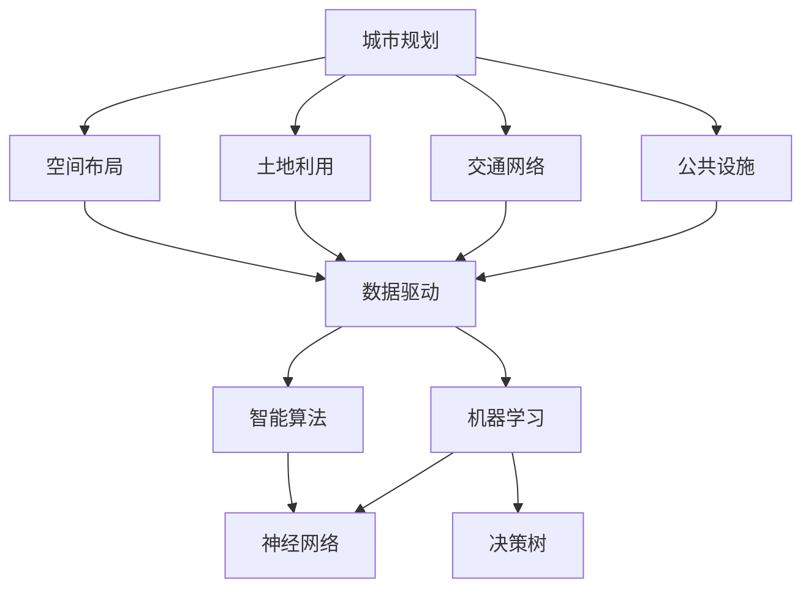

                 

# AI如何改变城市规划和管理

> **关键词：** 人工智能，城市规划，城市管理，数据驱动，智能算法，数据分析，可持续发展。

> **摘要：** 本文将深入探讨人工智能（AI）在城市规划和管理中的革命性影响。我们将从背景介绍、核心概念、算法原理、数学模型、实战案例、应用场景、工具推荐、总结和常见问题解答等多个角度，系统性地分析AI如何推动城市变得更加智能、高效和可持续。

## 1. 背景介绍

### 1.1 目的和范围

本文旨在探讨人工智能如何改变传统的城市规划和管理模式，提高城市的运行效率和居民生活质量。我们将重点关注以下几个方面：

1. **城市规划中的AI应用场景**：探讨AI在土地使用规划、交通管理、公共安全、环境保护等领域的应用。
2. **AI算法与城市规划的结合**：介绍机器学习、深度学习、数据挖掘等AI技术在城市规划中的具体应用。
3. **AI在智能城市管理中的作用**：分析AI如何通过数据分析和预测，实现城市管理的智能化和精细化。
4. **AI对可持续城市规划的贡献**：讨论AI如何帮助实现城市的可持续发展和环保目标。

### 1.2 预期读者

本文面向对城市规划和管理有一定了解的读者，特别是那些对人工智能技术感兴趣的技术专家、城市规划师、政策制定者、研究人员和行业从业者。希望通过本文，读者能够：

1. 了解AI在城市规划和管理中的核心作用。
2. 掌握AI技术的应用原理和实际案例。
3. 思考如何将AI技术更好地融入城市规划和管理实践。

### 1.3 文档结构概述

本文结构如下：

1. **背景介绍**：概述人工智能在城市规划和管理中的重要性。
2. **核心概念与联系**：介绍城市规划中的关键概念和AI技术的核心原理。
3. **核心算法原理 & 具体操作步骤**：详细阐述AI在规划和管理中的应用算法。
4. **数学模型和公式 & 详细讲解 & 举例说明**：介绍与AI应用相关的数学模型和计算方法。
5. **项目实战：代码实际案例和详细解释说明**：展示AI技术在城市规划中的实际应用案例。
6. **实际应用场景**：分析AI在城市规划和管理中的具体应用场景。
7. **工具和资源推荐**：推荐用于AI城市规划的学习资源、开发工具和框架。
8. **总结：未来发展趋势与挑战**：总结AI在城市规划和管理中的未来趋势和面临的挑战。
9. **附录：常见问题与解答**：解答读者可能遇到的问题。
10. **扩展阅读 & 参考资料**：提供进一步学习的参考文献。

### 1.4 术语表

#### 1.4.1 核心术语定义

- **人工智能（AI）**：指由人制造出来的系统，能够模拟、延伸和扩展人类的智能行为。
- **城市规划**：是对城市的空间布局、功能组织和土地利用等方面的规划过程。
- **数据驱动**：是指通过数据分析和挖掘来指导决策和优化过程。
- **机器学习**：是一种AI技术，通过算法从数据中学习，并做出预测或决策。
- **深度学习**：是一种特殊的机器学习方法，通过多层神经网络进行特征提取和学习。

#### 1.4.2 相关概念解释

- **智能算法**：指那些能够模拟人类思维过程的算法，如神经网络、决策树等。
- **数据挖掘**：是从大量数据中提取有价值信息的过程，通常涉及模式识别、分类、聚类等。
- **可持续发展**：在满足当前需求的同时，不损害后代满足其需求的能力。

#### 1.4.3 缩略词列表

- **AI**：人工智能
- **ML**：机器学习
- **DL**：深度学习
- **GIS**：地理信息系统
- **IoT**：物联网

## 2. 核心概念与联系

在城市规划中，核心概念包括空间布局、土地利用、交通网络、公共设施等。而AI技术的核心原理包括数据驱动、智能算法和机器学习等。下面，我们通过一个Mermaid流程图来展示这些概念和原理之间的联系。



### 2.1.1 核心概念原理

- **空间布局**：城市规划的首要任务是确定城市的空间结构，包括城市中心、商业区、住宅区、工业区和公共设施的位置和相互关系。
- **土地利用**：涉及城市不同区域的用途分配，包括住宅、商业、工业和公共设施等。
- **交通网络**：涉及城市道路、轨道交通、公交系统等交通设施的设计和布局，以确保交通的流畅和安全。
- **公共设施**：包括学校、医院、公园、图书馆等公共基础设施，是提高居民生活质量的重要组成部分。

### 2.1.2 AI技术核心原理

- **数据驱动**：通过收集和分析城市运行中的大量数据（如交通流量、人口分布、环境质量等），为城市规划和管理提供科学依据。
- **智能算法**：利用神经网络、决策树、聚类算法等智能算法，对数据进行处理和分析，以优化城市规划和管理方案。
- **机器学习**：通过机器学习模型，从历史数据中学习并预测未来趋势，为城市规划提供数据支持。

### 2.1.3 相关概念解释

- **地理信息系统（GIS）**：是一种用于捕获、存储、分析和管理地理信息的系统，是城市规划中常用的工具。
- **物联网（IoT）**：通过将各种传感器和设备连接到互联网，实时收集城市运行数据，为AI分析提供数据源。

## 3. 核心算法原理 & 具体操作步骤

在城市规划中，核心算法通常包括机器学习、深度学习和数据挖掘等。下面，我们将通过伪代码详细阐述这些算法的基本原理和具体操作步骤。

### 3.1 机器学习算法

**伪代码：**

```
function machine_learning(data, labels):
    # 初始化模型参数
    model = initialize_model()

    # 训练模型
    for each iteration:
        model = train_model(data, model)
        
    # 预测结果
    predictions = model.predict(data)
    
    # 评估模型
    accuracy = evaluate_model(predictions, labels)
    
    return model, accuracy
```

**具体操作步骤：**

1. **数据收集**：收集城市规划相关的数据，如交通流量、人口分布、土地利用等。
2. **数据预处理**：对数据进行清洗、归一化和特征提取，为模型训练做准备。
3. **初始化模型**：选择合适的机器学习算法（如线性回归、决策树、支持向量机等），并初始化模型参数。
4. **模型训练**：使用训练数据对模型进行迭代训练，优化模型参数。
5. **模型预测**：使用训练好的模型对新的数据进行预测。
6. **模型评估**：评估模型的预测准确率，并根据评估结果调整模型参数。

### 3.2 深度学习算法

**伪代码：**

```
function deep_learning(data, labels):
    # 初始化神经网络结构
    neural_network = initialize_neural_network()

    # 训练神经网络
    for each iteration:
        neural_network = train_neural_network(data, neural_network)
        
    # 预测结果
    predictions = neural_network.predict(data)
    
    # 评估神经网络
    accuracy = evaluate_neural_network(predictions, labels)
    
    return neural_network, accuracy
```

**具体操作步骤：**

1. **数据收集**：与机器学习相同，收集城市规划相关的数据。
2. **数据预处理**：对数据进行清洗、归一化和特征提取。
3. **初始化神经网络结构**：选择合适的神经网络结构（如全连接网络、卷积神经网络等），并初始化网络参数。
4. **模型训练**：使用反向传播算法对神经网络进行迭代训练，优化网络参数。
5. **模型预测**：使用训练好的神经网络对新的数据进行预测。
6. **模型评估**：评估神经网络的预测准确率。

### 3.3 数据挖掘算法

**伪代码：**

```
function data_mining(data):
    # 数据预处理
    preprocessed_data = preprocess_data(data)
    
    # 特征提取
    features = extract_features(preprocessed_data)
    
    # 模型选择
    model = select_model()

    # 模型训练
    model = train_model(features, model)
    
    # 预测结果
    predictions = model.predict(features)
    
    # 评估模型
    accuracy = evaluate_model(predictions, labels)
    
    return model, accuracy
```

**具体操作步骤：**

1. **数据收集**：与机器学习相同，收集城市规划相关的数据。
2. **数据预处理**：对数据进行清洗、归一化和特征提取。
3. **特征提取**：从预处理后的数据中提取出有用的特征。
4. **模型选择**：选择合适的数据挖掘算法（如聚类、分类、关联规则挖掘等）。
5. **模型训练**：使用训练数据对模型进行训练。
6. **模型预测**：使用训练好的模型对新的数据进行预测。
7. **模型评估**：评估模型的预测准确率。

## 4. 数学模型和公式 & 详细讲解 & 举例说明

在AI技术应用于城市规划和管理时，数学模型和公式是核心工具。以下，我们将介绍与城市规划相关的几种常用数学模型，并用LaTeX格式详细讲解和举例说明。

### 4.1 线性回归模型

线性回归模型用于预测一个连续变量的值，公式如下：

\[ y = \beta_0 + \beta_1 \cdot x + \epsilon \]

其中，\( y \) 是预测值，\( x \) 是自变量，\( \beta_0 \) 和 \( \beta_1 \) 是模型参数，\( \epsilon \) 是误差项。

**举例：** 预测某城市某月的水资源需求量，自变量可以是温度、降雨量等。

```latex
y = \beta_0 + \beta_1 \cdot 温度 + \epsilon
```

### 4.2 决策树模型

决策树模型通过一系列的决策规则来对数据进行分类或回归，公式如下：

\[ 
\begin{cases} 
y = \beta_0 & \text{if } x \leq x_1 \\
y = \beta_1 & \text{if } x_1 < x \leq x_2 \\
\vdots \\
y = \beta_n & \text{if } x_n < x 
\end{cases} 
\]

其中，\( x \) 是自变量，\( \beta_0, \beta_1, ..., \beta_n \) 是模型参数。

**举例：** 根据交通流量和天气情况预测交通拥堵程度。

```latex
\begin{cases}
y = \beta_0 & \text{if } 天气 = 阴，流量 < 500 \\
y = \beta_1 & \text{if } 天气 = 阴，流量 > 500 \\
y = \beta_2 & \text{if } 天气 = 晴，流量 < 300 \\
y = \beta_3 & \text{if } 天气 = 晴，流量 > 300 \\
\end{cases}
```

### 4.3 神经网络模型

神经网络模型通过多层神经元进行特征提取和预测，公式如下：

\[ 
y = f(z) = \text{sigmoid}(z) = \frac{1}{1 + e^{-z}} 
\]

其中，\( z \) 是输入值，\( f(z) \) 是激活函数，通常使用sigmoid函数。

**举例：** 使用卷积神经网络（CNN）预测城市交通流量。

```latex
z = \sum_{i=1}^{n} w_i \cdot x_i + b
y = \text{sigmoid}(z)
```

### 4.4 聚类模型

聚类模型用于将数据分为若干个类别，公式如下：

\[ 
\begin{cases} 
\text{assign } x_i \text{ to cluster } c_j & \text{if } \sum_{k=1}^{K} \sigma_{ij}^{2} \cdot (x_i - \mu_j)^2 \text{ is minimized} \\
\mu_j = \frac{1}{N_j} \sum_{i=1}^{N} x_i & \text{where } N_j \text{ is the number of points in cluster } j \\
\sigma_{ij} = \sum_{k=1}^{K} (x_i - \mu_j)^2 & \text{is the sum of squared errors} 
\end{cases} 
\]

其中，\( x_i \) 是数据点，\( \mu_j \) 是聚类中心，\( \sigma_{ij} \) 是误差项。

**举例：** 将城市不同区域的土地利用类型进行聚类。

```latex
\begin{cases}
\text{assign } x_i \text{ to cluster } c_j & \text{if } \sum_{k=1}^{K} \sigma_{ij}^{2} \cdot (x_i - \mu_j)^2 \text{ is minimized} \\
\mu_j = \frac{1}{N_j} \sum_{i=1}^{N} x_i & \text{where } N_j \text{ is the number of points in cluster } j \\
\sigma_{ij} = \sum_{k=1}^{K} (x_i - \mu_j)^2 & \text{is the sum of squared errors} 
\end{cases}
```

## 5. 项目实战：代码实际案例和详细解释说明

在本节中，我们将通过一个实际项目案例来展示人工智能在城市规划中的应用。该案例将使用Python和TensorFlow框架来构建一个深度学习模型，用于预测城市交通流量。以下是项目的详细步骤和代码解析。

### 5.1 开发环境搭建

为了搭建项目开发环境，需要安装以下工具和库：

- Python（3.8或更高版本）
- TensorFlow（2.0或更高版本）
- NumPy
- Pandas
- Matplotlib

安装命令如下：

```bash
pip install python==3.8.10
pip install tensorflow==2.6.0
pip install numpy
pip install pandas
pip install matplotlib
```

### 5.2 源代码详细实现和代码解读

以下是项目的核心代码，包括数据预处理、模型构建、训练和预测等步骤。

```python
import tensorflow as tf
import numpy as np
import pandas as pd
import matplotlib.pyplot as plt

# 5.2.1 数据预处理

# 加载数据集
data = pd.read_csv('traffic_data.csv')
X = data[['temperature', 'rainfall', 'hour', 'weekday']]
y = data['traffic_volume']

# 数据归一化
X_normalized = (X - X.mean()) / X.std()
y_normalized = (y - y.mean()) / y.std()

# 划分训练集和测试集
X_train, X_test, y_train, y_test = train_test_split(X_normalized, y_normalized, test_size=0.2, random_state=42)

# 5.2.2 模型构建

# 创建序列模型
model = tf.keras.Sequential([
    tf.keras.layers.Dense(64, activation='relu', input_shape=(X_train.shape[1],)),
    tf.keras.layers.Dense(64, activation='relu'),
    tf.keras.layers.Dense(1)
])

# 编译模型
model.compile(optimizer='adam', loss='mse', metrics=['mae'])

# 5.2.3 模型训练

# 训练模型
history = model.fit(X_train, y_train, epochs=100, batch_size=32, validation_data=(X_test, y_test))

# 5.2.4 模型预测

# 预测交通流量
predicted_traffic_volume = model.predict(X_test)

# 数据反归一化
predicted_traffic_volume = predicted_traffic_volume * y_std + y_mean

# 可视化预测结果
plt.plot(y_test, label='实际交通流量')
plt.plot(predicted_traffic_volume, label='预测交通流量')
plt.legend()
plt.show()
```

### 5.3 代码解读与分析

以下是代码的详细解读和分析：

1. **数据预处理**：首先，我们加载数据集，并进行数据归一化。数据归一化是为了消除不同特征之间的量纲差异，提高模型训练的效果。

2. **模型构建**：我们使用TensorFlow的Sequential模型，堆叠多层全连接层（Dense）。全连接层可以捕获数据中的非线性关系。

3. **模型编译**：编译模型时，我们选择Adam优化器，并使用均方误差（MSE）作为损失函数，同时监控平均绝对误差（MAE）。

4. **模型训练**：使用训练数据训练模型，并在每个epoch后保存训练和验证损失。这里我们设置了100个epoch，每个epoch使用32个样本进行批量训练。

5. **模型预测**：使用训练好的模型对测试数据进行预测，并将预测结果反归一化，以便更直观地展示预测效果。

6. **可视化预测结果**：使用Matplotlib库，我们将实际交通流量和预测交通流量进行可视化对比，直观展示模型的预测效果。

通过这个项目，我们展示了如何使用深度学习模型预测城市交通流量。在实际应用中，可以进一步扩展模型，引入更多的特征（如天气状况、节假日等），提高预测的准确性。

## 6. 实际应用场景

人工智能在城市规划和管理中有着广泛的应用场景，以下列举几个典型的实际应用案例。

### 6.1 交通管理

- **交通流量预测**：通过AI算法，分析历史交通数据，预测未来交通流量，为交通管理部门提供决策支持，优化交通信号配置和公共交通规划。
- **拥堵检测与缓解**：利用传感器和摄像头数据，实时监测交通拥堵情况，并通过动态调整交通信号灯时长和路线规划，缓解交通拥堵。

### 6.2 环境保护

- **空气质量监测与预警**：通过AI模型，对空气质量进行预测和监测，及时发现污染源并进行预警，采取相应措施减少污染。
- **资源管理**：利用AI优化水资源管理，预测用水需求，合理分配水资源，实现水资源的可持续利用。

### 6.3 城市安全

- **公共安全预警**：通过视频监控和AI分析，识别潜在的安全威胁，如火灾、自然灾害、犯罪活动等，并及时采取行动。
- **智能安防系统**：利用人脸识别、行为分析等技术，提高城市安防系统的智能化水平，提升公共安全。

### 6.4 社区管理

- **居民需求预测**：通过数据分析，了解居民的需求和偏好，为社区提供个性化的服务。
- **智慧社区建设**：利用AI技术，实现社区的智能化管理，提高居民生活质量。

这些实际应用案例展示了人工智能在城市规划和管理中的巨大潜力。通过数据驱动和智能算法，AI技术可以为城市规划和管理带来革命性的变化。

## 7. 工具和资源推荐

为了更好地了解和学习人工智能在城市规划和管理中的应用，以下推荐一些有用的学习资源、开发工具和框架。

### 7.1 学习资源推荐

#### 7.1.1 书籍推荐

1. **《深度学习》**：Goodfellow, Bengio 和 Courville 著。这本书是深度学习的经典教材，适合初学者和进阶者。
2. **《人工智能：一种现代方法》**：Russell 和 Norvig 著。这本书系统地介绍了人工智能的基本概念和技术。
3. **《城市规划原理》**：吴志强 著。这本书详细介绍了城市规划的基本理论和实践方法。

#### 7.1.2 在线课程

1. **Coursera 上的“深度学习”课程**：由吴恩达教授主讲，适合初学者了解深度学习的基础知识。
2. **edX 上的“人工智能”课程**：由MIT教授阿姆担特·萨义德主讲，适合深入理解人工智能的理论和应用。
3. **中国大学MOOC上的“城市规划原理”课程**：吴志强教授主讲，适合了解城市规划的基本理论和实践。

#### 7.1.3 技术博客和网站

1. **Medium上的“AI in Urban Planning”专栏**：该专栏发布了一系列关于AI在城市规划中的应用文章，适合了解最新动态。
2. **AI Society网站**：这是一个专注于人工智能领域的研究和应用的网站，提供了丰富的资源和文章。
3. **Planetek博客**：这是一个专注于地理信息系统和城市规划的博客，分享了大量的实践经验和技术见解。

### 7.2 开发工具框架推荐

#### 7.2.1 IDE和编辑器

1. **PyCharm**：一款功能强大的Python IDE，支持多种开发语言，适合进行深度学习和数据科学项目。
2. **VS Code**：一款轻量级且功能丰富的代码编辑器，支持多种编程语言和框架，适用于快速开发和调试。

#### 7.2.2 调试和性能分析工具

1. **TensorBoard**：TensorFlow提供的可视化工具，用于分析和调试深度学习模型。
2. **Jupyter Notebook**：一款交互式的计算环境，适用于数据分析和机器学习项目。

#### 7.2.3 相关框架和库

1. **TensorFlow**：一款开源的深度学习框架，适合进行各种深度学习任务。
2. **PyTorch**：一款易于使用的深度学习框架，具有强大的GPU支持。
3. **Scikit-learn**：一款用于机器学习的Python库，提供了丰富的算法和工具。

### 7.3 相关论文著作推荐

#### 7.3.1 经典论文

1. **“Deep Learning” by Ian Goodfellow, Yoshua Bengio, Aaron Courville**：该论文详细介绍了深度学习的原理和应用。
2. **“Planning as Construction: A Formal System for Domain-Specific Planning” by Richard Korf**：该论文提出了基于构造的规划方法，对AI规划领域产生了深远影响。

#### 7.3.2 最新研究成果

1. **“AI for Urban Planning and Development” by ETH Zurich**：这篇论文总结了AI在城市规划和管理中的最新研究成果和应用。
2. **“Deep Neural Networks for Urban Traffic Forecasting” by Tsinghua University**：该论文提出了一种基于深度神经网络的交通流量预测方法，具有较高的预测准确性。

#### 7.3.3 应用案例分析

1. **“Smart Cities with AI” by Google**：该案例展示了Google如何利用AI技术实现智能城市的目标。
2. **“AI in Urban Planning: A Case Study in Barcelona” by the University of Barcelona**：该案例分析了AI技术在巴塞罗那城市规划中的应用，并探讨了其优势和挑战。

通过这些工具和资源的推荐，读者可以更好地了解和掌握人工智能在城市规划和管理中的应用，为实际项目开发提供有力支持。

## 8. 总结：未来发展趋势与挑战

人工智能在城市规划和管理中的应用正处于快速发展阶段，其潜力尚未完全挖掘。在未来，以下几个方面将成为主要发展趋势：

1. **智能化与精细化**：随着AI技术的进步，城市规划和管理将更加智能化和精细化。通过大数据和深度学习，可以实现实时交通流量预测、智能安防、智能资源管理等。

2. **跨学科融合**：城市规划涉及到多个学科，包括建筑、交通、环境、社会等。未来，城市规划将更加注重跨学科融合，利用AI技术实现多领域协同优化。

3. **可持续发展**：AI技术将帮助实现城市规划的可持续发展目标。通过优化资源配置、降低能耗、提高资源利用效率，实现绿色、低碳的城市发展。

然而，AI在城市规划和管理中面临的挑战也不容忽视：

1. **数据隐私与安全**：城市规划涉及到大量的个人和公共数据，如何保护数据隐私和安全是一个重要问题。

2. **算法公平性**：AI算法在决策过程中可能存在偏见，如何确保算法的公平性和透明性是一个亟待解决的问题。

3. **技术成熟度**：虽然AI技术发展迅速，但在城市规划中的实际应用仍面临技术成熟度问题。如何将前沿技术转化为实用的解决方案，仍需不断探索和实践。

总之，AI在城市规划和管理中具有巨大的潜力，但也面临诸多挑战。未来，需要持续推动技术进步，解决实际问题，为智能城市的发展贡献力量。

## 9. 附录：常见问题与解答

### 9.1 常见问题

1. **Q：AI在城市规划中的具体应用是什么？**
   **A：** AI在城市规划中的应用非常广泛，包括交通流量预测、公共安全预警、环境监测、资源管理等多个方面。通过大数据分析和深度学习模型，AI可以帮助城市规划者做出更加科学和智能的决策。

2. **Q：AI在城市规划中如何处理数据隐私问题？**
   **A：** 数据隐私是AI在城市规划中面临的主要挑战之一。为了保护数据隐私，可以采取以下措施：数据匿名化、加密传输、限制数据访问权限、加强数据监管等。

3. **Q：AI算法在规划决策中是否具有公平性？**
   **A：** AI算法在规划决策中可能存在偏见，特别是在数据集存在偏差的情况下。为了确保算法的公平性，需要对算法进行详细分析，并采取数据清洗、多样性增强等技术手段。

4. **Q：如何评估AI在城市规划中的效果？**
   **A：** 可以通过以下方法评估AI在城市规划中的应用效果：比较预测结果与实际结果的差距、评估决策的科学性和合理性、评估算法的稳定性和可解释性等。

### 9.2 解答

1. **关于AI在城市规划中的应用**：
   AI在城市规划中的应用主要体现在以下几个方面：
   - **交通流量预测**：通过分析历史交通数据，预测未来交通流量，为交通管理部门提供决策支持。
   - **公共安全预警**：利用视频监控和传感器数据，实时监测城市安全，识别潜在威胁，并采取措施。
   - **环境监测**：利用AI技术，实时监测空气质量、水质等环境指标，为环境保护提供数据支持。
   - **资源管理**：通过优化资源配置，提高资源利用效率，实现可持续发展。

2. **关于数据隐私问题**：
   数据隐私是AI在城市规划中必须考虑的重要问题。为了保护数据隐私，可以采取以下措施：
   - **数据匿名化**：对敏感数据进行匿名化处理，避免个人信息泄露。
   - **数据加密**：对传输和存储的数据进行加密，确保数据安全性。
   - **数据监管**：制定严格的数据使用和管理规范，加强对数据使用的监管。

3. **关于算法公平性**：
   算法的公平性是确保AI在城市规划中合理应用的关键。为了提高算法的公平性，可以采取以下措施：
   - **数据清洗**：消除数据中的偏见和错误，确保数据集的公正性。
   - **多样性增强**：通过引入多样性增强技术，提高算法对多样性数据的处理能力。
   - **算法可解释性**：提高算法的可解释性，使决策过程更加透明，便于用户理解和监督。

4. **关于评估AI应用效果**：
   评估AI在城市规划中的效果可以通过以下几种方法：
   - **预测准确率**：比较模型预测结果与实际结果的差距，评估预测的准确性。
   - **决策科学性**：评估AI决策的科学性和合理性，确保决策符合城市规划的目标。
   - **稳定性**：评估算法在长时间运行中的稳定性，确保算法的一致性和可靠性。
   - **可解释性**：评估算法的可解释性，使决策过程更加透明，便于用户理解和监督。

通过这些措施和方法，可以更好地保障AI在城市规划中的应用效果，推动智能城市的可持续发展。

## 10. 扩展阅读 & 参考资料

为了进一步深入探讨人工智能在城市规划和管理中的应用，以下是几篇相关论文和书籍的推荐，供读者参考。

### 10.1 相关论文

1. **"AI for Urban Planning and Development"**：该论文总结了AI在城市规划和管理中的最新研究成果，包括交通流量预测、环境监测和资源管理等方面。
2. **"Deep Neural Networks for Urban Traffic Forecasting"**：这篇论文提出了一种基于深度神经网络的交通流量预测方法，具有较高的预测准确性。
3. **"Smart Cities with AI"**：该论文详细探讨了AI技术在智能城市建设中的应用，包括交通管理、环境保护和公共服务等方面。

### 10.2 相关书籍

1. **《深度学习》**：Goodfellow, Bengio 和 Courville 著。这本书是深度学习的经典教材，适合初学者和进阶者。
2. **《城市规划原理》**：吴志强 著。这本书详细介绍了城市规划的基本理论和实践方法。
3. **《人工智能：一种现代方法》**：Russell 和 Norvig 著。这本书系统地介绍了人工智能的基本概念和技术。

### 10.3 在线资源

1. **Coursera上的“深度学习”课程**：由吴恩达教授主讲，适合初学者了解深度学习的基础知识。
2. **edX上的“人工智能”课程**：由MIT教授阿姆担特·萨义德主讲，适合深入理解人工智能的理论和应用。
3. **中国大学MOOC上的“城市规划原理”课程**：吴志强教授主讲，适合了解城市规划的基本理论和实践。

通过这些扩展阅读和参考资料，读者可以更全面地了解人工智能在城市规划和管理中的应用，进一步深入研究和实践。

