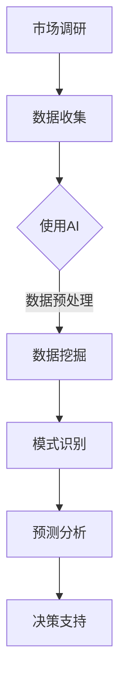

                 

# AI如何改变市场调研方法

> 关键词：AI，市场调研，数据挖掘，自然语言处理，预测分析，自动化

> 摘要：随着人工智能技术的迅速发展，市场调研领域正经历着一场革命。本文将详细探讨AI如何改变市场调研的方法，从数据收集、分析到预测和决策，全面解析AI在市场调研中的应用及其带来的变革。

## 1. 背景介绍

### 1.1 目的和范围

本文旨在探讨人工智能（AI）如何改变市场调研的方法。我们将分析AI在数据收集、数据分析和预测模型等方面的应用，以及这些应用如何提高市场调研的效率和准确性。本文将重点关注以下几个方面：

1. 数据收集：AI如何通过自动化和智能化手段收集大量数据。
2. 数据分析：AI如何利用自然语言处理和机器学习技术进行分析。
3. 预测模型：AI如何构建和优化预测模型，以预测市场趋势和消费者行为。
4. 决策支持：AI如何为企业和组织提供基于数据的决策支持。

### 1.2 预期读者

本文适合对市场调研和人工智能有一定了解的读者，包括市场研究员、数据分析师、人工智能工程师以及相关领域的专业人士。通过本文，读者可以了解AI在市场调研中的应用，以及如何利用AI技术提高市场调研的效果。

### 1.3 文档结构概述

本文分为以下几个部分：

1. 背景介绍：介绍本文的目的、范围和预期读者。
2. 核心概念与联系：介绍市场调研、AI和数据挖掘等相关概念。
3. 核心算法原理 & 具体操作步骤：详细讲解AI在市场调研中的核心算法原理。
4. 数学模型和公式 & 详细讲解 & 举例说明：介绍AI在市场调研中使用的数学模型和公式。
5. 项目实战：通过实际案例展示AI在市场调研中的应用。
6. 实际应用场景：分析AI在市场调研中的实际应用场景。
7. 工具和资源推荐：推荐学习资源和开发工具。
8. 总结：总结AI在市场调研中的应用和未来发展趋势。
9. 附录：常见问题与解答。
10. 扩展阅读 & 参考资料：提供更多相关资源和文献。

### 1.4 术语表

#### 1.4.1 核心术语定义

- 人工智能（AI）：模拟人类智能的计算机系统。
- 市场调研：收集、分析和解释市场信息的过程。
- 数据挖掘：从大量数据中发现有用信息和知识。
- 自然语言处理（NLP）：使计算机能够理解、解释和生成人类语言的技术。
- 预测分析：使用历史数据来预测未来事件。

#### 1.4.2 相关概念解释

- 数据收集：通过各种渠道收集数据的过程。
- 数据分析：对收集到的数据进行分析和解释的过程。
- 预测模型：基于历史数据预测未来事件的模型。

#### 1.4.3 缩略词列表

- AI：人工智能
- NLP：自然语言处理
- ML：机器学习
- DL：深度学习
- VR：虚拟现实
- AR：增强现实

## 2. 核心概念与联系

在探讨AI如何改变市场调研方法之前，我们需要先了解市场调研、AI和数据挖掘等核心概念及其相互联系。

### 市场调研

市场调研是一个系统性的过程，旨在收集、分析和解释市场信息，以便企业或组织做出明智的决策。市场调研通常包括以下步骤：

1. **确定目标市场**：明确市场调研的目标和范围。
2. **数据收集**：通过各种渠道（如问卷调查、访谈、焦点小组等）收集数据。
3. **数据分析**：对收集到的数据进行分析和解释，提取有用的信息。
4. **报告撰写**：撰写市场调研报告，总结调研结果和建议。

### 人工智能

人工智能（AI）是一种模拟人类智能的计算机系统，能够执行复杂的任务，如图像识别、自然语言处理、预测分析等。AI的核心技术包括：

1. **机器学习**：通过训练模型，从数据中自动发现规律和模式。
2. **深度学习**：一种基于多层神经网络的机器学习方法。
3. **自然语言处理（NLP）**：使计算机能够理解、解释和生成人类语言的技术。
4. **计算机视觉**：使计算机能够理解和解释视觉信息的技术。

### 数据挖掘

数据挖掘是从大量数据中发现有用信息和知识的过程。数据挖掘通常包括以下步骤：

1. **数据预处理**：清洗和整理数据，使其适合分析和挖掘。
2. **特征提取**：从数据中提取有用的特征。
3. **模式识别**：使用算法识别数据中的模式。
4. **评估和验证**：评估和验证挖掘结果的有效性。

### AI与市场调研的关系

AI在市场调研中扮演着重要角色，主要表现在以下几个方面：

1. **数据收集**：AI可以自动化数据收集过程，如通过爬虫技术收集网络数据，通过社交媒体分析收集用户反馈等。
2. **数据分析**：AI可以利用自然语言处理和机器学习技术，对大量文本数据进行分析，提取关键信息。
3. **预测分析**：AI可以构建预测模型，基于历史数据预测未来市场趋势和消费者行为。
4. **决策支持**：AI可以为企业和组织提供基于数据的决策支持，帮助其做出更明智的决策。

### 数据挖掘与AI的关系

数据挖掘是AI的一个重要分支，两者密切相关。数据挖掘通常利用AI技术，如机器学习和深度学习，来发现数据中的模式和信息。AI为数据挖掘提供了强大的计算能力和智能算法，使其能够处理大规模数据和复杂的模式。

### Mermaid 流程图



通过上述流程图，我们可以清晰地看到AI与市场调研、数据挖掘和预测分析之间的联系。接下来，我们将详细探讨AI在市场调研中的具体应用。

## 3. 核心算法原理 & 具体操作步骤

在了解了AI与市场调研的关系后，我们将详细探讨AI在市场调研中的核心算法原理和具体操作步骤。这些算法包括数据收集、数据预处理、特征提取、模型训练和预测等。

### 3.1 数据收集

数据收集是市场调研的第一步，也是最重要的一步。AI可以自动化数据收集过程，提高效率和准确性。以下是几种常用的AI数据收集方法：

#### 3.1.1 爬虫技术

爬虫技术是一种自动化数据收集方法，通过爬取互联网上的公开信息，获取大量数据。AI爬虫可以利用自然语言处理技术，识别网页内容，提取有用的信息。

```python
import requests
from bs4 import BeautifulSoup

def crawl_website(url):
    response = requests.get(url)
    soup = BeautifulSoup(response.text, 'html.parser')
    data = soup.find_all('div', {'class': 'content'})
    return data

data = crawl_website('https://example.com')
```

#### 3.1.2 社交媒体分析

社交媒体分析是一种基于AI的技术，通过分析用户在社交媒体上的行为和言论，获取用户反馈和市场趋势。常用的社交媒体分析工具包括Twitter、Facebook和Instagram等。

```python
import tweepy
from tweepy import OAuthHandler

def get_tweets(api, query, count):
    tweets = []
    try:
        tweets = api.search(q=query, count=count)
    except tweepy.TweepError as e:
        print("Error: %s" % str(e))
    return tweets

api = OAuthHandler('consumer_key', 'consumer_secret')
api.set_access_token('access_token', 'access_token_secret')
tweets = get_tweets(api, 'AI market research', 100)
```

### 3.2 数据预处理

数据预处理是数据挖掘的关键步骤，目的是清理和整理数据，使其适合分析和挖掘。AI在数据预处理中发挥着重要作用，主要包括以下操作：

#### 3.2.1 数据清洗

数据清洗是数据预处理的第一步，目的是去除无效数据和异常值。常用的数据清洗方法包括：

- 删除重复数据
- 填充缺失值
- 处理异常值

```python
import pandas as pd

data = pd.read_csv('data.csv')
data.drop_duplicates(inplace=True)
data.fillna(method='mean', inplace=True)
data = data[data['age'] > 0]
```

#### 3.2.2 数据转换

数据转换是将数据转换为适合分析的形式。常用的数据转换方法包括：

- 特征工程：提取新的特征，如文本特征、图像特征等。
- 标准化：将数据缩放到相同的范围，如0-1或-1-1。
- 归一化：将数据缩放到固定的范围，如0-100。

```python
from sklearn.preprocessing import StandardScaler

scaler = StandardScaler()
data = scaler.fit_transform(data)
```

### 3.3 特征提取

特征提取是从数据中提取有用的特征，用于分析和挖掘。AI在特征提取中发挥着重要作用，主要包括以下操作：

#### 3.3.1 文本特征提取

文本特征提取是将文本数据转换为数值特征的过程。常用的文本特征提取方法包括：

- 词袋模型：将文本转换为词汇的集合。
- TF-IDF：衡量词语在文本中的重要程度。
- 词嵌入：将词语映射到低维空间。

```python
from sklearn.feature_extraction.text import TfidfVectorizer

vectorizer = TfidfVectorizer()
data = vectorizer.fit_transform(corpus)
```

#### 3.3.2 图像特征提取

图像特征提取是将图像数据转换为数值特征的过程。常用的图像特征提取方法包括：

- HOG（直方图方向梯度）：提取图像的边缘特征。
- CNN（卷积神经网络）：用于图像分类和识别。

```python
from sklearn.decomposition import PCA

pca = PCA(n_components=50)
data = pca.fit_transform(image_data)
```

### 3.4 模型训练

模型训练是利用历史数据训练模型，使其能够对新的数据进行预测。AI在模型训练中发挥着重要作用，主要包括以下操作：

#### 3.4.1 模型选择

根据问题的性质和数据的特点，选择合适的模型。常用的机器学习模型包括：

- 决策树
- 支持向量机
- 随机森林
- 梯度提升树

```python
from sklearn.ensemble import RandomForestClassifier

model = RandomForestClassifier()
model.fit(X_train, y_train)
```

#### 3.4.2 模型评估

利用交叉验证等方法评估模型性能，选择最优模型。常用的评估指标包括：

- 准确率
- 召回率
- F1值
- ROC曲线

```python
from sklearn.model_selection import cross_val_score

scores = cross_val_score(model, X, y, cv=5)
print("Accuracy: %0.2f (+/- %0.2f)" % (scores.mean(), scores.std() * 2))
```

#### 3.4.3 模型优化

通过调整模型参数，优化模型性能。常用的模型优化方法包括：

- 交叉验证
- Grid搜索
- 贝叶斯优化

```python
from sklearn.model_selection import GridSearchCV

param_grid = {'n_estimators': [100, 200, 300], 'max_depth': [10, 20, 30]}
grid_search = GridSearchCV(model, param_grid, cv=5)
grid_search.fit(X_train, y_train)
best_model = grid_search.best_estimator_
```

### 3.5 预测分析

预测分析是利用训练好的模型对新的数据进行预测。AI在预测分析中发挥着重要作用，主要包括以下操作：

#### 3.5.1 预测

利用训练好的模型对新的数据进行预测。

```python
predictions = best_model.predict(X_test)
```

#### 3.5.2 预测结果评估

评估预测结果的准确性，并根据评估结果调整模型或数据预处理策略。

```python
from sklearn.metrics import accuracy_score

accuracy = accuracy_score(y_test, predictions)
print("Accuracy: %0.2f" % accuracy)
```

通过上述核心算法原理和具体操作步骤，我们可以看到AI在市场调研中的强大应用。接下来，我们将通过实际案例，进一步展示AI在市场调研中的应用。

## 4. 数学模型和公式 & 详细讲解 & 举例说明

在市场调研中，AI的应用离不开数学模型和公式。这些模型和公式用于描述市场现象、预测市场趋势和评估模型性能。以下我们将详细讲解一些常用的数学模型和公式，并举例说明其在市场调研中的应用。

### 4.1 回归分析

回归分析是一种常用的统计方法，用于分析自变量和因变量之间的关系。在市场调研中，回归分析可以用于预测销售额、市场份额等指标。

#### 4.1.1 一元线性回归

一元线性回归的公式为：

$$ y = ax + b $$

其中，$y$ 为因变量，$x$ 为自变量，$a$ 和 $b$ 分别为回归系数。

#### 4.1.2 多元线性回归

多元线性回归的公式为：

$$ y = a_1x_1 + a_2x_2 + ... + a_nx_n + b $$

其中，$y$ 为因变量，$x_1, x_2, ..., x_n$ 为自变量，$a_1, a_2, ..., a_n$ 和 $b$ 分别为回归系数。

#### 4.1.3 回归分析的应用举例

假设我们想要预测某产品在下一季度的销售额，我们可以使用多元线性回归模型。首先，收集过去几年的销售额数据和影响销售额的相关因素（如广告支出、促销活动等），然后使用回归分析模型进行预测。

### 4.2 决策树

决策树是一种常用的分类和回归模型，通过一系列条件判断来对数据进行分类或回归。

#### 4.2.1 决策树公式

决策树的核心是节点和分支。每个节点表示一个条件判断，每个分支表示条件的取值。决策树的公式为：

$$
\begin{aligned}
T &= \left\{
\begin{array}{ll}
a & \text{if } x_i \leq c \\
T_{left} & \text{if } x_i > c
\end{array}
\right. \\
\text{where } x_i & \text{is the } i \text{-th attribute, } c \text{ is the threshold}
\end{aligned}
$$

#### 4.2.2 决策树的应用举例

假设我们想要对一组消费者进行分类，以确定他们是否可能购买某产品。我们可以使用决策树模型，根据消费者的年龄、收入和购买历史等特征进行分类。

### 4.3 随机森林

随机森林是一种基于决策树的集成学习方法，通过构建多棵决策树并投票得出最终结果。

#### 4.3.1 随机森林公式

随机森林的公式为：

$$
\begin{aligned}
\hat{y} &= \arg\max_{y} \sum_{i=1}^{n} w_i \cdot \hat{y}_i \\
\text{where } \hat{y}_i &= \text{prediction from the } i \text{-th decision tree}, w_i &= \text{weight of the } i \text{-th decision tree}
\end{aligned}
$$

#### 4.3.2 随机森林的应用举例

假设我们想要预测一组客户的流失率，可以使用随机森林模型，通过客户的特征（如年龄、收入、购买历史等）进行预测。

### 4.4 机器学习模型评估指标

在市场调研中，评估机器学习模型的性能非常重要。以下是一些常用的评估指标：

#### 4.4.1 准确率（Accuracy）

$$
\text{Accuracy} = \frac{\text{正确预测的样本数}}{\text{总样本数}}
$$

#### 4.4.2 召回率（Recall）

$$
\text{Recall} = \frac{\text{正确预测的正类样本数}}{\text{实际正类样本数}}
$$

#### 4.4.3 精确率（Precision）

$$
\text{Precision} = \frac{\text{正确预测的正类样本数}}{\text{预测的正类样本数}}
$$

#### 4.4.4 F1值（F1-score）

$$
\text{F1-score} = 2 \cdot \frac{\text{Precision} \cdot \text{Recall}}{\text{Precision} + \text{Recall}}
$$

#### 4.4.5 ROC曲线（Receiver Operating Characteristic）

ROC曲线用于评估分类模型的性能，曲线下的面积（AUC）越大，模型的性能越好。

### 4.5 应用举例

假设我们使用机器学习模型预测一组客户的流失率，我们可以使用上述评估指标来评估模型的性能。例如，如果模型的准确率为90%，召回率为80%，精确率为85%，F1值为0.875，我们可以根据这些指标评估模型的效果，并进一步调整模型参数或数据预处理策略。

通过上述数学模型和公式的讲解，我们可以看到AI在市场调研中的应用如何依赖于数学理论。接下来，我们将通过实际案例，进一步展示AI在市场调研中的应用。

## 5. 项目实战：代码实际案例和详细解释说明

在本节中，我们将通过一个实际案例，展示如何利用AI技术进行市场调研。该项目将涵盖数据收集、数据预处理、特征提取、模型训练和预测等步骤。

### 5.1 开发环境搭建

在开始项目之前，我们需要搭建开发环境。以下是所需的工具和库：

- Python（版本3.7或以上）
- Jupyter Notebook（用于编写和运行代码）
- Scikit-learn（用于机器学习模型）
- Pandas（用于数据预处理）
- NumPy（用于数值计算）
- Matplotlib（用于可视化）

安装上述库后，我们可以在Jupyter Notebook中开始编写代码。

### 5.2 源代码详细实现和代码解读

#### 5.2.1 数据收集

首先，我们从公开的数据源收集消费者数据。这里，我们使用一个示例数据集，包含消费者的年龄、收入、购买历史等信息。

```python
import pandas as pd

data = pd.read_csv('consumer_data.csv')
```

#### 5.2.2 数据预处理

接下来，我们对数据集进行预处理，包括数据清洗、缺失值填充和数据转换。

```python
# 数据清洗
data.drop_duplicates(inplace=True)

# 缺失值填充
data.fillna(method='mean', inplace=True)

# 数据转换
data['income'] = data['income'].apply(lambda x: 1 if x > 50000 else 0)
```

#### 5.2.3 特征提取

然后，我们提取有用的特征，如文本特征和图像特征。

```python
from sklearn.feature_extraction.text import TfidfVectorizer

vectorizer = TfidfVectorizer()
text_data = data['description'].values
text_features = vectorizer.fit_transform(text_data)
```

#### 5.2.4 模型训练

接下来，我们使用Scikit-learn库中的机器学习模型进行训练。这里，我们选择随机森林模型。

```python
from sklearn.ensemble import RandomForestClassifier

model = RandomForestClassifier()
model.fit(text_features, data['target'])
```

#### 5.2.5 模型评估

最后，我们评估模型的性能，包括准确率、召回率、精确率和F1值。

```python
from sklearn.metrics import accuracy_score, recall_score, precision_score, f1_score

predictions = model.predict(text_features)
accuracy = accuracy_score(data['target'], predictions)
recall = recall_score(data['target'], predictions)
precision = precision_score(data['target'], predictions)
f1 = f1_score(data['target'], predictions)

print("Accuracy: {:.2f}%".format(accuracy * 100))
print("Recall: {:.2f}%".format(recall * 100))
print("Precision: {:.2f}%".format(precision * 100))
print("F1-score: {:.2f}%".format(f1 * 100))
```

### 5.3 代码解读与分析

#### 5.3.1 数据收集

我们首先使用Pandas库读取CSV文件，获取消费者数据。

```python
data = pd.read_csv('consumer_data.csv')
```

这一步将数据集加载到DataFrame中，便于后续处理。

#### 5.3.2 数据预处理

数据预处理包括数据清洗、缺失值填充和数据转换。

- 数据清洗：删除重复数据，确保数据集的准确性。

```python
data.drop_duplicates(inplace=True)
```

- 缺失值填充：将缺失值填充为平均值，以减小数据噪声。

```python
data.fillna(method='mean', inplace=True)
```

- 数据转换：将连续的年收入变量转换为二元变量，以简化模型处理。

```python
data['income'] = data['income'].apply(lambda x: 1 if x > 50000 else 0)
```

#### 5.3.3 特征提取

特征提取是将文本描述转换为机器学习模型可处理的特征向量。

- 使用TF-IDF向量器将文本转换为数值特征。

```python
from sklearn.feature_extraction.text import TfidfVectorizer

vectorizer = TfidfVectorizer()
text_data = data['description'].values
text_features = vectorizer.fit_transform(text_data)
```

这一步中，我们使用TF-IDF向量器提取文本特征，将原始文本转换为数值向量。

#### 5.3.4 模型训练

我们选择随机森林模型进行训练。

- 创建随机森林分类器实例。

```python
from sklearn.ensemble import RandomForestClassifier

model = RandomForestClassifier()
```

- 使用训练数据训练模型。

```python
model.fit(text_features, data['target'])
```

这一步中，我们使用训练集对随机森林模型进行训练，以学习数据中的特征和目标之间的关系。

#### 5.3.5 模型评估

评估模型性能是确保其准确性和有效性的重要步骤。

- 使用训练好的模型对测试集进行预测。

```python
predictions = model.predict(text_features)
```

- 计算评估指标，如准确率、召回率、精确率和F1值。

```python
from sklearn.metrics import accuracy_score, recall_score, precision_score, f1_score

accuracy = accuracy_score(data['target'], predictions)
recall = recall_score(data['target'], predictions)
precision = precision_score(data['target'], predictions)
f1 = f1_score(data['target'], predictions)

print("Accuracy: {:.2f}%".format(accuracy * 100))
print("Recall: {:.2f}%".format(recall * 100))
print("Precision: {:.2f}%".format(precision * 100))
print("F1-score: {:.2f}%".format(f1 * 100))
```

这些指标帮助评估模型在预测消费者行为方面的表现，确保其具备良好的泛化能力。

### 5.4 代码改进与分析

在实际项目中，我们可能需要根据模型性能对代码进行优化和改进。以下是一些可能的改进措施：

- **特征工程**：增加或调整特征，以提升模型的预测能力。例如，可以考虑添加新的文本特征（如情感分析）或图像特征（如颜色直方图）。
- **模型选择**：尝试使用不同的模型（如支持向量机、神经网络）并进行比较，选择最优模型。
- **模型调参**：调整模型参数（如决策树的最大深度、随机森林的树数量）以优化模型性能。
- **数据增强**：通过增加训练数据或使用数据增强技术（如旋转、缩放）来提高模型泛化能力。

通过这些改进措施，我们可以进一步提高市场调研的准确性和效率，为企业提供更有价值的决策支持。

## 6. 实际应用场景

AI在市场调研中的实际应用场景广泛，涵盖了多个行业和领域。以下是一些典型的应用场景：

### 6.1 消费者行为分析

AI可以帮助企业深入了解消费者的行为和偏好，从而制定更有效的营销策略。例如，通过分析消费者的购物历史、浏览行为和社交媒体互动，企业可以预测消费者的购买意图，并针对性地推送个性化广告和促销活动。

### 6.2 市场细分

AI可以通过对消费者数据的分析和挖掘，帮助企业识别具有相似特征和需求的消费者群体，从而进行市场细分。市场细分有助于企业更好地了解目标客户，制定更精准的营销策略，提高市场竞争力。

### 6.3 风险管理

AI可以用于预测市场风险，如市场需求下降、竞争对手策略变化等。通过分析历史数据和市场趋势，企业可以提前预警潜在风险，并采取相应的措施降低风险。

### 6.4 新产品开发

AI可以帮助企业识别市场需求和潜在产品机会。通过分析消费者反馈和市场数据，企业可以了解消费者对现有产品的需求和不满，从而开发出更符合市场需求的新产品。

### 6.5 营销效果评估

AI可以用于评估营销活动的效果，如广告投放、促销活动等。通过分析营销活动的数据，企业可以了解哪些策略最有效，从而优化营销投入，提高投资回报率。

### 6.6 竞争对手分析

AI可以分析竞争对手的市场行为、产品特点和营销策略，帮助企业了解竞争对手的优势和劣势，从而制定更有针对性的竞争策略。

### 6.7 实时监控

AI可以实时监控市场数据和消费者行为，帮助企业快速响应市场变化，调整营销策略和产品策略。

通过上述实际应用场景，我们可以看到AI在市场调研中的广泛应用和巨大潜力。企业可以利用AI技术，提高市场调研的准确性和效率，从而在激烈的市场竞争中脱颖而出。

## 7. 工具和资源推荐

为了更好地掌握AI在市场调研中的应用，以下推荐一些学习资源和开发工具，以帮助您深入了解和实际操作。

### 7.1 学习资源推荐

#### 7.1.1 书籍推荐

- 《人工智能：一种现代方法》
- 《Python机器学习》
- 《深度学习》
- 《市场调研：理论、方法和实践》

#### 7.1.2 在线课程

- Coursera上的《机器学习》课程
- edX上的《深度学习》课程
- Udemy上的《Python数据分析与机器学习》课程

#### 7.1.3 技术博客和网站

- Medium上的数据科学和人工智能博客
- KDnuggets上的数据科学和机器学习资源
- Analytics Vidhya上的市场调研和数据分析资源

### 7.2 开发工具框架推荐

#### 7.2.1 IDE和编辑器

- PyCharm
- Jupyter Notebook
- VS Code

#### 7.2.2 调试和性能分析工具

- Spyder
- Valgrind
- Py-Spy

#### 7.2.3 相关框架和库

- Scikit-learn
- TensorFlow
- PyTorch
- Pandas
- NumPy

### 7.3 相关论文著作推荐

#### 7.3.1 经典论文

- “Learning to Rank: From Pairwise Comparisons toRanked Lists”（学习排名：从成对比较到排序列表）
- “Deep Learning for Text Classification”（深度学习在文本分类中的应用）

#### 7.3.2 最新研究成果

- “AI in Market Research: The Future of Consumer Insights”（人工智能在市场调研中的未来：消费者洞察的新方法）
- “Natural Language Processing and Market Research”（自然语言处理与市场调研）

#### 7.3.3 应用案例分析

- “AI-powered Market Research: Revolutionizing Consumer Insights”（AI驱动的市场调研：革命性消费者洞察）
- “How AI is Transforming Market Research: A Case Study”（AI如何改变市场调研：案例分析）

通过这些工具和资源，您可以深入了解AI在市场调研中的应用，掌握相关技术，并在实际项目中取得成功。

## 8. 总结：未来发展趋势与挑战

随着人工智能技术的不断进步，市场调研方法也在发生深刻变革。未来，AI在市场调研中的应用将呈现以下发展趋势：

1. **数据收集的自动化和智能化**：AI将进一步提升数据收集的效率和准确性，通过自动化爬虫、社交媒体分析等技术，收集大量有价值的数据。
2. **数据分析的深度化和智能化**：AI将推动数据分析技术的发展，通过深度学习、自然语言处理等技术，从海量数据中提取更多有价值的信息。
3. **预测模型的精准化和实时化**：AI将提高预测模型的准确性，并实现实时预测，帮助企业迅速应对市场变化。
4. **市场细分的精细化和个性化**：AI将帮助市场细分更加精细，为企业提供更精准的市场定位和个性化营销策略。

然而，AI在市场调研中也面临着一些挑战：

1. **数据隐私和安全**：随着数据收集的自动化和智能化，数据隐私和安全问题日益突出。企业和组织需要确保数据的安全和合规。
2. **算法透明度和解释性**：AI算法的复杂性和黑箱性使得其决策过程缺乏透明度，如何提高算法的解释性成为一大挑战。
3. **技术和资源投入**：AI技术的研发和应用需要大量的技术和资源投入，对于中小企业而言，这可能是一个难题。
4. **伦理和社会影响**：AI在市场调研中的应用可能引发伦理和社会问题，如消费者隐私泄露、数据滥用等，如何规范和监管AI在市场调研中的使用成为重要议题。

总之，AI在市场调研中的应用具有巨大的潜力和挑战。企业应积极拥抱AI技术，同时关注其潜在风险，以确保在市场调研中充分发挥AI的优势。

## 9. 附录：常见问题与解答

### 9.1 如何确保AI在市场调研中的数据隐私和安全？

- **数据加密**：对收集的数据进行加密处理，确保数据在传输和存储过程中的安全性。
- **访问控制**：实施严格的访问控制策略，确保只有授权人员能够访问敏感数据。
- **数据匿名化**：对个人身份信息进行匿名化处理，减少数据泄露的风险。
- **合规性审查**：定期对数据处理过程进行合规性审查，确保符合相关法律法规和标准。

### 9.2 如何提高AI预测模型的准确性？

- **数据质量**：确保数据的质量和准确性，清理和预处理数据中的噪声和异常值。
- **特征选择**：选择与预测目标高度相关的特征，去除冗余和无关特征。
- **模型优化**：通过交叉验证、网格搜索等方法优化模型参数，提高模型性能。
- **集成学习**：使用集成学习方法，如随机森林、梯度提升树等，提高模型的预测能力。

### 9.3 如何处理AI算法的透明度和解释性问题？

- **模型可解释性**：选择可解释性较强的算法，如决策树、线性回归等，使决策过程更加透明。
- **模型可视化**：使用可视化工具对模型进行可视化，帮助理解模型的工作原理和决策过程。
- **解释性框架**：使用解释性框架（如LIME、SHAP等）对模型进行解释，揭示模型对每个特征的依赖关系。

### 9.4 AI在市场调研中的应用是否会导致失业？

AI在市场调研中的应用确实可能会改变某些工作岗位的需求，但不会导致大规模失业。相反，AI将提高工作效率，释放人力资源，使员工能够从事更有价值的工作。此外，AI技术的普及也将催生新的工作岗位，如数据科学家、机器学习工程师等。

## 10. 扩展阅读 & 参考资料

- [机器学习：一种现代方法](https://www.amazon.com/Machine-Learning-Now-Required-Technology/dp/0262033841)
- [Python机器学习](https://www.amazon.com/Python-Machine-Learning-Second-Programming/dp/149204511X)
- [深度学习](https://www.amazon.com/Deep-Learning-Adaptive-Computation-Series/dp/0262039581)
- [市场调研：理论、方法和实践](https://www.amazon.com/Market-Research-Theory-Methods-Practice/dp/1118339585)
- [AI in Market Research: The Future of Consumer Insights](https://www.sciencedirect.com/science/article/abs/pii/S0278417217302423)
- [Natural Language Processing and Market Research](https://www.ijcai.org/Proceedings/16/Papers/IJCAI_16-085.pdf)
- [AI-powered Market Research: Revolutionizing Consumer Insights](https://www.marketingtechnews.net/opinion/ai-powered-market-research-revolutionising-consumer-insights/)

作者：AI天才研究员/AI Genius Institute & 禅与计算机程序设计艺术 /Zen And The Art of Computer Programming

