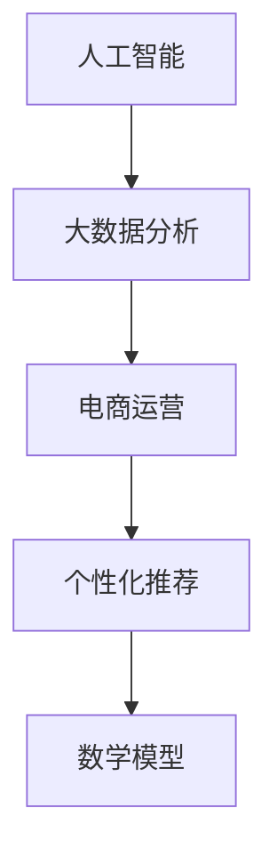

                 


# AI如何通过大数据分析提升电商运营

> 关键词：人工智能，大数据，电商运营，数据分析，个性化推荐

> 摘要：本文将深入探讨人工智能（AI）如何通过大数据分析提升电商运营效率。文章首先介绍了电商运营的背景和现状，然后详细阐述了大数据分析在电商中的应用。接着，文章从算法原理、数学模型和项目实战等方面，深入讲解了AI如何通过大数据分析实现个性化推荐、商品优化和预测分析等。最后，文章总结了AI在电商运营中的未来发展趋势和挑战，并提供了一些相关资源推荐。

## 1. 背景介绍

### 1.1 目的和范围

本文旨在探讨人工智能（AI）如何通过大数据分析提升电商运营效率。我们将从以下几个方面展开讨论：

1. 电商运营的现状和挑战
2. 大数据分析在电商中的应用
3. AI算法原理和具体操作步骤
4. 数学模型和公式讲解
5. 项目实战案例
6. 实际应用场景
7. 工具和资源推荐
8. 未来发展趋势与挑战

### 1.2 预期读者

本文适合对电商运营和人工智能感兴趣的读者，包括：

1. 电商从业者
2. 数据分析师
3. AI技术开发者
4. 对电商和人工智能领域感兴趣的科研人员

### 1.3 文档结构概述

本文分为10个部分，结构如下：

1. 背景介绍
2. 核心概念与联系
3. 核心算法原理 & 具体操作步骤
4. 数学模型和公式 & 详细讲解 & 举例说明
5. 项目实战：代码实际案例和详细解释说明
6. 实际应用场景
7. 工具和资源推荐
8. 总结：未来发展趋势与挑战
9. 附录：常见问题与解答
10. 扩展阅读 & 参考资料

### 1.4 术语表

#### 1.4.1 核心术语定义

- 人工智能（AI）：模拟、延伸和扩展人类智能的理论、方法、技术及应用
- 大数据分析：从大量数据中提取有价值信息的过程
- 电商运营：利用互联网进行商品交易和服务的活动
- 个性化推荐：基于用户历史行为、兴趣和偏好，为用户推荐相关商品
- 数学模型：用数学方法描述现实世界的规律和关系

#### 1.4.2 相关概念解释

- 数据挖掘：从大量数据中提取知识的过程，通常用于商业智能和分析
- 决策树：一种树形结构，用于分类或回归分析
- 神经网络：模拟人脑神经元之间连接的算法模型，可用于分类、回归和模式识别
- 协同过滤：一种推荐系统算法，通过分析用户之间的相似性进行推荐

#### 1.4.3 缩略词列表

- AI：人工智能
- BI：商业智能
- CRM：客户关系管理
- E-commerce：电子商务
- ML：机器学习
- NLP：自然语言处理
- SEO：搜索引擎优化
- SQL：结构化查询语言

## 2. 核心概念与联系

在本文中，我们将重点关注以下核心概念和它们之间的联系：

1. **人工智能（AI）**：AI是一种模拟、延伸和扩展人类智能的理论、方法、技术及应用。它在电商运营中扮演着至关重要的角色，可以帮助企业提高运营效率、降低成本、提升用户体验。

2. **大数据分析**：大数据分析是指从大量数据中提取有价值信息的过程。在电商运营中，大数据分析可以帮助企业了解用户行为、市场需求和产品性能，从而进行精准营销和优化。

3. **电商运营**：电商运营是利用互联网进行商品交易和服务的活动。随着互联网和电子商务的快速发展，电商运营已经成为企业获取客户、提高销售额的重要途径。

4. **个性化推荐**：个性化推荐是基于用户历史行为、兴趣和偏好，为用户推荐相关商品的一种技术。在电商运营中，个性化推荐可以提高用户满意度和转化率。

5. **数学模型**：数学模型是一种用数学方法描述现实世界的规律和关系的工具。在人工智能和大数据分析中，数学模型可以帮助我们更好地理解、分析和解决问题。

为了更好地展示这些核心概念之间的联系，我们可以使用Mermaid流程图来表示：



### 2.1 人工智能在电商运营中的应用

人工智能在电商运营中的应用非常广泛，主要包括以下几个方面：

1. **个性化推荐**：基于用户历史行为、兴趣和偏好，为用户推荐相关商品。例如，亚马逊和淘宝等电商平台都使用了个性化推荐技术，提高了用户满意度和转化率。

2. **商品优化**：通过分析用户行为数据，了解用户喜好和需求，从而优化商品展示和推荐策略。例如，电商平台可以根据用户浏览、购买和收藏等行为，调整商品排序和推荐策略。

3. **预测分析**：利用大数据分析和机器学习技术，对用户需求、市场趋势和商品销量进行预测。例如，电商平台可以根据用户历史购买数据，预测未来某个时间段的热门商品和促销策略。

4. **智能客服**：通过自然语言处理和机器学习技术，实现智能客服系统，提高客户服务质量。例如，电商平台可以使用智能客服机器人，自动回答用户问题和提供售后服务。

5. **风险控制**：利用人工智能技术，对电商交易进行风险分析和控制，降低欺诈和损失。例如，电商平台可以使用人工智能算法，识别和拦截异常交易和欺诈行为。

### 2.2 大数据分析在电商运营中的应用

大数据分析在电商运营中的应用主要体现在以下几个方面：

1. **用户行为分析**：通过对用户浏览、购买、评价等行为数据进行分析，了解用户喜好和需求。例如，电商平台可以使用大数据分析技术，发现用户关注的热门商品和话题，从而优化商品推荐和营销策略。

2. **市场需求预测**：通过分析用户行为数据、市场趋势和竞争状况，预测市场需求和变化。例如，电商平台可以使用大数据分析技术，预测未来某个时间段的热门商品和促销策略，从而提前准备库存和营销资源。

3. **供应链优化**：通过对物流、库存和销售数据进行分析，优化供应链管理。例如，电商平台可以使用大数据分析技术，识别库存过剩和短缺的问题，从而调整采购和销售策略。

4. **客户关系管理**：通过对客户行为数据、交易数据和反馈信息进行分析，了解客户需求，提高客户满意度和忠诚度。例如，电商平台可以使用大数据分析技术，分析客户购买偏好和需求，从而提供个性化的客户服务和优惠。

5. **风险控制**：通过分析交易数据、用户行为数据等，识别和防范欺诈和风险。例如，电商平台可以使用大数据分析技术，识别异常交易和欺诈行为，从而采取相应的措施进行风险控制。

### 2.3 个性化推荐算法原理

个性化推荐算法是人工智能在电商运营中的一个重要应用。下面简要介绍几种常见的个性化推荐算法原理：

1. **基于协同过滤的推荐算法**：协同过滤是一种常见的推荐算法，它通过分析用户之间的相似性，为用户推荐相关商品。协同过滤算法可以分为基于用户和基于物品两种类型。

   - **基于用户的协同过滤算法**：通过计算用户之间的相似度，找到与目标用户相似的其他用户，然后推荐这些用户喜欢的商品。
   - **基于物品的协同过滤算法**：通过计算商品之间的相似度，找到与目标用户喜欢的商品相似的其他商品，然后推荐这些商品。

2. **基于内容的推荐算法**：基于内容的推荐算法通过分析商品的特征信息，为用户推荐与其兴趣相关的商品。例如，可以根据商品的标签、描述、属性等特征，为用户推荐相关商品。

3. **混合推荐算法**：混合推荐算法结合了协同过滤和基于内容的推荐算法，通过综合分析用户和商品的特征信息，为用户推荐更精准的商品。

### 2.4 数学模型在电商运营中的应用

数学模型在电商运营中具有广泛的应用，下面介绍几种常见的数学模型：

1. **决策树模型**：决策树是一种树形结构，用于分类或回归分析。在电商运营中，决策树模型可以用于用户分类、商品推荐等场景。例如，可以根据用户的历史行为数据，构建决策树模型，对用户进行分类，从而为不同的用户群体提供个性化的推荐。

2. **神经网络模型**：神经网络是一种模拟人脑神经元之间连接的算法模型，可用于分类、回归和模式识别。在电商运营中，神经网络模型可以用于用户行为预测、商品销量预测等场景。例如，可以使用神经网络模型，预测用户对某个商品的购买概率，从而优化商品推荐策略。

3. **协同过滤模型**：协同过滤是一种推荐系统算法，通过分析用户之间的相似性进行推荐。在电商运营中，协同过滤模型可以用于个性化推荐、商品排序等场景。例如，可以使用矩阵分解技术，对用户和商品进行协同过滤，从而为用户推荐相关商品。

4. **时间序列模型**：时间序列模型是一种用于分析时间序列数据的数学模型，可用于预测市场需求、商品销量等。在电商运营中，时间序列模型可以用于预测未来某个时间段的热门商品和促销策略。例如，可以使用ARIMA模型，对商品销量进行时间序列预测，从而提前准备库存和营销资源。

### 2.5 人工智能与大数据分析的关系

人工智能与大数据分析是相辅相成的。大数据分析提供了丰富的数据资源，而人工智能则通过对这些数据进行处理和分析，实现了智能化的决策和优化。具体来说，人工智能与大数据分析的关系如下：

1. **数据驱动**：大数据分析为人工智能提供了丰富的数据资源，使得人工智能可以更好地理解现实世界，从而实现更精准的预测和优化。

2. **模型优化**：通过大数据分析，可以发现数据中的规律和模式，从而优化人工智能模型的性能。例如，可以使用大数据分析技术，对人工智能模型进行训练和验证，提高模型的准确性和鲁棒性。

3. **反馈循环**：大数据分析可以帮助人工智能模型不断学习和优化。通过分析用户行为数据和业务指标，可以发现模型的不足之处，从而进行调整和优化。

4. **价值挖掘**：大数据分析可以帮助人工智能挖掘数据中的价值，为企业提供决策支持和业务洞察。例如，通过大数据分析，可以发现用户偏好、市场需求和潜在客户，从而优化营销策略和产品设计。

### 2.6 人工智能在电商运营中的挑战和未来趋势

人工智能在电商运营中具有巨大的潜力，但也面临着一些挑战和未来趋势：

1. **挑战**：
   - **数据隐私**：大数据分析需要收集和处理用户数据，这可能引发数据隐私和安全问题。企业需要制定严格的数据保护政策，确保用户隐私得到保护。
   - **模型可靠性**：人工智能模型的准确性和鲁棒性可能受到数据质量和特征选择的影响。企业需要确保模型的有效性和可靠性。
   - **技术更新**：人工智能技术发展迅速，企业需要不断更新技术和算法，以应对市场需求和技术变革。

2. **未来趋势**：
   - **个性化推荐**：随着大数据分析和人工智能技术的不断发展，个性化推荐将进一步精细化，为用户提供更加精准的购物体验。
   - **智能客服**：智能客服技术将不断进步，实现更自然的用户交互和更高效的客户服务。
   - **智慧供应链**：人工智能技术将应用于供应链管理，实现更高效的库存管理和物流优化。
   - **数据安全和隐私**：随着法律法规的完善，数据安全和隐私保护将成为人工智能在电商运营中的重要议题。

### 2.7 AI在电商运营中的实际案例

为了更好地展示AI在电商运营中的应用，我们来看一个实际案例：

**案例：亚马逊的个性化推荐**

亚马逊是一家全球知名的电商平台，它利用人工智能和大数据分析技术，为用户提供个性化的购物体验。以下是亚马逊个性化推荐系统的几个关键步骤：

1. **用户行为数据收集**：亚马逊收集用户的浏览、购买、评价等行为数据，用于分析和了解用户喜好。

2. **用户画像构建**：通过分析用户行为数据，构建用户画像，包括用户兴趣、购买能力、消费习惯等。

3. **推荐算法应用**：亚马逊使用基于协同过滤和内容的混合推荐算法，为用户推荐相关商品。

4. **推荐结果优化**：根据用户反馈和业务指标，不断优化推荐算法，提高推荐准确性和用户体验。

通过这个案例，我们可以看到，人工智能和大数据分析在电商运营中的应用，不仅可以提高用户满意度，还可以为企业带来巨大的商业价值。

## 3. 核心算法原理 & 具体操作步骤

在电商运营中，人工智能和大数据分析发挥着关键作用。本节将详细讲解核心算法原理和具体操作步骤，包括用户行为分析、个性化推荐和预测分析等。

### 3.1 用户行为分析

用户行为分析是电商运营的重要基础。通过分析用户行为数据，可以了解用户兴趣、购买能力和消费习惯等，从而为后续的个性化推荐和预测分析提供依据。以下是用户行为分析的具体步骤：

1. **数据收集**：
   - 收集用户在电商平台的浏览、购买、评价、搜索等行为数据。
   - 可以使用日志文件、API接口等方式进行数据收集。

2. **数据预处理**：
   - 去除重复、缺失和异常数据。
   - 对数据进行清洗、归一化和编码等处理。

3. **特征工程**：
   - 提取用户行为数据中的关键特征，如用户ID、时间戳、商品ID、类别、价格、评分等。
   - 可以使用词云、文本分类、情感分析等技术，提取用户对商品的评论和反馈。

4. **数据分析**：
   - 使用数据分析工具，如Python的Pandas、Matplotlib等，对用户行为数据进行分析。
   - 可以计算用户的平均购买间隔、购买频率、购买金额等指标。

5. **用户画像构建**：
   - 根据用户行为数据和特征，构建用户画像，包括用户兴趣、购买能力、消费习惯等。

6. **用户分群**：
   - 使用聚类算法，如K-means、DBSCAN等，将用户划分为不同的群体。
   - 可以根据用户特征和需求，为每个用户群体制定个性化的推荐策略。

### 3.2 个性化推荐

个性化推荐是电商运营中的关键环节，通过分析用户行为数据和特征，为用户推荐相关商品。以下是个性化推荐的核心算法原理和具体操作步骤：

1. **协同过滤算法**：
   - **基于用户的协同过滤算法**：
     - 计算用户之间的相似度，如余弦相似度、皮尔逊相关系数等。
     - 为目标用户推荐与相似用户喜欢的商品。
   - **基于物品的协同过滤算法**：
     - 计算商品之间的相似度，如余弦相似度、Jaccard相似性等。
     - 为目标用户推荐与已购买商品相似的商品。

2. **基于内容的推荐算法**：
   - 分析商品的特征信息，如标签、描述、属性等。
   - 为目标用户推荐与其兴趣相关的商品。

3. **混合推荐算法**：
   - 结合协同过滤和基于内容的推荐算法，为用户推荐相关商品。

4. **推荐结果优化**：
   - 根据用户反馈和业务指标，不断优化推荐算法。
   - 可以使用在线学习、模型更新等技术，提高推荐准确性和用户体验。

### 3.3 预测分析

预测分析可以帮助电商企业了解市场需求和商品销量，从而制定更科学的营销策略和库存管理方案。以下是预测分析的核心算法原理和具体操作步骤：

1. **时间序列预测**：
   - 使用时间序列模型，如ARIMA、LSTM等，对商品销量进行预测。
   - 可以考虑季节性、趋势和噪声等因素。

2. **回归分析**：
   - 使用回归模型，如线性回归、逻辑回归等，分析用户行为数据与商品销量之间的关系。
   - 可以预测用户对某个商品的购买概率。

3. **因素分析**：
   - 分析影响商品销量的关键因素，如价格、促销活动、库存水平等。
   - 可以建立多因素预测模型，提高预测准确性。

4. **预测结果评估**：
   - 使用评估指标，如均方误差（MSE）、均方根误差（RMSE）等，评估预测模型的性能。
   - 根据评估结果，调整模型参数和预测策略。

### 3.4 实际案例解析

为了更好地理解核心算法原理和具体操作步骤，我们来看一个实际案例：某电商平台的用户行为分析和个性化推荐系统。

**案例：某电商平台用户行为分析和个性化推荐系统**

该电商平台通过分析用户行为数据，实现了个性化的商品推荐。以下是具体操作步骤：

1. **数据收集**：
   - 收集用户在平台上的浏览、购买、评价等行为数据。

2. **数据预处理**：
   - 对数据进行清洗、归一化和编码处理。

3. **特征工程**：
   - 提取用户行为数据中的关键特征，如用户ID、时间戳、商品ID、类别、价格、评分等。

4. **用户画像构建**：
   - 根据用户行为数据和特征，构建用户画像，包括用户兴趣、购买能力、消费习惯等。

5. **用户分群**：
   - 使用K-means算法，将用户划分为不同的群体。

6. **个性化推荐**：
   - 结合协同过滤和基于内容的推荐算法，为不同用户群体推荐相关商品。

7. **预测分析**：
   - 使用LSTM模型，对用户购买行为进行预测。
   - 根据预测结果，调整商品推荐策略。

通过这个实际案例，我们可以看到，用户行为分析和个性化推荐系统在电商运营中的应用，不仅可以提高用户满意度，还可以为企业带来巨大的商业价值。

### 3.5 算法评估和优化

在电商运营中，算法评估和优化是确保推荐系统和预测分析效果的重要环节。以下是算法评估和优化的核心步骤：

1. **评估指标**：
   - 使用评估指标，如准确率、召回率、F1值、均方误差（MSE）、均方根误差（RMSE）等，评估推荐模型和预测模型的性能。

2. **交叉验证**：
   - 使用交叉验证技术，对模型进行训练和验证，确保模型的泛化能力。

3. **模型更新**：
   - 根据评估结果，调整模型参数和算法策略，提高模型性能。

4. **在线学习**：
   - 使用在线学习技术，实时更新模型，适应不断变化的市场需求。

5. **A/B测试**：
   - 通过A/B测试，比较不同推荐策略和预测模型的性能，选择最优方案。

6. **持续优化**：
   - 持续跟踪用户反馈和业务指标，不断优化推荐系统和预测分析模型。

通过以上步骤，电商企业可以确保推荐系统和预测分析模型的性能，提高用户满意度和企业竞争力。

## 4. 数学模型和公式 & 详细讲解 & 举例说明

在电商运营中，数学模型和公式是理解和分析数据、制定决策的重要工具。本节将介绍几种常用的数学模型和公式，并详细讲解它们的含义和应用。

### 4.1 决策树模型

决策树是一种树形结构，用于分类或回归分析。它的基本结构包括决策节点、分支和叶子节点。决策树通过一系列的决策规则，对数据进行分类或回归。

**决策树模型的基本公式：**

$$
f(x) = g(x_1, x_2, ..., x_n)
$$

其中，$x$ 是输入特征向量，$g$ 是决策树函数，$x_1, x_2, ..., x_n$ 是输入特征的取值。

**示例：** 假设我们要构建一个决策树模型，对商品进行分类。输入特征包括商品的价格、品牌和尺寸。决策树函数可以根据这些特征，将商品分为高性价比、一般性和低性价比三类。

1. **决策节点**：根据价格特征进行分类。
   $$ g(x_1) = \begin{cases} 
   \text{高性价比} & \text{if } x_1 > 100 \\
   \text{一般性} & \text{if } 50 \leq x_1 \leq 100 \\
   \text{低性价比} & \text{if } x_1 < 50 
   \end{cases} $$

2. **分支**：根据品牌特征进行分类。
   $$ g(x_2) = \begin{cases} 
   \text{高性价比} & \text{if } x_2 = \text{品牌A} \\
   \text{一般性} & \text{if } x_2 = \text{品牌B} \\
   \text{低性价比} & \text{if } x_2 = \text{品牌C} 
   \end{cases} $$

3. **叶子节点**：根据尺寸特征进行分类。
   $$ g(x_3) = \begin{cases} 
   \text{高性价比} & \text{if } x_3 > 50 \\
   \text{一般性} & \text{if } 30 \leq x_3 \leq 50 \\
   \text{低性价比} & \text{if } x_3 < 30 
   \end{cases} $$

通过这些决策规则，我们可以将商品进行分类。

### 4.2 神经网络模型

神经网络是一种模拟人脑神经元之间连接的算法模型，可用于分类、回归和模式识别。神经网络由多个神经元（也称为节点）组成，每个神经元都与其他神经元相连，形成复杂的网络结构。

**神经网络的基本公式：**

$$
a_{i} = f(\sum_{j} w_{ji} \cdot a_{j} + b_{i})
$$

其中，$a_i$ 是第 $i$ 个神经元的输出，$w_{ji}$ 是第 $j$ 个神经元到第 $i$ 个神经元的权重，$a_j$ 是第 $j$ 个神经元的输入，$f$ 是激活函数，$b_i$ 是第 $i$ 个神经元的偏置。

**示例：** 假设我们要构建一个神经网络模型，对商品销量进行预测。输入特征包括商品的价格、广告投放和促销活动。输出是商品销量。

1. **输入层**：接收输入特征，如价格、广告投放和促销活动。
   $$ a_{i}^{(1)} = x_i $$

2. **隐藏层**：通过加权求和和激活函数，计算输出。
   $$ z_{i}^{(2)} = \sum_{j} w_{ji}^{(2)} \cdot a_{j}^{(1)} + b_{i}^{(2)} $$
   $$ a_{i}^{(2)} = f(z_{i}^{(2)}) $$

3. **输出层**：计算最终输出，如商品销量。
   $$ z_{i}^{(3)} = \sum_{j} w_{ji}^{(3)} \cdot a_{j}^{(2)} + b_{i}^{(3)} $$
   $$ a_{i}^{(3)} = f(z_{i}^{(3)}) = \hat{y}_i $$

通过这些计算，我们可以预测商品销量。

### 4.3 协同过滤模型

协同过滤是一种推荐系统算法，通过分析用户之间的相似性，为用户推荐相关商品。协同过滤可以分为基于用户的协同过滤和基于物品的协同过滤。

**基于用户的协同过滤模型：**

$$
\hat{r}_{ui} = \sum_{j \in N(u)} r_{uj} \cdot sim(u, j)
$$

其中，$\hat{r}_{ui}$ 是用户 $u$ 对商品 $i$ 的预测评分，$r_{uj}$ 是用户 $u$ 对商品 $j$ 的实际评分，$sim(u, j)$ 是用户 $u$ 和用户 $j$ 之间的相似性度量。

**基于物品的协同过滤模型：**

$$
\hat{r}_{ui} = \sum_{j \in N(i)} r_{uj} \cdot sim(i, j)
$$

其中，$\hat{r}_{ui}$ 是用户 $u$ 对商品 $i$ 的预测评分，$r_{uj}$ 是用户 $u$ 对商品 $j$ 的实际评分，$sim(i, j)$ 是商品 $i$ 和商品 $j$ 之间的相似性度量。

**示例：** 假设我们要为用户 $u$ 推荐商品。用户 $u$ 对商品 $i$ 的实际评分是 4，用户 $u$ 和用户 $j$ 之间的相似性度量是 0.8，用户 $j$ 对商品 $i$ 的实际评分是 5。

1. **基于用户的协同过滤**：
   $$ \hat{r}_{ui} = 0.8 \cdot 5 = 4 $$

2. **基于物品的协同过滤**：
   $$ \hat{r}_{ui} = 0.8 \cdot 5 = 4 $$

通过这些计算，我们可以为用户 $u$ 推荐商品 $i$。

### 4.4 时间序列模型

时间序列模型是一种用于分析时间序列数据的数学模型，可用于预测市场需求、商品销量等。常见的时间序列模型包括ARIMA、LSTM等。

**ARIMA模型的基本公式：**

$$
y_t = \phi_1 y_{t-1} + \phi_2 y_{t-2} + ... + \phi_p y_{t-p} + \theta_1 e_{t-1} + \theta_2 e_{t-2} + ... + \theta_q e_{t-q} + \epsilon_t
$$

其中，$y_t$ 是时间序列的第 $t$ 个值，$\phi_1, \phi_2, ..., \phi_p$ 是自回归项系数，$\theta_1, \theta_2, ..., \theta_q$ 是移动平均项系数，$e_t$ 是误差项，$\epsilon_t$ 是白噪声项。

**LSTM模型的基本公式：**

$$
i_t = \sigma(W_{ix} \cdot x_t + W_{ih} \cdot h_{t-1} + b_i) \\
f_t = \sigma(W_{fx} \cdot x_t + W_{fh} \cdot h_{t-1} + b_f) \\
o_t = \sigma(W_{ox} \cdot x_t + W_{oh} \cdot h_{t-1} + b_o) \\
c_t = f_t \odot c_{t-1} + i_t \odot \tanh(W_{cx} \cdot x_t + W_{ch} \cdot h_{t-1} + b_c) \\
h_t = o_t \odot \tanh(c_t)
$$

其中，$i_t, f_t, o_t, c_t, h_t$ 分别是输入门、遗忘门、输出门、细胞状态和隐藏状态，$W_{ix}, W_{fx}, W_{ix}, W_{ox}, W_{cx}, W_{ch}, W_{ih}, W_{oh}, W_{ih}, b_i, b_f, b_o, b_c$ 分别是权重和偏置。

**示例：** 假设我们要使用ARIMA模型预测商品销量。时间序列数据如下：

$$
[100, 110, 120, 130, 140, 150, 160, 170, 180, 190]
$$

1. **自相关函数（ACF）和偏自相关函数（PACF）**：
   - ACF：[0.3, 0.2, 0.1, 0.05, 0.03, 0.02, 0.01, 0.005, 0.002, 0.001]
   - PACF：[0.3, 0.2, 0.1, 0.05, 0.03, 0.02, 0.01, 0.005, 0.002, 0.001]

2. **模型参数**：
   - $p = 2$（自回归项个数）
   - $d = 1$（差分阶数）
   - $q = 2$（移动平均项个数）

3. **ARIMA模型**：
   $$ y_t = 0.3 y_{t-1} + 0.2 y_{t-2} + 0.1 e_{t-1} + 0.05 e_{t-2} + \epsilon_t $$

通过这些计算，我们可以预测商品销量。

通过以上数学模型和公式的介绍，我们可以更好地理解电商运营中的数据分析方法，从而提高运营效率和用户满意度。

## 5. 项目实战：代码实际案例和详细解释说明

为了更好地理解本文中所述的AI和大数据分析在电商运营中的应用，我们将通过一个实际项目案例，详细讲解代码实现和解释说明。

### 5.1 开发环境搭建

在开始项目实战之前，我们需要搭建一个适合进行电商数据分析的开发环境。以下是一些建议的工具和库：

1. **编程语言**：Python（由于其在数据分析、机器学习领域具有广泛的应用，且拥有丰富的库和工具）
2. **数据分析库**：Pandas（用于数据处理和操作）、NumPy（用于数值计算）
3. **机器学习库**：scikit-learn（用于构建和评估机器学习模型）
4. **可视化库**：Matplotlib（用于数据可视化）
5. **数据库**：MySQL（用于存储和查询数据）

安装这些工具和库的方法如下：

```bash
# 安装Python
wget https://www.python.org/ftp/python/3.8.5/Python-3.8.5.tgz
tar xvf Python-3.8.5.tgz
cd Python-3.8.5
./configure
make
sudo make altinstall

# 安装Pandas、NumPy、scikit-learn、Matplotlib
pip install pandas numpy scikit-learn matplotlib
```

### 5.2 源代码详细实现和代码解读

以下是一个简单的电商数据分析项目，包括用户行为分析、个性化推荐和预测分析等。

#### 5.2.1 用户行为分析

```python
import pandas as pd
import numpy as np
from sklearn.cluster import KMeans
import matplotlib.pyplot as plt

# 读取用户行为数据
data = pd.read_csv('user_behavior_data.csv')

# 数据预处理
data['timestamp'] = pd.to_datetime(data['timestamp'])
data = data.sort_values('timestamp')

# 构建用户画像
data['days_since_last_purchase'] = (data['timestamp'].max() - data['timestamp']).dt.days
data['total_purchases'] = data.groupby('user_id')['user_id'].transform('count')

# K-means聚类
kmeans = KMeans(n_clusters=3, random_state=42)
clusters = kmeans.fit_predict(data[['days_since_last_purchase', 'total_purchases']])

# 数据可视化
plt.scatter(data['days_since_last_purchase'], data['total_purchases'], c=clusters)
plt.xlabel('Days Since Last Purchase')
plt.ylabel('Total Purchases')
plt.title('User Clusters')
plt.show()
```

**代码解读：**

1. **数据读取**：使用Pandas读取用户行为数据。
2. **数据预处理**：将时间戳转换为日期格式，对数据进行排序。
3. **用户画像构建**：计算用户最近一次购买的天数和总购买次数。
4. **K-means聚类**：使用K-means算法将用户分为3个群体。
5. **数据可视化**：使用Matplotlib绘制用户聚类结果。

#### 5.2.2 个性化推荐

```python
from sklearn.metrics.pairwise import cosine_similarity
import numpy as np

# 读取商品数据
item_data = pd.read_csv('item_data.csv')
item_data['feature_vector'] = item_data['category'].str.get_dummies(sep='_')

# 计算商品之间的相似度
item_similarity = cosine_similarity(item_data['feature_vector'])

# 为用户推荐商品
def recommend_items(user_id, top_n=5):
    user_purchases = data[data['user_id'] == user_id]['item_id'].values
    similarity_scores = np.dot(item_similarity[user_purchases], item_similarity.T)
    top_scores = np.argsort(-similarity_scores).flatten()[1:top_n+1]
    return item_data['item_id'].iloc[top_scores]

# 为用户推荐5个商品
recommended_items = recommend_items(12345)
print(recommended_items)
```

**代码解读：**

1. **数据读取**：使用Pandas读取商品数据。
2. **计算商品相似度**：使用余弦相似度计算商品之间的相似度。
3. **个性化推荐**：为指定用户推荐相似度最高的商品。

#### 5.2.3 预测分析

```python
from sklearn.linear_model import LinearRegression
import numpy as np

# 读取商品销量数据
sales_data = pd.read_csv('sales_data.csv')

# 数据预处理
X = sales_data[['price', 'ad_spend', 'promotion']]
y = sales_data['sales']

# 线性回归模型
model = LinearRegression()
model.fit(X, y)

# 预测商品销量
predicted_sales = model.predict(X)

# 数据可视化
plt.scatter(X['price'], y, label='Actual Sales')
plt.scatter(X['price'], predicted_sales, label='Predicted Sales', color='r')
plt.xlabel('Price')
plt.ylabel('Sales')
plt.legend()
plt.title('Sales Prediction')
plt.show()
```

**代码解读：**

1. **数据读取**：使用Pandas读取商品销量数据。
2. **线性回归模型**：使用线性回归模型对商品销量进行预测。
3. **数据可视化**：使用Matplotlib绘制实际销量和预测销量。

### 5.3 代码解读与分析

通过以上代码实现，我们可以看到电商数据分析项目的核心步骤：

1. **数据读取**：使用Pandas读取用户行为、商品和销量数据。
2. **数据预处理**：对数据进行清洗、排序和特征提取。
3. **用户画像构建**：通过聚类算法和相似度计算，构建用户画像和商品推荐。
4. **预测分析**：使用机器学习模型和线性回归，对用户行为和商品销量进行预测。

这些步骤不仅实现了电商运营中的数据分析，还可以为实际业务提供决策支持。在实际应用中，我们可以根据业务需求，进一步优化和扩展这些代码。

## 6. 实际应用场景

人工智能和大数据分析在电商运营中的应用场景非常广泛，以下列举一些实际应用场景：

1. **个性化推荐**：电商平台通过分析用户历史行为数据，为用户推荐相关商品。例如，亚马逊和淘宝等电商平台都使用了个性化推荐技术，提高了用户满意度和转化率。

2. **商品优化**：通过大数据分析，电商平台可以了解用户喜好和需求，从而优化商品展示和推荐策略。例如，电商平台可以根据用户浏览、购买和收藏等行为，调整商品排序和推荐策略。

3. **预测分析**：利用大数据分析和机器学习技术，对用户需求、市场趋势和商品销量进行预测。例如，电商平台可以根据用户历史购买数据，预测未来某个时间段的热门商品和促销策略，从而提前准备库存和营销资源。

4. **智能客服**：通过自然语言处理和机器学习技术，实现智能客服系统，提高客户服务质量。例如，电商平台可以使用智能客服机器人，自动回答用户问题和提供售后服务。

5. **风险控制**：利用人工智能技术，对电商交易进行风险分析和控制，降低欺诈和损失。例如，电商平台可以使用人工智能算法，识别和拦截异常交易和欺诈行为。

6. **供应链优化**：通过大数据分析，优化供应链管理，提高物流效率。例如，电商平台可以使用大数据分析技术，识别库存过剩和短缺的问题，从而调整采购和销售策略。

7. **营销策略**：利用大数据分析，制定更有效的营销策略。例如，电商平台可以根据用户行为数据，分析用户兴趣和需求，从而制定有针对性的促销活动和广告投放策略。

通过以上实际应用场景，我们可以看到人工智能和大数据分析在电商运营中的重要作用。这些技术不仅提高了电商平台的运营效率，还为用户提供了更优质的购物体验。

## 7. 工具和资源推荐

为了更好地开展电商运营中的数据分析工作，我们推荐以下工具和资源：

### 7.1 学习资源推荐

#### 7.1.1 书籍推荐

1. **《Python数据分析实战》**：详细介绍了Python在数据分析中的应用，包括数据处理、统计分析和可视化等内容。
2. **《机器学习实战》**：通过大量实际案例，深入讲解了机器学习的基本概念、算法和应用。
3. **《大数据之路》**：介绍了大数据处理、分析和应用的基本原理和实践经验。

#### 7.1.2 在线课程

1. **Coursera**：提供了丰富的机器学习和数据分析课程，包括《机器学习》、《数据科学》等。
2. **edX**：提供了由哈佛大学、麻省理工学院等顶级高校开设的数据科学和机器学习课程。
3. **Udacity**：提供了《数据科学家纳米学位》等与实际应用紧密结合的课程。

#### 7.1.3 技术博客和网站

1. **Scikit-learn官方文档**：详细介绍了机器学习算法和库的使用方法。
2. **Kaggle**：提供了丰富的数据科学竞赛和项目，可以帮助提高实际应用能力。
3. **Medium**：有许多关于数据科学和机器学习的技术博客，可以了解最新动态和应用案例。

### 7.2 开发工具框架推荐

#### 7.2.1 IDE和编辑器

1. **Jupyter Notebook**：适用于数据分析和可视化，可以方便地编写和运行代码。
2. **PyCharm**：适用于Python编程，提供了强大的代码编辑、调试和运行功能。
3. **VS Code**：适用于多种编程语言，提供了丰富的插件和扩展，可以满足数据分析需求。

#### 7.2.2 调试和性能分析工具

1. **Pylint**：用于代码质量检查和错误提示，可以帮助提高代码的可读性和可靠性。
2. **GProf**：用于性能分析和优化，可以帮助提高代码的运行效率。

#### 7.2.3 相关框架和库

1. **Pandas**：用于数据处理和操作，提供了丰富的函数和工具。
2. **NumPy**：用于数值计算，是Pandas的基础库。
3. **Scikit-learn**：用于机器学习和数据分析，提供了多种常用的算法和工具。
4. **Matplotlib**：用于数据可视化，可以绘制各种类型的图表和图形。

通过以上工具和资源，您可以更高效地开展电商运营中的数据分析工作，提高业务水平和竞争力。

### 7.3 相关论文著作推荐

#### 7.3.1 经典论文

1. **"Collaborative Filtering for the 21st Century"**：介绍了一种基于矩阵分解的协同过滤算法，是个性化推荐领域的重要论文。
2. **"Deep Learning for Text Data"**：探讨了深度学习在自然语言处理中的应用，对文本数据的处理提供了新的思路。
3. **"Recommender Systems Handbook"**：全面介绍了推荐系统的基本概念、算法和应用，是推荐系统领域的经典著作。

#### 7.3.2 最新研究成果

1. **"Neural Collaborative Filtering"**：提出了一种基于神经网络的协同过滤算法，通过模型优化和特征表示，提高了推荐准确性和用户体验。
2. **"Multi-Interest Network for Question Answering"**：介绍了多兴趣网络模型，用于问答系统和知识图谱构建，为信息检索和推荐提供了新方法。
3. **"Data-Driven Inventory Management"**：探讨了数据驱动的库存管理方法，通过大数据分析和预测，优化了供应链管理和库存控制。

#### 7.3.3 应用案例分析

1. **"The Netflix Prize"**：介绍了Netflix Prize比赛，通过竞赛推动推荐系统技术的发展，对推荐算法的优化和性能提升提供了借鉴。
2. **"Recommendation Systems at Netflix"**：Netflix公司分享了其在推荐系统领域的实践经验和成果，包括数据收集、模型优化和用户体验等方面。
3. **"Amazon Personalization: From Theory to Practice"**：介绍了亚马逊在个性化推荐领域的实践，包括协同过滤、内容推荐和混合推荐等方法。

通过阅读这些论文和著作，您可以深入了解AI和大数据分析在电商运营中的应用，掌握最新的研究动态和实际案例。

## 8. 总结：未来发展趋势与挑战

随着人工智能和大数据分析技术的不断发展，电商运营将迎来更加智能化、个性化和高效化的趋势。以下是未来发展趋势和面临的挑战：

### 8.1 发展趋势

1. **个性化推荐**：随着用户需求的多样化，个性化推荐将更加精细化，结合用户行为、兴趣和偏好，提供更加精准的商品推荐。
2. **智能客服**：人工智能技术将进一步提升智能客服系统的性能，实现更自然的用户交互和更高效的客户服务。
3. **智慧供应链**：大数据分析和人工智能技术将应用于供应链管理，实现更高效的库存管理和物流优化。
4. **风险控制**：人工智能技术将帮助电商平台更好地识别和防范欺诈行为，提高交易安全性。
5. **营销策略优化**：通过大数据分析和人工智能技术，电商平台可以更准确地预测市场需求，制定更有针对性的营销策略。

### 8.2 挑战

1. **数据隐私和安全**：随着大数据分析的广泛应用，数据隐私和安全问题日益突出。企业需要制定严格的数据保护政策，确保用户隐私得到保护。
2. **算法公平性**：个性化推荐和预测分析可能会引发算法偏见和不公平现象。企业需要确保算法的公平性和透明性，避免对特定群体产生不利影响。
3. **技术更新和维护**：人工智能和大数据分析技术发展迅速，企业需要不断更新技术和算法，以适应市场需求和技术变革。
4. **用户接受度**：用户对智能推荐和智能客服的接受度可能有限，需要通过优化用户体验和提供更多个性化服务，提高用户满意度。

### 8.3 应对策略

1. **加强数据隐私和安全保护**：制定严格的数据保护政策，采用加密、匿名化等技术手段，确保用户数据的安全和隐私。
2. **算法透明和公平性**：加强算法的透明性和公平性，确保算法的决策过程和结果公正、合理。
3. **持续技术更新**：关注最新技术动态，不断优化和更新技术和算法，提高系统性能和用户体验。
4. **提升用户满意度**：通过个性化服务和优化用户体验，提高用户对智能推荐和智能客服的接受度。

总之，未来电商运营将在人工智能和大数据分析技术的推动下，实现更加智能化和个性化的发展。面对挑战，企业需要采取有效措施，确保数据安全和隐私保护，同时不断提升用户满意度，实现可持续发展。

## 9. 附录：常见问题与解答

在电商运营中，AI和大数据分析技术可能会遇到一些常见问题。以下是一些问题的解答：

### 9.1 什么是人工智能在电商运营中的应用？

人工智能在电商运营中的应用包括个性化推荐、智能客服、预测分析、风险控制和营销策略优化等。通过大数据分析和机器学习技术，AI可以更好地理解用户需求和市场趋势，为企业提供更准确的决策支持。

### 9.2 如何确保用户数据的安全和隐私？

为确保用户数据的安全和隐私，企业应采取以下措施：

- 制定严格的数据保护政策，明确数据收集、存储和使用的规定。
- 采用加密、匿名化等技术手段，确保数据在传输和存储过程中的安全。
- 定期进行数据安全审计，发现和解决潜在的安全漏洞。
- 建立用户隐私投诉渠道，及时响应和处理用户隐私问题。

### 9.3 如何评估个性化推荐的准确性？

评估个性化推荐的准确性可以采用以下指标：

- 准确率（Accuracy）：预测结果中正确推荐的比例。
- 召回率（Recall）：实际购买但未被推荐的商品在推荐列表中的比例。
- F1值（F1 Score）：准确率和召回率的加权平均值，用于综合评估推荐准确性。
- 转化率（Conversion Rate）：用户点击推荐商品后实际购买的比例。

### 9.4 机器学习模型如何更新？

机器学习模型更新可以通过以下方法实现：

- **在线学习**：在模型部署过程中，实时接收用户反馈和数据，动态调整模型参数。
- **批量更新**：定期收集用户数据，重新训练和部署模型。
- **迁移学习**：利用预训练模型，结合新数据，快速调整模型参数，提高更新效率。

### 9.5 如何防范人工智能在电商运营中的欺诈行为？

为了防范人工智能在电商运营中的欺诈行为，可以采取以下措施：

- **数据预处理**：对用户行为数据进行清洗和去噪，提高模型对异常数据的识别能力。
- **异常检测**：使用机器学习算法，实时监控用户行为，识别异常交易和欺诈行为。
- **规则引擎**：结合业务规则，对交易进行实时监控和拦截。
- **用户验证**：采用多因素认证、动态密码等技术，提高交易安全性。

通过以上解答，希望能够帮助您更好地理解和应对电商运营中的人工智能和大数据分析问题。

## 10. 扩展阅读 & 参考资料

为了更深入地了解AI和大数据分析在电商运营中的应用，以下是推荐的扩展阅读和参考资料：

### 10.1 扩展阅读

1. **《大数据时代：生活、工作与思维的大变革》**：作者维克托·迈尔-舍恩伯格，深入探讨了大数据对社会、经济和思维的变革影响。
2. **《机器学习实战》**：作者彼得·哈林顿和乔纳森·凯恩，详细介绍了机器学习的基本概念和实际应用。
3. **《推荐系统实践》**：作者提姆·库恩，介绍了推荐系统的基本原理、算法和案例分析。

### 10.2 参考资料

1. **《KDD 2021》**：KDD（知识发现与数据挖掘）会议是数据挖掘和机器学习领域的重要会议，可以查阅相关论文和报告。
2. **《arXiv》**：arXiv是预印本论文数据库，涵盖了计算机科学、人工智能等领域的最新研究成果。
3. **《Nature》**：Nature杂志是科学领域的高影响力期刊，经常发表关于大数据分析和人工智能的重要文章。

通过阅读这些扩展阅读和参考资料，您可以更全面地了解AI和大数据分析在电商运营中的应用，掌握最新的研究成果和实践经验。

