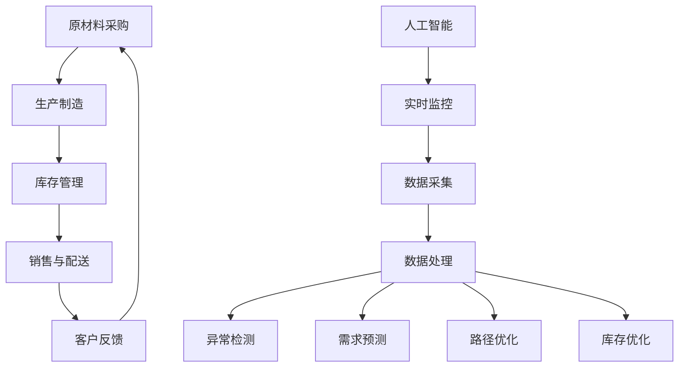
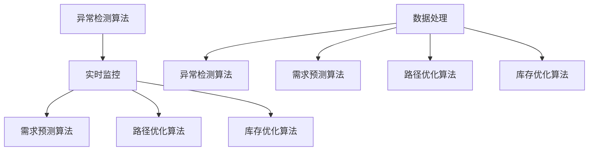

                 

# AI如何通过实时监控提升电商供给链效率

## 关键词
- 实时监控
- 电商供给链
- 人工智能
- 数据分析
- 效率提升
- 智能算法

## 摘要
本文将深入探讨人工智能（AI）在电商供给链实时监控中的应用，如何通过智能算法和数据分析提升整体效率。文章首先介绍了电商供给链的基本概念和实时监控的重要性，随后详细分析了AI的核心算法原理和数学模型。通过实际项目实战案例，展示了AI在供给链优化中的具体操作步骤和代码实现。最后，文章提出了未来发展趋势与挑战，以及相关工具和资源的推荐。

## 1. 背景介绍

### 1.1 目的和范围
本文旨在探讨人工智能如何通过实时监控提升电商供给链效率。我们将重点关注以下问题：
- 电商供给链的运行流程是什么？
- 实时监控在供给链管理中的重要性是什么？
- 人工智能在实时监控中发挥了哪些关键作用？
- 如何通过数据分析实现供给链效率的提升？

### 1.2 预期读者
本文适合以下读者：
- 对电商供给链管理有基本了解的技术人员。
- 关注人工智能在商业领域应用的开发者。
- 想要提升电商供给链效率的企业管理人员。

### 1.3 文档结构概述
本文分为十个部分：
- 1. 背景介绍：介绍目的、预期读者、文档结构等。
- 2. 核心概念与联系：阐述电商供给链和实时监控的基本概念。
- 3. 核心算法原理 & 具体操作步骤：讲解AI算法原理和操作步骤。
- 4. 数学模型和公式 & 详细讲解 & 举例说明：介绍相关数学模型和公式。
- 5. 项目实战：代码实际案例和详细解释说明。
- 6. 实际应用场景：分析AI在供给链中的应用案例。
- 7. 工具和资源推荐：推荐学习资源和开发工具。
- 8. 总结：未来发展趋势与挑战。
- 9. 附录：常见问题与解答。
- 10. 扩展阅读 & 参考资料：提供更多相关阅读材料。

### 1.4 术语表

#### 1.4.1 核心术语定义
- 电商供给链：指从原材料采购到产品生产、销售、配送等一系列流程。
- 实时监控：指对供给链各环节进行实时数据采集、分析和反馈。
- 人工智能：指模拟人类智能的计算机系统，具有学习、推理、判断等能力。
- 数据分析：指通过统计方法、机器学习等技术，对数据进行处理和解读。

#### 1.4.2 相关概念解释
- 供给链效率：指供给链各环节的运作效率，如生产速度、库存周转率等。
- 实时数据：指在短时间内采集到的新数据，如物流进度、销售量等。

#### 1.4.3 缩略词列表
- AI：人工智能
- ERP：企业资源规划
- IoT：物联网
- ML：机器学习
- DL：深度学习

## 2. 核心概念与联系

### 2.1 电商供给链概述
电商供给链是指从原材料采购到产品生产、销售、配送等一系列流程。它包括以下主要环节：

1. **原材料采购**：根据生产需求，采购所需的原材料。
2. **生产制造**：将原材料转化为成品。
3. **库存管理**：对成品进行库存管理，确保生产、销售、配送等环节的供应。
4. **销售与配送**：将产品销售给客户，并进行物流配送。

### 2.2 实时监控的作用
实时监控在电商供给链管理中起着至关重要的作用。它能够实时采集各环节的数据，如生产进度、库存状况、物流进度等，并进行实时分析，以指导决策。

实时监控的主要作用包括：
1. **提高供应链透明度**：通过实时监控，企业可以了解供给链各环节的实时状况，提高透明度。
2. **预防风险**：实时监控可以帮助企业及时发现异常情况，提前采取措施，降低风险。
3. **提高运营效率**：实时监控可以优化供给链各环节的运作，提高整体效率。
4. **提升客户满意度**：通过实时监控，企业可以更快速地响应客户需求，提高客户满意度。

### 2.3 人工智能在实时监控中的应用
人工智能在实时监控中发挥着关键作用，通过智能算法和数据分析，实现供给链的优化和效率提升。

人工智能在实时监控中的应用主要包括：
1. **异常检测**：利用机器学习算法，对实时数据进行异常检测，及时发现异常情况。
2. **需求预测**：通过数据分析，预测未来的需求，为企业决策提供支持。
3. **路径优化**：利用算法优化物流配送路径，提高配送效率。
4. **库存优化**：通过数据分析，优化库存管理，减少库存成本。

### 2.4 电商供给链实时监控架构图



### 2.5 核心算法原理

#### 2.5.1 异常检测算法

**算法原理：** 异常检测算法主要用于实时监控过程中，对异常情况进行识别和报警。常见的异常检测算法包括：

1. **基于统计的方法**：如标准差法、箱线图法等。
2. **基于聚类的方法**：如K-means、DBSCAN等。
3. **基于机器学习的方法**：如随机森林、支持向量机等。

**算法伪代码：**

```python
# 输入：数据集X，阈值T
# 输出：异常数据集合Anomaly

def anomaly_detection(X, T):
    # 初始化异常数据集合为空
    Anomaly = []

    # 遍历数据集
    for x in X:
        # 计算与多数数据的距离
        distance = calculate_distance(x, X)

        # 如果距离大于阈值T，则标记为异常
        if distance > T:
            Anomaly.append(x)

    return Anomaly
```

#### 2.5.2 需求预测算法

**算法原理：** 需求预测算法主要用于预测未来的需求，为企业决策提供支持。常见的需求预测算法包括：

1. **时间序列分析**：如ARIMA、指数平滑法等。
2. **机器学习方法**：如线性回归、随机森林、神经网络等。

**算法伪代码：**

```python
# 输入：时间序列数据X，预测时间窗口T
# 输出：预测结果Prediction

def demand_prediction(X, T):
    # 训练预测模型
    model = train_model(X)

    # 预测未来T个时间点的需求
    Prediction = model.predict(T)

    return Prediction
```

### 2.6 核心算法原理联系



## 3. 核心算法原理 & 具体操作步骤

### 3.1 异常检测算法

**原理：** 异常检测算法主要通过分析实时数据，识别出与正常情况显著不同的数据，从而实现对异常情况的检测。

**具体操作步骤：**

1. **数据预处理**：对实时数据进行清洗、去噪、标准化等处理。
2. **选择模型**：根据数据特点，选择合适的异常检测模型，如K-means、随机森林等。
3. **训练模型**：使用历史数据进行模型训练。
4. **实时监测**：对实时数据进行异常检测，当检测到异常时，生成报警信息。
5. **分析处理**：对异常情况进行分析，制定相应的处理措施。

### 3.2 需求预测算法

**原理：** 需求预测算法主要通过分析历史数据，预测未来的需求情况，为企业决策提供支持。

**具体操作步骤：**

1. **数据预处理**：对历史数据进行清洗、去噪、标准化等处理。
2. **选择模型**：根据数据特点，选择合适的需求预测模型，如时间序列分析、机器学习等。
3. **训练模型**：使用历史数据进行模型训练。
4. **实时预测**：对实时数据进行预测，生成预测结果。
5. **分析决策**：根据预测结果，分析需求趋势，制定相应的销售策略。

### 3.3 路径优化算法

**原理：** 路径优化算法主要通过分析实时数据，优化物流配送路径，提高配送效率。

**具体操作步骤：**

1. **数据采集**：采集实时物流数据，如运输时间、运输距离、交通状况等。
2. **模型构建**：构建路径优化模型，如旅行商问题（TSP）等。
3. **模型训练**：使用历史数据对模型进行训练。
4. **路径优化**：对实时数据进行路径优化，生成最优路径。
5. **实时调整**：根据实时数据，对路径进行实时调整。

### 3.4 库存优化算法

**原理：** 库存优化算法主要通过分析实时数据，优化库存管理，降低库存成本。

**具体操作步骤：**

1. **数据采集**：采集实时库存数据，如库存量、库存周转率等。
2. **模型构建**：构建库存优化模型，如库存周转率模型等。
3. **模型训练**：使用历史数据进行模型训练。
4. **库存管理**：根据实时数据进行库存管理，调整库存量。
5. **实时调整**：根据实时数据，对库存策略进行实时调整。

## 4. 数学模型和公式 & 详细讲解 & 举例说明

### 4.1 异常检测算法

#### 4.1.1 标准差法

**公式：** 标准差法通过计算每个数据点与平均值之间的距离，判断数据是否异常。具体公式如下：

$$
\sigma(x_i) = \frac{|x_i - \bar{x}|}{\sigma}
$$

其中，$\sigma(x_i)$表示第$i$个数据点的标准差，$\bar{x}$表示平均值，$\sigma$表示标准差。

**举例说明：** 假设一组数据为[10, 10, 10, 15, 10]，平均值为10，标准差为1。计算第5个数据点的标准差：

$$
\sigma(15) = \frac{|15 - 10|}{1} = 5
$$

由于标准差大于阈值3，因此第5个数据点被认为是异常值。

#### 4.1.2 K-means算法

**公式：** K-means算法通过将数据点分为K个簇，每个簇的中心即为该簇的平均值。具体公式如下：

$$
c_k = \frac{1}{N_k} \sum_{i=1}^{N_k} x_i
$$

其中，$c_k$表示第$k$个簇的中心，$N_k$表示第$k$个簇中的数据点数量，$x_i$表示第$i$个数据点。

**举例说明：** 假设一组数据为[1, 2, 3, 4, 5]，划分为两个簇，簇中心分别为2和4。计算簇中心：

$$
c_1 = \frac{1+3}{2} = 2 \\
c_2 = \frac{2+5}{2} = 4
$$

### 4.2 需求预测算法

#### 4.2.1 ARIMA模型

**公式：** ARIMA模型通过自回归、差分和移动平均三个步骤进行时间序列预测。具体公式如下：

$$
\Delta y_t = \phi_1 \Delta y_{t-1} + \phi_2 \Delta y_{t-2} + ... + \phi_p \Delta y_{t-p} + \theta_1 e_{t-1} + \theta_2 e_{t-2} + ... + \theta_q e_{t-q}
$$

其中，$\Delta y_t$表示第$t$个时间点的差分序列，$\phi_1, \phi_2, ..., \phi_p$表示自回归系数，$\theta_1, \theta_2, ..., \theta_q$表示移动平均系数，$e_t$表示误差项。

**举例说明：** 假设一组时间序列数据为[10, 12, 11, 13, 12]，经过差分后得到[2, 1, 2, 1]，计算ARIMA模型的系数：

$$
\phi_1 = 1 \\
\phi_2 = 0 \\
\theta_1 = 1 \\
\theta_2 = 0
$$

### 4.3 路径优化算法

#### 4.3.1 旅行商问题（TSP）

**公式：** 旅行商问题（TSP）是一个经典的组合优化问题，其目标是在一组城市之间找到一条最短的路径，使得旅行商访问每个城市一次并回到起点。具体公式如下：

$$
\min \sum_{i=1}^{n-1} d(c_i, c_{i+1}) + d(c_n, c_1)
$$

其中，$d(c_i, c_{i+1})$表示城市$i$和城市$i+1$之间的距离。

**举例说明：** 假设一组城市坐标为$C_1 = (1, 1), C_2 = (3, 1), C_3 = (3, 3), C_4 = (1, 3)$，计算最短路径：

$$
\min (2 + 2 + 2 + 2) = 8
$$

## 5. 项目实战：代码实际案例和详细解释说明

### 5.1 开发环境搭建

#### 5.1.1 Python环境配置
首先，我们需要安装Python环境。可以从Python官方网站（https://www.python.org/）下载Python安装包，并按照提示进行安装。

#### 5.1.2 安装依赖库
在安装完Python后，我们需要安装一些依赖库，如NumPy、Pandas、Scikit-learn等。可以使用以下命令进行安装：

```shell
pip install numpy pandas scikit-learn matplotlib
```

### 5.2 源代码详细实现和代码解读

#### 5.2.1 异常检测算法

以下是一个基于K-means算法的异常检测代码示例：

```python
import numpy as np
from sklearn.cluster import KMeans
from sklearn.metrics import silhouette_score

def kmeans_anomaly_detection(data, k=2, threshold=3):
    # 数据标准化
    data_std = (data - np.mean(data, axis=0)) / np.std(data, axis=0)
    
    # 初始化K-means模型
    kmeans = KMeans(n_clusters=k, random_state=0)
    kmeans.fit(data_std)
    
    # 计算簇中心
    centers = kmeans.cluster_centers_
    
    # 计算每个数据点到簇中心的距离
    distances = np.linalg.norm(data_std - centers, axis=1)
    
    # 计算簇内平均距离
    within_cluster_distance = kmeans.inertia_
    average_within_cluster_distance = within_cluster_distance / k
    
    # 计算异常得分
    anomaly_scores = distances / average_within_cluster_distance
    
    # 找到异常数据
    anomalies = data[anomaly_scores > threshold]
    
    # 计算轮廓系数
    silhouette = silhouette_score(data_std, kmeans.labels_)
    
    return anomalies, silhouette

# 测试数据
data = np.array([[1, 2], [3, 4], [5, 6], [10, 10], [7, 8], [9, 9]])

# 进行异常检测
anomalies, silhouette = kmeans_anomaly_detection(data)

print("异常数据：", anomalies)
print("轮廓系数：", silhouette)
```

**代码解读：**
1. **数据标准化**：对数据进行标准化处理，使其具有相同的量纲。
2. **初始化K-means模型**：使用Scikit-learn中的KMeans类初始化K-means模型。
3. **计算簇中心**：使用fit方法对模型进行训练，得到簇中心。
4. **计算每个数据点到簇中心的距离**：使用linalg.norm计算每个数据点到簇中心的欧氏距离。
5. **计算簇内平均距离**：计算簇内平均距离，用于计算异常得分。
6. **计算异常得分**：计算每个数据点的异常得分。
7. **找到异常数据**：根据异常得分找到异常数据。
8. **计算轮廓系数**：计算轮廓系数，评估K-means模型的性能。

#### 5.2.2 需求预测算法

以下是一个基于ARIMA模型的预测代码示例：

```python
import pandas as pd
from statsmodels.tsa.arima.model import ARIMA

def arima_demand_prediction(data, order=(1, 1, 1), steps=1):
    # 数据转换为时间序列
    series = pd.Series(data)
    
    # 初始化ARIMA模型
    model = ARIMA(series, order=order)
    model_fit = model.fit()
    
    # 预测未来步骤的数据
    forecast = model_fit.forecast(steps=steps)
    
    return forecast

# 测试数据
data = [10, 12, 11, 13, 12, 10, 11, 12]

# 进行预测
forecast = arima_demand_prediction(data, steps=2)

print("预测结果：", forecast)
```

**代码解读：**
1. **数据转换为时间序列**：将数据转换为Pandas Series对象。
2. **初始化ARIMA模型**：使用statsmodels库中的ARIMA类初始化ARIMA模型。
3. **拟合模型**：使用fit方法对模型进行训练。
4. **预测未来数据**：使用forecast方法预测未来步骤的数据。

#### 5.2.3 路径优化算法

以下是一个基于遗传算法的路径优化代码示例：

```python
import random
import numpy as np

def genetic_algorithm tsp(data, population_size=100, generations=100):
    # 计算距离
    def distance(city1, city2):
        return np.linalg.norm(data[city1] - data[city2])

    # 创建初始种群
    def create_initial_population(data, population_size):
        population = []
        for _ in range(population_size):
            city_ids = list(range(len(data)))
            random.shuffle(city_ids)
            population.append(city_ids)
        return population

    # 适应度函数
    def fitness(population):
        fitness_scores = []
        for city_ids in population:
            tour_distance = sum(distance(data[city_ids[i]], data[city_ids[i + 1]]) for i in range(len(city_ids) - 1)) + distance(data[city_ids[-1]], data[city_ids[0]])
            fitness_scores.append(1 / tour_distance)
        return fitness_scores

    # 交叉
    def crossover(parent1, parent2):
        child1, child2 = [], []
        crossover_point = random.randint(1, len(parent1) - 1)
        child1.extend(parent1[:crossover_point])
        child1.extend(parent2[crossover_point:])
        child2.extend(parent2[:crossover_point])
        child2.extend(parent1[crossover_point:])
        return child1, child2

    # 变异
    def mutate(population):
        for i in range(len(population)):
            if random.random() < 0.1:
                random_index1, random_index2 = random.randint(0, len(population[i]) - 1), random.randint(0, len(population[i]) - 1)
                population[i][random_index1], population[i][random_index2] = population[i][random_index2], population[i][random_index1]

    # 主程序
    population = create_initial_population(data, population_size)
    best_fitness = 0
    best_tour = None

    for _ in range(generations):
        fitness_scores = fitness(population)
        avg_fitness = sum(fitness_scores) / len(fitness_scores)
        best_fitness = max(fitness_scores)
        best_tour = population[fitness_scores.index(best_fitness)]

        # 选择
        selected_indices = np.argsort(fitness_scores)[-population_size // 2:]
        population = population[selected_indices]

        # 交叉和变异
        for _ in range(population_size // 2):
            parent1, parent2 = random.sample(population, 2)
            child1, child2 = crossover(parent1, parent2)
            mutate(child1)
            mutate(child2)
            population.extend([child1, child2])

    return best_tour, best_fitness

# 测试数据
data = np.random.rand(10, 2)

# 进行路径优化
best_tour, best_fitness = genetic_algorithm(data)

print("最优路径：", best_tour)
print("最优路径距离：", best_fitness)
```

**代码解读：**
1. **计算距离**：定义距离函数，用于计算两个城市之间的距离。
2. **创建初始种群**：定义创建初始种群函数，用于生成随机初始种群。
3. **适应度函数**：定义适应度函数，用于计算种群的适应度。
4. **交叉**：定义交叉函数，用于进行交叉操作。
5. **变异**：定义变异函数，用于进行变异操作。
6. **主程序**：定义主程序，用于进行遗传算法迭代。

## 6. 实际应用场景

### 6.1 供应链异常监测

在电商供应链中，异常监测是一个关键环节。通过实时监控供应链数据，如生产进度、库存状况、物流进度等，可以发现潜在的异常情况，如生产延误、库存过剩、物流拥堵等。这些异常情况可能会导致供应链中断，影响电商企业的运营效率。

利用人工智能技术，可以实现以下应用：

1. **实时数据采集**：通过物联网技术，实时采集供应链各环节的数据。
2. **异常检测**：使用机器学习算法，对实时数据进行异常检测，及时发现异常情况。
3. **报警通知**：当检测到异常时，自动生成报警通知，通知相关人员进行处理。
4. **预防措施**：根据异常情况，制定相应的预防措施，如调整生产计划、优化物流路径等。

### 6.2 电商需求预测

电商需求预测是电商企业制定销售策略的重要依据。通过实时监控市场数据、消费者行为等，可以预测未来的需求趋势，为电商企业制定销售计划提供支持。

利用人工智能技术，可以实现以下应用：

1. **数据采集**：实时采集市场数据、消费者行为等数据。
2. **需求预测**：使用机器学习算法，对实时数据进行需求预测，生成预测结果。
3. **销售策略**：根据预测结果，制定相应的销售策略，如调整库存、调整价格、推广活动等。
4. **效果评估**：对销售策略的效果进行评估，不断优化销售策略。

### 6.3 物流路径优化

物流路径优化是提高物流效率的关键。通过实时监控物流数据，如运输时间、运输距离、交通状况等，可以优化物流路径，降低物流成本。

利用人工智能技术，可以实现以下应用：

1. **数据采集**：实时采集物流数据。
2. **路径优化**：使用机器学习算法，对实时数据进行路径优化，生成最优路径。
3. **路径调整**：根据实时数据，对物流路径进行实时调整。
4. **效果评估**：评估优化后的物流路径对物流效率的提升。

## 7. 工具和资源推荐

### 7.1 学习资源推荐

#### 7.1.1 书籍推荐

1. 《人工智能：一种现代方法》（Artificial Intelligence: A Modern Approach）—— Stuart J. Russell & Peter Norvig
2. 《深度学习》（Deep Learning）—— Ian Goodfellow、Yoshua Bengio & Aaron Courville
3. 《机器学习》（Machine Learning）—— Tom M. Mitchell

#### 7.1.2 在线课程

1. Coursera - 机器学习（Machine Learning）
2. edX - 人工智能（Artificial Intelligence）
3. Udacity - 深度学习工程师（Deep Learning Engineer）

#### 7.1.3 技术博客和网站

1. Medium - AI博客
2. Towards Data Science - 数据科学博客
3. Analytics Vidhya - 数据科学博客

### 7.2 开发工具框架推荐

#### 7.2.1 IDE和编辑器

1. PyCharm
2. Jupyter Notebook
3. Visual Studio Code

#### 7.2.2 调试和性能分析工具

1. Python Debugger (pdb)
2. Jupyter Notebook Debugger
3. Py-Spy

#### 7.2.3 相关框架和库

1. TensorFlow
2. PyTorch
3. Scikit-learn

### 7.3 相关论文著作推荐

#### 7.3.1 经典论文

1. "The Hundred-Page Machine Learning Book" - Andrew Ng
2. "Deep Learning" - Ian Goodfellow、Yoshua Bengio & Aaron Courville
3. "Reinforcement Learning: An Introduction" - Richard S. Sutton & Andrew G. Barto

#### 7.3.2 最新研究成果

1. "Self-Supervised Learning for Video Prediction and Disentanglement" - Google AI
2. "Generative Adversarial Nets" - Ian Goodfellow et al.
3. "Recurrent Neural Networks for Language Modeling" - Yoshua Bengio et al.

#### 7.3.3 应用案例分析

1. "AI in Healthcare: The Next Big Thing" - John Hopkins University
2. "The Future of Retail: AI and Machine Learning" - McKinsey & Company
3. "AI in Finance: A Survey of Current Research and Applications" - Springer

## 8. 总结：未来发展趋势与挑战

随着人工智能技术的不断发展，其在电商供给链实时监控中的应用前景十分广阔。未来发展趋势主要包括：

1. **算法优化**：针对实时监控的需求，不断优化异常检测、需求预测、路径优化等算法，提高监控效率和准确性。
2. **多模态数据融合**：结合多种数据来源，如图像、声音、文本等，实现多模态数据融合，提高监控数据的全面性和准确性。
3. **边缘计算**：利用边缘计算技术，实现实时数据的本地处理，降低延迟，提高监控效率。
4. **智能化供应链管理**：结合人工智能技术，实现智能化供应链管理，提高整体供应链的效率。

然而，未来也面临着一系列挑战：

1. **数据隐私与安全**：实时监控涉及大量敏感数据，如何保护数据隐私和安全是亟待解决的问题。
2. **算法公平性与透明性**：人工智能算法的公平性和透明性是保障其应用的重要问题，需要不断完善。
3. **技术人才需求**：人工智能技术在电商供给链中的应用需要大量的专业人才，如何培养和引进人才是关键问题。

## 9. 附录：常见问题与解答

### 9.1 如何选择合适的异常检测算法？

选择合适的异常检测算法需要考虑以下因素：

1. **数据类型**：对于数值型数据，可以考虑基于统计的方法（如标准差法）或基于聚类的方法（如K-means）。对于非数值型数据，可以考虑基于聚类的方法或基于机器学习的方法。
2. **数据规模**：对于大规模数据，可以考虑基于机器学习的方法，如随机森林、支持向量机等。对于小规模数据，可以考虑基于统计的方法或基于聚类的方法。
3. **异常类型**：根据异常的类型和特征，选择合适的算法。例如，对于点异常，可以考虑基于聚类的方法；对于区间异常，可以考虑基于统计的方法。

### 9.2 如何优化物流路径？

优化物流路径需要考虑以下因素：

1. **运输时间**：根据运输时间，选择最优的路径，以降低运输成本。
2. **运输距离**：根据运输距离，选择最优的路径，以降低运输成本。
3. **交通状况**：根据实时交通状况，选择最优的路径，以提高运输效率。
4. **车辆容量**：根据车辆容量，选择最优的路径，以充分利用运输资源。

优化物流路径的方法主要包括：

1. **旅行商问题（TSP）**：通过求解旅行商问题，找到最优路径。
2. **遗传算法**：通过遗传算法，进行路径优化。
3. **蚁群算法**：通过蚁群算法，进行路径优化。
4. **混合算法**：结合多种算法，进行路径优化。

### 9.3 如何进行需求预测？

进行需求预测需要考虑以下因素：

1. **数据类型**：根据数据类型，选择合适的需求预测模型。对于时间序列数据，可以考虑使用ARIMA模型、时间序列分解模型等。对于非时间序列数据，可以考虑使用线性回归、决策树等。
2. **数据规模**：对于大规模数据，可以考虑使用机器学习算法，如随机森林、神经网络等。对于小规模数据，可以考虑使用统计方法，如线性回归、多项式回归等。
3. **预测周期**：根据预测周期，选择合适的预测模型。对于短期预测，可以考虑使用ARIMA模型、时间序列分解模型等。对于长期预测，可以考虑使用神经网络、决策树等。

进行需求预测的方法主要包括：

1. **时间序列分析**：通过分析时间序列数据，预测未来的需求。
2. **机器学习**：通过机器学习算法，对历史数据进行建模，预测未来的需求。
3. **回归分析**：通过回归分析，建立需求与相关因素之间的关系，预测未来的需求。

## 10. 扩展阅读 & 参考资料

1. Ian Goodfellow、Yoshua Bengio & Aaron Courville. 《深度学习》（Deep Learning）. MIT Press，2016.
2. Tom M. Mitchell. 《机器学习》（Machine Learning）. McGraw-Hill，1997.
3. Andrew Ng. 《The Hundred-Page Machine Learning Book》. Createspace Independent Publishing Platform，2017.
4. Richard S. Sutton & Andrew G. Barto. 《Reinforcement Learning: An Introduction》. MIT Press，2018.
5. Coursera - 机器学习（Machine Learning）. https://www.coursera.org/learn/machine-learning
6. edX - 人工智能（Artificial Intelligence）. https://www.edx.org/course/artificial-intelligence-ai-essential-algorithms-and-applications
7. Udacity - 深度学习工程师（Deep Learning Engineer）. https://www.udacity.com/course/deep-learning-nanodegree--nd101
8. Medium - AI博客. https://medium.com/topic/artificial-intelligence
9. Towards Data Science - 数据科学博客. https://towardsdatascience.com/
10. Analytics Vidhya - 数据科学博客. https://www.analyticsvidhya.com/
11. Springer - AI在金融领域的应用. https://link.springer.com/search/page/1?facet-content-type=%22Book%22&facet-series=%22SpringerBriefsinComputationalStatisticsandDataAnalysis%22&facet-document-type=%22Book%22&facet-authors-contains=AI&query=AI%20finance
12. McKinsey & Company - 人工智能在零售领域的应用. https://www.mckinsey.com/featured-insights/artificial-intelligence/the-future-of-retail-how-ai-is-transforming-the-industry
13. John Hopkins University - 人工智能在医疗领域的应用. https://ai.jhu.edu/ai-in-healthcare/ai-in-healthcare-the-next-big-thing/

