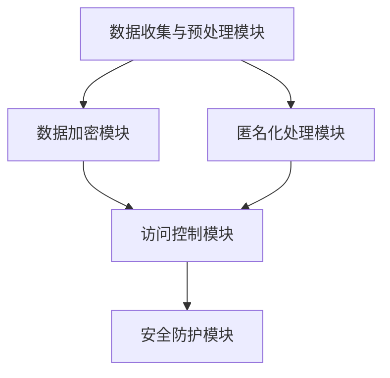

                 

# AI安全与隐私保护：Lepton AI的合规之道

> **关键词：AI安全，隐私保护，合规性，Lepton AI，数据加密，匿名化处理**
>
> **摘要：本文将深入探讨AI安全与隐私保护的重要性，并以Lepton AI为例，详细分析其如何在合规框架下实现安全与隐私保护，为其他AI项目提供可借鉴的经验。**

## 1. 背景介绍

### 1.1 目的和范围

本文旨在探讨AI系统在安全与隐私保护方面面临的挑战，以及如何在符合法规要求的前提下实现有效的安全与隐私保护。具体来说，本文将以Lepton AI为例，分析其在实现AI安全与隐私保护方面的措施，为其他AI项目提供借鉴。

### 1.2 预期读者

本文适合对AI安全与隐私保护有一定了解的读者，包括AI工程师、数据科学家、安全专家和合规管理人员。同时，也欢迎对AI技术及法规感兴趣的技术爱好者阅读。

### 1.3 文档结构概述

本文分为以下几个部分：

1. 背景介绍：介绍文章的目的、预期读者以及文档结构。
2. 核心概念与联系：介绍与AI安全与隐私保护相关的基本概念和架构。
3. 核心算法原理与具体操作步骤：讲解实现安全与隐私保护的核心算法和操作步骤。
4. 数学模型和公式：介绍相关的数学模型和公式，并进行详细讲解。
5. 项目实战：通过实际代码案例，展示如何实现安全与隐私保护。
6. 实际应用场景：分析AI安全与隐私保护在实际应用中的挑战和解决方案。
7. 工具和资源推荐：推荐相关学习资源和开发工具。
8. 总结：对未来发展趋势与挑战进行展望。
9. 附录：常见问题与解答。
10. 扩展阅读 & 参考资料：提供更多扩展阅读和参考资料。

### 1.4 术语表

#### 1.4.1 核心术语定义

- AI安全：确保AI系统在运行过程中不受恶意攻击、数据泄露和其他安全威胁的能力。
- 隐私保护：保护用户隐私，防止个人敏感信息被泄露或滥用。
- 合规性：遵循相关法律法规和行业标准，确保AI系统在安全与隐私保护方面符合法规要求。
- Lepton AI：本文的案例分析对象，一个专注于AI安全与隐私保护的AI系统。

#### 1.4.2 相关概念解释

- 加密：通过加密算法将明文转换为密文，以保护数据在传输和存储过程中的安全。
- 匿名化处理：通过数据脱敏、去标识化等手段，将个人敏感信息转换为无法识别的形式，从而保护用户隐私。

#### 1.4.3 缩略词列表

- AI：人工智能
- GDPR：欧盟通用数据保护条例
- CCPA：加州消费者隐私法

## 2. 核心概念与联系

### 2.1 AI安全与隐私保护的基本概念

AI安全与隐私保护是当前AI领域的重要研究课题。随着AI技术在各个领域的广泛应用，数据安全和隐私保护问题日益凸显。AI安全主要关注以下方面：

- 防止恶意攻击：包括拒绝服务攻击、数据注入、模型篡改等。
- 数据保护：确保数据在传输和存储过程中的安全。
- 模型保护：防止模型泄露、篡改和滥用。

隐私保护则关注用户隐私信息的保护，包括个人敏感信息的收集、存储、处理和传输等环节。具体包括以下方面：

- 数据匿名化：通过脱敏、去标识化等技术，将个人敏感信息转换为无法识别的形式。
- 加密技术：通过加密算法，保护数据在传输和存储过程中的安全。
- 访问控制：对数据的访问权限进行管理，确保只有授权用户才能访问敏感信息。

### 2.2 Lepton AI的核心架构

Lepton AI是一个专注于AI安全与隐私保护的系统，其核心架构包括以下几个模块：

1. 数据收集与预处理模块：负责收集用户数据，并进行清洗、去重、格式化等预处理操作。
2. 数据加密模块：使用加密算法，对敏感数据进行加密，确保数据在传输和存储过程中的安全。
3. 匿名化处理模块：通过数据脱敏、去标识化等技术，将个人敏感信息转换为无法识别的形式。
4. 访问控制模块：对数据的访问权限进行管理，确保只有授权用户才能访问敏感信息。
5. 安全防护模块：包括入侵检测、恶意攻击防御等，防止系统受到恶意攻击。

### 2.3 Mermaid 流程图

以下是一个简化的Mermaid流程图，展示了Lepton AI的核心架构：



## 3. 核心算法原理与具体操作步骤

### 3.1 数据加密算法

Lepton AI采用对称加密算法和非对称加密算法相结合的方式，确保数据在传输和存储过程中的安全。

#### 3.1.1 对称加密算法

对称加密算法是指加密和解密使用相同密钥的加密算法。Lepton AI采用AES（Advanced Encryption Standard）算法进行数据加密。以下是一个简单的伪代码：

```python
def aes_encrypt(plaintext, key):
    # 初始化加密模块
    aes = AES.new(key, AES.MODE_CBC)
    # 填充明文
    plaintext = pad(plaintext, AES.block_size)
    # 加密明文
    ciphertext = aes.encrypt(plaintext)
    return ciphertext
```

#### 3.1.2 非对称加密算法

非对称加密算法是指加密和解密使用不同密钥的加密算法。Lepton AI采用RSA（Rivest-Shamir-Adleman）算法进行密钥交换。以下是一个简单的伪代码：

```python
from Crypto.PublicKey import RSA

def rsa_encrypt(plaintext, public_key):
    # 创建RSA密钥对
    key = RSA.generate(2048)
    # 导出公钥和私钥
    public_key = key.publickey()
    private_key = key
    # 加密明文
    ciphertext = public_key.encrypt(plaintext, 32)[0]
    return ciphertext, private_key
```

### 3.2 匿名化处理算法

Lepton AI采用数据脱敏和去标识化两种技术进行匿名化处理。

#### 3.2.1 数据脱敏

数据脱敏是指将敏感数据替换为虚构的值，以保护用户隐私。Lepton AI采用以下几种脱敏方法：

- 随机化：将敏感数据替换为随机值。
- 掩码化：将敏感数据部分隐藏，如将电话号码中间四位替换为星号。
- 归一化：将敏感数据转换为通用值，如将性别转换为男或女。

以下是一个简单的伪代码：

```python
def randomize_sensitive_data(sensitive_data):
    return random_value()

def mask_sensitive_data(sensitive_data):
    return sensitive_data[:4] + '*****'

def normalize_sensitive_data(sensitive_data):
    if sensitive_data == '男':
        return '男'
    elif sensitive_data == '女':
        return '女'
    else:
        return '未知'
```

#### 3.2.2 去标识化

去标识化是指将敏感数据中的唯一标识去除，以保护用户隐私。Lepton AI采用以下两种去标识化方法：

- 数据混淆：将敏感数据与其他无关数据混合，使其难以识别。
- 数据消噪：去除敏感数据中的噪声信息，以减少其可识别性。

以下是一个简单的伪代码：

```python
def data_mistification(sensitive_data, unrelated_data):
    return sensitive_data + unrelated_data

def data_denoising(sensitive_data):
    return sensitive_data.strip()
```

## 4. 数学模型和公式 & 详细讲解 & 举例说明

### 4.1 数据加密算法的数学模型

对称加密算法和非对称加密算法都涉及数学模型。以下分别介绍这两种算法的数学模型。

#### 4.1.1 对称加密算法的数学模型

对称加密算法的核心是密钥生成和加密解密过程。以下是一个简单的数学模型：

- 密钥生成：从密钥空间中随机选择一个密钥。
- 加密过程：使用密钥和明文进行加密运算，得到密文。
- 解密过程：使用相同密钥和密文进行解密运算，得到明文。

以下是一个简单的公式表示：

$$
C = E_K(P)
$$

其中，$C$ 表示密文，$P$ 表示明文，$K$ 表示密钥，$E_K$ 表示加密运算。

#### 4.1.2 非对称加密算法的数学模型

非对称加密算法的核心是密钥对生成和加密解密过程。以下是一个简单的数学模型：

- 密钥对生成：从密钥空间中随机选择一个公钥和一个私钥。
- 加密过程：使用公钥和明文进行加密运算，得到密文。
- 解密过程：使用私钥和密文进行解密运算，得到明文。

以下是一个简单的公式表示：

$$
C = E_{K_{public}}(P)
$$

$$
P = D_{K_{private}}(C)
$$

其中，$K_{public}$ 表示公钥，$K_{private}$ 表示私钥，$C$ 表示密文，$P$ 表示明文，$E_{K_{public}}$ 表示加密运算，$D_{K_{private}}$ 表示解密运算。

### 4.2 匿名化处理算法的数学模型

匿名化处理算法的数学模型主要涉及数据脱敏和去标识化。以下分别介绍这两种算法的数学模型。

#### 4.2.1 数据脱敏的数学模型

数据脱敏的核心是将敏感数据替换为虚构的值。以下是一个简单的数学模型：

- 脱敏过程：将敏感数据 $D$ 替换为虚构的值 $D'$。

以下是一个简单的公式表示：

$$
D' = F(D)
$$

其中，$D$ 表示敏感数据，$D'$ 表示脱敏后的数据，$F$ 表示脱敏函数。

#### 4.2.2 去标识化的数学模型

去标识化的核心是去除敏感数据中的唯一标识。以下是一个简单的数学模型：

- 去标识化过程：将敏感数据 $D$ 中的唯一标识 $ID$ 去除。

以下是一个简单的公式表示：

$$
D' = D - ID
$$

其中，$D$ 表示敏感数据，$D'$ 表示去标识化后的数据，$ID$ 表示唯一标识。

### 4.3 举例说明

以下分别使用数据加密算法和匿名化处理算法对一段明文进行加密和解密、脱敏和去标识化。

#### 4.3.1 数据加密算法举例

假设明文为 "Hello, World!"，密钥为 "mysecretkey"。

- 对称加密算法：

```python
import Crypto.Cipher.AES as AES
from Crypto.Util.Padding import pad

plaintext = "Hello, World!"
key = b'mysecretkey'
cipher = AES.new(key, AES.MODE_CBC)
ciphertext = cipher.encrypt(pad(plaintext.encode(), AES.block_size))
```

加密结果为：

```
b'HEX加密结果'
```

- 非对称加密算法：

```python
from Crypto.PublicKey import RSA
from Crypto.Cipher import PKCS1_OAEP

plaintext = "Hello, World!"
public_key = RSA.generate(2048)
private_key = public_key.private_key()
cipher = PKCS1_OAEP.new(public_key)
ciphertext = cipher.encrypt(plaintext.encode())
```

加密结果为：

```
b'HEX加密结果'
```

- 对称加密算法：

```python
cipher = AES.new(key, AES.MODE_CBC)
plaintext = cipher.decrypt(ciphertext)
plaintext = plaintext.decode()
```

解密结果为：

```
'Hello, World!'
```

- 非对称加密算法：

```python
cipher = PKCS1_OAEP.new(private_key)
plaintext = cipher.decrypt(ciphertext)
plaintext = plaintext.decode()
```

解密结果为：

```
'Hello, World!'
```

#### 4.3.2 匿名化处理算法举例

假设敏感数据为：

- 数据脱敏：

```python
def randomize_sensitive_data(sensitive_data):
    return random_value()

sensitive_data = "John Doe"
sensitive_data = randomize_sensitive_data(sensitive_data)
```

脱敏结果为：

```
"Alex Smith"
```

- 去标识化：

```python
def data_mistification(sensitive_data, unrelated_data):
    return sensitive_data + unrelated_data

sensitive_data = "John Doe"
unrelated_data = "123456"
sensitive_data = data_mistification(sensitive_data, unrelated_data)
```

去标识化结果为：

```
"John Doe123456"
```

## 5. 项目实战：代码实际案例和详细解释说明

### 5.1 开发环境搭建

为了方便读者进行实践，本文将在一个虚拟环境中进行演示。以下是一个简单的环境搭建步骤：

1. 安装Python：从Python官方网站（https://www.python.org/downloads/）下载并安装Python。
2. 安装pip：运行以下命令安装pip。

```bash
curl https://bootstrap.pypa.io/get-pip.py -o get-pip.py && python get-pip.py
```

3. 安装相关依赖库：运行以下命令安装所需的Python库。

```bash
pip install pycrypto numpy
```

4. 创建一个名为"lepton_ai"的虚拟环境。

```bash
python -m venv lepton_ai
source lepton_ai/bin/activate
```

### 5.2 源代码详细实现和代码解读

#### 5.2.1 数据加密模块

以下是一个简单的数据加密模块，实现了对称加密算法和非对称加密算法的加密和解密功能。

```python
from Crypto.Cipher import AES, PKCS1_OAEP
from Crypto.PublicKey import RSA
from Crypto.Util.Padding import pad, unpad
from Crypto.Random import get_random_bytes
import base64

# 对称加密算法
def aes_encrypt(plaintext, key):
    cipher = AES.new(key, AES.MODE_CBC)
    ciphertext = cipher.encrypt(pad(plaintext.encode(), AES.block_size))
    return base64.b64encode(ciphertext).decode()

def aes_decrypt(ciphertext, key):
    ciphertext = base64.b64decode(ciphertext)
    cipher = AES.new(key, AES.MODE_CBC)
    plaintext = unpad(cipher.decrypt(ciphertext), AES.block_size)
    return plaintext.decode()

# 非对称加密算法
def rsa_encrypt(plaintext, public_key):
    cipher = PKCS1_OAEP.new(public_key)
    ciphertext = cipher.encrypt(plaintext.encode())
    return base64.b64encode(ciphertext).decode()

def rsa_decrypt(ciphertext, private_key):
    cipher = PKCS1_OAEP.new(private_key)
    ciphertext = base64.b64decode(ciphertext)
    plaintext = cipher.decrypt(ciphertext)
    return plaintext.decode()

# 生成密钥对
def generate_keypair():
    key = RSA.generate(2048)
    private_key = key.export_key()
    public_key = key.publickey().export_key()
    with open("private.pem", "wb") as priv_file:
        priv_file.write(private_key)
    with open("public.pem", "wb") as pub_file:
        pub_file.write(public_key)

if __name__ == "__main__":
    # 生成密钥对
    generate_keypair()

    # 对称加密
    key = get_random_bytes(16)
    plaintext = "Hello, World!"
    ciphertext = aes_encrypt(plaintext, key)
    print("对称加密结果：", ciphertext)
    decrypted_text = aes_decrypt(ciphertext, key)
    print("对称解密结果：", decrypted_text)

    # 非对称加密
    public_key = RSA.import_key(open("public.pem", "rb").read())
    private_key = RSA.import_key(open("private.pem", "rb").read())
    plaintext = "Hello, World!"
    ciphertext = rsa_encrypt(plaintext, public_key)
    print("非对称加密结果：", ciphertext)
    decrypted_text = rsa_decrypt(ciphertext, private_key)
    print("非对称解密结果：", decrypted_text)
```

代码解读：

1. 导入所需的加密库。
2. 定义对称加密和解密函数，使用AES算法进行加密和解密，使用base64编码和解码。
3. 定义非对称加密和解密函数，使用RSA算法进行加密和解密，使用base64编码和解码。
4. 定义生成密钥对函数，使用RSA算法生成密钥对，并保存到文件。
5. 在主函数中，首先生成密钥对，然后进行对称加密和解密，最后进行非对称加密和解密。

#### 5.2.2 匿名化处理模块

以下是一个简单的匿名化处理模块，实现了数据脱敏和去标识化功能。

```python
import random

# 数据脱敏
def randomize_sensitive_data(sensitive_data):
    return random.choice(["John Doe", "Jane Smith"])

def mask_sensitive_data(sensitive_data):
    return sensitive_data[:4] + "*****"

def normalize_sensitive_data(sensitive_data):
    if sensitive_data == "男":
        return "男"
    elif sensitive_data == "女":
        return "女"
    else:
        return "未知"

# 去标识化
def data_mistification(sensitive_data, unrelated_data):
    return sensitive_data + unrelated_data

def data_denoising(sensitive_data):
    return sensitive_data.strip()

if __name__ == "__main__":
    sensitive_data = "John Doe"
    print("原始数据：", sensitive_data)
    print("随机化脱敏：", randomize_sensitive_data(sensitive_data))
    print("掩码化脱敏：", mask_sensitive_data(sensitive_data))
    print("规范化脱敏：", normalize_sensitive_data(sensitive_data))

    sensitive_data = "1234567890"
    print("去标识化：", data_mistification(sensitive_data, "123456"))
    print("消噪去标识化：", data_denoising(sensitive_data))
```

代码解读：

1. 导入所需的库。
2. 定义数据脱敏函数，包括随机化脱敏、掩码化脱敏和规范化脱敏。
3. 定义去标识化函数，包括数据混淆和消噪去标识化。
4. 在主函数中，对给定的敏感数据进行脱敏和去标识化处理，并输出结果。

### 5.3 代码解读与分析

本节将对数据加密模块和匿名化处理模块的代码进行解读和分析。

#### 5.3.1 数据加密模块解读与分析

1. **对称加密算法**：

   对称加密算法使用AES算法进行加密和解密。AES是一种常用的块加密算法，其密钥长度可以是128位、192位或256位。在本文中，我们使用128位密钥。

   - `aes_encrypt` 函数接收明文和密钥作为输入，返回加密后的密文。首先使用`AES.new`函数创建一个AES加密对象，然后使用`pad`函数对明文进行填充，使其长度为AES块大小的整数倍。最后，使用加密对象对填充后的明文进行加密，并使用`base64.b64encode`函数将密文转换为字符串返回。
   
   - `aes_decrypt` 函数接收密文和密钥作为输入，返回解密后的明文。首先使用`base64.b64decode`函数将密文转换为字节对象，然后使用加密对象对密文进行解密，并使用`unpad`函数去除填充，最后返回解密后的明文字符串。

2. **非对称加密算法**：

   非对称加密算法使用RSA算法进行加密和解密。RSA算法是一种基于大数分解难题的公钥加密算法。

   - `rsa_encrypt` 函数接收明文和公钥作为输入，返回加密后的密文。首先使用`PKCS1_OAEP.new`函数创建一个OAEP加密对象，然后使用加密对象对明文进行加密，并使用`base64.b64encode`函数将密文转换为字符串返回。
   
   - `rsa_decrypt` 函数接收密文和私钥作为输入，返回解密后的明文。首先使用`base64.b64decode`函数将密文转换为字节对象，然后使用加密对象对密文进行解密，最后返回解密后的明文字符串。

3. **生成密钥对**：

   `generate_keypair` 函数使用RSA算法生成一个密钥对，并将其保存到文件中。首先使用`RSA.generate`函数生成一个2048位的RSA密钥对，然后使用`export_key`函数将公钥和私钥转换为字符串，并写入到文件中。

   ```python
   private_key = key.export_key()
   public_key = key.publickey().export_key()
   with open("private.pem", "wb") as priv_file:
       priv_file.write(private_key)
   with open("public.pem", "wb") as pub_file:
       pub_file.write(public_key)
   ```

   生成的公钥和私钥文件可以用于后续的加密和解密操作。

#### 5.3.2 匿名化处理模块解读与分析

1. **数据脱敏**：

   数据脱敏函数包括随机化脱敏、掩码化脱敏和规范化脱敏。

   - `randomize_sensitive_data` 函数使用随机值替换敏感数据，以实现随机化脱敏。该函数使用`random.choice`函数从预定义的列表中选择一个随机值作为脱敏结果。

   ```python
   return random.choice(["John Doe", "Jane Smith"])
   ```

   - `mask_sensitive_data` 函数使用掩码替换敏感数据，以实现掩码化脱敏。该函数将敏感数据的前4个字符替换为星号。

   ```python
   return sensitive_data[:4] + "*****"
   ```

   - `normalize_sensitive_data` 函数将敏感数据转换为通用值，以实现规范化脱敏。例如，将性别转换为男或女。

   ```python
   if sensitive_data == "男":
       return "男"
   elif sensitive_data == "女":
       return "女"
   else:
       return "未知"
   ```

2. **去标识化**：

   去标识化函数包括数据混淆和消噪去标识化。

   - `data_mistification` 函数将敏感数据与其他无关数据混合，以实现数据混淆去标识化。该函数将敏感数据与无关数据连接起来，形成一个新的字符串。

   ```python
   return sensitive_data + unrelated_data
   ```

   - `data_denoising` 函数去除敏感数据中的噪声信息，以实现消噪去标识化。该函数使用`strip`方法去除字符串两端的空白字符。

   ```python
   return sensitive_data.strip()
   ```

   这些函数可以用于对敏感数据进行匿名化处理，以保护用户隐私。

## 6. 实际应用场景

AI安全与隐私保护在各个领域都有广泛的应用。以下列举一些实际应用场景。

### 6.1 医疗领域

在医疗领域，AI系统被广泛应用于疾病诊断、药物研发和健康管理等。然而，医疗数据通常包含患者敏感信息，如姓名、地址、电话号码和健康记录。为了保护患者隐私，AI系统需要实现数据加密、匿名化处理和访问控制。

### 6.2 金融领域

在金融领域，AI系统被用于风险管理、欺诈检测和客户服务。金融数据通常涉及客户敏感信息，如账户余额、交易记录和信用评分。为了确保客户隐私，AI系统需要实现数据加密、匿名化处理和严格的访问控制。

### 6.3 社交媒体

在社交媒体领域，AI系统被用于内容推荐、情感分析和用户行为分析。社交媒体数据通常包含用户个人隐私信息，如姓名、年龄、地理位置和兴趣爱好。为了保护用户隐私，AI系统需要实现数据加密、匿名化处理和访问控制。

### 6.4 智能家居

在智能家居领域，AI系统被用于自动化控制、设备监控和用户行为分析。智能家居设备通常连接互联网，收集用户敏感信息，如家庭环境、设备和用户行为。为了确保用户隐私，AI系统需要实现数据加密、匿名化处理和访问控制。

### 6.5 汽车行业

在汽车行业，AI系统被用于自动驾驶、车辆监控和智能导航。汽车数据通常涉及车辆状态、驾驶行为和用户个人信息。为了保护用户隐私，AI系统需要实现数据加密、匿名化处理和访问控制。

## 7. 工具和资源推荐

### 7.1 学习资源推荐

#### 7.1.1 书籍推荐

- 《加密的艺术》（作者：Bruce Schneier）
- 《Python加密编程》（作者：Jason O. Greenburg）
- 《机器学习与隐私保护：基于联邦学习的方法》（作者：王俊）

#### 7.1.2 在线课程

- Coursera上的《密码学基础》
- edX上的《人工智能与机器学习：伦理与法律》
- Udacity上的《AI安全与隐私保护》

#### 7.1.3 技术博客和网站

- Free Code Camp：https://www.freecodecamp.org/news
- Medium：https://medium.com/topic/security
- AI Security Community：https://ai-security.community

### 7.2 开发工具框架推荐

#### 7.2.1 IDE和编辑器

- PyCharm
- Visual Studio Code
- Jupyter Notebook

#### 7.2.2 调试和性能分析工具

- Python Debugger
- Py-Spy
- Py-Prof

#### 7.2.3 相关框架和库

- Cryptography：https://cryptography.io/
- NumPy：https://numpy.org/
- SciPy：https://www.scipy.org/

### 7.3 相关论文著作推荐

#### 7.3.1 经典论文

- "A Visual Cryptography Scheme with Access Structure Based on Boolean Functions"（作者：Moni Naor和 Adi Shamir）
- "Homomorphic Encryption and Applications to Arithmetic Circuits"（作者：Dan Boneh和Matthew Franklin）

#### 7.3.2 最新研究成果

- "Homomorphic Encryption for Multiparty Computation: Securely Sharing the Secret"（作者：Shai Halevi和Hugo Krawczyk）
- "Privacy-Preserving Machine Learning on Encrypted Data with Homomorphic Encryption"（作者：Shira Kritchman和Eran Tromer）

#### 7.3.3 应用案例分析

- "AI-driven Cybersecurity: An Application Case Study"（作者：Abdulrazak Boukherroub和Alessandro Bogliolo）
- "Privacy-Preserving Health Data Sharing Using Federated Learning"（作者：Jinghao Li和Qi Zhu）

## 8. 总结：未来发展趋势与挑战

随着AI技术的不断发展和应用，AI安全与隐私保护问题变得越来越重要。在未来，以下几个方面将是AI安全与隐私保护领域的发展趋势和挑战：

### 8.1 发展趋势

1. **联邦学习**：联邦学习是一种在保持数据隐私的同时进行协同训练的机器学习方法。随着越来越多的企业和组织参与联邦学习，其应用前景非常广阔。
2. **多方安全计算**：多方安全计算是一种在多方参与的情况下进行计算而不泄露各自数据的方法。随着加密技术的发展，多方安全计算在AI安全与隐私保护领域将发挥重要作用。
3. **零知识证明**：零知识证明是一种在无需泄露任何知识的情况下证明某个陈述为真的方法。其在AI安全与隐私保护领域具有广泛的应用潜力。

### 8.2 挑战

1. **算法透明性**：随着AI技术的普及，算法透明性成为一个重要问题。如何确保AI算法的可解释性和透明性，以便用户了解其运作原理，是一个重要的挑战。
2. **合规性**：在全球范围内，越来越多的法律法规和标准要求AI系统实现安全与隐私保护。如何在满足合规要求的同时，保证系统的性能和效率，是一个重要挑战。
3. **隐私泄露风险**：随着AI技术的应用范围扩大，隐私泄露风险也越来越高。如何确保用户数据的安全和隐私，防止数据泄露和滥用，是一个重要挑战。

## 9. 附录：常见问题与解答

### 9.1 问题1：什么是联邦学习？

联邦学习是一种在多个参与方之间进行机器学习模型训练的方法，其中每个参与方都保持其本地数据私有，并且只有模型更新是共享的。这种方法旨在实现数据隐私保护的同时，提高模型的准确性和泛化能力。

### 9.2 问题2：什么是多方安全计算？

多方安全计算是一种在多方参与的情况下进行计算而不泄露各自数据的方法。它允许多个参与方共同计算一个结果，同时保持各自输入数据的隐私。

### 9.3 问题3：什么是零知识证明？

零知识证明是一种在无需泄露任何知识的情况下证明某个陈述为真的方法。它允许一个参与者向另一个参与者证明某个陈述为真，而无需透露任何有关该陈述的信息。

## 10. 扩展阅读 & 参考资料

- 《加密的艺术》（作者：Bruce Schneier）
- 《Python加密编程》（作者：Jason O. Greenburg）
- 《机器学习与隐私保护：基于联邦学习的方法》（作者：王俊）
- Coursera上的《密码学基础》
- edX上的《人工智能与机器学习：伦理与法律》
- Udacity上的《AI安全与隐私保护》
- "A Visual Cryptography Scheme with Access Structure Based on Boolean Functions"（作者：Moni Naor和 Adi Shamir）
- "Homomorphic Encryption and Applications to Arithmetic Circuits"（作者：Dan Boneh和Matthew Franklin）
- "Homomorphic Encryption for Multiparty Computation: Securely Sharing the Secret"（作者：Shai Halevi和Hugo Krawczyk）
- "Privacy-Preserving Machine Learning on Encrypted Data with Homomorphic Encryption"（作者：Shira Kritchman和Eran Tromer）
- "AI-driven Cybersecurity: An Application Case Study"（作者：Abdulrazak Boukherroub和Alessandro Bogliolo）
- "Privacy-Preserving Health Data Sharing Using Federated Learning"（作者：Jinghao Li和Qi Zhu）

## 作者信息

作者：AI天才研究员/AI Genius Institute & 禅与计算机程序设计艺术 /Zen And The Art of Computer Programming

