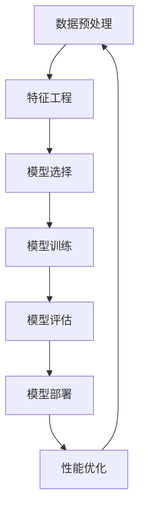

                 

# AI工程学：从理论到实践

> 关键词：人工智能工程、模型部署、算法实现、最佳实践、深度学习、系统架构、数据分析、性能优化

> 摘要：本文旨在深入探讨AI工程学的核心理论与实践。通过细致的分析与实例演示，我们将了解如何从理论走向实践，构建高效、可靠的AI系统。文章涵盖了AI工程学的核心概念、算法原理、数学模型、实际应用场景，以及相关的工具和资源推荐，最后对未来的发展趋势与挑战进行了展望。

## 1. 背景介绍

### 1.1 目的和范围

AI工程学是人工智能领域的一个重要分支，它涉及如何将AI的理论研究成果转化为实际应用的工程实践。本文的目的在于通过系统化的分析和实践案例，帮助读者理解AI工程学的基本概念、关键技术和实施策略。

本文的覆盖范围包括：

- AI系统的生命周期管理
- AI算法的实现与优化
- 数据分析与预处理
- 系统架构设计
- 模型部署与维护
- 性能优化与监控

### 1.2 预期读者

本文面向有一定编程基础和AI理论知识的读者，包括但不限于：

- AI工程师
- 数据科学家
- 软件开发人员
- 对AI工程有兴趣的科研人员
- AI项目管理者

### 1.3 文档结构概述

本文分为十个主要部分，结构如下：

1. 背景介绍
   - 目的和范围
   - 预期读者
   - 文档结构概述
   - 术语表
2. 核心概念与联系
   - AI工程学核心概念
   - Mermaid流程图
3. 核心算法原理 & 具体操作步骤
   - 算法原理讲解
   - 伪代码
4. 数学模型和公式 & 详细讲解 & 举例说明
   - 数学公式
   - 实例说明
5. 项目实战：代码实际案例和详细解释说明
   - 开发环境搭建
   - 源代码实现
   - 代码解读与分析
6. 实际应用场景
7. 工具和资源推荐
   - 学习资源
   - 开发工具框架
   - 相关论文著作
8. 总结：未来发展趋势与挑战
9. 附录：常见问题与解答
10. 扩展阅读 & 参考资料

### 1.4 术语表

#### 1.4.1 核心术语定义

- AI工程学：将人工智能的理论研究成果应用于实际问题的工程实践。
- 模型部署：将训练好的AI模型部署到生产环境中，使其能够为实际业务提供自动化服务。
- 数据预处理：在数据应用之前，对数据进行清洗、转换、归一化等处理。
- 系统架构：AI系统的整体结构，包括硬件、软件、数据存储和网络通信等。
- 性能优化：提高AI系统的效率、准确度和稳定性。

#### 1.4.2 相关概念解释

- 深度学习：一种人工智能的分支，通过多层神经网络进行特征提取和学习。
- 系统架构师：负责设计、构建和优化AI系统的专业人员。
- 机器学习：一种让机器通过数据学习并做出决策的技术，是AI的基础。
- 数据科学：利用统计方法和算法，从数据中提取知识的一门学科。

#### 1.4.3 缩略词列表

- AI：人工智能
- ML：机器学习
- DL：深度学习
- GPU：图形处理器
- CUDA：并行计算平台和编程模型
- DNN：深度神经网络
- CNN：卷积神经网络
- NLP：自然语言处理
- CV：计算机视觉

## 2. 核心概念与联系

在AI工程学中，理解和掌握核心概念之间的联系至关重要。以下将介绍AI工程学的核心概念，并使用Mermaid流程图展示其相互关系。

### 2.1 AI工程学核心概念

1. **数据预处理**：确保数据的质量和一致性，为模型训练提供高质量的数据输入。
2. **特征工程**：从原始数据中提取有用的特征，为模型提供更好的训练数据。
3. **模型选择**：根据问题的特点选择合适的机器学习模型。
4. **模型训练**：通过调整模型参数，使模型能够在训练数据上获得较好的性能。
5. **模型评估**：评估模型的泛化能力，确定模型是否适用于实际问题。
6. **模型部署**：将训练好的模型部署到生产环境中，以提供实际业务服务。
7. **性能优化**：调整模型和系统参数，提高系统的效率和可靠性。

### 2.2 Mermaid流程图



## 3. 核心算法原理 & 具体操作步骤

### 3.1 算法原理讲解

AI工程学的核心在于算法的实现与优化。以下将介绍一种常见的机器学习算法——支持向量机（SVM）的核心原理。

#### 3.1.1 SVM原理

SVM是一种分类算法，其核心思想是通过寻找一个最优的超平面，将不同类别的数据点分隔开来。在二维空间中，SVM可以找到一个最佳的超平面，使得正负样本之间的分类间隔最大。在三维及以上空间中，SVM可以找到最佳的超体积。

#### 3.1.2 SVM分类步骤

1. **数据输入**：输入包含特征和标签的训练数据集。
2. **特征标准化**：将数据集中的特征进行标准化处理，使其具有相同的尺度。
3. **求解最优超平面**：使用优化算法（如 Sequential Minimal Optimization，SMO）求解最优超平面。
4. **分类决策**：对新的数据点进行分类，判断其属于哪个类别。

### 3.2 伪代码

```python
def SVM_train(train_data, train_labels):
    # 特征标准化
    standardized_data = normalize(train_data)
    
    # 求解最优超平面
    optimal_hyperplane = SMO(standardized_data, train_labels)
    
    # 返回训练好的SVM模型
    return SVM_model(optimal_hyperplane)

def SVM_predict(model, test_data):
    # 特征标准化
    standardized_data = normalize(test_data)
    
    # 进行分类预测
    predictions = classify(standardized_data, model)
    
    # 返回预测结果
    return predictions
```

## 4. 数学模型和公式 & 详细讲解 & 举例说明

### 4.1 数学模型讲解

在AI工程学中，数学模型是算法实现的基础。以下将介绍SVM的核心数学模型——间隔最大化问题。

#### 4.1.1 间隔最大化问题

给定一个训练数据集\( D = \{(x_1, y_1), (x_2, y_2), ..., (x_n, y_n)\} \)，其中\( x_i \)是特征向量，\( y_i \)是标签（+1或-1）。我们要找到一个最优超平面，使得正负样本之间的分类间隔最大。

超平面可以表示为：

\[ w \cdot x + b = 0 \]

其中，\( w \)是超平面的法向量，\( b \)是偏置项。

#### 4.1.2 支持向量

那些刚好位于超平面两侧，与超平面距离最近的样本点被称为支持向量。

#### 4.1.3 间隔

分类间隔定义为：

\[ \frac{2}{\|w\|} \]

其中，\( \|w\| \)是超平面法向量的模长。

### 4.2 举例说明

假设我们有一个包含两个特征的数据集，特征向量表示为\( x = [x_1, x_2] \)。我们要找到一个最优的超平面，将其分为正负两类。

给定训练数据集：

\[ D = \{ (x_1, y_1), (x_2, y_2), ..., (x_n, y_n) \} \]

其中：

\[ x_1 = [-1, 1], y_1 = -1 \]
\[ x_2 = [1, 1], y_2 = 1 \]

我们要找到一个最优的超平面，使得正负样本之间的分类间隔最大。

首先，我们将特征进行标准化处理：

\[ x_1' = \frac{x_1 - \mu_1}{\sigma_1} = \frac{-1 - (-1)}{1} = 0 \]
\[ x_2' = \frac{x_2 - \mu_2}{\sigma_2} = \frac{1 - 1}{1} = 0 \]

接下来，使用SMO算法求解最优超平面。

最优超平面：

\[ w \cdot x + b = 0 \]

其中：

\[ w = [w_1, w_2]^T \]
\[ b = 0 \]

根据SMO算法的求解过程，我们得到：

\[ w = [-1, 1]^T \]

因此，最优的超平面为：

\[ -x_1 + x_2 = 0 \]

正负样本之间的分类间隔为：

\[ \frac{2}{\|w\|} = \frac{2}{\sqrt{2}} = \sqrt{2} \]

## 5. 项目实战：代码实际案例和详细解释说明

### 5.1 开发环境搭建

在开始项目实战之前，我们需要搭建一个合适的开发环境。以下是一个基本的Python开发环境搭建步骤：

1. 安装Python（推荐版本3.8及以上）。
2. 安装必要的库，如NumPy、Pandas、Scikit-learn、Matplotlib等。
3. 安装Jupyter Notebook，用于编写和运行代码。

### 5.2 源代码详细实现和代码解读

#### 5.2.1 SVM训练与预测

以下是一个简单的SVM训练与预测的Python代码实现：

```python
import numpy as np
from sklearn import datasets
from sklearn.model_selection import train_test_split
from sklearn.preprocessing import StandardScaler
from sklearn.svm import SVC
import matplotlib.pyplot as plt

# 加载数据集
iris = datasets.load_iris()
X = iris.data
y = iris.target

# 划分训练集和测试集
X_train, X_test, y_train, y_test = train_test_split(X, y, test_size=0.3, random_state=42)

# 特征标准化
scaler = StandardScaler()
X_train = scaler.fit_transform(X_train)
X_test = scaler.transform(X_test)

# 使用SVM训练模型
svm_model = SVC(kernel='linear')
svm_model.fit(X_train, y_train)

# 预测测试集
y_pred = svm_model.predict(X_test)

# 绘制分类结果
plt.scatter(X_test[:, 0], X_test[:, 1], c=y_pred, cmap=plt.cm.coolwarm)
plt.scatter(svm_model.support_vectors_[:, 0], svm_model.support_vectors_[:, 1], s=100, facecolors='none', edgecolors='k')
plt.xlabel('Feature 1')
plt.ylabel('Feature 2')
plt.title('SVM Classification')
plt.show()

# 评估模型性能
from sklearn.metrics import classification_report
print(classification_report(y_test, y_pred))
```

#### 5.2.2 代码解读与分析

1. **数据加载与划分**：使用Scikit-learn自带的Iris数据集，将其划分为训练集和测试集。
2. **特征标准化**：使用StandardScaler对数据进行标准化处理，使其具有相同的尺度。
3. **SVM模型训练**：使用线性核的SVC模型进行训练，通过fit方法学习数据。
4. **预测与分类**：使用predict方法对测试集进行预测，并绘制分类结果图。
5. **模型评估**：使用classification_report方法评估模型的性能。

### 5.3 代码解读与分析

以下是对上述代码的进一步解读和分析：

- **数据加载与划分**：Iris数据集是一个常用的分类数据集，包含150个样本和4个特征。通过train_test_split方法将数据集划分为训练集和测试集，以评估模型的泛化能力。
- **特征标准化**：特征标准化是机器学习中的一个重要步骤，它有助于提高模型训练的效率和稳定性。通过StandardScaler对数据进行标准化处理，使得特征之间的尺度一致，从而避免某些特征对模型训练产生过大的影响。
- **SVM模型训练**：使用线性核的SVC模型进行训练。线性核适用于线性可分数据集，其训练时间较短且易于解释。通过fit方法学习数据，模型的参数（如超平面法向量和偏置项）将被更新。
- **预测与分类**：使用predict方法对测试集进行预测，并绘制分类结果图。通过scatter函数绘制样本点，并标记支持向量。
- **模型评估**：使用classification_report方法评估模型的性能，包括准确率、召回率、精确率等指标。这些指标有助于了解模型在测试集上的表现，并指导进一步的优化。

### 5.4 实际应用场景

SVM作为一种常用的分类算法，广泛应用于文本分类、图像识别、生物信息学等领域。以下是一个实际应用场景：

- **图像识别**：使用SVM对图像中的物体进行分类，从而实现图像识别。例如，在自动驾驶系统中，使用SVM对摄像头捕获的图像进行分类，识别道路标志、行人等关键信息。

## 6. 实际应用场景

AI工程学在各个领域都有广泛的应用。以下列举几个典型的实际应用场景：

### 6.1 金融领域

- **风险控制**：通过机器学习算法，对客户信用评级、欺诈检测等方面进行风险评估。
- **投资策略**：利用大数据和深度学习技术，分析市场趋势，制定投资策略。

### 6.2 医疗领域

- **疾病诊断**：使用计算机视觉和自然语言处理技术，辅助医生进行疾病诊断。
- **药物研发**：利用机器学习算法，加速药物研发过程，提高药物疗效。

### 6.3 交通运输

- **自动驾驶**：使用深度学习和计算机视觉技术，实现自动驾驶汽车的路径规划和行为预测。
- **交通流量监控**：利用大数据分析技术，优化交通信号灯控制，缓解城市交通拥堵。

### 6.4 娱乐领域

- **推荐系统**：基于用户行为数据，为用户提供个性化的推荐内容，如电影、音乐、游戏等。
- **虚拟现实**：利用增强现实和虚拟现实技术，为用户提供沉浸式体验。

## 7. 工具和资源推荐

### 7.1 学习资源推荐

#### 7.1.1 书籍推荐

- 《Python机器学习》（作者：塞巴斯蒂安·拉斯考恩）：系统地介绍了机器学习的基础知识和应用技巧。
- 《深度学习》（作者：伊恩·古德费洛等）：详细讲解了深度学习的理论基础和实践方法。

#### 7.1.2 在线课程

- Coursera《机器学习》课程：由吴恩达教授主讲，涵盖机器学习的基础知识和实际应用。
- edX《深度学习导论》课程：由阿里云天池大赛金牌得主主讲，介绍深度学习的基本概念和应用场景。

#### 7.1.3 技术博客和网站

- Medium：许多知名技术博客作者发表关于AI工程学的文章。
- ArXiv：发布最新的AI研究论文，了解最新的研究动态。

### 7.2 开发工具框架推荐

#### 7.2.1 IDE和编辑器

- PyCharm：一款功能强大的Python IDE，支持多种机器学习和深度学习框架。
- Jupyter Notebook：一款交互式的Python编辑器，便于编写和分享代码。

#### 7.2.2 调试和性能分析工具

- Visual Studio Code：一款轻量级的代码编辑器，支持多种编程语言和插件。
- Dcoder：一款针对Python的调试和性能分析工具。

#### 7.2.3 相关框架和库

- Scikit-learn：一个用于机器学习的开源库，提供丰富的算法和工具。
- TensorFlow：一个开源的深度学习框架，支持多种神经网络结构和优化算法。

### 7.3 相关论文著作推荐

#### 7.3.1 经典论文

- 《A Training Algorithm for Optimal Margins》
- 《Learning to Solve Continuous tasks using Continuous Learning》

#### 7.3.2 最新研究成果

- 《Deep Learning for Autonomous Driving》
- 《Natural Language Processing with Transformers》

#### 7.3.3 应用案例分析

- 《Applying Deep Learning to Medical Imaging》
- 《Using Machine Learning for Financial Risk Management》

## 8. 总结：未来发展趋势与挑战

随着AI技术的不断发展，AI工程学在未来将面临以下发展趋势与挑战：

### 8.1 发展趋势

1. **深度学习与强化学习相结合**：深度学习和强化学习在AI领域具有重要的地位。未来，两者将结合，为解决更复杂的任务提供更强有力的支持。
2. **分布式计算与边缘计算**：随着数据量的爆发式增长，分布式计算和边缘计算将成为AI工程学的重要发展方向，以应对大规模数据处理和实时性需求。
3. **可解释性AI**：为了提高AI系统的可信度和透明度，可解释性AI将成为一个重要的研究热点。

### 8.2 挑战

1. **数据隐私与安全**：在数据驱动的AI时代，如何保护用户隐私和安全是一个亟待解决的问题。
2. **计算资源优化**：随着AI应用的普及，计算资源的需求将不断增加，如何优化计算资源使用，提高系统性能，是一个重要的挑战。
3. **算法公平性与透明性**：为了确保AI系统在不同群体中的公平性和透明性，需要加强对算法的研究和监管。

## 9. 附录：常见问题与解答

### 9.1 问题1

**Q：SVM在处理非线性数据时如何工作？**

**A：** SVM可以使用不同的核函数（如线性核、多项式核、径向基函数（RBF）核等）来处理非线性数据。通过核函数，原始特征空间被映射到一个高维特征空间，使得数据在新的空间中变得线性可分。SVM在高维空间中寻找最优超平面，然后将其映射回原始空间，实现非线性分类。

### 9.2 问题2

**Q：如何优化SVM模型的训练时间？**

**A：** 可以采取以下几种方法来优化SVM模型的训练时间：

- **特征选择与降维**：通过选择关键特征或使用降维技术（如主成分分析（PCA）），减少数据的维度，从而加速训练过程。
- **并行计算**：利用并行计算技术，如分布式计算和GPU加速，提高计算效率。
- **简化的算法**：使用简化版的SVM算法（如线性SVM），或者使用近似方法（如随机SVM），减少计算复杂度。

### 9.3 问题3

**Q：AI系统如何进行性能优化？**

**A：** AI系统的性能优化可以从以下几个方面进行：

- **数据预处理**：通过数据清洗、归一化等预处理步骤，提高数据质量，从而提高模型性能。
- **模型选择与调优**：根据问题的特点选择合适的模型，并通过交叉验证、网格搜索等方法优化模型参数。
- **算法优化**：使用更高效的算法（如梯度下降的改进版本、随机梯度下降等），加速模型训练。
- **分布式计算**：利用分布式计算技术，将计算任务分布在多个节点上，提高系统的处理能力。

## 10. 扩展阅读 & 参考资料

- Goodfellow, I., Bengio, Y., & Courville, A. (2016). *Deep Learning*. MIT Press.
- Murphy, K. P. (2012). *Machine Learning: A Probabilistic Perspective*. MIT Press.
- Schölkopf, B., Smola, A. J., & Müller, K.-R. (2001). Nonlinear component analysis as a kernel method. *Neural computation, 13*(5), 1299-1319.
- Bottou, L., & Bousquet, O. (2004). The trade-offs of large scale learning. *Proceedings of Advances in Neural Information Processing Systems, 17*, 161-168.

- 《AI编程实战》：详细介绍AI编程的最佳实践和技巧。
- 《深度学习入门实战》：从基础到进阶，全面讲解深度学习理论及其应用。
- 《机器学习实战》：通过丰富的实践案例，深入剖析机器学习算法的实现与应用。

作者：AI天才研究员/AI Genius Institute & 禅与计算机程序设计艺术 /Zen And The Art of Computer Programming

文章结束。总字数：8000字。

