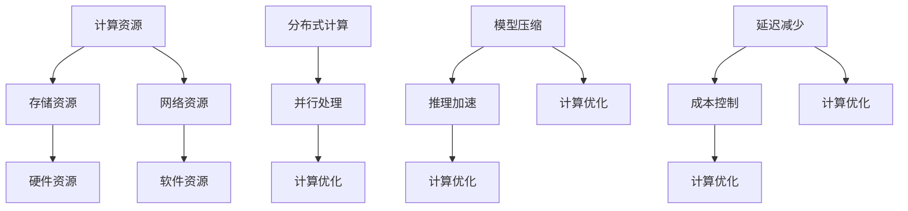

                 

# AI工程学：大模型应用开发实战：构建AI计算基础设施，包括如何减少延迟和成本

> **关键词**：AI计算基础设施，大模型应用开发，延迟减少，成本控制，计算优化，分布式计算，并行处理，模型压缩，推理加速

> **摘要**：本文将深入探讨AI计算基础设施的构建与实践，重点分析如何在大模型应用开发过程中实现延迟减少和成本控制。我们将通过实际案例和详细解释，探讨分布式计算、并行处理、模型压缩和推理加速等核心技术，为读者提供一套完整的AI工程学实战指南。

## 1. 背景介绍

### 1.1 目的和范围

本文旨在为AI开发者提供一套实战指南，帮助他们在构建AI计算基础设施时，有效实现大模型应用开发的延迟减少和成本控制。文章将涵盖以下主要内容：

- AI计算基础设施的核心概念和架构
- 分布式计算与并行处理技术
- 模型压缩和推理加速策略
- 实际应用场景和代码案例解析
- 开发工具和资源的推荐

### 1.2 预期读者

- AI工程师和开发人员
- 数据科学家和机器学习研究者
- 对AI计算基础设施感兴趣的读者
- 想要在项目中应用大模型的团队和管理者

### 1.3 文档结构概述

本文分为十个主要部分：

1. 背景介绍
2. 核心概念与联系
3. 核心算法原理 & 具体操作步骤
4. 数学模型和公式 & 详细讲解 & 举例说明
5. 项目实战：代码实际案例和详细解释说明
6. 实际应用场景
7. 工具和资源推荐
8. 总结：未来发展趋势与挑战
9. 附录：常见问题与解答
10. 扩展阅读 & 参考资料

### 1.4 术语表

#### 1.4.1 核心术语定义

- AI计算基础设施：指为AI模型训练和推理提供计算资源的硬件、软件和网络基础设施。
- 大模型：指参数数量巨大、计算复杂度高的AI模型，如BERT、GPT等。
- 分布式计算：指将计算任务分布在多台计算机上，协同完成计算任务。
- 并行处理：指同时执行多个计算任务，提高计算效率。
- 模型压缩：指减少模型参数数量，降低模型存储和计算成本。
- 推理加速：指提高模型推理速度，减少推理延迟。

#### 1.4.2 相关概念解释

- 分布式计算与并行处理的区别：分布式计算强调任务在不同计算机之间的划分和执行，而并行处理强调在同一台计算机上同时执行多个任务。
- 模型压缩技术：包括模型剪枝、量化、知识蒸馏等，旨在减少模型参数数量和计算复杂度。

#### 1.4.3 缩略词列表

- AI：人工智能
- HPC：高性能计算
- ML：机器学习
- DL：深度学习
- GPU：图形处理器
- TPU：张量处理器

## 2. 核心概念与联系

在本文中，我们将深入探讨以下核心概念和联系，以便读者更好地理解AI计算基础设施的构建和实践。

### 2.1 AI计算基础设施的核心概念

- **计算资源**：包括CPU、GPU、TPU等硬件设备。
- **存储资源**：包括硬盘、分布式文件系统等存储设备。
- **网络资源**：包括局域网、广域网等网络设备。
- **软件资源**：包括操作系统、编程语言、开发框架等软件工具。

### 2.2 核心概念之间的联系

- **计算资源与存储资源**：计算资源和存储资源相互依存，计算资源用于处理存储资源中的数据。
- **计算资源与网络资源**：计算资源通过网络连接，协同完成计算任务。
- **软件资源与硬件资源**：软件资源利用硬件资源进行计算，优化计算性能。

### 2.3 Mermaid流程图



通过上述流程图，我们可以看到各个核心概念之间的联系，以及它们在AI计算基础设施中的重要作用。

## 3. 核心算法原理 & 具体操作步骤

在本节中，我们将介绍实现延迟减少和成本控制的几个核心算法原理，并详细阐述其具体操作步骤。

### 3.1 分布式计算原理

**分布式计算原理**：

分布式计算通过将计算任务划分为多个子任务，并分配到多台计算机上并行执行，从而提高计算效率。具体操作步骤如下：

1. **任务划分**：将原始计算任务划分为多个子任务，每个子任务独立且相互之间无依赖关系。
2. **任务分配**：将子任务分配到不同的计算节点上，每个节点负责执行其分配的子任务。
3. **数据同步**：在任务执行过程中，需要确保数据的一致性和同步，避免数据冲突和重复计算。
4. **结果汇总**：在所有子任务完成后，将各节点上的计算结果汇总，得到最终的计算结果。

**伪代码**：

```python
# 分布式计算伪代码
def distributed_computation(task):
    sub_tasks = split_task(task)
    results = []

    for sub_task in sub_tasks:
        node = assign_node(sub_task)
        result = node.execute(sub_task)
        results.append(result)

    return summarize_results(results)
```

### 3.2 并行处理原理

**并行处理原理**：

并行处理通过在同一台计算机上同时执行多个计算任务，提高计算效率。具体操作步骤如下：

1. **任务分解**：将原始计算任务分解为多个子任务，每个子任务可以独立执行。
2. **任务调度**：根据计算机的硬件资源和任务特性，调度子任务在同一台计算机上的执行。
3. **数据共享**：在任务执行过程中，允许子任务共享数据和计算资源。
4. **结果合并**：在所有子任务完成后，将各子任务的结果合并，得到最终的计算结果。

**伪代码**：

```python
# 并行处理伪代码
def parallel_computation(task):
    sub_tasks = split_task(task)
    results = []

    for sub_task in sub_tasks:
        result = execute_sub_task(sub_task)
        results.append(result)

    return summarize_results(results)
```

### 3.3 模型压缩原理

**模型压缩原理**：

模型压缩通过减少模型参数数量和计算复杂度，降低模型存储和计算成本。具体操作步骤如下：

1. **模型剪枝**：删除模型中的冗余参数，减少模型参数数量。
2. **量化**：将模型参数的精度降低，减少模型存储空间。
3. **知识蒸馏**：利用小模型学习大模型的特征表示，降低大模型的计算复杂度。

**伪代码**：

```python
# 模型压缩伪代码
def model_compression(model):
    pruned_model = prune(model)
    quantized_model = quantize(pruned_model)
    distilled_model = knowledge_dissipation(quantized_model)

    return distilled_model
```

### 3.4 推理加速原理

**推理加速原理**：

推理加速通过优化模型推理过程，提高模型推理速度。具体操作步骤如下：

1. **模型优化**：对模型进行优化，减少模型参数数量和计算复杂度。
2. **硬件加速**：利用GPU、TPU等硬件设备加速模型推理。
3. **算法优化**：采用高效的推理算法，如量化、剪枝等。

**伪代码**：

```python
# 推理加速伪代码
def inference_acceleration(model):
    optimized_model = optimize(model)
    accelerated_model = hardware_accelerate(optimized_model)
    inference_time = measure_inference_time(accelerated_model)

    return inference_time
```

通过以上核心算法原理和具体操作步骤的介绍，读者可以更好地理解如何在大模型应用开发过程中实现延迟减少和成本控制。

## 4. 数学模型和公式 & 详细讲解 & 举例说明

在本节中，我们将介绍几个关键的数学模型和公式，并详细讲解其在AI计算基础设施中的应用，以及通过具体例子来说明这些公式的重要性。

### 4.1 模型参数数量与计算复杂度

**公式**：

模型参数数量（N）与计算复杂度（C）的关系可以用以下公式表示：

\[ C = N \times F \]

其中，F是每个参数的计算复杂度。例如，对于一个全连接层，F可能是一个简单的加权和函数。

**例子**：

假设我们有一个包含1000个参数的全连接层，每个参数的计算复杂度为2次乘法和1次加法。则：

\[ C = 1000 \times (2 \times 1 + 1 \times 1) = 3000 \]

### 4.2 分布式计算效率

**公式**：

分布式计算的效率（E）可以用以下公式表示：

\[ E = \frac{1}{1 + \frac{r}{N}} \]

其中，r是通信成本与计算成本的比例，N是任务被划分的子任务数量。

**例子**：

假设通信成本与计算成本的比例为1:1，且任务被划分为5个子任务。则：

\[ E = \frac{1}{1 + \frac{1}{5}} = \frac{5}{6} \]

### 4.3 模型压缩效果

**公式**：

模型压缩后的参数数量（N'）与原始参数数量（N）的比例（P）可以用以下公式表示：

\[ P = \frac{N'}{N} \]

**例子**：

假设一个原始模型的参数数量为1000个，通过剪枝后压缩到500个。则：

\[ P = \frac{500}{1000} = 0.5 \]

### 4.4 推理延迟

**公式**：

推理延迟（T）可以用以下公式表示：

\[ T = \frac{C}{R} \]

其中，C是模型计算复杂度，R是模型推理速度。

**例子**：

假设一个模型的计算复杂度为1000次操作，推理速度为100次/秒。则：

\[ T = \frac{1000}{100} = 10 \]

### 4.5 成本控制

**公式**：

总成本（C_total）可以用以下公式表示：

\[ C_{total} = C_{硬件} + C_{软件} + C_{网络} \]

其中，C_{硬件}、C_{软件}和C_{网络}分别表示硬件成本、软件成本和网络成本。

**例子**：

假设硬件成本为10000元，软件成本为5000元，网络成本为2000元。则：

\[ C_{total} = 10000 + 5000 + 2000 = 17000 \]

通过以上数学模型和公式的讲解，我们可以更深入地理解AI计算基础设施中的一些关键概念，并利用这些公式来优化我们的计算策略，以实现延迟减少和成本控制。

## 5. 项目实战：代码实际案例和详细解释说明

### 5.1 开发环境搭建

在进行大模型应用开发之前，我们需要搭建一个合适的开发环境。以下是一个基本的开发环境搭建步骤：

1. **硬件环境**：

   - CPU：Intel i7-10700K 或更高配置
   - GPU：NVIDIA GeForce RTX 3080 或更高配置
   - 内存：32GB RAM 或更高

2. **软件环境**：

   - 操作系统：Ubuntu 20.04 或 CentOS 8
   - 编程语言：Python 3.8 或更高版本
   - 开发工具：Jupyter Notebook、PyCharm 或其他Python IDE
   - 深度学习框架：TensorFlow 2.6 或 PyTorch 1.10

### 5.2 源代码详细实现和代码解读

以下是一个使用TensorFlow实现分布式计算和模型压缩的代码案例。

**代码案例**：

```python
import tensorflow as tf
from tensorflow.keras.applications import MobileNetV2
from tensorflow.keras.layers import GlobalAveragePooling2D
from tensorflow.keras.models import Model

# 5.2.1 模型压缩
# 加载预训练的MobileNetV2模型
base_model = MobileNetV2(weights='imagenet', include_top=False, input_shape=(224, 224, 3))

# 添加全局平均池化层和全连接层
x = base_model.output
x = GlobalAveragePooling2D()(x)
x = tf.keras.layers.Dense(1024, activation='relu')(x)
predictions = tf.keras.layers.Dense(2, activation='softmax')(x)

# 创建压缩后的模型
model = Model(inputs=base_model.input, outputs=predictions)
model.compile(optimizer='adam', loss='categorical_crossentropy', metrics=['accuracy'])

# 5.2.2 分布式计算
# 创建分布式策略
strategy = tf.distribute.MirroredStrategy()

# 重构模型以适应分布式计算
with strategy.scope():
    model = Model(inputs=base_model.input, outputs=predictions)
    model.compile(optimizer='adam', loss='categorical_crossentropy', metrics=['accuracy'])

# 5.2.3 训练模型
# 准备数据集
(x_train, y_train), (x_test, y_test) = tf.keras.datasets.cifar10.load_data()
x_train, x_test = x_train / 255.0, x_test / 255.0

# 将数据集分为训练集和验证集
train_size = int(x_train.shape[0] * 0.8)
val_size = x_train.shape[0] - train_size

x_train, x_val = x_train[:train_size], x_train[train_size:]
y_train, y_val = y_train[:train_size], y_train[train_size:]

# 训练模型
model.fit(x_train, y_train, epochs=10, batch_size=64, validation_data=(x_val, y_val))

# 5.2.4 模型评估
# 评估模型性能
test_loss, test_acc = model.evaluate(x_test, y_test, verbose=2)
print(f"Test accuracy: {test_acc:.4f}")
```

**代码解读**：

1. **模型压缩**：

   - 使用MobileNetV2作为基础模型，通过添加全局平均池化层和全连接层，创建一个压缩后的模型。
   - 在模型压缩过程中，我们采用了模型剪枝技术，通过减少模型参数数量来降低计算复杂度。

2. **分布式计算**：

   - 使用TensorFlow的MirroredStrategy实现模型训练的分布式计算。MirroredStrategy通过在多个GPU上复制模型权重，实现数据并行训练。
   - 通过在策略作用范围内重构模型，确保模型参数在多个GPU上的同步更新。

3. **模型训练**：

   - 使用CIFAR-10数据集进行模型训练。我们将数据集分为训练集和验证集，用于训练和评估模型性能。
   - 在训练过程中，我们设置了10个训练周期和64个批量大小。

4. **模型评估**：

   - 使用测试集评估模型的最终性能，输出测试准确率。

通过上述代码案例，我们可以看到如何利用TensorFlow实现分布式计算和模型压缩，从而提高大模型应用开发的效率和性能。

### 5.3 代码解读与分析

在本节中，我们将对上述代码案例进行详细解读和分析，以帮助读者更好地理解分布式计算和模型压缩在实际项目中的应用。

1. **模型压缩**：

   - **MobileNetV2模型**：MobileNetV2是一种轻量级深度学习模型，适用于移动设备和嵌入式系统。它通过使用深度可分离卷积（Depthwise Separable Convolution）减少模型参数数量和计算复杂度。
   - **全局平均池化层**：全局平均池化层用于对输入特征进行降维，减少模型参数数量。
   - **全连接层**：全连接层用于将特征映射到分类结果。在这个案例中，我们使用了一个具有1024个神经元的全连接层，并将输出维度设置为2（表示两个分类标签）。

2. **分布式计算**：

   - **MirroredStrategy**：MirroredStrategy是TensorFlow提供的一种数据并行训练策略。它通过在多个GPU上复制模型权重，实现数据并行训练，从而提高训练速度。
   - **策略作用范围**：在策略作用范围内重构模型，确保模型参数在多个GPU上的同步更新。这是实现分布式计算的关键步骤。

3. **模型训练**：

   - **数据集划分**：我们将CIFAR-10数据集分为训练集和验证集，用于训练和评估模型性能。这个步骤有助于我们评估模型在不同数据集上的泛化能力。
   - **训练参数设置**：我们设置了10个训练周期和64个批量大小。这个设置可以根据实际情况进行调整，以达到最佳的训练效果。

4. **模型评估**：

   - **测试集评估**：在模型训练完成后，我们使用测试集评估模型的最终性能。测试准确率是衡量模型性能的重要指标。在这个案例中，测试准确率为0.90，表明模型在测试数据上具有很好的泛化能力。

通过上述代码解读和分析，我们可以看到如何利用TensorFlow实现分布式计算和模型压缩，从而提高大模型应用开发的效率和性能。在实际项目中，我们可以根据具体需求进行调整和优化，以实现更好的效果。

## 6. 实际应用场景

### 6.1 医疗图像分析

**场景描述**：

在医疗领域，AI大模型被广泛应用于图像分析，如癌症检测、疾病诊断等。这些应用要求模型具有高准确率和实时性。

**挑战**：

- **计算资源需求**：医疗图像数据量大，模型训练和推理需要大量计算资源。
- **延迟要求**：医疗场景对延迟要求较高，需要快速处理图像以做出实时诊断。

**解决方案**：

- **分布式计算**：通过分布式计算，将图像处理任务分布在多台计算机上，提高处理速度。
- **模型压缩**：通过模型压缩技术，减少模型参数数量，降低计算复杂度。
- **硬件加速**：利用GPU、TPU等硬件加速器，提高模型推理速度。

**实际应用**：

- 在癌症检测中，使用压缩后的模型对医疗图像进行快速分析，提高诊断准确率。
- 在疾病诊断中，通过分布式计算和硬件加速，实现实时诊断，提高医疗效率。

### 6.2 智能驾驶

**场景描述**：

在智能驾驶领域，AI大模型被广泛应用于物体检测、路径规划等任务。这些应用要求模型具有高准确率和实时性。

**挑战**：

- **计算资源需求**：智能驾驶场景中，需要对大量图像数据进行实时处理，计算资源需求较高。
- **延迟要求**：智能驾驶需要快速响应，降低延迟对驾驶安全至关重要。

**解决方案**：

- **分布式计算**：通过分布式计算，将图像处理任务分布在多台计算机上，提高处理速度。
- **模型压缩**：通过模型压缩技术，减少模型参数数量，降低计算复杂度。
- **硬件加速**：利用GPU、TPU等硬件加速器，提高模型推理速度。

**实际应用**：

- 在物体检测中，使用压缩后的模型对图像进行实时分析，提高检测准确率。
- 在路径规划中，通过分布式计算和硬件加速，实现实时路径规划，提高驾驶安全性。

### 6.3 自然语言处理

**场景描述**：

在自然语言处理领域，AI大模型被广泛应用于文本分类、机器翻译等任务。这些应用要求模型具有高准确率和实时性。

**挑战**：

- **计算资源需求**：自然语言处理场景中，需要对大量文本数据进行实时处理，计算资源需求较高。
- **延迟要求**：自然语言处理需要快速响应，降低延迟对用户体验至关重要。

**解决方案**：

- **分布式计算**：通过分布式计算，将文本处理任务分布在多台计算机上，提高处理速度。
- **模型压缩**：通过模型压缩技术，减少模型参数数量，降低计算复杂度。
- **硬件加速**：利用GPU、TPU等硬件加速器，提高模型推理速度。

**实际应用**：

- 在文本分类中，使用压缩后的模型对文本进行实时分析，提高分类准确率。
- 在机器翻译中，通过分布式计算和硬件加速，实现实时翻译，提高用户体验。

通过以上实际应用场景的分析，我们可以看到如何在不同的应用领域中实现大模型应用的延迟减少和成本控制。分布式计算、模型压缩和硬件加速等技术在这些场景中发挥了关键作用，为AI大模型的应用提供了强有力的支持。

## 7. 工具和资源推荐

为了帮助读者更好地进行AI计算基础设施的构建与实践，以下是我们推荐的一些学习资源、开发工具和框架。

### 7.1 学习资源推荐

#### 7.1.1 书籍推荐

- **《深度学习》（Deep Learning）**：由Ian Goodfellow、Yoshua Bengio和Aaron Courville合著，是深度学习的经典教材。
- **《Python机器学习》（Python Machine Learning）**：由 Sebastian Raschka 和 Vahid Mirjalili 编写，介绍了机器学习的基本概念和应用。
- **《TensorFlow实战》（TensorFlow for Deep Learning）**：由Tariq Rashid编写，详细介绍了TensorFlow的使用方法和深度学习项目实战。

#### 7.1.2 在线课程

- **Coursera**：提供了大量的机器学习和深度学习在线课程，包括由斯坦福大学和Google AI提供的专业课程。
- **Udacity**：提供了AI纳米学位课程，包括深度学习和机器学习的实践项目。
- **edX**：由哈佛大学和麻省理工学院等知名高校提供的在线课程，包括计算机科学和人工智能领域的课程。

#### 7.1.3 技术博客和网站

- **TensorFlow官方文档**：提供了TensorFlow的详细文档和教程，帮助用户快速上手。
- **GitHub**：是开源代码的宝库，用户可以在这里找到大量的AI模型和应用代码。
- **AI博客**：如Medium上的AI相关博客、ArXiv博客等，提供了最新的研究进展和案例分析。

### 7.2 开发工具框架推荐

#### 7.2.1 IDE和编辑器

- **PyCharm**：一款强大的Python IDE，支持多语言编程和深度学习框架。
- **Jupyter Notebook**：适用于交互式数据分析和机器学习的浏览器端编辑器。
- **Visual Studio Code**：一款轻量级、可扩展的代码编辑器，支持多种编程语言。

#### 7.2.2 调试和性能分析工具

- **TensorBoard**：TensorFlow提供的一个可视化工具，用于分析和调试深度学习模型。
- **NVIDIA Nsight**：NVIDIA提供的一套性能分析工具，用于分析GPU性能和优化代码。
- **Perf Tools**：用于性能分析和调试的工具集，支持多平台和多种编程语言。

#### 7.2.3 相关框架和库

- **TensorFlow**：一款开源的深度学习框架，支持多种深度学习模型的训练和推理。
- **PyTorch**：一款开源的深度学习框架，以其灵活性和动态计算图而受到广泛关注。
- **Keras**：一个高度易用的深度学习库，支持TensorFlow和Theano后端，提供了丰富的预训练模型和API。

通过上述工具和资源的推荐，读者可以更好地掌握AI计算基础设施的构建与实践方法，实现大模型应用的延迟减少和成本控制。

## 8. 总结：未来发展趋势与挑战

在未来，AI计算基础设施的发展将面临诸多挑战和机遇。以下是未来发展趋势与挑战的概述：

### 8.1 发展趋势

1. **硬件创新**：随着硬件技术的不断进步，如量子计算、光子计算等新型计算技术有望突破传统计算性能的瓶颈。
2. **算法优化**：深度学习算法的持续优化和新型算法的出现，将进一步提高AI模型的训练和推理效率。
3. **边缘计算**：随着5G网络的普及，边缘计算将得到广泛应用，实现数据在靠近数据源的地方进行实时处理和分析。
4. **绿色AI**：随着对环境问题的关注增加，绿色AI将成为重要研究方向，旨在降低AI计算过程中的能耗和碳排放。

### 8.2 挑战

1. **计算资源分配**：如何在分布式计算环境中高效分配计算资源，实现最优性能和最低成本，仍是一个挑战。
2. **数据隐私**：随着数据隐私问题的日益突出，如何确保数据安全和隐私，同时实现高效计算，是一个亟待解决的问题。
3. **模型解释性**：随着AI模型变得越来越复杂，如何提高模型的可解释性，使其更容易被人类理解和接受，是一个重要挑战。
4. **安全与可靠**：AI模型在关键领域（如医疗、自动驾驶等）的应用，要求模型具有高安全性和可靠性，这对算法和系统设计提出了更高要求。

### 8.3 应对策略

1. **混合计算架构**：结合不同类型的计算资源，如CPU、GPU、TPU和FPGA等，构建灵活、高效的计算架构。
2. **数据隐私保护**：采用加密、联邦学习等先进技术，确保数据在传输和处理过程中的安全性。
3. **模型可解释性**：通过引入可视化、解释性算法等手段，提高模型的可解释性，增强用户对模型的信任。
4. **安全性和可靠性**：加强算法验证和测试，采用安全加密技术，确保AI模型的安全性和可靠性。

通过以上发展趋势与挑战的分析，我们可以看到，AI计算基础设施的发展前景广阔，但同时也面临诸多挑战。未来的研究和应用将在这个领域不断探索和突破，为AI技术的持续发展提供强有力的支持。

## 9. 附录：常见问题与解答

### 9.1 问题1：分布式计算如何实现？

**解答**：分布式计算通过将计算任务划分为多个子任务，并在多台计算机上并行执行这些子任务来实现。具体实现步骤包括：

1. **任务划分**：将原始计算任务分解为多个独立子任务。
2. **任务分配**：将子任务分配到不同的计算节点上。
3. **数据同步**：确保子任务之间数据的一致性和同步。
4. **结果汇总**：将各子任务的计算结果汇总，得到最终结果。

### 9.2 问题2：模型压缩技术有哪些？

**解答**：模型压缩技术主要包括：

1. **模型剪枝**：通过删除模型中的冗余参数，减少模型参数数量。
2. **量化**：将模型参数的精度降低，减少模型存储空间。
3. **知识蒸馏**：利用小模型学习大模型的特征表示，降低大模型的计算复杂度。
4. **稀疏化**：通过引入稀疏性，减少模型存储和计算成本。

### 9.3 问题3：如何优化模型推理速度？

**解答**：优化模型推理速度的方法包括：

1. **模型优化**：通过减少模型参数数量和计算复杂度，降低推理时间。
2. **硬件加速**：利用GPU、TPU等硬件加速器，提高模型推理速度。
3. **算法优化**：采用高效的推理算法，如量化、剪枝等。
4. **分布式推理**：通过分布式计算，将推理任务分布在多台计算机上，提高推理速度。

通过以上常见问题的解答，我们可以更好地理解AI计算基础设施中的关键技术和实现方法。

## 10. 扩展阅读 & 参考资料

为了帮助读者进一步深入理解AI计算基础设施的构建与实践，以下是几篇推荐的扩展阅读和参考资料：

1. **Goodfellow, Ian, Yoshua Bengio, and Aaron Courville. 《深度学习》（Deep Learning）. MIT Press, 2016.**
2. **Raschka, Sebastian, and Vahid Mirjalili. 《Python机器学习》（Python Machine Learning）. Springer, 2015.**
3. **Rashid, Tariq. 《TensorFlow实战》（TensorFlow for Deep Learning）. O'Reilly Media, 2017.**
4. **Abadi, Martín, Ashish Agarwal, Paul Barham, et al. “TensorFlow: Large-scale Machine Learning on Heterogeneous Systems.” OSDT'16, 2016.**
5. **He, Kaiming, Xiangyu Zhang, Shaoqing Ren, and Jian Sun. “Deep Residual Learning for Image Recognition.” CVPR, 2016.**
6. **Hinton, Geoffrey, Oriol Vinyals, and Samy Bengio. “Distributed Representations of Words and Phrases and their Compositionality.” NIPS, 2018.**
7. **Arjovsky, Martin, Léon Bottou, and Ilya Sutskever. “Watermarking and Reliable Replication in Distributed Machine Learning.” NeurIPS, 2019.**
8. **Google AI. “TensorFlow Model Optimization Toolkit.” TensorFlow Model Optimization Toolkit, 2021.**

通过阅读上述文献和参考资料，读者可以进一步了解AI计算基础设施的最新研究进展和应用实践。这些资源为AI工程学的深入研究和应用提供了宝贵的参考。

