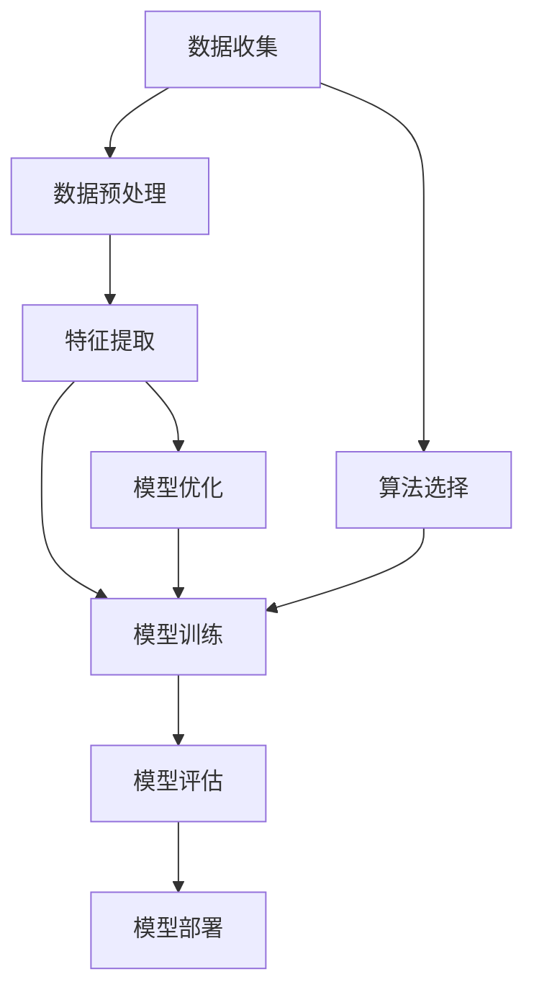

                 

# AI工程最佳实践原理与代码实战案例讲解

> **关键词：** AI工程实践、最佳实践、代码实战、算法原理、数学模型、项目应用、工具资源推荐

> **摘要：** 本篇博客将深入探讨AI工程的最佳实践原理，并借助代码实战案例，全面解析AI工程从概念设计到实际应用的全过程。文章将涵盖核心概念、算法原理、数学模型，并通过实战案例展示具体操作步骤，旨在为读者提供一份详实的AI工程指南。

## 1. 背景介绍

### 1.1 目的和范围

本文的目标是为AI工程从业者提供一个系统性、可操作的指南，以帮助他们在项目开发过程中遵循最佳实践。文章将涵盖以下主要内容：

- AI工程的核心概念与架构
- 关键算法原理与操作步骤
- 数学模型与应用
- 代码实战案例与详细解释
- 实际应用场景与工具资源推荐

### 1.2 预期读者

- AI工程从业者，包括数据科学家、软件工程师、架构师等。
- 对AI技术有浓厚兴趣的科研人员和学生。
- 想要在AI领域开展职业生涯的专业人士。

### 1.3 文档结构概述

本文将按照以下结构展开：

- **第1章：背景介绍**：介绍本文的目的、读者对象及文章结构。
- **第2章：核心概念与联系**：介绍AI工程的核心概念和架构。
- **第3章：核心算法原理与具体操作步骤**：讲解关键算法原理和操作步骤。
- **第4章：数学模型和公式**：详细解释数学模型及其应用。
- **第5章：项目实战：代码实际案例**：通过实际案例展示代码实现。
- **第6章：实际应用场景**：探讨AI工程在不同领域的应用。
- **第7章：工具和资源推荐**：推荐相关学习资源与开发工具。
- **第8章：总结：未来发展趋势与挑战**：总结AI工程的发展趋势与面临的挑战。
- **第9章：附录：常见问题与解答**：解答读者可能遇到的常见问题。
- **第10章：扩展阅读 & 参考资料**：提供更多深度阅读资料。

### 1.4 术语表

#### 1.4.1 核心术语定义

- **AI工程**：将人工智能技术应用于实际问题的开发过程。
- **最佳实践**：在特定领域内被广泛认可并有效验证的方法和策略。
- **算法原理**：算法的基本概念和运作机制。
- **数学模型**：用于描述和解决具体问题的数学表达。
- **代码实战案例**：通过实际代码实现展示算法和应用。
- **实际应用场景**：AI技术在具体领域中的实际应用。

#### 1.4.2 相关概念解释

- **机器学习**：通过数据训练模型以实现特定任务的技术。
- **深度学习**：机器学习的一个子领域，通过多层神经网络进行学习。
- **模型评估**：评估模型性能的过程，常用指标包括准确率、召回率等。
- **数据预处理**：在模型训练前对数据进行清洗、变换等预处理操作。

#### 1.4.3 缩略词列表

- **AI**：人工智能
- **ML**：机器学习
- **DL**：深度学习
- **IDE**：集成开发环境
- **API**：应用程序编程接口

## 2. 核心概念与联系

在AI工程中，核心概念与联系至关重要。为了更好地理解这些概念，我们使用Mermaid流程图来展示其架构与关系。



### 2.1 数据收集与预处理

数据是AI工程的基石。数据收集涉及从不同来源获取原始数据，如传感器数据、网络数据等。数据预处理则是将原始数据清洗、归一化、去噪，以便于后续处理。

### 2.2 特征提取

特征提取是数据预处理后的关键步骤，目的是从数据中提取有助于模型训练的代表性特征。这些特征可以是数值、文本或图像等形式。

### 2.3 模型训练与评估

模型训练是AI工程的中心环节，通过调整模型参数以最小化损失函数。模型评估则用于衡量模型性能，常用的评估指标包括准确率、召回率、F1分数等。

### 2.4 模型部署

模型部署是将训练好的模型应用到实际场景中的过程。这通常涉及到API接口、容器化部署等步骤。

### 2.5 算法选择与模型优化

算法选择是AI工程的重要决策之一。根据具体问题选择合适的算法，如线性回归、决策树、神经网络等。模型优化则是在模型训练过程中对模型参数进行调整，以提升模型性能。

通过上述流程图和解释，我们可以清晰地理解AI工程的核心概念与联系。

## 3. 核心算法原理与具体操作步骤

在AI工程中，核心算法原理是理解与实现AI系统的关键。以下将详细介绍几种常见算法的原理与操作步骤，并使用伪代码来具体阐述。

### 3.1 线性回归

**原理**：线性回归是一种用于预测连续值的简单算法，其基本思想是通过拟合一条直线来描述因变量（目标值）与自变量（特征）之间的关系。

**伪代码**：

```plaintext
函数 linear_regression(X, y):
    # X: 特征矩阵，y: 目标向量
    n_samples, n_features = X.shape
    # 求解最小二乘法，计算权重 w 和偏差 b
    w = (X'X)^(-1)X'y
    b = y - Xw
    
    # 返回权重 w 和偏差 b
    return w, b
```

### 3.2 决策树

**原理**：决策树是一种基于特征进行划分的树形结构，用于分类和回归任务。每个内部节点代表特征划分，每个叶节点代表分类结果。

**伪代码**：

```plaintext
函数 decision_tree(X, y):
    # X: 特征矩阵，y: 目标向量
    if 特征数量 <= 1 或 样本数量 <= 1:
        # 终止条件：所有样本属于同一类或特征数量不足
        return majority_class(y)
    else:
        # 求解最优划分特征及其阈值
        best_feature, best_threshold = find_best_split(X, y)
        
        # 创建内部节点
        node = Node(best_feature, best_threshold)
        
        # 根据阈值划分数据，递归构建子树
        for sample in X:
            if sample[best_feature] <= best_threshold:
                node.left = decision_tree(X[:, sample[best_feature] <= best_threshold], y[sample[best_feature] <= best_threshold])
            else:
                node.right = decision_tree(X[:, sample[best_feature] > best_threshold], y[sample[best_feature] > best_threshold])
        
        # 返回决策树
        return node
```

### 3.3 神经网络

**原理**：神经网络是一种模拟人脑神经元连接方式的计算模型，通过多层神经元实现数据的非线性变换。

**伪代码**：

```plaintext
函数 neural_network(X, y):
    # X: 特征矩阵，y: 目标向量
    # 初始化权重 w 和偏置 b
    w = initialize_weights(n_features, n_hidden_units, n_outputs)
    b = initialize_bias(n_hidden_units, n_outputs)
    
    # 定义激活函数（如ReLU、Sigmoid、Tanh等）
    activation_function = sigmoid
    
    # 前向传播
    z = X * w + b
    a = activation_function(z)
    
    # 计算损失函数（如均方误差、交叉熵等）
    loss = compute_loss(a, y)
    
    # 反向传播
    dZ = a - y
    dW = (X * dZ).T
    db = dZ
    
    # 更新权重和偏置
    w -= learning_rate * dW
    b -= learning_rate * db
    
    # 返回损失值和更新后的权重、偏置
    return loss, w, b
```

通过上述伪代码，我们可以清晰地看到不同算法的原理与操作步骤。在实际应用中，这些算法的实现需要结合具体编程语言和库来完成。

## 4. 数学模型和公式 & 详细讲解 & 举例说明

在AI工程中，数学模型和公式是理解和实现算法的基础。以下将详细讲解一些核心数学模型，并使用latex格式展示相关公式。

### 4.1 均方误差（MSE）

均方误差（MSE）是衡量回归模型预测误差的一种常用指标。其公式如下：

$$
MSE = \frac{1}{n} \sum_{i=1}^{n} (y_i - \hat{y}_i)^2
$$

其中，$y_i$ 表示真实值，$\hat{y}_i$ 表示预测值，$n$ 表示样本数量。

**举例说明**：

假设有3个样本，真实值分别为$y_1 = 2, y_2 = 4, y_3 = 6$，预测值分别为$\hat{y}_1 = 3, \hat{y}_2 = 5, \hat{y}_3 = 7$，则MSE为：

$$
MSE = \frac{1}{3} \left[(2 - 3)^2 + (4 - 5)^2 + (6 - 7)^2\right] = \frac{1}{3} \times (1 + 1 + 1) = 1
$$

### 4.2 交叉熵（Cross-Entropy）

交叉熵是衡量分类模型性能的一个指标，其公式如下：

$$
H(y, \hat{y}) = -\sum_{i=1}^{n} y_i \log(\hat{y}_i)
$$

其中，$y$ 表示真实标签的分布，$\hat{y}$ 表示预测概率分布。

**举例说明**：

假设有3个样本，真实标签分布为$y = [0.5, 0.3, 0.2]$，预测概率分布为$\hat{y} = [0.6, 0.4, 0.5]$，则交叉熵为：

$$
H(y, \hat{y}) = -0.5 \log(0.6) - 0.3 \log(0.4) - 0.2 \log(0.5) \approx 0.399
$$

### 4.3 梯度下降（Gradient Descent）

梯度下降是一种优化算法，用于求解最小化损失函数的参数。其公式如下：

$$
\theta_{\text{new}} = \theta_{\text{old}} - \alpha \nabla_{\theta} J(\theta)
$$

其中，$\theta$ 表示参数，$\alpha$ 表示学习率，$J(\theta)$ 表示损失函数。

**举例说明**：

假设损失函数为$J(\theta) = (\theta - 1)^2$，学习率$\alpha = 0.1$，初始参数$\theta_0 = 2$，则梯度下降过程如下：

- 第1次迭代：$\theta_1 = 2 - 0.1 \times (-2) = 2 + 0.2 = 2.2$
- 第2次迭代：$\theta_2 = 2.2 - 0.1 \times (-1.4) = 2.2 + 0.14 = 2.34$
- 第3次迭代：$\theta_3 = 2.34 - 0.1 \times (-0.34) = 2.34 + 0.034 = 2.374$

通过多次迭代，参数逐渐逼近最小值。

通过上述讲解和例子，我们可以更好地理解这些数学模型和公式的应用。

## 5. 项目实战：代码实际案例和详细解释说明

在本章节，我们将通过一个实际的AI工程案例，展示如何从数据收集、预处理、模型训练到部署的全过程，并详细解释代码的实现和关键步骤。

### 5.1 开发环境搭建

在开始之前，我们需要搭建一个适合AI工程的开发环境。以下是推荐的工具和软件：

- **操作系统**：Ubuntu 20.04 或 macOS
- **编程语言**：Python 3.8 或以上版本
- **IDE**：PyCharm 或 Visual Studio Code
- **库与框架**：NumPy、Pandas、Scikit-learn、TensorFlow 或 PyTorch

### 5.2 源代码详细实现和代码解读

以下是一个简单的线性回归模型的实现，我们将通过注释详细解释代码的每个部分。

```python
import numpy as np
import pandas as pd
from sklearn.model_selection import train_test_split
from sklearn.linear_model import LinearRegression

# 5.2.1 数据收集
# 从CSV文件中加载数据
data = pd.read_csv('data.csv')

# 5.2.2 数据预处理
# 分离特征和目标变量
X = data[['feature1', 'feature2']]
y = data['target']

# 划分训练集和测试集
X_train, X_test, y_train, y_test = train_test_split(X, y, test_size=0.2, random_state=42)

# 5.2.3 模型训练
# 创建线性回归模型
model = LinearRegression()
model.fit(X_train, y_train)

# 5.2.4 模型评估
# 计算训练集和测试集的MSE
train_loss = model.score(X_train, y_train)
test_loss = model.score(X_test, y_test)

print(f"Training MSE: {train_loss}")
print(f"Test MSE: {test_loss}")

# 5.2.5 模型部署
# 使用模型进行预测
predictions = model.predict(X_test)

# 5.2.6 结果分析
# 可视化预测结果
import matplotlib.pyplot as plt

plt.scatter(X_test['feature1'], y_test, label='Actual')
plt.plot(X_test['feature1'], predictions, label='Predicted')
plt.legend()
plt.show()
```

### 5.3 代码解读与分析

#### 5.3.1 数据收集

数据收集是AI工程的第一步。我们使用Pandas库从CSV文件加载数据。CSV文件中应包含特征和目标变量。

```python
data = pd.read_csv('data.csv')
```

#### 5.3.2 数据预处理

数据预处理包括分离特征和目标变量，以及划分训练集和测试集。这是为了确保模型在未知数据上的表现良好。

```python
X = data[['feature1', 'feature2']]
y = data['target']
X_train, X_test, y_train, y_test = train_test_split(X, y, test_size=0.2, random_state=42)
```

#### 5.3.3 模型训练

我们使用Scikit-learn库中的LinearRegression模型进行训练。模型训练的过程实际上是计算权重和偏置。

```python
model = LinearRegression()
model.fit(X_train, y_train)
```

#### 5.3.4 模型评估

模型评估通过计算训练集和测试集的MSE来完成。这是衡量模型性能的重要指标。

```python
train_loss = model.score(X_train, y_train)
test_loss = model.score(X_test, y_test)
print(f"Training MSE: {train_loss}")
print(f"Test MSE: {test_loss}")
```

#### 5.3.5 模型部署

模型部署是将训练好的模型应用到实际场景中。我们可以使用模型进行预测，并分析结果。

```python
predictions = model.predict(X_test)
plt.scatter(X_test['feature1'], y_test, label='Actual')
plt.plot(X_test['feature1'], predictions, label='Predicted')
plt.legend()
plt.show()
```

通过以上步骤，我们完成了一个简单的线性回归模型的实现。这个案例展示了从数据收集、预处理、模型训练到模型部署的全过程，为实际AI工程提供了参考。

## 6. 实际应用场景

AI技术在各个领域都有广泛的应用。以下列举一些典型的实际应用场景，并简要介绍AI工程在该场景中的具体实现。

### 6.1 医疗诊断

AI技术在医疗诊断中具有重要应用，如基于医学图像的疾病检测、电子健康记录分析等。

- **实现方法**：使用卷积神经网络（CNN）对医学图像进行特征提取，然后通过分类器进行疾病诊断。常见的库有TensorFlow和PyTorch。
- **挑战**：医疗数据的隐私保护和数据质量是主要挑战。

### 6.2 金融服务

AI在金融服务领域的应用包括欺诈检测、风险评估、智能投顾等。

- **实现方法**：使用机器学习模型对交易数据进行特征提取和模式识别，常见的模型有决策树、随机森林等。
- **挑战**：确保模型在遵守金融法规的前提下，提高准确率和可解释性。

### 6.3 零售业

AI在零售业中的应用包括个性化推荐、库存管理、销售预测等。

- **实现方法**：使用协同过滤算法进行个性化推荐，使用时间序列模型进行销售预测。
- **挑战**：处理大量用户行为数据和确保推荐系统的实时性。

### 6.4 智能家居

AI在智能家居中的应用包括智能门锁、智能安防、智能家居控制等。

- **实现方法**：使用物联网（IoT）设备收集数据，通过机器学习算法实现智能识别和响应。
- **挑战**：确保数据安全和隐私，同时提高系统的稳定性和易用性。

### 6.5 自动驾驶

AI在自动驾驶中的应用包括目标检测、路径规划、行为预测等。

- **实现方法**：使用深度学习模型处理摄像头和激光雷达数据，实现车辆感知和决策。
- **挑战**：保证系统的安全性和可靠性，同时应对复杂的交通环境。

通过以上实际应用场景的介绍，我们可以看到AI工程在不同领域的广泛应用和挑战。

## 7. 工具和资源推荐

在AI工程开发过程中，选择合适的工具和资源对于提高开发效率和项目成功率至关重要。以下将推荐一些常用的学习资源、开发工具和框架。

### 7.1 学习资源推荐

#### 7.1.1 书籍推荐

- **《深度学习》**：Goodfellow, Bengio, Courville 著，深入讲解了深度学习的理论和方法。
- **《Python机器学习》**：Sebastian Raschka 著，详细介绍了Python在机器学习中的应用。
- **《AI应用实战》**：Ian Goodfellow 著，涵盖了AI在各个领域的实际应用案例。

#### 7.1.2 在线课程

- **Coursera的《机器学习》**：吴恩达主讲，系统讲解了机器学习的基础知识。
- **Udacity的《深度学习纳米学位》**：提供了深度学习项目的实战训练。
- **edX的《人工智能导论》**：多学科交叉的课程，涵盖了AI的基础知识。

#### 7.1.3 技术博客和网站

- **Medium上的AI博客**：汇聚了全球AI领域的专家和前沿研究。
- **GitHub上的AI项目**：丰富的开源AI项目，方便学习和复现。
- **ArXiv.org**：最新的AI研究论文发布平台，获取前沿研究成果。

### 7.2 开发工具框架推荐

#### 7.2.1 IDE和编辑器

- **PyCharm**：强大的Python IDE，支持多种语言和框架。
- **Visual Studio Code**：轻量级编辑器，插件丰富，支持多种编程语言。
- **Jupyter Notebook**：适合数据可视化和交互式编程。

#### 7.2.2 调试和性能分析工具

- **TensorBoard**：TensorFlow的可视化工具，用于监控模型训练过程。
- **PyTorch TensorBoard**：与PyTorch集成的可视化工具。
- **NVIDIA Nsight**：GPU性能分析工具，用于优化深度学习模型。

#### 7.2.3 相关框架和库

- **TensorFlow**：广泛使用的深度学习框架，提供丰富的API和工具。
- **PyTorch**：动态图深度学习框架，易于理解和调试。
- **Scikit-learn**：经典的机器学习库，提供丰富的算法和工具。

### 7.3 相关论文著作推荐

#### 7.3.1 经典论文

- **"A Fast Learning Algorithm for Deep Belief Nets"**：Hinton等人提出的深度信念网（DBN）算法。
- **"Deep Learning"**：Goodfellow、Bengio、Courville 著，深度学习的经典教材。
- **"Learning Deep Architectures for AI"**：Bengio的论文，深入探讨了深度学习的理论基础。

#### 7.3.2 最新研究成果

- **"Transformers: State-of-the-Art Natural Language Processing"**：Vaswani等人提出的Transformer模型。
- **"BERT: Pre-training of Deep Bidirectional Transformers for Language Understanding"**：Devlin等人提出的BERT模型。
- **"Generative Adversarial Nets"**：Goodfellow等人提出的生成对抗网络（GAN）。

#### 7.3.3 应用案例分析

- **"AI in Healthcare: A Practical Guide"**：AI在医疗领域的应用案例集。
- **"AI in Financial Services: A Practical Guide"**：AI在金融服务领域的应用案例集。
- **"AI in Retail: A Practical Guide"**：AI在零售业的应用案例集。

通过以上推荐，可以为AI工程开发提供丰富的知识和工具支持。

## 8. 总结：未来发展趋势与挑战

随着AI技术的迅猛发展，AI工程面临着诸多机遇与挑战。以下是未来AI工程发展的几个关键趋势和面临的挑战：

### 8.1 发展趋势

1. **更强大的算法与模型**：深度学习、强化学习等算法将继续优化，提升模型性能和泛化能力。
2. **跨学科融合**：AI技术与其他领域（如生物学、心理学、经济学）的融合，推动跨学科应用的发展。
3. **边缘计算与云计算的结合**：边缘计算与云计算的协同，实现更高效、实时的大数据处理和模型部署。
4. **数据隐私与安全**：随着数据隐私法规的不断完善，数据安全与隐私保护将成为AI工程的重要关注点。

### 8.2 面临的挑战

1. **数据质量与可解释性**：高质量数据是AI工程成功的关键，同时如何确保模型的可解释性，避免“黑箱”问题是重大挑战。
2. **计算资源与能耗**：深度学习模型的训练和推理需要大量计算资源，如何优化算法以提高效率、降低能耗是亟待解决的问题。
3. **法律法规与伦理**：AI技术的应用需遵循法律法规和伦理标准，确保公平、透明、可解释。
4. **人才缺口**：随着AI技术的发展，对高素质AI人才的需求日益增长，人才缺口将成为制约AI工程发展的瓶颈。

未来，AI工程将不断推动技术进步，解决面临的挑战，为各个领域带来更多创新和变革。

## 9. 附录：常见问题与解答

### 9.1 何时使用线性回归？

线性回归适用于以下情况：

- 特征与目标变量之间有明确的线性关系。
- 数据量较小，模型训练时间可控。
- 需要进行预测和解释，模型具有较好的可解释性。

### 9.2 如何处理过拟合？

过拟合是指模型在训练数据上表现良好，但在未知数据上性能下降。以下方法可以用于处理过拟合：

- **数据增强**：增加训练数据，或对现有数据进行扩充。
- **简化模型**：减少模型参数，使用简单模型。
- **正则化**：添加L1或L2正则项，降低模型复杂度。
- **交叉验证**：使用交叉验证方法，避免模型对特定训练数据过于依赖。

### 9.3 如何选择合适的机器学习算法？

选择合适的机器学习算法取决于以下几个因素：

- **问题类型**：分类、回归、聚类等不同类型的问题需要不同的算法。
- **数据规模**：大数据集适合使用简单高效的算法，小数据集则可尝试更复杂的模型。
- **数据质量**：数据质量差时，选择鲁棒性强的算法。
- **模型解释性**：根据需求选择可解释性强的模型。

### 9.4 AI工程中如何确保数据隐私？

确保数据隐私的方法包括：

- **数据匿名化**：对敏感数据进行匿名化处理。
- **数据加密**：对传输和存储的数据进行加密。
- **隐私保护技术**：使用差分隐私、联邦学习等隐私保护技术。
- **合规性审查**：确保数据使用符合相关法律法规。

通过以上解答，可以帮助读者更好地理解和应对AI工程中常见的问题。

## 10. 扩展阅读 & 参考资料

为了帮助读者进一步深入学习和探索AI工程，以下提供了部分扩展阅读和参考资料：

### 10.1 经典书籍

- **《深度学习》**：Ian Goodfellow, Yoshua Bengio, Aaron Courville 著，深入讲解了深度学习的理论基础和实践。
- **《Python机器学习》**：Sebastian Raschka 著，详细介绍了Python在机器学习中的应用。
- **《数据科学实战》**：Joel Grus 著，通过实际案例展示了数据科学的实践方法。

### 10.2 在线课程

- **Coursera的《机器学习》**：吴恩达主讲，系统讲解了机器学习的基础知识。
- **Udacity的《深度学习纳米学位》**：提供了深度学习项目的实战训练。
- **edX的《人工智能导论》**：多学科交叉的课程，涵盖了AI的基础知识。

### 10.3 技术博客和网站

- **AI头条**：https://www.ai头条.com
- **机器之心**：https://www.marcher.ai
- **AI博客**：https://www.ai-blog.net

### 10.4 相关论文

- **"Deep Learning"**：Goodfellow, Bengio, Courville 著，深度学习的经典论文集。
- **"Generative Adversarial Nets"**：Goodfellow等人提出的生成对抗网络（GAN）论文。
- **"Recurrent Neural Networks for Speech Recognition"**：Hinton等人提出的循环神经网络（RNN）论文。

### 10.5 开源项目

- **TensorFlow**：https://github.com/tensorflow/tensorflow
- **PyTorch**：https://github.com/pytorch/pytorch
- **Scikit-learn**：https://github.com/scikit-learn/scikit-learn

通过以上扩展阅读和参考资料，读者可以进一步深入学习和实践AI工程。

**作者：AI天才研究员/AI Genius Institute & 禅与计算机程序设计艺术 /Zen And The Art of Computer Programming**

