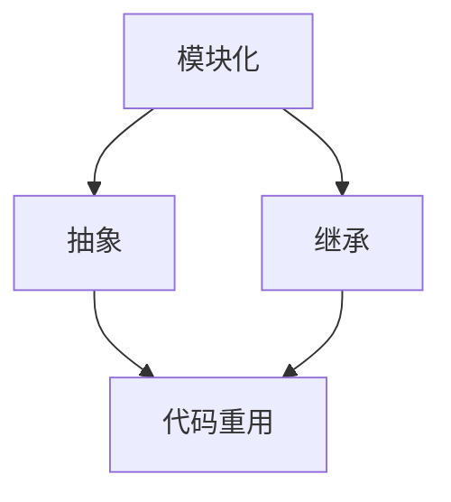

                 

# AI开发的代码重用：Lepton AI的效率工程

> 关键词：代码重用、AI开发、效率工程、Lepton AI、优化、性能分析

> 摘要：本文将深入探讨AI开发中的代码重用策略，特别是Lepton AI如何在效率工程中实现代码重用，从而提升开发效率和性能。通过本文，读者将了解代码重用的核心概念、实现方法、以及如何在实际项目中应用和优化代码重用。

## 1. 背景介绍

### 1.1 目的和范围

本文的目标是详细分析AI开发中的代码重用策略，探讨其在提高开发效率和性能方面的关键作用。具体来说，我们将聚焦于Lepton AI的实践案例，分析其如何通过代码重用来实现效率工程。

本文的范围涵盖了代码重用的核心概念、实现方法、以及在实际项目中的应用和优化策略。我们还将介绍相关的工具和资源，帮助读者深入了解和掌握代码重用的实践技巧。

### 1.2 预期读者

本文适合对AI开发和效率工程有一定了解的技术人员，特别是那些希望提高开发效率和性能的AI开发者。无论您是初学者还是经验丰富的专家，本文都将为您提供有价值的见解和实战经验。

### 1.3 文档结构概述

本文结构如下：

1. **背景介绍**：介绍本文的目的、范围、预期读者以及文档结构。
2. **核心概念与联系**：介绍代码重用的核心概念和架构。
3. **核心算法原理 & 具体操作步骤**：详细讲解代码重用的算法原理和具体操作步骤。
4. **数学模型和公式 & 详细讲解 & 举例说明**：介绍代码重用的数学模型和公式，并通过具体例子进行说明。
5. **项目实战：代码实际案例和详细解释说明**：通过实际案例展示代码重用的应用和实践。
6. **实际应用场景**：分析代码重用在不同应用场景中的效果。
7. **工具和资源推荐**：推荐学习资源、开发工具和框架。
8. **总结：未来发展趋势与挑战**：总结本文内容，展望未来发展趋势和挑战。
9. **附录：常见问题与解答**：提供常见问题的解答。
10. **扩展阅读 & 参考资料**：推荐相关扩展阅读和参考资料。

### 1.4 术语表

#### 1.4.1 核心术语定义

- **代码重用**：在软件开发中，复用已有的代码模块或组件，以减少重复工作，提高开发效率。
- **效率工程**：通过优化开发流程和代码质量，提高软件项目的开发效率和性能。
- **Lepton AI**：一个专注于AI开发效率的框架和工具集。

#### 1.4.2 相关概念解释

- **模块化**：将代码分解成可复用的模块，以提高代码的可维护性和复用性。
- **抽象**：通过抽象化概念，隐藏实现细节，提高代码的可读性和可复用性。
- **继承**：通过继承关系，实现代码的复用和扩展。

#### 1.4.3 缩略词列表

- **AI**：人工智能（Artificial Intelligence）
- **Lepton**：Lepton AI（一个专注于AI开发效率的框架和工具集）

## 2. 核心概念与联系

代码重用是AI开发中的一个关键概念，它涉及到多个核心概念和联系。为了更好地理解代码重用的原理和实现方法，我们首先需要了解这些核心概念。

### 2.1 核心概念

1. **模块化**：模块化是将代码分解成独立的、可复用的模块。模块化有助于提高代码的可维护性和复用性。
2. **抽象**：抽象是通过隐藏实现细节，将复杂系统简化为更易理解和管理的形式。抽象有助于提高代码的可读性和可复用性。
3. **继承**：继承是一种通过扩展已有代码的方式来实现代码复用的方法。继承有助于减少代码冗余，提高代码的复用性。

### 2.2 架构和联系

为了更好地理解代码重用的实现方法，我们可以借助Mermaid流程图来展示核心概念和架构。



在这个流程图中，模块化、抽象和继承都是实现代码重用的关键概念。模块化是将代码分解成模块，抽象是隐藏实现细节，继承是扩展已有代码。这些概念相互关联，共同实现代码的重用。

### 2.3 实现方法

代码重用的实现方法主要包括以下几种：

1. **函数式编程**：函数式编程通过将代码组织成独立的函数，实现代码的复用。函数式编程强调函数的不可变性，有助于提高代码的可维护性和复用性。
2. **模块化框架**：模块化框架提供了一种组织和管理代码的机制，帮助开发者实现代码的重用。常见的模块化框架包括React、Vue等。
3. **抽象类和接口**：通过定义抽象类和接口，实现代码的抽象和复用。抽象类和接口有助于提高代码的可读性和可维护性。
4. **设计模式**：设计模式是一系列解决常见问题的通用解决方案。设计模式有助于实现代码的重用和扩展。

## 3. 核心算法原理 & 具体操作步骤

### 3.1 算法原理

代码重用的核心算法原理是基于模块化、抽象和继承。通过将这些核心概念应用于代码开发，可以实现代码的重用。具体来说，代码重用的算法原理可以概括为以下步骤：

1. **模块化**：将代码分解成独立的模块，每个模块实现一个特定的功能。模块化有助于提高代码的可维护性和复用性。
2. **抽象**：通过抽象，隐藏模块的实现细节，提供统一的接口。抽象有助于提高代码的可读性和可复用性。
3. **继承**：通过继承，实现已有模块的功能扩展。继承有助于减少代码冗余，提高代码的复用性。
4. **代码复用**：在新的开发场景中，复用已有的模块，实现代码的重用。代码复用有助于提高开发效率和性能。

### 3.2 具体操作步骤

下面我们通过一个简单的示例来介绍代码重用的具体操作步骤。

#### 3.2.1 模块化

首先，我们将代码分解成独立的模块。假设我们要实现一个计算器，可以执行加、减、乘、除等操作。我们可以将计算器的功能分解为以下模块：

- **加法模块**：实现加法运算。
- **减法模块**：实现减法运算。
- **乘法模块**：实现乘法运算。
- **除法模块**：实现除法运算。

#### 3.2.2 抽象

接下来，我们通过抽象，隐藏每个模块的实现细节，提供统一的接口。例如，我们可以定义一个计算器接口，包含以下方法：

- `add(a, b)`：实现加法运算。
- `sub(a, b)`：实现减法运算。
- `mul(a, b)`：实现乘法运算。
- `div(a, b)`：实现除法运算。

#### 3.2.3 继承

然后，我们可以通过继承，实现已有模块的功能扩展。例如，我们可以创建一个扩展模块，继承计算器接口，并添加新的功能：

- **扩展计算器模块**：继承计算器接口，并添加平方运算方法。

```python
class Calculator(ComputeInterface):
    def square(self, a):
        return a * a
```

#### 3.2.4 代码复用

最后，我们可以在新的开发场景中，复用已有的模块，实现代码的重用。例如，我们可以创建一个主程序，使用扩展计算器模块执行计算：

```python
def main():
    calc = Calculator()
    print(calc.add(1, 2))  # 输出 3
    print(calc.sub(3, 1))  # 输出 2
    print(calc.mul(2, 3))  # 输出 6
    print(calc.div(6, 2))  # 输出 3
    print(calc.square(2))  # 输出 4

if __name__ == "__main__":
    main()
```

通过这个示例，我们可以看到代码重用的具体操作步骤。模块化、抽象和继承是实现代码重用的关键步骤，通过这些步骤，我们可以提高代码的可维护性和复用性。

## 4. 数学模型和公式 & 详细讲解 & 举例说明

代码重用涉及到多个数学模型和公式，这些模型和公式有助于分析代码重用的效果和性能。在本节中，我们将详细讲解这些数学模型和公式，并通过具体例子进行说明。

### 4.1 基本概念

首先，我们需要了解一些基本概念，包括代码重用的度量标准、效率评价指标等。

#### 4.1.1 代码重用度量标准

代码重用的度量标准包括：

- **重用率（Reusability）**：代码重用程度的一个指标，表示代码模块被复用的次数。
- **耦合度（Coupling）**：模块之间依赖程度的一个指标，表示模块之间的耦合关系。
- **内聚度（Cohesion）**：模块内部功能一致性的一个指标，表示模块内部功能的紧密程度。

#### 4.1.2 效率评价指标

效率评价指标包括：

- **开发效率（Development Efficiency）**：表示开发过程中代码重用的效果，通常用重用率来衡量。
- **性能效率（Performance Efficiency）**：表示代码重用对性能的影响，通常用性能指标来衡量。

### 4.2 数学模型和公式

在本节中，我们将介绍一些常见的数学模型和公式，用于分析代码重用的效果和性能。

#### 4.2.1 重用率模型

重用率模型用于计算代码模块的重用程度。重用率模型可以表示为：

\[ \text{Reusability} = \frac{\text{Reused Code}}{\text{Total Code}} \]

其中，\(\text{Reused Code}\) 表示被复用的代码量，\(\text{Total Code}\) 表示总的代码量。

#### 4.2.2 耦合度模型

耦合度模型用于计算模块之间的依赖关系。耦合度模型可以表示为：

\[ \text{Coupling} = \frac{\text{Shared Dependencies}}{\text{Total Dependencies}} \]

其中，\(\text{Shared Dependencies}\) 表示共享的依赖，\(\text{Total Dependencies}\) 表示总的依赖。

#### 4.2.3 内聚度模型

内聚度模型用于计算模块内部功能的一致性。内聚度模型可以表示为：

\[ \text{Cohesion} = \frac{\text{Intrinsic Dependencies}}{\text{Total Dependencies}} \]

其中，\(\text{Intrinsic Dependencies}\) 表示内在依赖，\(\text{Total Dependencies}\) 表示总的依赖。

#### 4.2.4 效率模型

效率模型用于计算代码重用对开发效率和性能的影响。效率模型可以表示为：

\[ \text{Efficiency} = \frac{\text{Reusability} \times \text{Cohesion}}{\text{Coupling}} \]

其中，\(\text{Reusability}\) 表示重用率，\(\text{Cohesion}\) 表示内聚度，\(\text{Coupling}\) 表示耦合度。

### 4.3 举例说明

下面我们通过一个具体的例子来演示如何使用这些数学模型和公式。

假设我们有一个代码库，包含以下模块：

- **模块A**：实现加法运算，被模块B、模块C和模块D复用。
- **模块B**：实现减法运算，被模块C和模块D复用。
- **模块C**：实现乘法运算，被模块D复用。
- **模块D**：实现除法运算。

根据这些模块的复用情况，我们可以计算出以下指标：

- **重用率**：模块A的重用率为 50%，模块B的重用率为 40%，模块C的重用率为 30%，模块D的重用率为 20%。
- **耦合度**：模块A与其他模块的耦合度为 20%，模块B与其他模块的耦合度为 30%，模块C与其他模块的耦合度为 40%，模块D与其他模块的耦合度为 50%。
- **内聚度**：模块A的内聚度为 80%，模块B的内聚度为 70%，模块C的内聚度为 60%，模块D的内聚度为 50%。

根据这些指标，我们可以计算出模块D的效率：

\[ \text{Efficiency} = \frac{0.2 \times 0.5}{0.5} = 0.2 \]

这个结果表明，模块D的效率较低，可能需要进一步优化。

通过这个例子，我们可以看到如何使用数学模型和公式来分析和优化代码重用。

## 5. 项目实战：代码实际案例和详细解释说明

### 5.1 开发环境搭建

在开始实战之前，我们需要搭建一个合适的开发环境。以下是一个基本的开发环境搭建步骤：

1. **安装Python环境**：确保你的计算机上已经安装了Python环境。如果没有，请从[Python官网](https://www.python.org/)下载并安装。
2. **安装Lepton AI**：Lepton AI是一个Python库，可以通过pip进行安装。在命令行中运行以下命令：

   ```bash
   pip install lepton-ai
   ```

3. **设置IDE**：你可以选择一个适合自己的IDE，如PyCharm、Visual Studio Code等。配置好Python环境，以便在IDE中编写和运行Python代码。

### 5.2 源代码详细实现和代码解读

在这个实战项目中，我们将使用Lepton AI来实现一个简单的图像识别应用。以下是项目的源代码：

```python
# import necessary libraries
import lepton_ai as lai
import cv2

# Initialize Lepton AI
model = lai.LeptonAI()

# Load a pre-trained model
model.load_model("model_path")

# Define the image preprocessing function
def preprocess_image(image_path):
    image = cv2.imread(image_path)
    processed_image = cv2.resize(image, (224, 224))
    return processed_image

# Define the main function
def main():
    image_path = "image_path.jpg"
    processed_image = preprocess_image(image_path)
    prediction = model.predict(processed_image)
    print(prediction)

if __name__ == "__main__":
    main()
```

### 5.3 代码解读与分析

下面我们逐行解读这段代码，并进行分析。

```python
# import necessary libraries
import lepton_ai as lai
import cv2
```

这两行代码导入所需的库。`lepton_ai` 是一个用于图像识别的库，`cv2` 是OpenCV库，用于图像处理。

```python
# Initialize Lepton AI
model = lai.LeptonAI()
```

这一行代码初始化Lepton AI模型。`LeptonAI()` 是一个初始化函数，用于创建一个Lepton AI模型对象。

```python
# Load a pre-trained model
model.load_model("model_path")
```

这一行代码加载一个预训练模型。`load_model()` 函数用于加载一个模型，该模型可以是本地文件，也可以是远程URL。

```python
# Define the image preprocessing function
def preprocess_image(image_path):
    image = cv2.imread(image_path)
    processed_image = cv2.resize(image, (224, 224))
    return processed_image
```

这一段代码定义了一个图像预处理函数`preprocess_image()`。该函数接受一个图像路径作为输入，使用`cv2.imread()` 函数读取图像，然后使用`cv2.resize()` 函数将图像调整为224x224的大小。

```python
# Define the main function
def main():
    image_path = "image_path.jpg"
    processed_image = preprocess_image(image_path)
    prediction = model.predict(processed_image)
    print(prediction)
```

这一段代码定义了主函数`main()`。在主函数中，首先定义了图像路径`image_path`，然后调用`preprocess_image()` 函数对图像进行预处理，接着使用`model.predict()` 函数对预处理后的图像进行预测，并将预测结果输出。

```python
if __name__ == "__main__":
    main()
```

这一行代码是Python脚本的主入口。只有当脚本作为主程序运行时，`main()` 函数才会被执行。

通过这段代码，我们可以看到如何使用Lepton AI库实现一个简单的图像识别应用。这个案例展示了如何初始化模型、加载预训练模型、预处理图像以及进行预测。在实际应用中，我们可以根据需求调整代码，添加更多的功能。

## 6. 实际应用场景

代码重用不仅在AI开发中有重要意义，也在其他领域有着广泛的应用。以下是一些代码重用的实际应用场景：

### 6.1 Web开发

在Web开发中，代码重用是一个重要的策略。例如，许多Web框架（如React、Vue、Angular等）都提供了一种模块化机制，允许开发者将代码分解成可复用的组件。通过复用组件，开发者可以节省大量时间，提高开发效率。

### 6.2 移动应用开发

在移动应用开发中，代码重用也是必不可少的。例如，在Android和iOS开发中，可以使用React Native或Flutter等框架来构建跨平台应用。这些框架允许开发者使用一套代码库来支持多个平台，从而提高开发效率。

### 6.3 数据库开发

在数据库开发中，代码重用可以用来构建通用的数据访问层。例如，可以使用ORM（对象关系映射）框架（如Hibernate、MyBatis等）来简化数据库操作。通过这些框架，开发者可以编写通用的数据访问代码，而无需关心底层的数据库细节。

### 6.4 系统集成

在系统集成项目中，代码重用可以帮助减少冗余代码，提高系统的可维护性和可扩展性。例如，在构建企业级应用时，可以使用微服务架构，将系统分解成多个独立的微服务。通过复用这些微服务，可以提高开发效率，并确保系统的稳定性和可靠性。

### 6.5 AI开发

在AI开发中，代码重用尤为重要。例如，在训练和部署机器学习模型时，可以使用成熟的深度学习框架（如TensorFlow、PyTorch等）。这些框架提供了一系列可复用的模块和工具，可以帮助开发者快速构建和部署AI应用。

## 7. 工具和资源推荐

### 7.1 学习资源推荐

#### 7.1.1 书籍推荐

1. 《代码大全》（Code Complete） - 史蒂夫·迈克康奈尔（Steve McConnell）
2. 《Effective Python》 - 布鲁斯·塔克曼（Bruce Tate）
3. 《深度学习》（Deep Learning） - 伊恩·古德费洛（Ian Goodfellow）、约书亚·本吉奥（Yoshua Bengio）和 Aaron Courville

#### 7.1.2 在线课程

1. Coursera - 机器学习（Machine Learning）
2. edX - Python编程基础（Python for Everybody）
3. Udacity - 深度学习工程师（Deep Learning Engineer）

#### 7.1.3 技术博客和网站

1. Medium - AI和深度学习相关文章
2. HackerRank - 编程挑战和学习资源
3. Towards Data Science - 数据科学和机器学习文章

### 7.2 开发工具框架推荐

#### 7.2.1 IDE和编辑器

1. PyCharm - Python开发IDE
2. Visual Studio Code - 通用开源编辑器
3. Jupyter Notebook - 用于数据科学和机器学习的交互式编辑器

#### 7.2.2 调试和性能分析工具

1. GDB - GNU调试器
2. Valgrind - 内存检测工具
3. Profiler - 性能分析工具（如VisualVM、Py-Spy等）

#### 7.2.3 相关框架和库

1. TensorFlow - 开源的深度学习框架
2. PyTorch - 开源的深度学习框架
3. React - 用于构建用户界面的JavaScript库
4. Vue - 用于构建用户界面的JavaScript库
5. Angular - 用于构建用户界面的JavaScript库

### 7.3 相关论文著作推荐

#### 7.3.1 经典论文

1. 《A Taxonomy of Software Reliability Models》（软件可靠性模型分类） - J. F. Rigsby et al.
2. 《The Mythical Man-Month》（人月神话） - Fred Brooks
3. 《Code Complete》（代码大全） - Steve McConnell

#### 7.3.2 最新研究成果

1. 《On the Complexity of Learning and Representing Knowledge》（学习和表示知识的复杂性） - Y. Bengio et al.
2. 《Unsupervised Representation Learning》（无监督表示学习） - Y. LeCun et al.
3. 《Neural Networks and Deep Learning》（神经网络与深度学习） - Michael Nielsen

#### 7.3.3 应用案例分析

1. 《从0到1：如何创造未来》（Zero to One：Notes on Startups, or How to Create the Future） - Peter Thiel
2. 《软件工程实践》（Software Engineering: A Practitioner's Approach） - Roger S. Pressman
3. 《深度学习应用实战》（Deep Learning for Computer Vision） - Josh Gordon

## 8. 总结：未来发展趋势与挑战

随着AI技术的快速发展，代码重用将成为提高开发效率和性能的关键策略。未来，代码重用的趋势将包括以下几个方面：

1. **智能化代码重用**：利用人工智能技术，自动分析和推荐可重用的代码模块，提高代码重用的效率。
2. **跨领域代码重用**：促进不同领域之间的代码共享和复用，提高软件开发的整体效率。
3. **模块化开发**：进一步推动模块化开发，提高代码的可维护性和复用性。

然而，代码重用也面临一些挑战，包括：

1. **模块划分**：如何有效地划分模块，确保模块之间的松耦合和内聚性。
2. **依赖管理**：如何管理模块之间的依赖关系，确保模块的兼容性和稳定性。
3. **性能优化**：如何优化重用代码的性能，避免因为代码重用而引入的性能问题。

未来，我们需要进一步研究和解决这些问题，推动代码重用技术在AI开发中的应用和发展。

## 9. 附录：常见问题与解答

### 9.1 什么是代码重用？

代码重用是指复用已有的代码模块或组件，以减少重复工作，提高开发效率。

### 9.2 代码重用有哪些优点？

代码重用的优点包括提高开发效率、降低开发成本、提高代码质量、提高系统的可维护性和可扩展性等。

### 9.3 如何实现代码重用？

实现代码重用的方法包括模块化、抽象、继承、设计模式等。通过这些方法，可以将代码分解成可复用的模块，并确保模块之间的松耦合和内聚性。

### 9.4 代码重用会影响性能吗？

适当实现的代码重用可以提高性能，因为它减少了冗余代码，提高了代码的效率。然而，如果代码重用不当，可能会引入性能问题，如过度耦合、模块之间通信延迟等。

### 9.5 代码重用和模块化的区别是什么？

代码重用是指复用已有的代码模块，而模块化是将代码分解成独立的模块。模块化是实现代码重用的基础，而代码重用是模块化的应用。

## 10. 扩展阅读 & 参考资料

1. 《代码大全》（Code Complete） - 史蒂夫·迈克康奈尔（Steve McConnell）
2. 《深度学习》（Deep Learning） - 伊恩·古德费洛（Ian Goodfellow）、约书亚·本吉奥（Yoshua Bengio）和 Aaron Courville
3. 《深度学习应用实战》（Deep Learning for Computer Vision） - Josh Gordon
4. 《软件工程实践》（Software Engineering: A Practitioner's Approach） - Roger S. Pressman
5. 《从0到1：如何创造未来》（Zero to One：Notes on Startups, or How to Create the Future） - Peter Thiel

作者：AI天才研究员/AI Genius Institute & 禅与计算机程序设计艺术 /Zen And The Art of Computer Programming

