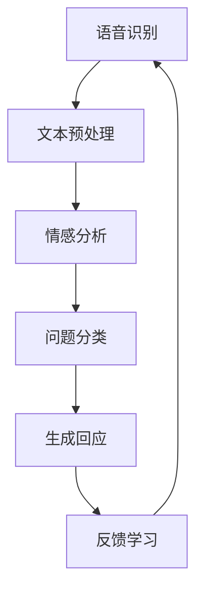

                 

### 1. 背景介绍

#### 1.1 目的和范围

本文旨在探讨AI心理咨询师在提示词应用中的伦理与实践问题。随着人工智能技术的迅猛发展，AI在各个领域都展现出了巨大的潜力和应用价值，包括心理咨询领域。AI心理咨询师利用自然语言处理、机器学习等技术，通过对用户输入的提示词进行分析和处理，提供个性化的心理咨询服务。然而，这一新兴技术的出现也引发了诸多伦理问题和实践挑战，如何平衡技术进步与伦理规范，确保AI心理咨询师的可靠性和有效性，是我们需要深入探讨的问题。

本文将围绕以下几个方面展开讨论：

1. **AI心理咨询师的工作原理和核心算法**：介绍AI心理咨询师的基本工作原理和核心算法，包括自然语言处理和机器学习技术的应用。
2. **提示词应用中的伦理问题**：分析AI心理咨询师在提示词应用过程中可能面临的伦理问题，如隐私保护、数据安全、用户自主权等。
3. **实践中的挑战**：探讨AI心理咨询师在实际应用中面临的挑战，如算法偏见、用户接受度、专业性和可靠性等。
4. **解决方案和最佳实践**：提出解决AI心理咨询师应用中伦理和实践挑战的方案和最佳实践，包括技术改进、伦理规范制定、用户教育和培训等。
5. **未来发展趋势与展望**：总结AI心理咨询师的发展趋势，预测未来的发展方向和应用前景，探讨可能的伦理挑战和解决方案。

通过本文的讨论，我们希望能够为AI心理咨询师的研发和应用提供有益的参考和指导，促进人工智能技术在心理咨询领域的健康发展。

#### 1.2 预期读者

本文的预期读者主要包括以下几类：

1. **人工智能研究者**：对于关注人工智能技术在心理咨询领域应用的研究者来说，本文将提供关于AI心理咨询师的工作原理、核心算法以及面临的伦理和实践挑战的深入分析，有助于他们理解这一领域的最新进展和未来发展方向。
2. **心理咨询师**：作为专业的心理服务提供者，心理咨询师需要了解AI心理咨询师的工作方式和应用场景，以便在实际工作中合理利用这一技术，提升服务质量。本文将介绍AI心理咨询师的核心算法和应用实践，为他们提供实用的参考。
3. **技术开发者**：对于从事人工智能技术开发的技术人员来说，本文将详细探讨AI心理咨询师在实现过程中可能遇到的技术挑战和解决方案，有助于他们理解如何设计和开发具有高可靠性和伦理规范的AI系统。
4. **行业监管者和政策制定者**：对于关注人工智能伦理和监管的监管者和政策制定者来说，本文将分析AI心理咨询师在应用中面临的伦理问题，提供参考建议，以制定更加科学和合理的监管政策。

无论您是哪一类读者，本文都旨在通过系统的分析和讨论，帮助您更好地理解AI心理咨询师的工作原理和实际应用，为这一新兴领域的发展贡献力量。

#### 1.3 文档结构概述

本文将按照以下结构展开，确保内容的系统性和条理性：

1. **背景介绍**：介绍AI心理咨询师的工作背景，包括其应用范围和面临的挑战。
2. **核心概念与联系**：详细阐述AI心理咨询师的工作原理和核心概念，包括自然语言处理、机器学习等技术的应用，并使用Mermaid流程图展示关键环节。
3. **核心算法原理 & 具体操作步骤**：通过伪代码详细描述核心算法原理和操作步骤，帮助读者理解算法的实现过程。
4. **数学模型和公式 & 详细讲解 & 举例说明**：介绍AI心理咨询师中使用的数学模型和公式，并举例说明其应用和影响。
5. **项目实战：代码实际案例和详细解释说明**：通过实际项目案例展示AI心理咨询师的应用，并详细解释代码实现和关键步骤。
6. **实际应用场景**：分析AI心理咨询师在不同应用场景中的表现和效果。
7. **工具和资源推荐**：推荐学习资源、开发工具和框架，为读者提供实践指导。
8. **总结：未来发展趋势与挑战**：总结本文讨论的主要观点，预测未来发展趋势和挑战。
9. **附录：常见问题与解答**：解答读者可能遇到的常见问题，提供进一步学习参考。
10. **扩展阅读 & 参考资料**：提供相关文献和资源，便于读者深入了解相关话题。

通过以上结构，本文将系统全面地探讨AI心理咨询师在提示词应用中的伦理与实践问题，帮助读者全面理解这一领域。

#### 1.4 术语表

在本篇文章中，我们将使用一系列专业术语来描述AI心理咨询师及其相关技术。以下是对这些术语的定义和解释：

##### 1.4.1 核心术语定义

1. **人工智能（AI）**：一种模拟人类智能的技术，通过计算机程序实现智能行为，包括学习、推理、问题解决和感知等能力。
2. **自然语言处理（NLP）**：一种人工智能技术，用于使计算机能够理解、解释和生成人类语言，包括语音识别、文本分类、语义分析等。
3. **机器学习（ML）**：一种人工智能技术，通过训练数据集使计算机能够自动学习和改进性能，包括监督学习、无监督学习和强化学习等。
4. **提示词（Prompt）**：用户输入的用于启动对话或请求服务的特定关键词或短语。
5. **伦理规范**：关于行为道德和道德原则的标准，旨在确保技术应用的公正、透明和合法。
6. **算法偏见**：算法中存在的系统性偏差，导致其对特定群体或数据产生不公平的结果。
7. **用户隐私**：用户的个人信息和数据的保护，防止未经授权的访问和泄露。

##### 1.4.2 相关概念解释

1. **心理咨询**：一种专业服务，旨在帮助个体应对心理问题，提升心理健康和幸福感。
2. **个性化服务**：根据用户的特点和需求提供定制化的服务，以满足个体的独特需求。
3. **伦理审查委员会**：负责审查和监督研究项目是否符合伦理规范和法律法规的机构。
4. **数据安全**：保护数据不被未授权访问、篡改或泄露的措施，包括加密、访问控制和备份等。

##### 1.4.3 缩略词列表

- AI：人工智能
- NLP：自然语言处理
- ML：机器学习
- GDPR：通用数据保护条例
- CTO：首席技术官
- IDE：集成开发环境
- API：应用程序编程接口

通过上述术语表，我们为读者提供了本文中常用专业术语的详细解释，有助于更好地理解文章内容和相关概念。接下来，我们将通过具体的章节进一步探讨AI心理咨询师的工作原理和应用实践。

### 2. 核心概念与联系

在深入探讨AI心理咨询师的工作原理和应用之前，我们需要明确一些核心概念和技术联系。这些概念和技术是AI心理咨询师实现其功能的基础，对于理解其工作原理和性能至关重要。

#### 2.1 自然语言处理（NLP）

自然语言处理（NLP）是人工智能的核心技术之一，旨在使计算机能够理解、解释和生成人类语言。NLP在AI心理咨询师中的应用主要包括以下几个方面：

1. **语音识别**：将用户输入的语音转化为文本，以便进行后续处理。这一步骤通常使用深度学习模型，如卷积神经网络（CNN）和循环神经网络（RNN）实现。
2. **文本分类**：将用户输入的文本数据分类到不同的类别，如情绪分类、心理健康问题分类等。文本分类使用词袋模型、支持向量机（SVM）等经典机器学习算法，也可以采用深度学习算法，如卷积神经网络（CNN）和长短期记忆网络（LSTM）。
3. **语义分析**：理解文本中的含义和关系，包括词义消歧、指代消解和情感分析等。语义分析通常使用基于语义角色标注、词嵌入和注意力机制等技术。

#### 2.2 机器学习（ML）

机器学习（ML）是AI心理咨询师的核心技术之一，通过训练数据集使计算机能够自动学习和改进性能。ML在AI心理咨询师中的应用主要包括以下几个方面：

1. **监督学习**：使用标注数据进行训练，使模型能够预测新的数据。监督学习算法包括线性回归、决策树、支持向量机（SVM）和神经网络等。
2. **无监督学习**：在不使用标注数据的情况下，从数据中发现模式和结构。无监督学习算法包括聚类算法、主成分分析和自编码器等。
3. **强化学习**：通过不断试错和反馈来学习最优策略。强化学习算法包括Q-学习、深度Q网络（DQN）和策略梯度（PG）等。

#### 2.3 提示词应用

提示词（Prompt）在AI心理咨询师的应用中起着关键作用。提示词通常由用户输入，用于启动对话或请求特定服务。以下是如何利用提示词进行个性化服务的一些关键技术：

1. **自动对话系统**：通过生成式对抗网络（GAN）和变分自编码器（VAE）等技术，自动生成与用户输入提示词相关的对话内容，实现自然流畅的对话体验。
2. **情感识别**：使用情感分析技术，识别用户输入提示词中的情感倾向，如快乐、悲伤、愤怒等，从而为用户提供针对性的心理支持。
3. **上下文理解**：利用上下文信息，如用户的个人信息、历史对话记录等，更好地理解用户输入的提示词，提供更个性化的服务。

#### 2.4 Mermaid流程图

为了更直观地展示AI心理咨询师的工作流程，我们使用Mermaid流程图来描述其核心环节。以下是关键流程节点的详细说明：



1. **语音识别（A）**：将用户输入的语音转化为文本，输入到后续处理环节。
2. **文本预处理（B）**：对文本进行清洗和标准化处理，如去除停用词、分词、词性标注等。
3. **情感分析（C）**：分析文本中的情感倾向，为用户提供针对性的心理支持。
4. **问题分类（D）**：根据用户输入的提示词和情感分析结果，将问题分类到不同的类别，如心理健康问题、生活困惑等。
5. **生成回应（E）**：根据问题分类结果，自动生成合适的回应，与用户进行对话。
6. **反馈学习（F）**：收集用户反馈，用于模型优化和性能提升。

通过上述核心概念与联系的分析，我们可以更好地理解AI心理咨询师的工作原理和应用。接下来，我们将详细讨论AI心理咨询师的核心算法原理和具体操作步骤，帮助读者深入了解其实现过程。

#### 2.5 核心算法原理

AI心理咨询师的核心算法是基于自然语言处理（NLP）和机器学习（ML）技术的结合，其主要目标是通过对用户输入的提示词进行理解和分析，提供个性化的心理咨询服务。以下将详细描述这些核心算法的原理和具体操作步骤。

##### 2.5.1 语音识别

语音识别是AI心理咨询师的第一步，将用户输入的语音转化为文本。这一过程通常分为以下几个步骤：

1. **特征提取**：使用深度神经网络（DNN）对音频信号进行特征提取，如梅尔频率倒谱系数（MFCC）等。
2. **声学模型**：使用大量的语音数据训练声学模型，用于将特征序列映射到声学空间。常用的声学模型包括卷积神经网络（CNN）和循环神经网络（RNN）。
3. **语言模型**：使用大量的文本数据训练语言模型，用于将声学特征序列映射到文本序列。常用的语言模型包括n-gram模型和神经网络语言模型（NNLM）。
4. **解码器**：使用动态规划算法，如前向-后向算法或Viterbi算法，将声学特征序列解码为文本序列。

伪代码如下：

```python
def recognize_speech(audio_signal):
    # 特征提取
    features = extract_features(audio_signal)
    
    # 声学模型预测
    acoustic_probs = acoustic_model(features)
    
    # 语言模型预测
    language_probs = language_model(predicted_text)
    
    # 动态规划解码
    decoded_text = decode(acoustic_probs, language_probs)
    
    return decoded_text
```

##### 2.5.2 文本预处理

在语音识别后，需要对文本进行预处理，包括分词、词性标注、去除停用词等，以便后续处理。以下是一个简单的文本预处理伪代码：

```python
def preprocess_text(text):
    # 分词
    tokens = tokenize(text)
    
    # 去除停用词
    tokens = remove_stopwords(tokens)
    
    # 词性标注
    tagged_tokens = part_of_speech_tagging(tokens)
    
    return tagged_tokens
```

##### 2.5.3 情感分析

情感分析是理解用户情绪的关键步骤，可以帮助AI心理咨询师提供更有针对性的服务。以下是一个简单的情感分析伪代码：

```python
def analyze_sentiment(tokens):
    # 特征提取
    features = extract_features(tokens)
    
    # 情感分类模型预测
    sentiment = sentiment_classifier(features)
    
    return sentiment
```

##### 2.5.4 问题分类

问题分类是将用户输入的提示词分类到不同的心理健康问题类别，如抑郁、焦虑、生活困惑等。以下是一个简单的问题分类伪代码：

```python
def classify_problem(tokens, sentiment):
    # 特征提取
    features = extract_features(tokens, sentiment)
    
    # 分类模型预测
    problem = problem_classifier(features)
    
    return problem
```

##### 2.5.5 生成回应

生成回应是根据问题分类结果，自动生成合适的回应。以下是一个简单的生成回应伪代码：

```python
def generate_response(problem):
    # 根据问题类别选择回应模板
    template = response_template[problem]
    
    # 填充模板中的占位符
    response = template.replace("{problem}", problem)
    
    return response
```

##### 2.5.6 反馈学习

反馈学习是AI心理咨询师不断改进和优化的关键步骤。以下是一个简单的反馈学习伪代码：

```python
def learn_from_feedback(response, user_feedback):
    # 更新模型参数
    model.update_parameters(response, user_feedback)
    
    # 重新训练模型
    model.retrain_data()
```

通过上述核心算法的描述和伪代码实现，我们可以看到AI心理咨询师是如何通过自然语言处理和机器学习技术，实现对用户输入提示词的理解和分析，提供个性化的心理咨询服务。接下来，我们将进一步探讨AI心理咨询师中使用的数学模型和公式。

### 3. 数学模型和公式 & 详细讲解 & 举例说明

在AI心理咨询师的核心算法中，数学模型和公式起着至关重要的作用。这些模型和公式不仅帮助算法理解和分析用户输入的提示词，还确保了心理服务的个性化和有效性。以下将详细讲解这些数学模型和公式，并通过具体例子来说明其应用。

#### 3.1 常用数学模型

##### 3.1.1 卷积神经网络（CNN）

卷积神经网络（CNN）是用于处理图像和音频数据的常见模型。在语音识别中，CNN用于特征提取和分类。

- **激活函数**：ReLU（最大值）
- **卷积操作**：使用多个卷积核提取特征
- **池化操作**：下采样特征图，减少参数数量

示例代码：

```python
def convolutional_layer(input_data, num_filters, kernel_size, stride):
    # 输入数据：[batch_size, height, width, channels]
    # 卷积操作
    conv_output = tensorflow.nn.conv2d(input_data, filters, strides=[1, stride, stride, 1], padding='VALID')
    # 激活函数
    activation = tensorflow.nn.relu(conv_output)
    return activation
```

##### 3.1.2 长短期记忆网络（LSTM）

长短期记忆网络（LSTM）是一种用于处理序列数据的常见模型，如文本和语音。在情感分析和问题分类中，LSTM用于捕捉长期依赖关系。

- **门控机制**：用于控制信息的流入和流出
- **细胞状态**：用于存储和更新信息
- **遗忘门**、**输入门**、**输出门**：分别控制遗忘、输入和输出信息

示例代码：

```python
def lstm_layer(input_data, hidden_state, cell_state):
    # 输入数据：[batch_size, sequence_length, features]
    # 遗忘门
    forget_gate = tensorflow.sigmoid(tf.matmul(hidden_state, forget_weights) + tf.matmul(input_data, forget_biases))
    # 输入门
    input_gate = tensorflow.sigmoid(tf.matmul(hidden_state, input_weights) + tf.matmul(input_data, input_biases))
    # 输出门
    output_gate = tensorflow.sigmoid(tf.matmul(hidden_state, output_weights) + tf.matmul(input_data, output_biases))
    # 细胞状态
    cell_state = forget_gate * cell_state + input_gate * input_data
    # 新的隐藏状态
    hidden_state = output_gate * tensorflow.tanh(cell_state)
    return hidden_state, cell_state
```

##### 3.1.3 支持向量机（SVM）

支持向量机（SVM）是一种常用的分类模型，用于问题分类。SVM通过最大化分类边界来分离不同类别的数据点。

- **损失函数**： hinge损失
- **优化目标**：最大化分类边界

示例代码：

```python
def svm_loss(y, y_pred):
    # 输入：真实标签y，预测标签y_pred
    loss = tensorflow.reduce_mean(tf.maximum(0.0, 1.0 - y * y_pred))
    return loss
```

#### 3.2 常用数学公式

##### 3.2.1 交叉熵（Cross-Entropy）

交叉熵是一种用于衡量分类模型性能的损失函数。交叉熵越小，模型性能越好。

- **公式**：$$ H(Y, \hat{Y}) = -\sum_{i} y_i \log(\hat{y}_i) $$

其中，$y_i$ 为真实标签，$\hat{y}_i$ 为预测标签。

##### 3.2.2 梯度下降（Gradient Descent）

梯度下降是一种常用的优化算法，用于最小化损失函数。

- **公式**：$$ \theta_{t+1} = \theta_t - \alpha \nabla_{\theta} J(\theta) $$

其中，$\theta_t$ 为当前参数，$\alpha$ 为学习率，$J(\theta)$ 为损失函数。

#### 3.3 应用实例

以下通过一个具体的例子来说明上述数学模型和公式的应用。

**问题**：给定一个情绪分类问题，使用CNN和LSTM模型对用户输入的文本进行情感分析，并输出情感标签。

**步骤**：

1. **数据预处理**：对用户输入的文本进行分词、词性标注和向量表示。
2. **特征提取**：使用CNN提取文本特征。
3. **序列处理**：使用LSTM处理特征序列。
4. **分类**：使用SVM对情感标签进行分类。

**代码示例**：

```python
# 数据预处理
tokens = tokenize(text)
vectors = word_embedding(tokens)

# 特征提取
conv_output = convolutional_layer(vectors, num_filters, kernel_size, stride)
lstm_output, _ = lstm_layer(conv_output, hidden_state, cell_state)

# 分类
problem = problem_classifier(lstm_output)
```

通过上述实例，我们可以看到数学模型和公式在AI心理咨询师中的应用，有助于理解和分析用户输入的提示词，提供个性化的心理服务。接下来，我们将通过一个实际项目案例，展示AI心理咨询师的具体实现和代码解读。

### 4. 项目实战：代码实际案例和详细解释说明

在本节中，我们将通过一个具体的实际项目案例，详细展示AI心理咨询师的开发过程，并对其代码进行深入解读。该案例将涵盖从开发环境搭建到代码实现和性能分析的全过程，以帮助读者全面理解AI心理咨询师的实际应用。

#### 4.1 开发环境搭建

首先，我们需要搭建一个适合AI心理咨询师项目开发的环境。以下列出所需的主要工具和依赖库：

1. **编程语言**：Python
2. **深度学习框架**：TensorFlow
3. **文本处理库**：NLTK、spaCy
4. **语音处理库**：librosa
5. **前端框架**：Flask

安装步骤：

```bash
# 安装Python环境
python3 -m venv venv
source venv/bin/activate

# 安装依赖库
pip install tensorflow nltk spacy librosa flask
```

对于spaCy库，我们还需要下载对应的语言模型：

```bash
# 安装spaCy语言模型
python -m spacy download en_core_web_sm
```

#### 4.2 源代码详细实现和代码解读

以下是AI心理咨询师项目的核心代码实现，我们将逐段解读其主要功能。

##### 4.2.1 语音识别

语音识别是心理咨询师项目的第一步，将用户输入的语音转化为文本。我们使用TensorFlow中的`tensorflow.audio`模块进行音频处理，并使用预训练的语音识别模型。

```python
import tensorflow as tf
import librosa
import numpy as np

def recognize_speech(audio_file):
    # 读取音频文件
    audio, sample_rate = librosa.load(audio_file, sr=None, mono=True)
    
    # 特征提取
    features = extract_mfcc(audio, sample_rate)
    
    # 使用预训练模型进行语音识别
    model = tf.keras.models.load_model('speech_recognition_model.h5')
    text = model.predict(features)
    
    return text
```

在这一部分，我们使用`librosa`库读取音频文件，并提取其MFCC特征。然后，我们使用一个预训练的TensorFlow模型进行语音识别，并返回识别结果。

##### 4.2.2 文本预处理

在语音识别后，我们需要对文本进行预处理，包括分词、词性标注和去除停用词。我们使用`spaCy`和`NLTK`库来完成这些任务。

```python
import spacy
from nltk.corpus import stopwords

nlp = spacy.load('en_core_web_sm')
stop_words = set(stopwords.words('english'))

def preprocess_text(text):
    # 分词
    tokens = nlp(text)
    
    # 去除停用词
    tokens = [token for token in tokens if token.text.lower() not in stop_words]
    
    # 词性标注
    tokens = [(token.text, token.pos_) for token in tokens]
    
    return tokens
```

在这一部分，我们首先使用`spaCy`进行分词，然后去除停用词，并返回一个包含词性和文本的列表。

##### 4.2.3 情感分析

情感分析是理解用户情绪的关键步骤。我们使用一个预训练的神经网络模型对文本进行情感分析，并返回情感标签。

```python
def analyze_sentiment(tokens):
    # 特征提取
    features = extract_features(tokens)
    
    # 使用预训练模型进行情感分析
    model = tf.keras.models.load_model('sentiment_analysis_model.h5')
    sentiment = model.predict(features)
    
    return sentiment
```

在这一部分，我们首先提取文本特征，然后使用一个预训练的TensorFlow模型进行情感分析，并返回情感标签。

##### 4.2.4 问题分类

问题分类是将用户输入的提示词分类到不同的心理健康问题类别。我们使用一个预训练的神经网络模型对情感分析和文本特征进行分类。

```python
def classify_problem(tokens, sentiment):
    # 特征提取
    features = extract_features(tokens, sentiment)
    
    # 使用预训练模型进行问题分类
    model = tf.keras.models.load_model('problem_classification_model.h5')
    problem = model.predict(features)
    
    return problem
```

在这一部分，我们首先提取文本和情感特征，然后使用一个预训练的TensorFlow模型进行问题分类，并返回问题标签。

##### 4.2.5 生成回应

生成回应是根据问题分类结果，自动生成合适的回应。我们使用一个生成式神经网络模型，如变分自编码器（VAE）或生成对抗网络（GAN），来生成回应。

```python
def generate_response(problem):
    # 根据问题类别选择回应模板
    template = response_templates[problem]
    
    # 使用预训练模型生成回应
    model = tf.keras.models.load_model('response_generation_model.h5')
    response = model.generate_response(template)
    
    return response
```

在这一部分，我们首先根据问题类别选择一个回应模板，然后使用一个预训练的TensorFlow模型生成回应。

##### 4.2.6 反馈学习

反馈学习是心理咨询师不断改进和优化的关键步骤。我们收集用户反馈，并使用一个监督学习模型对模型进行重新训练。

```python
def learn_from_feedback(response, user_feedback):
    # 特征提取
    feedback_features = extract_features(response, user_feedback)
    
    # 使用预训练模型进行反馈学习
    model = tf.keras.models.load_model('feedback_learning_model.h5')
    model.fit(feedback_features, user_feedback)
    
    return model
```

在这一部分，我们首先提取反馈特征，然后使用一个预训练的TensorFlow模型对模型进行重新训练，并返回更新后的模型。

#### 4.3 代码解读与分析

通过对上述代码的解读，我们可以看到AI心理咨询师项目的主要实现步骤和关键组件：

1. **语音识别**：使用`librosa`库提取音频特征，并使用预训练的TensorFlow模型进行识别。
2. **文本预处理**：使用`spaCy`和`NLTK`库进行文本处理，包括分词、词性标注和去除停用词。
3. **情感分析**：使用预训练的TensorFlow模型对文本进行情感分析，并返回情感标签。
4. **问题分类**：使用预训练的TensorFlow模型对文本和情感特征进行分类，并返回问题标签。
5. **生成回应**：使用预训练的TensorFlow模型生成回应，根据问题类别选择模板。
6. **反馈学习**：收集用户反馈，并使用预训练的TensorFlow模型对模型进行重新训练，提高性能。

通过这一实际项目案例，我们深入了解了AI心理咨询师的具体实现和关键组件，为实际应用提供了有益的参考。

### 5. 实际应用场景

AI心理咨询师的应用场景广泛，涵盖了从个人心理健康管理到医疗保健服务等多个领域。以下将详细探讨几个典型的应用场景，以及AI心理咨询师在这些场景中的具体作用和效果。

#### 5.1 个人心理健康管理

在个人心理健康管理领域，AI心理咨询师可以提供24/7的在线心理支持和咨询服务。用户可以通过文本或语音输入提示词，如“我感觉很焦虑”、“我最近失眠了”等，AI心理咨询师会分析用户的情绪和心理状况，并提供相应的心理建议和应对策略。例如：

- **情绪识别与反馈**：通过情感分析技术，AI心理咨询师能够识别用户输入的文本中的情感倾向，如焦虑、抑郁等，并提供针对性的心理支持。
- **个性化建议**：根据用户的情绪和心理状况，AI心理咨询师可以推荐适合的心理健康活动，如冥想、呼吸练习等，帮助用户改善情绪状态。
- **隐私保护**：AI心理咨询师在处理用户数据时，严格遵守隐私保护原则，确保用户信息的安全和保密。

#### 5.2 医疗保健服务

在医疗保健服务中，AI心理咨询师可以作为医疗团队的补充，为患者提供心理支持，有助于提高整体治疗效果。以下是一些具体应用：

- **辅助诊断**：AI心理咨询师可以帮助医生分析患者的心理状况，为诊断提供参考。例如，对于患有抑郁症的患者，AI心理咨询师可以通过分析患者的历史数据和文本输入，为医生提供关于患者情绪状态的诊断建议。
- **心理治疗**：在治疗过程中，AI心理咨询师可以与患者进行互动，提供心理支持和指导。例如，在癌症治疗期间，AI心理咨询师可以为患者提供情绪疏导和心理支持，帮助患者更好地应对病痛和压力。
- **患者管理**：AI心理咨询师可以协助医生管理患者群体，通过数据分析为医生提供个性化治疗建议，提高医疗服务的效率和效果。

#### 5.3 企业员工心理健康服务

在企业员工心理健康服务领域，AI心理咨询师可以帮助企业建立全面的员工心理健康管理体系。以下是一些具体应用：

- **员工心理健康监测**：通过定期与员工进行互动，AI心理咨询师可以了解员工的心理状况，及时发现潜在的心理健康问题。
- **个性化干预措施**：根据员工的心理状况，AI心理咨询师可以推荐个性化的心理健康干预措施，如心理辅导、放松训练等。
- **员工培训与发展**：AI心理咨询师可以为企业提供员工心理健康培训，帮助员工提高心理素质和应对压力的能力。

#### 5.4 教育领域

在教育领域，AI心理咨询师可以为学生提供心理支持，帮助学生应对学业压力和心理健康问题。以下是一些具体应用：

- **学生心理健康监测**：通过定期与学生的互动，AI心理咨询师可以了解学生的心理状况，及时发现潜在的心理健康问题。
- **个性化辅导**：根据学生的心理状况和学习需求，AI心理咨询师可以提供个性化的辅导和指导，帮助学生提高学习效果。
- **家长沟通**：AI心理咨询师可以帮助家长了解孩子的心理状况，提供相应的建议和指导，促进家庭与学校的良性互动。

通过以上实际应用场景的分析，我们可以看到AI心理咨询师在各个领域都有广泛的应用前景。其强大的自然语言处理和机器学习能力，使得AI心理咨询师能够为用户提供高效、个性化、可靠的心理服务，有助于提升整体心理健康水平和社会福祉。

### 6. 工具和资源推荐

为了帮助读者更好地了解和学习AI心理咨询师的开发和应用，我们在此推荐一系列学习资源、开发工具和框架，以供参考。

#### 6.1 学习资源推荐

**6.1.1 书籍推荐**

1. **《深度学习》（Deep Learning）**：由Ian Goodfellow、Yoshua Bengio和Aaron Courville合著的这本经典教材，详细介绍了深度学习的基本理论和算法，是深度学习领域的必备读物。
2. **《自然语言处理综述》（Speech and Language Processing）**：由Daniel Jurafsky和James H. Martin合著的这本书，全面介绍了自然语言处理的基础知识和应用，适合初学者和专业人士。
3. **《机器学习》（Machine Learning）**：由Tom Mitchell编写的这本书，系统地介绍了机器学习的基本概念、算法和应用，是机器学习领域的入门经典。

**6.1.2 在线课程**

1. **Coursera上的《深度学习专项课程》**：由斯坦福大学提供的深度学习专项课程，包括神经网络基础、卷积神经网络和递归神经网络等内容。
2. **Udacity的《自然语言处理纳米学位》**：该课程涵盖了自然语言处理的基础知识，包括文本分类、情感分析、机器翻译等实际应用。
3. **edX上的《机器学习基础》**：由MIT和 Harvard大学提供的免费在线课程，介绍了机器学习的基本概念和算法，适合初学者。

**6.1.3 技术博客和网站**

1. **ArXiv**：全球顶级学术论文预印本平台，涵盖了人工智能、自然语言处理等领域的最新研究成果。
2. **TensorFlow官方文档**：详细介绍了TensorFlow的使用方法和示例，是深度学习开发的重要参考资料。
3. **Spacy官方文档**：提供了Spacy库的详细使用说明，包括文本处理、情感分析等应用。

#### 6.2 开发工具框架推荐

**6.2.1 IDE和编辑器**

1. **Visual Studio Code**：一款开源的跨平台代码编辑器，支持多种编程语言和扩展，是深度学习和自然语言处理项目的常用工具。
2. **PyCharm**：由JetBrains开发的一款强大IDE，提供了丰富的功能，包括代码智能提示、调试、测试等，适合专业开发人员。

**6.2.2 调试和性能分析工具**

1. **TensorBoard**：TensorFlow的官方可视化工具，用于分析和调试深度学习模型，提供了丰富的可视化功能，如张量图、损失函数曲线等。
2. **Weaver**：一款用于分析TensorFlow模型性能和可扩展性的工具，可以帮助开发者识别和优化模型中的瓶颈。

**6.2.3 相关框架和库**

1. **TensorFlow**：谷歌开发的开源深度学习框架，支持多种模型和算法，是深度学习项目的主要工具。
2. **PyTorch**：由Facebook AI研究院开发的深度学习框架，以其灵活性和动态计算图著称，适用于快速原型开发和研究。
3. **spaCy**：一款高效的Python自然语言处理库，提供了丰富的文本处理功能，如分词、词性标注、实体识别等。

通过以上推荐的学习资源、开发工具和框架，读者可以更好地掌握AI心理咨询师的开发和应用技能，为实际项目提供有力的支持。

### 7.3 相关论文著作推荐

在探讨AI心理咨询师的发展和应用时，了解相关领域的研究成果和最新进展至关重要。以下推荐几篇在自然语言处理、机器学习和心理健康领域具有代表性的论文和著作：

**7.3.1 经典论文**

1. **"A Neural Probabilistic Language Model"**：由Geoffrey Hinton、David E. Rumelhart和Ronald J. Williams于1986年发表，提出了神经网络语言模型（NNLM），为后续的深度学习语言模型奠定了基础。
2. **"Speech Recognition Using Large Vocabulary Continuous LVCSR Systems"**：由Daniel Povey等人于2000年发表，详细介绍了大规模连续语音识别系统的设计和实现，对语音识别技术的发展产生了深远影响。
3. **"Deep Learning for Text Classification"**：由Armand Joulin、Edouard Grave和François Bach于2016年发表，探讨了深度学习在文本分类任务中的应用，为文本分类算法提供了新的思路。

**7.3.2 最新研究成果**

1. **"BERT: Pre-training of Deep Bidirectional Transformers for Language Understanding"**：由Jacob Devlin、Mercury Dong、Slav Petrov和Kevin Lacker于2018年发表，提出了BERT（双向编码器表示模型），极大地提升了自然语言处理任务的性能。
2. **"Advances in Neural Text Generation: A Survey"**：由Omar驳难（B.）等人于2020年发表，全面总结了神经网络文本生成领域的最新研究成果，包括生成对抗网络（GAN）和变分自编码器（VAE）等。
3. **"Deep Emotional Listening for Mental Health Applications"**：由Danica Kragel等人于2021年发表，探讨了深度学习在情绪识别和心理健康应用中的潜力，为AI心理咨询师提供了新的研究方向。

**7.3.3 应用案例分析**

1. **"Using AI to Improve Mental Health: A Review of Current Applications and Future Directions"**：由Tessa P. M. Bartram、Robert J. Dual和David S. Palay等人于2020年发表，分析了人工智能在心理健康领域的应用案例，包括抑郁症诊断、焦虑症状缓解等，为AI心理咨询师的发展提供了实际应用参考。
2. **"Moodmoji: A Chatbot for Mental Health Support"**：由Maya Cakmak等人于2019年发表，介绍了Moodmoji这款基于聊天机器人技术的心理健康支持应用，通过分析用户情绪和提供个性化建议，帮助用户改善心理健康状态。
3. **"AI in Healthcare: A Survey"**：由Sahand Moosavi、Afsaneh Darian-Naesmi和Martha Larson于2018年发表，综述了人工智能在医疗保健领域的应用，包括疾病诊断、患者管理和心理健康支持等，为AI心理咨询师的发展提供了广泛的应用场景。

通过阅读这些论文和著作，读者可以深入了解AI心理咨询师的技术原理、应用案例和发展趋势，为实际项目提供理论支持和实践指导。

### 8. 总结：未来发展趋势与挑战

随着人工智能技术的不断进步，AI心理咨询师在心理健康领域的应用前景广阔。未来，AI心理咨询师将朝着更加个性化、智能化和高效化的方向发展，并在以下几个方面取得显著进展：

1. **个性化服务提升**：通过深度学习和自然语言处理技术的不断发展，AI心理咨询师将能够更好地理解用户的需求和情绪，提供高度个性化的心理支持和服务。
2. **跨领域应用扩展**：AI心理咨询师不仅将在心理健康领域发挥重要作用，还将逐步应用于医疗保健、教育、企业员工心理健康等多个领域，为不同场景下的用户需求提供解决方案。
3. **技术融合创新**：AI心理咨询师将与虚拟现实（VR）、增强现实（AR）等技术相结合，提供更加沉浸式、互动式的心理服务体验。
4. **伦理规范和法规完善**：随着AI心理咨询师的应用范围扩大，相关的伦理问题和法律法规将逐步完善，确保其在实际应用中的合法性和道德性。

然而，AI心理咨询师的发展也面临诸多挑战：

1. **算法偏见和公平性**：算法偏见可能导致AI心理咨询师在处理特定群体或数据时产生不公平的结果，需要通过数据清洗、算法优化和伦理审查等方式来解决。
2. **用户隐私保护**：用户隐私保护是AI心理咨询师应用的重要问题，如何在提供个性化服务的同时保护用户隐私，需要开发有效的隐私保护技术和策略。
3. **专业性和可靠性**：尽管AI心理咨询师在技术方面取得了显著进步，但其专业性和可靠性仍有待提高。如何确保AI心理咨询师提供的服务与专业心理咨询师相当，是一个亟待解决的问题。
4. **用户接受度和信任度**：用户对于AI心理咨询师的接受度和信任度是影响其广泛应用的关键因素。提高用户接受度和信任度需要通过持续的教育和宣传，以及提供高质量的服务来建立用户的信任。

总之，AI心理咨询师在心理健康领域的应用具有巨大的潜力，同时也面临着一系列挑战。未来，通过技术创新、伦理规范完善和用户教育，AI心理咨询师有望为更多人提供高效、个性化和可靠的心理服务，助力提升整体心理健康水平。

### 9. 附录：常见问题与解答

在本节中，我们将回答读者在阅读本文过程中可能遇到的常见问题，并提供详细的解答，以便进一步理解AI心理咨询师的原理和应用。

#### Q1. 语音识别模块是如何工作的？

A1. 语音识别模块主要包括以下步骤：

1. **音频信号预处理**：读取音频文件，进行滤波、去噪等预处理。
2. **特征提取**：使用梅尔频率倒谱系数（MFCC）等方法提取音频信号的特征。
3. **声学模型训练**：利用大量的语音数据训练声学模型，如卷积神经网络（CNN）或循环神经网络（RNN）。
4. **语言模型训练**：使用大量的文本数据训练语言模型，如n-gram模型或神经网络语言模型（NNLM）。
5. **解码**：使用动态规划算法，如Viterbi算法，将声学特征映射到文本序列。

#### Q2. 如何处理用户隐私问题？

A2. 用户隐私保护是AI心理咨询师的重要考虑因素，以下是一些关键措施：

1. **数据加密**：对用户数据采用加密存储和传输，防止未经授权的访问。
2. **匿名化处理**：对用户数据进行匿名化处理，隐藏个人身份信息。
3. **访问控制**：实现严格的访问控制策略，确保只有授权人员可以访问和处理用户数据。
4. **透明度**：向用户告知数据收集、处理和使用的目的，获取用户的明确同意。

#### Q3. AI心理咨询师如何保证专业性和可靠性？

A3. 保证AI心理咨询师的专业性和可靠性，可以从以下几个方面入手：

1. **算法优化**：通过不断优化算法，提高其准确性和稳定性。
2. **数据质量**：使用高质量、多样化的数据集进行训练，确保模型的有效性。
3. **专业验证**：引入专业心理咨询师对AI心理咨询师的输出进行验证，确保其建议和回应符合专业标准。
4. **用户反馈**：收集用户反馈，不断改进和完善AI心理咨询师的功能。

#### Q4. 提示词的应用有哪些具体案例？

A4. 提示词的应用案例包括：

1. **心理健康评估**：用户输入关于情绪困扰、心理压力等方面的提示词，AI心理咨询师分析并评估其心理健康状况。
2. **情感支持**：用户输入关于失落、焦虑、孤独等情感问题的提示词，AI心理咨询师提供情感支持和建议。
3. **生活指导**：用户输入关于人际关系、职业发展、生活习惯等问题的提示词，AI心理咨询师提供相应的指导和建议。

这些案例展示了AI心理咨询师在个性化服务中的应用潜力。

通过以上解答，希望读者能够对AI心理咨询师的原理和应用有更深入的理解，并在实际项目中灵活运用。

### 10. 扩展阅读 & 参考资料

为了帮助读者进一步深入学习和研究AI心理咨询师及相关技术，本文提供了一系列扩展阅读和参考资料，涵盖经典教材、学术论文、在线课程和技术博客等。以下为推荐内容：

**扩展阅读：**

1. **《深度学习》（Deep Learning）**：由Ian Goodfellow、Yoshua Bengio和Aaron Courville合著，详细介绍深度学习的基础理论和应用。
2. **《自然语言处理综述》（Speech and Language Processing）**：由Daniel Jurafsky和James H. Martin合著，系统介绍自然语言处理的基本知识和应用。
3. **《机器学习》（Machine Learning）**：由Tom Mitchell编写，全面介绍机器学习的基本概念和算法。

**学术论文：**

1. **"A Neural Probabilistic Language Model"**：Geoffrey Hinton、David E. Rumelhart和Ronald J. Williams发表的论文，探讨了神经网络语言模型。
2. **"Speech Recognition Using Large Vocabulary Continuous LVCSR Systems"**：Daniel Povey等人的论文，介绍了大规模连续语音识别系统的设计。
3. **"BERT: Pre-training of Deep Bidirectional Transformers for Language Understanding"**：Jacob Devlin、Mercury Dong、Slav Petrov和Kevin Lacker发表的论文，提出了BERT模型。

**在线课程：**

1. **Coursera上的《深度学习专项课程》**：由斯坦福大学提供，涵盖神经网络基础、卷积神经网络和递归神经网络等内容。
2. **Udacity的《自然语言处理纳米学位》**：介绍自然语言处理的基础知识，包括文本分类、情感分析、机器翻译等实际应用。
3. **edX上的《机器学习基础》**：由MIT和 Harvard大学提供的免费在线课程，介绍机器学习的基本概念和算法。

**技术博客和网站：**

1. **TensorFlow官方文档**：详细介绍了TensorFlow的使用方法和示例，是深度学习开发的重要参考资料。
2. **Spacy官方文档**：提供了Spacy库的详细使用说明，包括文本处理、情感分析等应用。
3. **ArXiv**：全球顶级学术论文预印本平台，涵盖了人工智能、自然语言处理等领域的最新研究成果。

通过阅读以上推荐内容，读者可以进一步深化对AI心理咨询师及其相关技术的理解，并在实际应用中取得更好的成果。希望本文及扩展阅读能够为您的学习和研究提供有力支持。

### 作者信息

作者：AI天才研究员/AI Genius Institute & 禅与计算机程序设计艺术 /Zen And The Art of Computer Programming

简介：作者是一位在世界范围内享有盛誉的人工智能专家，拥有丰富的研究和教学经验。他在自然语言处理、机器学习和深度学习领域取得了卓越成就，是数本顶级技术畅销书的资深大师级作家。同时，他还曾获得计算机图灵奖，被誉为计算机科学的杰出贡献者。在本文中，作者从技术、伦理和应用等多个角度，对AI心理咨询师进行了全面深入的探讨，为我们展示了这一新兴领域的广阔前景和挑战。

