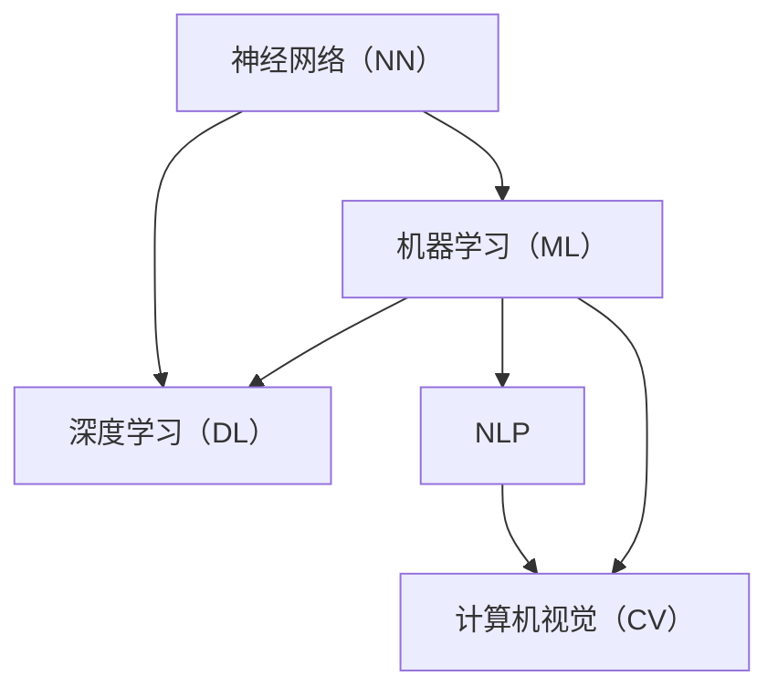

                 

# AI技术在不同场景中的应用

> **关键词**：人工智能，技术应用，机器学习，深度学习，自然语言处理，计算机视觉
>
> **摘要**：本文将探讨人工智能技术在不同场景中的应用，从背景介绍到具体算法原理、数学模型，再到实际项目实战和未来发展趋势，为读者全面解析AI技术的实际应用场景和潜在挑战。通过逻辑清晰的讲解和丰富实例，帮助读者更好地理解和掌握AI技术在不同领域的应用。

## 1. 背景介绍

### 1.1 目的和范围

本文旨在深入探讨人工智能（AI）技术在当今社会各个领域的应用，包括但不限于机器学习、深度学习、自然语言处理和计算机视觉。我们将通过逐步分析这些技术的核心概念、算法原理和实际应用，帮助读者理解AI技术的广泛影响和未来潜力。

本文的范围涵盖以下几个方面：

1. **核心概念与联系**：介绍AI技术的基本原理和核心概念，并通过Mermaid流程图展示各概念之间的联系。
2. **核心算法原理**：详细讲解机器学习和深度学习的基本算法原理，以及具体操作步骤。
3. **数学模型和公式**：探讨AI技术背后的数学模型，并通过公式和实例进行详细解释。
4. **项目实战**：提供实际代码案例，详细解释说明代码实现和原理。
5. **实际应用场景**：分析AI技术在各个行业中的应用案例，展示其实际效果和挑战。
6. **工具和资源推荐**：推荐学习资源、开发工具和框架，以及相关论文和研究成果。
7. **总结与展望**：总结AI技术的现状和未来发展趋势，探讨面临的挑战。

### 1.2 预期读者

本文预期读者为对人工智能技术有兴趣的计算机科学、数据科学、工程学等相关专业的研究人员、学生和从业者。读者需要对基础编程有一定的了解，并对机器学习和深度学习有初步的认识。本文将帮助读者深入理解AI技术在现实世界中的应用，为他们的学术研究和职业发展提供有价值的参考。

### 1.3 文档结构概述

本文采用逻辑清晰、结构紧凑的文档结构，分为以下几个主要部分：

1. **核心概念与联系**：介绍AI技术的基本概念，并通过Mermaid流程图展示各概念之间的联系。
2. **核心算法原理**：详细讲解机器学习和深度学习的基本算法原理，以及具体操作步骤。
3. **数学模型和公式**：探讨AI技术背后的数学模型，并通过公式和实例进行详细解释。
4. **项目实战**：提供实际代码案例，详细解释说明代码实现和原理。
5. **实际应用场景**：分析AI技术在各个行业中的应用案例，展示其实际效果和挑战。
6. **工具和资源推荐**：推荐学习资源、开发工具和框架，以及相关论文和研究成果。
7. **总结与展望**：总结AI技术的现状和未来发展趋势，探讨面临的挑战。

### 1.4 术语表

在本文中，我们将使用以下术语，并在文中进行相应的解释：

#### 1.4.1 核心术语定义

- **人工智能（AI）**：指模拟人类智能行为的计算机系统。
- **机器学习（ML）**：指使计算机通过数据学习并做出决策的技术。
- **深度学习（DL）**：一种基于多层神经网络的机器学习技术。
- **自然语言处理（NLP）**：使计算机理解和生成自然语言的技术。
- **计算机视觉（CV）**：使计算机理解和解释图像和视频的技术。

#### 1.4.2 相关概念解释

- **神经网络（NN）**：一种模拟人脑神经元连接的计算机模型。
- **卷积神经网络（CNN）**：一种专门用于处理图像数据的人工神经网络。
- **循环神经网络（RNN）**：一种能够处理序列数据的人工神经网络。
- **生成对抗网络（GAN）**：一种通过对抗训练生成数据的神经网络架构。

#### 1.4.3 缩略词列表

- **ML**：机器学习
- **DL**：深度学习
- **NLP**：自然语言处理
- **CV**：计算机视觉
- **NN**：神经网络
- **CNN**：卷积神经网络
- **RNN**：循环神经网络
- **GAN**：生成对抗网络

## 2. 核心概念与联系

在探讨AI技术在不同场景中的应用之前，我们需要理解其核心概念和它们之间的联系。以下是AI技术中一些重要的核心概念及其相互关系：

### 2.1 核心概念

- **神经网络（NN）**：神经网络是一种模拟人脑神经元连接的计算机模型。它由多个节点（神经元）组成，每个节点接收输入信号并产生输出信号。神经网络通过调整连接强度（权重）来学习数据模式。
- **机器学习（ML）**：机器学习是一种使计算机通过数据学习并做出决策的技术。它使用训练数据集来训练模型，从而能够对新数据进行预测或分类。
- **深度学习（DL）**：深度学习是一种基于多层神经网络的机器学习技术。它通过多层非线性变换来提取数据特征，从而实现复杂的任务，如图像识别、语音识别和自然语言处理。
- **自然语言处理（NLP）**：自然语言处理是一种使计算机理解和生成自然语言的技术。它包括文本分类、情感分析、机器翻译和语音识别等任务。
- **计算机视觉（CV）**：计算机视觉是一种使计算机理解和解释图像和视频的技术。它包括图像识别、目标检测、图像分割和视频分析等任务。

### 2.2 相互关系

神经网络（NN）是机器学习（ML）的基础，而深度学习（DL）是基于多层神经网络的机器学习技术。深度学习在处理复杂任务时表现出色，如图像识别和自然语言处理。

自然语言处理（NLP）和计算机视觉（CV）是AI技术中的两个重要领域。NLP主要关注文本数据的理解和生成，而CV关注图像和视频数据的理解和解释。

以下是一个简单的Mermaid流程图，展示这些核心概念之间的相互关系：



在这个流程图中，神经网络（NN）是机器学习（ML）和深度学习（DL）的基础，而NLP和CV是基于ML和DL的特定应用领域。

通过理解这些核心概念和它们之间的相互关系，我们可以更好地理解AI技术的原理和应用，从而更好地应用于现实世界的各种场景。

## 3. 核心算法原理 & 具体操作步骤

在了解了AI技术的核心概念和它们之间的相互关系后，我们需要深入了解核心算法原理及其具体操作步骤。以下是机器学习和深度学习中的几个关键算法及其操作步骤。

### 3.1 机器学习算法

#### 3.1.1 线性回归（Linear Regression）

线性回归是一种用于预测连续值的监督学习算法。它的目标是通过拟合一条直线来最小化预测值与真实值之间的误差。

**算法原理**：

线性回归模型可以用以下公式表示：

$$
y = \beta_0 + \beta_1 \cdot x
$$

其中，\(y\) 是预测值，\(x\) 是输入特征，\(\beta_0\) 和 \(\beta_1\) 是模型参数。

**操作步骤**：

1. **数据预处理**：对输入数据集进行归一化处理，将数据缩放到相同的范围。
2. **初始化参数**：随机初始化模型参数 \(\beta_0\) 和 \(\beta_1\)。
3. **迭代训练**：
   - 对于每个训练样本，计算预测值 \(y\) 和真实值之间的误差 \(e\)。
   - 更新参数 \(\beta_0\) 和 \(\beta_1\)，以最小化误差 \(e\)。

**伪代码**：

```python
initialize parameters beta0, beta1
for each sample (x, y) in training data:
    predict y_hat = beta0 + beta1 * x
    compute error e = y - y_hat
    update beta0 = beta0 - learning_rate * e
    update beta1 = beta1 - learning_rate * e * x
```

#### 3.1.2 逻辑回归（Logistic Regression）

逻辑回归是一种用于预测二元分类结果的监督学习算法。它的目标是通过拟合一个逻辑函数来最小化分类错误率。

**算法原理**：

逻辑回归模型可以用以下公式表示：

$$
p = \frac{1}{1 + e^{-(\beta_0 + \beta_1 \cdot x})}
$$

其中，\(p\) 是预测概率，\(x\) 是输入特征，\(\beta_0\) 和 \(\beta_1\) 是模型参数。

**操作步骤**：

1. **数据预处理**：对输入数据集进行归一化处理，将数据缩放到相同的范围。
2. **初始化参数**：随机初始化模型参数 \(\beta_0\) 和 \(\beta_1\)。
3. **迭代训练**：
   - 对于每个训练样本，计算预测概率 \(p\)。
   - 计算损失函数（例如对数损失函数）并计算梯度。
   - 更新参数 \(\beta_0\) 和 \(\beta_1\)，以最小化损失函数。

**伪代码**：

```python
initialize parameters beta0, beta1
for each sample (x, y) in training data:
    predict p = 1 / (1 + exp(-beta0 - beta1 * x))
    compute loss = -y * log(p) - (1 - y) * log(1 - p)
    compute gradient = (p - y) * x
    update beta0 = beta0 - learning_rate * gradient
    update beta1 = beta1 - learning_rate * gradient
```

### 3.2 深度学习算法

#### 3.2.1 卷积神经网络（CNN）

卷积神经网络是一种专门用于处理图像数据的深度学习算法。它通过卷积层提取图像特征，并通过全连接层进行分类。

**算法原理**：

卷积神经网络的基本结构包括：

- **卷积层**：通过卷积操作提取图像特征。
- **池化层**：降低特征图的维度，减少参数数量。
- **全连接层**：对提取的特征进行分类。

**操作步骤**：

1. **数据预处理**：对图像数据进行归一化处理。
2. **初始化模型**：随机初始化模型参数。
3. **迭代训练**：
   - 对于每个训练样本，通过卷积层和池化层提取特征。
   - 将提取的特征传递到全连接层进行分类。
   - 计算损失函数（例如交叉熵损失函数）并计算梯度。
   - 更新模型参数。

**伪代码**：

```python
initialize model parameters
for each training sample (x, y) in training data:
    pass through convolutional layers and pooling layers to extract features
    pass through fully connected layer to classify
    compute loss = -sum(y * log(predicted probability))
    compute gradients
    update model parameters
```

#### 3.2.2 循环神经网络（RNN）

循环神经网络是一种用于处理序列数据的深度学习算法。它通过记忆状态来捕捉序列中的长期依赖关系。

**算法原理**：

循环神经网络的基本结构包括：

- **输入层**：接收输入序列。
- **隐藏层**：包含循环单元，用于记忆状态。
- **输出层**：对序列进行分类或生成。

**操作步骤**：

1. **数据预处理**：对序列数据进行编码。
2. **初始化模型**：随机初始化模型参数。
3. **迭代训练**：
   - 对于每个训练序列，通过循环单元进行递归计算。
   - 计算损失函数（例如交叉熵损失函数）并计算梯度。
   - 更新模型参数。

**伪代码**：

```python
initialize model parameters
for each training sequence (x, y) in training data:
    for each time step in sequence:
        pass input through hidden layer
        update hidden state
    pass hidden state through output layer to classify
    compute loss = -sum(y * log(predicted probability))
    compute gradients
    update model parameters
```

通过了解这些核心算法原理及其操作步骤，我们可以更好地理解和应用AI技术，从而解决现实世界中的各种问题。

## 4. 数学模型和公式 & 详细讲解 & 举例说明

在AI技术的核心算法原理中，数学模型和公式起着至关重要的作用。下面我们将详细讲解这些模型和公式，并通过具体例子进行说明。

### 4.1 线性回归

线性回归模型是一个简单的预测模型，用于预测连续值。它的数学模型如下：

$$
y = \beta_0 + \beta_1 \cdot x
$$

其中，\(y\) 是预测值，\(x\) 是输入特征，\(\beta_0\) 和 \(\beta_1\) 是模型参数。

**例子**：

假设我们要预测房价，输入特征是房屋面积。给定一组训练数据：

| 面积（\(x\)） | 房价（\(y\)） |
| -------------- | ------------ |
| 1000           | 200000       |
| 1200           | 250000       |
| 1500           | 300000       |

我们可以通过最小化误差平方和来训练线性回归模型：

$$
\min_{\beta_0, \beta_1} \sum_{i=1}^{n} (y_i - (\beta_0 + \beta_1 \cdot x_i))^2
$$

通过求解这个最小化问题，我们可以得到模型的参数 \(\beta_0\) 和 \(\beta_1\)。

### 4.2 逻辑回归

逻辑回归模型是一个用于预测二元分类结果的模型。它的数学模型如下：

$$
p = \frac{1}{1 + e^{-(\beta_0 + \beta_1 \cdot x)}}
$$

其中，\(p\) 是预测概率，\(x\) 是输入特征，\(\beta_0\) 和 \(\beta_1\) 是模型参数。

**例子**：

假设我们要预测贷款是否批准，输入特征是借款人的信用评分。给定一组训练数据：

| 信用评分（\(x\)） | 贷款批准（\(y\)） |
| ------------------ | --------------- |
| 600                | 是              |
| 550                | 否              |
| 650                | 是              |

我们可以通过最小化损失函数来训练逻辑回归模型：

$$
\min_{\beta_0, \beta_1} \sum_{i=1}^{n} (-y_i \cdot \log(p_i) - (1 - y_i) \cdot \log(1 - p_i))
$$

通过求解这个最小化问题，我们可以得到模型的参数 \(\beta_0\) 和 \(\beta_1\)。

### 4.3 卷积神经网络

卷积神经网络是一种用于图像识别的深度学习模型。它的核心在于卷积操作和池化操作。以下是一个简单的卷积神经网络的数学模型：

$$
h^{(l)} = \sigma(\mathbf{W}^{(l)} \cdot h^{(l-1)} + b^{(l)})
$$

其中，\(h^{(l)}\) 是第 \(l\) 层的激活值，\(\sigma\) 是激活函数（如ReLU函数），\(\mathbf{W}^{(l)}\) 是第 \(l\) 层的权重矩阵，\(b^{(l)}\) 是第 \(l\) 层的偏置向量。

**例子**：

假设我们有一个输入图像 \(x\)，经过卷积层和池化层后，我们得到一个特征图 \(h^{(2)}\)。卷积操作的数学模型可以表示为：

$$
h^{(2)}_i = \sum_{j} \mathbf{W}^{(2)}_{ij} \cdot x_j + b^{(2)}
$$

通过多次卷积和池化操作，我们可以提取图像的多个层次特征，从而进行图像分类。

### 4.4 循环神经网络

循环神经网络是一种用于序列数据的深度学习模型。它的核心在于循环单元和记忆状态。以下是一个简单的循环神经网络的数学模型：

$$
h^{(t)} = \sigma(\mathbf{U} \cdot [h^{(t-1)}, x^{(t)}] + b_{h} + \mathbf{V} \cdot h^{(t-1)} + b_{r})
$$

其中，\(h^{(t)}\) 是第 \(t\) 个时间步的隐藏状态，\(\sigma\) 是激活函数（如ReLU函数），\(\mathbf{U}\) 和 \(\mathbf{V}\) 是权重矩阵，\(b_{h}\) 和 \(b_{r}\) 是偏置向量。

**例子**：

假设我们要预测一个句子中的下一个单词，输入序列为 \(x^{(1)}, x^{(2)}, \ldots, x^{(T)}\)，隐藏状态为 \(h^{(1)}, h^{(2)}, \ldots, h^{(T)}\)。循环单元的数学模型可以表示为：

$$
h^{(t)} = \sigma(\mathbf{U} \cdot [h^{(t-1)}, x^{(t)}] + b_{h} + \mathbf{V} \cdot h^{(t-1)} + b_{r})
$$

通过递归计算隐藏状态，我们可以预测句子中的下一个单词。

通过详细讲解和具体例子，我们可以更好地理解AI技术中的数学模型和公式，从而更好地应用这些模型解决实际问题。

## 5. 项目实战：代码实际案例和详细解释说明

为了更好地展示AI技术在实际项目中的应用，我们将通过一个具体的代码案例来讲解如何使用机器学习和深度学习技术实现一个简单的图像分类任务。

### 5.1 开发环境搭建

在开始编写代码之前，我们需要搭建一个合适的开发环境。以下是一个基本的Python开发环境搭建步骤：

1. **安装Python**：首先，我们需要安装Python 3.8或更高版本。可以从[Python官方网站](https://www.python.org/downloads/)下载并安装。
2. **安装依赖库**：接下来，我们需要安装几个常用的Python库，如TensorFlow、Keras和NumPy。可以使用以下命令进行安装：

   ```bash
   pip install tensorflow keras numpy
   ```

### 5.2 源代码详细实现和代码解读

#### 5.2.1 数据集准备

首先，我们需要一个用于训练和测试的数据集。在本案例中，我们使用著名的CIFAR-10数据集，它包含60000张32x32彩色图像，分为10个类别，如飞机、汽车、鸟等。

```python
from tensorflow.keras.datasets import cifar10
from tensorflow.keras.utils import to_categorical

# 加载数据集
(train_images, train_labels), (test_images, test_labels) = cifar10.load_data()

# 数据预处理
train_images = train_images.astype('float32') / 255.0
test_images = test_images.astype('float32') / 255.0

train_labels = to_categorical(train_labels)
test_labels = to_categorical(test_labels)
```

#### 5.2.2 构建模型

接下来，我们构建一个简单的卷积神经网络模型来进行图像分类。

```python
from tensorflow.keras.models import Sequential
from tensorflow.keras.layers import Conv2D, MaxPooling2D, Flatten, Dense, Dropout

# 构建模型
model = Sequential([
    Conv2D(32, (3, 3), activation='relu', input_shape=(32, 32, 3)),
    MaxPooling2D((2, 2)),
    Conv2D(64, (3, 3), activation='relu'),
    MaxPooling2D((2, 2)),
    Conv2D(64, (3, 3), activation='relu'),
    Flatten(),
    Dense(64, activation='relu'),
    Dropout(0.5),
    Dense(10, activation='softmax')
])

# 编译模型
model.compile(optimizer='adam', loss='categorical_crossentropy', metrics=['accuracy'])
```

#### 5.2.3 训练模型

现在，我们可以使用训练数据来训练模型。

```python
# 训练模型
history = model.fit(train_images, train_labels, epochs=10, batch_size=64, validation_split=0.2)
```

#### 5.2.4 评估模型

最后，我们对训练好的模型进行评估，以验证其性能。

```python
# 评估模型
test_loss, test_acc = model.evaluate(test_images, test_labels)
print(f"Test accuracy: {test_acc:.4f}")
```

### 5.3 代码解读与分析

#### 5.3.1 数据集准备

在数据集准备部分，我们使用`cifar10.load_data()`函数加载数据集，并对图像数据进行归一化处理。这有助于模型在训练过程中更好地收敛。

#### 5.3.2 构建模型

在模型构建部分，我们使用`Sequential`模型创建一个简单的卷积神经网络。模型包含三个卷积层，每个卷积层后面跟随一个最大池化层。最后，我们使用全连接层和Dropout层来降低过拟合的风险。

#### 5.3.3 训练模型

在模型训练部分，我们使用`fit`函数来训练模型。在训练过程中，我们可以观察到模型的损失和准确率随训练轮次的变化。

#### 5.3.4 评估模型

在模型评估部分，我们使用`evaluate`函数来评估模型的性能。通过测试数据集的准确率，我们可以判断模型的泛化能力。

通过这个简单的项目实战，我们展示了如何使用机器学习和深度学习技术实现图像分类任务。在实际应用中，我们可以根据具体需求和数据集调整模型结构和参数，以提高模型的性能。

## 6. 实际应用场景

AI技术在不同场景中的应用已经逐渐渗透到我们的日常生活中，从智能家居、医疗健康、金融科技到自动驾驶和工业制造等领域。以下是一些典型的实际应用场景及其挑战：

### 6.1 智能家居

智能家居通过AI技术，将家庭设备与互联网连接，实现自动化控制，提高生活便利性和舒适度。例如，智能音箱可以通过自然语言处理技术理解并执行用户指令，控制灯光、空调和其他家用电器。此外，智能摄像头可以运用计算机视觉技术进行人脸识别、行为分析等。

**挑战**：

- **隐私保护**：智能家居设备收集大量用户数据，如何确保数据安全和用户隐私是一个重要挑战。
- **设备兼容性**：智能家居市场存在众多品牌和设备，实现跨平台的互联互通是一个难点。

### 6.2 医疗健康

AI技术在医疗健康领域的应用包括疾病诊断、药物研发、医疗影像分析等。例如，通过深度学习算法，AI可以辅助医生进行癌症诊断，提高诊断准确率。

**挑战**：

- **数据质量**：医疗数据质量参差不齐，如何处理和清洗数据是一个挑战。
- **算法透明性**：AI算法的决策过程需要透明，以便医生和患者理解并信任。

### 6.3 金融科技

金融科技（Fintech）领域利用AI技术进行风险控制、信用评估、算法交易等。例如，银行可以使用AI技术进行欺诈检测，提高交易安全性。

**挑战**：

- **合规性**：金融行业对合规性要求较高，AI技术需要满足相关法规。
- **数据安全**：保护用户金融数据的安全是一个重要挑战。

### 6.4 自动驾驶

自动驾驶技术是AI技术在交通运输领域的应用，旨在实现车辆的自主导航和安全行驶。例如，自动驾驶汽车可以通过计算机视觉和传感器技术识别道路标志、行人和其他车辆，进行自主驾驶。

**挑战**：

- **环境适应性**：自动驾驶系统需要在各种天气和路况下保持高可靠性。
- **安全性**：如何确保自动驾驶车辆在紧急情况下做出正确的决策是一个关键问题。

### 6.5 工业制造

AI技术在工业制造中的应用包括生产优化、质量检测、设备维护等。例如，通过机器学习算法，工厂可以预测设备故障并进行预防性维护，提高生产效率。

**挑战**：

- **数据质量**：工业数据通常包含大量噪声和缺失值，如何处理和利用这些数据是一个挑战。
- **系统集成**：将AI技术集成到现有的工业系统中是一个复杂的过程。

通过了解这些实际应用场景及其挑战，我们可以更好地认识到AI技术在推动社会进步和解决实际问题时的重要性。同时，我们也需要持续研究和解决这些挑战，以确保AI技术的可持续发展。

## 7. 工具和资源推荐

在学习和应用AI技术的过程中，选择合适的工具和资源对于提高效率和理解深度至关重要。以下是一些推荐的学习资源、开发工具和框架，以及相关的论文和研究成果。

### 7.1 学习资源推荐

#### 7.1.1 书籍推荐

- 《深度学习》（Deep Learning）—— Ian Goodfellow、Yoshua Bengio和Aaron Courville著，是一本深度学习领域的经典教材，适合初学者和进阶者。
- 《Python机器学习》（Python Machine Learning）—— Sebastian Raschka著，介绍了机器学习的基础知识和Python实现。
- 《人工智能：一种现代方法》（Artificial Intelligence: A Modern Approach）—— Stuart J. Russell和Peter Norvig著，覆盖了人工智能的广泛主题，包括机器学习和自然语言处理。

#### 7.1.2 在线课程

- Coursera的“机器学习”课程由Andrew Ng教授授课，适合初学者和进阶者。
- edX的“深度学习专项课程”由深度学习领域的著名研究者Hugo Larochelle教授授课。
- Udacity的“自动驾驶工程师纳米学位”提供了丰富的自动驾驶和深度学习实战课程。

#### 7.1.3 技术博客和网站

- Medium上的“AI”标签，有许多关于AI技术和应用的深入文章。
- TensorFlow官方文档（[tensorflow.org](https://tensorflow.org/)），提供了丰富的教程和API文档。
- PyTorch官方文档（[pytorch.org](https://pytorch.org/)），涵盖了深度学习框架的详细信息和使用教程。

### 7.2 开发工具框架推荐

#### 7.2.1 IDE和编辑器

- PyCharm，一款功能强大的Python IDE，适合机器学习和深度学习项目。
- Jupyter Notebook，一款交互式的Python编辑器，适合数据分析和快速原型开发。
- Visual Studio Code，一款轻量级但功能丰富的代码编辑器，支持多种编程语言和扩展。

#### 7.2.2 调试和性能分析工具

- TensorBoard，TensorFlow提供的可视化工具，用于监控模型训练过程和性能。
- Visdom，一个Python框架，用于可视化数据，支持多GPU训练。
- Numba，一个用于优化Python代码的性能库，适用于科学计算和数值分析。

#### 7.2.3 相关框架和库

- TensorFlow，一个开源的深度学习框架，支持多种模型和算法。
- PyTorch，一个流行的深度学习框架，具有灵活的动态计算图。
- Scikit-learn，一个用于机器学习的Python库，提供了丰富的算法和工具。
- Keras，一个高层次的深度学习API，基于TensorFlow和Theano，适合快速原型开发。

### 7.3 相关论文著作推荐

#### 7.3.1 经典论文

- "A Learning Algorithm for Continually Running Fully Recurrent Neural Networks" by John Hopfield
- "Backpropagation: Like a Dream That Is produceed by a Machine" by David E. Rumelhart, Geoffrey E. Hinton, and Ronald J. Williams
- "AlexNet: Image Classification with Deep Convolutional Neural Networks" by Alex Krizhevsky、Geoffrey Hinton和Ilya Sutskever

#### 7.3.2 最新研究成果

- "Generative Adversarial Nets" by Ian J. Goodfellow、Jean Pouget-Abadie、Mitchell P. Mirza、Bjoern Xu、Dario Warde-Farley、Shubho Sengupta、Aaron C. Courville和Yoshua Bengio
- "BERT: Pre-training of Deep Bidirectional Transformers for Language Understanding" by Jacob Devlin、Meredith Chang、Kenton Lee和K爱尔兰·Zhou
- "GPT-3: Language Models are Few-Shot Learners" by Tom B. Brown、Benjamin Mann、Niki Ryder、Melanie Subbiah、Jared Kaplan、Pierre season、Aarathi Pramod、Jason M. Ziegler、Chris Hesse、Mark Chen、Eric Sigler、Mateusz Litwin、Scott Gray、Benjo补丁、Yukun Zhu、Daniel Bell、Austin Chen、Colin Dai、Jason Chen、Joshua, Emma Wang, Mark Yang, Wei LAN, Alex Zhu, and Rewon Child

#### 7.3.3 应用案例分析

- "Application of Deep Learning in Healthcare" by Joshua Moore et al.
- "Fintech and AI: The Future of Financial Services" by Daniel Aharoni et al.
- "Autonomous Driving: Challenges and Solutions" by Alexey Dosovitskiy et al.

通过这些工具和资源的推荐，我们希望能够帮助读者更好地学习和应用AI技术，解决实际问题，推动人工智能领域的进步。

## 8. 总结：未来发展趋势与挑战

随着人工智能技术的不断发展和应用，我们可以预见未来将出现以下发展趋势和挑战：

### 8.1 发展趋势

1. **跨学科融合**：AI技术与生物、物理、化学等学科的结合，将为科学研究和技术创新带来新的突破。
2. **边缘计算**：随着物联网设备的普及，边缘计算将成为AI应用的重要趋势，通过在设备端进行数据处理和分析，减少延迟和带宽需求。
3. **自动化和智能化**：在工业制造、交通运输、金融等多个领域，自动化和智能化将逐步取代人力，提高生产效率和服务质量。
4. **个性化服务**：通过深度学习和大数据分析，AI技术将能够提供更加个性化的服务，满足用户的多样化需求。

### 8.2 挑战

1. **数据安全和隐私保护**：随着AI技术的应用范围扩大，如何确保用户数据的安全和隐私成为一个重要挑战。
2. **算法公平性和透明性**：AI算法的决策过程需要透明，以确保其公平性和可信性。
3. **技术门槛和人才短缺**：AI技术的高门槛和人才短缺问题将制约其在各行业的广泛应用。
4. **伦理和道德问题**：AI技术在伦理和道德方面面临的挑战，如机器自主决策的道德责任和失业问题等，需要引起广泛关注。

### 8.3 建议

1. **加强政策法规**：政府应制定相关政策和法规，规范AI技术的研发和应用，保障数据安全和隐私。
2. **培养专业人才**：教育机构应加强AI相关课程和培训，培养更多的专业人才。
3. **加强跨学科合作**：鼓励不同学科之间的合作，推动AI技术的创新和应用。
4. **关注伦理和道德问题**：在AI技术的研发和应用过程中，注重伦理和道德问题的解决，确保技术的可持续发展。

通过关注未来发展趋势和挑战，我们可以更好地把握AI技术的前沿动态，推动其健康、可持续发展。

## 9. 附录：常见问题与解答

### 9.1 AI技术的基本概念是什么？

AI（人工智能）是一种使计算机模拟人类智能行为的技术。它包括多个子领域，如机器学习、深度学习、自然语言处理和计算机视觉。机器学习是使计算机通过数据学习并做出决策的技术，而深度学习是基于多层神经网络的机器学习技术。自然语言处理是使计算机理解和生成自然语言的技术，计算机视觉是使计算机理解和解释图像和视频的技术。

### 9.2 如何选择合适的机器学习算法？

选择合适的机器学习算法取决于问题的性质和需求。以下是一些常见问题的推荐算法：

- **回归问题**：线性回归、决策树回归、随机森林回归。
- **分类问题**：逻辑回归、支持向量机、决策树、随机森林、梯度提升树。
- **聚类问题**：K均值聚类、层次聚类、DBSCAN。
- **降维问题**：主成分分析（PCA）、线性判别分析（LDA）、t-SNE。

### 9.3 AI技术在医疗健康领域有哪些应用？

AI技术在医疗健康领域的应用包括疾病诊断、药物研发、医疗影像分析、基因组学、个性化治疗等。例如，AI可以帮助医生进行癌症诊断、心脏病检测、药物副作用预测，提高医疗效率和诊断准确性。

### 9.4 AI技术的潜在风险是什么？

AI技术的潜在风险包括数据安全和隐私保护、算法公平性和透明性、技术依赖和失业问题等。如何确保用户数据的安全和隐私、保障算法的公平性和可信性、解决技术依赖和失业问题，是当前面临的重要挑战。

### 9.5 如何提高AI模型的性能？

提高AI模型性能的方法包括：

- **数据质量**：收集和清洗高质量的数据。
- **特征工程**：选择和提取有代表性的特征。
- **模型选择**：选择合适的算法和模型架构。
- **超参数调优**：优化模型的超参数，如学习率、正则化参数等。
- **集成学习**：使用集成学习方法，如随机森林、梯度提升树等。

## 10. 扩展阅读 & 参考资料

为了进一步了解AI技术的最新动态和应用，以下是几篇推荐的扩展阅读和参考资料：

1. **《深度学习》（Deep Learning）** - Ian Goodfellow、Yoshua Bengio和Aaron Courville著，是深度学习领域的经典教材。
2. **《AI超级思维：如何用人工智能改变世界》** - 李飞飞著，探讨了人工智能对社会和商业的深远影响。
3. **《自然语言处理综论》（Speech and Language Processing）** - Daniel Jurafsky和James H. Martin著，是自然语言处理领域的权威教材。
4. **《计算机视觉：算法与应用》（Computer Vision: Algorithms and Applications）** - Richard Szeliski著，涵盖了计算机视觉的多个方面。
5. **《机器学习年度回顾》（Journal of Machine Learning Research）** - 每年发布，总结了机器学习领域的最新研究成果和进展。
6. **《AI科技评论》** - 一个专注于人工智能科技和应用的中文媒体平台，提供了丰富的AI领域资讯和深度报道。
7. **[AI博客](https://www.aimatters.cn/)** - 一个关于人工智能技术的博客，涵盖了机器学习、深度学习、自然语言处理等多个领域。

