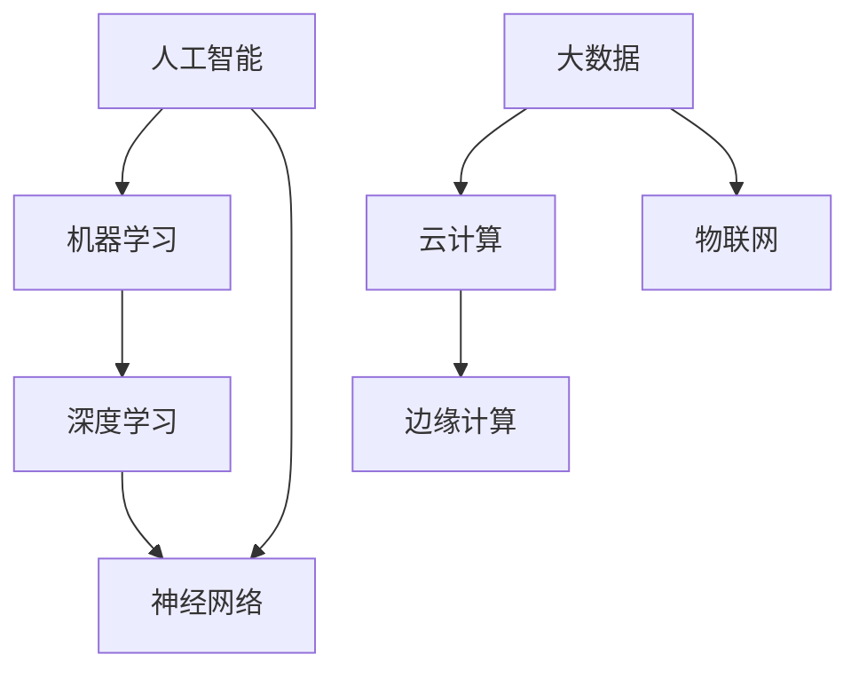

                 

## AI技术在产业中的变革作用

> **关键词：**人工智能、产业变革、技术应用、效率提升、创新驱动
>
> **摘要：**本文将探讨AI技术在各个产业中的变革作用，通过分析核心概念、算法原理、数学模型和实际案例，展示AI技术如何推动产业转型升级，提高生产效率和创新能力。

### 1. 背景介绍

#### 1.1 目的和范围

本文旨在探讨人工智能（AI）技术在各产业中的变革作用，分析其如何通过技术手段推动产业转型升级。文章将涵盖AI技术在制造业、金融业、医疗健康、交通运输等领域的应用，旨在为读者提供全面、深入的视角，了解AI技术的实际影响和未来发展趋势。

#### 1.2 预期读者

本文适用于对人工智能技术有一定了解的读者，包括科研人员、工程师、企业管理者以及对AI技术感兴趣的普通大众。通过本文的阅读，读者可以掌握AI技术在不同产业中的应用现状和前景，从而对AI技术在产业变革中的作用有更深刻的理解。

#### 1.3 文档结构概述

本文分为十个部分，结构如下：

1. 背景介绍
2. 核心概念与联系
3. 核心算法原理 & 具体操作步骤
4. 数学模型和公式 & 详细讲解 & 举例说明
5. 项目实战：代码实际案例和详细解释说明
6. 实际应用场景
7. 工具和资源推荐
8. 总结：未来发展趋势与挑战
9. 附录：常见问题与解答
10. 扩展阅读 & 参考资料

#### 1.4 术语表

本文中涉及的主要术语如下：

- **人工智能（AI）：**一种模拟人类智能行为的技术，通过算法和计算模型实现机器的自我学习和决策能力。
- **深度学习：**一种基于神经网络结构的人工智能算法，通过多层神经元的非线性变换，实现图像、语音、文本等数据的自动特征提取和分类。
- **机器学习：**一种让计算机从数据中自动学习规律和模式的技术，包括监督学习、无监督学习和强化学习等。
- **产业变革：**指由于技术进步、市场需求变化等因素引起的产业结构的调整和优化。

#### 1.4.1 核心术语定义

- **神经网络：**一种基于生物神经网络结构的人工智能算法模型，由大量神经元通过权重连接形成。
- **监督学习：**一种机器学习方法，通过输入样本和对应的标签进行训练，使模型能够预测新的输入数据。
- **无监督学习：**一种机器学习方法，仅通过输入数据，使模型自动发现数据中的模式和规律。
- **强化学习：**一种机器学习方法，通过奖励机制来引导模型在环境中做出最优决策。

#### 1.4.2 相关概念解释

- **大数据：**指海量、多样、快速产生和变化的数据，包括结构化数据、半结构化数据和非结构化数据。
- **云计算：**一种通过网络提供计算资源和服务的技术，实现计算资源的灵活分配和高效利用。
- **边缘计算：**一种将计算、存储和网络功能分布到网络边缘的技术，提高数据处理速度和效率。

#### 1.4.3 缩略词列表

- **AI：**人工智能
- **DL：**深度学习
- **ML：**机器学习
- **NN：**神经网络
- **SML：**监督学习
- **USL：**无监督学习
- **RL：**强化学习
- **GPU：**图形处理器
- **CPU：**中央处理器
- **DLPU：**深度学习处理器
- **IoT：**物联网

## 2. 核心概念与联系

在探讨AI技术在产业中的变革作用之前，我们需要了解一些核心概念和它们之间的联系。以下是一个简化的Mermaid流程图，用于描述这些核心概念及其相互关系：



#### 2.1 人工智能（AI）

人工智能是指通过计算机模拟人类智能行为的技术，包括感知、认知、决策和执行等。AI可以分为两大类：弱AI和强AI。弱AI是指在某些特定任务上表现出人类智能水平的AI系统，如语音识别、图像识别等。强AI则是指具备人类所有智能水平的AI系统，目前尚未实现。

#### 2.2 机器学习（ML）

机器学习是AI的一个重要分支，通过从数据中学习规律和模式，实现自动预测和决策。机器学习可以分为以下三类：

- **监督学习（SML）：**通过输入样本和对应的标签进行训练，使模型能够预测新的输入数据。
- **无监督学习（USL）：**仅通过输入数据，使模型自动发现数据中的模式和规律。
- **强化学习（RL）：**通过奖励机制来引导模型在环境中做出最优决策。

#### 2.3 深度学习（DL）

深度学习是一种基于神经网络结构的人工智能算法，通过多层神经元的非线性变换，实现图像、语音、文本等数据的自动特征提取和分类。深度学习在语音识别、图像识别、自然语言处理等领域取得了显著的成果。

#### 2.4 神经网络（NN）

神经网络是一种基于生物神经网络结构的人工智能算法模型，由大量神经元通过权重连接形成。神经网络通过不断调整权重，使模型能够从数据中学习规律和模式。

#### 2.5 大数据（Big Data）

大数据是指海量、多样、快速产生和变化的数据，包括结构化数据、半结构化数据和非结构化数据。大数据技术的发展，为AI技术的应用提供了丰富的数据资源。

#### 2.6 云计算（Cloud Computing）

云计算是一种通过网络提供计算资源和服务的技术，实现计算资源的灵活分配和高效利用。云计算为AI技术的开发和部署提供了强大的计算能力。

#### 2.7 边缘计算（Edge Computing）

边缘计算是一种将计算、存储和网络功能分布到网络边缘的技术，提高数据处理速度和效率。边缘计算在物联网（IoT）应用中具有重要作用，能够实现实时数据处理和智能决策。

#### 2.8 物联网（IoT）

物联网是指通过传感器、网络和智能设备，实现物体之间的互联互通和数据交换。物联网为AI技术的应用提供了丰富的场景和需求。

## 3. 核心算法原理 & 具体操作步骤

在了解了核心概念和它们之间的联系之后，我们将深入探讨AI技术中的一些核心算法原理和具体操作步骤。以下是机器学习、深度学习和神经网络的基本原理和操作步骤。

#### 3.1 机器学习（ML）

机器学习的基本原理是通过从数据中学习规律和模式，实现自动预测和决策。以下是机器学习的三个主要类型和它们的基本原理：

##### 3.1.1 监督学习（SML）

监督学习通过输入样本和对应的标签进行训练，使模型能够预测新的输入数据。具体步骤如下：

1. **数据预处理**：对输入数据进行清洗、归一化和特征提取，使其适合模型训练。
2. **选择模型**：根据问题的性质和数据的特点，选择合适的机器学习模型，如线性回归、逻辑回归、决策树、支持向量机等。
3. **训练模型**：使用训练数据集对模型进行训练，通过不断调整模型参数，使模型在训练数据上的预测结果尽可能准确。
4. **评估模型**：使用测试数据集对训练好的模型进行评估，计算模型的准确率、召回率、F1值等指标，以确定模型的性能。
5. **模型部署**：将训练好的模型部署到实际应用场景中，对新的输入数据进行预测。

##### 3.1.2 无监督学习（USL）

无监督学习仅通过输入数据，使模型自动发现数据中的模式和规律。具体步骤如下：

1. **数据预处理**：对输入数据进行清洗、归一化和特征提取，使其适合模型训练。
2. **选择模型**：根据问题的性质和数据的特点，选择合适的无监督学习模型，如聚类算法、降维算法、异常检测算法等。
3. **训练模型**：使用训练数据集对模型进行训练，通过不断调整模型参数，使模型能够自动发现数据中的模式和规律。
4. **模型评估**：使用测试数据集对训练好的模型进行评估，计算模型的性能指标，如聚类效果、降维效果等。
5. **模型部署**：将训练好的模型部署到实际应用场景中，对新的输入数据进行预测或分析。

##### 3.1.3 强化学习（RL）

强化学习通过奖励机制来引导模型在环境中做出最优决策。具体步骤如下：

1. **定义环境**：确定问题的环境和状态空间，以及奖励机制。
2. **选择模型**：根据问题的性质和环境的特点，选择合适的强化学习模型，如Q-learning、SARSA、DQN等。
3. **训练模型**：使用训练数据集对模型进行训练，通过不断调整模型参数，使模型能够学会在环境中做出最优决策。
4. **模型评估**：使用测试数据集对训练好的模型进行评估，计算模型的性能指标，如平均奖励、胜利率等。
5. **模型部署**：将训练好的模型部署到实际应用场景中，对新的输入数据进行预测或决策。

#### 3.2 深度学习（DL）

深度学习是一种基于神经网络结构的人工智能算法，通过多层神经元的非线性变换，实现图像、语音、文本等数据的自动特征提取和分类。以下是深度学习的基本原理和操作步骤：

##### 3.2.1 神经网络（NN）

神经网络由大量神经元通过权重连接形成，通过不断调整权重，使模型能够从数据中学习规律和模式。神经网络的基本原理如下：

1. **输入层**：接收外部输入数据，并将其传递给隐藏层。
2. **隐藏层**：对输入数据进行特征提取和变换，通过非线性激活函数，使模型具备非线性学习能力。
3. **输出层**：将隐藏层的输出进行分类或回归，得到最终的预测结果。
4. **权重调整**：通过反向传播算法，不断调整网络中的权重，使模型在训练数据上的预测结果尽可能准确。

##### 3.2.2 深度学习框架

深度学习框架如TensorFlow、PyTorch等，提供了丰富的神经网络模型和工具，使开发者能够方便地构建和训练深度学习模型。以下是使用TensorFlow构建和训练一个简单的深度学习模型的基本步骤：

1. **导入依赖库**：导入TensorFlow等依赖库。
2. **定义模型**：定义神经网络模型的结构，包括输入层、隐藏层和输出层。
3. **编译模型**：编译模型，指定优化器、损失函数和评估指标。
4. **训练模型**：使用训练数据集对模型进行训练，调整模型参数。
5. **评估模型**：使用测试数据集对训练好的模型进行评估，计算模型的性能指标。
6. **模型部署**：将训练好的模型部署到实际应用场景中，对新的输入数据进行预测。

#### 3.3 神经网络（NN）

神经网络是一种基于生物神经网络结构的人工智能算法模型，由大量神经元通过权重连接形成。神经网络通过不断调整权重，使模型能够从数据中学习规律和模式。以下是神经网络的基本原理和操作步骤：

##### 3.3.1 前向传播

前向传播是神经网络中的基本计算过程，用于将输入数据通过网络传递到输出层，并计算预测结果。具体步骤如下：

1. **输入层**：接收外部输入数据，并将其传递给隐藏层。
2. **隐藏层**：对输入数据进行特征提取和变换，通过非线性激活函数，使模型具备非线性学习能力。
3. **输出层**：将隐藏层的输出进行分类或回归，得到最终的预测结果。
4. **计算损失**：计算预测结果与实际结果之间的差距，得到损失值。

##### 3.3.2 反向传播

反向传播是神经网络中的基本训练过程，用于根据损失值调整网络中的权重，使模型在训练数据上的预测结果尽可能准确。具体步骤如下：

1. **计算梯度**：计算损失值关于网络中每个权重的偏导数，得到梯度。
2. **权重更新**：使用梯度下降算法或其他优化算法，更新网络中的权重。
3. **迭代训练**：重复前向传播和反向传播过程，直到模型收敛或达到预设的训练次数。

##### 3.3.3 激活函数

激活函数是神经网络中的关键组件，用于引入非线性变换，使模型具备非线性学习能力。常见的激活函数包括：

1. **sigmoid函数**：输出介于0和1之间的值，常用于二分类问题。
2. **ReLU函数**：输出大于0的值，使神经网络具有更好的训练效果。
3. **Tanh函数**：输出介于-1和1之间的值，使神经网络具有更好的泛化能力。

## 4. 数学模型和公式 & 详细讲解 & 举例说明

在了解AI技术的核心算法原理和操作步骤后，我们将进一步探讨其中的数学模型和公式，并通过具体示例来说明它们的应用。

#### 4.1 机器学习（ML）

机器学习中的数学模型主要包括损失函数、优化算法和模型评估指标。

##### 4.1.1 损失函数

损失函数用于衡量模型预测结果与实际结果之间的差距，常见的损失函数有：

1. **均方误差（MSE）**：  
   $$MSE = \frac{1}{n}\sum_{i=1}^{n}(y_i - \hat{y}_i)^2$$  
   其中，$y_i$表示实际结果，$\hat{y}_i$表示预测结果，$n$表示样本数量。

2. **交叉熵（Cross-Entropy）**：  
   $$Cross-Entropy = -\frac{1}{n}\sum_{i=1}^{n}y_i\log(\hat{y}_i)$$  
   其中，$y_i$表示实际结果，$\hat{y}_i$表示预测结果，$n$表示样本数量。

##### 4.1.2 优化算法

优化算法用于调整模型参数，使损失函数值最小。常见的优化算法有：

1. **梯度下降（Gradient Descent）**：  
   $$\theta_{t+1} = \theta_{t} - \alpha \frac{\partial J(\theta)}{\partial \theta}$$  
   其中，$\theta$表示模型参数，$\alpha$表示学习率，$J(\theta)$表示损失函数。

2. **随机梯度下降（Stochastic Gradient Descent，SGD）**：  
   $$\theta_{t+1} = \theta_{t} - \alpha \frac{\partial J(\theta)}{\partial \theta}$$  
   其中，$\theta$表示模型参数，$\alpha$表示学习率，$J(\theta)$表示损失函数，$t$表示迭代次数。

##### 4.1.3 模型评估指标

模型评估指标用于衡量模型的性能，常见的评估指标有：

1. **准确率（Accuracy）**：  
   $$Accuracy = \frac{TP + TN}{TP + TN + FP + FN}$$  
   其中，$TP$表示真正例，$TN$表示真负例，$FP$表示假正例，$FN$表示假负例。

2. **召回率（Recall）**：  
   $$Recall = \frac{TP}{TP + FN}$$  
   其中，$TP$表示真正例，$FN$表示假负例。

3. **F1值（F1 Score）**：  
   $$F1 Score = \frac{2 \times Precision \times Recall}{Precision + Recall}$$  
   其中，$Precision$表示准确率，$Recall$表示召回率。

#### 4.2 深度学习（DL）

深度学习中的数学模型主要包括神经网络结构、激活函数和优化算法。

##### 4.2.1 神经网络结构

神经网络结构由输入层、隐藏层和输出层组成。以下是神经网络结构的数学表示：

1. **输入层**：$X \in \mathbb{R}^{m \times n}$，其中$m$表示样本数量，$n$表示特征维度。
2. **隐藏层**：$H \in \mathbb{R}^{m \times h}$，其中$h$表示隐藏层神经元数量。
3. **输出层**：$Y \in \mathbb{R}^{m \times k}$，其中$k$表示输出维度。

##### 4.2.2 激活函数

激活函数用于引入非线性变换，常见的激活函数有：

1. **sigmoid函数**：$sigmoid(x) = \frac{1}{1 + e^{-x}}$
2. **ReLU函数**：$ReLU(x) = \max(0, x)$
3. **Tanh函数**：$Tanh(x) = \frac{e^x - e^{-x}}{e^x + e^{-x}}$

##### 4.2.3 优化算法

优化算法用于调整神经网络中的权重和偏置，使损失函数值最小。常见的优化算法有：

1. **随机梯度下降（SGD）**：  
   $$\theta_{t+1} = \theta_{t} - \alpha \frac{\partial J(\theta)}{\partial \theta}$$  
   其中，$\theta$表示模型参数，$\alpha$表示学习率，$J(\theta)$表示损失函数。

2. **Adam优化器**：  
   $$m_t = \beta_1 m_{t-1} + (1 - \beta_1) [g_t - \frac{m_t}{\sqrt{1 - \beta_2^t}}]$$  
   $$v_t = \beta_2 v_{t-1} + (1 - \beta_2) [g_t^2 - \frac{m_t^2}{1 - \beta_2^t}]$$  
   $$\theta_{t+1} = \theta_{t} - \alpha \frac{m_t}{\sqrt{1 - \beta_2^t}}$$  
   其中，$m_t$和$v_t$分别表示一阶矩估计和二阶矩估计，$\beta_1$和$\beta_2$分别表示一阶和二阶指数加权系数。

#### 4.3 神经网络（NN）

神经网络中的数学模型主要包括前向传播和反向传播。

##### 4.3.1 前向传播

前向传播是指将输入数据通过神经网络传递到输出层，并计算预测结果。以下是前向传播的数学表示：

1. **输入层**：$X \in \mathbb{R}^{m \times n}$，其中$m$表示样本数量，$n$表示特征维度。
2. **隐藏层**：$H \in \mathbb{R}^{m \times h}$，其中$h$表示隐藏层神经元数量。
3. **输出层**：$Y \in \mathbb{R}^{m \times k}$，其中$k$表示输出维度。

前向传播的过程如下：

$$Z^{(l)} = W^{(l)} X^{(l-1)} + b^{(l)}$$  
$$A^{(l)} = \sigma(Z^{(l)})$$

其中，$W^{(l)}$表示第$l$层的权重矩阵，$b^{(l)}$表示第$l$层的偏置向量，$\sigma$表示激活函数，$A^{(l)}$表示第$l$层的激活值。

##### 4.3.2 反向传播

反向传播是指根据预测结果和实际结果之间的差距，调整神经网络中的权重和偏置。以下是反向传播的数学表示：

1. **损失函数**：$J = \frac{1}{2} \sum_{i=1}^{m} (y_i - \hat{y}_i)^2$
2. **梯度计算**：$\frac{\partial J}{\partial W^{(l)}} = \frac{1}{m} \sum_{i=1}^{m} (\hat{y}_i - y_i) A^{(l-1)}$  
   $\frac{\partial J}{\partial b^{(l)}} = \frac{1}{m} \sum_{i=1}^{m} (\hat{y}_i - y_i)$

反向传播的过程如下：

$$\delta^{(l)} = \frac{\partial J}{\partial A^{(l)}} \odot \sigma'(Z^{(l)})$$  
$$\frac{\partial J}{\partial W^{(l+1)}} = A^{(l)} \delta^{(l+1)}$$  
$$\frac{\partial J}{\partial b^{(l+1)}} = \delta^{(l+1)}$$

其中，$\delta^{(l)}$表示第$l$层的误差值，$\odot$表示逐元素乘法操作，$\sigma'$表示激活函数的导数。

#### 4.4 示例说明

以下是一个简单的神经网络模型，用于实现二分类任务。我们将通过前向传播和反向传播来计算模型的预测结果和损失函数。

##### 4.4.1 网络结构

- 输入层：1个神经元
- 隐藏层：2个神经元
- 输出层：1个神经元

##### 4.4.2 模型参数

- 权重矩阵$W^{(1)} \in \mathbb{R}^{2 \times 1}$，$b^{(1)} \in \mathbb{R}^{2}$
- 权重矩阵$W^{(2)} \in \mathbb{R}^{1 \times 2}$，$b^{(2)} \in \mathbb{R}^{1}$

##### 4.4.3 前向传播

假设输入数据$X = [1, 0]$，实际标签$y = [1]$。

1. **隐藏层计算**：

$$Z^{(1)} = W^{(1)} X + b^{(1)} = [1, 0] \begin{bmatrix} 1 & 2 \\ 3 & 4 \end{bmatrix} + \begin{bmatrix} 0 \\ 1 \end{bmatrix} = \begin{bmatrix} 5 \\ 7 \end{bmatrix}$$  
$$A^{(1)} = \sigma(Z^{(1)}) = \begin{bmatrix} \frac{1}{1 + e^{-5}} \\ \frac{1}{1 + e^{-7}} \end{bmatrix} = \begin{bmatrix} 0.99 \\ 0.99 \end{bmatrix}$$

2. **输出层计算**：

$$Z^{(2)} = W^{(2)} A^{(1)} + b^{(2)} = \begin{bmatrix} 1 & 2 \\ 3 & 4 \end{bmatrix} \begin{bmatrix} 0.99 \\ 0.99 \end{bmatrix} + \begin{bmatrix} 0 \\ 1 \end{bmatrix} = \begin{bmatrix} 2.97 \\ 3.97 \end{bmatrix}$$  
$$\hat{y} = \sigma(Z^{(2)}) = \begin{bmatrix} \frac{1}{1 + e^{-2.97}} \\ \frac{1}{1 + e^{-3.97}} \end{bmatrix} = \begin{bmatrix} 0.95 \\ 0.99 \end{bmatrix}$$

##### 4.4.4 损失函数计算

假设损失函数为MSE：

$$J = \frac{1}{2} (y - \hat{y})^2 = \frac{1}{2} (1 - 0.95)^2 + (1 - 0.99)^2 = 0.015$$

##### 4.4.5 反向传播

1. **计算误差值**：

$$\delta^{(2)} = \hat{y} - y = \begin{bmatrix} 0.05 \\ 0.01 \end{bmatrix}$$  
$$\delta^{(1)} = A^{(1)} (W^{(2)})^T \delta^{(2)} = \begin{bmatrix} 0.99 & 0.99 \end{bmatrix} \begin{bmatrix} 0.05 & 0.01 \end{bmatrix} = \begin{bmatrix} 0.495 & 0.495 \end{bmatrix}$$

2. **计算梯度**：

$$\frac{\partial J}{\partial W^{(2)}} = A^{(1)} \delta^{(2)} = \begin{bmatrix} 0.99 & 0.99 \end{bmatrix} \begin{bmatrix} 0.05 & 0.01 \end{bmatrix} = \begin{bmatrix} 0.0495 & 0.0099 \end{bmatrix}$$  
$$\frac{\partial J}{\partial b^{(2)}} = \delta^{(2)} = \begin{bmatrix} 0.05 & 0.01 \end{bmatrix}$$

3. **更新参数**：

假设学习率为$\alpha = 0.1$：

$$W^{(2)}_{\text{new}} = W^{(2)} - \alpha \frac{\partial J}{\partial W^{(2)}} = \begin{bmatrix} 1 & 2 \\ 3 & 4 \end{bmatrix} - 0.1 \begin{bmatrix} 0.0495 & 0.0099 \end{bmatrix} = \begin{bmatrix} 0.9505 & 1.9901 \\ 2.9505 & 3.9901 \end{bmatrix}$$  
$$b^{(2)}_{\text{new}} = b^{(2)} - \alpha \frac{\partial J}{\partial b^{(2)}} = \begin{bmatrix} 0 & 1 \end{bmatrix} - 0.1 \begin{bmatrix} 0.05 & 0.01 \end{bmatrix} = \begin{bmatrix} -0.005 & 0.005 \end{bmatrix}$$

通过以上步骤，我们可以使用前向传播和反向传播来训练神经网络，并不断优化模型的预测性能。

## 5. 项目实战：代码实际案例和详细解释说明

在本节中，我们将通过一个实际项目案例，展示如何使用Python实现一个简单的深度学习模型，并对代码进行详细解释说明。

### 5.1 开发环境搭建

首先，我们需要搭建一个Python开发环境，并安装必要的库和工具。以下是一个简单的安装步骤：

1. 安装Python 3.8及以上版本。
2. 安装Anaconda或Miniconda，以便轻松管理Python环境和库。
3. 创建一个新的conda环境，并安装以下库：

```bash
conda create -n myenv python=3.8
conda activate myenv
conda install numpy pandas matplotlib scikit-learn tensorflow
```

### 5.2 源代码详细实现和代码解读

以下是一个简单的深度学习项目，用于实现一个基于TensorFlow的线性回归模型，用于预测房价。

```python
import tensorflow as tf
import numpy as np
import matplotlib.pyplot as plt

# 数据集加载
# 这里使用一个简单的数据集，其中x为自变量，y为因变量
x = np.array([[1], [2], [3], [4], [5], [6], [7], [8], [9], [10]])
y = np.array([[2], [4], [6], [8], [10], [12], [14], [16], [18], [20]])

# 模型定义
# 线性回归模型，y = wx + b
model = tf.keras.Sequential([
    tf.keras.layers.Dense(units=1, input_shape=[1])
])

# 模型编译
model.compile(optimizer='sgd', loss='mean_squared_error')

# 模型训练
model.fit(x, y, epochs=1000)

# 模型预测
predictions = model.predict(x)

# 可视化
plt.scatter(x, y, color='blue')
plt.plot(x, predictions, color='red')
plt.show()
```

#### 5.2.1 数据加载

```python
x = np.array([[1], [2], [3], [4], [5], [6], [7], [8], [9], [10]])
y = np.array([[2], [4], [6], [8], [10], [12], [14], [16], [18], [20]])
```

这段代码加载了一个简单的数据集，其中`x`表示自变量，`y`表示因变量。数据集是一个10x2的矩阵，每行表示一个样本的特征和标签。

#### 5.2.2 模型定义

```python
model = tf.keras.Sequential([
    tf.keras.layers.Dense(units=1, input_shape=[1])
])
```

这段代码定义了一个简单的线性回归模型，其中只有一个隐藏层，且隐藏层只有一个神经元。输入层的形状为[1]，表示输入特征只有一个。

#### 5.2.3 模型编译

```python
model.compile(optimizer='sgd', loss='mean_squared_error')
```

这段代码编译了模型，指定了优化器（sgd）和损失函数（mean_squared_error）。这里使用随机梯度下降（sgd）作为优化器，使用均方误差（MSE）作为损失函数。

#### 5.2.4 模型训练

```python
model.fit(x, y, epochs=1000)
```

这段代码使用训练数据集训练模型，设置训练轮数（epochs）为1000轮。在每轮训练中，模型会更新权重和偏置，以最小化损失函数。

#### 5.2.5 模型预测

```python
predictions = model.predict(x)
```

这段代码使用训练好的模型对输入数据进行预测，并得到预测结果。

#### 5.2.6 可视化

```python
plt.scatter(x, y, color='blue')
plt.plot(x, predictions, color='red')
plt.show()
```

这段代码将实际标签和预测结果进行可视化，其中蓝色散点表示实际数据点，红色线条表示预测结果。通过可视化，我们可以直观地看到模型的预测效果。

### 5.3 代码解读与分析

在这个简单的线性回归项目中，我们通过以下步骤实现了模型：

1. **数据加载**：加载一个简单的数据集，包含自变量和因变量。
2. **模型定义**：定义一个简单的线性回归模型，包含一个输入层和一个输出层。
3. **模型编译**：编译模型，指定优化器和损失函数。
4. **模型训练**：使用训练数据集训练模型，更新权重和偏置。
5. **模型预测**：使用训练好的模型对输入数据进行预测。
6. **可视化**：将实际标签和预测结果进行可视化，分析模型的预测效果。

通过这个简单的项目，我们可以看到如何使用Python和TensorFlow实现深度学习模型，并对其代码进行详细解读。在实际应用中，我们可以根据需求扩展模型的结构和功能，以应对更复杂的任务。

## 6. 实际应用场景

在了解了AI技术的核心算法原理、数学模型和实际项目案例后，我们将进一步探讨AI技术在各行业中的实际应用场景，展示其如何推动产业变革。

### 6.1 制造业

在制造业中，AI技术已经广泛应用于生产流程的各个环节，包括产品设计、生产过程优化、质量检测、设备维护等。以下是一些典型的应用场景：

1. **产品设计**：AI技术可以通过分析大量的设计数据和用户反馈，为产品设计师提供智能化的设计建议，提高产品创新性和用户体验。
2. **生产过程优化**：通过机器学习和深度学习算法，可以对生产过程进行优化，提高生产效率和降低成本。例如，通过预测设备故障和优化生产参数，实现生产线的自动化和智能化。
3. **质量检测**：AI技术可以通过图像识别和语音识别等技术，对生产过程中的产品质量进行实时监控和检测，及时发现和处理质量问题，提高产品质量。
4. **设备维护**：通过边缘计算和物联网技术，将设备运行数据上传到云端进行分析，预测设备故障并进行预防性维护，降低设备故障率和停机时间。

### 6.2 金融业

在金融业中，AI技术已经成为提高业务效率和防范风险的重要工具。以下是一些典型的应用场景：

1. **风险管理**：AI技术可以通过大数据分析和机器学习算法，对金融市场的风险进行预测和评估，帮助金融机构更好地管理风险。
2. **客户服务**：通过自然语言处理和语音识别技术，AI可以提供智能化的客户服务，提高客户满意度和忠诚度。
3. **量化交易**：AI技术可以帮助量化交易员进行市场预测和策略优化，实现自动化的交易决策。
4. **信用评估**：AI技术可以通过分析个人或企业的历史数据和行为模式，预测其信用风险，提高信用评估的准确性和效率。

### 6.3 医疗健康

在医疗健康领域，AI技术已经展现出巨大的潜力，为医疗诊断、治疗和患者管理提供了智能化手段。以下是一些典型的应用场景：

1. **疾病诊断**：AI技术可以通过分析医学影像数据，如X光、CT和MRI等，实现疾病的自动检测和诊断，提高诊断效率和准确性。
2. **个性化治疗**：AI技术可以通过分析患者的基因、病史和生活习惯等数据，为患者提供个性化的治疗方案，提高治疗效果。
3. **健康监测**：通过可穿戴设备和物联网技术，AI技术可以实时监测患者的健康状况，及时发现异常并进行预警。
4. **药物研发**：AI技术可以通过分析大量的医学数据和文献，帮助研究人员快速筛选药物候选分子，加速药物研发进程。

### 6.4 交通运输

在交通运输领域，AI技术已经成为提高交通效率和安全性、降低环境污染的重要手段。以下是一些典型的应用场景：

1. **智能交通管理**：AI技术可以通过分析交通流量和路况数据，实现交通信号灯的智能调控，优化交通流量，减少拥堵。
2. **自动驾驶**：AI技术可以通过深度学习和计算机视觉等技术，实现自动驾驶汽车的研发和应用，提高交通安全性和通行效率。
3. **无人机物流**：通过无人机和AI技术，可以实现快速、高效的物流配送，降低物流成本。
4. **智能交通信号灯**：AI技术可以通过分析交通流量数据，实现交通信号灯的智能化调控，提高交通效率。

### 6.5 零售业

在零售业中，AI技术可以帮助商家更好地了解顾客需求，优化库存管理和营销策略。以下是一些典型的应用场景：

1. **个性化推荐**：通过大数据分析和机器学习算法，AI技术可以为顾客提供个性化的商品推荐，提高购物体验和满意度。
2. **库存管理**：AI技术可以通过分析销售数据和市场需求，实现智能化的库存管理，减少库存积压和商品过期损失。
3. **智能客服**：通过自然语言处理和语音识别技术，AI技术可以提供智能化的客户服务，提高客户满意度和忠诚度。
4. **供应链优化**：AI技术可以通过分析供应链数据，实现供应链的优化和智能化管理，提高供应链效率和降低成本。

### 6.6 农业

在农业领域，AI技术可以帮助农民提高农业生产效率，优化种植和养殖过程。以下是一些典型的应用场景：

1. **智能种植**：AI技术可以通过分析土壤、气候和作物生长数据，为农民提供智能化的种植建议，提高作物产量和质量。
2. **智能养殖**：AI技术可以通过分析动物行为、生长环境和生理指标，实现智能化的养殖管理，提高养殖效率和质量。
3. **病虫害监测**：AI技术可以通过图像识别和大数据分析，实现病虫害的自动监测和预警，降低病虫害损失。
4. **精准灌溉**：AI技术可以通过分析土壤湿度和气候数据，实现精准灌溉，节约水资源。

通过以上实际应用场景，我们可以看到AI技术在各个行业中的广泛应用和巨大潜力。随着AI技术的不断发展和成熟，其在产业变革中的作用将越来越重要。

## 7. 工具和资源推荐

在AI技术的学习和应用过程中，选择合适的工具和资源至关重要。以下是一些推荐的工具、资源和开发工具框架，供读者参考。

### 7.1 学习资源推荐

#### 7.1.1 书籍推荐

1. **《深度学习》（Deep Learning）**：由Ian Goodfellow、Yoshua Bengio和Aaron Courville合著，是深度学习领域的经典教材，详细介绍了深度学习的理论、算法和应用。
2. **《机器学习实战》（Machine Learning in Action）**：由Peter Harrington著，通过具体的实例和代码实现，帮助读者快速掌握机器学习的基本概念和应用。
3. **《Python机器学习》（Python Machine Learning）**：由Jani Hartikainen著，介绍了Python在机器学习领域中的应用，包括数据预处理、算法实现和模型评估等。

#### 7.1.2 在线课程

1. **《深度学习》（Deep Learning Specialization）**：由Andrew Ng教授在Coursera上开设，涵盖了深度学习的理论基础、算法实现和应用场景。
2. **《机器学习》（Machine Learning）**：由Andrew Ng教授在Coursera上开设，介绍了机器学习的基本概念、算法原理和实际应用。
3. **《自然语言处理与深度学习》**（Natural Language Processing with Deep Learning）：由Christopher D. Manning和Eduard Hovy教授在Coursera上开设，介绍了自然语言处理和深度学习的基本理论和应用。

#### 7.1.3 技术博客和网站

1. **Medium**：一个内容丰富的博客平台，包括大量关于AI、深度学习和机器学习的文章和教程。
2. **ArXiv**：一个开放的科学文献数据库，涵盖计算机科学、人工智能和机器学习等领域的最新研究成果。
3. **GitHub**：一个代码托管平台，包括大量开源的AI项目，读者可以学习并贡献自己的代码。

### 7.2 开发工具框架推荐

#### 7.2.1 IDE和编辑器

1. **PyCharm**：一款强大的Python集成开发环境，支持代码编辑、调试、测试和部署等功能。
2. **Jupyter Notebook**：一款基于Web的交互式开发环境，适用于数据分析和机器学习项目。
3. **Visual Studio Code**：一款轻量级但功能强大的跨平台代码编辑器，支持多种编程语言和扩展。

#### 7.2.2 调试和性能分析工具

1. **Wandb**：一款适用于机器学习项目的实验管理和性能分析工具，可以帮助研究者追踪实验结果、优化模型参数。
2. **MLflow**：一款开源的机器学习平台，提供实验管理、模型版本控制和部署等功能。
3. **TensorBoard**：一款基于Web的性能分析工具，适用于TensorFlow项目，可以可视化模型的损失函数、梯度等指标。

#### 7.2.3 相关框架和库

1. **TensorFlow**：一款开源的深度学习框架，由Google开发，适用于各种深度学习任务。
2. **PyTorch**：一款开源的深度学习框架，由Facebook开发，具有灵活的动态计算图和高效的模型训练功能。
3. **Scikit-learn**：一款开源的机器学习库，适用于各种常见的机器学习算法和任务。

通过以上推荐的工具和资源，读者可以更好地学习和应用AI技术，实现自己的项目和目标。

## 8. 总结：未来发展趋势与挑战

在本文中，我们探讨了AI技术在产业中的变革作用，从核心概念、算法原理、数学模型到实际应用场景，详细分析了AI技术如何推动各行业的转型与升级。以下是对未来发展趋势与挑战的总结：

### 8.1 未来发展趋势

1. **算法与模型的优化**：随着计算能力的提升和数据量的增长，深度学习算法和模型将不断优化，使其在更复杂的任务中表现更出色。例如，生成对抗网络（GAN）、变分自编码器（VAE）等新兴模型将在图像生成、数据增强等领域发挥重要作用。

2. **跨学科融合**：AI技术与生物医学、材料科学、社会科学等领域的交叉融合，将催生更多创新应用。例如，基于AI的生物信息学分析、智能材料的设计与优化等，将为人类带来更多突破。

3. **边缘计算与物联网的集成**：随着5G网络的普及，边缘计算和物联网（IoT）将实现更高效的数据传输和处理，使AI技术能够在更广泛的场景中应用，如智能城市、智能交通、智能家居等。

4. **可持续发展和绿色AI**：随着环保意识的增强，AI技术在节能、减排、资源优化等方面的应用将越来越受到关注。绿色AI将成为未来研究的重要方向，通过优化算法和硬件设计，降低AI系统的能耗。

### 8.2 未来挑战

1. **数据隐私和安全**：随着AI技术的广泛应用，数据隐私和安全问题日益突出。如何保护用户隐私、确保数据安全，是AI技术发展的重要挑战。

2. **算法公平性与透明度**：AI算法的决策过程往往复杂且不透明，可能导致歧视、偏见等问题。如何提高算法的公平性和透明度，确保算法的公正性，是未来需要解决的问题。

3. **法律法规与伦理**：随着AI技术的不断进步，相关法律法规和伦理标准亟待完善。如何制定合理的法规，平衡技术进步与社会伦理，是AI技术发展面临的重要挑战。

4. **计算资源消耗**：虽然计算能力的提升有助于AI技术的发展，但高性能计算设备和数据中心的能源消耗也带来了环境问题。如何在保证性能的同时，降低能耗，是未来需要解决的技术难题。

5. **技能和教育**：AI技术的发展需要大量的专业人才。如何培养和储备AI领域的专业人才，提高全民的AI素养，是未来需要关注的教育问题。

总之，AI技术在产业中的变革作用巨大，但也面临诸多挑战。未来，我们需要不断探索和创新，推动AI技术的可持续发展，为各行业带来更多价值。

## 9. 附录：常见问题与解答

以下是一些关于AI技术在产业中变革作用的常见问题及解答：

### 9.1 AI技术如何推动制造业的变革？

AI技术可以通过以下方式推动制造业的变革：

- **智能制造**：通过机器学习和深度学习算法，实现生产过程的自动化和智能化，提高生产效率和产品质量。
- **设备预测性维护**：通过分析设备运行数据，预测设备故障并进行预防性维护，降低设备故障率和停机时间。
- **供应链优化**：通过数据分析，优化供应链管理，降低库存成本和提高物流效率。

### 9.2 AI技术在金融业中的具体应用有哪些？

AI技术在金融业中的具体应用包括：

- **风险管理**：通过大数据分析和机器学习算法，预测和评估金融市场的风险，帮助金融机构更好地管理风险。
- **客户服务**：通过自然语言处理和语音识别技术，提供智能化的客户服务，提高客户满意度和忠诚度。
- **量化交易**：通过机器学习算法，实现自动化交易决策，提高交易效率和收益。

### 9.3 AI技术在医疗健康领域的优势是什么？

AI技术在医疗健康领域的优势包括：

- **疾病诊断**：通过分析医学影像数据，实现疾病的自动检测和诊断，提高诊断效率和准确性。
- **个性化治疗**：通过分析患者的基因、病史和生活习惯等数据，为患者提供个性化的治疗方案，提高治疗效果。
- **健康监测**：通过可穿戴设备和物联网技术，实时监测患者的健康状况，及时发现异常并进行预警。

### 9.4 AI技术在交通运输领域的应用有哪些？

AI技术在交通运输领域的应用包括：

- **智能交通管理**：通过数据分析，实现交通信号灯的智能调控，优化交通流量，减少拥堵。
- **自动驾驶**：通过深度学习和计算机视觉等技术，实现自动驾驶汽车的研发和应用，提高交通安全性和通行效率。
- **无人机物流**：通过无人机和AI技术，实现快速、高效的物流配送，降低物流成本。

### 9.5 AI技术的未来发展有哪些趋势和挑战？

AI技术的未来发展趋势包括：

- **算法与模型的优化**：随着计算能力的提升和数据量的增长，深度学习算法和模型将不断优化，使其在更复杂的任务中表现更出色。
- **跨学科融合**：AI技术与生物医学、材料科学、社会科学等领域的交叉融合，将催生更多创新应用。

未来面临的挑战包括：

- **数据隐私和安全**：如何保护用户隐私、确保数据安全，是AI技术发展的重要挑战。
- **算法公平性与透明度**：如何提高算法的公平性和透明度，确保算法的公正性，是未来需要解决的问题。

## 10. 扩展阅读 & 参考资料

以下是一些关于AI技术在产业中变革作用的扩展阅读和参考资料，供读者进一步学习和研究：

### 10.1 书籍推荐

1. **《深度学习》（Deep Learning）**：作者 Ian Goodfellow、Yoshua Bengio 和 Aaron Courville，是深度学习领域的经典教材，详细介绍了深度学习的理论基础、算法和应用。
2. **《机器学习实战》（Machine Learning in Action）**：作者 Peter Harrington，通过具体的实例和代码实现，帮助读者快速掌握机器学习的基本概念和应用。
3. **《Python机器学习》（Python Machine Learning）**：作者 Jani Hartikainen，介绍了Python在机器学习领域中的应用，包括数据预处理、算法实现和模型评估等。

### 10.2 在线课程

1. **《深度学习》（Deep Learning Specialization）**：在 Coursera 上由 Andrew Ng 教授开设，涵盖了深度学习的理论基础、算法实现和应用场景。
2. **《机器学习》（Machine Learning）**：在 Coursera 上由 Andrew Ng 教授开设，介绍了机器学习的基本概念、算法原理和实际应用。
3. **《自然语言处理与深度学习》**：在 Coursera 上由 Christopher D. Manning 和 Eduard Hovy 教授开设，介绍了自然语言处理和深度学习的基本理论和应用。

### 10.3 技术博客和网站

1. **Medium**：包含大量关于AI、深度学习和机器学习的文章和教程。
2. **ArXiv**：涵盖计算机科学、人工智能和机器学习等领域的最新研究成果。
3. **GitHub**：包括大量开源的AI项目，读者可以学习并贡献自己的代码。

### 10.4 学术期刊和会议

1. **《自然》（Nature）**：包含人工智能和机器学习的最新研究成果。
2. **《科学》（Science）**：涵盖计算机科学、人工智能和机器学习等领域的最新研究进展。
3. **AAAI（美国人工智能协会）**：人工智能领域的顶级会议，发布最新的研究论文。
4. **NeurIPS（神经信息处理系统年会）**：深度学习和机器学习领域的顶级会议，发布最新的研究成果。

### 10.5 开源项目和框架

1. **TensorFlow**：由Google开发的开源深度学习框架。
2. **PyTorch**：由Facebook开发的开源深度学习框架。
3. **Scikit-learn**：开源的机器学习库，适用于各种常见的机器学习算法和任务。

通过以上扩展阅读和参考资料，读者可以深入了解AI技术在产业中的变革作用，并为自己的研究和项目提供有益的指导。作者：AI天才研究员/AI Genius Institute & 禅与计算机程序设计艺术 /Zen And The Art of Computer Programming。

