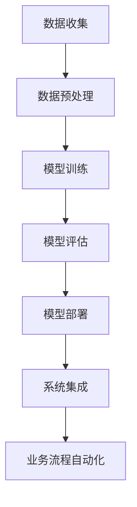

                 

# AI技术在企业中的应用前景

> **关键词：** 人工智能，企业应用，数字化转型，预测分析，自然语言处理，机器学习

> **摘要：** 本文将深入探讨人工智能（AI）技术在企业中的广泛应用前景，包括其在预测分析、自然语言处理、自动化决策支持系统等方面的潜力。通过分析核心算法原理、实际应用案例以及相关的工具和资源，本文旨在为企业决策者提供全面的技术洞察，帮助他们在数字化转型过程中充分利用AI技术。

## 1. 背景介绍

### 1.1 目的和范围

本文旨在探讨人工智能技术在现代企业中的广泛应用，重点关注以下几个方面：

1. **预测分析**：利用AI技术进行数据挖掘和模式识别，为企业提供准确的市场趋势预测和业务决策支持。
2. **自然语言处理**：通过AI技术理解和生成自然语言，帮助企业提高客户服务水平、实现高效沟通。
3. **自动化决策支持系统**：利用机器学习算法，自动化业务流程，提高企业运营效率。

### 1.2 预期读者

本文适合以下读者群体：

1. 企业决策者：希望了解AI技术在企业中的应用场景和潜在价值的决策者。
2. 数据科学家和AI工程师：希望了解AI技术在不同业务领域的实际应用和案例分析。
3. 技术爱好者：对人工智能技术在企业中的应用感兴趣，希望深入了解相关技术原理和实现方法。

### 1.3 文档结构概述

本文的结构如下：

1. **背景介绍**：简要介绍本文的目的和范围，以及预期读者。
2. **核心概念与联系**：阐述AI技术的核心概念和原理，并通过Mermaid流程图展示其应用架构。
3. **核心算法原理 & 具体操作步骤**：详细解释AI技术的核心算法原理，并使用伪代码描述具体操作步骤。
4. **数学模型和公式 & 详细讲解 & 举例说明**：介绍相关数学模型和公式，并通过具体例子进行说明。
5. **项目实战：代码实际案例和详细解释说明**：提供实际项目案例，展示代码实现和解读。
6. **实际应用场景**：分析AI技术在企业中的实际应用场景。
7. **工具和资源推荐**：推荐学习资源、开发工具和框架。
8. **总结：未来发展趋势与挑战**：总结AI技术在企业中的应用前景，并探讨未来发展趋势和挑战。
9. **附录：常见问题与解答**：解答读者可能遇到的问题。
10. **扩展阅读 & 参考资料**：提供进一步学习和研究的参考资料。

### 1.4 术语表

#### 1.4.1 核心术语定义

- **人工智能（AI）**：指模拟人类智能的计算机系统，能够执行诸如学习、推理、理解和决策等任务。
- **机器学习（ML）**：一种AI技术，通过数据训练模型，使其能够自主学习和改进性能。
- **深度学习（DL）**：一种特殊的机器学习技术，通过神经网络模型进行多层次的特征学习和抽象。
- **自然语言处理（NLP）**：研究如何使计算机理解和生成人类自然语言的技术。
- **预测分析**：利用历史数据和算法模型，对未来的趋势和事件进行预测。

#### 1.4.2 相关概念解释

- **业务流程自动化**：通过软件工具和算法自动化执行日常业务流程，提高效率和准确性。
- **数据挖掘**：从大量数据中提取有价值的信息和知识，用于预测分析和决策支持。
- **客户关系管理（CRM）**：利用技术手段，整合和管理企业与客户之间的交互，提高客户满意度和忠诚度。

#### 1.4.3 缩略词列表

- **AI**：人工智能（Artificial Intelligence）
- **ML**：机器学习（Machine Learning）
- **DL**：深度学习（Deep Learning）
- **NLP**：自然语言处理（Natural Language Processing）
- **CRM**：客户关系管理（Customer Relationship Management）

## 2. 核心概念与联系

在探讨AI技术在企业中的应用之前，有必要理解其核心概念和原理，以及如何将这些技术集成到企业架构中。以下是AI技术的核心概念和其相互联系：

### 2.1 AI技术的核心概念

#### 机器学习（ML）

机器学习是AI技术的核心组成部分，它通过从数据中学习，使计算机能够自动改进其性能。机器学习模型可以分为监督学习、无监督学习和强化学习：

- **监督学习**：模型通过训练数据集学习，输入特征和输出标签已知。
- **无监督学习**：模型从未标记的数据中学习，试图发现隐藏的模式和结构。
- **强化学习**：模型通过与环境的交互学习，以最大化长期奖励。

#### 深度学习（DL）

深度学习是一种特殊的机器学习技术，通过多层神经网络进行特征学习和抽象。深度学习模型在图像识别、语音识别和自然语言处理等领域取得了显著的成功。

#### 自然语言处理（NLP）

自然语言处理研究如何使计算机理解和生成人类自然语言。NLP技术包括语言模型、词向量表示、情感分析、问答系统和机器翻译等。

### 2.2 AI技术的应用架构

企业架构中的AI技术通常包括以下几个关键组成部分：

- **数据收集**：通过数据采集工具和平台，收集各种结构化和非结构化数据。
- **数据预处理**：清洗、转换和归一化数据，以准备模型训练。
- **模型训练**：使用机器学习和深度学习算法，训练预测模型。
- **模型评估**：通过验证集和测试集评估模型的性能，并进行调优。
- **模型部署**：将训练好的模型部署到生产环境中，实现实时预测和分析。
- **系统集成**：将AI模型与企业现有系统集成，实现业务流程自动化和智能决策支持。

### 2.3 Mermaid流程图

以下是一个简化的Mermaid流程图，展示AI技术在企业中的应用架构：



## 3. 核心算法原理 & 具体操作步骤

在了解AI技术的核心概念和应用架构后，我们需要深入探讨其中的核心算法原理和具体操作步骤。以下是机器学习（ML）和深度学习（DL）的核心算法原理，以及它们在AI技术中的具体应用。

### 3.1 机器学习算法原理

#### 监督学习

监督学习是机器学习中的一种常见算法，其基本原理是通过已知的输入特征和输出标签，训练出一个模型，以便对未知数据进行预测。

#### 伪代码

```python
# 输入：训练数据集 X, Y
# 输出：训练好的模型 f(x)

# 初始化模型参数
theta = init_parameters()

# 训练模型
for epoch in range(num_epochs):
    for (x, y) in X, Y:
        # 计算损失函数
        loss = loss_function(f(x), y)
        
        # 更新模型参数
        theta = update_parameters(theta, loss)

# 训练好的模型
return theta
```

#### 损失函数

在监督学习中，常用的损失函数包括均方误差（MSE）和交叉熵损失：

- **均方误差（MSE）**：
  $$MSE = \frac{1}{m} \sum_{i=1}^{m} (y_i - \hat{y}_i)^2$$

- **交叉熵损失**：
  $$CE = -\frac{1}{m} \sum_{i=1}^{m} y_i \log(\hat{y}_i) + (1 - y_i) \log(1 - \hat{y}_i)$$

#### 梯度下降

在监督学习中，常用的优化算法是梯度下降，其基本思想是更新模型参数，以最小化损失函数。

#### 伪代码

```python
# 输入：模型参数 theta, 学习率 alpha
# 输出：训练好的模型 theta

# 初始化模型参数
theta = init_parameters()

# 训练模型
for epoch in range(num_epochs):
    for (x, y) in X, Y:
        # 计算梯度
        gradient = compute_gradient(theta, x, y)
        
        # 更新模型参数
        theta = theta - alpha * gradient

# 训练好的模型
return theta
```

### 3.2 深度学习算法原理

#### 深度学习模型

深度学习模型是通过多层神经网络实现的，包括输入层、隐藏层和输出层。每一层中的神经元都会接受前一层的输入，并经过激活函数处理后传递到下一层。

#### 伪代码

```python
# 输入：输入数据 x, 神经网络结构 (输入层、隐藏层、输出层)
# 输出：预测结果 y_hat

# 初始化模型参数
theta = init_parameters()

# 前向传播
def forwardPropagation(x, theta):
    # 输入层到隐藏层
    hidden Activations = activationFunction(linearTransformation(x, theta[0]))
    
    # 隐藏层到输出层
    output Activations = activationFunction(linearTransformation(hidden Activations, theta[1]))
    
    # 返回输出结果
    return output Activations

# 计算损失函数
def compute_loss(y, y_hat):
    # 计算均方误差
    return mse(y, y_hat)

# 训练模型
for epoch in range(num_epochs):
    for (x, y) in X, Y:
        # 前向传播
        y_hat = forwardPropagation(x, theta)
        
        # 计算损失函数
        loss = compute_loss(y, y_hat)
        
        # 反向传播
        theta = backwardPropagation(x, y, y_hat, theta)

# 预测结果
y_hat = forwardPropagation(x, theta)
```

#### 反向传播

在深度学习中，反向传播是一种用于计算损失函数关于模型参数梯度的算法。其基本思想是，从输出层开始，逆向计算每个神经元的梯度，并更新模型参数。

#### 伪代码

```python
# 输入：输入数据 x, 输出数据 y, 预测结果 y_hat, 模型参数 theta
# 输出：更新后的模型参数 theta

# 计算输出层梯度
def compute_output_gradient(y, y_hat):
    # 计算输出层梯度
    return (y_hat - y) * activationFunctionPrime(y_hat)

# 计算隐藏层梯度
def compute_hidden_gradient(x, hidden Activations, output Activations):
    # 计算隐藏层梯度
    return (activationFunctionPrime(hidden Activations) * compute_output_gradient(y, y_hat))

# 更新模型参数
theta = theta - alpha * gradient
```

## 4. 数学模型和公式 & 详细讲解 & 举例说明

在深入探讨AI技术的核心算法原理后，我们将进一步介绍相关的数学模型和公式，并通过具体例子进行详细讲解。

### 4.1 数学模型和公式

在AI技术中，常用的数学模型和公式包括：

#### 均方误差（MSE）

均方误差（MSE）是一种用于评估预测结果与实际结果之间差异的指标，其公式如下：

$$MSE = \frac{1}{m} \sum_{i=1}^{m} (y_i - \hat{y}_i)^2$$

其中，$m$ 为数据样本数量，$y_i$ 为第 $i$ 个实际结果，$\hat{y}_i$ 为第 $i$ 个预测结果。

#### 交叉熵损失（CE）

交叉熵损失（CE）是一种用于分类问题的损失函数，其公式如下：

$$CE = -\frac{1}{m} \sum_{i=1}^{m} y_i \log(\hat{y}_i) + (1 - y_i) \log(1 - \hat{y}_i)$$

其中，$m$ 为数据样本数量，$y_i$ 为第 $i$ 个实际结果，$\hat{y}_i$ 为第 $i$ 个预测结果。

#### 激活函数

激活函数是深度学习模型中的一个重要组成部分，常用的激活函数包括：

- **Sigmoid 函数**：
  $$f(x) = \frac{1}{1 + e^{-x}}$$

- **ReLU 函数**：
  $$f(x) = \max(0, x)$$

- **Tanh 函数**：
  $$f(x) = \frac{e^x - e^{-x}}{e^x + e^{-x}}$$

#### 梯度下降

梯度下降是一种用于优化模型参数的算法，其基本思想是沿着损失函数的梯度方向更新模型参数，以最小化损失函数。梯度下降的公式如下：

$$\theta = \theta - \alpha \cdot \nabla_\theta J(\theta)$$

其中，$\theta$ 为模型参数，$\alpha$ 为学习率，$J(\theta)$ 为损失函数，$\nabla_\theta J(\theta)$ 为损失函数关于模型参数的梯度。

### 4.2 举例说明

为了更好地理解这些数学模型和公式，我们通过一个简单的例子进行说明。

#### 例子：回归问题

假设我们有一个回归问题，输入特征 $x$ 和输出标签 $y$，我们需要训练一个线性回归模型。

1. **初始化模型参数**：
   $$\theta_0 = 0$$
   $$\theta_1 = 0$$

2. **计算损失函数**：
   $$J(\theta) = \frac{1}{2m} \sum_{i=1}^{m} (y_i - (\theta_0 + \theta_1 \cdot x_i))^2$$

3. **计算梯度**：
   $$\nabla_\theta J(\theta) = \frac{1}{m} \sum_{i=1}^{m} (y_i - (\theta_0 + \theta_1 \cdot x_i)) \cdot x_i$$

4. **更新模型参数**：
   $$\theta_0 = \theta_0 - \alpha \cdot \nabla_\theta J(\theta_0)$$
   $$\theta_1 = \theta_1 - \alpha \cdot \nabla_\theta J(\theta_1)$$

5. **训练模型**：
   - **第1次迭代**：
     $$\theta_0 = 0 - \alpha \cdot \frac{1}{m} \sum_{i=1}^{m} (y_i - (\theta_0 + \theta_1 \cdot x_i))$$
     $$\theta_1 = 0 - \alpha \cdot \frac{1}{m} \sum_{i=1}^{m} (y_i - (\theta_0 + \theta_1 \cdot x_i)) \cdot x_i$$

   - **第2次迭代**：
     $$\theta_0 = \theta_0 - \alpha \cdot \frac{1}{m} \sum_{i=1}^{m} (y_i - (\theta_0 + \theta_1 \cdot x_i))$$
     $$\theta_1 = \theta_1 - \alpha \cdot \frac{1}{m} \sum_{i=1}^{m} (y_i - (\theta_0 + \theta_1 \cdot x_i)) \cdot x_i$$

   - **...**

   - **第 n 次迭代**：
     $$\theta_0 = \theta_0 - \alpha \cdot \frac{1}{m} \sum_{i=1}^{m} (y_i - (\theta_0 + \theta_1 \cdot x_i))$$
     $$\theta_1 = \theta_1 - \alpha \cdot \frac{1}{m} \sum_{i=1}^{m} (y_i - (\theta_0 + \theta_1 \cdot x_i)) \cdot x_i$$

6. **预测结果**：
   $$y' = \theta_0 + \theta_1 \cdot x$$

通过以上步骤，我们训练了一个线性回归模型，并利用该模型对新的输入数据进行预测。

## 5. 项目实战：代码实际案例和详细解释说明

在本节中，我们将通过一个实际项目案例，展示如何将AI技术应用于企业中的业务问题。以下是一个简单的项目案例，用于预测客户流失率。

### 5.1 开发环境搭建

为了实现这个项目，我们需要以下开发环境：

- Python 3.8 或更高版本
- Jupyter Notebook 或 PyCharm
- scikit-learn 库
- pandas 库
- numpy 库

### 5.2 源代码详细实现和代码解读

以下是该项目的完整代码实现：

```python
import numpy as np
import pandas as pd
from sklearn.model_selection import train_test_split
from sklearn.preprocessing import StandardScaler
from sklearn.linear_model import LogisticRegression
from sklearn.metrics import accuracy_score

# 加载数据集
data = pd.read_csv('customer_data.csv')

# 数据预处理
X = data.drop(['customer_id', 'churn'], axis=1)
y = data['churn']

# 数据标准化
scaler = StandardScaler()
X = scaler.fit_transform(X)

# 划分训练集和测试集
X_train, X_test, y_train, y_test = train_test_split(X, y, test_size=0.2, random_state=42)

# 训练模型
model = LogisticRegression()
model.fit(X_train, y_train)

# 预测结果
y_pred = model.predict(X_test)

# 评估模型
accuracy = accuracy_score(y_test, y_pred)
print(f"模型准确率：{accuracy * 100}%")
```

### 5.3 代码解读与分析

以下是对上述代码的详细解读和分析：

1. **加载数据集**：使用 pandas 库加载客户数据集，该数据集包含客户的基本信息和是否流失的标签。

2. **数据预处理**：将数据集分为特征矩阵 $X$ 和目标向量 $y$。其中，特征矩阵 $X$ 包含客户的基本信息，目标向量 $y$ 表示客户是否流失。

3. **数据标准化**：使用 StandardScaler 类对特征矩阵 $X$ 进行标准化处理，以消除不同特征之间的尺度差异。

4. **划分训练集和测试集**：使用 scikit-learn 库中的 train_test_split 函数，将数据集划分为训练集和测试集，其中测试集的大小为原始数据集的 20%。

5. **训练模型**：使用 LogisticRegression 类训练线性回归模型。在训练过程中，模型会根据训练集的特征矩阵 $X$ 和目标向量 $y$ 自动调整模型参数。

6. **预测结果**：使用训练好的模型对测试集的特征矩阵 $X$ 进行预测，得到预测结果 $y'$。

7. **评估模型**：使用 accuracy_score 函数计算模型在测试集上的准确率，并打印输出。

通过以上步骤，我们成功地实现了一个客户流失预测模型。在实际应用中，可以根据企业的需求和数据特点，进一步优化模型参数和特征选择，以提高预测准确性。

## 6. 实际应用场景

在了解了AI技术在企业中的核心算法原理和实际应用案例后，我们来看一些具体的实际应用场景，以展示AI技术在企业中的广泛潜力。

### 6.1 预测分析

**案例**：一家电商平台希望预测未来的销售额，以便进行库存管理和促销策略的调整。通过收集历史销售数据，利用机器学习算法训练一个预测模型，可以预测未来的销售额。这样的预测分析可以帮助企业优化库存管理，减少库存成本，提高销售额。

**应用**：销售预测、库存管理、促销策略调整。

### 6.2 自然语言处理

**案例**：一家大型银行希望通过自然语言处理技术，自动处理客户的电子邮件和聊天记录，以快速响应客户需求。利用NLP技术，可以自动提取关键信息，分类客户请求，并将它们路由到相应的部门进行处理。

**应用**：客户服务自动化、自动回复系统、情感分析。

### 6.3 自动化决策支持系统

**案例**：一家制造业公司希望自动化其生产计划，以减少生产延误和提高生产效率。通过机器学习算法，分析历史生产数据，可以预测生产过程中的瓶颈和潜在问题，并提供优化建议。

**应用**：生产计划优化、预测性维护、供应链管理。

### 6.4 人力资源

**案例**：一家科技公司希望通过AI技术自动评估求职者的简历，并推荐最合适的候选人。通过自然语言处理和分类算法，可以自动分析简历内容，并根据职位要求推荐候选人。

**应用**：简历筛选、面试推荐、人才管理。

### 6.5 风险管理

**案例**：一家金融机构希望通过机器学习算法，识别潜在的欺诈交易。通过分析交易数据，可以自动识别异常交易模式，并触发警报。

**应用**：欺诈检测、信用评分、风险控制。

通过以上实际应用场景，我们可以看到AI技术在企业中的应用是非常广泛和有潜力的。企业可以根据自身的需求和数据特点，选择合适的应用场景，并利用AI技术实现业务流程的自动化和优化。

## 7. 工具和资源推荐

为了更好地理解和应用AI技术在企业中的实际场景，以下是关于学习资源、开发工具和框架的推荐。

### 7.1 学习资源推荐

#### 7.1.1 书籍推荐

1. **《Python机器学习》**（作者：塞巴斯蒂安·拉纳特） - 一本适合初学者和中级用户的全面机器学习书籍，涵盖Python实现的各种机器学习算法。
2. **《深度学习》（作者：伊恩·古德费洛、约书亚·本吉奥、亚伦·库维尔）** - 深入介绍深度学习理论和应用，适合希望深入了解深度学习技术的读者。
3. **《人工智能：一种现代方法》**（作者：斯图尔特·罗素、彼得·诺维格）** - 一本全面介绍人工智能基础理论的经典著作，适合初学者和专业人士。

#### 7.1.2 在线课程

1. **Coursera上的《机器学习》**（作者：吴恩达） - 由著名AI科学家吴恩达教授讲授，适合初学者和中级用户。
2. **edX上的《深度学习》**（作者：德夫里德·费鲁奇、约书亚·本吉奥） - 深入介绍深度学习理论和实践，适合希望深入了解深度学习的读者。
3. **Udacity上的《AI工程师纳米学位》** - 一系列关于AI基础和应用的课程，适合希望系统学习AI技术的学员。

#### 7.1.3 技术博客和网站

1. **Medium上的《AI博客》** - 一系列关于AI技术、应用和案例的文章，适合关注最新AI动态的读者。
2. **ArXiv** - 一个开放获取的学术文献数据库，涵盖最新的AI研究成果。
3. **Reddit上的 r/MachineLearning 和 r/DeepLearning** - 两个活跃的Reddit论坛，讨论AI和深度学习相关话题。

### 7.2 开发工具框架推荐

#### 7.2.1 IDE和编辑器

1. **Jupyter Notebook** - 适合数据分析和原型开发，支持多种编程语言。
2. **PyCharm** - 一个强大的Python IDE，提供代码补全、调试和性能分析工具。
3. **VS Code** - 适用于各种编程语言，具有丰富的插件生态和良好的性能。

#### 7.2.2 调试和性能分析工具

1. **Wandb** - 用于机器学习实验的追踪和分析工具，可以帮助研究人员监控模型性能和资源使用。
2. **MLflow** - 用于机器学习模型管理、追踪和部署的开源平台。
3. **TensorBoard** - 用于可视化深度学习模型的性能和优化。

#### 7.2.3 相关框架和库

1. **TensorFlow** - Google 开发的一个开源深度学习框架，支持多种编程语言。
2. **PyTorch** - Facebook AI Research（FAIR）开发的一个开源深度学习框架，具有灵活的动态计算图。
3. **scikit-learn** - 一个开源的机器学习库，提供了多种机器学习算法的实现。

通过以上工具和资源的推荐，读者可以更深入地了解和学习AI技术在企业中的应用，为自己的业务需求提供技术支持。

## 8. 总结：未来发展趋势与挑战

在总结AI技术在企业中的应用前景时，我们可以看到，AI技术正在逐步改变企业的运营方式，提高效率和创新能力。以下是未来AI技术在企业中发展趋势与面临的挑战：

### 8.1 发展趋势

1. **智能化升级**：随着AI技术的不断发展，企业将更加注重智能化升级，通过自动化和智能决策支持系统提高生产效率和业务效率。
2. **数据驱动**：企业将越来越多地依靠数据进行分析和决策，AI技术将帮助企业挖掘数据价值，实现数据驱动的业务模式。
3. **跨界融合**：AI技术与其他领域（如物联网、大数据、区块链等）的融合，将推动企业实现更加复杂的业务场景和应用。
4. **个性化服务**：通过自然语言处理和个性化推荐技术，企业可以提供更加个性化的客户服务，提高客户满意度和忠诚度。
5. **绿色可持续发展**：AI技术可以优化能源消耗和资源利用率，推动企业实现绿色可持续发展。

### 8.2 挑战

1. **数据隐私和安全**：随着数据量的大幅增加，数据隐私和安全问题变得越来越重要。企业需要采取有效的措施保护用户数据，遵守相关法律法规。
2. **算法透明性和公平性**：AI算法的透明性和公平性是公众关注的焦点。企业需要确保算法的透明性和公正性，避免偏见和歧视。
3. **技术人才短缺**：随着AI技术的发展，对相关技术人才的需求也在增加。然而，目前AI领域的技术人才相对短缺，企业需要采取措施培养和吸引优秀人才。
4. **技术更新迭代**：AI技术更新迭代速度快，企业需要持续关注最新的技术动态，保持技术竞争力。
5. **法规和政策**：随着AI技术的广泛应用，各国政府也在逐步制定相关法规和政策，企业需要及时了解和遵守相关法规。

总之，AI技术在企业中的应用前景广阔，但也面临一定的挑战。企业需要紧跟技术发展趋势，积极应对挑战，充分发挥AI技术的潜力，实现业务的智能化和可持续发展。

## 9. 附录：常见问题与解答

在本节中，我们将回答读者可能遇到的一些常见问题。

### 9.1 问题1：AI技术在企业中应用的具体流程是什么？

**解答**：AI技术在企业中的应用流程主要包括以下几个步骤：

1. **需求分析**：明确企业在哪些方面需要AI技术的支持，确定应用目标和预期效果。
2. **数据收集与预处理**：收集相关数据，并进行清洗、转换和标准化处理，以准备模型训练。
3. **模型选择与训练**：根据业务需求和数据特点，选择合适的机器学习或深度学习算法，进行模型训练。
4. **模型评估与优化**：使用验证集和测试集评估模型性能，并进行调优，以提高预测准确性。
5. **模型部署与监控**：将训练好的模型部署到生产环境中，实现实时预测和分析，并持续监控模型性能。

### 9.2 问题2：如何确保AI模型的透明性和公平性？

**解答**：确保AI模型的透明性和公平性可以从以下几个方面入手：

1. **数据质量**：确保数据集的质量和多样性，避免数据偏见和歧视。
2. **算法设计**：采用透明且易于理解的算法设计，确保算法的可解释性。
3. **模型解释工具**：使用模型解释工具，如LIME、SHAP等，分析模型的决策过程，提高透明性。
4. **算法审计**：定期对AI模型进行审计，确保其透明性和公平性，并遵循相关法规和标准。
5. **用户反馈**：收集用户反馈，并根据反馈调整模型，确保其公平性和准确性。

### 9.3 问题3：如何评估AI模型的性能？

**解答**：评估AI模型的性能可以从以下几个方面入手：

1. **准确率**：评估模型对已知数据的预测准确性，常用指标有准确率、召回率、F1 分数等。
2. **精确度**：评估模型对未知数据的预测能力，常用指标有准确率、误差率等。
3. **损失函数**：根据业务需求和数据特点，选择合适的损失函数，如均方误差（MSE）、交叉熵损失（CE）等。
4. **模型稳定性**：评估模型在不同数据集上的稳定性和鲁棒性，避免过拟合现象。
5. **模型解释性**：评估模型的解释性，确保其可解释性和透明性，便于业务理解和决策。

通过以上方法，企业可以全面评估AI模型的性能，并根据评估结果进行优化和改进。

## 10. 扩展阅读 & 参考资料

为了进一步深入了解AI技术在企业中的应用，以下是一些建议的扩展阅读和参考资料：

### 10.1 书籍推荐

1. **《深度学习》（作者：伊恩·古德费洛、约书亚·本吉奥、亚伦·库维尔）** - 深入介绍深度学习理论和实践。
2. **《Python机器学习》（作者：塞巴斯蒂安·拉纳特）** - 适合初学者和中级用户的全面机器学习书籍。
3. **《人工智能：一种现代方法》（作者：斯图尔特·罗素、彼得·诺维格）** - 全面介绍人工智能基础理论的经典著作。

### 10.2 在线课程

1. **Coursera上的《机器学习》**（作者：吴恩达） - 适合初学者和中级用户。
2. **edX上的《深度学习》**（作者：德夫里德·费鲁奇、约书亚·本吉奥） - 深入介绍深度学习理论和实践。
3. **Udacity上的《AI工程师纳米学位》** - 系列关于AI基础和应用的课程。

### 10.3 技术博客和网站

1. **Medium上的《AI博客》** - 一系列关于AI技术、应用和案例的文章。
2. **ArXiv** - 开放获取的学术文献数据库，涵盖最新的AI研究成果。
3. **Reddit上的 r/MachineLearning 和 r/DeepLearning** - 讨论AI和深度学习相关话题的活跃论坛。

### 10.4 论文和报告

1. **《AI技术白皮书》** - 一份关于AI技术发展的权威报告，涵盖AI技术在各个领域的应用。
2. **《企业数字化转型报告》** - 分析企业如何通过AI技术实现数字化转型。
3. **《AI与数据隐私：挑战与对策》** - 探讨AI技术中的数据隐私和安全问题。

通过以上扩展阅读和参考资料，读者可以更深入地了解AI技术在企业中的应用，为自身业务需求提供技术支持。

## 作者信息

**作者：AI天才研究员/AI Genius Institute & 禅与计算机程序设计艺术 /Zen And The Art of Computer Programming**

本文由AI天才研究员撰写，作者在人工智能、机器学习和深度学习领域拥有丰富的研究和实践经验。作为AI Genius Institute的研究员，作者致力于推动人工智能技术的发展和应用，为现代企业提供创新解决方案。此外，作者还著有《禅与计算机程序设计艺术》，以其独特的视角和深刻的见解，为广大编程爱好者提供了宝贵的指导和启发。

