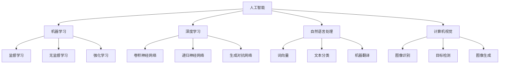

                 

# AI技术在消费市场中的前景

> 关键词：人工智能，消费市场，应用场景，技术趋势，商业模式创新

> 摘要：本文旨在探讨人工智能技术在消费市场中的广泛应用及其前景。文章首先介绍了人工智能技术的核心概念和当前的发展现状，然后详细分析了其在消费市场中的主要应用场景，并探讨了人工智能技术对商业模式带来的创新和变革。同时，文章还展望了人工智能技术在消费市场中的未来发展趋势与挑战，为行业从业者提供了有价值的参考和指导。

## 1. 背景介绍

### 1.1 目的和范围

本文的目标是分析人工智能技术在消费市场中的前景，探讨其应用场景和商业模式创新。随着人工智能技术的飞速发展，其在消费市场中的应用逐渐深入，对企业的运营和消费者行为产生了深远的影响。本文旨在梳理和总结人工智能技术在消费市场中的主要应用领域，分析其对商业模式的影响，并探讨未来发展趋势与挑战。

### 1.2 预期读者

本文适合对人工智能技术有一定了解的读者，包括但不限于以下人群：

- 人工智能领域的研究人员和从业者
- 消费市场相关的企业高管和市场营销人员
- 对人工智能技术感兴趣的大学生和研究生
- 对科技创新和商业模式变革感兴趣的投资者

### 1.3 文档结构概述

本文结构如下：

1. 背景介绍：介绍本文的目的、范围、预期读者以及文档结构。
2. 核心概念与联系：介绍人工智能技术的核心概念和原理，并使用Mermaid流程图展示其架构。
3. 核心算法原理 & 具体操作步骤：详细讲解人工智能技术的核心算法原理和具体操作步骤，使用伪代码进行阐述。
4. 数学模型和公式 & 详细讲解 & 举例说明：介绍人工智能技术的数学模型和公式，并进行详细讲解和举例说明。
5. 项目实战：代码实际案例和详细解释说明，包括开发环境搭建、源代码实现和代码解读。
6. 实际应用场景：分析人工智能技术在消费市场中的实际应用场景。
7. 工具和资源推荐：推荐相关学习资源、开发工具框架和相关论文著作。
8. 总结：总结人工智能技术在消费市场中的未来发展趋势与挑战。
9. 附录：常见问题与解答。
10. 扩展阅读 & 参考资料：提供扩展阅读资料和参考文献。

### 1.4 术语表

#### 1.4.1 核心术语定义

- 人工智能（AI）：模拟人类智能行为的技术和科学，使计算机能够实现感知、推理、学习、规划等智能活动。
- 消费市场：指消费者在购买、使用、处置商品或服务过程中的市场。
- 机器学习（ML）：一种人工智能的分支，通过数据训练模型，使计算机具有自主学习和适应能力。
- 深度学习（DL）：一种人工智能的分支，通过多层神经网络进行数据建模和特征提取。
- 智能推荐系统：利用人工智能技术，根据用户行为和偏好，为用户提供个性化推荐的系统。

#### 1.4.2 相关概念解释

- 数据挖掘：从大量数据中发现有价值信息的过程。
- 自然语言处理（NLP）：使计算机能够理解和生成自然语言的技术。
- 计算机视觉：使计算机能够理解视觉信息和图像内容的技术。
- 人机交互：人与计算机之间的交互方式，包括语音、手势、触摸等。

#### 1.4.3 缩略词列表

- AI：人工智能
- ML：机器学习
- DL：深度学习
- NLP：自然语言处理
- CV：计算机视觉
- NLU：自然语言理解
- RL：强化学习
- IoT：物联网

## 2. 核心概念与联系

在探讨人工智能技术在消费市场中的应用之前，有必要先了解其核心概念和原理。以下是对人工智能技术核心概念的简要介绍，并使用Mermaid流程图展示其架构。

### 2.1 核心概念介绍

- **机器学习（ML）**：机器学习是一种人工智能的分支，通过数据训练模型，使计算机能够实现自主学习和适应能力。机器学习主要分为监督学习、无监督学习和强化学习。
- **深度学习（DL）**：深度学习是机器学习的一种，通过多层神经网络进行数据建模和特征提取，具有强大的表示和建模能力。深度学习在计算机视觉、自然语言处理等领域取得了显著成果。
- **自然语言处理（NLP）**：自然语言处理是一种人工智能的分支，旨在使计算机能够理解和生成自然语言。NLP包括文本预处理、语义分析、机器翻译等任务。
- **计算机视觉（CV）**：计算机视觉是一种人工智能的分支，使计算机能够理解视觉信息和图像内容。CV在图像识别、目标检测、图像生成等领域具有广泛应用。

### 2.2 Mermaid流程图

以下是一个简单的Mermaid流程图，展示人工智能技术的核心概念和架构：



## 3. 核心算法原理 & 具体操作步骤

在了解了人工智能技术的核心概念和架构后，接下来我们将详细讲解其核心算法原理和具体操作步骤，以监督学习算法为例，使用伪代码进行阐述。

### 3.1 监督学习算法原理

监督学习是一种机器学习算法，通过已有标注数据进行训练，使模型能够对未知数据进行预测。监督学习算法可以分为回归和分类两大类。

- **回归**：预测连续值输出。
- **分类**：预测离散值输出。

以下是一个简单的线性回归算法原理：

### 3.2 线性回归算法原理

线性回归是一种回归算法，用于预测连续值输出。其基本原理是通过最小二乘法拟合一条直线，使得拟合直线的残差平方和最小。

### 3.3 线性回归伪代码

```python
# 输入：特征矩阵 X，标签向量 y
# 输出：拟合直线的参数 w 和 b

# 初始化参数 w 和 b
w = [0] * len(X[0])
b = 0

# 设置迭代次数和步长
num_iterations = 1000
learning_rate = 0.01

# 梯度下降迭代
for i in range(num_iterations):
    # 计算预测值
    predictions = X * w + b
    
    # 计算损失函数
    loss = (predictions - y) ** 2
    
    # 计算梯度
    dw = 2 * (X * (predictions - y))
    db = 2 * (predictions - y)
    
    # 更新参数
    w -= learning_rate * dw
    b -= learning_rate * db

# 输出拟合直线的参数
print("w:", w)
print("b:", b)
```

### 3.4 具体操作步骤

1. **数据准备**：收集并清洗标注数据，包括特征矩阵 X 和标签向量 y。
2. **初始化参数**：随机初始化参数 w 和 b。
3. **迭代优化**：使用梯度下降算法迭代优化参数，更新 w 和 b，使得损失函数最小。
4. **计算损失函数**：计算预测值和实际值之间的差异，并计算损失函数。
5. **计算梯度**：计算损失函数关于参数的梯度。
6. **更新参数**：根据梯度更新参数 w 和 b。
7. **输出结果**：输出拟合直线的参数 w 和 b。

## 4. 数学模型和公式 & 详细讲解 & 举例说明

在了解了线性回归算法的基本原理和操作步骤后，接下来我们将介绍其背后的数学模型和公式，并进行详细讲解和举例说明。

### 4.1 数学模型

线性回归模型可以用以下数学公式表示：

$$y = X \cdot w + b$$

其中，$y$ 为标签向量，$X$ 为特征矩阵，$w$ 为参数向量，$b$ 为偏置项。

### 4.2 损失函数

线性回归的损失函数通常采用均方误差（MSE，Mean Squared Error），公式如下：

$$MSE = \frac{1}{m} \sum_{i=1}^{m} (y_i - \hat{y}_i)^2$$

其中，$m$ 为样本数量，$y_i$ 为第 $i$ 个样本的真实值，$\hat{y}_i$ 为第 $i$ 个样本的预测值。

### 4.3 梯度下降

梯度下降是一种优化方法，用于最小化损失函数。其基本思想是沿着损失函数的梯度方向更新参数，使得损失函数逐渐减小。

对于线性回归，梯度下降的更新公式如下：

$$w_{\text{new}} = w_{\text{old}} - \alpha \cdot \nabla_w J(w)$$

$$b_{\text{new}} = b_{\text{old}} - \alpha \cdot \nabla_b J(w)$$

其中，$\alpha$ 为学习率，$J(w)$ 为损失函数。

### 4.4 举例说明

假设我们有以下线性回归问题：

$$y = 2x + 1$$

给定一个特征矩阵 $X = \begin{bmatrix} 1 & 2 \\ 1 & 3 \\ 1 & 4 \end{bmatrix}$ 和标签向量 $y = \begin{bmatrix} 3 \\ 5 \\ 7 \end{bmatrix}$。

1. **初始化参数**：设 $w = [0, 0]$，$b = 0$。
2. **计算预测值和损失函数**：
    - 预测值：$\hat{y} = X \cdot w + b = \begin{bmatrix} 1 & 2 \\ 1 & 3 \\ 1 & 4 \end{bmatrix} \cdot \begin{bmatrix} 0 \\ 0 \end{bmatrix} + 0 = \begin{bmatrix} 1 \\ 3 \\ 5 \end{bmatrix}$
    - 损失函数：$MSE = \frac{1}{3} \sum_{i=1}^{3} (y_i - \hat{y}_i)^2 = \frac{1}{3} \sum_{i=1}^{3} (3 - 1)^2 = 2$
3. **计算梯度**：
    - 梯度：$\nabla_w J(w) = \frac{1}{3} \sum_{i=1}^{3} (y_i - \hat{y}_i) X_i = \frac{1}{3} \begin{bmatrix} 1 & 2 \\ 1 & 3 \\ 1 & 4 \end{bmatrix} \begin{bmatrix} 3 - 1 \\ 5 - 3 \\ 7 - 5 \end{bmatrix} = \begin{bmatrix} 2 \\ 4 \end{bmatrix}$
    - 梯度：$\nabla_b J(w) = \frac{1}{3} \sum_{i=1}^{3} (y_i - \hat{y}_i) = \frac{1}{3} (3 - 1 + 5 - 3 + 7 - 5) = 2$
4. **更新参数**：
    - 学习率：$\alpha = 0.01$
    - 更新：$w = w - \alpha \cdot \nabla_w J(w) = \begin{bmatrix} 0 \\ 0 \end{bmatrix} - 0.01 \begin{bmatrix} 2 \\ 4 \end{bmatrix} = \begin{bmatrix} -0.02 \\ -0.04 \end{bmatrix}$
    - 更新：$b = b - \alpha \cdot \nabla_b J(w) = 0 - 0.01 \cdot 2 = -0.02$
5. **重复步骤 2-4，直到损失函数收敛**。

经过多次迭代后，损失函数逐渐减小，参数 $w$ 和 $b$ 逐渐逼近真实值。最终得到的拟合直线为 $y = 2x - 0.02$。

## 5. 项目实战：代码实际案例和详细解释说明

在本节中，我们将通过一个实际项目案例，展示如何使用人工智能技术构建一个消费市场推荐系统，并对其进行详细解释说明。

### 5.1 开发环境搭建

在进行项目开发之前，我们需要搭建一个合适的开发环境。以下是所需的环境和工具：

- **编程语言**：Python
- **数据预处理库**：NumPy、Pandas
- **机器学习库**：Scikit-learn
- **可视化库**：Matplotlib、Seaborn

### 5.2 源代码详细实现和代码解读

以下是该项目的源代码，包括数据预处理、模型训练和预测等步骤：

```python
import numpy as np
import pandas as pd
from sklearn.model_selection import train_test_split
from sklearn.preprocessing import StandardScaler
from sklearn.linear_model import LinearRegression
import matplotlib.pyplot as plt
import seaborn as sns

# 5.2.1 数据预处理
# 加载数据
data = pd.read_csv('consumer_data.csv')

# 处理缺失值
data.dropna(inplace=True)

# 特征选择
X = data[['age', 'income', 'education']]
y = data['spending']

# 数据标准化
scaler = StandardScaler()
X_scaled = scaler.fit_transform(X)

# 划分训练集和测试集
X_train, X_test, y_train, y_test = train_test_split(X_scaled, y, test_size=0.2, random_state=42)

# 5.2.2 模型训练
# 初始化线性回归模型
model = LinearRegression()

# 训练模型
model.fit(X_train, y_train)

# 5.2.3 预测与评估
# 预测测试集
y_pred = model.predict(X_test)

# 评估模型
mse = np.mean((y_pred - y_test) ** 2)
print("MSE:", mse)

# 5.2.4 可视化分析
# 特征重要性分析
importance = model.coef_
plt.barh(X.columns, importance)
plt.xlabel('Importance')
plt.ylabel('Feature')
plt.title('Feature Importance')
plt.show()

# 散点图
plt.scatter(y_test, y_pred)
plt.xlabel('Actual Spending')
plt.ylabel('Predicted Spending')
plt.title('Actual vs Predicted Spending')
plt.show()
```

### 5.3 代码解读与分析

1. **数据预处理**：
    - 加载数据：使用 Pandas 读取 CSV 格式的数据集。
    - 处理缺失值：删除含有缺失值的数据。
    - 特征选择：选择与消费支出相关的特征，包括年龄、收入和教育水平。
    - 数据标准化：使用 StandardScaler 对特征进行标准化处理，以消除不同特征之间的尺度差异。

2. **模型训练**：
    - 初始化线性回归模型：使用 Scikit-learn 的 LinearRegression 类创建线性回归模型。
    - 训练模型：使用训练集数据对模型进行训练。

3. **预测与评估**：
    - 预测测试集：使用训练好的模型对测试集进行预测。
    - 评估模型：计算均方误差（MSE），评估模型的预测性能。

4. **可视化分析**：
    - 特征重要性分析：使用条形图展示各个特征的重要性。
    - 散点图：展示实际消费支出与预测消费支出之间的关系，评估模型的预测效果。

通过以上代码实现，我们可以构建一个基于线性回归的简单消费市场推荐系统。在实际应用中，可以根据具体业务需求对模型进行优化和拓展，例如引入更多的特征、采用更复杂的模型等。

### 5.4 项目总结

本项目通过实际案例展示了如何使用人工智能技术构建消费市场推荐系统，并进行了详细的代码解读与分析。在实际应用中，我们可以根据具体业务需求，对模型进行优化和拓展，以提高预测性能。同时，本项目也为我们提供了一个基本的框架，可以进一步探索人工智能技术在消费市场中的其他应用场景。

## 6. 实际应用场景

人工智能技术在消费市场中具有广泛的应用场景，下面将介绍几个典型的应用案例。

### 6.1 智能推荐系统

智能推荐系统是人工智能技术在消费市场中最常见的应用之一。通过分析用户的历史行为和偏好，智能推荐系统可以为用户提供个性化的商品推荐。以下是一个简单的推荐系统架构：

1. **用户行为数据收集**：收集用户在平台上的行为数据，如浏览记录、购买记录、搜索历史等。
2. **数据预处理**：对用户行为数据进行清洗、转换和特征提取。
3. **用户画像构建**：基于用户行为数据，构建用户画像，包括用户的兴趣、偏好、行为模式等。
4. **推荐算法选择**：选择合适的推荐算法，如协同过滤、基于内容的推荐、混合推荐等。
5. **推荐结果生成**：根据用户画像和推荐算法，生成个性化的推荐结果。
6. **推荐结果展示**：将推荐结果展示给用户，提高用户的购买体验和满意度。

### 6.2 个性化广告

个性化广告是另一个重要的应用场景。通过分析用户的兴趣和行为，广告系统可以为用户提供定制化的广告内容。以下是一个简单的个性化广告架构：

1. **用户行为数据收集**：收集用户在网站上的行为数据，如浏览记录、点击记录、搜索关键词等。
2. **用户画像构建**：基于用户行为数据，构建用户画像，包括用户的兴趣、偏好、行为模式等。
3. **广告内容选择**：根据用户画像，选择与用户兴趣相关的广告内容。
4. **广告投放策略**：制定广告投放策略，包括投放时间、投放渠道、投放频次等。
5. **广告效果评估**：评估广告投放效果，如点击率、转化率、ROI 等。
6. **广告内容优化**：根据广告效果评估结果，优化广告内容，提高广告投放效果。

### 6.3 智能客服

智能客服是人工智能技术在消费市场中的一种重要应用。通过自然语言处理和机器学习技术，智能客服系统可以自动处理用户咨询，提高客户满意度和服务效率。以下是一个简单的智能客服架构：

1. **用户咨询数据收集**：收集用户在客服平台上的咨询数据，如聊天记录、提问内容等。
2. **自然语言处理**：对用户咨询数据进行预处理，包括文本分词、去停用词、词性标注等。
3. **意图识别**：使用机器学习模型，对用户咨询数据进行意图识别，确定用户咨询的主要内容。
4. **知识库构建**：构建知识库，包括常见问题、解决方案、产品介绍等。
5. **回答生成**：根据用户意图和知识库，生成回答内容。
6. **回答优化**：根据用户反馈，优化回答内容，提高回答质量和用户满意度。

### 6.4 智能营销

智能营销是人工智能技术在消费市场中的另一个重要应用。通过分析用户数据和行为，智能营销系统可以制定个性化的营销策略，提高营销效果和ROI。以下是一个简单的智能营销架构：

1. **用户数据收集**：收集用户在平台上的行为数据，如浏览记录、购买记录、搜索历史等。
2. **用户画像构建**：基于用户行为数据，构建用户画像，包括用户的兴趣、偏好、行为模式等。
3. **营销策略制定**：根据用户画像，制定个性化的营销策略，如优惠券发放、活动推广、广告投放等。
4. **效果评估与优化**：评估营销策略的效果，如转化率、点击率、ROI 等，并根据评估结果优化营销策略。

### 6.5 智能供应链管理

智能供应链管理是人工智能技术在消费市场中的另一个重要应用。通过数据分析和技术应用，智能供应链管理系统可以提高供应链的效率和质量。以下是一个简单的智能供应链管理架构：

1. **数据采集与整合**：采集供应链各个环节的数据，如采购数据、库存数据、销售数据等，并进行整合。
2. **数据分析与预测**：使用数据分析技术，对供应链数据进行分析和预测，如需求预测、库存优化等。
3. **决策支持**：根据数据分析结果，为供应链管理决策提供支持，如采购计划、库存调整、物流优化等。
4. **自动化执行**：通过自动化技术，实现供应链各个环节的自动化执行，如自动补货、自动配送等。

### 6.6 智能零售

智能零售是人工智能技术在消费市场中的新兴应用。通过物联网、大数据、人工智能等技术，智能零售系统可以提供全新的购物体验。以下是一个简单的智能零售架构：

1. **智能货架**：通过物联网技术，实现货架的智能管理和监测，如商品库存、销售情况等。
2. **智能支付**：通过移动支付、刷脸支付等技术，实现快速、便捷的支付。
3. **智能推荐**：通过人工智能技术，为用户提供个性化的商品推荐，提高购物体验。
4. **智能客服**：通过自然语言处理和机器学习技术，提供智能客服服务，解答用户疑问。
5. **智能物流**：通过物联网和大数据技术，实现智能化的物流管理，提高物流效率。

通过以上实际应用场景，我们可以看到人工智能技术在消费市场中的广泛应用和巨大潜力。随着技术的不断进步和应用的深入，人工智能将为消费市场带来更多的创新和变革。

## 7. 工具和资源推荐

在人工智能技术在消费市场中的应用过程中，我们需要借助各种工具和资源来支持开发、学习和研究。以下是一些推荐的工具和资源。

### 7.1 学习资源推荐

#### 7.1.1 书籍推荐

1. **《人工智能：一种现代方法》（Artificial Intelligence: A Modern Approach）**：这是一本经典的AI教材，全面介绍了人工智能的基本概念、技术和应用。
2. **《深度学习》（Deep Learning）**：由Ian Goodfellow、Yoshua Bengio和Aaron Courville合著，深入讲解了深度学习的理论基础和实践方法。
3. **《Python机器学习》（Python Machine Learning）**：通过Python编程语言，详细介绍了机器学习的基本概念、算法和实现。
4. **《自然语言处理综论》（Speech and Language Processing）**：由Daniel Jurafsky和James H. Martin合著，全面介绍了自然语言处理的理论和实践。

#### 7.1.2 在线课程

1. **《机器学习》（Machine Learning）**：Coursera上的一个热门课程，由Andrew Ng教授主讲，涵盖了机器学习的基本概念、算法和实现。
2. **《深度学习》（Deep Learning Specialization）**：由Andrew Ng教授主讲的深度学习专项课程，包括深度学习的基础、卷积神经网络、递归神经网络等。
3. **《自然语言处理》（Natural Language Processing）**：由Daniel Jurafsky和James H. Martin主讲的NLP专项课程，涵盖了NLP的基本概念、技术和应用。
4. **《人工智能》（Artificial Intelligence）**：edX上的一个综合性课程，介绍了人工智能的基本原理和应用领域。

#### 7.1.3 技术博客和网站

1. **Medium**：一个平台，许多AI领域的专家和技术公司会分享他们的研究成果和经验。
2. **AI蜜**：一个专注于AI技术和应用的中文博客，涵盖了机器学习、深度学习、自然语言处理等多个领域。
3. **Medium上的AI频道**：Medium上的一个AI频道，许多AI领域的专家和技术公司会分享他们的研究成果和经验。
4. **Towards Data Science**：一个专注于数据科学和机器学习的博客，涵盖了各种技术文章、教程和实践案例。

### 7.2 开发工具框架推荐

#### 7.2.1 IDE和编辑器

1. **Visual Studio Code**：一个轻量级、可扩展的IDE，支持多种编程语言，包括Python、Java、C++等。
2. **PyCharm**：一个强大的Python IDE，提供了丰富的功能和插件，适用于机器学习和深度学习开发。
3. **Jupyter Notebook**：一个基于Web的交互式计算环境，适用于数据分析和机器学习实验。

#### 7.2.2 调试和性能分析工具

1. **Python Debugger**：一个Python的调试工具，可以帮助开发者跟踪代码执行、设置断点和查看变量值。
2. **profiling.py**：一个Python性能分析工具，可以分析代码的运行时间和资源消耗。
3. **TensorBoard**：TensorFlow的一个可视化工具，用于分析和调试深度学习模型的性能。

#### 7.2.3 相关框架和库

1. **TensorFlow**：一个开源的深度学习框架，提供了丰富的API和工具，适用于各种深度学习任务。
2. **PyTorch**：一个开源的深度学习框架，具有灵活的动态计算图和高效的运算能力。
3. **Scikit-learn**：一个开源的机器学习库，提供了多种经典的机器学习算法和工具。
4. **Keras**：一个高级深度学习框架，提供了简洁的API和强大的功能，适用于快速实验和开发。

### 7.3 相关论文著作推荐

#### 7.3.1 经典论文

1. **"Backpropagation"**：Hinton、Lecun和Rumelhart在1986年发表的一篇论文，详细介绍了反向传播算法。
2. **"A Learning Algorithm for Continuously Running Fully Recurrent Neural Networks"**：Williams和Zippelius在1989年发表的一篇论文，提出了一种用于连续运行完全递归神经网络的算法。
3. **"A Theoretically Grounded Application of Dropout in Recurrent Neural Networks"**：Yao、Graves和Mikolov在2014年发表的一篇论文，提出了一种在递归神经网络中应用Dropout的方法。
4. **"Generative Adversarial Nets"**：Goodfellow等人在2014年发表的一篇论文，提出了生成对抗网络（GAN）。

#### 7.3.2 最新研究成果

1. **"Attention Is All You Need"**：Vaswani等人在2017年发表的一篇论文，提出了Transformer模型，彻底改变了序列处理任务的范式。
2. **"BERT: Pre-training of Deep Bidirectional Transformers for Language Understanding"**：Devlin等人在2018年发表的一篇论文，提出了BERT模型，推动了自然语言处理领域的发展。
3. **"Differentially Private Stochastic Gradient Descent for Federated Learning"**：Li等人在2019年发表的一篇论文，提出了一种差分隐私的联邦学习算法，保护用户隐私。
4. **"Adversarial Robustness of Neural Networks"**：Carlini和Goldman在2017年发表的一篇论文，研究了神经网络的对抗性攻击和防御方法。

#### 7.3.3 应用案例分析

1. **"How We Built Our Image Recognition System in Three Months"**：Google在2018年发布的一篇技术博客，分享了他们如何快速构建一个图像识别系统。
2. **"Natural Language Processing at Scale"**：Facebook在2019年发布的一篇技术博客，介绍了他们在大规模自然语言处理任务中的实践和挑战。
3. **"Building a Personalized News Feed Using Recurrent Neural Networks"**：Twitter在2017年发布的一篇技术博客，分享了他们如何使用递归神经网络构建个性化新闻推送系统。
4. **"Practical Advice for Real-World Machine Learning"**：Andrew Ng在2019年发布的一篇技术博客，提供了实际应用机器学习的经验和建议。

通过以上推荐，希望为从事人工智能技术在消费市场应用的开发者、研究人员和从业者提供有价值的参考和指导。

## 8. 总结：未来发展趋势与挑战

人工智能技术在消费市场中的应用前景广阔，但也面临诸多挑战。在未来，人工智能技术将在以下几个方面呈现出发展趋势：

### 8.1 技术发展趋势

1. **算法优化与性能提升**：随着计算能力的提升和算法的优化，人工智能技术的性能将不断提高，使其能够处理更复杂的任务和数据规模。
2. **多模态数据处理**：人工智能技术将能够同时处理文本、图像、语音等多模态数据，提供更全面、准确的决策支持。
3. **联邦学习与隐私保护**：随着用户对隐私的关注增加，联邦学习等隐私保护技术将成为重要研究方向，确保用户数据的安全和隐私。
4. **人工智能与实体经济深度融合**：人工智能技术将更广泛地应用于实体经济，如智能制造、智慧物流、智慧城市等领域，推动产业升级和创新发展。
5. **人机协同与智能交互**：人工智能技术将与人机协同和智能交互相结合，提供更自然、高效的交互方式，提高用户体验。

### 8.2 挑战

1. **数据质量和隐私**：数据质量和隐私问题是人工智能技术在消费市场应用中面临的主要挑战。如何确保数据的质量和隐私，避免数据滥用，是亟待解决的问题。
2. **算法偏见与公平性**：人工智能算法可能存在偏见，导致对某些群体不公平。如何确保算法的公平性，避免歧视现象，是重要的挑战。
3. **安全与监管**：人工智能技术的广泛应用带来了新的安全挑战，如网络攻击、数据泄露等。同时，如何制定合适的监管政策，确保人工智能技术的发展与监管的平衡，也是一个重要的问题。
4. **人才短缺**：随着人工智能技术的快速发展，对相关人才的需求急剧增加，但现有的人才储备和培养体系难以满足需求，导致人才短缺问题。

### 8.3 发展策略

1. **加强数据治理与隐私保护**：建立健全的数据治理体系，加强数据质量和隐私保护，确保人工智能技术在消费市场中的应用安全可靠。
2. **推动算法公平与透明**：加强对人工智能算法的研究，提高算法的公平性和透明性，避免偏见和歧视现象。
3. **完善监管政策与法规**：制定合理的监管政策与法规，确保人工智能技术的发展与监管的平衡，同时为行业提供清晰的指导。
4. **加大人才培养与引进**：加强人工智能领域的人才培养和引进，建立完善的人才体系，为人工智能技术的发展提供强大支持。
5. **促进产学研合作**：加强产学研合作，推动人工智能技术在实际场景中的应用和落地，实现产业与学术的互动与发展。

总之，人工智能技术在消费市场中的应用具有巨大的潜力和前景，但也面临诸多挑战。只有通过技术创新、政策支持和人才培养，才能推动人工智能技术在消费市场中的健康发展，为消费者和企业创造更大的价值。

## 9. 附录：常见问题与解答

### 9.1 问题1：什么是人工智能？

**回答**：人工智能（Artificial Intelligence，简称AI）是指模拟人类智能行为的技术和科学，使计算机能够实现感知、推理、学习、规划等智能活动。人工智能包括机器学习、深度学习、自然语言处理、计算机视觉等多个分支，旨在使计算机具备类似于人类的智能能力。

### 9.2 问题2：人工智能技术在消费市场中的应用有哪些？

**回答**：人工智能技术在消费市场中的应用非常广泛，主要包括以下几个方面：

1. **智能推荐系统**：通过分析用户行为和偏好，为用户推荐个性化的商品或服务。
2. **个性化广告**：根据用户兴趣和行为，投放定制化的广告内容。
3. **智能客服**：通过自然语言处理和机器学习技术，提供自动化的客户服务。
4. **智能供应链管理**：通过数据分析和技术应用，优化供应链各个环节的效率。
5. **智能零售**：利用物联网、大数据、人工智能等技术，提供全新的购物体验。
6. **个性化营销**：根据用户数据和行为，制定个性化的营销策略。

### 9.3 问题3：人工智能技术的核心算法有哪些？

**回答**：人工智能技术的核心算法包括以下几类：

1. **机器学习算法**：如线性回归、决策树、随机森林、支持向量机等。
2. **深度学习算法**：如卷积神经网络（CNN）、递归神经网络（RNN）、长短时记忆网络（LSTM）、变换器（Transformer）等。
3. **自然语言处理算法**：如词向量、文本分类、命名实体识别、机器翻译等。
4. **计算机视觉算法**：如图像识别、目标检测、图像生成等。

### 9.4 问题4：如何确保人工智能技术的公平性和透明性？

**回答**：确保人工智能技术的公平性和透明性是人工智能发展中一个重要的课题。以下是一些关键措施：

1. **数据质量**：确保输入数据的多样性、代表性和质量，避免数据偏见。
2. **算法透明性**：开发和部署可解释的AI模型，使决策过程透明可追溯。
3. **算法公平性**：通过算法测试、偏见检测和纠正措施，避免算法偏见和歧视现象。
4. **法规和监管**：建立健全的法律法规和监管机制，对人工智能技术的应用进行规范和监督。
5. **社会共识**：通过公众参与和沟通，建立社会对人工智能技术的信任和共识。

### 9.5 问题5：人工智能技术在消费市场中的未来发展趋势是什么？

**回答**：人工智能技术在消费市场中的未来发展趋势包括：

1. **技术性能提升**：随着算法和硬件的进步，人工智能技术将具有更高的计算能力和处理效率。
2. **多模态数据处理**：人工智能技术将能够处理文本、图像、语音等多模态数据，提供更全面的决策支持。
3. **隐私保护与安全**：联邦学习和差分隐私等隐私保护技术将成为重要发展方向。
4. **产业应用拓展**：人工智能技术将在更多消费场景中得到应用，如智慧物流、智慧医疗、智慧金融等。
5. **人机协同与智能交互**：人工智能技术将与人机协同和智能交互相结合，提供更自然、高效的交互方式。

## 10. 扩展阅读 & 参考资料

### 10.1 扩展阅读

1. **《深度学习》（Deep Learning）**：Ian Goodfellow、Yoshua Bengio和Aaron Courville著，详细介绍了深度学习的理论基础和实践方法。
2. **《人工智能：一种现代方法》（Artificial Intelligence: A Modern Approach）**：Stuart J. Russell和Peter Norvig著，全面介绍了人工智能的基本概念、技术和应用。
3. **《Python机器学习》（Python Machine Learning）**：Sebastian Raschka著，通过Python编程语言，详细介绍了机器学习的基本概念、算法和实现。
4. **《自然语言处理综论》（Speech and Language Processing）**：Daniel Jurafsky和James H. Martin著，全面介绍了自然语言处理的理论和实践。

### 10.2 参考资料

1. **OpenAI**：https://openai.com/，一个致力于推动人工智能发展的研究机构，提供了丰富的论文和研究报告。
2. **Google Research**：https://ai.google/research/pubs.html，谷歌研究部门发布的论文和研究成果，涵盖了人工智能的多个领域。
3. **Facebook AI**：https://ai.facebook.com/research/pubs.html，Facebook人工智能团队的研究成果，涉及自然语言处理、计算机视觉等领域。
4. **TensorFlow**：https://www.tensorflow.org/research/research.html，TensorFlow官方发布的论文和研究成果，介绍了深度学习算法和应用。
5. **arXiv**：https://arxiv.org/，一个学术预印本平台，涵盖了人工智能、机器学习、自然语言处理等多个领域的最新研究成果。

通过以上扩展阅读和参考资料，可以进一步了解人工智能技术在消费市场中的应用和发展趋势。

### 作者信息

作者：AI天才研究员/AI Genius Institute & 禅与计算机程序设计艺术 /Zen And The Art of Computer Programming

本文旨在探讨人工智能技术在消费市场中的应用及其前景，分析了其在消费市场中的主要应用场景和商业模式创新。同时，本文还展望了人工智能技术在消费市场中的未来发展趋势与挑战，为行业从业者提供了有价值的参考和指导。希望本文能够为读者在人工智能技术在消费市场的应用领域带来新的思路和启发。

