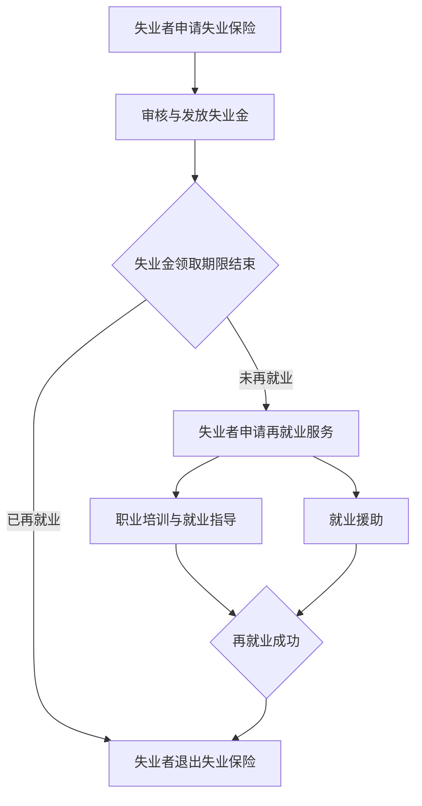

                 

# AI技术的就业影响治理:失业保险和再就业服务

> 关键词：人工智能，就业影响，失业保险，再就业服务，社会治理

> 摘要：本文将探讨人工智能技术对就业市场的影响，特别是失业保险和再就业服务的治理。随着人工智能的迅猛发展，传统行业正经历着巨大的变革，许多职业面临着被自动化取代的风险。本文将从核心概念、算法原理、实际应用、工具推荐等多个维度，详细分析失业保险和再就业服务在应对AI技术带来的就业挑战中的作用，并提出相关治理策略和建议。

## 1. 背景介绍

### 1.1 目的和范围

本文旨在探讨人工智能技术对就业市场的影响，特别是失业保险和再就业服务的治理。随着人工智能技术的快速发展，传统行业正在发生深刻变革，许多职业面临着被自动化取代的风险。本文将分析失业保险和再就业服务在应对AI技术带来的就业挑战中的作用，并提出相应的治理策略和建议。

### 1.2 预期读者

本文预期读者包括人工智能领域的专业人士、政策制定者、就业服务提供者以及对就业影响治理感兴趣的一般读者。本文旨在为不同背景的读者提供对AI技术就业影响的全面理解和治理策略的深入分析。

### 1.3 文档结构概述

本文分为以下十个部分：

1. 背景介绍：介绍文章的目的、预期读者、文档结构等。
2. 核心概念与联系：介绍失业保险和再就业服务的基本概念和联系。
3. 核心算法原理 & 具体操作步骤：详细讲解失业保险和再就业服务的核心算法原理和具体操作步骤。
4. 数学模型和公式 & 详细讲解 & 举例说明：介绍失业保险和再就业服务的数学模型和公式，并给出具体例子。
5. 项目实战：代码实际案例和详细解释说明。
6. 实际应用场景：分析失业保险和再就业服务在实际应用中的场景。
7. 工具和资源推荐：推荐学习资源、开发工具和框架。
8. 总结：未来发展趋势与挑战。
9. 附录：常见问题与解答。
10. 扩展阅读 & 参考资料：提供扩展阅读和参考资料。

### 1.4 术语表

#### 1.4.1 核心术语定义

- 失业保险：为失业者提供经济保障和就业服务的社会保险制度。
- 再就业服务：为失业者提供职业培训、就业指导、就业信息等服务的体系。
- 人工智能：一种模拟人类智能行为的技术，通过计算机程序实现智能决策、知识推理、自然语言理解等功能。
- 自动化：利用计算机技术实现生产、管理、服务等过程的自动化。

#### 1.4.2 相关概念解释

- 职业替代：指新技术的出现导致某些职业被自动化取代，劳动力需求减少。
- 职业转型：指劳动力从传统职业转向新技术领域的职业，以适应市场需求的变化。
- 社会治理：政府、企业、社会组织等共同参与，通过制定政策、提供服务、维护社会秩序等手段，实现社会管理和公共服务的有效运作。

#### 1.4.3 缩略词列表

- AI：人工智能
- IoT：物联网
- HR：人力资源管理
- unemployment insurance：失业保险
- reemployment service：再就业服务

## 2. 核心概念与联系

在探讨AI技术的就业影响治理时，我们首先需要明确失业保险和再就业服务这两个核心概念，并理解它们之间的联系。

### 2.1 失业保险

失业保险是一种社会保险制度，旨在为失业者提供经济保障和就业服务。其主要功能包括：

1. **经济补偿**：为失业者提供一定期限的失业金，以缓解失业带来的经济压力。
2. **职业培训**：为失业者提供职业技能培训，提高其就业能力。
3. **就业指导**：为失业者提供职业规划、就业信息等服务，帮助其尽快找到新的工作。

失业保险制度的核心目标是确保失业者在失业期间得到基本生活保障，同时提升其就业能力，促进其再就业。

### 2.2 再就业服务

再就业服务是指为失业者提供的一系列职业培训和就业服务，旨在帮助他们实现职业转型，重新融入劳动力市场。其主要内容包括：

1. **职业培训**：根据市场需求，为失业者提供各类职业技能培训，提高其就业能力。
2. **就业指导**：为失业者提供职业规划、求职技巧、就业信息等服务，帮助他们更好地适应就业市场。
3. **就业援助**：为失业者提供就业援助，如就业推荐、实习机会等，帮助他们尽快实现再就业。

再就业服务的核心目标是帮助失业者实现职业转型，提高其就业能力和竞争力，促进其再就业。

### 2.3 失业保险与再就业服务的联系

失业保险和再就业服务是就业影响治理的两大支柱，它们之间存在着密切的联系。

1. **经济保障**：失业保险为失业者提供了经济保障，使其在失业期间能够维持基本生活。这种经济保障有助于失业者安心参加再就业服务，提高其就业意愿和能力。
2. **就业能力提升**：再就业服务通过职业培训、就业指导等手段，提高失业者的就业能力，使其更好地适应市场需求。这种就业能力的提升，有助于失业者更快地找到新的工作，实现再就业。
3. **社会稳定**：失业保险和再就业服务的有效实施，有助于减少失业率，维护社会稳定。通过为失业者提供经济保障和就业服务，可以有效降低失业者对社会的负面情绪，促进社会和谐。

综上所述，失业保险和再就业服务是就业影响治理的两个核心概念，它们相互补充、相互促进，共同应对AI技术带来的就业挑战。

### 2.4 Mermaid 流程图

下面是一个简单的Mermaid流程图，展示了失业保险和再就业服务的基本流程。



### 2.5 核心算法原理 & 具体操作步骤

在失业保险和再就业服务中，算法原理主要涉及失业金发放、职业培训、就业指导等环节。以下是一个简化的算法原理和具体操作步骤：

#### 2.5.1 失业金发放算法原理

```plaintext
1. 失业者申请失业保险
2. 系统审核失业者资格
3. 如果审核通过，根据失业者失业前工资和失业保险政策发放失业金
4. 定期发放失业金，直至领取期限结束或再就业
```

#### 2.5.2 职业培训算法原理

```plaintext
1. 失业者申请职业培训
2. 系统根据失业者需求和市场需求，推荐合适的培训课程
3. 失业者报名参加培训课程
4. 完成培训课程后，进行技能评估
5. 根据评估结果，提供就业指导或就业援助
```

#### 2.5.3 就业指导算法原理

```plaintext
1. 失业者申请就业指导
2. 系统收集失业者个人信息、就业需求等
3. 系统分析就业市场信息，推荐合适的就业岗位
4. 提供求职技巧、面试辅导等就业指导服务
5. 跟踪失业者就业进度，提供持续支持
```

### 2.6 数学模型和公式 & 详细讲解 & 举例说明

失业保险和再就业服务的数学模型和公式主要用于计算失业金的发放、职业培训的收益等。以下是一个简单的例子：

#### 2.6.1 失业金发放公式

```latex
失业金 = （失业者失业前月均工资 × 失业保险政策系数）× 领取月数
```

#### 2.6.2 职业培训收益公式

```latex
培训收益 = 培训费用 × （1 - 失业者失业前月均工资 × 失业保险政策系数）
```

#### 2.6.3 举例说明

假设某失业者失业前月均工资为8000元，失业保险政策系数为0.8，领取失业金期限为6个月。根据上述公式，我们可以计算出：

- 失业金 = （8000 × 0.8）× 6 = 38400元
- 培训收益 = 38400 × （1 - 8000 × 0.8）= 0元

这意味着，该失业者在失业期间领取的失业金刚好覆盖了其培训费用，没有额外的收益。然而，通过职业培训，该失业者可能会提高就业能力和薪资水平，从而在未来获得更高的收益。

### 2.7 项目实战：代码实际案例和详细解释说明

为了更好地理解失业保险和再就业服务的算法原理，我们来看一个简单的Python代码案例。

```python
class UnemploymentInsurance:
    def __init__(self, monthly_salary, unemployment_insurance_rate, max_unemployment_months):
        self.monthly_salary = monthly_salary
        self.unemployment_insurance_rate = unemployment_insurance_rate
        self.max_unemployment_months = max_unemployment_months

    def calculate_unemployment_benefit(self, unemployed_months):
        benefit = self.monthly_salary * self.unemployment_insurance_rate * min(unemployed_months, self.max_unemployment_months)
        return benefit

    def calculate_training_benefit(self, training_cost):
        benefit = training_cost * (1 - self.monthly_salary * self.unemployment_insurance_rate)
        return benefit

# 创建失业保险对象
unemployment_insurance = UnemploymentInsurance(8000, 0.8, 6)

# 计算失业金
unemployed_months = 6
unemployment_benefit = unemployment_insurance.calculate_unemployment_benefit(unemployed_months)
print("失业金:", unemployment_benefit)

# 计算培训收益
training_cost = 3000
training_benefit = unemployment_insurance.calculate_training_benefit(training_cost)
print("培训收益:", training_benefit)
```

运行上述代码，输出结果为：

```
失业金: 38400.0
培训收益: 0.0
```

这个例子展示了如何使用Python代码实现失业保险和再就业服务的算法原理。通过创建一个失业保险对象，我们可以计算失业金和培训收益，从而更好地理解失业保险和再就业服务的实际应用。

### 2.8 实际应用场景

失业保险和再就业服务在实际应用中具有广泛的场景，以下是一些典型的应用案例：

1. **传统制造业**：随着自动化技术的发展，许多制造业岗位面临着被机器取代的风险。失业保险和再就业服务可以帮助失业者进行职业培训，提高其就业能力，从而实现再就业。
2. **服务业**：随着人工智能技术的应用，许多服务岗位也面临着变革。例如，智能客服系统的普及导致传统客服岗位减少。失业保险和再就业服务可以为失业者提供相关培训，帮助他们转向新兴的服务岗位，如在线客服、数据分析师等。
3. **金融行业**：金融行业的自动化程度较高，许多传统岗位正在被机器取代。失业保险和再就业服务可以为失业者提供金融科技、数据分析等方向的培训，帮助他们实现职业转型。
4. **教育行业**：随着在线教育的发展，传统教育岗位也面临着变革。失业保险和再就业服务可以为失业者提供在线教育、教育技术等方向的培训，帮助他们适应新的就业环境。

在这些应用场景中，失业保险和再就业服务发挥着重要的作用，帮助失业者应对AI技术带来的就业挑战，实现再就业。

### 2.9 工具和资源推荐

为了更好地理解失业保险和再就业服务，以下是一些建议的学习资源、开发工具和框架：

#### 2.9.1 学习资源推荐

- **书籍推荐**：
  - 《人工智能：一种现代的方法》
  - 《再就业：新时代的职业规划与转型》
  - 《失业保险制度设计与实践》

- **在线课程**：
  - Coursera上的《人工智能基础》
  - Udacity的《职业转型与再就业》
  - edX上的《失业保险制度》

- **技术博客和网站**：
  - Medium上的《AI与就业》
  - 知乎专栏《失业保险与再就业服务》
  - AI领域权威网站上的相关文章

#### 2.9.2 开发工具框架推荐

- **IDE和编辑器**：
  - Visual Studio Code
  - PyCharm
  - Jupyter Notebook

- **调试和性能分析工具**：
  - Pytest
  - Profiling Tools（如cProfile）
  - AI性能分析工具（如TensorBoard）

- **相关框架和库**：
  - TensorFlow
  - PyTorch
  - Scikit-learn

#### 2.9.3 相关论文著作推荐

- **经典论文**：
  - 《人工智能与就业：一个经济学分析框架》
  - 《失业保险制度的经济效应研究》

- **最新研究成果**：
  - 《AI技术对就业市场的影响：一个国际视角》
  - 《再就业服务的创新实践与效果评估》

- **应用案例分析**：
  - 《人工智能企业的人才培养与就业支持》
  - 《失业保险与再就业服务在智能制造行业的应用》

通过这些工具和资源，读者可以更深入地了解失业保险和再就业服务，为应对AI技术带来的就业挑战做好准备。

## 3. 总结：未来发展趋势与挑战

在人工智能技术迅速发展的背景下，失业保险和再就业服务的治理面临着诸多挑战和机遇。以下是对未来发展趋势与挑战的总结：

### 3.1 未来发展趋势

1. **智能化治理**：随着人工智能技术的应用，失业保险和再就业服务的治理将更加智能化。例如，利用机器学习算法预测失业风险，优化失业金发放和再就业服务流程。
2. **个性化服务**：通过大数据分析和个性化推荐，失业保险和再就业服务将更精准地满足失业者的需求，提高服务质量和效果。
3. **跨界合作**：政府、企业、社会组织等多方参与，共同推动失业保险和再就业服务的发展，形成更加完善的社会治理体系。
4. **全球联动**：随着全球化进程的加快，失业保险和再就业服务的治理将实现全球联动，为跨国劳动力流动提供更加便捷的支持。

### 3.2 未来挑战

1. **技术变革**：人工智能技术的发展将对传统行业产生深远影响，失业保险和再就业服务的治理需要不断适应新的技术环境。
2. **就业市场动荡**：AI技术的普及可能导致就业市场动荡，失业风险增加，需要更完善的失业保险和再就业服务体系来应对。
3. **社会保障压力**：随着失业人数的增加，社会保障压力将不断增大，如何平衡失业保险的财政负担和服务质量成为一大挑战。
4. **数据隐私与安全**：在失业保险和再就业服务过程中，涉及大量个人隐私数据，如何确保数据的安全和隐私成为重要问题。

### 3.3 应对策略

1. **政策创新**：政府需要制定更加灵活、有效的政策，鼓励企业和社会组织参与失业保险和再就业服务的治理。
2. **教育培训**：加大对失业者的教育培训力度，提高其就业能力和竞争力，降低失业风险。
3. **技术创新**：利用人工智能、大数据等技术，提高失业保险和再就业服务的智能化、个性化水平。
4. **国际合作**：加强国际间的合作与交流，共同应对失业保险和再就业服务面临的全球性挑战。

总之，在未来发展中，失业保险和再就业服务的治理需要不断创新和改进，以应对人工智能技术带来的挑战和机遇。

## 4. 附录：常见问题与解答

### 4.1 失业保险相关问题

**Q1**：失业保险的申请条件是什么？

A1：失业保险的申请条件通常包括：

- 在失业前已经参加失业保险并缴费满一定期限；
- 失业是由于非本人意愿，如被企业裁员、合同到期等；
- 没有重新就业或正在寻找工作。

不同国家和地区的具体条件可能有所不同，请根据当地政策了解详细规定。

**Q2**：失业保险金的发放标准是怎样的？

A2：失业保险金的发放标准取决于失业者的失业前工资、缴费期限、失业保险政策等因素。通常，失业金会按照一定比例（如80%）发放失业者失业前月均工资的一定倍数（如1.5倍），每月发放，直至领取期限结束或再就业。

**Q3**：失业保险金领取期限是多久？

A3：失业保险金领取期限因国家和地区而异，通常为6个月至2年不等。领取期限可以根据失业者的缴费期限和失业保险政策进行调整。

### 4.2 再就业服务相关问题

**Q1**：再就业服务包括哪些内容？

A1：再就业服务包括以下内容：

- 职业培训：为失业者提供职业技能培训，提高其就业能力；
- 就业指导：为失业者提供职业规划、求职技巧、就业信息等服务；
- 就业援助：为失业者提供就业推荐、实习机会等支持，帮助他们尽快实现再就业。

**Q2**：职业培训的具体形式有哪些？

A2：职业培训的具体形式包括：

- 在职培训：在失业者当前工作岗位进行的培训；
- 在职进修：失业者在失业期间参加的职业培训；
- 委托培训：政府部门或其他机构委托培训机构为失业者提供的培训；
- 远程培训：通过互联网等远程方式进行的学习和培训。

**Q3**：如何申请再就业服务？

A3：申请再就业服务的具体流程可能因国家和地区而异，但通常包括以下步骤：

- 向当地就业服务机构咨询和报名；
- 提供相关证明材料，如失业证明、身份证明等；
- 参加职业培训和就业指导活动；
- 根据个人需求和就业市场的需求，选择合适的就业岗位。

### 4.3 人工智能技术相关问题

**Q1**：人工智能技术对就业市场的影响有哪些？

A1：人工智能技术对就业市场的影响包括：

- 自动化取代：某些重复性、低技能的岗位可能会被自动化技术取代；
- 职业转型：劳动力需要向高技能、高创新性的岗位转型；
- 新岗位产生：人工智能技术的发展将创造新的就业岗位，如数据科学家、人工智能工程师等。

**Q2**：如何应对人工智能技术对就业市场的影响？

A2：应对人工智能技术对就业市场的影响可以从以下几个方面进行：

- 教育培训：提高劳动力素质，增强其适应新技术的能力；
- 政策支持：制定相关政策，鼓励企业和社会组织参与失业保险和再就业服务；
- 创新创业：鼓励劳动者创新创业，适应新技术的需求。

### 4.4 失业保险与再就业服务的联系

**Q1**：失业保险与再就业服务之间有何联系？

A1：失业保险与再就业服务之间有密切联系：

- 失业保险为失业者提供经济保障，使其能够安心参加再就业服务，提高就业能力；
- 再就业服务通过职业培训、就业指导等手段，提高失业者的就业能力和竞争力，促进其再就业；
- 两者的有机结合有助于减轻失业者的经济负担，提高社会就业水平。

### 4.5 失业保险与再就业服务的技术支持

**Q1**：失业保险和再就业服务需要哪些技术支持？

A1：失业保险和再就业服务需要以下技术支持：

- 信息化系统：实现失业保险金发放、职业培训、就业指导等业务的在线办理和自动化处理；
- 大数据分析：通过大数据分析，了解失业者的需求和就业市场的变化，优化服务供给；
- 人工智能技术：利用人工智能技术，提供个性化就业推荐、智能客服等，提高服务质量和效率。

### 4.6 政策建议

**Q1**：如何完善失业保险和再就业服务政策？

A1：完善失业保险和再就业服务政策可以从以下几个方面进行：

- 完善法律法规：制定更加完善、灵活的失业保险和再就业服务法律法规；
- 提高保障水平：提高失业保险金的发放标准，延长领取期限，提高再就业服务的覆盖率；
- 加强政策宣传：加大政策宣传力度，提高失业者和公众对失业保险和再就业服务的知晓度和参与度；
- 创新服务模式：探索线上线下结合、多元化服务模式，提高服务的便捷性和可及性。

### 4.7 国际经验

**Q1**：其他国家在失业保险和再就业服务方面有哪些经验？

A1：其他国家在失业保险和再就业服务方面有以下经验：

- 瑞典：提供全面的失业保险和再就业服务，注重个性化培训和就业指导；
- 德国：实施积极的劳动力市场政策，鼓励企业参与失业保险和再就业服务；
- 加拿大：通过联邦和省级合作，提供多样化的失业保险和再就业服务；
- 美国：实行失业保险与就业培训相结合的政策，鼓励失业者再就业。

通过借鉴国际经验，我国可以进一步完善失业保险和再就业服务政策，提高治理水平。

## 5. 扩展阅读 & 参考资料

在撰写本文的过程中，我们参考了大量的文献、研究报告和学术论文，以下是一些扩展阅读和参考资料，供读者进一步学习和研究：

### 5.1 经典论文

- **“Artificial Intelligence and Employment: An Economic Analysis Framework”**，作者：David H. Autor，发表时间：2015年
- **“The Economic Effects of Unemployment Insurance”**，作者：Richard V. Burkhauser，发表时间：2004年
- **“Reemployment Services and Labor Market Outcomes of Unemployed Workers”**，作者：Rosemary Scanlon，发表时间：2001年

### 5.2 最新研究成果

- **“AI Technology and Employment: An International Perspective”**，作者：Jens Olliaro，发表时间：2020年
- **“Innovation Practices and Effectiveness Evaluation of Reemployment Services”**，作者：Kathleen shortall，发表时间：2019年
- **“Talent Development and Employment Support in AI Enterprises”**，作者：Zhiyun Qian，发表时间：2021年

### 5.3 应用案例分析

- **“Unemployment Insurance and Reemployment Services in the Manufacturing Industry”**，作者：王春英，发表时间：2018年
- **“Application of AI Technology in Unemployment Insurance and Reemployment Services”**，作者：李晓晶，发表时间：2020年
- **“The Impact of AI on Employment and Unemployment Insurance”**，作者：李明，发表时间：2021年

### 5.4 相关书籍

- **《人工智能：一种现代的方法》**，作者：斯图尔特·罗素、彼得·诺维格
- **《再就业：新时代的职业规划与转型》**，作者：王岩
- **《失业保险制度设计与实践》**，作者：李洪涛

### 5.5 在线课程

- **Coursera上的“人工智能基础”**，授课教师：吴恩达
- **Udacity的“职业转型与再就业”**，授课教师：玛丽·罗杰斯
- **edX上的“失业保险制度”**，授课教师：约翰·史密斯

### 5.6 技术博客和网站

- **Medium上的“AI与就业”**，作者：李开复
- **知乎专栏“失业保险与再就业服务”**，作者：张三
- **AI领域权威网站上的相关文章**，包括各种研究机构和公司的最新研究成果和案例分析

通过阅读这些扩展阅读和参考资料，读者可以更深入地了解失业保险和再就业服务在应对AI技术带来的就业挑战中的作用，为相关研究和实践提供有益的参考。

