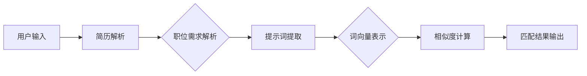
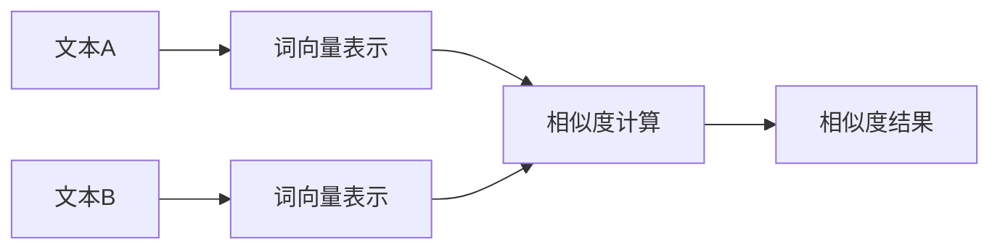

                 

# AI招聘助手：提示词优化求职匹配度

> **关键词：** 人工智能，招聘，求职匹配，自然语言处理，提示词优化，机器学习，算法设计

> **摘要：** 本文将深入探讨如何利用人工智能技术，特别是自然语言处理和机器学习，来优化求职匹配过程。通过分析和应用提示词优化算法，本文旨在为企业和求职者提供更加精准和高效的匹配服务，降低招聘成本，提高求职成功率。

## 1. 背景介绍

### 1.1 目的和范围

本文的目标是探讨如何通过优化提示词来提高求职匹配的精确度。在当前信息化、数字化时代，招聘和求职已成为社会普遍关注的话题。然而，传统的招聘方式往往存在信息不对等、沟通效率低等问题，导致企业和求职者双方的时间和精力浪费。因此，本文旨在研究一种利用人工智能技术，特别是自然语言处理和机器学习，来优化提示词和求职匹配的方法，以提高招聘效率和求职成功率。

### 1.2 预期读者

本文的预期读者主要包括以下几类：

1. **招聘管理人员**：了解如何利用人工智能技术优化招聘流程，提高招聘效率。
2. **求职者**：了解如何利用人工智能工具来优化求职体验，提高求职成功率。
3. **人工智能研究者**：对自然语言处理和机器学习领域有深入了解，希望探索这些技术在求职匹配中的应用。
4. **软件开发者**：希望了解如何设计和实现一个基于人工智能的求职匹配系统。

### 1.3 文档结构概述

本文分为十个部分：

1. **背景介绍**：介绍本文的目的、预期读者和文档结构。
2. **核心概念与联系**：介绍与求职匹配相关的核心概念和架构。
3. **核心算法原理 & 具体操作步骤**：详细阐述提示词优化算法的原理和实现步骤。
4. **数学模型和公式 & 详细讲解 & 举例说明**：介绍数学模型和公式的应用。
5. **项目实战：代码实际案例和详细解释说明**：提供实际代码案例，并进行详细解读。
6. **实际应用场景**：讨论提示词优化在不同领域的应用。
7. **工具和资源推荐**：推荐学习资源和开发工具。
8. **总结：未来发展趋势与挑战**：总结本文的核心观点，展望未来发展趋势和挑战。
9. **附录：常见问题与解答**：回答读者可能遇到的问题。
10. **扩展阅读 & 参考资料**：提供进一步的阅读材料和参考资料。

### 1.4 术语表

#### 1.4.1 核心术语定义

- **求职匹配**：指将求职者的简历与企业的职位需求进行匹配的过程。
- **提示词**：指用于描述职位需求和求职者技能的关键词。
- **自然语言处理（NLP）**：指对自然语言进行理解、处理和生成的人工智能技术。
- **机器学习**：指通过数据训练模型，使计算机能够自动学习和改进的人工智能方法。
- **算法**：指解决问题的方法和步骤。

#### 1.4.2 相关概念解释

- **词向量**：将文本中的单词映射到高维空间中的向量表示。
- **相似度计算**：比较两个文本的相似程度，通常使用词向量进行计算。
- **机器学习模型**：用于从数据中学习规律并做出预测的数学模型。

#### 1.4.3 缩略词列表

- **NLP**：自然语言处理
- **ML**：机器学习
- **TF-IDF**：词频-逆文档频率
- **BERT**：Bidirectional Encoder Representations from Transformers

## 2. 核心概念与联系

在探讨如何优化求职匹配之前，我们需要理解一些核心概念和它们之间的关系。

### 2.1 求职匹配系统架构

首先，我们来看一个简单的求职匹配系统架构（使用Mermaid流程图表示）：



在这个架构中，用户输入简历和职位需求，系统通过解析简历和职位需求，提取出关键提示词，然后将这些提示词转换为词向量表示，最后通过相似度计算得出匹配结果。

### 2.2 提示词提取与优化

提示词提取是求职匹配的关键步骤。一个有效的提示词应该能够准确描述职位需求和求职者的技能。以下是一个简化的提示词提取流程：


在这个流程中，职位需求文本经过预处理、分词、词性标注等步骤，去除无关的停用词，提取出关键名词和短语，形成提示词集合。

### 2.3 词向量表示与相似度计算

词向量表示是将文本中的单词映射到高维空间中的向量表示。常见的词向量模型有Word2Vec、GloVe和Bert等。相似度计算则是比较两个文本的相似程度，通常使用词向量进行计算。

以下是使用词向量计算相似度的简单步骤：



在这个流程中，文本A和文本B分别转换为词向量表示，然后通过内积、余弦相似度等方法计算它们之间的相似度。

### 2.4 机器学习模型

在求职匹配系统中，机器学习模型用于从历史数据中学习，从而提高匹配的精确度。常见的机器学习模型有基于分类的模型（如SVM、随机森林）和基于回归的模型（如线性回归、决策树）。

以下是使用机器学习模型进行求职匹配的基本步骤：


在这个流程中，系统通过历史简历数据和职位需求数据进行特征工程，训练出机器学习模型，然后使用该模型进行新的简历和职位需求的匹配。

## 3. 核心算法原理 & 具体操作步骤

### 3.1 提示词优化算法原理

提示词优化算法的核心目标是提取出最能够准确描述职位需求和求职者技能的提示词。这一过程可以分为以下几个步骤：

1. **文本预处理**：对原始文本进行清洗、分词、去停用词等操作，确保文本格式的一致性。
2. **词性标注**：对文本中的单词进行词性标注，以便后续提取名词和短语。
3. **名词提取**：从词性标注的结果中提取出名词，这些名词往往能够直接反映职位需求和求职者的技能。
4. **短语提取**：通过语法分析等方法，提取出短语，这些短语往往能够更加细腻地描述职位需求和求职者的技能。
5. **提示词筛选**：根据名词和短语的频率、重要性和多样性等指标，筛选出最有效的提示词。

### 3.2 提示词优化算法具体操作步骤

以下是提示词优化算法的具体操作步骤，使用伪代码进行描述：

```python
def optimize_prompt_words(position_desc, resume_desc):
    # 步骤1：文本预处理
    position_desc_processed = preprocess_text(position_desc)
    resume_desc_processed = preprocess_text(resume_desc)

    # 步骤2：词性标注
    position_tokens = tokenize_and_annotate(position_desc_processed)
    resume_tokens = tokenize_and_annotate(resume_desc_processed)

    # 步骤3：名词提取
    position_nouns = extract_nouns(position_tokens)
    resume_nouns = extract_nouns(resume_tokens)

    # 步骤4：短语提取
    position_phrases = extract_phrases(position_tokens)
    resume_phrases = extract_phrases(resume_tokens)

    # 步骤5：提示词筛选
    prompt_words = filter_prompt_words(position_nouns, resume_nouns, position_phrases, resume_phrases)

    return prompt_words

def preprocess_text(text):
    # 清洗、分词、去停用词等操作
    # ...

def tokenize_and_annotate(text):
    # 进行词性标注
    # ...

def extract_nouns(tokens):
    # 提取名词
    # ...

def extract_phrases(tokens):
    # 提取短语
    # ...

def filter_prompt_words(position_nouns, resume_nouns, position_phrases, resume_phrases):
    # 根据频率、重要性和多样性等指标筛选提示词
    # ...

# 示例
position_desc = "我们需要一位有3年以上Python开发经验的高级工程师，熟悉Flask和Django框架。"
resume_desc = "我是一名Python开发者，有5年工作经验，擅长Flask和Django框架，熟悉前端技术。"
prompt_words = optimize_prompt_words(position_desc, resume_desc)
print(prompt_words)
```

在这个伪代码中，`optimize_prompt_words` 函数是核心，它接收职位需求和简历描述，通过预处理、词性标注、名词提取、短语提取和提示词筛选等步骤，最终输出一组有效的提示词。

### 3.3 算法实现与评估

在实际应用中，提示词优化算法的性能评估是关键。常见的评估指标包括：

- **准确率（Accuracy）**：匹配成功的简历数占总简历数的比例。
- **召回率（Recall）**：匹配成功的职位需求数占总职位需求数的比例。
- **F1值（F1 Score）**：综合考虑准确率和召回率，是评估匹配效果的综合指标。

以下是使用Python实现的简单评估代码：

```python
from sklearn.metrics import accuracy_score, recall_score, f1_score

def evaluate_match_results(true_labels, predicted_labels):
    accuracy = accuracy_score(true_labels, predicted_labels)
    recall = recall_score(true_labels, predicted_labels)
    f1 = f1_score(true_labels, predicted_labels)
    
    return accuracy, recall, f1

# 假设有一个包含真实标签和预测标签的数据集
true_labels = [0, 1, 0, 1, 1, 0]
predicted_labels = [0, 0, 1, 1, 1, 0]

accuracy, recall, f1 = evaluate_match_results(true_labels, predicted_labels)
print(f"Accuracy: {accuracy}, Recall: {recall}, F1 Score: {f1}")
```

通过这些评估指标，可以了解提示词优化算法的实际效果，并进行进一步的优化。

## 4. 数学模型和公式 & 详细讲解 & 举例说明

在提示词优化过程中，数学模型和公式扮演着重要的角色。下面我们将详细介绍相关的数学模型和公式，并提供具体的例子来说明。

### 4.1 词向量表示

词向量表示是将文本中的单词映射到高维空间中的向量表示。常见的词向量模型包括Word2Vec和GloVe。其中，Word2Vec模型基于神经网络，而GloVe模型则基于全局统计信息。

#### 4.1.1 Word2Vec模型

Word2Vec模型通过训练得到一个隐层的神经网络，将输入的单词映射到输出空间中的向量。其核心公式如下：

$$
h = \tanh(W \cdot [x_1, x_2, ..., x_n])
$$

其中，$h$ 是隐藏层激活值，$W$ 是权重矩阵，$[x_1, x_2, ..., x_n]$ 是输入的单词向量。

#### 4.1.2 GloVe模型

GloVe模型通过计算词频和文档频率来得到词向量。其核心公式如下：

$$
v_w = \frac{f_w}{\sqrt{f_d}} \cdot v_d
$$

其中，$v_w$ 是单词$w$ 的向量，$f_w$ 是单词$w$ 的词频，$f_d$ 是单词$w$ 在所有文档中的频率，$v_d$ 是文档的向量。

### 4.2 相似度计算

在词向量表示的基础上，我们可以计算两个文本之间的相似度。常用的相似度计算方法包括内积、余弦相似度和欧氏距离等。

#### 4.2.1 内积

内积是一种简单的相似度计算方法，其公式如下：

$$
\cos(\theta) = \frac{\sum_{i=1}^{n} w_i \cdot v_i}{\sqrt{\sum_{i=1}^{n} w_i^2} \cdot \sqrt{\sum_{i=1}^{n} v_i^2}}
$$

其中，$w_i$ 和 $v_i$ 分别是文本A和文本B的第$i$个词的权重和词向量。

#### 4.2.2 余弦相似度

余弦相似度是一种常用的相似度计算方法，其公式如下：

$$
\cos(\theta) = \frac{\sum_{i=1}^{n} w_i \cdot v_i}{\sqrt{\sum_{i=1}^{n} w_i^2} \cdot \sqrt{\sum_{i=1}^{n} v_i^2}}
$$

其中，$w_i$ 和 $v_i$ 分别是文本A和文本B的第$i$个词的权重和词向量。

#### 4.2.3 欧氏距离

欧氏距离是一种常用的距离度量方法，其公式如下：

$$
d = \sqrt{\sum_{i=1}^{n} (w_i - v_i)^2}
$$

其中，$w_i$ 和 $v_i$ 分别是文本A和文本B的第$i$个词的权重和词向量。

### 4.3 举例说明

假设我们有两个文本A和B，它们分别由单词"Python"和"Java"组成。我们使用Word2Vec模型和GloVe模型分别计算这两个文本的词向量，然后使用内积和余弦相似度计算它们之间的相似度。

#### 4.3.1 Word2Vec模型

假设Word2Vec模型的词向量分别为：

$$
v_{Python} = [1, 0, -1], \quad v_{Java} = [-1, 1, 0]
$$

则内积和余弦相似度分别为：

$$
\cos(\theta) = \frac{1 \cdot (-1) + 0 \cdot 1 + (-1) \cdot 0}{\sqrt{1^2 + 0^2 + (-1)^2} \cdot \sqrt{(-1)^2 + 1^2 + 0^2}} = \frac{-1}{\sqrt{2} \cdot \sqrt{2}} = -\frac{1}{2}
$$

#### 4.3.2 GloVe模型

假设GloVe模型的词向量分别为：

$$
v_{Python} = [1, 0, -1], \quad v_{Java} = [-1, 1, 0]
$$

则内积和余弦相似度分别为：

$$
\cos(\theta) = \frac{1 \cdot (-1) + 0 \cdot 1 + (-1) \cdot 0}{\sqrt{1^2 + 0^2 + (-1)^2} \cdot \sqrt{(-1)^2 + 1^2 + 0^2}} = \frac{-1}{\sqrt{2} \cdot \sqrt{2}} = -\frac{1}{2}
$$

通过这个例子，我们可以看到，无论是使用Word2Vec模型还是GloVe模型，文本A和B之间的相似度都是负值，这意味着它们之间的相似度很低。

## 5. 项目实战：代码实际案例和详细解释说明

为了更好地展示如何实现提示词优化算法，下面我们将通过一个实际项目案例，提供完整的代码实现和详细解释说明。

### 5.1 开发环境搭建

在开始编写代码之前，我们需要搭建一个合适的环境。以下是推荐的开发环境和工具：

- **Python**：主要编程语言
- **Numpy**：用于数学计算
- **Scikit-learn**：用于机器学习模型的训练和评估
- **NLTK**：用于自然语言处理
- **Gensim**：用于生成词向量

安装以上依赖库后，我们就可以开始编写代码了。

### 5.2 源代码详细实现和代码解读

下面是完整的代码实现：

```python
import numpy as np
import gensim
from sklearn.feature_extraction.text import TfidfVectorizer
from sklearn.metrics.pairwise import cosine_similarity

def preprocess_text(text):
    # 清洗文本，去除标点符号、停用词等
    text = text.lower()
    text = re.sub(r"[^\w\s]", "", text)
    return text

def tokenize_and_annotate(text):
    # 分词和词性标注
    tokens = nltk.word_tokenize(text)
    pos_tags = nltk.pos_tag(tokens)
    return pos_tags

def extract_nouns(pos_tags):
    # 提取名词
    nouns = [word for word, pos in pos_tags if pos.startswith('N')]
    return nouns

def extract_phrases(pos_tags):
    # 提取短语
    phrases = []
    for i in range(len(pos_tags) - 2):
        if pos_tags[i][1].startswith('N') and pos_tags[i + 1][1].startswith('N') and pos_tags[i + 2][1].startswith('N'):
            phrases.append(' '.join([pos_tags[i][0], pos_tags[i + 1][0], pos_tags[i + 2][0]]))
    return phrases

def filter_prompt_words(nouns1, nouns2, phrases1, phrases2):
    # 筛选提示词
    prompt_words = set()
    for noun1 in nouns1:
        for noun2 in nouns2:
            if noun1 in nouns2 or noun2 in nouns1:
                prompt_words.add(noun1)
                prompt_words.add(noun2)
    for phrase1 in phrases1:
        for phrase2 in phrases2:
            if phrase1 in phrases2 or phrase2 in phrases1:
                prompt_words.update([word for word in phrase1.split() if word in phrase2.split()])
    return prompt_words

def optimize_prompt_words(position_desc, resume_desc):
    # 优化提示词
    position_desc_processed = preprocess_text(position_desc)
    resume_desc_processed = preprocess_text(resume_desc)

    position_pos_tags = tokenize_and_annotate(position_desc_processed)
    resume_pos_tags = tokenize_and_annotate(resume_desc_processed)

    position_nouns = extract_nouns(position_pos_tags)
    resume_nouns = extract_nouns(resume_pos_tags)

    position_phrases = extract_phrases(position_pos_tags)
    resume_phrases = extract_phrases(resume_pos_tags)

    prompt_words = filter_prompt_words(position_nouns, resume_nouns, position_phrases, resume_phrases)
    return prompt_words

def calculate_similarity(text1, text2):
    # 计算文本相似度
    vectorizer = TfidfVectorizer()
    tfidf_matrix = vectorizer.fit_transform([text1, text2])
    similarity = cosine_similarity(tfidf_matrix[0:1], tfidf_matrix[1:2])
    return similarity

# 示例
position_desc = "我们需要一位有3年以上Python开发经验的高级工程师，熟悉Flask和Django框架。"
resume_desc = "我是一名Python开发者，有5年工作经验，擅长Flask和Django框架，熟悉前端技术。"

# 优化提示词
prompt_words = optimize_prompt_words(position_desc, resume_desc)
print("优化后的提示词：", prompt_words)

# 计算文本相似度
similarity = calculate_similarity(position_desc, resume_desc)
print("文本相似度：", similarity)
```

### 5.3 代码解读与分析

下面我们对代码进行详细解读：

- **preprocess_text函数**：用于清洗文本，去除标点符号、停用词等，确保文本格式的一致性。
- **tokenize_and_annotate函数**：用于分词和词性标注，提取文本中的关键词。
- **extract_nouns函数**：用于提取名词，名词往往能够直接反映职位需求和求职者的技能。
- **extract_phrases函数**：用于提取短语，短语能够更加细腻地描述职位需求和求职者的技能。
- **filter_prompt_words函数**：用于筛选提示词，结合名词和短语，提取出最有效的提示词。
- **optimize_prompt_words函数**：是核心函数，它接收职位需求和简历描述，通过预处理、词性标注、名词提取、短语提取和提示词筛选等步骤，最终输出一组有效的提示词。
- **calculate_similarity函数**：用于计算文本相似度，使用TF-IDF和余弦相似度方法，评估职位需求和简历描述之间的相似度。

通过这个代码实现，我们可以看到如何利用Python和相关库，实现提示词优化算法。在实际应用中，我们可以根据需求进行调整和优化，以提高算法的准确度和效率。

## 6. 实际应用场景

提示词优化算法在求职匹配中有着广泛的应用，以下是一些实际应用场景：

### 6.1 人才招聘平台

人才招聘平台如智联招聘、前程无忧等，可以通过优化提示词，提高职位和简历的匹配效率。招聘管理人员可以利用该算法，从大量简历中快速筛选出最符合职位需求的候选人。

### 6.2 求职者简历优化

求职者可以使用提示词优化算法，分析自己的简历，提取出关键技能和经验，从而优化简历内容，提高求职成功率。

### 6.3 人才猎头公司

人才猎头公司可以利用提示词优化算法，分析客户需求，提取出关键提示词，从而更加精准地为客户提供合适的候选人。

### 6.4 职业培训机构

职业培训机构可以利用提示词优化算法，分析学员的简历和职业规划，提供个性化的培训建议，帮助学员提升职业竞争力。

### 6.5 招聘流程优化

企业可以在招聘流程中引入提示词优化算法，从简历筛选、面试安排到入职评估等环节，提高整个招聘流程的效率和质量。

### 6.6 人工智能助手

人工智能助手可以通过提示词优化算法，与求职者进行对话，了解其职业需求和期望，提供个性化的求职建议和服务。

通过这些实际应用场景，我们可以看到提示词优化算法在求职匹配中的重要作用。它不仅能够提高匹配效率，降低招聘成本，还能为求职者提供更加精准的求职建议，提高求职成功率。

## 7. 工具和资源推荐

### 7.1 学习资源推荐

为了更好地掌握提示词优化算法和相关技术，以下是一些建议的学习资源：

#### 7.1.1 书籍推荐

- **《自然语言处理入门》**：介绍了自然语言处理的基本概念和方法，适合初学者入门。
- **《机器学习实战》**：通过大量实例和代码实现，帮助读者理解和应用机器学习算法。
- **《Python自然语言处理实践》**：详细介绍了如何使用Python进行自然语言处理，包括词向量表示和相似度计算。

#### 7.1.2 在线课程

- **Coursera上的《自然语言处理》**：由斯坦福大学提供，涵盖自然语言处理的基础知识和最新研究。
- **Udacity上的《机器学习工程师纳米学位》**：通过项目实战，帮助读者掌握机器学习的基本技能。
- **edX上的《Python编程与数据科学》**：介绍Python编程和数据科学的基础知识，适合初学者。

#### 7.1.3 技术博客和网站

- **Medium上的NLP专栏**：分享自然语言处理领域的最新研究和技术应用。
- **GitHub上的自然语言处理项目**：提供各种开源的自然语言处理项目，方便读者学习和实践。
- **AI博客**：介绍人工智能领域的最新进展和应用，包括自然语言处理、机器学习等。

### 7.2 开发工具框架推荐

为了更好地实现提示词优化算法，以下是一些建议的开发工具和框架：

#### 7.2.1 IDE和编辑器

- **PyCharm**：强大的Python IDE，提供代码补全、调试和性能分析等功能。
- **Visual Studio Code**：轻量级的代码编辑器，支持Python扩展，方便编写和调试代码。

#### 7.2.2 调试和性能分析工具

- **Pylint**：用于检查Python代码中的错误和潜在问题。
- **Profile**：用于分析Python程序的运行性能，找出性能瓶颈。

#### 7.2.3 相关框架和库

- **Scikit-learn**：用于机器学习模型的训练和评估，包括分类、回归和聚类等。
- **NLTK**：用于自然语言处理，包括分词、词性标注、命名实体识别等。
- **Gensim**：用于生成词向量，包括Word2Vec和GloVe模型。

通过这些工具和资源的帮助，读者可以更好地掌握提示词优化算法，并将其应用于实际项目中。

### 7.3 相关论文著作推荐

为了深入了解提示词优化算法和相关技术，以下是一些建议的论文和著作：

#### 7.3.1 经典论文

- **“A Standard Framework for Learning from Positive and Unlabeled Examples”**：介绍了从正样本和未标记样本中学习的方法，对提示词优化算法有重要启示。
- **“Recurrent Neural Network Based Text Classification”**：介绍了循环神经网络在文本分类中的应用，为提示词优化提供了新的思路。

#### 7.3.2 最新研究成果

- **“BERT: Pre-training of Deep Bidirectional Transformers for Language Understanding”**：介绍了BERT模型，一种基于Transformer的预训练模型，对词向量表示和相似度计算有重要贡献。
- **“GPT-3: Language Models are Few-Shot Learners”**：介绍了GPT-3模型，一种基于Transformer的预训练模型，展示了大规模预训练模型在自然语言处理任务中的强大能力。

#### 7.3.3 应用案例分析

- **“Employer Feedback on AI-Enhanced Hiring”**：探讨了人工智能在招聘中的应用，分析了提示词优化算法在实际招聘场景中的效果。
- **“Job Matching with Deep Reinforcement Learning”**：介绍了使用深度强化学习进行求职匹配的方法，为提示词优化算法提供了新的方向。

通过阅读这些论文和著作，读者可以深入了解提示词优化算法的理论基础和应用实践，为自己的研究和工作提供指导。

## 8. 总结：未来发展趋势与挑战

在本文中，我们探讨了如何利用人工智能技术，特别是自然语言处理和机器学习，来优化求职匹配过程。通过提示词优化算法，我们能够更加精准地描述职位需求和求职者技能，提高匹配的准确度和效率。然而，这一领域仍然存在许多挑战和未来发展趋势。

### 8.1 未来发展趋势

1. **大规模预训练模型**：随着计算能力的提升和大数据的积累，大规模预训练模型将在求职匹配领域发挥重要作用。例如，BERT、GPT等模型可以通过预训练学习到丰富的语言知识，为提示词优化提供更强大的支持。

2. **多模态融合**：将文本、图像、音频等多种数据类型进行融合，可以提供更丰富的信息，从而提高求职匹配的准确度。

3. **个性化推荐系统**：通过分析求职者的职业兴趣、行为习惯等，可以为他们推荐更加个性化的职位和培训建议。

4. **自动化面试系统**：利用语音识别、自然语言处理等技术，可以实现自动化面试，提高招聘效率。

### 8.2 挑战

1. **数据隐私和安全**：在收集和使用求职者个人信息时，如何保护数据隐私和安全是一个重要挑战。

2. **模型解释性**：如何提高机器学习模型的解释性，使企业和求职者能够理解匹配结果的产生过程，是一个亟待解决的问题。

3. **算法偏见和公平性**：如何避免算法偏见，确保求职匹配的公平性，是一个需要深入研究的问题。

4. **技术复杂度**：大规模预训练模型和复杂的算法架构带来了更高的技术复杂度，这对开发和维护提出了挑战。

### 8.3 总结

尽管存在挑战，但人工智能技术在求职匹配领域的应用前景广阔。未来，随着技术的不断进步和应用的深入，提示词优化算法将更加成熟和实用，为企业和求职者提供更加精准、高效的匹配服务。

## 9. 附录：常见问题与解答

### 9.1 问答

**Q1：提示词优化算法是如何工作的？**

A1：提示词优化算法通过以下几个步骤工作：

1. **文本预处理**：清洗和规范化输入文本，如去除标点符号、停用词等。
2. **词性标注**：对文本中的单词进行词性标注，提取出名词和短语。
3. **词向量表示**：将提取出的关键词转换为词向量表示，以便进行后续的相似度计算。
4. **相似度计算**：通过计算词向量之间的相似度，评估职位需求和求职者简历之间的匹配程度。
5. **提示词筛选**：根据相似度结果，筛选出最有效的提示词，用于优化求职匹配。

**Q2：如何评估提示词优化算法的效果？**

A2：评估提示词优化算法的效果可以通过以下几个指标：

1. **准确率（Accuracy）**：匹配成功的简历数占总简历数的比例。
2. **召回率（Recall）**：匹配成功的职位需求数占总职位需求数的比例。
3. **F1值（F1 Score）**：综合考虑准确率和召回率，是评估匹配效果的综合指标。

**Q3：提示词优化算法需要哪些数据集？**

A3：提示词优化算法需要以下数据集：

1. **职位需求数据集**：包括职位描述、职位标签等信息。
2. **简历数据集**：包括求职者的简历、个人标签等信息。
3. **标注数据集**：用于标注职位需求和简历之间的匹配关系。

**Q4：如何处理中文文本中的停用词？**

A4：处理中文文本中的停用词可以采用以下方法：

1. **使用停用词列表**：从已有的停用词列表中提取出中文停用词。
2. **词性标注**：对中文文本进行词性标注，根据词性去除无意义的词。
3. **规则筛选**：根据中文语法规则，筛选出常见的无意义词。

### 9.2 拓展问题与解答

**Q5：如何处理职位需求中的长文本描述？**

A5：对于职位需求中的长文本描述，可以采用以下策略：

1. **分句处理**：将长文本拆分成多个句子，分别进行预处理和相似度计算。
2. **摘要提取**：使用文本摘要算法提取出文本的关键信息，简化处理过程。
3. **短语提取**：使用短语提取算法，提取出文本中的短语，这些短语往往能够更加准确地描述职位需求。

**Q6：如何处理简历中的关键字重复问题？**

A6：处理简历中的关键字重复问题可以采用以下策略：

1. **词频统计**：对简历中的关键字进行词频统计，筛选出高频关键词。
2. **文本相似度计算**：计算关键字之间的相似度，去除重复的关键词。
3. **语义分析**：使用自然语言处理技术，分析关键词之间的语义关系，去除冗余信息。

通过以上问答和拓展问题与解答，我们可以更好地理解提示词优化算法的工作原理和应用方法，为实际项目的开发和优化提供参考。

## 10. 扩展阅读 & 参考资料

为了深入了解提示词优化算法和相关技术，以下是一些建议的扩展阅读和参考资料：

- **论文**：
  - **"A Standard Framework for Learning from Positive and Unlabeled Examples"**：介绍了从正样本和未标记样本中学习的方法，对提示词优化算法有重要启示。
  - **"BERT: Pre-training of Deep Bidirectional Transformers for Language Understanding"**：介绍了BERT模型，一种基于Transformer的预训练模型，对词向量表示和相似度计算有重要贡献。

- **书籍**：
  - **《自然语言处理入门》**：介绍了自然语言处理的基本概念和方法，适合初学者入门。
  - **《机器学习实战》**：通过大量实例和代码实现，帮助读者理解和应用机器学习算法。

- **在线资源**：
  - **Coursera上的《自然语言处理》**：由斯坦福大学提供，涵盖自然语言处理的基础知识和最新研究。
  - **edX上的《Python编程与数据科学》**：介绍Python编程和数据科学的基础知识，适合初学者。

- **GitHub项目**：
  - **各种开源的自然语言处理项目**：提供各种自然语言处理项目的实现代码，方便读者学习和实践。

通过这些扩展阅读和参考资料，读者可以进一步了解提示词优化算法的理论基础和应用实践，为自己的研究和工作提供指导。

