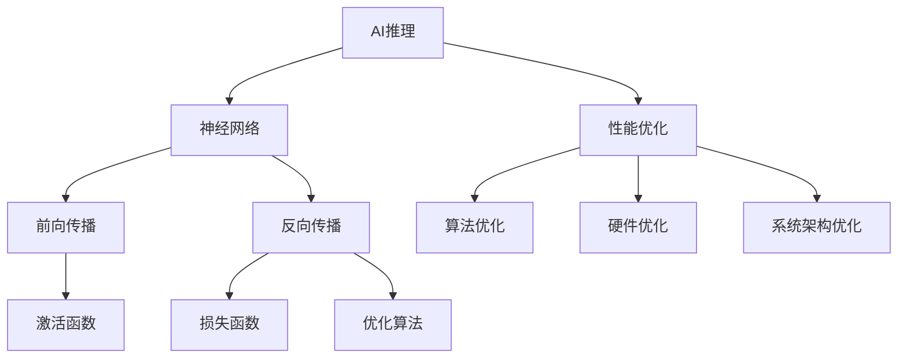

                 

# AI推理性能优化的技术路径

> **关键词：** AI推理、性能优化、算法原理、数学模型、项目实战、应用场景、未来发展趋势

> **摘要：** 本文旨在探讨人工智能（AI）推理性能优化的技术路径，从核心概念、算法原理、数学模型、项目实战和实际应用等多个角度深入分析，旨在为读者提供一套全面、系统的优化策略。

## 1. 背景介绍

### 1.1 目的和范围

随着深度学习技术的快速发展，人工智能（AI）应用逐渐渗透到各个领域，从图像识别、自然语言处理到自动驾驶和医疗诊断等。然而，AI推理性能的优化成为制约其广泛应用的关键因素。本文旨在为读者介绍AI推理性能优化的技术路径，帮助开发者理解并应用这些技术，提升AI系统的整体性能。

### 1.2 预期读者

本文面向有一定编程基础，对人工智能和深度学习有所了解的技术人员。无论您是AI研究员、开发者还是相关领域的学生，都将从本文中获得宝贵的技术洞察。

### 1.3 文档结构概述

本文分为十个部分，内容安排如下：

1. 背景介绍
2. 核心概念与联系
3. 核心算法原理 & 具体操作步骤
4. 数学模型和公式 & 详细讲解 & 举例说明
5. 项目实战：代码实际案例和详细解释说明
6. 实际应用场景
7. 工具和资源推荐
8. 总结：未来发展趋势与挑战
9. 附录：常见问题与解答
10. 扩展阅读 & 参考资料

### 1.4 术语表

#### 1.4.1 核心术语定义

- **AI推理（AI Inference）：** AI系统在给定输入时进行决策或预测的过程。
- **性能优化（Performance Optimization）：** 通过改进算法、硬件配置和系统架构，提升系统运行效率的过程。
- **深度学习（Deep Learning）：** 一种基于神经网络构建的机器学习技术，通过多层非线性变换学习数据的特征表示。

#### 1.4.2 相关概念解释

- **前向传播（Forward Propagation）：** 神经网络训练过程中的信息传递过程，从输入层传递到输出层。
- **反向传播（Backpropagation）：** 神经网络训练过程中用于计算误差并更新权重的过程。

#### 1.4.3 缩略词列表

- **GPU（Graphics Processing Unit）：** 图形处理器。
- **TPU（Tensor Processing Unit）：** 张量处理器。
- **DL（Deep Learning）：** 深度学习。

## 2. 核心概念与联系

在探讨AI推理性能优化的技术路径之前，我们需要理解一些核心概念和它们之间的联系。以下是一个用Mermaid绘制的流程图，展示了这些核心概念和它们的关联。



### 2.1 神经网络与AI推理

神经网络是AI推理的核心组成部分，通过多层非线性变换学习数据的特征表示。前向传播和反向传播是神经网络训练过程中的两个关键阶段。在前向传播中，输入数据经过网络的层层变换，最终产生输出；在反向传播中，通过计算误差并更新网络权重，使得模型能够不断优化。

### 2.2 性能优化与核心概念

性能优化涉及到多个方面，包括算法优化、硬件优化和系统架构优化。算法优化主要通过改进神经网络结构、优化激活函数和损失函数来实现；硬件优化则依赖于GPU、TPU等高性能计算设备；系统架构优化则涉及到分布式计算和并行处理等策略。

## 3. 核心算法原理 & 具体操作步骤

在了解了核心概念后，我们接下来深入探讨AI推理性能优化的核心算法原理和具体操作步骤。

### 3.1 神经网络结构优化

神经网络的性能很大程度上取决于其结构。以下是一种常用的结构优化策略：

```plaintext
// 伪代码：神经网络结构优化
class NeuralNetwork {
    // 定义神经网络层
    layer1 = DenseLayer(784, 256, activation='relu')
    layer2 = DenseLayer(256, 128, activation='relu')
    layer3 = DenseLayer(128, 1, activation='sigmoid')
    
    // 定义神经网络模型
    model = Sequential()
    model.add(layer1)
    model.add(layer2)
    model.add(layer3)
    
    // 编译模型
    model.compile(optimizer='adam', loss='binary_crossentropy', metrics=['accuracy'])
}
```

### 3.2 激活函数优化

激活函数是神经网络中另一个关键组件。以下是一种常见的激活函数优化策略：

```plaintext
// 伪代码：激活函数优化
def sigmoid(x):
    return 1 / (1 + exp(-x))

def relu(x):
    return max(0, x)

def tanh(x):
    return (exp(x) - exp(-x)) / (exp(x) + exp(-x))
```

### 3.3 损失函数优化

损失函数用于衡量模型预测结果与实际结果之间的差距。以下是一种常见的损失函数优化策略：

```plaintext
// 伪代码：损失函数优化
def mean_squared_error(y_true, y_pred):
    return np.mean((y_true - y_pred) ** 2)

def binary_crossentropy(y_true, y_pred):
    return -y_true * log(y_pred) - (1 - y_true) * log(1 - y_pred)
```

### 3.4 优化算法优化

优化算法用于更新网络权重，以最小化损失函数。以下是一种常见的优化算法优化策略：

```plaintext
// 伪代码：优化算法优化
def gradient_descent(x, y, learning_rate):
    weights = np.random.randn(num_weights)
    for _ in range(num_iterations):
        gradients = compute_gradients(x, y, weights)
        weights -= learning_rate * gradients
```

## 4. 数学模型和公式 & 详细讲解 & 举例说明

在了解了核心算法原理后，我们进一步探讨数学模型和公式，并通过详细讲解和举例说明来加深理解。

### 4.1 激活函数的数学模型

以下是三种常用激活函数的数学模型：

```latex
// 激活函数的数学模型
$$
\text{sigmoid}(x) = \frac{1}{1 + e^{-x}}
$$

$$
\text{ReLU}(x) = \max(0, x)
$$

$$
\text{tanh}(x) = \frac{e^x - e^{-x}}{e^x + e^{-x}}
$$
```

### 4.2 损失函数的数学模型

以下是两种常用损失函数的数学模型：

```latex
// 损失函数的数学模型
$$
\text{mean squared error}(y, \hat{y}) = \frac{1}{n}\sum_{i=1}^{n}(y_i - \hat{y}_i)^2
$$

$$
\text{binary crossentropy}(y, \hat{y}) = -\frac{1}{n}\sum_{i=1}^{n}y_i \log(\hat{y}_i) + (1 - y_i) \log(1 - \hat{y}_i)
$$
```

### 4.3 优化算法的数学模型

以下是梯度下降优化算法的数学模型：

```latex
// 优化算法的数学模型
$$
w_{t+1} = w_t - \alpha \nabla_w J(w_t)
$$

$$
\alpha = \text{learning rate}
$$

$$
\nabla_w J(w) = \frac{\partial J(w)}{\partial w}
$$
```

### 4.4 举例说明

为了更好地理解这些数学模型，我们可以通过一个简单的例子来说明。假设我们有一个二元分类问题，数据集包含100个样本，每个样本有10个特征。我们使用sigmoid函数作为激活函数，binary crossentropy作为损失函数，梯度下降作为优化算法。

```plaintext
# 示例：二元分类问题的模型构建和训练

# 加载数据
x_train = load_data('binary_classification_data.csv')
y_train = load_labels('binary_classification_labels.csv')

# 构建模型
model = Sequential()
model.add(Dense(10, activation='sigmoid', input_shape=(10,)))
model.add(Dense(1, activation='sigmoid'))

# 编译模型
model.compile(optimizer='sgd', loss='binary_crossentropy', metrics=['accuracy'])

# 训练模型
model.fit(x_train, y_train, epochs=10, batch_size=10)
```

在这个例子中，我们首先加载数据集，然后构建一个简单的神经网络模型。接着，我们编译模型并使用梯度下降优化算法进行训练。

## 5. 项目实战：代码实际案例和详细解释说明

为了更好地理解AI推理性能优化的技术路径，我们将在本节中通过一个实际项目案例来展示如何在实际环境中应用这些技术。

### 5.1 开发环境搭建

在开始项目之前，我们需要搭建一个合适的开发环境。以下是一个基本的Python开发环境搭建步骤：

```plaintext
# 安装Python
pip install python

# 安装TensorFlow
pip install tensorflow

# 安装其他依赖库
pip install numpy pandas matplotlib
```

### 5.2 源代码详细实现和代码解读

以下是一个简单的AI推理性能优化项目案例，包括模型构建、训练和推理的过程。

```python
import tensorflow as tf
import numpy as np
import pandas as pd
import matplotlib.pyplot as plt

# 5.2.1 数据预处理
def load_data(filename):
    # 加载数据
    df = pd.read_csv(filename)
    # 数据标准化
    df标准化 = (df - df.mean()) / df.std()
    # 转换为numpy数组
    data = df标准化.to_numpy()
    return data

# 5.2.2 模型构建
def build_model(input_shape):
    # 创建模型
    model = tf.keras.Sequential([
        tf.keras.layers.Dense(64, activation='relu', input_shape=input_shape),
        tf.keras.layers.Dense(64, activation='relu'),
        tf.keras.layers.Dense(1, activation='sigmoid')
    ])
    # 编译模型
    model.compile(optimizer='adam', loss='binary_crossentropy', metrics=['accuracy'])
    return model

# 5.2.3 训练模型
def train_model(model, x_train, y_train, epochs=10, batch_size=32):
    # 训练模型
    history = model.fit(x_train, y_train, epochs=epochs, batch_size=batch_size)
    return history

# 5.2.4 推理过程
def inference(model, x_test):
    # 进行推理
    predictions = model.predict(x_test)
    # 输出预测结果
    print(predictions)

# 5.2.5 主函数
def main():
    # 加载数据
    x_train = load_data('train_data.csv')
    y_train = load_data('train_labels.csv')
    x_test = load_data('test_data.csv')
    
    # 构建模型
    model = build_model(input_shape=(x_train.shape[1],))
    
    # 训练模型
    history = train_model(model, x_train, y_train, epochs=10, batch_size=32)
    
    # 推理
    inference(model, x_test)

if __name__ == '__main__':
    main()
```

### 5.3 代码解读与分析

以下是对上述代码的详细解读和分析：

- **数据预处理：** 数据预处理是AI模型训练的关键步骤。在这个案例中，我们使用pandas库加载数据，并进行标准化处理，以减少特征之间的差异。

- **模型构建：** 模型构建是AI推理的核心。在这个案例中，我们使用TensorFlow的keras接口构建一个简单的神经网络模型，包括两个隐藏层和一个输出层。激活函数选择ReLU，损失函数选择binary\_crossentropy，优化器选择adam。

- **训练模型：** 模型训练是通过fit方法实现的。在这个案例中，我们设置了10个训练轮次和32个批量大小。训练过程记录了历史数据，包括每个轮次的损失和准确度。

- **推理过程：** 推理过程通过predict方法实现。在这个案例中，我们使用训练好的模型对测试数据进行推理，并输出预测结果。

### 5.4 优化策略应用

在实际项目中，我们可以应用以下优化策略来提升AI推理性能：

1. **模型结构优化：** 通过调整神经网络层数、节点数和激活函数，优化模型结构。

2. **数据预处理：** 通过数据增强、数据清洗和特征选择，优化数据质量。

3. **批量大小调整：** 通过调整批量大小，优化模型训练效果。

4. **优化器调整：** 通过调整优化器的学习率、动量和权重衰减，优化模型训练过程。

5. **硬件优化：** 通过使用GPU、TPU等高性能计算设备，优化模型推理速度。

## 6. 实际应用场景

AI推理性能优化在实际应用中具有广泛的应用场景。以下是一些典型的应用场景：

- **图像识别：** 通过优化神经网络模型和硬件配置，提升图像识别系统的实时性。
- **自然语言处理：** 通过优化语言模型和文本预处理算法，提高自然语言处理系统的准确性和效率。
- **自动驾驶：** 通过优化深度学习模型和硬件性能，提升自动驾驶系统的实时响应能力和安全性。
- **医疗诊断：** 通过优化深度学习模型和数据处理方法，提高医疗诊断的准确性和速度。

## 7. 工具和资源推荐

### 7.1 学习资源推荐

#### 7.1.1 书籍推荐

- **《深度学习》（Deep Learning）**：由Ian Goodfellow、Yoshua Bengio和Aaron Courville合著，是一本全面介绍深度学习理论和实践的权威书籍。

- **《Python机器学习》（Python Machine Learning）**：由 Sebastian Raschka和Vahid Mirhoseini合著，介绍了使用Python进行机器学习的基础知识和应用案例。

#### 7.1.2 在线课程

- **Coursera上的《深度学习》（Deep Learning Specialization）**：由Andrew Ng教授主讲，涵盖了深度学习的基础知识和应用。

- **Udacity的《深度学习工程师纳米学位》（Deep Learning Engineer Nanodegree）**：提供了深度学习项目的实践机会。

#### 7.1.3 技术博客和网站

- **Medium上的《AI博客》（AI Blog）**：提供了关于人工智能领域的深入分析和最新动态。

- **ArXiv.org**：提供了一个庞大的计算机科学和人工智能论文库。

### 7.2 开发工具框架推荐

#### 7.2.1 IDE和编辑器

- **PyCharm**：一款功能强大的Python IDE，适用于深度学习和机器学习项目。

- **Jupyter Notebook**：一个流行的交互式开发环境，适用于数据分析和机器学习项目。

#### 7.2.2 调试和性能分析工具

- **TensorBoard**：TensorFlow提供的一个可视化工具，用于分析和调试深度学习模型。

- **VisualVM**：一个跨平台的Java性能监控工具，可用于分析深度学习模型在Java虚拟机上的性能。

#### 7.2.3 相关框架和库

- **TensorFlow**：一个广泛使用的开源深度学习框架。

- **PyTorch**：一个流行的开源深度学习库，具有灵活的动态计算图。

### 7.3 相关论文著作推荐

#### 7.3.1 经典论文

- **《A Learning Algorithm for Continually Running Fully Recurrent Neural Networks》**：介绍了长短期记忆网络（LSTM）的算法原理。

- **《AlexNet: Image Classification with Deep Convolutional Neural Networks》**：介绍了卷积神经网络在图像识别中的应用。

#### 7.3.2 最新研究成果

- **《EfficientNet: Rethinking Model Scaling for Convolutional Neural Networks》**：介绍了EfficientNet模型，通过缩放方法提升深度学习模型的效率。

- **《Attention Is All You Need》**：介绍了Transformer模型，在自然语言处理领域取得了显著的成果。

#### 7.3.3 应用案例分析

- **《Google's BERT: Pre-training of Deep Bidirectional Transformers for Language Understanding》**：介绍了BERT模型在自然语言处理中的应用。

- **《OpenAI GPT-3: Language Models are Few-Shot Learners》**：介绍了GPT-3模型在自然语言处理中的突破性应用。

## 8. 总结：未来发展趋势与挑战

AI推理性能优化是深度学习领域的一个关键研究方向，随着硬件技术的进步和算法的创新，未来AI推理性能有望得到进一步提升。然而，面临的数据量增大、模型复杂度提升和实时性要求等挑战，需要持续的技术创新和优化策略。以下是未来发展趋势和挑战的总结：

### 8.1 发展趋势

1. **硬件加速：** GPU、TPU等硬件加速器将继续在AI推理性能优化中发挥重要作用，推动推理速度的提升。

2. **模型压缩：** 通过模型剪枝、量化等手段，减小模型大小，提高推理效率。

3. **联邦学习：** 联邦学习作为一种安全、隐私保护的学习方式，将在分布式AI推理性能优化中发挥重要作用。

4. **自动机器学习：** 自动机器学习（AutoML）将提高模型构建和优化的效率，降低技术门槛。

### 8.2 挑战

1. **能耗优化：** 随着AI模型的复杂度和规模的增加，能耗问题成为一大挑战。

2. **实时性：** 在某些应用场景中，如自动驾驶和实时医疗诊断，对AI推理性能的实时性要求非常高。

3. **泛化能力：** 优化AI模型在未知数据上的表现，提高其泛化能力。

4. **安全与隐私：** 随着AI应用的普及，确保AI模型的安全和用户隐私成为关键挑战。

## 9. 附录：常见问题与解答

### 9.1 什么是最优的AI推理硬件？

最优的AI推理硬件取决于具体应用需求。对于图像识别和自然语言处理等需要大量计算的应用，GPU（如NVIDIA Tesla系列）是一个不错的选择。而对于需要高效计算和低延迟的应用，如自动驾驶和实时语音识别，TPU（如Google TPU）是更好的选择。

### 9.2 如何优化AI模型的实时性？

优化AI模型的实时性可以从以下几个方面入手：

1. **模型压缩：** 通过模型剪枝、量化等方法减小模型大小，提高推理速度。

2. **模型融合：** 结合多个模型的优势，提高推理速度和准确度。

3. **硬件优化：** 使用高性能计算设备，如GPU、TPU等，提高推理速度。

4. **异步推理：** 在多个推理任务之间进行异步调度，提高整体效率。

### 9.3 如何处理AI模型在未知数据上的泛化能力？

提升AI模型在未知数据上的泛化能力可以从以下几个方面进行：

1. **数据增强：** 通过增加训练数据多样性和噪声，提高模型的泛化能力。

2. **正则化：** 使用L1、L2正则化等手段，防止模型过拟合。

3. **集成学习：** 结合多个模型的预测结果，提高整体泛化能力。

4. **迁移学习：** 利用在类似任务上训练好的模型，在新任务上提高性能。

## 10. 扩展阅读 & 参考资料

为了更深入地了解AI推理性能优化的技术路径，以下是相关扩展阅读和参考资料：

1. **《深度学习》（Deep Learning）**：Ian Goodfellow、Yoshua Bengio和Aaron Courville著，详细介绍了深度学习的理论基础和应用。

2. **《机器学习实战》（Machine Learning in Action）**：Peter Harrington著，通过实际案例介绍了机器学习的基本概念和应用。

3. **《TensorFlow官方文档》（TensorFlow Documentation）**：TensorFlow官方提供的文档，涵盖了深度学习的各种应用和优化策略。

4. **《PyTorch官方文档》（PyTorch Documentation）**：PyTorch官方提供的文档，介绍了PyTorch框架的使用和优化方法。

5. **《AI推理性能优化研究进展》（Research Progress on AI Inference Performance Optimization）**：相关学术论文，总结了最新的研究成果和技术趋势。

6. **《深度学习与硬件优化》（Deep Learning and Hardware Optimization）**：介绍了深度学习在硬件优化方面的应用和技术。

7. **《联邦学习技术综述》（A Survey on Federated Learning）**：介绍了联邦学习的基本概念和应用场景。

### 作者

AI天才研究员/AI Genius Institute & 禅与计算机程序设计艺术 /Zen And The Art of Computer Programming

