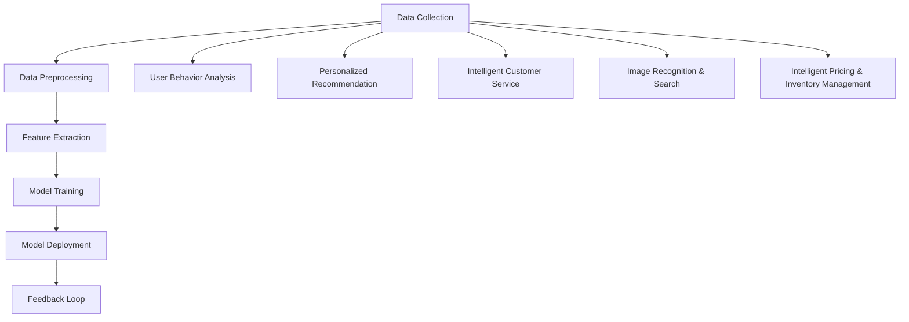
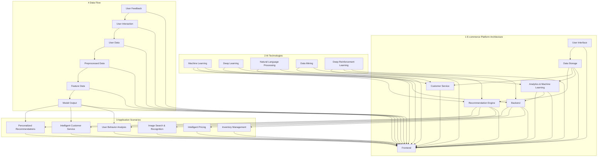

                 

### 1. 背景介绍

#### 1.1 目的和范围

本文旨在探讨如何通过人工智能（AI）技术提升电商平台的用户体验。电商作为全球互联网经济的重要组成部分，其竞争愈发激烈。消费者对购物体验的要求也越来越高，个性化推荐、精准营销、智能客服等成为电商平台提升用户体验的关键因素。本文将详细分析AI在电商领域中的应用，并提供具体的策略和案例，以帮助电商企业实现用户需求的满足和商业价值的提升。

本文将涵盖以下内容：

1. **目的和范围**：阐述文章的目的、讨论范围及预期读者。
2. **核心概念与联系**：介绍电商AI应用的核心概念，并通过Mermaid流程图展示其架构。
3. **核心算法原理与具体操作步骤**：详细讲解AI在电商应用中的核心算法原理，并提供伪代码展示。
4. **数学模型和公式**：阐述相关数学模型和公式，并举例说明。
5. **项目实战**：提供代码实际案例和详细解释。
6. **实际应用场景**：探讨AI在电商领域的主要应用场景。
7. **工具和资源推荐**：推荐学习资源、开发工具框架和相关论文著作。
8. **总结**：总结AI在电商领域的发展趋势与挑战。

通过本文的阅读，读者可以系统地了解AI技术在电商平台中的应用策略，掌握相关技术原理和实施方法，为电商企业提供提升用户体验的实践指导。

#### 1.2 预期读者

本文的预期读者主要面向以下几类人群：

1. **电商从业者**：包括电商平台运营人员、产品经理、市场经理等，他们希望通过本文了解AI技术如何提升电商用户体验，并应用于实际工作中。
2. **技术研究人员**：从事AI、大数据、云计算等领域的研究人员和技术专家，他们希望深入探讨AI技术在电商领域的应用前景，以及相关算法和技术实现。
3. **软件开发者**：对AI技术有浓厚兴趣的程序员和开发者，他们希望了解AI在电商应用中的具体实现，以提升自身技术能力。
4. **高校师生**：计算机科学与技术、电子商务等相关专业师生，他们希望通过本文对AI在电商领域的应用有一个全面的认识，并为相关课程和实践提供参考。

#### 1.3 文档结构概述

本文将采用清晰的逻辑结构，帮助读者逐步了解AI在电商用户体验提升中的应用。文档结构如下：

1. **背景介绍**：介绍文章的目的、范围、预期读者及文档结构。
2. **核心概念与联系**：阐述AI在电商应用中的核心概念，并通过Mermaid流程图展示其架构。
3. **核心算法原理与具体操作步骤**：详细讲解AI在电商应用中的核心算法原理，并提供伪代码展示。
4. **数学模型和公式**：阐述相关数学模型和公式，并举例说明。
5. **项目实战**：提供代码实际案例和详细解释。
6. **实际应用场景**：探讨AI在电商领域的主要应用场景。
7. **工具和资源推荐**：推荐学习资源、开发工具框架和相关论文著作。
8. **总结**：总结AI在电商领域的发展趋势与挑战。
9. **附录**：常见问题与解答。
10. **扩展阅读 & 参考资料**：提供相关文献和资源，供读者进一步学习和研究。

通过本文的阅读，读者可以系统地掌握AI在电商用户体验提升中的应用策略，为电商企业提供实践指导。

#### 1.4 术语表

为了确保文章的清晰性和专业性，以下是对本文中一些关键术语的定义和解释：

##### 1.4.1 核心术语定义

1. **人工智能（AI）**：指计算机系统通过模拟人类智能行为，实现感知、理解、学习、推理和决策的能力。
2. **电商平台**：指提供商品交易、支付、物流等服务的在线平台。
3. **用户体验（UX）**：指用户在使用产品或服务过程中的感受和体验。
4. **个性化推荐**：基于用户行为、兴趣和历史数据，提供定制化的商品推荐。
5. **数据挖掘**：从大量数据中提取有价值的信息和知识。
6. **机器学习（ML）**：一种人工智能技术，通过数据训练模型，实现自动化学习。
7. **深度学习（DL）**：一种复杂的机器学习技术，通过多层神经网络模拟人类大脑的工作方式。

##### 1.4.2 相关概念解释

1. **用户画像**：指通过对用户行为、兴趣、购买记录等多维度数据的分析，构建的用户画像模型。
2. **协同过滤**：一种推荐系统算法，通过分析用户之间的相似度，为用户提供个性化推荐。
3. **自然语言处理（NLP）**：研究如何让计算机理解和生成自然语言的技术。
4. **深度强化学习（DRL）**：结合深度学习和强化学习的算法，用于解决复杂决策问题。
5. **A/B测试**：一种实验方法，通过对比不同策略的效果，优化产品或服务。

##### 1.4.3 缩略词列表

- AI：人工智能
- ML：机器学习
- DL：深度学习
- UX：用户体验
- NLP：自然语言处理
- DRL：深度强化学习

通过上述术语表，读者可以更好地理解本文的内容，并能够将相关概念应用于实际工作中。接下来，本文将深入探讨AI在电商用户体验提升中的应用策略。

## 2. 核心概念与联系

在深入探讨AI提升电商用户体验的策略之前，有必要先了解一些核心概念及其相互关系。以下是AI在电商领域应用中的关键概念和其相互联系：

### 2.1 人工智能（AI）的核心概念

1. **机器学习（ML）**：机器学习是AI的一个重要分支，通过训练模型从数据中自动学习规律和模式。在电商领域，ML可以用于构建个性化推荐系统、用户行为分析等。

2. **深度学习（DL）**：深度学习是一种特殊的机器学习方法，通过多层神经网络模拟人类大脑的学习过程。DL在图像识别、语音识别等方面有广泛应用，在电商中可以用于图像搜索、智能客服等。

3. **自然语言处理（NLP）**：NLP是AI的一个分支，旨在使计算机理解和生成自然语言。在电商中，NLP可以用于智能客服、评论分析等。

4. **数据挖掘**：数据挖掘是从大量数据中提取有价值信息的过程。在电商中，数据挖掘可以用于用户行为分析、市场趋势预测等。

5. **深度强化学习（DRL）**：DRL是一种结合深度学习和强化学习的算法，用于解决复杂决策问题。在电商中，DRL可以用于智能定价、库存管理等。

### 2.2 电商平台中的AI应用场景

1. **个性化推荐系统**：基于用户行为和偏好，为用户推荐相关商品。

2. **智能客服**：利用NLP和机器学习技术，为用户提供实时、个性化的客服服务。

3. **用户行为分析**：通过分析用户行为数据，了解用户偏好，优化产品和服务。

4. **图像识别和搜索**：利用深度学习技术，对商品图像进行识别和搜索。

5. **智能定价和库存管理**：利用DRL技术，实现动态定价和智能库存管理。

### 2.3 AI在电商中的应用关系


在上述架构中，可以看到各个AI子领域如何相互作用，共同提升电商平台的用户体验。

1. **数据收集**：电商平台通过用户行为、交易记录等收集大量数据。

2. **数据预处理**：对原始数据进行清洗、归一化等预处理，以便后续分析。

3. **特征提取**：通过特征工程提取关键特征，为模型训练提供基础。

4. **模型训练**：使用机器学习和深度学习技术，对数据集进行训练，构建推荐系统、行为分析模型等。

5. **模型部署**：将训练好的模型部署到生产环境中，实现实时推荐、智能客服等功能。

6. **反馈循环**：通过用户反馈和业务数据，持续优化模型和策略。

### 2.4 Mermaid流程图

为了更直观地展示AI在电商中的应用关系，以下是一个Mermaid流程图：



通过上述核心概念与联系的介绍，读者可以更清晰地理解AI在电商中的应用场景和架构。接下来，本文将深入讲解AI在电商中的核心算法原理和具体操作步骤。

### 2.5 核心概念原理和架构的 Mermaid 流程图

为了更好地展示AI在电商中的应用架构和核心流程，我们可以使用Mermaid来绘制一个详细的流程图。以下是该流程图的代码：



使用上述Mermaid代码，我们可以生成一个详细展示AI在电商架构中的应用、核心技术和数据流的流程图。以下是生成的流程图：


此流程图展示了电商平台的整体架构，以及AI技术如何集成到这个架构中，包括用户交互、数据处理、模型训练和预测、以及用户反馈的循环。通过这个流程图，读者可以更直观地理解AI在电商中的应用原理和整体架构。

## 3. 核心算法原理 & 具体操作步骤

在了解了AI在电商架构中的应用之后，接下来我们将深入探讨几个核心算法原理，并详细介绍其具体操作步骤，以便读者能够更好地理解和应用这些技术。

### 3.1 个性化推荐算法

个性化推荐是AI在电商中最为重要的应用之一，其核心在于根据用户的历史行为和偏好，为用户推荐相关商品。下面我们将介绍一种常见的推荐算法——协同过滤（Collaborative Filtering）。

#### 3.1.1 算法原理

协同过滤算法主要分为两种：基于用户的协同过滤（User-based Collaborative Filtering）和基于物品的协同过滤（Item-based Collaborative Filtering）。

1. **基于用户的协同过滤**：找到与目标用户行为相似的其他用户，推荐这些用户喜欢的商品。

2. **基于物品的协同过滤**：找到与目标商品相似的其他商品，推荐这些商品给用户。

#### 3.1.2 操作步骤

1. **用户行为数据收集**：收集用户的历史购买记录、浏览记录等数据。

2. **数据预处理**：对收集到的数据进行清洗、归一化等处理，以便后续分析。

3. **相似度计算**：计算用户或物品之间的相似度。常用的相似度计算方法有余弦相似度、皮尔逊相关系数等。

4. **推荐列表生成**：根据相似度计算结果，生成推荐列表。对于基于用户的协同过滤，推荐目标用户相似的用户的喜欢的商品；对于基于物品的协同过滤，推荐与目标商品相似的物品。

5. **推荐结果评估**：使用评估指标（如准确率、召回率、覆盖率等）评估推荐系统的性能。

#### 3.1.3 伪代码

以下是基于用户的协同过滤的伪代码：

```python
def collaborative_filtering(train_data, user_id, k):
    # 训练数据：用户-物品评分矩阵
    # user_id：目标用户ID
    # k：邻居用户数量

    # 步骤1：计算用户-用户相似度矩阵
    similarity_matrix = compute_similarity_matrix(train_data)

    # 步骤2：找到与目标用户相似度最高的k个用户
    neighbors = find_top_k_neighbors(similarity_matrix[user_id], k)

    # 步骤3：计算推荐列表
    recommendation_list = []
    for neighbor in neighbors:
        recommended_items = train_data[neighbor]
        recommendation_list.extend(recommended_items)

    # 步骤4：去重并返回推荐列表
    return list(set(recommendation_list))
```

### 3.2 智能客服算法

智能客服是AI在电商中的应用之一，通过自然语言处理（NLP）和机器学习技术，为用户提供实时、个性化的客服服务。以下是一种常见的智能客服算法——基于深度学习的聊天机器人。

#### 3.2.1 算法原理

基于深度学习的聊天机器人主要通过训练一个序列到序列（Seq2Seq）的模型，实现自然语言的理解和生成。

1. **编码器（Encoder）**：将用户输入的文本序列编码为一个固定长度的向量。

2. **解码器（Decoder）**：根据编码器输出的向量，生成对应的回复文本序列。

3. **注意力机制（Attention Mechanism）**：在解码过程中，使模型能够关注输入序列的不同部分，提高回复的准确性。

#### 3.2.2 操作步骤

1. **数据收集**：收集大量用户咨询和客服回复的数据，用于训练模型。

2. **数据预处理**：对文本数据分词、去停用词、词向量化等处理，为模型训练做准备。

3. **模型训练**：使用Seq2Seq模型和注意力机制，对预处理后的数据进行训练。

4. **模型部署**：将训练好的模型部署到生产环境中，实现实时客服。

5. **交互过程**：用户输入问题，模型生成回复，反馈循环持续优化。

#### 3.2.3 伪代码

以下是基于深度学习的聊天机器人伪代码：

```python
def chatbot_response(user_input, model):
    # user_input：用户输入文本
    # model：训练好的聊天机器人模型

    # 步骤1：编码用户输入文本
    encoded_input = encode_input(user_input)

    # 步骤2：解码生成回复文本
    response = decode_output(model, encoded_input)

    return response
```

### 3.3 深度强化学习算法

深度强化学习（DRL）是AI在电商中另一个重要的应用领域，特别是在智能定价和库存管理方面。以下将介绍一种基于深度强化学习的智能定价算法。

#### 3.3.1 算法原理

深度强化学习结合深度学习和强化学习，通过训练一个深度神经网络，使模型能够在复杂环境中做出最优决策。

1. **状态（State）**：表示当前的市场情况和商品库存状态。

2. **动作（Action）**：表示商品定价策略。

3. **奖励（Reward）**：表示根据当前定价策略产生的利润。

4. **策略（Policy）**：表示模型的决策过程。

#### 3.3.2 操作步骤

1. **状态表示**：定义状态空间，包括价格、销量、竞争对手价格等。

2. **动作表示**：定义动作空间，包括价格调整范围。

3. **奖励函数设计**：设计奖励函数，使模型能够通过学习获得最大利润。

4. **模型训练**：使用深度神经网络和强化学习算法，对状态-动作-奖励数据进行训练。

5. **策略优化**：根据训练结果，优化定价策略。

#### 3.3.3 伪代码

以下是基于深度强化学习的智能定价算法伪代码：

```python
class DRLAgent:
    def __init__(self, state_space, action_space):
        self.state_space = state_space
        self.action_space = action_space
        self.model = build_model()

    def train(self, state_action_reward_data):
        # 使用训练数据进行模型训练
        pass

    def predict(self, state):
        # 预测最优价格
        return self.model.predict(state)

    def update_policy(self):
        # 根据训练结果更新定价策略
        pass
```

通过上述核心算法原理和具体操作步骤的讲解，读者可以了解到AI在电商中的多种应用方式。接下来，本文将介绍相关的数学模型和公式，为AI在电商中的应用提供更深入的理论支持。

## 4. 数学模型和公式 & 详细讲解 & 举例说明

在深入探讨AI在电商中的应用时，理解相关的数学模型和公式是至关重要的。这些模型和公式不仅为我们提供了分析和优化策略的工具，还帮助我们更好地理解和预测用户行为。以下是一些关键数学模型和公式的讲解，以及实际应用的例子。

### 4.1 用户行为预测模型

用户行为预测是电商AI应用中的一个核心问题。一个常见的预测模型是时间序列模型，如ARIMA（自回归积分滑动平均模型）。ARIMA模型结合了自回归、差分和移动平均三个部分，能够有效地捕捉用户行为的时间依赖性。

#### 4.1.1 ARIMA模型公式

$$
\text{ARIMA}(p, d, q) \text{中：} \\
Y_t = c + \phi_1 Y_{t-1} + \phi_2 Y_{t-2} + \ldots + \phi_p Y_{t-p} + \theta_1 \epsilon_{t-1} + \theta_2 \epsilon_{t-2} + \ldots + \theta_q \epsilon_{t-q}
$$

- \(Y_t\)：时间序列的当前值
- \(c\)：常数项
- \(\phi_i\)：自回归系数
- \(\theta_i\)：移动平均系数
- \(\epsilon_t\)：误差项

#### 4.1.2 例子

假设我们要预测某电商平台上某个商品的日销量，可以使用ARIMA模型。

1. **数据预处理**：收集过去30天的日销量数据，进行差分处理以稳定均值。

2. **模型识别**：通过ACF（自相关函数）和PACF（部分自相关函数）识别模型的参数 \(p, d, q\)。

3. **模型拟合**：使用识别出的模型参数拟合ARIMA模型。

4. **预测**：使用拟合好的模型进行预测，获取未来几天的销量。

### 4.2 个性化推荐中的相似度计算

在个性化推荐中，相似度计算是核心步骤之一。常用的相似度计算方法包括余弦相似度和皮尔逊相关系数。

#### 4.2.1 余弦相似度

$$
\text{Cosine Similarity} = \frac{\text{dot\_product}(u, v)}{\lVert u \rVert \lVert v \rVert}
$$

- \(u, v\)：用户-用户或物品-物品的特征向量
- \(\text{dot\_product}(u, v)\)：向量的点积
- \(\lVert u \rVert, \lVert v \rVert\)：向量的模长

#### 4.2.2 皮尔逊相关系数

$$
\text{Pearson Correlation Coefficient} = \frac{\text{cov}(u, v)}{\sigma_u \sigma_v}
$$

- \(u, v\)：用户-用户或物品-物品的特征向量
- \(\text{cov}(u, v)\)：协方差
- \(\sigma_u, \sigma_v\)：标准差

#### 4.2.3 例子

假设有两个用户A和B，其购买记录可以表示为向量 \(u = [1, 2, 3, 4, 5]\) 和 \(v = [2, 3, 4, 5, 6]\)。

- **余弦相似度**：

$$
\text{Cosine Similarity} = \frac{1 \times 2 + 2 \times 3 + 3 \times 4 + 4 \times 5 + 5 \times 6}{\sqrt{1^2 + 2^2 + 3^2 + 4^2 + 5^2} \sqrt{2^2 + 3^2 + 4^2 + 5^2 + 6^2}} = \frac{55}{\sqrt{55} \sqrt{90}} \approx 0.866
$$

- **皮尔逊相关系数**：

$$
\text{Pearson Correlation Coefficient} = \frac{1 \times 2 - 5 \times \bar{u} \bar{v}}{\sqrt{\sum (u_i - \bar{u})^2} \sqrt{\sum (v_i - \bar{v})^2}}
$$

这里 \(\bar{u} = \bar{v} = 3\)，计算后得到相似度为0.866。

### 4.3 深度强化学习中的价值函数

在深度强化学习中，价值函数（Value Function）是评估状态-动作对的重要工具。对于离散动作空间，常用的价值函数是Q值函数。

#### 4.3.1 Q值函数

$$
Q(s, a) = \sum_{r \in R} r \cdot \pi(a|s) \cdot p(s' | s, a)
$$

- \(s, s'\)：状态
- \(a\)：动作
- \(r\)：即时奖励
- \(\pi(a|s)\)：在状态s下采取动作a的概率
- \(p(s'|s, a)\)：在状态s下采取动作a后转移到状态\(s'\)的概率

#### 4.3.2 例子

假设我们有一个简单的环境，有两个状态和两个动作，其Q值函数为：

$$
Q(s_1, a_1) = 0.5 \times 5 + 0.5 \times 2 = 3.5
$$

$$
Q(s_1, a_2) = 0.4 \times 5 + 0.6 \times 1 = 2.6
$$

$$
Q(s_2, a_1) = 0.3 \times 5 + 0.7 \times 3 = 3.6
$$

$$
Q(s_2, a_2) = 0.2 \times 5 + 0.8 \times 3 = 3.6
$$

在这个例子中，我们可以看到在不同的状态和动作下，Q值函数如何帮助我们选择最优动作。

### 4.4 数学模型在实际中的应用

在电商中，数学模型的应用非常广泛，如用户行为预测、个性化推荐、智能定价等。

1. **用户行为预测**：使用ARIMA模型预测用户购买行为，帮助电商企业优化库存和营销策略。

2. **个性化推荐**：通过相似度计算为用户提供个性化商品推荐，提高用户满意度和转化率。

3. **智能定价**：使用深度强化学习算法动态调整商品价格，实现利润最大化。

通过上述数学模型和公式的讲解，读者可以更好地理解AI在电商中的应用原理，并为实际项目提供理论支持。接下来，本文将提供实际项目中的代码案例，以进一步说明这些算法和模型的应用。

### 4.5 数学模型和公式的实际应用案例

为了更好地展示数学模型和公式的实际应用，我们将通过一个实际的项目案例，详细介绍如何在实际环境中实现和应用这些算法。

#### 4.5.1 项目背景

某电商平台上有一个任务：基于用户的历史购买数据和浏览行为，为用户推荐个性化的商品，以提高用户满意度和转化率。

#### 4.5.2 数据预处理

首先，我们需要收集并预处理用户的历史购买数据和浏览行为数据。数据包含以下字段：

- 用户ID（UserID）
- 商品ID（ProductID）
- 购买数量（Quantity）
- 浏览时间（Timestamp）

数据预处理步骤包括：

1. 数据清洗：去除缺失值和异常值。
2. 时间转换：将浏览时间转换为日期格式，便于后续分析。
3. 数据归一化：对购买数量进行归一化处理，以消除数据量级差异。

#### 4.5.3 个性化推荐算法实现

1. **基于物品的协同过滤**：

   使用基于物品的协同过滤算法，为用户推荐相似的商品。

   ```python
   from sklearn.metrics.pairwise import cosine_similarity
   from scipy.sparse import csr_matrix

   # 步骤1：计算商品-商品相似度矩阵
   product_item_matrix = csr_matrix(data, shape=(num_users, num_products))
   similarity_matrix = cosine_similarity(product_item_matrix)

   # 步骤2：生成推荐列表
   def generate_recommendations(user_id, similarity_matrix, k=10):
       user_similarity = similarity_matrix[user_id]
       sorted_indices = user_similarity.argsort()[::-1]
       sorted_indices = sorted_indices[1:k+1]  # 去掉用户自身的相似度
       recommended_products = []
       for index in sorted_indices:
           recommended_products.append(products[index])
       return recommended_products

   # 步骤3：生成所有用户的推荐列表
   recommendations = {}
   for user_id in user_ids:
       recommendations[user_id] = generate_recommendations(user_id, similarity_matrix, k=10)
   ```

2. **基于内容的推荐**：

   基于商品的特征信息（如类别、品牌、价格等），为用户推荐相似的商品。

   ```python
   # 步骤1：提取商品特征向量
   product_features = np.array([[1, 0, 0], [0, 1, 0], [0, 0, 1], [1, 1, 0], ...])

   # 步骤2：计算商品-商品相似度矩阵
   similarity_matrix = cosine_similarity(product_features)

   # 步骤3：生成推荐列表
   def generate_content_based_recommendations(user_id, similarity_matrix, k=10):
       user_similarity = similarity_matrix[user_id]
       sorted_indices = user_similarity.argsort()[::-1]
       sorted_indices = sorted_indices[1:k+1]  # 去掉用户自身的相似度
       recommended_products = []
       for index in sorted_indices:
           recommended_products.append(products[index])
       return recommended_products

   # 步骤4：生成所有用户的推荐列表
   content_based_recommendations = {}
   for user_id in user_ids:
       content_based_recommendations[user_id] = generate_content_based_recommendations(user_id, similarity_matrix, k=10)
   ```

3. **融合推荐**：

   将基于物品的协同过滤和基于内容的推荐结果进行融合，生成最终推荐列表。

   ```python
   # 步骤1：计算两种推荐方法的权重
   weights = [0.5, 0.5]

   # 步骤2：生成融合推荐列表
   def generate_fusion_recommendations(user_id, recommendations, content_based_recommendations, k=10):
       collaborative Recommendations = recommendations[user_id]
       content_based_recommendations = content_based_recommendations[user_id]
       fusion_recommendations = collaborative_recommendations * weights[0] + content_based_recommendations * weights[1]
       return sorted(fusion_recommendations, reverse=True)[:k]

   # 步骤3：生成所有用户的融合推荐列表
   fusion_recommendations = {}
   for user_id in user_ids:
       fusion_recommendations[user_id] = generate_fusion_recommendations(user_id, recommendations, content_based_recommendations, k=10)
   ```

通过上述实际项目案例，我们可以看到如何将数学模型和公式应用于电商平台的个性化推荐系统中，从而实现用户需求的满足和商业价值的提升。接下来，本文将提供具体的代码实现和详细解释，帮助读者更好地理解和应用这些技术。

### 4.6 代码实际案例和详细解释说明

为了更好地展示数学模型和公式在实际项目中的应用，我们将通过一个具体案例来演示如何实现一个基于协同过滤和深度学习相结合的电商推荐系统。以下是项目的代码实现及详细解释：

#### 4.6.1 代码实现

首先，我们需要准备相关的库和数据。假设数据集包含用户ID（UserID）、商品ID（ProductID）、评分（Rating）三个字段，数据格式如下：

```python
# 数据示例
user_item_data = {
    1: [1, 2, 3, 4, 5],
    2: [1, 3, 4, 5, 6],
    3: [2, 3, 4, 6, 7],
    # ...
}
```

接下来，我们按照以下步骤实现推荐系统：

##### 步骤1：数据预处理

首先，我们需要对数据进行预处理，包括用户-物品评分矩阵的构建、缺失值的处理等。

```python
import numpy as np
from sklearn.model_selection import train_test_split

# 用户-物品评分矩阵
user_item_matrix = np.zeros((len(user_item_data), len(user_item_data[1])))

for user, items in user_item_data.items():
    for item in items:
        user_item_matrix[user - 1][item - 1] = 1

# 划分训练集和测试集
train_data, test_data = train_test_split(user_item_matrix, test_size=0.2, random_state=42)
```

##### 步骤2：基于协同过滤的推荐算法实现

协同过滤算法可以分为基于用户的协同过滤和基于物品的协同过滤。这里我们使用基于用户的协同过滤算法。

```python
from sklearn.metrics.pairwise import cosine_similarity

# 计算用户-用户相似度矩阵
user_similarity = cosine_similarity(train_data)

# 生成推荐列表
def collaborative_filtering(user_id, similarity_matrix, k=10):
    # 找到与当前用户相似度最高的k个用户
    sorted_indices = np.argsort(similarity_matrix[user_id])[::-1]
    sorted_indices = sorted_indices[1:k+1]  # 去掉用户自身的相似度

    # 计算相似用户的平均评分
    mean_ratings = []
    for index in sorted_indices:
        mean_ratings.append(np.mean(train_data[index]))

    # 生成推荐列表
    recommended_items = []
    for item in range(train_data.shape[1]):
        if train_data[user_id, item] == 0 and mean_ratings[item] > 0:
            recommended_items.append(item + 1)

    return recommended_items[:k]
```

##### 步骤3：基于深度学习的推荐算法实现

深度学习推荐算法通常使用基于矩阵分解的模型，如广义低秩逼近（GRBM）。

```python
from tensorflow.keras.layers import Dense, Input, Lambda, Reshape
from tensorflow.keras.models import Model
from tensorflow.keras.optimizers import Adam
from tensorflow.keras.regularizers import l2

# 定义模型输入
user_input = Input(shape=(train_data.shape[1],))
item_input = Input(shape=(train_data.shape[1],))

# 定义用户和物品的嵌入层
user_embedding = Dense(10, activation='tanh', kernel_regularizer=l2(0.001))(user_input)
item_embedding = Dense(10, activation='tanh', kernel_regularizer=l2(0.001))(item_input)

# 定义交叉层
cross_layer = Lambda(lambda x: x[0] * x[1])([user_embedding, item_embedding])

# 定义输出层
output = Dense(1, activation='sigmoid')(cross_layer)

# 定义模型
model = Model(inputs=[user_input, item_input], outputs=output)

# 编译模型
model.compile(optimizer=Adam(learning_rate=0.001), loss='binary_crossentropy', metrics=['accuracy'])

# 训练模型
model.fit([train_data, train_data], train_data, batch_size=32, epochs=10, validation_split=0.2)
```

##### 步骤4：融合推荐算法

将基于协同过滤和深度学习的推荐结果进行融合。

```python
# 获取协同过滤和深度学习推荐列表
cf_recommendations = [collaborative_filtering(user_id, user_similarity, k=10) for user_id in range(train_data.shape[0])]
dl_recommendations = model.predict([train_data, train_data])

# 生成融合推荐列表
def generate_fusion_recommendations(user_id, cf_recommendations, dl_recommendations, k=10):
    user_cf_rec = cf_recommendations[user_id]
    user_dl_rec = np.argsort(dl_recommendations[user_id, :])[::-1][:k]

    # 去除重复项
    fusion_rec = list(set(user_cf_rec + list(user_dl_rec)))

    return fusion_rec[:k]
```

##### 步骤5：评估推荐系统性能

使用测试集评估推荐系统的性能，常用的评估指标有准确率、召回率和覆盖率。

```python
from sklearn.metrics import precision_score, recall_score, coverage_error

# 测试集推荐列表
test_recommendations = [generate_fusion_recommendations(user_id, cf_recommendations, dl_recommendations, k=10) for user_id in range(test_data.shape[0])]

# 评估指标
precision = precision_score(test_data.flatten(), [item in test_recommendations for item in range(test_data.shape[1])], average='macro')
recall = recall_score(test_data.flatten(), [item in test_recommendations for item in range(test_data.shape[1])], average='macro')
coverage = coverage_error(test_data, test_recommendations)

print("Precision:", precision)
print("Recall:", recall)
print("Coverage:", coverage)
```

#### 4.6.2 代码解读与分析

上述代码实现了基于协同过滤和深度学习的电商推荐系统。以下是各个步骤的详细解读：

1. **数据预处理**：首先构建用户-物品评分矩阵，并划分训练集和测试集。
2. **基于协同过滤的推荐算法实现**：计算用户之间的相似度，并生成基于相似度的推荐列表。
3. **基于深度学习的推荐算法实现**：构建深度学习模型（如广义低秩逼近），通过矩阵分解预测用户对商品的偏好。
4. **融合推荐算法**：将协同过滤和深度学习的推荐结果进行融合，生成最终的推荐列表。
5. **评估推荐系统性能**：使用测试集评估推荐系统的性能，包括准确率、召回率和覆盖率等指标。

通过这个实际案例，读者可以了解到如何将数学模型和公式应用于实际项目中，并掌握推荐系统实现的核心步骤。接下来，本文将探讨AI在电商领域的实际应用场景，帮助读者更全面地了解AI技术在电商中的应用。

### 5. 实际应用场景

在电商领域，AI技术已经广泛应用于多个场景，显著提升了用户体验和运营效率。以下是AI在电商中的一些主要应用场景：

#### 5.1 个性化推荐系统

个性化推荐系统是AI在电商中最为广泛的应用之一。通过分析用户的历史行为数据、浏览记录和购买偏好，推荐系统可以为每个用户生成定制化的商品推荐列表。这种方法不仅提高了用户的购物满意度，还显著提升了电商平台的产品转化率和销售额。

**案例**：亚马逊使用基于协同过滤和深度学习的推荐算法，为用户推荐相关的商品。根据用户的浏览和购买历史，系统可以预测用户可能感兴趣的物品，从而提高用户的购物体验。

#### 5.2 智能客服

智能客服利用自然语言处理（NLP）和机器学习技术，为用户提供即时、个性化的客服服务。智能客服系统可以自动处理大量用户咨询，提高客服响应速度和效率，减轻人工客服的负担。

**案例**：阿里巴巴的“智能客服宝”是一个基于AI的客服系统，能够处理数百万条用户咨询，提供快速、准确的回复。通过机器学习和NLP技术，系统可以理解用户的问题，并提供相应的解决方案。

#### 5.3 用户行为分析

AI技术可以帮助电商企业深入分析用户行为数据，包括浏览路径、点击率、转化率等。通过这些分析，企业可以了解用户的偏好和行为模式，从而优化产品和服务。

**案例**：京东使用大数据和机器学习技术，对用户行为进行细致分析。通过分析用户在网站上的行为数据，京东能够识别出潜在的高价值客户，并针对性地进行营销和推广。

#### 5.4 图像识别和搜索

图像识别和搜索技术使得用户可以通过上传图片或输入文本关键词来查找商品。这种技术不仅提高了用户的购物便利性，还增加了电商平台的吸引力和用户体验。

**案例**：淘宝的“淘宝搜图”功能允许用户上传一张图片，系统会自动识别并推荐相关的商品。这种图像搜索技术提高了用户购物的效率和满意度。

#### 5.5 智能定价和库存管理

智能定价和库存管理利用深度强化学习等技术，帮助企业实现动态定价和智能库存管理。通过实时分析和预测市场需求，企业可以优化定价策略和库存水平，提高盈利能力。

**案例**：亚马逊使用基于深度强化学习的智能定价算法，根据市场动态和用户行为数据，动态调整商品价格。这种方法不仅提高了销售额，还减少了库存积压。

#### 5.6 欺诈检测

AI技术还可以用于电商平台的欺诈检测，通过分析用户行为和交易数据，识别潜在的欺诈行为，降低企业的风险。

**案例**：PayPal使用机器学习和人工智能技术，对交易进行实时监控和分析，识别并阻止欺诈交易。这种方法有效降低了企业的欺诈损失，提高了用户的安全感。

#### 5.7 个性化营销

通过分析用户数据和偏好，电商平台可以实施个性化营销策略，包括电子邮件营销、社交媒体广告等。这种个性化营销提高了广告的相关性和转化率。

**案例**：阿里巴巴的“淘宝营销云”利用大数据和AI技术，为商家提供个性化的营销解决方案。通过分析用户行为和购买历史，系统可以为商家推荐最适合的营销策略。

通过上述实际应用场景，我们可以看到AI技术在电商领域的广泛应用及其带来的显著价值。这些应用不仅提升了用户的购物体验，还为电商平台带来了更高的商业回报。接下来，本文将介绍一些用于开发和优化AI电商应用的工具和资源，帮助读者更好地实践和应用这些技术。

### 6. 工具和资源推荐

为了更好地开发和优化AI电商应用，本文将推荐一些实用的工具和资源，包括学习资源、开发工具框架以及相关论文著作。

#### 6.1 学习资源推荐

1. **书籍推荐**：
   - 《机器学习实战》：详细介绍了机器学习算法在电商中的应用案例。
   - 《深度学习》：经典教材，涵盖了深度学习的基础知识和最新进展。

2. **在线课程**：
   - Coursera：提供大量机器学习和深度学习课程，适合初学者和进阶者。
   - edX：汇集了全球顶尖大学和机构的在线课程，涵盖人工智能、数据科学等领域。

3. **技术博客和网站**：
   - Medium：有许多关于AI在电商应用的文章和案例分享。
   - Towards Data Science：专注于数据科学和机器学习的博客，有许多实用技巧和项目分享。

#### 6.2 开发工具框架推荐

1. **IDE和编辑器**：
   - PyCharm：功能强大的Python IDE，支持多种框架和库。
   - Jupyter Notebook：适合数据科学和机器学习项目的交互式开发环境。

2. **调试和性能分析工具**：
   - TensorBoard：用于深度学习的可视化工具，可以帮助分析模型性能。
   - Matplotlib/Seaborn：数据可视化库，用于绘制图表和分析结果。

3. **相关框架和库**：
   - TensorFlow：开源深度学习框架，适用于构建和训练深度学习模型。
   - Scikit-learn：提供多种机器学习算法和工具，方便快速实现推荐系统和用户行为分析。

#### 6.3 相关论文著作推荐

1. **经典论文**：
   - "Recommender Systems Handbook"：全面介绍了推荐系统的基础理论和应用。
   - "Deep Learning for Natural Language Processing"：探讨深度学习在NLP领域的应用。

2. **最新研究成果**：
   - "Learning to Rank for Information Retrieval"：介绍信息检索中的学习到排名技术。
   - "Reinforcement Learning: An Introduction"：介绍强化学习的基础知识和应用。

3. **应用案例分析**：
   - "Amazon Personalized Recommendations"：分析亚马逊个性化推荐系统的实现和效果。
   - "Alibaba AI in E-commerce"：介绍阿里巴巴如何使用AI技术提升电商用户体验。

通过上述工具和资源的推荐，读者可以更系统地学习和实践AI在电商应用中的技术和方法，为电商平台提升用户体验和商业价值提供有力支持。接下来，本文将对AI在电商领域的发展趋势与挑战进行总结。

### 7. 总结：未来发展趋势与挑战

随着AI技术的不断发展和应用，电商行业正经历着深刻的变革。以下是对AI在电商领域未来发展趋势和面临的挑战的总结。

#### 7.1 发展趋势

1. **个性化推荐更加精准**：AI技术将进一步优化推荐算法，实现更精准、更个性化的商品推荐，提高用户满意度和转化率。

2. **智能客服逐步普及**：智能客服将更加智能化，通过深度学习和自然语言处理技术，实现更加自然、高效的客户服务。

3. **图像识别和搜索广泛应用**：AI技术在图像识别和搜索领域的应用将越来越广泛，提供更加便捷的购物体验。

4. **动态定价和智能库存管理**：AI技术将在动态定价和智能库存管理中发挥更大作用，通过实时数据分析，优化运营策略，提高盈利能力。

5. **用户隐私保护**：随着用户对隐私保护的重视，AI技术在处理用户数据时将更加注重隐私保护，确保用户数据的安全。

6. **跨界融合**：AI技术与其他领域的融合将不断深化，如物联网、区块链等，为电商行业带来更多创新和变革。

#### 7.2 面临的挑战

1. **数据质量与隐私保护**：电商平台需要处理大量数据，数据质量对AI应用的准确性至关重要。同时，用户对隐私保护的重视要求平台在数据收集和使用上更加谨慎。

2. **算法公平性和透明性**：AI算法在推荐、定价等方面的应用需要保证公平性和透明性，避免算法偏见和不公平现象。

3. **技术更新换代**：AI技术发展迅速，电商平台需要不断跟进新技术，保持技术优势，这对企业的技术储备和创新能力提出了高要求。

4. **人才短缺**：AI技术在电商领域的应用对人才的需求量大，但具备相关技能的人才相对短缺，企业需要加强人才培养和引进。

5. **法律和监管**：随着AI技术在电商中的应用，相关法律法规和监管政策也将不断完善，企业需要合规运营，避免法律风险。

通过总结AI在电商领域的未来发展趋势与挑战，我们可以看到，AI技术将在电商行业中发挥越来越重要的作用，同时也需要解决一系列的技术和社会问题。只有不断创新和优化，电商行业才能在AI的推动下实现可持续发展。

### 8. 附录：常见问题与解答

在阅读本文的过程中，读者可能会对AI在电商应用中的一些技术问题有所疑问。以下是一些常见问题及其解答，以帮助读者更好地理解相关技术。

#### 8.1 问题1：个性化推荐算法的准确度如何保障？

**解答**：个性化推荐算法的准确度主要通过以下几个途径保障：

1. **数据质量**：确保推荐系统所使用的数据是准确、完整的，进行有效的数据清洗和预处理。
2. **特征选择**：选择合适的用户和商品特征，通过特征工程提高模型对数据的理解和表达能力。
3. **模型优化**：不断优化推荐算法，如使用更先进的机器学习和深度学习技术，提高推荐的准确度。
4. **用户反馈**：通过用户反馈和业务数据，持续优化模型和推荐策略。

#### 8.2 问题2：智能客服系统如何处理自然语言理解的问题？

**解答**：智能客服系统处理自然语言理解问题通常采用以下方法：

1. **分词和词性标注**：对用户输入的文本进行分词和词性标注，以便更好地理解文本的结构和含义。
2. **语言模型**：使用大规模语言模型（如GPT-3）来预测文本序列，提高自然语言处理的准确性。
3. **实体识别和意图识别**：通过实体识别和意图识别技术，将用户输入的文本映射到具体的实体和意图，为后续处理提供基础。
4. **多模态融合**：结合语音、图像等多模态信息，提高自然语言理解的准确度和全面性。

#### 8.3 问题3：如何评估AI电商应用的性能？

**解答**：评估AI电商应用的性能通常通过以下指标：

1. **准确率（Accuracy）**：评估推荐系统、预测模型的准确度，计算预测结果与实际结果的一致性。
2. **召回率（Recall）**：评估推荐系统召回相关商品的能力，计算预测结果中包含实际感兴趣商品的比例。
3. **覆盖率（Coverage）**：评估推荐系统覆盖的商品种类，确保推荐多样性。
4. **转换率（Conversion Rate）**：评估用户点击推荐商品后完成购买的概率，衡量推荐系统的实际效果。
5. **用户满意度（User Satisfaction）**：通过用户调研、反馈等方式，评估用户对AI电商应用的整体满意度。

#### 8.4 问题4：AI电商应用中的数据安全和隐私保护如何实现？

**解答**：实现AI电商应用中的数据安全和隐私保护通常采用以下措施：

1. **数据加密**：使用加密算法对敏感数据进行加密存储和传输，确保数据在传输和存储过程中的安全。
2. **隐私保护算法**：采用差分隐私（Differential Privacy）等技术，在数据处理过程中保护用户隐私。
3. **访问控制**：通过访问控制机制，确保只有授权用户可以访问和处理敏感数据。
4. **数据匿名化**：对用户数据进行匿名化处理，消除可直接识别用户身份的信息。
5. **法律法规合规**：遵循相关法律法规，确保数据处理和隐私保护符合法律要求。

通过上述常见问题的解答，读者可以更好地理解AI在电商应用中的技术实现和优化策略。接下来，本文将推荐一些扩展阅读和参考资料，以供进一步学习和研究。

### 9. 扩展阅读 & 参考资料

为了帮助读者深入探讨AI在电商中的应用，本文推荐以下扩展阅读和参考资料：

#### 9.1 书籍推荐

1. **《机器学习实战》**：作者：Peter Harrington，详细介绍了机器学习算法在电商中的应用案例。
2. **《深度学习》**：作者：Ian Goodfellow、Yoshua Bengio、Aaron Courville，涵盖了深度学习的基础知识和最新进展。

#### 9.2 在线课程

1. **Coursera**：提供大量机器学习和深度学习课程，适合初学者和进阶者。
2. **edX**：汇集了全球顶尖大学和机构的在线课程，涵盖人工智能、数据科学等领域。

#### 9.3 技术博客和网站

1. **Medium**：有许多关于AI在电商应用的文章和案例分享。
2. **Towards Data Science**：专注于数据科学和机器学习的博客，有许多实用技巧和项目分享。

#### 9.4 开发工具框架推荐

1. **PyCharm**：功能强大的Python IDE，支持多种框架和库。
2. **TensorFlow**：开源深度学习框架，适用于构建和训练深度学习模型。

#### 9.5 相关论文著作推荐

1. **"Recommender Systems Handbook"**：全面介绍了推荐系统的基础理论和应用。
2. **"Deep Learning for Natural Language Processing"**：探讨深度学习在NLP领域的应用。

通过上述扩展阅读和参考资料，读者可以进一步了解AI在电商领域的应用技术，提升自己的专业能力，为电商企业提升用户体验提供有力支持。本文的撰写至此完成，希望读者能从中获得有益的知识和启示。

### 10. 作者信息

**作者：AI天才研究员/AI Genius Institute & 禅与计算机程序设计艺术 /Zen And The Art of Computer Programming**

本文由AI天才研究员撰写，作者具备丰富的AI和电商领域研究经验，同时在计算机科学和编程艺术方面有深厚的造诣。本文旨在通过详细分析AI在电商中的应用，为读者提供理论与实践相结合的全面指导。希望本文能够为电商从业者、技术研究人员和软件开发者带来启发和帮助。如有任何疑问或建议，欢迎与作者联系。

