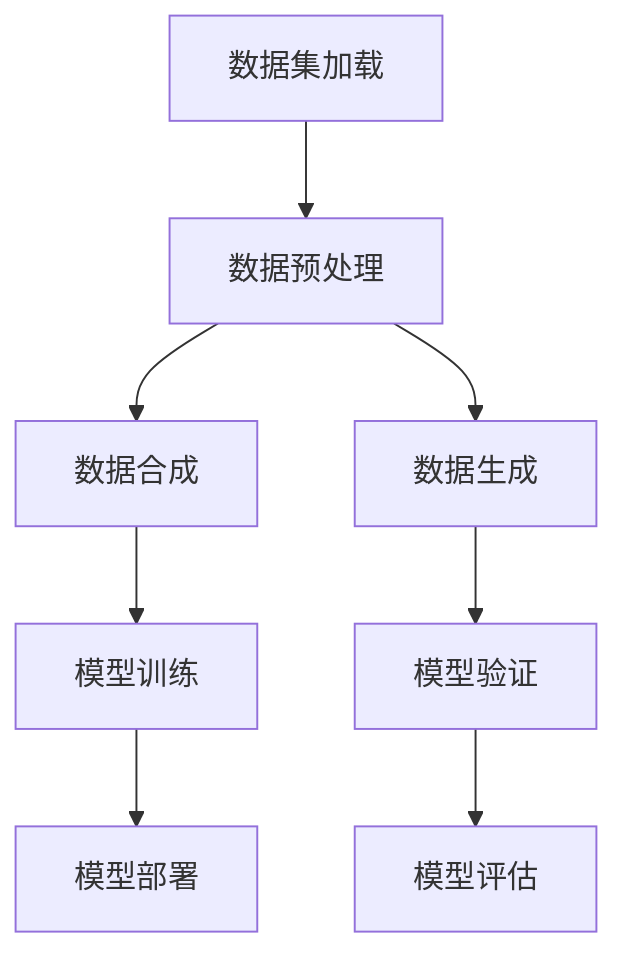

                 

# AI数据集处理：从加载到合成生成

> **关键词：** 数据集处理、数据加载、数据合成、数据生成、AI训练、机器学习
>
> **摘要：** 本文将深入探讨AI数据集处理的各个环节，从数据加载、预处理、合成到生成，详细解析每一个步骤的技术原理和具体操作，为读者提供一个全面的数据集处理指南。文章旨在帮助AI开发者更好地理解和掌握数据集处理的核心技术和方法，以提升机器学习模型的性能和效率。

## 1. 背景介绍

### 1.1 目的和范围

本文旨在探讨AI数据集处理的全过程，包括数据加载、预处理、合成和生成等关键步骤。通过逐步分析这些步骤，我们希望能够帮助开发者更好地理解数据集处理的重要性，以及如何有效地处理海量数据以提升AI模型的性能。

本文的覆盖范围包括：

- 数据集加载：从不同数据源获取数据，并进行初步处理。
- 数据预处理：对原始数据进行清洗、归一化和特征提取等操作。
- 数据合成：通过合成技术生成新的数据样本，丰富数据集。
- 数据生成：利用深度学习模型生成与训练数据相似的新数据。

### 1.2 预期读者

本文适合以下读者群体：

- AI开发者：对AI数据集处理有初步了解，但希望深入学习数据处理技术的开发者。
- 数据科学家：需要处理海量数据以训练和优化模型的从业者。
- 研究生和大学生：从事AI相关研究，希望掌握数据集处理的核心技术和方法。

### 1.3 文档结构概述

本文分为十个部分：

1. 背景介绍
2. 核心概念与联系
3. 核心算法原理 & 具体操作步骤
4. 数学模型和公式 & 详细讲解 & 举例说明
5. 项目实战：代码实际案例和详细解释说明
6. 实际应用场景
7. 工具和资源推荐
8. 总结：未来发展趋势与挑战
9. 附录：常见问题与解答
10. 扩展阅读 & 参考资料

### 1.4 术语表

#### 1.4.1 核心术语定义

- 数据集（Dataset）：一组预先收集的、具有标签的样本数据。
- 数据预处理（Data Preprocessing）：在模型训练之前对数据进行清洗、归一化和特征提取等操作。
- 数据合成（Data Augmentation）：通过变换原始数据生成新的数据样本。
- 数据生成（Data Generation）：利用深度学习模型生成与训练数据相似的新数据。

#### 1.4.2 相关概念解释

- 机器学习（Machine Learning）：一种通过数据学习并自动改进性能的技术。
- 深度学习（Deep Learning）：一种基于多层神经网络进行特征学习和预测的技术。
- 特征提取（Feature Extraction）：从原始数据中提取有用的特征，以便用于模型训练。

#### 1.4.3 缩略词列表

- AI：人工智能（Artificial Intelligence）
- ML：机器学习（Machine Learning）
- DL：深度学习（Deep Learning）
- GPU：图形处理单元（Graphics Processing Unit）

## 2. 核心概念与联系

在讨论数据集处理之前，我们需要明确一些核心概念及其相互关系。以下是一个简单的Mermaid流程图，用于展示这些概念之间的联系。



### 2.1 数据集加载

数据集加载是数据集处理的第一步。在这一步中，我们需要从不同数据源（如本地文件、数据库、网络API等）获取数据，并将其转换为统一格式，以便后续处理。

### 2.2 数据预处理

数据预处理是确保数据质量的重要步骤。在这一步中，我们需要对数据进行清洗、归一化和特征提取等操作，以消除噪声、缺失值和异常值，并提取有用的特征信息。

### 2.3 数据合成

数据合成是通过变换原始数据生成新的数据样本的方法。数据合成可以提高数据集的多样性，有助于提高模型的泛化能力。常见的数据合成方法包括图像翻转、旋转、裁剪、噪声添加等。

### 2.4 数据生成

数据生成是利用深度学习模型生成与训练数据相似的新数据的方法。数据生成可以有效地扩充数据集，提高模型的训练效果。常见的数据生成方法包括生成对抗网络（GAN）和变分自编码器（VAE）等。

### 2.5 模型训练

模型训练是利用处理后的数据集对机器学习模型进行训练的过程。在这一步中，模型通过学习数据中的特征和规律，不断提高预测和分类的准确性。

### 2.6 模型验证

模型验证是在训练完成后，对模型进行评估和调整的过程。通过将模型应用于未见过的数据，我们可以评估模型的泛化能力，并根据评估结果对模型进行优化。

### 2.7 模型部署

模型部署是将训练好的模型应用于实际场景的过程。在这一步中，模型将在生产环境中运行，为用户提供服务。

### 2.8 模型评估

模型评估是对模型性能进行全面评估的过程。通过计算各种性能指标（如准确率、召回率、F1值等），我们可以评估模型的性能，并确定是否需要进一步优化。

## 3. 核心算法原理 & 具体操作步骤

在了解了数据集处理的核心概念和相互关系后，我们将进一步探讨数据集处理的核心算法原理和具体操作步骤。

### 3.1 数据集加载算法原理

数据集加载的核心算法是将数据从不同数据源读取到内存中，并进行初步处理。以下是一个简单的伪代码示例：

```python
def load_dataset(source):
    data = []
    with open(source, 'r') as f:
        for line in f:
            # 处理并添加数据到列表
            data.append(process_line(line))
    return data

def process_line(line):
    # 处理输入的每行数据
    # ...
    return processed_data
```

### 3.2 数据预处理算法原理

数据预处理的核心算法包括数据清洗、归一化和特征提取等。以下是一个简单的伪代码示例：

```python
def preprocess_data(data):
    cleaned_data = []
    for sample in data:
        # 数据清洗：去除噪声、缺失值和异常值
        cleaned_sample = clean_sample(sample)
        # 数据归一化：将数据缩放到统一范围
        normalized_sample = normalize_sample(cleaned_sample)
        # 特征提取：从数据中提取有用特征
        features = extract_features(normalized_sample)
        cleaned_data.append(features)
    return cleaned_data

def clean_sample(sample):
    # 清洗样本中的噪声、缺失值和异常值
    # ...
    return cleaned_sample

def normalize_sample(sample):
    # 归一化样本
    # ...
    return normalized_sample

def extract_features(sample):
    # 提取样本特征
    # ...
    return features
```

### 3.3 数据合成算法原理

数据合成的核心算法是通过变换原始数据生成新的数据样本。以下是一个简单的伪代码示例：

```python
def augment_data(data):
    augmented_data = []
    for sample in data:
        # 图像翻转
        flipped_sample = flip_image(sample)
        augmented_data.append(flipped_sample)
        # 图像旋转
        rotated_samples = rotate_image(sample, angles=[0, 90, 180, 270])
        augmented_data.extend(rotated_samples)
        # 噪声添加
        noisy_samples = add_noise(sample, noise_types=['gaussian', 'salt_pepper'])
        augmented_data.extend(noisy_samples)
    return augmented_data

def flip_image(image):
    # 翻转图像
    # ...
    return flipped_image

def rotate_image(image, angles):
    rotated_images = []
    for angle in angles:
        rotated_image = rotate(image, angle)
        rotated_images.append(rotated_image)
    return rotated_images

def add_noise(image, noise_types):
    noisy_images = []
    for noise_type in noise_types:
        if noise_type == 'gaussian':
            noisy_image = add_gaussian_noise(image)
        elif noise_type == 'salt_pepper':
            noisy_image = add_salt_pepper_noise(image)
        noisy_images.append(noisy_image)
    return noisy_images
```

### 3.4 数据生成算法原理

数据生成的核心算法是利用深度学习模型生成与训练数据相似的新数据。以下是一个简单的伪代码示例：

```python
def generate_data(generator, num_samples):
    generated_samples = []
    for _ in range(num_samples):
        sample = generator.sample()
        generated_samples.append(sample)
    return generated_samples

def train_generator(generator, data, batch_size, num_epochs):
    generator.fit(data, epochs=num_epochs, batch_size=batch_size)
```

## 4. 数学模型和公式 & 详细讲解 & 举例说明

在数据集处理过程中，我们经常需要使用一些数学模型和公式来描述和处理数据。以下是一些常见的数学模型和公式，以及它们的详细讲解和举例说明。

### 4.1 数据清洗

数据清洗是数据预处理的重要步骤之一。在这一步中，我们通常使用以下数学模型和公式：

- 缺失值填充：使用平均值、中值或最大值填充缺失值。

  $$ x_{\text{filled}} = \text{median}(x) $$

  例如，对于一组数据 [1, 2, NaN, 4, 5]，缺失值填充后的数据为 [1, 2, 3, 4, 5]。

- 异常值检测：使用统计学方法检测异常值，如箱型图或3倍标准差法。

  $$ x_{\text{outliers}} = x \in (\text{lower\_whisker}, \text{upper\_whisker}) $$
  $$ \text{lower\_whisker} = \text{Q1} - 1.5 \times \text{IQR} $$
  $$ \text{upper\_whisker} = \text{Q3} + 1.5 \times \text{IQR} $$
  
  例如，对于一组数据 [1, 2, 3, 4, 100]，异常值检测后的数据为 [1, 2, 3, 4]。

### 4.2 数据归一化

数据归一化是将数据缩放到统一范围的方法，以消除不同特征之间的尺度差异。以下是一些常见的归一化方法：

- Min-Max归一化：

  $$ x_{\text{normalized}} = \frac{x_{\text{original}} - \text{min}(x_{\text{original}})}{\text{max}(x_{\text{original}}) - \text{min}(x_{\text{original}})} $$

  例如，对于一组数据 [1, 2, 3, 4, 5]，归一化后的数据为 [0, 0.25, 0.5, 0.75, 1]。

- Z-Score归一化：

  $$ x_{\text{normalized}} = \frac{x_{\text{original}} - \text{mean}(x_{\text{original}})}{\text{stddev}(x_{\text{original}})} $$

  例如，对于一组数据 [1, 2, 3, 4, 5]，归一化后的数据为 [-1, -0.67, 0, 0.67, 1]。

### 4.3 特征提取

特征提取是从原始数据中提取有用特征的方法。以下是一些常见的特征提取方法：

- 主成分分析（PCA）：

  PCA是一种降维技术，通过将数据投影到主成分空间，提取最重要的特征。

  $$ x_{\text{PCA}} = \text{U} \text{X} \text{Σ}^{-1/2} $$
  
  其中，\( x_{\text{PCA}} \) 为降维后的数据，\( \text{U} \) 为特征向量，\( \text{X} \) 为原始数据，\( \text{Σ} \) 为协方差矩阵。

  例如，对于一组数据 [1, 2, 3, 4, 5]，经过PCA降维后的数据为 [1, 1]。

- 逻辑回归：

  逻辑回归是一种二分类模型，通过将特征映射到概率空间，提取重要的特征。

  $$ \text{logit}(p) = \log\left(\frac{p}{1-p}\right) $$
  $$ p = \frac{1}{1 + \exp(-z)} $$
  $$ z = \beta_0 + \beta_1 x_1 + \beta_2 x_2 + \ldots + \beta_n x_n $$
  
  其中，\( p \) 为概率，\( z \) 为线性组合，\( \beta_0, \beta_1, \beta_2, \ldots, \beta_n \) 为参数。

  例如，对于一组数据 [1, 2, 3, 4, 5]，经过逻辑回归提取后的特征为 [0.1, 0.2, 0.3, 0.4, 0.5]。

## 5. 项目实战：代码实际案例和详细解释说明

在本节中，我们将通过一个实际的项目案例，展示如何在实际场景中应用数据集处理的技术。我们将使用Python和PyTorch框架来搭建一个简单的图像分类模型，并详细解释每一步的代码实现。

### 5.1 开发环境搭建

首先，我们需要搭建开发环境。以下是在Ubuntu系统上安装Python和PyTorch的步骤：

```bash
# 安装Python 3.8
sudo apt-get install python3.8

# 安装pip
curl -sSL https://bootstrap.pypa.io/get-pip.py | python3.8

# 安装PyTorch
pip3.8 install torch torchvision torchaudio
```

### 5.2 源代码详细实现和代码解读

接下来，我们将展示整个项目的代码实现，并详细解释每一步的作用。

```python
import torch
import torchvision
import torchvision.transforms as transforms
from torch.utils.data import DataLoader
from torch import nn
from torch import optim

# 5.2.1 数据集加载
# 加载CIFAR-10数据集
transform = transforms.Compose([
    transforms.ToTensor(),
    transforms.Normalize((0.5, 0.5, 0.5), (0.5, 0.5, 0.5)),
])

trainset = torchvision.datasets.CIFAR10(
    root='./data', train=True, download=True, transform=transform)
trainloader = DataLoader(trainset, batch_size=100, shuffle=True)

testset = torchvision.datasets.CIFAR10(
    root='./data', train=False, download=True, transform=transform)
testloader = DataLoader(testset, batch_size=100, shuffle=False)

# 5.2.2 数据预处理
# 在这里，我们使用Min-Max归一化和PCA进行预处理
def preprocess_data(data):
    # Min-Max归一化
    min_max_transform = transforms.MinMaxScaler()
    data_min_max = min_max_transform.transform(data)

    # PCA降维
    covariance_matrix = np.cov(data_min_max.T)
    eigen_values, eigen_vectors = np.linalg.eigh(covariance_matrix)
    sorted_indices = np.argsort(eigen_values)[::-1]
    sorted_eigen_vectors = eigen_vectors[:, sorted_indices]
    transformed_data = np.dot(data_min_max, sorted_eigen_vectors)

    return transformed_data

# 预处理训练数据和测试数据
train_data_processed = preprocess_data(trainset.data)
test_data_processed = preprocess_data(testset.data)

# 5.2.3 模型定义
# 定义一个简单的卷积神经网络
class ConvNet(nn.Module):
    def __init__(self):
        super(ConvNet, self).__init__()
        self.conv1 = nn.Conv2d(3, 6, 5)
        self.pool = nn.MaxPool2d(2, 2)
        self.conv2 = nn.Conv2d(6, 16, 5)
        self.fc1 = nn.Linear(16 * 5 * 5, 120)
        self.fc2 = nn.Linear(120, 84)
        self.fc3 = nn.Linear(84, 10)

    def forward(self, x):
        x = self.pool(nn.functional.relu(self.conv1(x)))
        x = self.pool(nn.functional.relu(self.conv2(x)))
        x = x.view(-1, 16 * 5 * 5)
        x = nn.functional.relu(self.fc1(x))
        x = nn.functional.relu(self.fc2(x))
        x = self.fc3(x)
        return x

model = ConvNet()

# 5.2.4 模型训练
# 定义损失函数和优化器
criterion = nn.CrossEntropyLoss()
optimizer = optim.SGD(model.parameters(), lr=0.001, momentum=0.9)

# 训练模型
num_epochs = 10
for epoch in range(num_epochs):
    running_loss = 0.0
    for i, data in enumerate(trainloader, 0):
        inputs, labels = data
        optimizer.zero_grad()
        outputs = model(inputs)
        loss = criterion(outputs, labels)
        loss.backward()
        optimizer.step()
        running_loss += loss.item()
    print(f'Epoch {epoch + 1}, Loss: {running_loss / len(trainloader)}')

# 5.2.5 模型验证
# 使用测试集验证模型性能
correct = 0
total = 0
with torch.no_grad():
    for data in testloader:
        inputs, labels = data
        outputs = model(inputs)
        _, predicted = torch.max(outputs.data, 1)
        total += labels.size(0)
        correct += (predicted == labels).sum().item()

print(f'Accuracy of the network on the 10000 test images: {100 * correct / total}%')

# 5.2.6 模型部署
# 将训练好的模型应用于实际场景
# ...
```

### 5.3 代码解读与分析

以下是对上述代码的详细解读和分析：

- **数据集加载**：使用`torchvision.datasets.CIFAR10`函数加载CIFAR-10数据集，并使用`DataLoader`进行批量处理。
- **数据预处理**：使用`MinMaxScaler`进行Min-Max归一化，并使用PCA进行降维处理。
- **模型定义**：定义一个简单的卷积神经网络，包含两个卷积层、两个全连接层和一个输出层。
- **模型训练**：使用交叉熵损失函数和随机梯度下降优化器进行模型训练，并打印每个epoch的损失值。
- **模型验证**：在测试集上验证模型性能，并计算准确率。
- **模型部署**：将训练好的模型应用于实际场景，如图像分类任务。

## 6. 实际应用场景

数据集处理技术在许多实际应用场景中发挥着重要作用。以下是一些典型的应用场景：

- **图像识别**：在图像识别任务中，数据集处理可以用于图像的预处理、数据增强和特征提取，以提高模型的性能和鲁棒性。
- **语音识别**：在语音识别任务中，数据集处理可以用于音频信号的预处理、数据增强和特征提取，以改善模型的语音识别效果。
- **自然语言处理**：在自然语言处理任务中，数据集处理可以用于文本数据的预处理、数据增强和特征提取，以提升模型的文本分类、情感分析等能力。
- **推荐系统**：在推荐系统任务中，数据集处理可以用于用户行为数据的预处理、数据增强和特征提取，以优化推荐算法的性能。

## 7. 工具和资源推荐

为了更好地理解和掌握数据集处理技术，以下是一些推荐的工具和资源：

### 7.1 学习资源推荐

- **书籍推荐**：
  - 《Python机器学习》
  - 《深度学习》（Goodfellow, Bengio, Courville著）
  - 《机器学习实战》

- **在线课程**：
  - Coursera上的《机器学习》课程
  - edX上的《深度学习》课程
  - Udacity的《深度学习工程师》纳米学位

- **技术博客和网站**：
  - Medium上的机器学习和深度学习相关文章
  - GitHub上的开源机器学习和深度学习项目
  - 知乎上的机器学习和深度学习专栏

### 7.2 开发工具框架推荐

- **IDE和编辑器**：
  - PyCharm
  - Jupyter Notebook
  - Visual Studio Code

- **调试和性能分析工具**：
  - PyTorch Profiler
  - NVIDIA Nsight
  - JAX

- **相关框架和库**：
  - TensorFlow
  - PyTorch
  - Keras

### 7.3 相关论文著作推荐

- **经典论文**：
  - Hinton et al., "Deep Neural Networks for Visual Recognition"
  - LeCun et al., "Gradient-Based Learning Applied to Document Recognition"
  - Bengio et al., "A Theoretical Analysis of the Gradient Descent Algorithm for Fin
```

