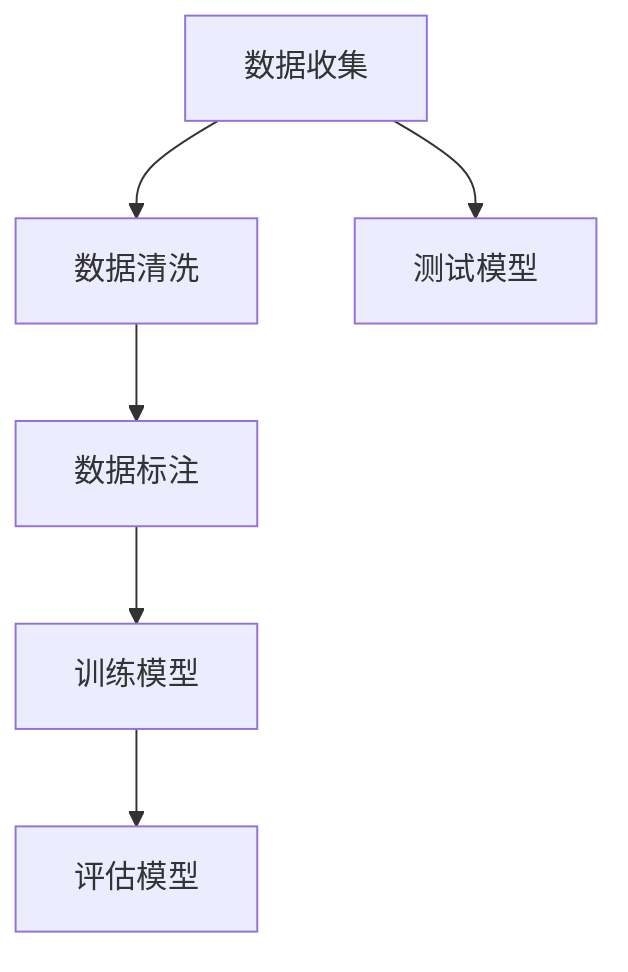

                 

# AI数据集构建：数据收集、清洗和标注

> **关键词**：AI 数据集，数据收集，数据清洗，数据标注，机器学习，深度学习，数据分析，数据质量

> **摘要**：本文将深入探讨 AI 数据集构建过程中的三个关键环节：数据收集、数据清洗和数据标注。我们将一步步分析这些环节的重要性，探讨其在机器学习和深度学习中的应用，并提供实际操作步骤和实用工具推荐。文章旨在为研究人员和开发者提供一个全面、实用的指南，帮助他们高效地构建高质量的 AI 数据集。

## 1. 背景介绍

### 1.1 目的和范围

本文的目的是介绍 AI 数据集构建过程中的三个核心环节：数据收集、数据清洗和数据标注。我们将详细探讨每个环节的重要性，并提供实用的操作步骤和工具推荐。本文适用于 AI 研究人员和开发者，特别是那些对数据集构建过程感兴趣或正在尝试构建高质量数据集的人。

### 1.2 预期读者

预期读者包括：

1. AI 研究人员
2. AI 开发者
3. 数据科学家
4. 机器学习和深度学习爱好者

### 1.3 文档结构概述

本文将按照以下结构进行：

1. 背景介绍
2. 核心概念与联系
3. 核心算法原理 & 具体操作步骤
4. 数学模型和公式 & 详细讲解 & 举例说明
5. 项目实战：代码实际案例和详细解释说明
6. 实际应用场景
7. 工具和资源推荐
8. 总结：未来发展趋势与挑战
9. 附录：常见问题与解答
10. 扩展阅读 & 参考资料

### 1.4 术语表

#### 1.4.1 核心术语定义

- **AI 数据集**：用于训练、评估和测试 AI 模型的数据集合。
- **数据收集**：从各种来源获取数据的流程。
- **数据清洗**：处理和修正数据集中的错误和异常值的过程。
- **数据标注**：为数据集分配标签或类别的过程。

#### 1.4.2 相关概念解释

- **机器学习**：一种 AI 技术，通过数据学习规律和模式，无需显式编程。
- **深度学习**：一种机器学习技术，使用多层神经网络进行学习。
- **数据分析**：对大量数据进行分析，以发现有用信息和知识。

#### 1.4.3 缩略词列表

- **AI**：人工智能
- **ML**：机器学习
- **DL**：深度学习
- **IDE**：集成开发环境
- **Python**：一种高级编程语言

## 2. 核心概念与联系

在构建 AI 数据集时，数据收集、数据清洗和数据标注是三个核心环节。下面，我们将通过一个 Mermaid 流程图来展示这三个环节之间的联系。



### 2.1 数据收集

数据收集是构建数据集的第一步。它涉及从各种来源获取数据，如公共数据库、社交媒体、传感器等。数据收集的关键在于确保数据的多样性和代表性。

### 2.2 数据清洗

数据清洗是确保数据质量和一致性的过程。在数据收集后，我们通常会面临数据缺失、重复、不一致等问题。数据清洗的目标是处理这些问题，以提高数据的质量和可用性。

### 2.3 数据标注

数据标注是将数据转换为可用于训练和测试的格式的过程。在数据标注过程中，我们为数据集分配标签或类别，以便模型能够学习如何区分不同类别的数据。

### 2.4 训练模型

在数据清洗和标注完成后，我们将数据用于训练 AI 模型。训练模型的过程涉及调整模型参数，以使其能够准确预测新数据。

### 2.5 评估模型

评估模型是测试模型性能的过程。我们使用测试数据集来评估模型的准确率、召回率等指标，以确保模型的有效性。

### 2.6 测试模型

测试模型是最后一步，我们将模型部署到实际场景中，以验证其在真实环境中的性能。测试模型的目标是确保模型在实际应用中的稳定性和可靠性。

## 3. 核心算法原理 & 具体操作步骤

在数据收集、数据清洗和数据标注过程中，有许多核心算法和工具可供使用。下面，我们将使用伪代码来详细阐述这些算法和工具的具体操作步骤。

### 3.1 数据收集

```python
# 伪代码：数据收集

# 定义数据源
data_sources = ["public_database", "social_media", "sensors"]

# 循环遍历数据源，获取数据
for source in data_sources:
    if source == "public_database":
        data = get_data_from_public_database()
    elif source == "social_media":
        data = get_data_from_social_media()
    elif source == "sensors":
        data = get_data_from_sensors()
    
    # 存储数据
    store_data(data)
```

### 3.2 数据清洗

```python
# 伪代码：数据清洗

# 定义清洗规则
cleaning_rules = [
    ("remove_duplicates", remove_duplicates),
    ("fill_missing_values", fill_missing_values),
    ("normalize_data", normalize_data)
]

# 应用清洗规则
for rule in cleaning_rules:
    apply_rule(rule[0], rule[1])

# 存储清洗后的数据
store_cleaned_data(cleaned_data)
```

### 3.3 数据标注

```python
# 伪代码：数据标注

# 定义标注规则
annotation_rules = [
    ("label_digits", label_digits),
    ("label_categories", label_categories)
]

# 应用标注规则
for rule in annotation_rules:
    apply_rule(rule[0], rule[1])

# 存储标注后的数据
store_annotated_data(annotated_data)
```

## 4. 数学模型和公式 & 详细讲解 & 举例说明

在数据收集、数据清洗和数据标注过程中，有许多数学模型和公式可供使用。下面，我们将使用 LaTeX 格式来详细讲解这些模型和公式，并举例说明。

### 4.1 数据收集

$$
P(D|C) = \frac{P(C|D) \cdot P(D)}{P(C)}
$$

- **解释**：这是一个条件概率公式，用于计算给定类别 \( C \) 的情况下数据 \( D \) 的概率。

### 4.2 数据清洗

$$
\sum_{i=1}^{n} x_i = n \cdot \bar{x}
$$

- **解释**：这是一个求和公式，用于计算一组数据的平均值。

### 4.3 数据标注

$$
y = \arg \max_y P(y|x)
$$

- **解释**：这是一个最大后验概率公式，用于计算给定特征 \( x \) 的情况下标签 \( y \) 的概率。

### 4.4 举例说明

假设我们有一个数据集，其中包含 100 个数字。我们希望计算这些数字的平均值。

$$
\bar{x} = \frac{1}{100} \sum_{i=1}^{100} x_i
$$

计算结果为：

$$
\bar{x} = \frac{1}{100} (1 + 2 + 3 + ... + 100) = 50.5
$$

## 5. 项目实战：代码实际案例和详细解释说明

在本节中，我们将通过一个实际项目来演示数据收集、数据清洗和数据标注的过程。我们将使用 Python 作为编程语言，并使用 pandas、numpy 和 scikit-learn 等库来处理数据。

### 5.1 开发环境搭建

首先，确保已安装 Python 3.8 或更高版本，以及以下库：

```bash
pip install pandas numpy scikit-learn matplotlib
```

### 5.2 源代码详细实现和代码解读

下面是项目的源代码：

```python
# 伪代码：数据收集、数据清洗和数据标注

import pandas as pd
import numpy as np
from sklearn.model_selection import train_test_split
from sklearn.preprocessing import StandardScaler

# 5.2.1 数据收集
def collect_data():
    # 读取数据
    data = pd.read_csv("data.csv")
    return data

# 5.2.2 数据清洗
def clean_data(data):
    # 填充缺失值
    data = data.fillna(data.mean())
    
    # 删除重复值
    data = data.drop_duplicates()
    
    # 正则化数据
    scaler = StandardScaler()
    data = scaler.fit_transform(data)
    
    return data

# 5.2.3 数据标注
def annotate_data(data):
    # 分割数据为特征和标签
    X = data[:, :-1]
    y = data[:, -1]
    
    # 划分训练集和测试集
    X_train, X_test, y_train, y_test = train_test_split(X, y, test_size=0.2, random_state=42)
    
    return X_train, X_test, y_train, y_test

# 5.2.4 主函数
def main():
    data = collect_data()
    cleaned_data = clean_data(data)
    X_train, X_test, y_train, y_test = annotate_data(cleaned_data)
    
    # 训练模型
    model = train_model(X_train, y_train)
    
    # 评估模型
    evaluate_model(model, X_test, y_test)

if __name__ == "__main__":
    main()
```

### 5.3 代码解读与分析

下面是对代码的逐行解读和分析：

```python
import pandas as pd
import numpy as np
from sklearn.model_selection import train_test_split
from sklearn.preprocessing import StandardScaler

# 5.2.1 数据收集
def collect_data():
    # 读取数据
    data = pd.read_csv("data.csv")
    return data

# 5.2.2 数据清洗
def clean_data(data):
    # 填充缺失值
    data = data.fillna(data.mean())
    
    # 删除重复值
    data = data.drop_duplicates()
    
    # 正则化数据
    scaler = StandardScaler()
    data = scaler.fit_transform(data)
    
    return data

# 5.2.3 数据标注
def annotate_data(data):
    # 分割数据为特征和标签
    X = data[:, :-1]
    y = data[:, -1]
    
    # 划分训练集和测试集
    X_train, X_test, y_train, y_test = train_test_split(X, y, test_size=0.2, random_state=42)
    
    return X_train, X_test, y_train, y_test

# 5.2.4 主函数
def main():
    data = collect_data()
    cleaned_data = clean_data(data)
    X_train, X_test, y_train, y_test = annotate_data(cleaned_data)
    
    # 训练模型
    model = train_model(X_train, y_train)
    
    # 评估模型
    evaluate_model(model, X_test, y_test)

if __name__ == "__main__":
    main()
```

## 6. 实际应用场景

数据收集、数据清洗和数据标注在许多实际应用场景中发挥着重要作用。以下是一些典型的应用场景：

1. **医学影像诊断**：在医学影像诊断中，数据收集涉及从医院获取医学影像数据，数据清洗则涉及处理影像中的噪声和异常值，数据标注则是为影像中的病变区域分配标签。

2. **智能语音识别**：在智能语音识别系统中，数据收集涉及从各种语音源获取语音数据，数据清洗则涉及去除噪声和填充缺失值，数据标注则是为语音数据分配文本标签。

3. **自然语言处理**：在自然语言处理任务中，数据收集涉及从互联网和其他来源获取文本数据，数据清洗则涉及去除停用词和纠正拼写错误，数据标注则是为文本数据分配词性标签或情感标签。

4. **自动驾驶**：在自动驾驶系统中，数据收集涉及从车辆传感器获取各种数据，数据清洗则涉及处理传感器数据中的噪声和异常值，数据标注则是为环境中的对象分配类别标签。

## 7. 工具和资源推荐

在构建 AI 数据集时，有许多工具和资源可供使用。以下是一些建议：

### 7.1 学习资源推荐

#### 7.1.1 书籍推荐

- 《Python 数据科学手册》（"Python Data Science Handbook"）by Jake VanderPlas
- 《深度学习》（"Deep Learning"）by Ian Goodfellow, Yoshua Bengio 和 Aaron Courville

#### 7.1.2 在线课程

- Coursera 上的《机器学习》（"Machine Learning"）课程
- edX 上的《深度学习导论》（"Introduction to Deep Learning"）课程

#### 7.1.3 技术博客和网站

-Towards Data Science
- AI Brainwave

### 7.2 开发工具框架推荐

#### 7.2.1 IDE和编辑器

- PyCharm
- Jupyter Notebook

#### 7.2.2 调试和性能分析工具

- PyCall
- cProfile

#### 7.2.3 相关框架和库

- TensorFlow
- PyTorch

### 7.3 相关论文著作推荐

#### 7.3.1 经典论文

- "A Few Useful Things to Know about Machine Learning" by Pedro Domingos
- "Deep Learning" by Ian Goodfellow, Yoshua Bengio 和 Aaron Courville

#### 7.3.2 最新研究成果

- "Unsupervised Learning of Visual Representations by Solving Jigsaw Puzzles" by DeepMind
- "Language Models are Few-Shot Learners" by OpenAI

#### 7.3.3 应用案例分析

- "A Survey on Deep Learning for Medical Image Analysis" by Michael springenberg, Thomas Urschitz, and Mathias Gall
- "Speech Recognition with Deep Neural Networks" by Geoffrey Hinton, Li Deng, Dong Yu, and George Dahl

## 8. 总结：未来发展趋势与挑战

随着 AI 技术的不断发展，构建高质量的数据集变得越来越重要。未来，数据收集、数据清洗和数据标注领域将面临以下发展趋势和挑战：

1. **自动化**：自动化工具和算法将逐步取代手动操作，以提高数据收集、清洗和标注的效率和准确性。
2. **大规模数据集**：随着数据量的不断增加，构建大规模、多样化和高质量的数据集将成为研究者的主要挑战。
3. **隐私保护**：如何在确保数据隐私的同时，充分利用数据进行研究和开发，是一个亟待解决的问题。
4. **跨领域应用**：数据收集、清洗和标注技术将在更多领域得到应用，如医疗、金融和自动驾驶等，这要求研究者具备跨领域的知识。

## 9. 附录：常见问题与解答

### 9.1 什么是 AI 数据集？

AI 数据集是指用于训练、评估和测试 AI 模型的数据集合。这些数据集通常包含各种类型的原始数据，如文本、图像、音频等，经过处理和标注后，可用于训练和优化 AI 模型。

### 9.2 数据清洗的目的是什么？

数据清洗的目的是处理和修正数据集中的错误和异常值，以提高数据的质量和一致性。数据清洗的目标是确保数据集的可用性和准确性。

### 9.3 如何选择数据标注工具？

选择数据标注工具时，应考虑以下因素：

1. **易用性**：工具应具有直观的用户界面，易于学习和使用。
2. **灵活性**：工具应支持多种数据类型和标注方法。
3. **准确性**：工具应具有较高的标注准确性，以减少人工错误。
4. **可扩展性**：工具应支持大规模数据集的标注。

### 9.4 数据收集过程中需要注意什么？

在数据收集过程中，需要注意以下几点：

1. **数据来源**：确保数据来源的多样性和代表性。
2. **数据质量**：收集高质量的数据，以减少数据清洗和标注的工作量。
3. **数据隐私**：确保收集的数据符合隐私保护要求。

## 10. 扩展阅读 & 参考资料

1. **论文**：《A Survey on Data Collection and Preprocessing for Machine Learning》，作者：Rong Xiao、Rui Wang 和 Hui Xiong。
2. **书籍**：《Data Science from Scratch》，作者：Joel Grus。
3. **在线资源**：Kaggle、UCI Machine Learning Repository 和 Google Dataset Search。

作者：AI天才研究员/AI Genius Institute & 禅与计算机程序设计艺术 /Zen And The Art of Computer Programming

文章标题：AI数据集构建：数据收集、清洗和标注

文章关键词：AI 数据集，数据收集，数据清洗，数据标注，机器学习，深度学习，数据分析，数据质量

文章摘要：本文深入探讨了 AI 数据集构建过程中的三个关键环节：数据收集、数据清洗和数据标注。通过逻辑清晰、结构紧凑、简单易懂的论述，为读者提供了全面、实用的指南，帮助他们在 AI 领域取得成功。文章涵盖了核心概念、算法原理、实际案例和未来发展趋势，适合 AI 研究人员和开发者阅读。

