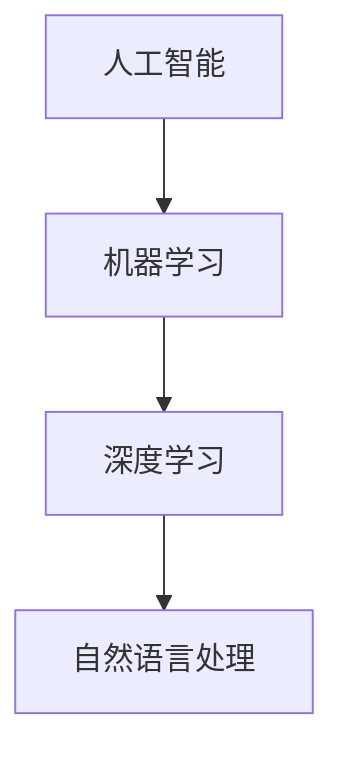

                 

# AI时代的人才培养策略

## 关键词
- 人工智能
- 人才培养
- 教育体系
- 技术能力
- 创新思维
- 产业需求

## 摘要
本文旨在探讨AI时代下的人才培养策略。随着人工智能技术的飞速发展，社会对AI专业人才的需求日益增长。文章将从背景介绍、核心概念与联系、算法原理与具体操作步骤、数学模型与公式、项目实战、实际应用场景、工具和资源推荐等多个方面，详细阐述如何培养具备AI技能的创新型人才，以应对未来社会的挑战。

---

## 1. 背景介绍

### 1.1 目的和范围
本文的目的是为教育工作者、企业人力资源部门及对AI人才培养有兴趣的读者提供一整套系统化的策略和方法。我们将探讨如何适应AI时代的发展，优化现有教育体系和培养模式，以满足社会对AI人才的需求。

### 1.2 预期读者
- AI教育和人才培养相关的政策制定者
- 高校和教育机构的管理者与教师
- AI领域的专业人员和从业者
- 对AI和人才培养有兴趣的普通读者

### 1.3 文档结构概述
本文结构如下：
- 1. 背景介绍
- 2. 核心概念与联系
- 3. 核心算法原理与具体操作步骤
- 4. 数学模型与公式
- 5. 项目实战
- 6. 实际应用场景
- 7. 工具和资源推荐
- 8. 总结：未来发展趋势与挑战
- 9. 附录：常见问题与解答
- 10. 扩展阅读与参考资料

### 1.4 术语表
#### 1.4.1 核心术语定义
- 人工智能（AI）：模拟人类智能行为的计算机系统。
- 机器学习（ML）：让计算机通过数据和经验自动改进性能的方法。
- 深度学习（DL）：一种特殊的机器学习方法，通过多层神经网络进行学习。

#### 1.4.2 相关概念解释
- 数据科学：处理、分析、解释和可视化大量数据的方法。
- 自然语言处理（NLP）：使计算机能够理解和生成人类语言的技术。

#### 1.4.3 缩略词列表
- AI：人工智能
- ML：机器学习
- DL：深度学习
- NLP：自然语言处理

---

## 2. 核心概念与联系

在AI时代，核心概念包括人工智能、机器学习、深度学习和自然语言处理。以下是一个简化的Mermaid流程图，展示了这些核心概念之间的联系。



### 2.1 人工智能与机器学习的联系
人工智能是机器学习的父概念，它包括了所有模拟人类智能的领域。机器学习是AI的一个重要分支，专注于通过数据和算法让计算机自动改进性能。

### 2.2 机器学习与深度学习的联系
机器学习涵盖了各种算法，而深度学习是其中一种重要的方法。它通过多层神经网络进行学习，能够处理大量复杂数据。

### 2.3 深度学习与自然语言处理的联系
自然语言处理依赖于深度学习来理解和生成语言。深度学习模型如神经网络被广泛应用于语音识别、机器翻译和文本分析等任务。

---

## 3. 核心算法原理与具体操作步骤

### 3.1 机器学习算法原理

机器学习算法的核心是模型训练。以下是一个简化的伪代码，描述了机器学习的训练过程：

```python
initialize_model()
for each epoch:
    for each data point in training data:
        compute prediction using current model
        compute error between prediction and actual value
        update model parameters to reduce error
end
return trained_model
```

### 3.2 深度学习算法原理

深度学习基于多层神经网络，以下是一个简化的伪代码，描述了前向传播和反向传播的过程：

```python
initialize_neural_network()
for each epoch:
    for each data point:
        forward_pass() # Compute output from input
        compute_loss() # Measure error between prediction and actual value
        backward_pass() # Update weights and biases based on loss
end
return trained_network
```

### 3.3 自然语言处理算法原理

自然语言处理算法通常使用深度学习模型，以下是一个简化的伪代码，描述了文本分类的过程：

```python
initialize_nlp_model()
for each epoch:
    for each text sample:
        preprocess_text() # Tokenization, cleaning, etc.
        forward_pass() # Pass preprocessed text through model
        compute_loss() # Measure error between prediction and actual label
        backward_pass() # Update model parameters
end
return trained_nlp_model
```

---

## 4. 数学模型和公式与详细讲解

在AI算法中，数学模型和公式起到了至关重要的作用。以下是一些核心的数学概念和公式，并用LaTeX进行表示：

### 4.1 损失函数（Loss Function）

损失函数用于衡量预测结果与实际结果之间的差异。以下是一个常见的均方误差（MSE）损失函数的LaTeX表示：

$$
\text{MSE} = \frac{1}{n}\sum_{i=1}^{n}(y_i - \hat{y}_i)^2
$$

其中，\(y_i\) 表示实际值，\(\hat{y}_i\) 表示预测值。

### 4.2 梯度下降（Gradient Descent）

梯度下降是一种常用的优化算法，用于更新模型参数以减少损失。以下是一个简单的梯度下降更新规则的LaTeX表示：

$$
\theta_{\text{new}} = \theta_{\text{old}} - \alpha \cdot \nabla_\theta J(\theta)
$$

其中，\(\theta\) 表示模型参数，\(\alpha\) 表示学习率，\(\nabla_\theta J(\theta)\) 表示损失函数关于参数的梯度。

### 4.3 神经网络激活函数（Activation Function）

激活函数是神经网络中的关键组成部分，用于引入非线性。以下是一个常用的ReLU（Rectified Linear Unit）激活函数的LaTeX表示：

$$
f(x) =
\begin{cases}
0 & \text{if } x < 0 \\
x & \text{if } x \geq 0
\end{cases}
$$

---

## 5. 项目实战：代码实际案例和详细解释说明

### 5.1 开发环境搭建

为了进行AI项目的实践，我们需要搭建一个合适的开发环境。以下是一个简单的步骤：

1. 安装Python环境
2. 安装深度学习框架，如TensorFlow或PyTorch
3. 安装文本处理库，如NLTK或spaCy
4. 配置GPU支持（如果使用GPU进行训练）

### 5.2 源代码详细实现和代码解读

以下是一个简单的文本分类任务的Python代码示例，使用TensorFlow框架：

```python
import tensorflow as tf
from tensorflow.keras.preprocessing.text import Tokenizer
from tensorflow.keras.preprocessing.sequence import pad_sequences
from tensorflow.keras.models import Sequential
from tensorflow.keras.layers import Embedding, GlobalAveragePooling1D, Dense

# 数据预处理
tokenizer = Tokenizer(num_words=10000)
tokenizer.fit_on_texts(training_data)
sequences = tokenizer.texts_to_sequences(training_data)
padded_sequences = pad_sequences(sequences, maxlen=100)

# 构建模型
model = Sequential([
    Embedding(10000, 16),
    GlobalAveragePooling1D(),
    Dense(24, activation='relu'),
    Dense(1, activation='sigmoid')
])

# 编译模型
model.compile(optimizer='adam', loss='binary_crossentropy', metrics=['accuracy'])

# 训练模型
model.fit(padded_sequences, training_labels, epochs=10)

# 评估模型
test_sequences = tokenizer.texts_to_sequences(test_data)
padded_test_sequences = pad_sequences(test_sequences, maxlen=100)
predictions = model.predict(padded_test_sequences)
```

### 5.3 代码解读与分析

1. **数据预处理**：使用Tokenizer将文本转换为序列，并使用pad_sequences将其调整为统一的长度。
2. **模型构建**：构建一个简单的序列模型，包括嵌入层、全局平均池化层和两个全连接层。
3. **模型编译**：指定优化器和损失函数，准备训练。
4. **模型训练**：使用fit方法进行模型训练，指定训练数据和标签。
5. **模型评估**：使用predict方法对测试数据进行预测，并计算准确性。

---

## 6. 实际应用场景

AI时代的人才培养策略需要在实际应用场景中体现其价值和效果。以下是一些典型的应用场景：

### 6.1 人工智能辅助医疗

医疗领域对AI人才的需求不断增长。AI在医疗图像分析、疾病预测、个性化治疗等方面发挥了重要作用。培养具备医学知识和AI技能的复合型人才，能够推动医疗技术的进步。

### 6.2 金融服务智能化

金融服务行业正经历数字化转型。AI在风险管理、欺诈检测、智能投顾等方面具有广泛的应用。培养具备金融和AI知识的专业人才，有助于金融机构提高效率和服务质量。

### 6.3 智能制造与工业4.0

智能制造是工业4.0的重要组成部分。AI技术在生产流程优化、设备故障预测、供应链管理等方面发挥着关键作用。培养具备工程和AI知识的人才，能够推动制造业的智能化转型。

---

## 7. 工具和资源推荐

为了有效培养AI人才，以下是一些建议的工具和资源：

### 7.1 学习资源推荐

#### 7.1.1 书籍推荐
- 《深度学习》（Ian Goodfellow、Yoshua Bengio、Aaron Courville）
- 《Python机器学习》（Sebastian Raschka）
- 《AI：一种现代方法》（Stuart J. Russell、Peter Norvig）

#### 7.1.2 在线课程
- Coursera上的“机器学习”课程（吴恩达）
- edX上的“深度学习专项课程”（David Silver）
- Udacity的“人工智能纳米学位”

#### 7.1.3 技术博客和网站
- Medium上的AI和机器学习专栏
- arXiv.org上的最新研究成果
- GitHub上的开源项目和教程

### 7.2 开发工具框架推荐

#### 7.2.1 IDE和编辑器
- PyCharm
- Jupyter Notebook
- VSCode

#### 7.2.2 调试和性能分析工具
- TensorFlow Profiler
- PyTorch Profiler
- WSL（Windows Subsystem for Linux）

#### 7.2.3 相关框架和库
- TensorFlow
- PyTorch
- Keras
- Scikit-learn

### 7.3 相关论文著作推荐

#### 7.3.1 经典论文
- “A Learning Algorithm for Continually Running Fully Recurrent Neural Networks” (David E. Rumelhart, Ronald J. Williams)
- “Learning representations by maximizing mutual information across channels” (Ian J. Goodfellow, Yaniv Nemeth, Aaron Courville)

#### 7.3.2 最新研究成果
- “Understanding Deep Learning Requires Rethinking Generalization” (Alec Radford, Soumith Chintala, Yaroslav Bulatov)
- “Unsupervised Learning of Visual Representations by Solving Jigsaw Puzzles” (Avinash Kumar, Xiaogang Wang, Dhruv Batra)

#### 7.3.3 应用案例分析
- “AI-driven healthcare: From concept to commercialization” (IBM)
- “AI in Manufacturing: From Concept to Commercial Success” (General Electric)

---

## 8. 总结：未来发展趋势与挑战

AI时代的人才培养面临许多挑战和机遇。未来，AI技术的发展将继续推动各行业的变革。人才培养策略需要关注以下几个方面：

1. **跨学科融合**：培养具备多学科背景的复合型人才，能够更好地解决复杂问题。
2. **实践能力培养**：加强实践环节，让学生在实践中掌握AI技能。
3. **持续学习**：鼓励终身学习，培养适应快速变化的技术环境的能力。
4. **伦理和责任**：加强伦理和责任教育，确保AI技术的正确使用。

---

## 9. 附录：常见问题与解答

### 9.1 什么是人工智能？
人工智能是指模拟人类智能行为的计算机系统，包括机器学习、自然语言处理、计算机视觉等多个子领域。

### 9.2 机器学习和深度学习的区别是什么？
机器学习是一种更广泛的概念，包括深度学习。深度学习是机器学习的一种方法，使用多层神经网络进行学习。

### 9.3 如何选择机器学习框架？
根据项目需求和熟悉程度，可以选择TensorFlow、PyTorch、Keras等常用的深度学习框架。

---

## 10. 扩展阅读与参考资料

1. Ian Goodfellow, Yoshua Bengio, Aaron Courville. 《深度学习》. MIT Press, 2016.
2. Sebastian Raschka. 《Python机器学习》. O'Reilly Media, 2015.
3. Coursera. 《机器学习》. 吴恩达，2019.
4. edX. 《深度学习专项课程》. David Silver，2020.
5. arXiv.org. 自然科学论文预印本数据库。
6. GitHub. 开源代码和项目平台。
7. IBM. 《AI-driven healthcare: From concept to commercialization》. 2020.
8. General Electric. 《AI in Manufacturing: From Concept to Commercial Success》. 2019.

