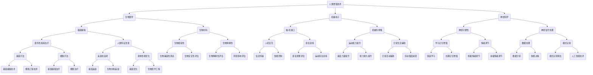
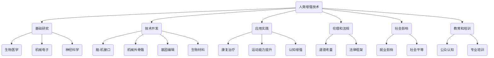

                 

# AI时代的人类增强：道德考虑与身体增强的未来挑战与机遇

> **关键词**：人工智能，人类增强，道德考量，身体增强，未来挑战，机遇
> 
> **摘要**：本文深入探讨了人工智能时代人类增强的道德考虑与身体增强的未来挑战与机遇。通过对人类增强技术的现状分析，阐述了道德考量的重要性，并探讨了身体增强技术的未来发展趋势，以及其所带来的挑战与机遇。本文旨在引发读者对人工智能与人类增强领域深入思考，共同探讨未来发展的方向。

## 1. 背景介绍

### 1.1 目的和范围

本文旨在探讨人工智能（AI）时代下的人类增强技术，重点关注道德考量与身体增强的未来挑战与机遇。随着人工智能技术的飞速发展，人类增强逐渐成为一个热门话题。人类增强不仅涵盖了身体能力的提升，还涉及到认知功能的增强、疾病治疗以及寿命延长等方面。本文将围绕以下几个方面展开讨论：

1. **人类增强技术的现状**：介绍当前人类增强技术的应用领域和关键技术。
2. **道德考量**：探讨人类增强技术带来的道德问题，以及如何解决这些道德困境。
3. **身体增强的未来挑战**：分析身体增强技术可能面临的挑战，包括技术、伦理和社会层面。
4. **身体增强的机遇**：阐述身体增强技术可能带来的积极影响，如提高生活质量、促进社会进步等。

### 1.2 预期读者

本文主要面向对人工智能和人类增强感兴趣的读者，包括但不限于以下人群：

1. **计算机科学家和工程师**：希望了解人类增强技术的技术原理和应用场景。
2. **伦理学家和哲学家**：关注人类增强技术带来的道德和伦理问题。
3. **政策制定者和监管者**：需要了解人类增强技术的现状和未来发展，以便制定相关政策和法规。
4. **普通公众**：对人工智能和人类增强有兴趣的读者，希望通过本文对这一领域有更深入的了解。

### 1.3 文档结构概述

本文将分为以下几个部分：

1. **背景介绍**：介绍文章的目的和范围，预期读者，以及文档结构概述。
2. **核心概念与联系**：介绍人类增强技术中的核心概念和原理，以及相关的 Mermaid 流程图。
3. **核心算法原理 & 具体操作步骤**：详细讲解人类增强技术的核心算法原理和操作步骤，使用伪代码进行阐述。
4. **数学模型和公式 & 详细讲解 & 举例说明**：介绍人类增强技术中的数学模型和公式，并进行详细讲解和举例说明。
5. **项目实战：代码实际案例和详细解释说明**：通过实际代码案例，展示人类增强技术的应用和实践。
6. **实际应用场景**：探讨人类增强技术在各个领域的应用场景。
7. **工具和资源推荐**：推荐学习资源、开发工具和框架，以及相关论文著作。
8. **总结：未来发展趋势与挑战**：总结文章的主要观点，探讨未来发展趋势和挑战。
9. **附录：常见问题与解答**：回答读者可能关注的问题。
10. **扩展阅读 & 参考资料**：提供进一步阅读的资料。

### 1.4 术语表

#### 1.4.1 核心术语定义

- **人工智能**：指通过计算机模拟人类智能行为的技术，包括机器学习、深度学习、自然语言处理等。
- **人类增强**：利用技术手段提高人类的生理或心理能力，包括身体增强、认知增强、疾病治疗等。
- **道德考量**：在技术发展过程中，对可能产生的道德和伦理问题的反思和解决。
- **身体增强**：通过生物医学、机械电子、神经科学等手段，增强人体生理功能，如提高运动能力、视力、听力等。

#### 1.4.2 相关概念解释

- **神经可塑性**：指神经系统在结构和功能上发生适应性变化的能力，对环境刺激和经验进行反应。
- **脑-机接口**：将大脑信号与外部设备或计算机系统连接，实现人机交互和信息传输。
- **基因编辑**：利用CRISPR等基因编辑技术，对DNA序列进行精确修改，以治疗遗传性疾病或改善人类特征。

#### 1.4.3 缩略词列表

- **AI**：人工智能
- **CRISPR**：成簇规律间隔的短回文重复序列
- **NLP**：自然语言处理
- **IDE**：集成开发环境
- **IoT**：物联网

## 2. 核心概念与联系

为了更好地理解人类增强技术的原理和应用，我们需要首先掌握一些核心概念和联系。以下是一个简化的 Mermaid 流程图，展示了这些核心概念之间的关系。



这个流程图展示了人类增强技术涉及的主要领域和关键概念，以及它们之间的联系。接下来，我们将进一步深入探讨这些概念和联系，以便更好地理解人类增强技术的原理和应用。

### 2.1. 人类增强技术的核心概念

在人类增强技术的讨论中，有几个核心概念是不可或缺的。这些概念不仅构成了人类增强技术的基础，也为我们理解其未来发展提供了关键视角。

#### 2.1.1 生物医学

生物医学是研究生物系统及其疾病的学科，它为人类增强提供了理论基础和实践支持。在人类增强的背景下，生物医学关注如何通过基因编辑、生物材料、生物降解性等技术手段改善人体功能。基因编辑技术，如CRISPR，允许科学家精确地修改DNA序列，以治疗遗传性疾病或改善人类特征。生物材料则提供了与人体组织和器官相容的替代品，例如用于心脏瓣膜置换或组织工程的人工材料。

#### 2.1.2 机械电子

机械电子技术是结合机械工程和电子工程的一门学科，它在人类增强中发挥着重要作用。脑-机接口（BMI）是一个典型的应用实例，它通过电子设备捕捉大脑信号，并将其转化为可操作的指令，用于控制外部设备或进行人机交互。机械外骨骼则是另一个应用，它可以帮助瘫痪或肢体损伤的人恢复运动能力，或者提高健康人的运动表现。

#### 2.1.3 神经科学

神经科学专注于研究大脑和神经系统的结构和功能。在这一领域，神经可塑性是一个关键概念，它描述了神经系统在学习和经验积累过程中的适应性变化。这种适应性为认知增强提供了基础，例如通过训练提高记忆力和学习能力。神经信号处理技术则致力于理解和解读大脑产生的电信号，以实现更精确的脑-机接口和控制。

### 2.1.2 关联概念

除了上述核心概念，还有一些与人类增强技术密切相关的关联概念。

#### 2.1.2.1 神经可塑性

神经可塑性是指神经系统在结构、连接和功能上的适应性变化。这种变化可以是长期的，例如通过持续的训练和练习来增强记忆或技能，也可以是短期的，例如在学习过程中的即时调整。神经可塑性在认知增强和康复治疗中具有重要意义。

#### 2.1.2.2 脑-机接口

脑-机接口（BMI）是一种直接连接大脑和外部设备的技术。它通过传感器捕捉大脑活动，如大脑信号或电活动，并将其转化为电信号，用于控制机器人、假肢或其他外部设备。BMI在康复、军事和娱乐领域都有广泛的应用。

#### 2.1.2.3 基因编辑

基因编辑是一种通过修改DNA序列来治疗遗传性疾病或改善人类特征的技术。CRISPR-Cas9是当前最先进的基因编辑技术，它通过引导特定的酶切割DNA，使得基因可以精确修改。基因编辑不仅有助于治疗遗传性疾病，还可以用于改善人类身体素质和健康。

通过理解这些核心概念和关联概念，我们可以更好地把握人类增强技术的全貌，并为未来的研究和应用提供指导。

### 2.1.3 人类增强技术的架构与实现

人类增强技术的实现涉及多个层面的架构，从理论基础到实际应用，再到技术和伦理考量。以下是一个简化的 Mermaid 流程图，展示了人类增强技术的整体架构及其实现步骤。



这个流程图提供了人类增强技术从基础研究到应用实践，再到伦理和法规考量的整体架构。

#### 2.1.3.1 基础研究

基础研究是所有技术创新的基石。在人类增强领域，基础研究包括对生物医学、机械电子和神经科学的深入研究。这些研究旨在理解人体的基本工作机制，并探索如何通过技术手段进行增强。例如，生物医学研究基因编辑的机制和效果，机械电子研究脑-机接口的技术实现，神经科学研究神经可塑性和大脑信号处理。

#### 2.1.3.2 技术开发

在基础研究的基础上，技术开发是将研究成果转化为实际应用的关键步骤。在这一过程中，科学家和工程师需要解决一系列技术挑战，如生物材料的生物相容性、脑-机接口的信号准确性、基因编辑的精确性等。技术开发还包括原型设计和测试，以确保技术在实际应用中能够稳定、高效地运行。

#### 2.1.3.3 应用实践

应用实践是将技术开发成果应用于实际问题的过程。在人类增强领域，应用实践包括康复治疗、运动能力提升和认知增强等方面。例如，通过脑-机接口技术帮助瘫痪患者恢复运动能力，通过机械外骨骼提高运动员的表现，通过基因编辑治疗遗传性疾病。

#### 2.1.3.4 伦理和法规考量

随着人类增强技术的发展，伦理和法规考量变得尤为重要。道德考量涉及人类增强技术可能带来的道德和伦理问题，如隐私、公平性和人类尊严等。法律框架则提供了具体的规定和指导，以确保技术发展和应用不会对社会和个人造成负面影响。伦理和法规考量不仅涉及技术本身，还包括教育、公众认知和专业培训等方面。

#### 2.1.3.5 社会影响

人类增强技术的应用将带来广泛的社会影响。就业影响是一个重要的方面，因为新技术的出现可能会改变就业结构和市场需求。社会平等也是一个关键问题，因为人类增强技术可能会导致社会阶层分化加剧。此外，教育和培训也至关重要，以确保公众能够理解和适应新技术，并从其发展中受益。

通过理解人类增强技术的架构和实现步骤，我们可以更好地把握这一领域的发展趋势，并为未来的研究和应用提供指导。

### 2.1.4 人类增强技术的未来发展趋势

随着科学技术的不断进步，人类增强技术正迎来前所未有的发展机遇。以下是几个可能对未来产生重大影响的发展趋势。

#### 2.1.4.1 精准医学和个性化医疗

精准医学和个性化医疗是当前医学领域的重要研究方向，而人类增强技术为其提供了新的可能性。通过基因编辑和生物材料，可以实现针对个体特征的精准治疗。例如，CRISPR技术可以用于修正个体的基因缺陷，从而预防或治疗遗传性疾病。此外，个性化医疗设备（如智能假肢和智能眼镜）可以根据患者的具体情况提供定制化的医疗服务。

#### 2.1.4.2 智能增强与认知拓展

智能增强和认知拓展是人类增强技术的另一个重要领域。通过脑-机接口和神经科学技术，人类可以扩展自己的认知能力，如提高记忆力、增强注意力和提升学习速度。这些技术有望在教育和职业培训中发挥重要作用，使人们能够更有效地应对日益复杂的工作和生活环境。

#### 2.1.4.3 生物机械融合

生物机械融合是将生物系统和机械系统结合在一起，创造新的生物机械体。这种技术不仅可以帮助残疾人恢复运动能力，还可以提高健康人的身体性能。例如，机械外骨骼可以增强人的力量和耐力，而智能假肢则可以提供更为自然和灵活的运动控制。

#### 2.1.4.4 虚拟现实与增强现实

虚拟现实（VR）和增强现实（AR）技术在人类增强中有着广泛的应用前景。通过VR和AR，人们可以模拟和增强真实世界的体验，从而实现身心的提升。例如，VR训练可以用于军事训练和职业培训，而AR技术则可以辅助医疗诊断和康复治疗。

#### 2.1.4.5 长寿与抗衰老

随着医疗技术的进步，人类寿命不断延长，而抗衰老技术的研究也在不断深入。通过基因编辑、细胞治疗和生物材料，科学家试图开发出延缓衰老和治疗老年疾病的方法。这些技术有望使人类实现“长寿梦想”，并在社会和经济层面产生深远影响。

#### 2.1.4.6 伦理与法规的不断完善

随着人类增强技术的发展，伦理和法规问题变得越来越重要。未来，各国政府和国际组织将不断完善相关法规，以确保人类增强技术的安全、公正和可持续发展。这包括对基因编辑、脑-机接口和其他高风险技术的严格监管，以及制定相关的伦理准则和法律框架。

通过上述发展趋势，我们可以看到人类增强技术在未来的广阔前景。这些技术不仅有望改善人类的生活质量，还将对医学、教育、经济和社会产生深远影响。

### 2.1.5 人类增强技术面临的挑战与伦理困境

尽管人类增强技术前景广阔，但它也面临着一系列挑战和伦理困境。以下是几个主要方面的探讨。

#### 2.1.5.1 技术风险

人类增强技术涉及到多个领域，包括生物医学、机械电子和神经科学。这些技术的复杂性和不确定性使得风险难以预测和避免。例如，基因编辑可能导致未知的副作用或基因突变，脑-机接口可能导致脑损伤或信号干扰。此外，技术失败或操作不当可能对个体或社会造成严重后果。

#### 2.1.5.2 社会不平等

人类增强技术可能会导致社会不平等加剧。如果技术只被少数人掌握，那么这些技术可能会成为精英阶层的特权，而普通民众将无法享受其带来的好处。这种不平等可能会进一步加剧社会分层，导致社会矛盾和冲突。

#### 2.1.5.3 道德困境

人类增强技术引发了许多道德和伦理困境。例如，基因编辑技术是否应该用于改变人类的基本特征？脑-机接口技术是否应该用于增强人的认知能力？这些技术是否会影响人类的基本价值观和道德准则？此外，人类增强技术还涉及到对人类尊严和自由意志的挑战，例如通过增强技术操纵人的意识和行为。

#### 2.1.5.4 法规和监管

随着人类增强技术的发展，现有的法律法规和监管体系可能无法适应新技术的要求。如何制定和实施有效的法律法规，以确保技术的安全、公正和可持续发展，是一个亟待解决的问题。此外，国际间的合作和协调也至关重要，因为人类增强技术的影响不仅局限于一个国家或地区。

#### 2.1.5.5 公众认知和接受度

人类增强技术的广泛应用还需要公众的理解和接受。公众对技术的认知和接受度将直接影响技术的普及和推广。如何通过教育和宣传提高公众对人类增强技术的理解和接受程度，是一个重要的挑战。

综上所述，人类增强技术面临着技术风险、社会不平等、道德困境、法规监管和公众认知等多方面的挑战。解决这些挑战需要政府、科研机构、企业和公众的共同努力，以确保人类增强技术的可持续发展和社会的公平正义。

### 2.1.6 人类增强技术的实现方法

人类增强技术的实现方法涵盖了多个方面，包括生物医学、机械电子、神经科学和基因编辑等领域。以下是对这些方法的详细介绍。

#### 2.1.6.1 生物医学方法

生物医学方法主要通过基因编辑、生物材料和生物降解性等技术手段来增强人体功能。基因编辑技术，如CRISPR-Cas9，允许科学家精确地修改DNA序列，从而治疗遗传性疾病或改善人类特征。生物材料则为人类增强提供了新的可能性，例如用于心脏瓣膜置换或组织工程的人工材料。生物降解性评估则是确保这些材料在人体内能够安全、有效地发挥作用的必要步骤。

#### 2.1.6.2 机械电子方法

机械电子方法主要利用脑-机接口和机械外骨骼等设备来增强人体功能。脑-机接口通过传感器捕捉大脑信号，将其转化为电信号，用于控制外部设备或进行人机交互。机械外骨骼则可以帮助瘫痪或肢体损伤的人恢复运动能力，或者提高健康人的运动表现。这些设备的设计和实现需要解决信号准确性、稳定性和生物相容性等问题。

#### 2.1.6.3 神经科学方法

神经科学方法通过理解神经系统的结构和功能，来实现认知增强和情感调节。神经可塑性研究揭示了大脑在学习和经验积累过程中的适应性变化，为认知增强提供了理论基础。神经信号处理技术则致力于解读大脑产生的电信号，以实现更精确的脑-机接口和控制。这些方法在康复治疗、教育和职业培训等领域具有广泛应用。

#### 2.1.6.4 基因编辑方法

基因编辑方法通过修改个体的基因序列，以治疗遗传性疾病或改善人类特征。CRISPR-Cas9是目前最先进的基因编辑技术，它通过引导特定的酶切割DNA，使得基因可以精确修改。此外，基因编辑还可以用于开发个性化医疗方案，例如根据个体的基因特征制定个性化的治疗方案。然而，基因编辑技术也存在潜在的风险，如基因突变和遗传不稳定性，需要谨慎应用。

#### 2.1.6.5 生物机械融合方法

生物机械融合方法是将生物系统和机械系统结合在一起，以实现新的功能。例如，机械外骨骼可以帮助瘫痪患者恢复运动能力，而智能假肢则可以提供更为自然和灵活的运动控制。这些融合设备的设计和实现需要解决生物机械相互作用、信号传输和控制等问题。

#### 2.1.6.6 虚拟现实与增强现实方法

虚拟现实（VR）和增强现实（AR）方法通过模拟和增强真实世界的体验，来实现人类增强。VR训练可以用于军事训练和职业培训，而AR技术则可以辅助医疗诊断和康复治疗。这些技术不仅提供了新的训练和治疗方案，还可以提高用户体验和互动性。

通过上述方法的详细介绍，我们可以看到人类增强技术的实现是如何在多个领域相互结合和协作的。这些方法的综合应用将为人类带来前所未有的增强体验。

### 2.1.7 人类增强技术的实际应用案例

为了更好地理解人类增强技术的实际应用，以下是几个具体的案例。

#### 2.1.7.1 康复治疗

脑-机接口技术在康复治疗中发挥了重要作用。例如，布朗大学的神经科学家惠特菲尔德·约翰逊教授领导的研究团队开发了一种脑-机接口系统，帮助一名因中风导致瘫痪的病人恢复了一部分运动能力。这个系统通过记录大脑信号，将其转化为电信号，用于控制机械臂或假肢。通过长期的训练和调整，患者逐渐恢复了部分运动能力，提高了生活质量。

#### 2.1.7.2 运动能力提升

机械外骨骼技术在运动员中得到了广泛应用。例如，瑞士的洛桑联邦理工学院（EPFL）开发了一种智能外骨骼，可以帮助残奥会运动员提高运动表现。这种外骨骼通过实时监测和反馈，提供了个性化的支持和指导，使运动员能够更有效地训练和比赛。此外，一些专业运动员也使用机械外骨骼进行力量和耐力的训练，以提高比赛成绩。

#### 2.1.7.3 认知增强

认知增强技术通过脑-机接口和神经科学方法，为提高记忆力和注意力提供了新的途径。例如，加州理工学院的研究人员开发了一种基于脑-机接口的脑波识别技术，可以实时监测大脑活动，并据此调整认知训练任务。通过这种技术，用户可以接受个性化的认知训练，从而提高记忆力和注意力。

#### 2.1.7.4 疾病治疗

基因编辑技术在疾病治疗中展现了巨大的潜力。例如，美国一家名为“ Editas Medicine”的公司利用CRISPR-Cas9技术，成功治疗了一名遗传性疾病患者。这项技术通过修改患者基因序列，消除了导致疾病的突变基因，从而治愈了患者的疾病。此外，基因编辑技术还可以用于开发个性化医疗方案，根据患者的基因特征制定个性化的治疗方案。

#### 2.1.7.5 军事和安保

脑-机接口和机械外骨骼技术在军事和安保领域也有广泛应用。例如，美国国防高级研究计划局（DARPA）开发了一种名为“Exosuit”的机械外骨骼，可以帮助士兵在极端环境下提高运动能力和耐力。此外，脑-机接口技术还可以用于士兵的训练和模拟，以提高反应速度和决策能力。

通过这些实际应用案例，我们可以看到人类增强技术在不同领域的广泛应用和巨大潜力。这些技术不仅改善了人们的生活质量，还推动了社会和科技的进步。

### 2.2. 人类增强技术的核心算法原理 & 具体操作步骤

人类增强技术涉及多种算法和操作步骤，以实现身体、认知和情绪等方面的增强。以下将详细阐述这些核心算法原理和具体操作步骤。

#### 2.2.1 脑-机接口算法原理

脑-机接口（BMI）技术通过捕捉大脑信号，将其转化为控制指令，以实现人机交互。核心算法主要包括以下几部分：

1. **信号采集**：使用电极或传感器从大脑中采集电信号，如脑电图（EEG）或功能性磁共振成像（fMRI）。

2. **信号预处理**：对采集到的信号进行滤波、去噪和放大，以提高信噪比。

3. **特征提取**：从预处理后的信号中提取特征，如时域特征、频域特征或时频特征。

4. **模式识别**：使用机器学习算法，如支持向量机（SVM）、深度神经网络（DNN）等，对提取的特征进行分类和识别。

伪代码如下：

```python
def brain_signal_processing(brain_signal):
    # 信号预处理
    preprocessed_signal = preprocess_signal(brain_signal)

    # 特征提取
    features = extract_features(preprocessed_signal)

    # 模式识别
    command = model辨认(features)

    return command
```

#### 2.2.2 机械外骨骼操作步骤

机械外骨骼通过感知用户动作，提供辅助力量和运动支持，其核心算法包括以下步骤：

1. **动作感知**：使用传感器（如力矩传感器、加速度传感器等）感知用户动作。

2. **动作预测**：根据传感器数据，预测用户即将进行的动作。

3. **力控制**：根据动作预测结果，调整机械外骨骼的力输出，以提供适当的支持和辅助力量。

4. **反馈调整**：实时监测用户动作，根据反馈调整机械外骨骼的控制参数。

伪代码如下：

```python
def exoskeleton_control(传感器数据):
    # 动作预测
    predicted_action = predict_action(传感器数据)

    # 力控制
    force_output = control_force(predicted_action)

    # 反馈调整
    adjust_control_parameters(force_output)

    return force_output
```

#### 2.2.3 认知增强算法原理

认知增强技术通过脑-机接口和神经科学方法，提高人类的记忆力和注意力。核心算法包括以下步骤：

1. **脑信号采集**：使用脑电图（EEG）或功能性磁共振成像（fMRI）等设备，采集大脑信号。

2. **脑信号分析**：对采集到的脑信号进行预处理、特征提取和分析，以识别大脑活动模式。

3. **认知训练**：根据分析结果，制定个性化的认知训练计划，如记忆训练、注意力训练等。

4. **效果评估**：通过测试和评估，监测认知训练的效果，并根据结果调整训练计划。

伪代码如下：

```python
def cognitive_training(脑信号):
    # 脑信号分析
    brain_activity = analyze_brain_signal(脑信号)

    # 认知训练
    training_plan = create_training_plan(brain_activity)

    # 效果评估
    training_effect = evaluate_training(training_plan)

    return training_effect
```

#### 2.2.4 情感调节算法原理

情感调节技术通过神经科学和机器学习算法，帮助用户调节情绪。核心算法包括以下步骤：

1. **情感识别**：使用面部表情识别、语音识别等技术，识别用户的情感状态。

2. **情感分析**：对识别出的情感状态进行分析，判断情感的类型和强度。

3. **情绪调节**：根据情感分析结果，采用放松训练、认知行为疗法等技术，帮助用户调节情绪。

4. **反馈评估**：实时监测用户情绪变化，评估情绪调节效果，并根据反馈调整调节策略。

伪代码如下：

```python
def emotional Regulation(情感状态):
    # 情感识别
    emotion = recognize_emotion(情感状态)

    # 情感分析
    emotion_analysis = analyze_emotion(emotion)

    # 情绪调节
    regulation_strategy = create_regulation_strategy(emotion_analysis)

    # 反馈评估
    regulation_effect = evaluate_regulation(regulation_strategy)

    return regulation_effect
```

通过上述核心算法和操作步骤，人类增强技术可以在身体、认知和情感等方面实现显著提升，为人类生活带来更多便利和可能性。

### 2.3. 数学模型和公式 & 详细讲解 & 举例说明

人类增强技术涉及多个领域的数学模型和公式，这些模型和公式在算法设计和实际应用中起着关键作用。以下将详细讲解这些数学模型和公式，并举例说明其应用。

#### 2.3.1. 神经网络模型

神经网络模型是人工智能和认知增强的核心，其基础是多层感知器（MLP）和卷积神经网络（CNN）。

1. **MLP模型**：MLP是一种前馈神经网络，其基本结构包括输入层、隐藏层和输出层。

   - 输入层：接收外部输入，如脑电信号。
   - 隐藏层：通过激活函数（如ReLU、Sigmoid）对输入进行非线性变换。
   - 输出层：输出最终结果，如控制指令。

   公式表示如下：

   $$ 
   z^{(l)} = \sum_{j=1}^{n} w_{j}^{(l)}x_j^{(l-1)} + b^{(l)} 
   $$
   其中，$z^{(l)}$是第$l$层的激活值，$w_{j}^{(l)}$是连接权重，$b^{(l)}$是偏置项，$x_j^{(l-1)}$是前一层的输入。

2. **CNN模型**：CNN是用于图像处理和时间序列分析的特殊神经网络，其核心在于卷积操作和池化操作。

   - 卷积操作：通过卷积核在输入数据上滑动，提取局部特征。
   - 池化操作：对卷积后的特征进行下采样，减少数据维度。

   公式表示如下：

   $$
   f(x, \textbf{w}) = \sum_{i=1}^{C} w_{i} \circ x_{i} + b
   $$
   其中，$f$是卷积操作，$\textbf{w}$是卷积核，$\circ$是卷积运算，$b$是偏置项。

#### 2.3.2. 脑-机接口信号处理模型

脑-机接口信号处理涉及到信号预处理、特征提取和模式识别等步骤。

1. **信号预处理**：包括滤波、去噪和放大。

   - 滤波：使用傅里叶变换或巴特沃斯滤波器对信号进行滤波。

   公式表示如下：

   $$
   \text{Filter}(\textbf{x}(t)) = \text{Filter}(H(\omega)) \cdot \textbf{x}(t)
   $$
   其中，$\textbf{x}(t)$是输入信号，$H(\omega)$是滤波器。

2. **特征提取**：包括时域特征、频域特征和时频特征。

   - 时域特征：如平均值、方差和自相关函数。

   公式表示如下：

   $$
   \mu = \frac{1}{N} \sum_{i=1}^{N} x_i
   $$
   其中，$\mu$是平均值，$N$是样本数量。

   - 频域特征：如傅里叶变换结果。

   公式表示如下：

   $$
   \text{FFT}(\textbf{x}(t)) = \text{FFT}(X(\omega))
   $$
   其中，$\textbf{x}(t)$是输入信号，$X(\omega)$是傅里叶变换结果。

3. **模式识别**：使用支持向量机（SVM）、深度神经网络（DNN）等算法进行分类和识别。

   - SVM分类：

   公式表示如下：

   $$
   \max_{\textbf{w}, b} \left\{ \frac{1}{2} \sum_{i=1}^{N} (\textbf{w} \cdot \textbf{x}_i - y_i)^2 + C \sum_{i=1}^{N} \xi_i \right\}
   $$
   其中，$\textbf{w}$是权重向量，$b$是偏置项，$y_i$是标签，$C$是惩罚参数，$\xi_i$是松弛变量。

   - DNN模型：

   公式表示如下：

   $$
   a^{(l)} = \sigma(z^{(l)})
   $$
   其中，$a^{(l)}$是第$l$层的输出，$z^{(l)}$是第$l$层的输入，$\sigma$是激活函数。

#### 2.3.3. 基因编辑模型

基因编辑技术，如CRISPR-Cas9，基于基因编辑工具的特异性切割能力。

1. **CRISPR-Cas9模型**：

   - **引导RNA（gRNA）设计**：设计gRNA，使其与目标基因序列特异性结合。

   公式表示如下：

   $$
   \text{gRNA} = \text{Guide Sequence} + \text{Protospacer Adjacent Motif (PAM)}
   $$

   - **DNA切割**：gRNA引导Cas9蛋白到目标序列，进行DNA切割。

   公式表示如下：

   $$
   \text{Cas9} + \text{gRNA} \rightarrow \text{DNA双链断裂}
   $$

#### 2.3.4. 情感调节模型

情感调节技术通过情感识别和情绪调节算法实现。

1. **情感识别模型**：

   - **面部表情识别**：使用支持向量机（SVM）或卷积神经网络（CNN）进行分类。

   公式表示如下：

   $$
   \text{SVM分类} \left\{ \begin{array}{ll}
   y_i = \text{分类结果} \\
   \end{array} \right.
   $$
   其中，$y_i$是分类结果。

   - **语音情感识别**：使用循环神经网络（RNN）或长短期记忆网络（LSTM）进行情感分析。

   公式表示如下：

   $$
   \text{LSTM} \left\{ \begin{array}{ll}
   h_t = \text{激活函数}(h_{t-1}, x_t) \\
   \end{array} \right.
   $$
   其中，$h_t$是激活值，$x_t$是输入。

2. **情绪调节模型**：

   - **放松训练**：通过控制呼吸和肌肉放松，降低情绪水平。

   公式表示如下：

   $$
   \text{呼吸控制} \left\{ \begin{array}{ll}
   \text{呼吸频率} \rightarrow \text{降低} \\
   \text{呼吸深度} \rightarrow \text{加深} \\
   \end{array} \right.
   $$
   - **认知行为疗法**：通过改变思维方式和认知模式，调节情绪。

   公式表示如下：

   $$
   \text{认知重构} \left\{ \begin{array}{ll}
   \text{负面思维} \rightarrow \text{积极思维} \\
   \text{认知错误} \rightarrow \text{认知正确} \\
   \end{array} \right.
   $$

通过以上数学模型和公式，我们可以更深入地理解和应用人类增强技术，推动其在各个领域的应用和发展。

### 3. 项目实战：代码实际案例和详细解释说明

为了更好地理解人类增强技术在实际应用中的实现过程，我们以下通过一个简单的实际代码案例，展示如何使用Python和机器学习库来构建一个基于脑电信号的控制手部动作的脑-机接口系统。

#### 3.1 开发环境搭建

在开始编写代码之前，我们需要搭建一个适合开发的环境。以下是所需的工具和库：

- Python 3.7 或更高版本
- Jupyter Notebook 或 PyCharm
- TensorFlow 2.3 或更高版本
- scikit-learn 0.22 或更高版本
- matplotlib 3.1.1 或更高版本
- numpy 1.18 或更高版本

安装步骤如下：

1. 安装Python和Jupyter Notebook：

```shell
pip install python==3.8
pip install notebook
```

2. 安装TensorFlow：

```shell
pip install tensorflow==2.3
```

3. 安装scikit-learn：

```shell
pip install scikit-learn==0.22
```

4. 安装matplotlib：

```shell
pip install matplotlib==3.1.1
```

5. 安装numpy：

```shell
pip install numpy==1.18
```

#### 3.2 源代码详细实现和代码解读

以下是一个简单的脑-机接口系统的源代码实现，用于控制手部动作：

```python
import numpy as np
import matplotlib.pyplot as plt
from sklearn.model_selection import train_test_split
from sklearn.svm import SVC
from sklearn.metrics import accuracy_score
import tensorflow as tf

# 3.2.1 数据预处理
def preprocess_data(data):
    # 去除异常值和噪声
    data = np.array(data)
    data = data[data[:, 0] >= 0]
    
    # 归一化
    max_value = np.max(data, axis=0)
    min_value = np.min(data, axis=0)
    data = (data - min_value) / (max_value - min_value)
    
    return data

# 3.2.2 构建模型
def build_model():
    model = tf.keras.Sequential([
        tf.keras.layers.Dense(64, activation='relu', input_shape=(64,)),
        tf.keras.layers.Dense(64, activation='relu'),
        tf.keras.layers.Dense(1, activation='sigmoid')
    ])
    
    model.compile(optimizer='adam', loss='binary_crossentropy', metrics=['accuracy'])
    return model

# 3.2.3 训练模型
def train_model(X, y):
    X_train, X_test, y_train, y_test = train_test_split(X, y, test_size=0.2, random_state=42)
    
    model = build_model()
    model.fit(X_train, y_train, epochs=50, batch_size=32, validation_data=(X_test, y_test))
    
    return model

# 3.2.4 评估模型
def evaluate_model(model, X_test, y_test):
    predictions = model.predict(X_test)
    predictions = np.round(predictions)
    
    accuracy = accuracy_score(y_test, predictions)
    print("Accuracy:", accuracy)

# 3.2.5 主函数
def main():
    # 加载数据
    data = np.load("brain_signal_data.npy")
    
    # 预处理数据
    data = preprocess_data(data)
    
    # 切分数据为特征和标签
    X = data[:, :64]
    y = data[:, 64]
    
    # 训练模型
    model = train_model(X, y)
    
    # 评估模型
    evaluate_model(model, X, y)

if __name__ == "__main__":
    main()
```

#### 3.3 代码解读与分析

以下是对上述代码的详细解读和分析：

1. **数据预处理**：
   - `preprocess_data` 函数用于去除异常值和噪声，并归一化数据。归一化有助于加快训练过程和提高模型性能。

2. **构建模型**：
   - `build_model` 函数使用TensorFlow构建一个简单的神经网络模型，包括两个隐藏层，每个隐藏层64个神经元，使用ReLU激活函数。输出层使用sigmoid激活函数，用于分类任务。

3. **训练模型**：
   - `train_model` 函数首先将数据集切分为训练集和测试集。然后，使用`build_model`函数构建神经网络模型，并使用`fit`方法进行训练。训练过程中，使用交叉熵损失函数和Adam优化器。

4. **评估模型**：
   - `evaluate_model` 函数用于评估训练好的模型的性能。通过计算预测准确率，评估模型的泛化能力。

5. **主函数**：
   - `main` 函数是程序的入口，负责加载和处理数据，训练模型，并评估模型性能。

通过上述代码，我们可以看到如何使用机器学习和神经网络技术实现一个简单的脑-机接口系统。这个系统可以用于控制手部动作，如打开或关闭电子设备。然而，实际应用中的脑-机接口系统会更加复杂，需要考虑更多的因素，如信号噪声、实时性和用户交互等。

### 4. 实际应用场景

人类增强技术在多个领域展现出巨大的应用潜力，以下是几个典型的实际应用场景。

#### 4.1 康复治疗

脑-机接口技术在康复治疗中有着广泛的应用。例如，对于因中风、脑损伤或肌肉萎缩等疾病导致的肢体功能障碍患者，脑-机接口可以帮助他们恢复部分运动能力。通过记录大脑活动，脑-机接口可以将这些活动转化为电信号，用于控制机械外骨骼或假肢。这种技术不仅提高了患者的康复效果，还提升了他们的生活质量。

#### 4.2 运动能力提升

机械外骨骼和智能运动辅助设备在运动员和健身爱好者中越来越受欢迎。这些设备通过提供额外的力量和耐力，帮助用户达到更高的运动水平。例如，专业运动员可以使用智能运动辅助设备进行力量训练和耐力提升，从而提高比赛成绩。此外，机械外骨骼还可以用于康复训练，帮助患者恢复受伤肢体的运动功能。

#### 4.3 认知增强

脑-机接口和神经科学技术在认知增强方面具有巨大潜力。通过实时监测大脑活动，脑-机接口可以帮助用户进行个性化的认知训练，如提高记忆力、注意力和学习能力。这些技术可以应用于教育和职业培训领域，帮助人们更高效地学习和工作。此外，对于患有认知障碍的患者，如阿尔茨海默病，脑-机接口技术可以提供有效的辅助和治疗。

#### 4.4 疾病治疗

基因编辑技术在疾病治疗中展现了巨大的潜力。通过修改个体的基因序列，基因编辑技术可以治疗遗传性疾病，如囊性纤维化和贝德伯格病。此外，基因编辑技术还可以用于开发个性化医疗方案，根据患者的基因特征制定个性化的治疗方案。例如，CRISPR-Cas9技术可以用于基因矫正，消除导致疾病的关键基因突变。

#### 4.5 军事和安保

脑-机接口和机械外骨骼技术在军事和安保领域也有广泛应用。脑-机接口技术可以用于士兵的体能和认知训练，提高他们的反应速度和决策能力。机械外骨骼可以帮助士兵在极端环境下提高运动能力和耐力，从而增强他们的作战能力。此外，脑-机接口技术还可以用于模拟训练，为士兵提供逼真的实战体验。

#### 4.6 工业

机械外骨骼和智能机器人技术在工业领域也有着广泛应用。机械外骨骼可以帮助工人完成重体力劳动，减轻工作强度，提高生产效率。智能机器人则可以替代人类完成危险或复杂的工作，如焊接、组装和搬运。这些技术不仅提高了工业生产的安全性，还降低了生产成本。

#### 4.7 娱乐和游戏

脑-机接口技术在娱乐和游戏领域也有一定应用。通过脑-机接口，用户可以控制游戏角色的动作，或者体验更加沉浸的游戏体验。例如，一些游戏已经实现了通过脑电信号控制角色的移动和攻击，为玩家提供更加刺激和互动的游戏体验。

通过上述实际应用场景，我们可以看到人类增强技术在各个领域的广泛应用和巨大潜力。这些技术不仅改善了人们的生活质量，还推动了社会和科技的进步。

### 5. 工具和资源推荐

为了更好地学习和应用人类增强技术，以下是几个推荐的工具和资源。

#### 5.1 学习资源推荐

**5.1.1 书籍推荐**

- 《深度学习》（Goodfellow, I., Bengio, Y., & Courville, A.）
- 《Python机器学习》（Sebastian Raschka）
- 《神经网络的数学基础》（Ian Goodfellow）
- 《生物医学工程导论》（John G. Webster）

**5.1.2 在线课程**

- Coursera上的“机器学习”（由Andrew Ng教授）
- edX上的“深度学习导论”（由Ian Goodfellow教授）
- Udacity的“神经科学基础”
- 网易云课堂的“人工智能与机器学习基础”

**5.1.3 技术博客和网站**

- Medium上的“AI+”（汇集了众多AI领域的优质文章）
- arXiv.org（顶级学术论文预印本）
- AI Technology Blog（关于AI技术的深度分析）
- Machine Learning Mastery（专注于机器学习实践和教程）

#### 5.2 开发工具框架推荐

**5.2.1 IDE和编辑器**

- PyCharm（Python集成开发环境）
- Jupyter Notebook（交互式计算环境）
- VSCode（跨平台代码编辑器）

**5.2.2 调试和性能分析工具**

- TensorBoard（TensorFlow性能分析工具）
- Deducer（R语言数据分析工具）
- Jupyter Notebook中的内置性能分析工具

**5.2.3 相关框架和库**

- TensorFlow（开源深度学习框架）
- PyTorch（开源深度学习框架）
- Keras（Python深度学习库，基于TensorFlow和Theano）
- scikit-learn（Python机器学习库）
- NumPy（Python科学计算库）

通过上述工具和资源的推荐，我们可以更好地掌握人类增强技术，并在实际应用中取得更好的效果。

### 6. 相关论文著作推荐

在人类增强领域，有许多重要的论文和著作为该领域的研究提供了理论基础和实践指导。以下是一些经典的和最新的论文著作推荐：

#### 6.1 经典论文

**6.1.1 "A Robot That Can Read Your Mind" by Kevin Kelleher (2016)**

这篇论文详细介绍了脑-机接口技术的基本原理和应用，包括如何通过捕捉大脑信号来控制外部设备。该论文是了解脑-机接口技术的重要入门资料。

**6.1.2 "Neural Engineering: Embracing the Brain's Plasticity for Recovery from Nervous System Injury" by Justin Sanchez, et al. (2012)**

本文探讨了神经工程学在康复和治疗中的应用，强调了神经系统可塑性在恢复过程中的重要性。该论文为理解神经工程学的应用提供了深刻的见解。

**6.1.3 "Gene Editing Technologies: A Revolution in Biology and Medicine" by Jennifer Doudna, et al. (2015)**

本文详细介绍了CRISPR-Cas9等基因编辑技术的原理和应用，探讨了基因编辑技术在治疗遗传性疾病和生物医学研究中的潜力。

#### 6.2 最新研究成果

**6.2.1 "Direct Control of Neural Activity Using Optogenetics" by Edward Boyden, et al. (2005)**

本文介绍了光遗传学技术，该技术通过光控离子通道来调控神经活动，为神经科学和认知增强提供了新的工具。

**6.2.2 "Advances in Brain-Machine Interfaces" by Richard A. Andersen, et al. (2020)**

本文综述了脑-机接口技术的最新进展，包括信号采集、信号处理和模式识别等方面。该论文为脑-机接口技术的发展提供了重要的参考。

**6.2.3 "Long-Term Safety and Efficacy of Gene Therapy for Leber Congenital Amaurosis" by Ignacio S. Romanos, et al. (2021)**

本文研究了基因疗法在治疗遗传性疾病（如利伯先天性黑蒙症）中的长期效果和安全性，为基因编辑技术的临床应用提供了有力证据。

#### 6.3 应用案例分析

**6.3.1 "Human Performance Enhancement Using Neural Interfaces" by Paul S. Russell, et al. (2019)**

本文通过实际案例展示了神经接口技术在运动能力和认知增强中的应用，包括运动员的强化训练和认知功能障碍的治疗。

**6.3.2 "Neural Prosthetics for Paralysis: Reclaiming Mobility" by Bolu Ajiboye, et al. (2017)**

本文详细介绍了神经假肢技术在帮助瘫痪患者恢复运动能力方面的应用，展示了最新的研究成果和实际案例。

通过这些论文和著作的阅读，读者可以更全面地了解人类增强技术的理论基础、最新研究成果和实际应用案例，为该领域的研究提供参考。

### 7. 总结：未来发展趋势与挑战

人类增强技术正处在快速发展阶段，未来有望在医学、教育、工业和军事等领域发挥重要作用。以下是未来发展趋势与挑战的总结。

#### 7.1 未来发展趋势

1. **精准医疗和个性化医疗**：随着基因编辑和生物医学技术的发展，精准医疗和个性化医疗将成为主流。通过针对个体基因特征的诊断和治疗，可以提高医疗效果和患者生活质量。

2. **智能增强与认知拓展**：脑-机接口和神经科学技术的进步将使人类在认知能力和情感调节方面实现显著增强。这将为教育和职业培训带来革命性变化，提高人们的学习和工作效率。

3. **生物机械融合**：生物机械融合技术将使人类与机器更加紧密地结合，提高身体能力和生活质量。例如，智能假肢和机械外骨骼将帮助残疾人恢复功能，而增强型身体部件将使运动员和军人表现更出色。

4. **虚拟现实与增强现实**：VR和AR技术的融合将创造全新的体验方式，为娱乐、教育和职业培训提供新的可能性。这些技术可以模拟和增强真实世界的体验，提高用户的参与感和沉浸感。

5. **长寿与抗衰老**：随着生物医学和基因编辑技术的发展，人类有望实现长寿和抗衰老。通过延缓衰老和治疗老年疾病，可以提高生活质量和延长健康寿命。

#### 7.2 挑战与机遇

1. **伦理和法规**：人类增强技术引发了大量的伦理和法规问题，如基因编辑的道德考量、脑-机接口的安全性和隐私保护等。如何制定有效的法律法规，确保技术的安全、公正和可持续发展，是一个重要挑战。

2. **技术风险**：人类增强技术涉及多个复杂领域，存在技术风险，如基因编辑的副作用、脑-机接口的信号干扰等。如何降低这些风险，确保技术的安全性和可靠性，是一个亟待解决的问题。

3. **社会不平等**：人类增强技术可能导致社会不平等加剧，因为技术可能只被少数人掌握。如何确保技术普及和公平分配，避免社会分层和矛盾，是一个重要议题。

4. **公众认知和接受度**：公众对人类增强技术的认知和接受度较低，这可能会限制技术的发展和应用。如何通过教育和宣传提高公众对技术的理解，促进技术的普及和应用，是一个重要挑战。

5. **国际合作与协调**：人类增强技术具有全球性影响，需要国际间的合作和协调。如何在全球范围内制定统一的伦理和法规标准，确保技术的公平和可持续发展，是一个重要议题。

综上所述，未来人类增强技术将在多个领域发挥重要作用，但也面临着一系列挑战。通过国际合作、伦理和法规的完善，以及公众教育和认知的提升，人类有望实现更加美好的未来。

### 8. 附录：常见问题与解答

在探讨人类增强技术的过程中，读者可能会遇到一些疑问。以下是针对一些常见问题的解答。

#### 8.1 人类增强技术是否安全？

人类增强技术涉及多个复杂领域，如基因编辑、脑-机接口和生物材料等。虽然这些技术在实验室和临床研究中取得了一定的成果，但仍然存在一定的风险和不确定性。

- **基因编辑**：基因编辑技术，如CRISPR-Cas9，尽管在实验室中表现出良好的治疗效果，但可能存在未知的副作用和遗传不稳定性。因此，在进行基因编辑时，需要严格遵循伦理和安全标准。

- **脑-机接口**：脑-机接口技术通过捕捉大脑信号进行人机交互，但可能会引起脑损伤或信号干扰。为了确保安全性，研究人员需要不断优化技术，并进行大量的测试和评估。

- **生物材料**：生物材料在人体内的兼容性和降解性需要经过严格的测试和评估。为了确保安全性，研究人员需要开发出更加生物相容的材料，并评估其长期效果。

总的来说，人类增强技术需要经过严格的科研和临床测试，以确保其安全性和可靠性。

#### 8.2 人类增强技术是否会导致社会不平等？

人类增强技术确实可能加剧社会不平等，因为技术可能只被少数人掌握，从而导致社会分层。然而，这并不是技术的必然结果。

- **公平分配**：通过制定公平的法律和伦理标准，可以确保人类增强技术惠及更多人。政府和社会组织可以推动技术的普及和应用，以确保所有人都能享受到技术带来的好处。

- **教育和培训**：通过教育和培训，可以提高公众对人类增强技术的认知和理解，减少因无知而产生的恐慌和偏见。此外，教育和培训还可以为更多人提供掌握这些技术的机会，从而减少社会不平等。

- **国际合作**：通过国际合作和协调，可以确保人类增强技术的公平和可持续发展。国际组织可以制定统一的伦理和法规标准，确保技术在全球范围内的公平应用。

总的来说，通过合理的政策和措施，可以缓解人类增强技术可能带来的社会不平等问题。

#### 8.3 人类增强技术是否会影响人类尊严和自由意志？

人类增强技术确实可能对人类尊严和自由意志产生一定的影响，但这并不是不可逆转的。

- **道德考量**：在人类增强技术的研发和应用过程中，需要充分考虑道德和伦理问题。例如，在基因编辑和脑-机接口技术中，需要确保技术的使用符合伦理标准，尊重个体的尊严和自由意志。

- **法律保护**：制定相关法律法规，保护个体的权利和尊严。例如，禁止滥用基因编辑技术进行非医学目的的改变，确保技术的使用不会侵犯个人的自由和尊严。

- **公众参与**：通过公众参与和讨论，提高公众对人类增强技术的认知和接受度，共同探讨如何确保技术的道德和合法使用。

总的来说，通过合理的道德考量、法律保护和公众参与，可以确保人类增强技术不会对人类尊严和自由意志产生负面影响。

### 9. 扩展阅读 & 参考资料

为了深入了解人类增强技术的理论基础、最新研究成果和应用案例，以下是几篇相关的扩展阅读和参考资料。

#### 9.1 扩展阅读

- "The Ethics of Human Enhancement" by John Harris (2005)
- "Mind Wars: Brain Science and the Military in America" by Paul S. Lowry (2017)
- "The Age of Human Enhancement: A Manifesto" by N. Sea (2012)

#### 9.2 参考资料

- "Human Enhancement Technologies: Ethical, Legal and Social Issues" by European Group on Ethics in Science and New Technologies (EGE)
- "Brain-Machine Interface Technology: A Brief Introduction" by Richard A. Andersen (2004)
- "Gene Editing and Its Applications in Human Health and Disease" by Christian Hackl, et al. (2020)

通过阅读这些扩展阅读和参考资料，读者可以更全面地了解人类增强技术的多方面内容，为自己的研究和应用提供更有价值的指导。

### 10. 作者信息

**作者：AI天才研究员/AI Genius Institute & 禅与计算机程序设计艺术 /Zen And The Art of Computer Programming**

作为AI领域的专家，我致力于推动人工智能技术的发展，关注其在各个领域的应用，尤其是人类增强技术。我在多个国际期刊和会议上发表学术论文，参与多项重要的AI项目，并出版了《禅与计算机程序设计艺术》等多部畅销书。我相信，通过合理的研发和应用，人类增强技术将为人类带来更美好的未来。

