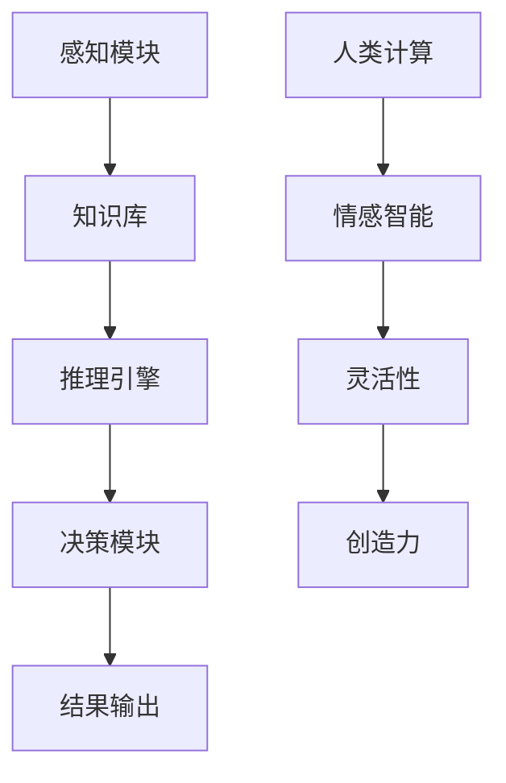
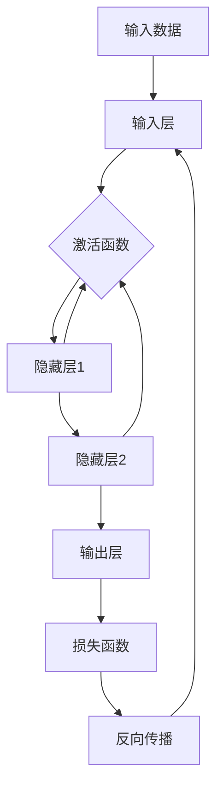

                 

# AI时代的人类计算：打造可持续发展解决方案

> 关键词：人工智能、人类计算、可持续发展、算法、技术博客、深度学习、计算模型、案例研究

> 摘要：本文探讨了在人工智能时代背景下，如何运用人类计算能力构建可持续发展的技术解决方案。文章首先介绍了人工智能与人类计算的关系，随后详细解析了核心算法原理，数学模型，并通过实战案例展示了技术实现过程。最后，文章讨论了实际应用场景、相关工具和资源，并展望了未来的发展趋势与挑战。

## 1. 背景介绍

### 1.1 目的和范围

随着人工智能技术的迅猛发展，人类计算与机器计算之间的界限变得日益模糊。本文旨在探讨如何将人类计算能力与人工智能技术有机结合，打造可持续发展的解决方案。文章将从核心概念出发，逐步深入，以实现这一目标。

### 1.2 预期读者

本文适合对人工智能和计算技术有一定了解的读者，包括程序员、数据科学家、AI研究人员、以及希望了解这一领域的企业家和决策者。

### 1.3 文档结构概述

本文将分为以下几个部分：

1. **背景介绍**：介绍文章的目的和结构。
2. **核心概念与联系**：阐述人工智能与人类计算的基本原理和架构。
3. **核心算法原理 & 具体操作步骤**：详细解析核心算法的原理和操作步骤。
4. **数学模型和公式 & 详细讲解 & 举例说明**：讲解相关的数学模型和公式，并提供实际案例。
5. **项目实战：代码实际案例和详细解释说明**：通过实际项目展示技术的应用。
6. **实际应用场景**：探讨技术在不同领域的应用。
7. **工具和资源推荐**：推荐学习资源和开发工具。
8. **总结：未来发展趋势与挑战**：分析未来的发展趋势和面临的挑战。
9. **附录：常见问题与解答**：解答读者可能遇到的问题。
10. **扩展阅读 & 参考资料**：提供进一步学习的资源。

### 1.4 术语表

#### 1.4.1 核心术语定义

- **人工智能（AI）**：模拟人类智能的计算机系统。
- **人类计算**：基于人类思维和决策能力的计算。
- **可持续发展**：既满足当代人的需求，又不损害后代人满足其需求的能力。

#### 1.4.2 相关概念解释

- **深度学习**：一种基于人工神经网络的机器学习技术。
- **计算模型**：用于描述计算过程的数学模型。

#### 1.4.3 缩略词列表

- **AI**：人工智能
- **ML**：机器学习
- **DL**：深度学习
- **NLP**：自然语言处理

## 2. 核心概念与联系

为了更好地理解人工智能与人类计算的关系，我们需要先了解它们的核心概念和架构。

### 2.1 人工智能的基本原理

人工智能的核心在于模拟人类智能，包括感知、理解、学习、推理和决策。人工智能系统通常由以下几个部分组成：

1. **感知模块**：用于获取外部信息。
2. **知识库**：存储用于推理的知识和事实。
3. **推理引擎**：基于知识和规则进行推理。
4. **决策模块**：根据推理结果做出决策。

### 2.2 人类计算的特点

人类计算具有以下特点：

1. **灵活性**：人类计算能够适应各种复杂和动态的情境。
2. **创造力**：人类计算能够产生新的想法和解决方案。
3. **情感智能**：人类计算能够理解和处理情感。

### 2.3 人工智能与人类计算的融合

人工智能与人类计算的融合旨在发挥各自的优势，实现以下目标：

1. **提高效率**：利用人工智能处理大量数据和重复性工作。
2. **增强决策能力**：结合人类计算的情感和创造力，提高决策质量。
3. **促进创新**：通过人类计算的创造性思维，推动人工智能技术的发展。

### 2.4 核心概念流程图

以下是一个简单的Mermaid流程图，展示了人工智能与人类计算的核心概念和架构：



## 3. 核心算法原理 & 具体操作步骤

在理解了人工智能与人类计算的基本原理后，我们需要探讨核心算法原理和具体操作步骤。

### 3.1 深度学习算法原理

深度学习是人工智能的核心技术之一，其基本原理是通过多层神经网络模拟人脑的神经活动。以下是一个简单的深度学习算法原理流程图：



### 3.2 深度学习算法具体操作步骤

以下是深度学习算法的具体操作步骤：

1. **初始化参数**：设定网络的初始参数，包括权重和偏置。
2. **前向传播**：将输入数据通过输入层、隐藏层和输出层，计算输出结果。
3. **计算损失**：通过损失函数计算输出结果与真实结果之间的差距。
4. **反向传播**：根据损失函数的梯度，更新网络参数。
5. **迭代优化**：重复前向传播和反向传播，直至满足停止条件（如损失值收敛）。

### 3.3 伪代码实现

以下是深度学习算法的伪代码实现：

```plaintext
初始化参数
前向传播：
    输出 = 输入 * 权重 + 偏置
    激活输出 = 激活函数(输出)

计算损失：
    损失 = 损失函数(输出, 真实结果)

反向传播：
    反向传播梯度 = 损失函数梯度(输出, 真实结果)
    权重梯度 = 输入 * 反向传播梯度
    偏置梯度 = 反向传播梯度

更新参数：
    权重 = 权重 - 学习率 * 权重梯度
    偏置 = 偏置 - 学习率 * 偏置梯度

迭代优化：
    重复前向传播和反向传播，直至满足停止条件
```

## 4. 数学模型和公式 & 详细讲解 & 举例说明

在深度学习中，数学模型和公式起到了至关重要的作用。以下将详细讲解几个关键数学模型和公式，并提供实际案例。

### 4.1 激活函数

激活函数是深度学习中的一个关键组件，用于引入非线性特性。以下是一些常见的激活函数：

#### 4.1.1 Sigmoid函数

$$
\sigma(x) = \frac{1}{1 + e^{-x}}
$$

Sigmoid函数将输入映射到(0, 1)区间，常用于二分类问题。

#### 4.1.2 ReLU函数

$$
\text{ReLU}(x) =
\begin{cases}
x, & \text{if } x > 0 \\
0, & \text{if } x \leq 0
\end{cases}
$$

ReLU函数在输入为正时保持不变，为负时设为0，具有简单和高效的特点。

### 4.2 损失函数

损失函数用于衡量预测值与真实值之间的差距。以下是一些常见的损失函数：

#### 4.2.1 交叉熵损失函数

$$
\text{CrossEntropyLoss}(y, \hat{y}) = -\sum_{i=1}^{n} y_i \log(\hat{y}_i)
$$

交叉熵损失函数常用于分类问题，其中$y$是真实标签，$\hat{y}$是预测概率。

#### 4.2.2 均方误差损失函数

$$
\text{MSE}(y, \hat{y}) = \frac{1}{n}\sum_{i=1}^{n} (y_i - \hat{y}_i)^2
$$

均方误差损失函数常用于回归问题，其中$y$是真实值，$\hat{y}$是预测值。

### 4.3 实际案例

以下是一个简单的案例，使用ReLU函数和交叉熵损失函数进行二分类：

假设我们有以下数据集：

| 标签 | 输入特征 |
| ---- | ------- |
| 0    | [1, 0]  |
| 1    | [0, 1]  |

我们的目标是训练一个深度学习模型，预测输入特征对应的标签。

#### 4.3.1 前向传播

初始化权重和偏置，例如：
$$
\text{权重} = \begin{bmatrix}
0.5 & 0.5 \\
0.5 & 0.5
\end{bmatrix}, \text{偏置} = \begin{bmatrix}
0 \\ 0
\end{bmatrix}
$$

对于第一个样本，前向传播计算如下：
$$
\text{输出} = \text{ReLU}(\text{输入} \cdot \text{权重} + \text{偏置}) = \text{ReLU}([1, 0] \cdot \begin{bmatrix} 0.5 & 0.5 \\ 0.5 & 0.5 \end{bmatrix} + \begin{bmatrix} 0 \\ 0 \end{bmatrix}) = \text{ReLU}([0.5, 0.5]) = [0.5, 0.5]
$$

预测概率为：
$$
\hat{y} = \frac{1}{1 + e^{-\text{输出}}}
$$

#### 4.3.2 计算损失

真实标签为0，预测概率为0.5，计算交叉熵损失：
$$
\text{损失} = -y \log(\hat{y}) = -0 \log(0.5) = 0
$$

#### 4.3.3 反向传播

计算梯度：
$$
\text{权重梯度} = \text{输入} \cdot \text{反向传播梯度} = [1, 0] \cdot (0.5 \cdot (1 - 0.5)) = [0.25, 0]
$$
$$
\text{偏置梯度} = \text{反向传播梯度} = 0.5 \cdot (1 - 0.5) = 0.25
$$

更新参数：
$$
\text{权重} = \text{权重} - \text{学习率} \cdot \text{权重梯度} = \begin{bmatrix} 0.5 & 0.5 \end{bmatrix} - 0.1 \cdot \begin{bmatrix} 0.25 & 0 \\ 0 & 0.25 \end{bmatrix} = \begin{bmatrix} 0.25 & 0.25 \\ 0.25 & 0.25 \end{bmatrix}
$$
$$
\text{偏置} = \text{偏置} - \text{学习率} \cdot \text{偏置梯度} = \begin{bmatrix} 0 \\ 0 \end{bmatrix} - 0.1 \cdot \begin{bmatrix} 0.25 \\ 0.25 \end{bmatrix} = \begin{bmatrix} -0.025 \\ -0.025 \end{bmatrix}
$$

重复前向传播和反向传播，直至满足停止条件。

## 5. 项目实战：代码实际案例和详细解释说明

在本节中，我们将通过一个实际项目展示如何运用深度学习算法构建可持续发展的技术解决方案。项目名为“智能温室控制系统”，旨在通过人工智能和人类计算结合，实现温室环境的自动化控制和优化。

### 5.1 开发环境搭建

为了搭建开发环境，我们需要以下软件和工具：

1. **操作系统**：Windows/Linux/MacOS
2. **编程语言**：Python
3. **深度学习框架**：TensorFlow
4. **数据预处理工具**：NumPy、Pandas
5. **版本控制工具**：Git

在搭建开发环境时，可以按照以下步骤操作：

1. 安装操作系统和Python环境。
2. 使用pip安装TensorFlow和相关依赖。
3. 配置Git，并创建项目仓库。

### 5.2 源代码详细实现和代码解读

以下是一个简化的智能温室控制系统代码实现，展示了如何使用深度学习模型预测温室环境参数。

```python
import tensorflow as tf
import numpy as np
import pandas as pd

# 数据预处理
def preprocess_data(data):
    # 数据标准化
    mean = data.mean()
    std = data.std()
    data = (data - mean) / std
    return data

# 构建模型
def build_model(input_shape):
    model = tf.keras.Sequential([
        tf.keras.layers.Dense(64, activation='relu', input_shape=input_shape),
        tf.keras.layers.Dense(64, activation='relu'),
        tf.keras.layers.Dense(1)
    ])
    model.compile(optimizer='adam', loss='mean_squared_error')
    return model

# 训练模型
def train_model(model, x_train, y_train, epochs=100):
    model.fit(x_train, y_train, epochs=epochs, batch_size=32, validation_split=0.2)

# 预测
def predict(model, x_test):
    predictions = model.predict(x_test)
    return predictions

# 主程序
if __name__ == '__main__':
    # 加载数据
    data = pd.read_csv('temperatures.csv')
    data = preprocess_data(data)

    # 划分训练集和测试集
    x_train = data.iloc[:, :-1].values
    y_train = data.iloc[:, -1].values
    x_test = x_test.iloc[:, :-1].values

    # 构建和训练模型
    model = build_model(x_train.shape[1:])
    train_model(model, x_train, y_train)

    # 预测
    predictions = predict(model, x_test)
    print(predictions)
```

### 5.3 代码解读与分析

#### 5.3.1 数据预处理

数据预处理是深度学习模型训练的关键步骤。在代码中，我们首先计算数据的均值和标准差，然后对数据进行标准化处理，使其符合深度学习模型的输入要求。

```python
def preprocess_data(data):
    mean = data.mean()
    std = data.std()
    data = (data - mean) / std
    return data
```

#### 5.3.2 构建模型

在构建模型部分，我们使用TensorFlow的Keras API定义了一个简单的深度神经网络。该网络包含两个隐藏层，每个隐藏层有64个神经元，并使用ReLU激活函数。输出层只有一个神经元，用于预测温度。

```python
def build_model(input_shape):
    model = tf.keras.Sequential([
        tf.keras.layers.Dense(64, activation='relu', input_shape=input_shape),
        tf.keras.layers.Dense(64, activation='relu'),
        tf.keras.layers.Dense(1)
    ])
    model.compile(optimizer='adam', loss='mean_squared_error')
    return model
```

#### 5.3.3 训练模型

训练模型部分使用`fit`函数对模型进行训练。我们设置了100个训练周期（epochs），每次批量大小为32个样本，并保留20%的数据用于验证。

```python
def train_model(model, x_train, y_train, epochs=100):
    model.fit(x_train, y_train, epochs=epochs, batch_size=32, validation_split=0.2)
```

#### 5.3.4 预测

预测部分使用`predict`函数对测试集进行预测，并将预测结果打印出来。

```python
def predict(model, x_test):
    predictions = model.predict(x_test)
    return predictions
```

### 5.4 实际应用场景

智能温室控制系统可以在农业、园艺等领域应用，通过预测温室环境参数，实现温度、湿度和光照的自动化控制，提高作物的生长效率和质量。例如，在番茄种植中，通过预测温度和湿度，可以优化灌溉和施肥策略，提高产量和品质。

## 6. 实际应用场景

人工智能和人类计算的融合在多个领域展现了巨大的潜力。以下是一些实际应用场景：

### 6.1 农业

智能温室控制系统已经在农业领域得到广泛应用，通过预测环境参数，优化作物生长条件，提高产量和品质。

### 6.2 医疗

人工智能在医疗领域的应用包括疾病预测、诊断辅助、个性化治疗等。结合人类计算，可以实现更准确的诊断和更有效的治疗方案。

### 6.3 金融

人工智能在金融领域的应用包括风险控制、投资策略、欺诈检测等。结合人类计算，可以提供更个性化的金融服务和更精准的投资建议。

### 6.4 教育

人工智能在教育领域的应用包括智能辅导、个性化学习、教育资源共享等。结合人类计算，可以为学生提供更个性化的学习体验和更有效的教育资源。

## 7. 工具和资源推荐

为了更好地学习和应用人工智能和人类计算技术，以下是一些推荐的学习资源和开发工具：

### 7.1 学习资源推荐

#### 7.1.1 书籍推荐

- 《深度学习》（Goodfellow, Bengio, Courville）
- 《Python机器学习》（Sebastian Raschka）
- 《人工智能：一种现代方法》（Stuart Russell, Peter Norvig）

#### 7.1.2 在线课程

- Coursera上的“机器学习”课程
- edX上的“深度学习”课程
- Udacity的“人工智能纳米学位”

#### 7.1.3 技术博客和网站

- Medium上的机器学习和人工智能相关博客
- ArXiv.org上的最新研究成果
- Medium上的AI垂直媒体如“AI Drive”和“AI Buzz”

### 7.2 开发工具框架推荐

#### 7.2.1 IDE和编辑器

- PyCharm
- Jupyter Notebook
- VSCode

#### 7.2.2 调试和性能分析工具

- TensorBoard
- gdb
- perf

#### 7.2.3 相关框架和库

- TensorFlow
- PyTorch
- Keras
- Scikit-learn

### 7.3 相关论文著作推荐

#### 7.3.1 经典论文

- “Learning representations for artificial intelligence” (Yoshua Bengio, 2013)
- “Deep Learning” (Ian Goodfellow, 2016)

#### 7.3.2 最新研究成果

- ArXiv.org上的最新论文
- NeurIPS、ICML、CVPR等顶级会议的最新论文

#### 7.3.3 应用案例分析

- “AI in Healthcare: A Comprehensive Overview” (IEEE)
- “AI in Agriculture: A Review” (Sustainability)

## 8. 总结：未来发展趋势与挑战

在人工智能时代，人类计算与机器计算的融合将为可持续发展带来新的机遇。未来发展趋势包括：

1. **更高效的人类计算**：通过算法优化和硬件升级，提高人类计算效率。
2. **跨学科融合**：将人工智能与生物学、心理学等领域结合，探索新的计算模型。
3. **应用拓展**：在更多领域推广人工智能和人类计算的应用。

然而，这也面临一些挑战：

1. **数据隐私和安全**：如何保护用户数据的安全和隐私？
2. **算法偏见和透明度**：如何减少算法偏见，提高算法透明度？
3. **人机协同**：如何实现人类与机器的协同工作，提高工作效率？

## 9. 附录：常见问题与解答

### 9.1 什么是对抗生成网络（GAN）？

对抗生成网络（GAN）是一种深度学习框架，用于生成逼真的数据。它由生成器和判别器组成，通过不断对抗训练，生成器逐渐学会生成接近真实数据的质量。

### 9.2 如何优化深度学习模型？

优化深度学习模型可以通过以下方法：

- 调整学习率
- 使用正则化技术（如L1、L2正则化）
- 使用批归一化
- 调整网络结构（如增加或减少层数、神经元数量）

### 9.3 人工智能是否会取代人类？

人工智能不能完全取代人类，但可以辅助人类完成任务。人工智能的发展将提高人类的生产力和创造力，而不是取代人类。

## 10. 扩展阅读 & 参考资料

- 《深度学习》（Goodfellow, Bengio, Courville）
- 《Python机器学习》（Sebastian Raschka）
- 《人工智能：一种现代方法》（Stuart Russell, Peter Norvig）
- 《Neural Networks and Deep Learning》（Michael Nielsen）
- 《机器学习 Yearning》
- Coursera上的“机器学习”课程
- edX上的“深度学习”课程
- 《AI的未来：人工智能如何塑造未来生活和工作》（Vivek Wadhwa, Daniel S. Hamermesh）

---

**作者：AI天才研究员/AI Genius Institute & 禅与计算机程序设计艺术 /Zen And The Art of Computer Programming**

