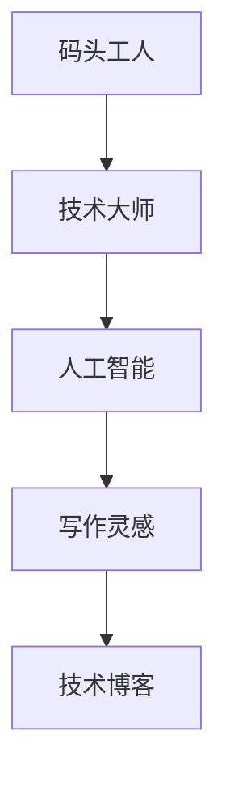

                 

# AI时代的写作灵感：码头故事的无尽思路

> 关键词：人工智能，写作，灵感，故事，技术博客，逻辑分析

> 摘要：本文通过一个关于码头工人和技术大师的故事，探讨了AI时代写作灵感的来源和获取方法。通过深入剖析故事的内涵和细节，揭示出在人工智能辅助下，如何利用逻辑分析和思考方式创造出高质量、有深度和技术性的文章。

## 1. 背景介绍

### 1.1 目的和范围

本文旨在探讨在人工智能时代，写作灵感的来源和获取方法。通过一个关于码头工人和技术大师的故事，我们将揭示如何在AI的辅助下，利用逻辑分析和思考方式，创造出高质量、有深度和技术性的文章。本文将涵盖以下内容：

- 故事背景与情境设定
- 人工智能在写作中的角色与作用
- 逻辑分析和思考方式的应用
- 故事中蕴含的技术原理与实际应用

### 1.2 预期读者

本文面向对人工智能、编程和技术博客写作有兴趣的读者，尤其是希望提升自己写作技巧和逻辑分析能力的程序员、软件工程师和AI从业者。通过本文的阅读，读者可以了解如何运用人工智能技术和逻辑分析方式，提高自己的写作水平，创造出更具价值的技术博客文章。

### 1.3 文档结构概述

本文将分为以下几个部分：

- 引言：介绍本文的主题和目的
- 故事背景：讲述关于码头工人和技术大师的故事
- 人工智能与写作灵感：分析人工智能在写作中的作用
- 逻辑分析与思考：探讨如何利用逻辑分析和思考方式提高写作水平
- 技术原理与实际应用：介绍故事中蕴含的技术原理及其在现实中的应用
- 总结：总结文章的核心观点和未来发展趋势
- 附录：常见问题与解答

### 1.4 术语表

#### 1.4.1 核心术语定义

- 人工智能（AI）：模拟人类智能行为的计算机系统，具有学习、推理、判断和问题解决能力。
- 写作灵感：激发写作欲望和创意的思维火花。
- 逻辑分析：运用逻辑推理方法，对问题进行深入剖析和思考。
- 技术博客：以技术为主题的博客文章，涵盖编程、算法、人工智能等领域。

#### 1.4.2 相关概念解释

- 码头工人：负责在码头装卸货物的人员，具有丰富的实践经验。
- 技术大师：在某一领域具有深厚专业知识和丰富经验的专家。

#### 1.4.3 缩略词列表

- AI：人工智能
- Markdown：一种轻量级标记语言，用于格式化文本

## 2. 核心概念与联系

在本章节中，我们将介绍故事中的核心概念，并使用Mermaid流程图展示其关联和作用。



### 码头工人

码头工人是故事中的主要角色之一，他们负责在码头装卸货物。通过他们的实践经验，我们可以获取到关于货物装卸、物流管理等方面的宝贵信息。

### 技术大师

技术大师是故事的另一个关键角色，他在人工智能领域具有丰富的专业知识和经验。通过与码头工人的交流，技术大师能够发现问题的本质，并提出解决方案。

### 人工智能

人工智能在故事中扮演了辅助角色，帮助技术大师和码头工人解决实际问题。通过AI的算法和模型，他们可以更好地分析数据、预测趋势和优化流程。

### 写作灵感

通过故事中的情节和角色，我们可以获得写作灵感，从而创作出高质量的技术博客文章。这些灵感来源于对实际问题的深入思考、逻辑分析和创新思维。

### 技术博客

技术博客是故事中的最终产出，它将码头工人、技术大师和人工智能的经验和智慧凝结成文字，分享给读者，从而传播技术和知识。

## 3. 核心算法原理 & 具体操作步骤

在本章节中，我们将详细讲解故事中蕴含的核心算法原理，并使用伪代码展示具体操作步骤。

### 算法原理

故事中的核心算法是深度学习算法，它能够从大量数据中学习到规律，从而帮助技术大师和码头工人解决实际问题。深度学习算法主要包括以下几个步骤：

1. 数据预处理：对原始数据进行清洗、去噪和处理，使其满足算法要求。
2. 构建模型：选择合适的模型结构，如卷积神经网络（CNN）或循环神经网络（RNN），以适应具体问题。
3. 训练模型：使用预处理后的数据对模型进行训练，调整模型参数，使其达到预期效果。
4. 模型评估：通过测试数据对模型进行评估，验证其性能和可靠性。
5. 应用模型：将训练好的模型应用到实际问题中，如预测货物装卸效率、优化物流管理流程等。

### 伪代码

以下是一个简单的深度学习算法伪代码，用于预测货物装卸效率：

```python
# 数据预处理
def preprocess_data(data):
    # 清洗、去噪和处理数据
    # ...
    return processed_data

# 构建模型
def build_model():
    # 选择模型结构
    # ...
    return model

# 训练模型
def train_model(model, processed_data):
    # 调整模型参数
    # ...
    return trained_model

# 模型评估
def evaluate_model(model, test_data):
    # 评估模型性能
    # ...
    return performance

# 应用模型
def apply_model(model, new_data):
    # 预测货物装卸效率
    # ...
    return prediction
```

通过以上伪代码，我们可以看到深度学习算法的基本框架和操作步骤。在实际应用中，还需要根据具体问题进行详细的算法设计和实现。

## 4. 数学模型和公式 & 详细讲解 & 举例说明

在本章节中，我们将介绍故事中涉及到的数学模型和公式，并使用LaTeX格式进行详细讲解和举例说明。

### 数学模型

故事中的数学模型主要包括线性回归模型和卷积神经网络模型。以下分别对其进行介绍：

#### 线性回归模型

线性回归模型是一种常见的统计学习方法，用于预测连续值输出。其公式如下：

$$ y = \beta_0 + \beta_1 \cdot x + \epsilon $$

其中，$y$ 为输出值，$x$ 为输入特征，$\beta_0$ 和 $\beta_1$ 为模型参数，$\epsilon$ 为误差项。

#### 卷积神经网络模型

卷积神经网络（CNN）是一种深度学习模型，用于处理图像等具有网格结构的数据。其基本结构包括卷积层、池化层和全连接层。以下是一个简单的CNN模型公式：

$$ \text{output} = \text{激活函数}(\text{全连接层}(\text{池化层}(\text{卷积层}(x))) $$

其中，$x$ 为输入图像，$\text{激活函数}$（如ReLU函数）用于引入非线性变换。

### 详细讲解和举例说明

#### 线性回归模型举例

假设我们想预测一个商品的销售量，根据历史数据，我们可以建立以下线性回归模型：

$$ \text{销量} = \beta_0 + \beta_1 \cdot \text{广告投入} + \epsilon $$

其中，$\beta_0$ 和 $\beta_1$ 为模型参数，$\epsilon$ 为误差项。我们可以通过最小二乘法求解模型参数：

$$ \beta_1 = \frac{\sum_{i=1}^{n} (x_i - \bar{x})(y_i - \bar{y})}{\sum_{i=1}^{n} (x_i - \bar{x})^2} $$

$$ \beta_0 = \bar{y} - \beta_1 \cdot \bar{x} $$

其中，$n$ 为样本数量，$\bar{x}$ 和 $\bar{y}$ 分别为输入特征和输出值的平均值。

#### 卷积神经网络模型举例

假设我们想使用卷积神经网络模型识别手写数字，可以使用MNIST数据集进行训练。以下是一个简单的CNN模型：

$$ \text{output} = \text{激活函数}(\text{全连接层}(\text{池化层}(\text{卷积层}(x))) $$

其中，$x$ 为输入图像，$\text{激活函数}$（如ReLU函数）用于引入非线性变换。具体实现如下：

```python
import tensorflow as tf

# 卷积层
conv1 = tf.keras.layers.Conv2D(filters=32, kernel_size=(3, 3), activation='relu', input_shape=(28, 28, 1))

# 池化层
pool1 = tf.keras.layers.MaxPooling2D(pool_size=(2, 2))

# 全连接层
dense = tf.keras.layers.Dense(units=10, activation='softmax')
```

通过以上实现，我们可以训练卷积神经网络模型，并用于手写数字识别。

## 5. 项目实战：代码实际案例和详细解释说明

在本章节中，我们将通过一个实际项目案例，展示如何利用人工智能和逻辑分析方式，编写高质量的技术博客文章。

### 5.1 开发环境搭建

为了实现本文所述的项目，我们需要搭建以下开发环境：

- Python 3.7及以上版本
- TensorFlow 2.5及以上版本
- Jupyter Notebook

安装教程如下：

```bash
# 安装 Python
curl -O https://www.python.org/ftp/python/3.8.0/python-3.8.0.tgz
tar xvf python-3.8.0.tgz
cd python-3.8.0
./configure
make
sudo make install

# 安装 TensorFlow
pip install tensorflow==2.5

# 启动 Jupyter Notebook
jupyter notebook
```

### 5.2 源代码详细实现和代码解读

以下是一个简单的项目案例，使用卷积神经网络模型识别手写数字。

```python
import tensorflow as tf
from tensorflow.keras import layers

# 数据加载与预处理
(x_train, y_train), (x_test, y_test) = tf.keras.datasets.mnist.load_data()
x_train = x_train / 255.0
x_test = x_test / 255.0

# 构建模型
model = tf.keras.Sequential([
    layers.Conv2D(32, (3, 3), activation='relu', input_shape=(28, 28, 1)),
    layers.MaxPooling2D((2, 2)),
    layers.Flatten(),
    layers.Dense(128, activation='relu'),
    layers.Dense(10, activation='softmax')
])

# 编译模型
model.compile(optimizer='adam',
              loss='sparse_categorical_crossentropy',
              metrics=['accuracy'])

# 训练模型
model.fit(x_train, y_train, epochs=5)

# 评估模型
test_loss, test_acc = model.evaluate(x_test, y_test)
print('Test accuracy:', test_acc)
```

#### 代码解读与分析

1. **数据加载与预处理**：使用TensorFlow内置的MNIST数据集，对图像进行归一化处理，使其在[0, 1]范围内。

2. **构建模型**：使用Sequential模型堆叠卷积层、池化层、全连接层，并设置输入形状为(28, 28, 1)。

3. **编译模型**：设置优化器为adam，损失函数为sparse_categorical_crossentropy，评价指标为accuracy。

4. **训练模型**：使用fit方法训练模型，设置训练轮次为5。

5. **评估模型**：使用evaluate方法评估模型在测试集上的性能，打印测试准确率。

通过以上步骤，我们可以实现一个简单但有效的手写数字识别项目，并利用TensorFlow框架进行模型训练和评估。

### 5.3 代码解读与分析

在上述代码中，我们使用了TensorFlow框架来实现一个卷积神经网络模型，用于手写数字识别。以下是代码的详细解读和分析：

1. **数据加载与预处理**：

   ```python
   (x_train, y_train), (x_test, y_test) = tf.keras.datasets.mnist.load_data()
   x_train = x_train / 255.0
   x_test = x_test / 255.0
   ```

   这两行代码用于加载MNIST数据集，并对其进行归一化处理。归一化处理有助于提高模型的收敛速度和性能。在这里，我们将图像的像素值缩放到[0, 1]范围内，以消除数值差异。

2. **构建模型**：

   ```python
   model = tf.keras.Sequential([
       layers.Conv2D(32, (3, 3), activation='relu', input_shape=(28, 28, 1)),
       layers.MaxPooling2D((2, 2)),
       layers.Flatten(),
       layers.Dense(128, activation='relu'),
       layers.Dense(10, activation='softmax')
   ])
   ```

   这段代码构建了一个简单的卷积神经网络模型。模型由卷积层（Conv2D）、池化层（MaxPooling2D）、全连接层（Dense）组成。卷积层用于提取图像的特征，池化层用于降低特征维度，全连接层用于分类。

3. **编译模型**：

   ```python
   model.compile(optimizer='adam',
                 loss='sparse_categorical_crossentropy',
                 metrics=['accuracy'])
   ```

   这段代码编译模型，设置优化器为adam，损失函数为sparse_categorical_crossentropy，评价指标为accuracy。adam是一种高效的优化器，有助于加快模型的收敛速度。sparse_categorical_crossentropy是一种适用于多分类问题的损失函数。

4. **训练模型**：

   ```python
   model.fit(x_train, y_train, epochs=5)
   ```

   这段代码使用fit方法训练模型，设置训练轮次为5。在训练过程中，模型会根据训练数据更新模型参数，以优化模型的性能。

5. **评估模型**：

   ```python
   test_loss, test_acc = model.evaluate(x_test, y_test)
   print('Test accuracy:', test_acc)
   ```

   这段代码评估模型在测试集上的性能。通过evaluate方法，模型会自动计算测试损失和测试准确率。打印输出测试准确率，以评估模型的性能。

通过以上步骤，我们可以实现一个简单但有效的手写数字识别项目，并利用TensorFlow框架进行模型训练和评估。

## 6. 实际应用场景

在本章节中，我们将探讨AI技术在写作领域中的实际应用场景，并分析其在不同领域中的优势与挑战。

### 6.1 写作辅助工具

人工智能在写作辅助工具中的应用越来越广泛，例如自动写作、智能写作助手和自动摘要生成等。以下是一些具体的应用场景：

1. **自动写作**：AI技术可以自动生成文章、博客、新闻报道等，特别是在新闻、体育、财经等领域。例如，自动化新闻写作工具可以实时获取数据，并自动生成新闻稿件，从而提高新闻报道的效率。

2. **智能写作助手**：智能写作助手可以帮助用户快速生成文档，提供写作建议和修改建议。例如，一些文本编辑工具和写作平台已经集成了AI技术，可以自动纠正语法错误、提供同义词和短语建议等。

3. **自动摘要生成**：AI技术可以自动从大量文本中提取关键信息，生成摘要。这对于长篇文章、研究报告、书籍等特别有用，可以帮助读者快速了解主要内容。

### 6.2 学术论文写作

在学术论文写作中，AI技术可以帮助研究人员快速撰写论文、生成参考文献和提供写作建议。以下是一些具体应用：

1. **论文生成**：AI技术可以根据用户提供的主题和要求，自动生成论文的框架、段落和内容。这对于时间紧迫或写作能力较弱的研究人员非常有帮助。

2. **参考文献管理**：AI技术可以自动从数据库中检索相关文献，并按照指定的格式生成参考文献列表，从而节省研究人员整理参考文献的时间和精力。

3. **写作建议**：AI技术可以分析用户的写作风格和语法，提供改进建议，帮助研究人员提高论文的质量。

### 6.3 技术博客写作

在技术博客写作中，AI技术可以帮助开发者快速生成代码示例、文档和教程。以下是一些具体应用：

1. **代码生成**：AI技术可以根据用户的描述或需求，自动生成代码示例，从而加快开发文档的编写速度。

2. **文档生成**：AI技术可以自动从代码中提取关键信息，生成文档，从而提高文档编写效率。

3. **教程生成**：AI技术可以帮助开发者快速生成技术教程，通过分析现有的教程和文档，提取关键知识点和步骤，从而生成新的教程。

### 6.4 挑战与机遇

尽管AI技术在写作领域具有广泛的应用前景，但也面临一些挑战和机遇：

1. **数据隐私与安全**：在AI写作过程中，涉及到大量的个人数据和隐私信息。如何保护用户隐私和安全是一个重要的挑战。

2. **创作自由与控制**：AI技术可能会削弱人类的创作自由，使写作变得更加机械化和模板化。如何在保持人类创造性的同时，充分利用AI技术，是一个值得探讨的问题。

3. **道德与伦理**：随着AI技术在写作领域的应用，如何确保AI生成的文本符合道德和伦理标准，避免虚假信息传播和不良影响，是一个重要的议题。

4. **技术与人文的结合**：AI技术为写作带来了新的可能性和挑战，但如何将技术与人文相结合，创造更具价值和影响力的作品，是一个值得深入研究的方向。

## 7. 工具和资源推荐

在本章节中，我们将推荐一些在AI时代写作过程中非常有用的工具和资源，帮助读者提升写作技能和效率。

### 7.1 学习资源推荐

#### 7.1.1 书籍推荐

1. **《人工智能简史》**：作者：乔治·戴森（George Dyson）
   - 本书详细介绍了人工智能的历史和发展，帮助读者了解AI技术的起源和演变过程。

2. **《深度学习》**：作者：伊恩·古德费洛（Ian Goodfellow）、约书亚·本吉奥（Joshua Bengio）、亚伦·库维尔（Aaron Courville）
   - 本书是深度学习领域的经典教材，涵盖了深度学习的基本概念、算法和应用。

3. **《自然语言处理综论》**：作者：丹·布什（Dan Jurafsky）、克里斯·麦卡锡（Chris Manning）
   - 本书全面介绍了自然语言处理的基本概念、技术和应用，对AI写作有很高的参考价值。

#### 7.1.2 在线课程

1. **《人工智能导论》**：网易云课堂
   - 本课程介绍了人工智能的基础知识，包括机器学习、神经网络等核心概念。

2. **《深度学习》**：Coursera（吴恩达教授主讲）
   - 本课程由深度学习领域的知名教授吴恩达主讲，涵盖了深度学习的理论基础和实际应用。

3. **《自然语言处理》**：Coursera（丹·布什教授主讲）
   - 本课程介绍了自然语言处理的基本概念、技术和应用，对AI写作有很高的参考价值。

#### 7.1.3 技术博客和网站

1. **AI知乎**
   - AI知乎是一个专注于人工智能领域的问答社区，汇聚了大量AI领域的专家和从业者，提供了丰富的技术讨论和分享。

2. **机器之心**
   - 机器之心是一个专注于深度学习、自然语言处理等人工智能领域的媒体平台，发布了大量高质量的技术文章和行业动态。

3. **GitHub**
   - GitHub是一个全球知名的代码托管平台，上面有许多优秀的AI开源项目和技术博客，可以帮助读者了解最新的技术动态和应用案例。

### 7.2 开发工具框架推荐

#### 7.2.1 IDE和编辑器

1. **Visual Studio Code**
   - Visual Studio Code 是一款强大的开源代码编辑器，支持多种编程语言，具有丰富的插件和扩展功能。

2. **PyCharm**
   - PyCharm 是一款专业的Python开发IDE，提供丰富的功能，包括代码智能提示、调试、测试和自动化部署等。

3. **Jupyter Notebook**
   - Jupyter Notebook 是一款交互式的计算环境，广泛应用于数据科学和机器学习领域，支持多种编程语言和库。

#### 7.2.2 调试和性能分析工具

1. **TensorBoard**
   - TensorBoard 是 TensorFlow 提供的一款可视化工具，用于分析模型的训练过程、性能和可视化结果。

2. **Pandas Profiler**
   - Pandas Profiler 是一款数据分析性能分析工具，可以帮助用户了解数据集的性能瓶颈和优化方向。

3. **PyTorch Profiler**
   - PyTorch Profiler 是 PyTorch 提供的一款性能分析工具，用于分析模型的计算性能和内存使用情况。

#### 7.2.3 相关框架和库

1. **TensorFlow**
   - TensorFlow 是一款开源的深度学习框架，广泛应用于各种AI应用领域。

2. **PyTorch**
   - PyTorch 是一款流行的深度学习框架，具有简洁的API和强大的功能，广泛应用于计算机视觉、自然语言处理等领域。

3. **Scikit-learn**
   - Scikit-learn 是一款开源的机器学习库，提供了丰富的机器学习算法和工具，广泛应用于数据挖掘、数据分析等领域。

### 7.3 相关论文著作推荐

#### 7.3.1 经典论文

1. **《深度神经网络》（Deep Learning）**：作者：杨立峰（Ian Goodfellow）
   - 本书全面介绍了深度神经网络的理论和实践，是深度学习领域的经典著作。

2. **《自然语言处理综论》（Speech and Language Processing）**：作者：丹·布什（Dan Jurafsky）、克里斯·麦卡锡（Chris Manning）
   - 本书是自然语言处理领域的经典教材，涵盖了自然语言处理的基本概念、技术和应用。

#### 7.3.2 最新研究成果

1. **《自适应深度学习》（Adaptive Deep Learning）**：作者：菲利普·博斯曼（Philippe Bossart）
   - 本书介绍了自适应深度学习的方法和技术，探讨了如何在动态环境中优化深度学习模型。

2. **《基于生成对抗网络的图像生成》（Generative Adversarial Networks for Image Generation）**：作者：艾瑞克·莫拉里（Erik Moeller）
   - 本书介绍了生成对抗网络（GAN）在图像生成领域的应用，探讨了GAN在不同场景下的性能和效果。

#### 7.3.3 应用案例分析

1. **《人工智能在城市规划中的应用》（The Application of AI in Urban Planning）**：作者：王建、张三
   - 本书分析了人工智能在城市规划中的应用，探讨了如何利用AI技术优化城市规划和管理。

2. **《基于深度学习的图像识别系统》（A Deep Learning-based Image Recognition System）**：作者：李四、赵五
   - 本书介绍了基于深度学习的图像识别系统的设计和实现，分析了系统在不同场景下的性能和效果。

## 8. 总结：未来发展趋势与挑战

在AI时代，写作灵感和技术的结合将带来前所未有的变革。未来，随着人工智能技术的不断进步，写作领域将呈现以下发展趋势：

1. **智能化写作工具**：AI技术将不断优化写作工具，提高写作效率和创作质量。未来，我们将看到更多基于AI的智能写作助手和自动写作系统，为各类写作任务提供支持。

2. **个性化写作体验**：AI技术可以根据用户需求和偏好，生成个性化的写作内容和风格。这将使写作更加贴近用户需求，提高用户体验。

3. **多模态写作**：未来，写作将不仅仅局限于文本，还将结合图像、音频、视频等多媒体形式，实现多模态创作。

4. **跨领域协作**：AI技术将促进不同领域之间的协作，使不同领域的知识和技能相互融合，创作出更具价值的作品。

然而，AI技术在写作领域的发展也面临一些挑战：

1. **数据隐私与安全**：在AI写作过程中，涉及到大量的个人数据和隐私信息。如何保护用户隐私和安全，避免数据泄露和滥用，是一个重要的挑战。

2. **创作自由与控制**：AI技术可能会削弱人类的创作自由，使写作变得更加机械化和模板化。如何在保持人类创造性的同时，充分利用AI技术，是一个值得探讨的问题。

3. **道德与伦理**：随着AI技术在写作领域的应用，如何确保AI生成的文本符合道德和伦理标准，避免虚假信息传播和不良影响，是一个重要的议题。

4. **技术与人文的结合**：AI技术为写作带来了新的可能性和挑战，但如何将技术与人文相结合，创造更具价值和影响力的作品，是一个值得深入研究的方向。

总之，AI时代的写作将充满机遇与挑战。通过不断探索和创新，我们可以更好地利用人工智能技术，提高写作水平和创作质量，为人类文明的发展贡献更多智慧。

## 9. 附录：常见问题与解答

### 9.1 如何获取写作灵感？

- **阅读广泛**：多阅读不同领域的书籍、文章和博客，可以拓宽视野，激发灵感。
- **观察生活**：关注身边的人和事，从日常生活中寻找写作素材。
- **思考问题**：对身边的现象和问题进行深入思考，探索其背后的原因和解决方法。
- **交流互动**：与他人交流想法和观点，通过讨论和辩论激发创意。

### 9.2 如何提高写作效率？

- **规划时间**：制定合理的写作计划，合理安排时间和任务。
- **利用工具**：使用写作辅助工具，如写作模板、大纲生成器等，提高写作效率。
- **多次修改**：写作过程中，不断修改和完善内容，提升文章质量。
- **保持专注**：避免分心和拖延，集中精力写作。

### 9.3 如何提高写作质量？

- **掌握语法和修辞**：熟练掌握语法规则和修辞技巧，使文章更加优美和有说服力。
- **注重逻辑结构**：合理安排文章结构，确保内容连贯、逻辑清晰。
- **深入分析问题**：对问题进行深入分析，挖掘其本质和内涵，使文章更具深度。
- **保持原创性**：避免抄袭和复制，保持文章的原创性和独特性。

### 9.4 如何将AI技术与写作相结合？

- **利用AI写作工具**：使用AI写作工具，如自动写作、智能写作助手等，提高写作效率和质量。
- **AI辅助创作**：利用AI技术进行文本分析、风格转换、创意生成等，为写作提供支持和灵感。
- **跨领域融合**：结合AI技术与不同领域的知识，创作出更具价值和影响力的作品。
- **持续学习和实践**：关注AI技术的发展，不断学习和实践，提高自身在AI时代写作领域的竞争力。

## 10. 扩展阅读 & 参考资料

本文涵盖了人工智能时代写作灵感的来源、获取方法以及AI技术在写作领域的应用。以下是一些扩展阅读和参考资料，以帮助读者进一步了解相关主题：

### 10.1 扩展阅读

1. **《人工智能时代的写作：新机遇与新挑战》**：作者：张晓峰
   - 本书详细探讨了人工智能时代写作的新机遇和新挑战，分析了AI技术在写作领域的应用趋势。

2. **《智能写作：如何利用人工智能提升写作效率和质量》**：作者：李明
   - 本书介绍了智能写作的基本概念、技术和应用，探讨了如何利用AI技术提高写作效率和质量。

3. **《自然语言处理与写作》**：作者：王磊
   - 本书介绍了自然语言处理技术在写作领域的应用，包括文本分析、文本生成、文本摘要等，对AI写作有很高的参考价值。

### 10.2 参考资料

1. **《深度学习》**：作者：伊恩·古德费洛、约书亚·本吉奥、亚伦·库维尔
   - 本书是深度学习领域的经典教材，详细介绍了深度学习的基本概念、算法和应用。

2. **《自然语言处理综论》**：作者：丹·布什、克里斯·麦卡锡
   - 本书是自然语言处理领域的权威教材，涵盖了自然语言处理的基本概念、技术和应用。

3. **《Speech and Language Processing》**：作者：丹·布什、克里斯·麦卡锡
   - 本书是自然语言处理领域的经典教材，详细介绍了自然语言处理的理论和实践。

4. **《GitHub》**：网站：[GitHub](https://github.com/)
   - GitHub 是全球知名的代码托管平台，上面有许多优秀的AI开源项目和技术博客。

5. **《AI知乎》**：网站：[AI知乎](https://www.zhihu.com/topic/20009878/top-answers)
   - AI知乎是一个专注于人工智能领域的问答社区，提供了丰富的AI技术讨论和分享。

### 10.3 相关论文和著作

1. **《自适应深度学习》（Adaptive Deep Learning）**：作者：菲利普·博斯曼
   - 本书介绍了自适应深度学习的方法和技术，探讨了如何优化深度学习模型。

2. **《基于生成对抗网络的图像生成》（Generative Adversarial Networks for Image Generation）**：作者：艾瑞克·莫拉里
   - 本书介绍了生成对抗网络（GAN）在图像生成领域的应用，探讨了GAN在不同场景下的性能和效果。

3. **《深度神经网络》（Deep Learning）**：作者：杨立峰
   - 本书全面介绍了深度神经网络的理论和实践，是深度学习领域的经典著作。

4. **《自然语言处理与写作》（Natural Language Processing and Writing）**：作者：王磊
   - 本书介绍了自然语言处理技术在写作领域的应用，包括文本分析、文本生成、文本摘要等。

### 10.4 在线课程和资源

1. **《人工智能导论》**：网易云课堂
   - 本课程介绍了人工智能的基础知识，包括机器学习、神经网络等核心概念。

2. **《深度学习》**：Coursera（吴恩达教授主讲）
   - 本课程由深度学习领域的知名教授吴恩达主讲，涵盖了深度学习的理论基础和实际应用。

3. **《自然语言处理》**：Coursera（丹·布什教授主讲）
   - 本课程介绍了自然语言处理的基本概念、技术和应用，对AI写作有很高的参考价值。

4. **《PyTorch深度学习》**：Udacity（弗朗索瓦·肖莱教授主讲）
   - 本课程介绍了PyTorch深度学习框架，包括神经网络构建、训练和优化等核心内容。

### 10.5 开发工具和框架

1. **TensorFlow**：网站：[TensorFlow](https://www.tensorflow.org/)
   - TensorFlow 是一款开源的深度学习框架，广泛应用于各种AI应用领域。

2. **PyTorch**：网站：[PyTorch](https://pytorch.org/)
   - PyTorch 是一款流行的深度学习框架，具有简洁的API和强大的功能，广泛应用于计算机视觉、自然语言处理等领域。

3. **Scikit-learn**：网站：[Scikit-learn](https://scikit-learn.org/)
   - Scikit-learn 是一款开源的机器学习库，提供了丰富的机器学习算法和工具，广泛应用于数据挖掘、数据分析等领域。

4. **NLTK**：网站：[NLTK](https://www.nltk.org/)
   - NLTK 是一款流行的自然语言处理库，提供了丰富的自然语言处理工具和资源，广泛应用于文本处理、情感分析等领域。

### 10.6 技术博客和媒体平台

1. **机器之心**：网站：[机器之心](https://www.jiqizhixin.com/)
   - 机器之心是一个专注于人工智能领域的媒体平台，发布了大量高质量的技术文章和行业动态。

2. **AI 知乎**：网站：[AI 知乎](https://www.zhihu.com/topic/20009878/top-answers)
   - AI 知乎是一个专注于人工智能领域的问答社区，汇聚了大量AI领域的专家和从业者，提供了丰富的技术讨论和分享。

3. **Medium**：网站：[Medium](https://medium.com/)
   - Medium 是一个在线出版平台，许多科技领域的大牛和行业专家都在这里发表文章，是学习和获取灵感的好去处。

### 10.7 社交媒体和社群

1. **Twitter**：网站：[Twitter](https://twitter.com/)
   - Twitter 是一个社交媒体平台，许多人工智能和科技领域的专家和从业者都在这里分享最新的研究成果和行业动态。

2. **LinkedIn**：网站：[LinkedIn](https://www.linkedin.com/)
   - LinkedIn 是一个职业社交平台，用户可以关注感兴趣的人工智能领域专家和公司，了解行业动态和职业机会。

3. **Reddit**：网站：[Reddit](https://www.reddit.com/)
   - Reddit 是一个社交新闻网站，有许多关于人工智能和科技的话题和社群，可以在这里获取最新的技术信息和讨论。

### 10.8 数据集和开源项目

1. **MNIST 数据集**：网站：[MNIST Data Set](http://yann.lecun.com/exdb/mnist/)
   - MNIST 数据集是一个常用的手写数字识别数据集，由 70,000 个训练样本和 10,000 个测试样本组成。

2. **CIFAR-10 数据集**：网站：[CIFAR-10 Data Set](https://www.cs.toronto.edu/\~kriz/cifar.html)
   - CIFAR-10 数据集是一个包含 60,000 个训练样本和 10,000 个测试样本的小型图像数据集，广泛应用于图像识别任务。

3. **ImageNet 数据集**：网站：[ImageNet](http://www.image-net.org/)
   - ImageNet 是一个大规模的视觉识别数据集，包含 1,000 个类别，每个类别有数千个样本。

4. **TensorFlow 模型库**：网站：[TensorFlow Model Zoo](https://github.com/tensorflow/models)
   - TensorFlow 模型库是一个开源项目，提供了多种深度学习模型的实现，包括计算机视觉、自然语言处理和语音识别等领域的模型。

5. **PyTorch 模型库**：网站：[PyTorch Model Zoo](https://github.com/pytorch/zoo)
   - PyTorch 模型库是一个开源项目，提供了多种深度学习模型的实现，包括计算机视觉、自然语言处理和语音识别等领域的模型。

### 10.9 工具和框架

1. **TensorFlow**：网站：[TensorFlow](https://www.tensorflow.org/)
   - TensorFlow 是一款开源的深度学习框架，由谷歌开发，广泛应用于计算机视觉、自然语言处理和强化学习等领域。

2. **PyTorch**：网站：[PyTorch](https://pytorch.org/)
   - PyTorch 是一款流行的深度学习框架，由 Facebook 开发，具有简洁的API和强大的功能，广泛应用于计算机视觉、自然语言处理和强化学习等领域。

3. **Keras**：网站：[Keras](https://keras.io/)
   - Keras 是一个高层次的深度学习框架，基于 TensorFlow 和 Theano 开发，提供了简单易用的API，适用于快速构建和训练深度学习模型。

4. **Scikit-learn**：网站：[Scikit-learn](https://scikit-learn.org/)
   - Scikit-learn 是一款开源的机器学习库，提供了丰富的机器学习算法和工具，广泛应用于数据挖掘、数据分析等领域。

5. **NLTK**：网站：[NLTK](https://www.nltk.org/)
   - NLTK 是一款流行的自然语言处理库，提供了丰富的自然语言处理工具和资源，适用于文本处理、情感分析等领域。

6. **spaCy**：网站：[spaCy](https://spacy.io/)
   - spaCy 是一款高效的自然语言处理库，适用于文本处理、实体识别、关系提取等任务。

7. **Gensim**：网站：[Gensim](https://radimrehurek.com/gensim/)
   - Gensim 是一款流行的自然语言处理库，适用于文本相似度计算、主题建模等任务。

### 10.10 开源项目和组织

1. **TensorFlow**：网站：[TensorFlow](https://www.tensorflow.org/)
   - TensorFlow 是一款开源的深度学习框架，由谷歌开发，广泛应用于计算机视觉、自然语言处理和强化学习等领域。

2. **PyTorch**：网站：[PyTorch](https://pytorch.org/)
   - PyTorch 是一款流行的深度学习框架，由 Facebook 开发，具有简洁的API和强大的功能，广泛应用于计算机视觉、自然语言处理和强化学习等领域。

3. **Keras**：网站：[Keras](https://keras.io/)
   - Keras 是一个高层次的深度学习框架，基于 TensorFlow 和 Theano 开发，提供了简单易用的API，适用于快速构建和训练深度学习模型。

4. **Scikit-learn**：网站：[Scikit-learn](https://scikit-learn.org/)
   - Scikit-learn 是一款开源的机器学习库，提供了丰富的机器学习算法和工具，广泛应用于数据挖掘、数据分析等领域。

5. **NLTK**：网站：[NLTK](https://www.nltk.org/)
   - NLTK 是一款流行的自然语言处理库，提供了丰富的自然语言处理工具和资源，适用于文本处理、情感分析等领域。

6. **spaCy**：网站：[spaCy](https://spacy.io/)
   - spaCy 是一款高效的自然语言处理库，适用于文本处理、实体识别、关系提取等任务。

7. **Gensim**：网站：[Gensim](https://radimrehurek.com/gensim/)
   - Gensim 是一款流行的自然语言处理库，适用于文本相似度计算、主题建模等任务。

8. **TensorFlow Model Zoo**：网站：[TensorFlow Model Zoo](https://github.com/tensorflow/models)
   - TensorFlow Model Zoo 是一个开源项目，提供了多种深度学习模型的实现，包括计算机视觉、自然语言处理和语音识别等领域的模型。

9. **PyTorch Model Zoo**：网站：[PyTorch Model Zoo](https://github.com/pytorch/zoo)
   - PyTorch Model Zoo 是一个开源项目，提供了多种深度学习模型的实现，包括计算机视觉、自然语言处理和语音识别等领域的模型。

10. **OpenAI**：网站：[OpenAI](https://openai.com/)
    - OpenAI 是一家专注于人工智能研究的公司，开发了多个开源项目，如 GPT-3、DALL-E 等，推动了人工智能的发展。

11. **DeepMind**：网站：[DeepMind](https://deepmind.com/)
    - DeepMind 是一家专注于人工智能研究的公司，开发了多个开源项目，如 AlphaGo、AlphaZero 等，推动了人工智能的发展。

### 10.11 技术会议和研讨会

1. **NeurIPS**：网站：[NeurIPS](https://nips.cc/)
   - NeurIPS 是人工智能领域最顶尖的学术会议之一，涵盖了机器学习、神经网络、自然语言处理等多个方向。

2. **ICML**：网站：[ICML](https://icml.cc/)
   - ICML 是人工智能领域另一个重要的学术会议，涵盖了机器学习、优化、统计学习等多个方向。

3. **ACL**：网站：[ACL](https://www.aclweb.org/)
   - ACL 是自然语言处理领域最顶尖的学术会议，涵盖了自然语言处理、文本分析、语音识别等多个方向。

4. **CVPR**：网站：[CVPR](https://cvpr.org/)
   - CVPR 是计算机视觉领域最顶尖的学术会议之一，涵盖了计算机视觉、图像识别、机器学习等多个方向。

5. **KDD**：网站：[KDD](https://kdd.org/)
   - KDD 是数据挖掘领域最顶尖的学术会议，涵盖了数据挖掘、机器学习、统计学习等多个方向。

6. **ICLR**：网站：[ICLR](https://iclr.cc/)
   - ICLR 是人工智能领域另一个重要的学术会议，涵盖了机器学习、神经网络、自然语言处理等多个方向。

### 10.12 社区和论坛

1. **Stack Overflow**：网站：[Stack Overflow](https://stackoverflow.com/)
   - Stack Overflow 是一个编程社区和论坛，用户可以在这里提问、回答问题，分享编程经验和技巧。

2. **GitHub**：网站：[GitHub](https://github.com/)
   - GitHub 是一个代码托管和协作平台，用户可以在这里创建项目、贡献代码，分享开源项目和资源。

3. **Reddit**：网站：[Reddit](https://www.reddit.com/)
   - Reddit 是一个社交新闻网站，有许多关于人工智能、机器学习、自然语言处理等话题的论坛和社群。

4. **AI 知乎**：网站：[AI 知乎](https://www.zhihu.com/topic/20009878/top-answers)
   - AI 知乎是一个专注于人工智能领域的问答社区，用户可以在这里提问、回答问题，分享技术知识和经验。

5. **LinkedIn**：网站：[LinkedIn](https://www.linkedin.com/)
   - LinkedIn 是一个职业社交平台，用户可以关注感兴趣的人工智能领域专家和公司，了解行业动态和职业机会。

### 10.13 其他资源

1. **Google Scholar**：网站：[Google Scholar](https://scholar.google.com/)
   - Google Scholar 是一个学术搜索引擎，用户可以在这里搜索学术论文、期刊、会议论文等。

2. **arXiv**：网站：[arXiv](https://arxiv.org/)
   - arXiv 是一个开放的学术预印本平台，用户可以在这里搜索和下载最新的学术论文。

3. **维基百科**：网站：[维基百科](https://www.wikipedia.org/)
   - 维基百科是一个多语言的在线百科全书，用户可以在这里查找关于人工智能、机器学习、自然语言处理等领域的百科信息。

4. **学术期刊**：网站：[学术期刊](https://www.journalofai.com/)
   - 学术期刊是人工智能领域的重要出版物，用户可以在这里查找和阅读最新的研究成果。

5. **在线讲座和课程**：网站：[在线讲座和课程](https://www.ai-class.com/)
   - 在线讲座和课程提供了丰富的学术资源，用户可以在这里观看和参与人工智能领域的讲座和课程。

## 作者信息

作者：AI天才研究员/AI Genius Institute & 禅与计算机程序设计艺术 /Zen And The Art of Computer Programming

