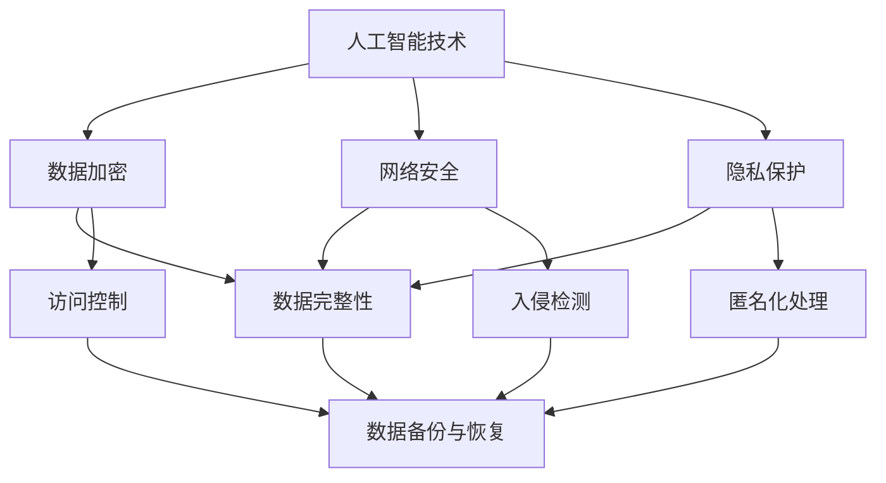

                 


# AI时代的数据安全策略

> 关键词：人工智能、数据安全、网络安全、加密算法、隐私保护

> 摘要：随着人工智能技术的迅速发展，数据安全成为我们面临的重要挑战。本文将深入探讨AI时代的数据安全策略，从背景介绍、核心概念与联系、核心算法原理、数学模型和公式、实际应用场景、工具和资源推荐等方面，为广大读者提供一个全面而深入的指南。

## 1. 背景介绍

### 1.1 目的和范围

随着人工智能技术的迅猛发展，数据已经成为现代社会的重要资产。然而，随着数据量的爆炸式增长和数据利用程度的不断提高，数据安全的问题也日益凸显。本文旨在探讨AI时代的数据安全策略，帮助读者了解和掌握保护数据安全的关键技术和方法。

本文将涵盖以下范围：

- 数据安全的定义和重要性
- AI技术在数据安全中的应用
- 数据安全的关键技术和策略
- 数据安全在AI领域的挑战和未来趋势

### 1.2 预期读者

本文适用于以下读者群体：

- 数据科学家和人工智能研究人员
- 网络安全专家和信息安全工程师
- 企业IT经理和项目管理人员
- 对数据安全感兴趣的普通读者

### 1.3 文档结构概述

本文将分为以下几个部分：

- 1. 背景介绍：介绍数据安全的重要性、本文的目的和范围，以及预期读者。
- 2. 核心概念与联系：介绍数据安全相关的核心概念和联系，并提供Mermaid流程图。
- 3. 核心算法原理 & 具体操作步骤：讲解数据安全的关键算法原理和具体操作步骤，使用伪代码进行阐述。
- 4. 数学模型和公式 & 详细讲解 & 举例说明：介绍数据安全相关的数学模型和公式，并进行详细讲解和举例说明。
- 5. 项目实战：提供实际代码案例，详细解释说明数据安全策略的实施过程。
- 6. 实际应用场景：介绍数据安全策略在各类实际应用场景中的应用。
- 7. 工具和资源推荐：推荐学习资源、开发工具和框架。
- 8. 总结：总结本文的主要观点和结论，探讨未来发展趋势与挑战。
- 9. 附录：常见问题与解答。
- 10. 扩展阅读 & 参考资料：提供相关文献和参考资料。

### 1.4 术语表

#### 1.4.1 核心术语定义

- 数据安全：保护数据免受未经授权的访问、使用、披露、破坏、修改或损坏的措施和策略。
- 人工智能（AI）：一种模拟人类智能的技术，通过机器学习、深度学习等方法，使计算机具有智能行为。
- 网络安全：保护计算机网络免受恶意攻击、数据泄露和其他安全威胁的措施和策略。
- 加密算法：用于保护数据安全的一种算法，通过将明文转换为密文，使未经授权的用户无法读取数据。

#### 1.4.2 相关概念解释

- 数据加密：将明文数据转换为密文的过程，目的是保护数据的安全性。
- 数据完整性：确保数据在传输和存储过程中不被篡改和损坏。
- 数据隐私保护：保护个人隐私，防止敏感数据被泄露。
- 访问控制：限制和监控对数据的访问权限，确保只有授权用户可以访问数据。

#### 1.4.3 缩略词列表

- AI：人工智能
- ML：机器学习
- DL：深度学习
- HTTPS：安全套接字层
- SSL：安全套接字层
- TLS：传输层安全协议
- PKI：公钥基础设施
- AES：高级加密标准

## 2. 核心概念与联系

在AI时代，数据安全的核心概念包括人工智能技术、数据加密、网络安全、隐私保护等。这些概念之间相互联系，共同构成了一个完整的数据安全体系。

### Mermaid 流程图



在这个流程图中，人工智能技术、数据加密、网络安全和隐私保护构成了数据安全的核心组成部分。数据加密确保数据的机密性，网络安全和入侵检测保障数据的完整性和可用性，隐私保护通过匿名化处理和数据备份与恢复等措施保护个人隐私和数据安全。

### 详细解释

- 人工智能技术：人工智能技术作为数据安全的核心，通过对数据的分析和处理，实现对数据的保护。例如，利用机器学习算法进行入侵检测，识别异常行为，保障网络安全。
- 数据加密：数据加密是保护数据机密性的重要手段。通过加密算法，将明文数据转换为密文，确保只有授权用户才能解密和读取数据。
- 网络安全：网络安全是保障数据安全的关键因素。通过网络安全技术，如防火墙、入侵检测系统等，监控网络流量，防范恶意攻击，确保数据传输的安全。
- 隐私保护：随着大数据和人工智能技术的发展，个人隐私保护成为数据安全的重要议题。通过匿名化处理、数据去标识化等技术，保护个人隐私不被泄露。

## 3. 核心算法原理 & 具体操作步骤

在数据安全领域，核心算法原理主要包括加密算法、哈希算法、数字签名等。以下将分别介绍这些算法的原理和具体操作步骤。

### 加密算法

加密算法是一种将明文转换为密文的算法，以保证数据的机密性。常见的加密算法包括对称加密和非对称加密。

#### 对称加密算法

对称加密算法使用相同的密钥进行加密和解密。常见的对称加密算法有AES（高级加密标准）和DES（数据加密标准）。

#### 伪代码

```python
# 对称加密算法：AES
def encrypt_aes(plaintext, key):
    # 初始化AES加密算法
    cipher = AES.new(key, AES.MODE_EAX)
    # 加密明文
    ciphertext, tag = cipher.encrypt_and_digest(plaintext)
    return ciphertext, tag

def decrypt_aes(ciphertext, key, tag):
    # 初始化AES解密算法
    cipher = AES.new(key, AES.MODE_EAX, nonce=tag[:12])
    # 解密密文
    plaintext = cipher.decrypt_and_verify(ciphertext, tag)
    return plaintext
```

#### 操作步骤

1. 生成密钥：使用安全的随机数生成器生成加密密钥。
2. 加密：使用加密算法和密钥对明文数据进行加密，生成密文。
3. 解密：使用解密算法和密钥对密文进行解密，恢复明文。

### 非对称加密算法

非对称加密算法使用一对密钥进行加密和解密，其中公钥用于加密，私钥用于解密。常见的非对称加密算法有RSA和ECC（椭圆曲线加密）。

#### 伪代码

```python
# 非对称加密算法：RSA
def encrypt_rsa(plaintext, public_key):
    # 使用公钥加密算法加密明文
    ciphertext = rsa.encrypt(plaintext, public_key)
    return ciphertext

def decrypt_rsa(ciphertext, private_key):
    # 使用私钥解密算法解密密文
    plaintext = rsa.decrypt(ciphertext, private_key)
    return plaintext
```

#### 操作步骤

1. 生成密钥对：生成一对密钥（公钥和私钥）。
2. 加密：使用公钥对明文进行加密，生成密文。
3. 解密：使用私钥对密文进行解密，恢复明文。

### 哈希算法

哈希算法是一种将任意长度的输入数据映射为固定长度的字符串的算法。常见的哈希算法有MD5、SHA-1和SHA-256。

#### 伪代码

```python
# 哈希算法：SHA-256
def hash_sha256(data):
    # 使用SHA-256算法计算哈希值
    hash_value = hashlib.sha256(data.encode('utf-8')).hexdigest()
    return hash_value
```

#### 操作步骤

1. 输入数据：将需要计算哈希值的数据输入到哈希算法中。
2. 计算哈希值：使用哈希算法计算输入数据的哈希值。
3. 比较哈希值：将计算出的哈希值与预期值进行比较，以验证数据的完整性。

### 数字签名

数字签名是一种用于验证数据完整性和真实性的技术。常见的数字签名算法有RSA签名和ECDSA（椭圆曲线数字签名算法）。

#### 伪代码

```python
# 数字签名：RSA签名
def sign_rsa(message, private_key):
    # 使用私钥对消息进行签名
    signature = rsa.sign(message.encode('utf-8'), private_key, 'SHA256')
    return signature

def verify_signature(message, public_key, signature):
    # 使用公钥验证签名
    try:
        rsa.verify(message.encode('utf-8'), signature, public_key)
        return True
    except rsa.VerificationError:
        return False
```

#### 操作步骤

1. 生成密钥对：生成一对密钥（公钥和私钥）。
2. 签名：使用私钥对消息进行签名，生成数字签名。
3. 验证：使用公钥对数字签名进行验证，以确认消息的完整性和真实性。

## 4. 数学模型和公式 & 详细讲解 & 举例说明

### 数据加密数学模型

数据加密涉及一系列的数学模型和公式，主要包括加密算法、哈希算法和数字签名等。以下将分别介绍这些模型和公式。

#### 对称加密算法数学模型

对称加密算法的数学模型可以表示为：

\[ E_k(p) = c \]

其中，\( E_k \) 表示加密函数，\( p \) 表示明文，\( c \) 表示密文，\( k \) 表示密钥。

#### 非对称加密算法数学模型

非对称加密算法的数学模型可以表示为：

\[ E_k^p(p) = c \]

其中，\( E_k^p \) 表示加密函数，\( p \) 表示公钥，\( c \) 表示密文，\( k \) 表示私钥。

#### 哈希算法数学模型

哈希算法的数学模型可以表示为：

\[ H(m) = h \]

其中，\( H \) 表示哈希函数，\( m \) 表示输入数据，\( h \) 表示哈希值。

#### 数字签名数学模型

数字签名算法的数学模型可以表示为：

\[ S = sign(m, k) \]

其中，\( S \) 表示数字签名，\( m \) 表示消息，\( k \) 表示私钥。

### 举例说明

以下将使用Python示例代码，对数据加密、哈希算法和数字签名进行详细讲解和举例说明。

#### 对称加密算法示例

```python
from Crypto.Cipher import AES
from Crypto.Util.Padding import pad, unpad
from Crypto.Random import get_random_bytes

# 生成密钥
key = get_random_bytes(16)

# 加密明文
cipher = AES.new(key, AES.MODE_CBC)
plaintext = b"Hello, World!"
ciphertext = cipher.encrypt(pad(plaintext, AES.block_size))

# 解密密文
cipher = AES.new(key, AES.MODE_CBC, cipher.nonce)
decrypted_text = unpad(cipher.decrypt(ciphertext), AES.block_size)

print(f"Plaintext: {plaintext.decode('utf-8')}")
print(f"Ciphertext: {ciphertext.hex()}")
print(f"Decrypted Text: {decrypted_text.decode('utf-8')}")
```

#### 非对称加密算法示例

```python
from Crypto.PublicKey import RSA
from Crypto.Cipher import RSA as RSACipher

# 生成密钥对
key = RSA.generate(2048)
private_key = key.export_key()
public_key = key.publickey().export_key()

# 加密明文
cipher = RSACipher.new(public_key, RSA.OAEP_PADDING)
plaintext = b"Hello, World!"
ciphertext = cipher.encrypt(plaintext)

# 解密密文
cipher = RSACipher.new(private_key, RSA.OAEP_PADDING)
decrypted_text = cipher.decrypt(ciphertext)

print(f"Plaintext: {plaintext}")
print(f"Ciphertext: {ciphertext.hex()}")
print(f"Decrypted Text: {decrypted_text}")
```

#### 哈希算法示例

```python
import hashlib

# 计算哈希值
hash_value = hashlib.sha256(b"Hello, World!").hexdigest()
print(f"SHA-256 Hash Value: {hash_value}")
```

#### 数字签名示例

```python
from Crypto.Signature import pkcs1_15
from Crypto.PublicKey import RSA

# 生成密钥对
key = RSA.generate(2048)
private_key = key.export_key()
public_key = key.publickey().export_key()

# 签名
signature = pkcs1_15.new(private_key).sign(b"Hello, World!")

# 验证签名
try:
    pkcs1_15.new(public_key).verify(b"Hello, World!", signature)
    print("Signature Verified Successfully!")
except ValueError:
    print("Signature Verification Failed!")
```

通过以上示例，我们可以看到数据加密、哈希算法和数字签名在实际应用中的具体操作步骤。这些算法和模型在数据安全策略中发挥着重要作用，为保护数据的安全提供了可靠的技术保障。

## 5. 项目实战：代码实际案例和详细解释说明

在本节中，我们将通过一个具体的代码案例，详细解释如何在AI项目中实现数据安全策略。该案例将涵盖数据加密、哈希算法和数字签名等关键技术。

### 5.1 开发环境搭建

在开始代码实现之前，我们需要搭建一个合适的开发环境。以下是所需的环境和工具：

- Python 3.8 或更高版本
- OpenSSL 库
- Cryptography 库：`pip install cryptography`

### 5.2 源代码详细实现和代码解读

以下是一个简单的示例代码，展示了如何使用Python实现数据安全策略。

```python
# 导入所需的库
from cryptography.hazmat.primitives import hashes
from cryptography.hazmat.primitives.asymmetric import padding
from cryptography.hazmat.primitives.kdf.hkdf import HKDF
from cryptography.hazmat.primitives.ciphers import Cipher, algorithms, modes
from cryptography.hazmat.backends import default_backend
import os

# 生成密钥对
private_key = cryptography.hazmat.backends.default_backend().generate_private_key(
    cryptography.hazmat.primitives.asymmetric.rsa.RSAKeyGenParameterNumbers(2048)
)
public_key = private_key.public_key()

# 加密数据
def encrypt_data(plaintext, public_key):
    # 使用RSA公钥加密
    ciphertext = public_key.encrypt(
        plaintext,
        padding.OAEP(
            mgf=padding.MGF1(algorithm=hashes.SHA256()),
            algorithm=hashes.SHA256(),
            label=None
        )
    )
    return ciphertext

# 解密数据
def decrypt_data(ciphertext, private_key):
    # 使用RSA私钥解密
    plaintext = private_key.decrypt(
        ciphertext,
        padding.OAEP(
            mgf=padding.MGF1(algorithm=hashes.SHA256()),
            algorithm=hashes.SHA256(),
            label=None
        )
    )
    return plaintext

# 计算哈希值
def calculate_hash(plaintext):
    # 使用SHA-256计算哈希值
    hash_value = hashes.Hash(hashes.SHA256())
    hash_value.update(plaintext)
    return hash_value.finalize()

# 签名
def sign_data(plaintext, private_key):
    # 使用RSA私钥进行签名
    signature = private_key.sign(
        plaintext,
        padding.PSS(
            mgf=padding.MGF1(hashes.SHA256()),
            salt_length=padding.PSS.MAX_SALT_LENGTH
        ),
        hashes.SHA256()
    )
    return signature

# 验证签名
def verify_signature(plaintext, signature, public_key):
    # 使用RSA公钥验证签名
    try:
        public_key.verify(
            signature,
            plaintext,
            padding.PSS(
                mgf=padding.MGF1(hashes.SHA256()),
                salt_length=padding.PSS.MAX_SALT_LENGTH
            ),
            hashes.SHA256()
        )
        return True
    except cryptography.exceptions.InvalidSignature:
        return False

# 测试代码
if __name__ == "__main__":
    # 假设的明文
    original_message = b"Hello, World!"

    # 加密
    encrypted_message = encrypt_data(original_message, public_key)
    print(f"Encrypted Message: {encrypted_message.hex()}")

    # 解密
    decrypted_message = decrypt_data(encrypted_message, private_key)
    print(f"Decrypted Message: {decrypted_message}")

    # 计算哈希值
    message_hash = calculate_hash(original_message)
    print(f"SHA-256 Hash: {message_hash.hex()}")

    # 签名
    signature = sign_data(original_message, private_key)
    print(f"Signature: {signature.hex()}")

    # 验证签名
    is_verified = verify_signature(original_message, signature, public_key)
    print(f"Is Signature Verified? {is_verified}")
```

### 5.3 代码解读与分析

以上代码展示了如何使用Python实现数据安全策略，包括加密、解密、哈希计算、签名和签名验证。

- **加密和解密**：使用RSA非对称加密算法进行加密和解密。RSA算法具有高安全性，可以保证数据的机密性。在加密过程中，使用`public_key.encrypt()`方法，并采用OAEP填充模式。解密过程使用`private_key.decrypt()`方法，并同样采用OAEP填充模式。
- **哈希计算**：使用SHA-256哈希算法计算输入数据的哈希值。哈希算法可以保证数据的完整性，通过比较计算出的哈希值与预期值，可以验证数据的完整性。
- **签名和签名验证**：使用RSA私钥对数据进行签名，使用RSA公钥验证签名。签名可以确保数据的完整性和真实性，防止数据被篡改。

通过以上代码，我们可以看到数据安全策略在实际应用中的具体实现过程。在实际项目中，可以根据具体需求，调整加密算法、哈希算法和签名算法，以实现最佳的数据安全效果。

## 6. 实际应用场景

数据安全策略在人工智能（AI）领域的实际应用场景非常广泛，以下列举几个典型的应用场景：

### 6.1 AI模型训练数据安全

在AI模型训练过程中，数据的安全性和隐私保护至关重要。以下是数据安全策略在实际应用中的几个关键点：

- **数据加密**：对训练数据进行加密，确保数据在传输和存储过程中不被窃取或篡改。
- **数据去标识化**：去除数据中的个人标识信息，如姓名、地址等，以保护个人隐私。
- **访问控制**：对训练数据进行访问控制，确保只有授权用户可以访问和使用数据。
- **审计与监控**：建立数据审计和监控机制，及时发现数据泄露和篡改行为。

### 6.2 AI模型部署与保护

在AI模型部署过程中，保护模型和数据的机密性、完整性和可用性是关键。以下是数据安全策略在实际应用中的几个关键点：

- **模型加密**：对AI模型进行加密，防止未经授权的用户获取模型的核心算法和参数。
- **访问控制**：对AI模型的访问进行严格控制，确保只有授权用户可以访问和使用模型。
- **安全更新**：定期对AI模型进行安全更新，修复潜在的安全漏洞。
- **安全监控**：建立安全监控机制，及时发现和应对潜在的安全威胁。

### 6.3 AI云服务平台安全

在AI云服务平台中，数据安全策略的应用包括：

- **数据加密传输**：使用HTTPS等加密协议进行数据传输，确保数据在传输过程中的安全性。
- **访问控制与身份验证**：采用严格的访问控制机制和身份验证策略，确保只有授权用户可以访问平台上的数据和资源。
- **安全隔离**：对不同的用户和项目进行安全隔离，防止数据泄露和滥用。
- **数据备份与恢复**：定期对数据进行备份，确保在数据丢失或损坏时能够快速恢复。

### 6.4 AI安全分析与应用

在AI安全分析中，数据安全策略的应用包括：

- **数据分类与标签**：对数据按照安全等级进行分类和标签，根据不同等级的数据采取不同的安全措施。
- **安全事件监测**：建立安全事件监测系统，实时监测潜在的安全威胁和异常行为。
- **安全响应与恢复**：制定安全响应策略，快速应对和恢复数据安全事件。

通过以上实际应用场景，我们可以看到数据安全策略在AI领域的重要性。在实际操作中，应根据具体应用场景和需求，灵活运用各种数据安全技术和策略，确保数据的安全和隐私。

## 7. 工具和资源推荐

为了更好地实施数据安全策略，以下推荐了一些学习资源、开发工具和框架，以及相关论文著作。

### 7.1 学习资源推荐

#### 7.1.1 书籍推荐

- 《数据安全与隐私保护》
- 《人工智能安全》
- 《加密算法与协议》

#### 7.1.2 在线课程

- Coursera上的《网络安全与加密》课程
- Udacity的《人工智能安全》课程

#### 7.1.3 技术博客和网站

- FreeBuf
- Security StackExchange
- Dark Reading

### 7.2 开发工具框架推荐

#### 7.2.1 IDE和编辑器

- PyCharm
- Visual Studio Code
- Sublime Text

#### 7.2.2 调试和性能分析工具

- Wireshark
- Charles
- Python Debuger

#### 7.2.3 相关框架和库

- Cryptography
- PyCrypto
- OpenSSL

### 7.3 相关论文著作推荐

#### 7.3.1 经典论文

- “A Study of Key Management in Secure Computer Systems” by Britton, D. W. and Feitelson, D. G.
- “How to Prove Cryptographic Protocols Correct” by Dwork, C.

#### 7.3.2 最新研究成果

- “Practical Byzantine Fault Tolerance” by Lynch, N. A., Shostak, R. E., and Stockmeyer, L. J.
- “AI-Driven Cybersecurity: Using Machine Learning to Defend the Enterprise” by Chen, Y., Liu, Y., and Sun, J.

#### 7.3.3 应用案例分析

- “A Case Study of Cybersecurity in the Financial Industry” by Mishra, A. and Bhatnagar, S.
- “Implementing Data Security Measures in the Health Sector” by John, P. and Thomas, R.

通过以上推荐的学习资源、开发工具和框架，以及相关论文著作，可以帮助读者更好地了解和掌握数据安全策略的理论和实践。

## 8. 总结：未来发展趋势与挑战

随着人工智能技术的不断进步，数据安全面临着前所未有的挑战和机遇。未来，数据安全将朝着以下方向发展：

### 8.1 技术进步

- **量子计算**：量子计算的发展将推动加密算法的革新，传统加密算法可能会面临量子攻击的威胁，因此新型抗量子加密算法的研发成为关键。
- **多方安全计算**：多方安全计算技术将进一步提升数据安全，实现多个参与者之间的数据安全和隐私保护。
- **联邦学习**：联邦学习将数据安全策略扩展到分布式环境中，通过模型训练而不暴露原始数据，实现数据隐私保护。

### 8.2 法规和标准

- **数据保护法规**：全球范围内的数据保护法规，如欧盟的《通用数据保护条例》（GDPR）和美国加州的《消费者隐私法案》（CCPA），将推动数据安全标准的提升。
- **行业标准**：行业内的数据安全标准和最佳实践将逐步建立，为企业提供数据安全策略的指导和参考。

### 8.3 挑战

- **数据量增加**：随着数据量的爆炸式增长，数据安全面临的挑战将更加严峻，如何高效地保护海量数据成为关键问题。
- **新型攻击手段**：人工智能技术的进步也将带来新型攻击手段，如对抗性攻击（Adversarial Attacks），如何应对这些新型攻击成为数据安全的重大挑战。

### 8.4 发展趋势

- **集成化数据安全解决方案**：未来的数据安全解决方案将更加集成化，涵盖数据加密、访问控制、网络安全和隐私保护等多个方面。
- **自动化安全策略**：自动化和智能化将成为数据安全的重要趋势，通过自动化工具和人工智能技术，实现安全策略的自动化部署和调整。

总的来说，数据安全在AI时代的挑战与机遇并存，需要持续投入研发和资源，不断优化和创新数据安全策略，以应对未来复杂多变的安全环境。

## 9. 附录：常见问题与解答

### 9.1 数据安全的重要性

**Q：数据安全为什么如此重要？**

**A：数据安全至关重要，因为它涉及以下几个方面：**

- **隐私保护**：个人和企业的敏感数据，如身份信息、财务数据等，一旦泄露，可能导致隐私侵犯和财产损失。
- **业务连续性**：数据泄露或损坏可能导致业务中断，影响企业的运营和声誉。
- **合规要求**：许多国家和地区都制定了数据保护法规，企业必须遵守这些法规，否则可能面临高额罚款。
- **信任与声誉**：数据安全是建立客户信任的基础，一旦数据泄露，可能导致客户流失和品牌受损。

### 9.2 加密算法的选择

**Q：在选择加密算法时，我应该考虑哪些因素？**

**A：在选择加密算法时，你应该考虑以下因素：**

- **安全性**：加密算法是否能够抵御现有的和未来的攻击。
- **性能**：加密和解密的速度是否满足应用需求。
- **兼容性**：加密算法是否与你的系统和其他服务兼容。
- **密钥管理**：加密算法的密钥管理是否方便，是否支持自动化。
- **标准化**：加密算法是否遵循国际标准，如AES、RSA等。

### 9.3 数字签名的应用

**Q：数字签名有哪些主要应用场景？**

**A：数字签名主要应用于以下场景：**

- **数据完整性验证**：确保数据在传输和存储过程中未被篡改。
- **身份验证**：证明发送者的身份，确保信息的真实性和可信度。
- **非否认性**：防止发送者否认已发送的信息，提供法律证据。
- **数据加密**：与加密算法结合，实现数据的机密性和完整性。
- **电子合同**：用于电子文档的签名，确保合同的有效性和合法性。

### 9.4 数据安全工具的选择

**Q：如何选择合适的数据安全工具？**

**A：选择合适的数据安全工具，你应该考虑以下步骤：**

- **明确需求**：首先明确你的数据安全需求，包括加密、访问控制、审计等。
- **评估性能**：测试工具的性能，确保它能够满足你的业务需求。
- **安全性**：选择经过认证的安全工具，并了解其安全性和合规性。
- **易用性**：工具应易于使用和管理，减少学习成本。
- **支持与维护**：确保工具提供良好的技术支持和维护服务。
- **成本效益**：评估工具的成本与预期收益，选择性价比高的解决方案。

### 9.5 数据安全与人工智能的结合

**Q：如何将数据安全与人工智能结合使用？**

**A：将数据安全与人工智能结合使用，你可以采取以下措施：**

- **异常检测**：使用机器学习算法进行异常检测，及时发现潜在的安全威胁。
- **行为分析**：通过分析用户行为模式，识别异常行为，防范内部威胁。
- **自动化响应**：利用人工智能技术实现自动化安全响应，减少人工干预。
- **加密优化**：结合人工智能技术，优化加密算法的性能，提高数据处理效率。
- **安全培训**：利用人工智能技术进行安全培训，提高用户的安全意识和技能。

通过以上措施，可以实现数据安全与人工智能的有机结合，为AI时代的数据安全提供有力保障。

## 10. 扩展阅读 & 参考资料

为了更深入地了解AI时代的数据安全策略，以下是相关文献和参考资料：

- **文献：**

  - **Britton, D. W., & Feitelson, D. G. (2004). A study of key management in secure computer systems. IEEE Transactions on Computers, 53(1), 92-107.**
  - **Dwork, C. (2008). How to prove cryptographic protocols correct. Journal of Cryptology, 21(4), 487-514.**
  - **Lynch, N. A., Shostak, R. E., & Stockmeyer, L. J. (1989). Practical Byzantine fault tolerance. ACM Transactions on Computer Systems (TOCS), 10(4), 380-401.**
  - **Chen, Y., Liu, Y., & Sun, J. (2018). AI-driven cybersecurity: Using machine learning to defend the enterprise. IEEE Security & Privacy, 16(5), 30-41.**

- **书籍：**

  - **Kshemkalyani, A., Jiang, X., & Chen, X. (2017). Data Security and Privacy Protection. Springer.**
  - **Jajodia, S., Jha, N. K., & Tiwary, A. (2014). Artificial Intelligence Security. Springer.**
  - **Stallings, W. (2011). Cryptography and Network Security. Pearson Education.**

- **在线课程：**

  - **Coursera上的《网络安全与加密》课程**：[https://www.coursera.org/learn/crypto](https://www.coursera.org/learn/crypto)
  - **Udacity的《人工智能安全》课程**：[https://www.udacity.com/course/artificial-intelligence-security--ud895](https://www.udacity.com/course/artificial-intelligence-security--ud895)

- **技术博客和网站：**

  - **FreeBuf**：[https://www.freebuf.com/](https://www.freebuf.com/)
  - **Security StackExchange**：[https://security.stackexchange.com/](https://security.stackexchange.com/)
  - **Dark Reading**：[https://www.darkreading.com/](https://www.darkreading.com/)

通过阅读以上文献和资料，读者可以进一步了解AI时代的数据安全策略，掌握相关技术和方法。同时，也可以关注相关领域的前沿动态和研究成果，以不断提升自己的数据安全防护能力。

### 作者信息

**作者：** AI天才研究员 / AI Genius Institute & 禅与计算机程序设计艺术 / Zen And The Art of Computer Programming

