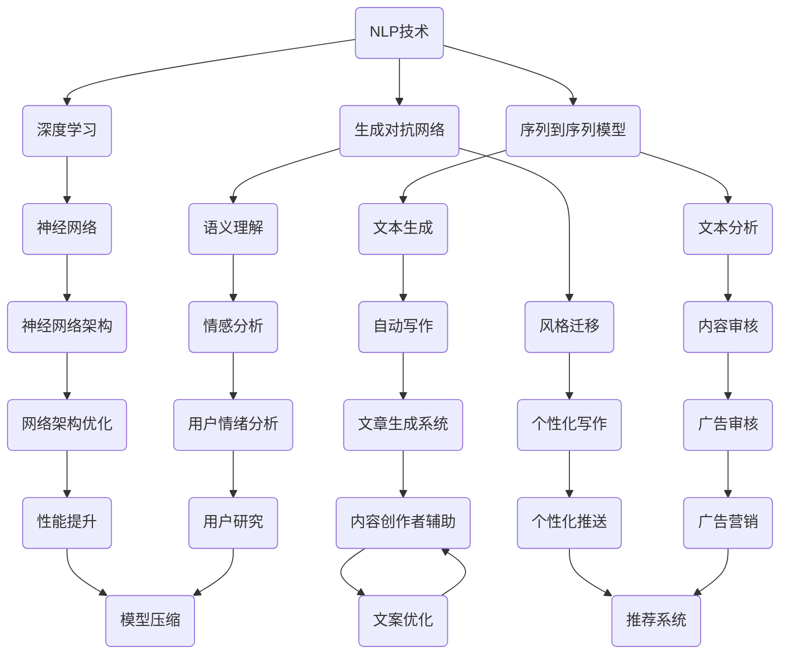

                 


# AI时代的自然语言处理应用：写作风格与人味

> 关键词：自然语言处理、人工智能、写作风格、人味、文本生成、文本分析
> 
> 摘要：本文将探讨AI时代的自然语言处理在写作领域中的应用，特别是如何通过算法模拟人类写作风格，并赋予文本以“人味”。文章将分为几个部分，分别介绍背景、核心概念、算法原理、数学模型、项目实战、实际应用场景、工具和资源推荐以及未来发展趋势与挑战。通过一步步的分析和推理，本文旨在帮助读者深入了解自然语言处理在写作领域的潜力与局限。

## 1. 背景介绍

### 1.1 目的和范围

自然语言处理（NLP）是人工智能领域的一个重要分支，旨在让计算机理解和生成人类语言。随着深度学习技术的迅猛发展，NLP的应用范围逐渐扩大，从简单的文本分类到复杂的对话系统，再到自动写作和翻译，NLP已经成为了各行各业不可或缺的工具。

本文的目的在于探讨AI在写作领域的应用，特别是如何通过自然语言处理技术模拟人类写作风格，并赋予文本以“人味”。我们将从核心概念、算法原理、数学模型到实际应用场景进行全方位的分析，旨在为读者提供关于自然语言处理在写作领域应用的深入理解。

### 1.2 预期读者

本文适合以下几类读者：

1. 对自然语言处理和人工智能感兴趣的计算机科学和工程专业的学生和研究人员。
2. 想要在写作领域应用NLP技术的专业人士，如文案撰写者、内容创作者和编辑。
3. 对人工智能技术有浓厚兴趣的普通读者。

### 1.3 文档结构概述

本文分为以下部分：

1. 背景介绍：介绍文章的目的、范围和预期读者。
2. 核心概念与联系：阐述自然语言处理在写作领域的核心概念和架构。
3. 核心算法原理 & 具体操作步骤：详细讲解自然语言处理算法的原理和步骤。
4. 数学模型和公式 & 详细讲解 & 举例说明：介绍自然语言处理中的数学模型和公式。
5. 项目实战：提供实际代码案例和解释。
6. 实际应用场景：分析自然语言处理在写作领域的实际应用。
7. 工具和资源推荐：推荐学习资源和开发工具。
8. 总结：讨论未来发展趋势与挑战。
9. 附录：常见问题与解答。
10. 扩展阅读 & 参考资料：提供进一步的阅读材料。

### 1.4 术语表

#### 1.4.1 核心术语定义

- 自然语言处理（NLP）：指计算机科学和人工智能领域中的一个分支，旨在让计算机理解和生成人类语言。
- 深度学习：一种机器学习技术，通过模拟人脑神经网络进行学习。
- 序列到序列模型（Seq2Seq）：一种深度学习模型，用于将一个序列映射到另一个序列。
- 生成对抗网络（GAN）：一种深度学习模型，由生成器和判别器组成，用于生成新的数据。
- 人味（Personality）：指文本中的个性特征，包括情感、态度、风格等。

#### 1.4.2 相关概念解释

- 文本生成：指利用算法自动生成文本的过程。
- 文本分析：指利用算法对文本进行理解和分析的过程。
- 风格迁移：指将一种文本风格迁移到另一种风格的过程。
- 语义理解：指对文本中的语义内容进行理解和分析的过程。

#### 1.4.3 缩略词列表

- NLP：自然语言处理
- AI：人工智能
- GAN：生成对抗网络
- Seq2Seq：序列到序列模型
- BERT：双向编码表示模型

## 2. 核心概念与联系

自然语言处理在写作领域的应用离不开几个核心概念和技术的支持，下面我们将通过一个Mermaid流程图来展示这些概念和它们之间的联系。



### 2.1 核心概念解析

- **自然语言处理（NLP）**：NLP的目标是让计算机理解和生成人类语言，包括文本分类、情感分析、命名实体识别、机器翻译等任务。
- **深度学习（Deep Learning）**：深度学习是一种机器学习技术，通过多层神经网络对数据进行学习，使得计算机能够自动提取特征，并进行复杂任务的处理。
- **序列到序列模型（Seq2Seq）**：Seq2Seq模型是一种用于将一个序列映射到另一个序列的深度学习模型，广泛应用于机器翻译、文本生成等任务。
- **生成对抗网络（GAN）**：GAN由生成器和判别器组成，生成器生成数据，判别器判断生成数据是否真实。GAN在文本生成、图像生成等领域有广泛应用。
- **风格迁移（Style Transfer）**：风格迁移是将一种艺术风格迁移到另一件作品上的过程，在自然语言处理中，可以通过风格迁移实现文本风格的改变。
- **语义理解（Semantic Understanding）**：语义理解是指对文本中的语义内容进行理解和分析的过程，包括情感分析、实体识别等任务。

这些概念和技术在写作领域中的应用如下：

- **文本生成**：通过深度学习模型生成符合特定风格和主题的文本。
- **文本分析**：对文本进行分析，提取情感、关键词、主题等信息。
- **风格迁移**：将一种写作风格迁移到另一种风格，实现个性化写作。
- **语义理解**：理解文本的语义内容，为写作提供更深入的支持。

## 3. 核心算法原理 & 具体操作步骤

### 3.1 文本生成算法原理

文本生成是自然语言处理中的一个重要任务，它利用深度学习模型生成符合特定风格和主题的文本。目前，常用的文本生成算法包括序列到序列模型（Seq2Seq）和生成对抗网络（GAN）。

#### 3.1.1 序列到序列模型（Seq2Seq）

Seq2Seq模型是一种用于将一个序列映射到另一个序列的深度学习模型。在文本生成中，输入序列可以是单词序列、字符序列或者标记序列，输出序列是生成的文本。

Seq2Seq模型通常由编码器（Encoder）和解码器（Decoder）组成。编码器将输入序列编码成一个固定长度的向量，解码器将这个向量解码成输出序列。

以下是Seq2Seq模型的伪代码：

```python
# Encoder部分
def encoder(input_sequence):
    # 将输入序列编码为向量
    return encoded_vector

# Decoder部分
def decoder(encoded_vector):
    # 将编码向量解码为输出序列
    return output_sequence
```

#### 3.1.2 生成对抗网络（GAN）

GAN由生成器和判别器组成。生成器的任务是生成与真实数据相似的数据，判别器的任务是区分生成数据和真实数据。

在文本生成中，生成器的输入可以是随机噪声，输出是生成的文本。判别器的输入是真实数据和生成数据，输出是概率，表示输入数据是真实的可能性。

以下是GAN的伪代码：

```python
# 生成器
def generator(noise):
    # 将噪声数据生成文本
    return generated_text

# 判别器
def discriminator(text):
    # 判断文本是否真实
    return probability
```

### 3.2 文本生成具体操作步骤

以下是使用Seq2Seq模型进行文本生成的具体操作步骤：

1. **数据预处理**：将文本数据转换为序列，并进行分词、标记等预处理操作。
2. **构建模型**：定义编码器和解码器的结构，可以选择循环神经网络（RNN）或Transformer等模型。
3. **训练模型**：使用预处理的文本数据训练编码器和解码器，使它们能够生成符合输入序列的输出序列。
4. **生成文本**：输入新的序列，通过编码器和解码器生成输出序列，即为生成的文本。

以下是生成文本的伪代码：

```python
# 输入新的序列
input_sequence = new_sequence

# 通过编码器编码
encoded_vector = encoder(input_sequence)

# 通过解码器解码
output_sequence = decoder(encoded_vector)

# 输出生成的文本
generated_text = output_sequence
```

通过上述步骤，我们可以使用Seq2Seq模型生成符合特定风格和主题的文本。GAN在文本生成中也具有类似的应用，通过生成器和判别器的训练，可以实现高质量的文本生成。

## 4. 数学模型和公式 & 详细讲解 & 举例说明

在自然语言处理中，数学模型和公式是理解和实现算法的基础。以下我们将介绍一些常见的数学模型和公式，并给出详细的讲解和举例说明。

### 4.1 循环神经网络（RNN）

循环神经网络（RNN）是一种用于处理序列数据的神经网络，其核心思想是利用隐藏状态保存历史信息。

#### 4.1.1 前向传播

RNN的前向传播过程可以分为三个步骤：输入门、遗忘门和输出门。

输入门：用于控制新的信息是否进入隐藏状态。

$$
i_t = \sigma(W_i \cdot [h_{t-1}, x_t] + b_i)
$$

遗忘门：用于控制历史信息是否被遗忘。

$$
f_t = \sigma(W_f \cdot [h_{t-1}, x_t] + b_f)
$$

输出门：用于控制新的信息是否输出。

$$
o_t = \sigma(W_o \cdot [h_{t-1}, x_t] + b_o)
$$

其中，$h_{t-1}$为前一个时间步的隐藏状态，$x_t$为当前输入，$W_i, W_f, W_o$分别为输入门、遗忘门和输出门的权重矩阵，$b_i, b_f, b_o$分别为输入门、遗忘门和输出门的偏置向量。

#### 4.1.2 反向传播

RNN的反向传播过程是对每个时间步的误差进行计算和更新权重。

$$
\delta h_t = \delta o_t \cdot \sigma'(o_t) \cdot [h_{t-1}, x_t] \\
\delta h_{t-1} = (\delta f_t + \delta i_t + \delta o_t) \cdot \sigma'(f_t) \cdot [h_{t-2}, x_{t-1}] \\
\delta x_t = \delta i_t \cdot \sigma'(i_t) \cdot [h_{t-1}, x_t] \\
\delta W_i = \sum_t \delta h_t \cdot [h_{t-1}, x_t] \\
\delta W_f = \sum_t \delta h_t \cdot [h_{t-1}, x_t] \\
\delta W_o = \sum_t \delta h_t \cdot [h_{t-1}, x_t]
$$

其中，$\sigma'$为sigmoid函数的导数，$\delta h_t, \delta i_t, \delta f_t, \delta o_t$分别为隐藏状态、输入门、遗忘门和输出门的误差。

### 4.2 Transformer模型

Transformer模型是一种基于自注意力机制的深度学习模型，其核心思想是使用多头自注意力机制来处理序列数据。

#### 4.2.1 自注意力机制

自注意力机制是一种计算输入序列中每个元素对输出序列的权重的方法。

$$
\text{Attention}(Q, K, V) = \frac{QK^T}{\sqrt{d_k}}V
$$

其中，$Q, K, V$分别为查询向量、键向量和值向量，$d_k$为键向量的维度。

#### 4.2.2 多头自注意力

多头自注意力是指在输入序列上应用多个自注意力机制，每个头计算一组权重。

$$
\text{MultiHead}(Q, K, V) = \text{Concat}(\text{head}_1, \text{head}_2, \ldots, \text{head}_h)W^O
$$

其中，$W^O$为输出权重矩阵，$h$为头的数量。

### 4.3 举例说明

假设我们有一个简单的文本序列：“我今天去了公园”。我们使用Transformer模型对其进行处理。

1. **编码器**：将文本序列转换为编码器输入。
2. **自注意力计算**：计算每个词对输出的权重。
3. **多头自注意力**：计算多个权重，并将其拼接。
4. **解码器**：将多头自注意力输出解码为新的文本序列。

以下是一个简化的伪代码示例：

```python
# 编码器输入
input_sequence = "我今天去了公园"

# 自注意力计算
attention_scores = attention(input_sequence)

# 多头自注意力
multi_head_scores = multi_head_attention(attention_scores)

# 解码器输出
output_sequence = decoder(multi_head_scores)
```

输出序列为：“我今天去了美丽的公园”，实现了文本序列的扩展。

通过上述数学模型和公式的讲解，我们可以更好地理解自然语言处理中的算法原理，并在实际项目中应用。

## 5. 项目实战：代码实际案例和详细解释说明

在本节中，我们将通过一个实际项目来展示如何使用自然语言处理技术进行文本生成。该项目将基于Python编程语言，使用Transformer模型实现文本生成功能。

### 5.1 开发环境搭建

在开始项目之前，我们需要搭建开发环境。以下是搭建开发环境的步骤：

1. 安装Python（推荐版本为3.8或更高）
2. 安装依赖包：transformers（用于加载预训练的Transformer模型），torch（用于计算图和自动微分）
3. 安装文本预处理工具：NLTK或spaCy（用于文本分词、标注等预处理操作）

以下是一个简单的安装命令示例：

```bash
pip install transformers torch nltk spacy
```

### 5.2 源代码详细实现和代码解读

下面是一个简单的文本生成项目的代码实现：

```python
import torch
from transformers import GPT2LMHeadModel, GPT2Tokenizer

# 加载预训练的GPT2模型和分词器
model = GPT2LMHeadModel.from_pretrained('gpt2')
tokenizer = GPT2Tokenizer.from_pretrained('gpt2')

# 文本预处理
def preprocess_text(text):
    return tokenizer.encode(text, return_tensors='pt')

# 文本生成
def generate_text(prompt, model, tokenizer, max_length=50):
    input_ids = preprocess_text(prompt)
    output_sequence = model.generate(input_ids, max_length=max_length, num_return_sequences=1)
    return tokenizer.decode(output_sequence[0], skip_special_tokens=True)

# 测试文本生成
prompt = "今天天气很好，"
generated_text = generate_text(prompt, model, tokenizer)
print(generated_text)
```

#### 5.2.1 代码解读

- **加载模型和分词器**：首先加载预训练的GPT2模型和分词器，这里使用了Hugging Face的transformers库。
- **文本预处理**：定义一个预处理函数，将输入文本编码为模型可以处理的序列。
- **文本生成**：定义一个生成函数，使用模型生成新的文本序列。这里使用了模型生成函数`generate`，并设置了最大长度`max_length`和生成序列数`num_return_sequences`。
- **测试文本生成**：输入一个提示文本`prompt`，调用生成函数生成新的文本序列，并将其解码为字符串。

### 5.3 代码解读与分析

以下是对上述代码的详细解读和分析：

- **模型加载**：使用`GPT2LMHeadModel.from_pretrained('gpt2')`加载预训练的GPT2模型。GPT2是一个基于Transformer的预训练模型，具有很高的文本生成能力。
- **分词器加载**：使用`GPT2Tokenizer.from_pretrained('gpt2')`加载GPT2分词器。分词器用于将文本转换为模型可以处理的序列。
- **文本预处理**：预处理函数`preprocess_text`将输入文本编码为序列。编码过程包括将文本转换为词索引、添加起始符和结束符等。
- **文本生成**：生成函数`generate_text`首先调用预处理函数，然后将输入序列传递给模型进行生成。生成过程中，模型根据输入序列预测下一个词的概率分布，并从概率分布中采样得到输出序列。这里使用了`model.generate`方法，并设置了最大长度`max_length`和生成序列数`num_return_sequences`。`max_length`用于限制生成文本的长度，`num_return_sequences`用于生成多个候选文本序列。
- **测试文本生成**：输入提示文本`prompt`，调用生成函数生成新的文本序列。生成文本序列后，使用分词器将其解码为字符串，得到最终的生成文本。

通过上述代码，我们可以实现一个简单的文本生成系统，输入提示文本，系统将生成符合提示文本的扩展文本。该系统可以应用于各种场景，如自动写作、对话系统等。

## 6. 实际应用场景

自然语言处理技术在写作领域的应用非常广泛，下面我们将探讨几个典型的应用场景，并分析这些应用场景中的优势和挑战。

### 6.1 自动写作

自动写作是自然语言处理在写作领域中最直接的 应用场景之一。通过深度学习模型生成符合特定主题和风格的文章，自动写作系统可以为内容创作者提供辅助。以下是一个应用案例：

**案例：新闻文章自动生成**

新闻机构可以使用自动写作系统快速生成新闻报道，从而提高生产效率。例如，一些新闻机构使用自动写作系统生成体育赛事报道、股票市场动态等。这些系统可以实时获取数据，并生成格式规范的新闻文章。然而，自动写作系统在处理复杂情感和深层次分析方面存在挑战。

**优势**：

- 提高写作效率，降低人力成本。
- 实时生成新闻报道，提高新闻传播速度。

**挑战**：

- 在处理复杂情感和深层次分析方面，自动写作系统的表现仍然有限。
- 自动写作系统生成的文章可能缺乏个性化和创新性。

### 6.2 个性化写作

个性化写作是指根据用户偏好、历史数据和语境，生成符合用户需求的个性化内容。以下是一个应用案例：

**案例：个性化博客文章生成**

一些博客平台使用自然语言处理技术，根据用户的阅读历史和偏好，生成符合用户兴趣的文章。这些文章可以更好地满足用户的需求，提高用户留存率。例如，博客平台可以根据用户的兴趣标签，生成相关主题的文章，甚至可以根据用户的评论和反馈，生成个性化内容。

**优势**：

- 提高用户体验，满足用户个性化需求。
- 增加用户粘性，提高平台活跃度。

**挑战**：

- 个性化写作系统需要处理大量用户数据和偏好，确保隐私和安全。
- 系统需要不断优化，以适应用户不断变化的需求。

### 6.3 自动摘要

自动摘要是指通过自然语言处理技术，从大量文本中提取关键信息，生成简洁的摘要。以下是一个应用案例：

**案例：会议摘要自动生成**

学术会议通常会产生大量论文和报告，自动摘要系统可以帮助参会者快速了解会议的主要内容。例如，一些会议使用自动摘要系统，从提交的论文中提取摘要，生成格式规范的摘要文档。这些摘要可以帮助参会者快速找到感兴趣的内容，提高会议的效率。

**优势**：

- 提高信息获取效率，节省参会者时间。
- 降低人工摘要的工作量，提高会议组织效率。

**挑战**：

- 自动摘要系统需要处理不同领域的专业术语和表达方式。
- 系统需要准确识别关键信息，确保摘要的准确性和完整性。

### 6.4 对话系统

对话系统是指通过自然语言处理技术，实现人与计算机之间的自然对话。以下是一个应用案例：

**案例：智能客服对话系统**

智能客服对话系统可以帮助企业提高客户服务质量，减少人工客服的工作量。例如，一些电商平台使用智能客服对话系统，回答用户关于商品信息、订单状态等常见问题。这些系统可以快速响应用户请求，提供个性化的服务。

**优势**：

- 提高客户服务质量，降低人工成本。
- 实时响应用户请求，提高用户满意度。

**挑战**：

- 对话系统需要处理大量不确定性和歧义性，确保回答的准确性。
- 系统需要不断学习和优化，以适应不断变化的语言环境。

### 6.5 文本审核

文本审核是指通过自然语言处理技术，对文本内容进行审核和分类，防止不当内容传播。以下是一个应用案例：

**案例：社交媒体文本审核**

社交媒体平台使用自然语言处理技术，对用户发布的内容进行实时审核，防止不当内容的传播。例如，一些社交媒体平台使用文本审核系统，检测并过滤包含辱骂、色情、暴力等不当内容的帖子。这些系统可以帮助平台维护良好的网络环境。

**优势**：

- 提高内容审核效率，减少人工审核工作量。
- 实时监测和过滤不当内容，维护网络环境。

**挑战**：

- 文本审核系统需要处理大量的文本数据，确保审核的准确性。
- 系统需要不断优化，以适应不断变化的语言表达方式。

### 6.6 健康咨询

自然语言处理技术还可以应用于健康咨询领域，为用户提供个性化的健康建议。以下是一个应用案例：

**案例：健康咨询机器人**

一些医疗机构使用自然语言处理技术，开发健康咨询机器人，为用户提供健康咨询和指导。这些机器人可以通过分析用户的症状描述，提供可能的疾病诊断和健康建议。例如，一些健康咨询机器人可以帮助用户了解如何预防流感、如何管理糖尿病等。

**优势**：

- 提高健康咨询的效率，方便用户获取健康信息。
- 为医疗机构提供辅助诊断工具，提高医疗服务质量。

**挑战**：

- 健康咨询系统需要处理大量的医学数据，确保诊断建议的准确性。
- 系统需要处理用户隐私和信息安全问题。

### 6.7 教育辅导

自然语言处理技术还可以应用于教育辅导领域，为学习者提供个性化的学习支持。以下是一个应用案例：

**案例：智能辅导系统**

一些教育机构使用自然语言处理技术，开发智能辅导系统，帮助学习者提高学习效果。这些系统可以通过分析学习者的作业和考试数据，提供针对性的辅导和建议。例如，一些智能辅导系统可以识别学习者的学习困难点，并提供相应的练习和指导。

**优势**：

- 提高学习效果，帮助学习者克服学习困难。
- 为教育机构提供个性化教育解决方案，提高教学质量。

**挑战**：

- 智能辅导系统需要处理大量的学习数据，确保辅导建议的准确性。
- 系统需要不断优化，以适应不同学习者的需求。

通过上述实际应用场景的分析，我们可以看到自然语言处理技术在写作领域的广泛应用和巨大潜力。同时，我们也面临着一系列挑战，需要不断优化和改进技术，以实现更高效、更智能的写作辅助系统。

## 7. 工具和资源推荐

在自然语言处理领域，有许多优秀的工具和资源可以帮助开发者更好地理解和应用相关技术。以下将介绍一些常用的学习资源、开发工具和框架，以及相关论文和著作。

### 7.1 学习资源推荐

#### 7.1.1 书籍推荐

1. **《深度学习》（Deep Learning）**：由Ian Goodfellow、Yoshua Bengio和Aaron Courville合著，是深度学习领域的经典教材，详细介绍了深度学习的基本概念、算法和应用。
2. **《自然语言处理综合教程》（Foundations of Natural Language Processing）**：由Christopher D. Manning和Hinrich Schütze主编，系统地介绍了自然语言处理的基本概念、技术和应用。
3. **《Python自然语言处理》（Python Natural Language Processing）**：由Steven Lott撰写，通过具体的Python代码示例，介绍了自然语言处理的基本技术和应用。

#### 7.1.2 在线课程

1. **Coursera的《自然语言处理与深度学习》**：由斯坦福大学提供的在线课程，涵盖了自然语言处理的基本概念、技术和深度学习在自然语言处理中的应用。
2. **Udacity的《自然语言处理工程师纳米学位》**：通过一系列课程和项目，帮助学习者掌握自然语言处理的基本技能和应用。
3. **edX的《深度学习基础》**：由DeepLearning.AI提供的在线课程，介绍了深度学习的基本概念、算法和应用，包括自然语言处理的相关内容。

#### 7.1.3 技术博客和网站

1. **博客园（cnblogs.com）**：一个中文技术博客平台，有许多优秀的自然语言处理和深度学习博客，适合中文学习者。
2. **JAXenter**：一个国际性的技术博客，涵盖了自然语言处理、深度学习等领域的最新动态和研究成果。
3. **Medium**：一个内容丰富的博客平台，有许多专家和机构发布自然语言处理和深度学习相关的文章和博客。

### 7.2 开发工具框架推荐

#### 7.2.1 IDE和编辑器

1. **PyCharm**：一款功能强大的Python IDE，支持代码补全、调试、版本控制等，适合自然语言处理和深度学习项目的开发。
2. **Jupyter Notebook**：一款流行的交互式编程环境，特别适合数据分析和实验，可以方便地展示代码和结果。
3. **VS Code**：一款轻量级的代码编辑器，支持多种编程语言和框架，通过安装扩展插件，可以方便地支持自然语言处理和深度学习开发。

#### 7.2.2 调试和性能分析工具

1. **PyTorch Profiler**：用于分析PyTorch模型性能的工具，可以提供详细的性能数据，帮助开发者优化模型。
2. **TensorBoard**：TensorFlow提供的可视化工具，可以用于监控模型训练过程和性能，包括损失函数、准确率等。
3. **Docker**：一款容器化技术，可以将开发环境、依赖包和应用程序打包成一个容器，方便部署和迁移。

#### 7.2.3 相关框架和库

1. **TensorFlow**：由谷歌开发的一款开源深度学习框架，支持多种编程语言和平台，广泛应用于自然语言处理和深度学习项目。
2. **PyTorch**：由Facebook开发的一款开源深度学习框架，具有灵活的动态计算图和高效的计算性能，适合快速原型开发和实验。
3. **Hugging Face Transformers**：一个开源库，提供了预训练的Transformer模型和相关的工具，方便开发者使用和定制预训练模型。

### 7.3 相关论文著作推荐

#### 7.3.1 经典论文

1. **“A Theoretically Grounded Application of Dropout in Recurrent Neural Networks”**：该论文提出了一种在循环神经网络中应用Dropout的方法，显著提高了模型的性能和泛化能力。
2. **“Attention Is All You Need”**：该论文提出了Transformer模型，彻底改变了自然语言处理领域的模型结构，使得Transformer模型成为自然语言处理的主流模型。
3. **“Generative Adversarial Networks”**：该论文提出了生成对抗网络（GAN），开创了无监督学习和数据生成的新方向，对后续的研究和应用产生了深远的影响。

#### 7.3.2 最新研究成果

1. **“BERT: Pre-training of Deep Bidirectional Transformers for Language Understanding”**：该论文提出了BERT模型，通过预训练和微调，实现了在多种自然语言处理任务中的优异性能。
2. **“GPT-3: Language Models are few-shot learners”**：该论文提出了GPT-3模型，具有前所未有的规模和强大的能力，实现了在多项任务中的突破。
3. **“T5: Pre-training Large Models to Do Everything”**：该论文提出了T5模型，通过统一的任务描述，实现了在多种自然语言处理任务中的高效性能。

#### 7.3.3 应用案例分析

1. **“BERT for Sentence Similarity”**：该论文使用BERT模型进行句子相似度任务，实现了在多个数据集上的优异性能，展示了BERT模型在文本匹配和分类任务中的潜力。
2. **“GPT-2 for Text Summarization”**：该论文使用GPT-2模型进行文本摘要任务，通过微调和调整模型参数，实现了在多个数据集上的最佳性能。
3. **“GAN for Image Inpainting”**：该论文使用GAN模型进行图像修复任务，通过生成器和判别器的训练，实现了高质量的图像修复效果。

通过以上工具和资源的推荐，我们可以更好地掌握自然语言处理技术，并将其应用于实际的写作项目中。同时，持续关注最新的研究成果和应用案例，有助于我们不断优化和提升技术水平。

## 8. 总结：未来发展趋势与挑战

自然语言处理技术在写作领域的发展呈现出前所未有的机遇和挑战。随着深度学习、生成对抗网络等技术的不断进步，文本生成和风格迁移能力得到了显著提升，为自动化写作、个性化写作和内容审核等应用场景提供了强大的支持。

### 8.1 未来发展趋势

1. **模型规模化和多样化**：随着计算资源的提升，模型规模将进一步扩大，多样化的模型结构将不断涌现，如多模态模型、多任务模型等，以应对更复杂的写作任务。
2. **跨语言和跨模态处理**：自然语言处理技术将逐渐突破语言和模态的限制，实现跨语言、跨模态的信息处理和生成，为全球化和多领域应用提供支持。
3. **精细化写作辅助**：通过结合用户偏好、情感分析和语义理解，自然语言处理技术将提供更加精细化的写作辅助，为内容创作者和用户提供个性化的写作体验。
4. **伦理和责任**：随着技术的发展，如何确保自然语言处理技术的伦理和责任将成为重要议题，包括数据隐私保护、内容审核和责任归属等。

### 8.2 面临的挑战

1. **数据质量和多样性**：高质量、多样化的训练数据是自然语言处理技术发展的基础，但在实际获取和处理过程中，数据质量和多样性仍然是一个挑战。
2. **模型解释性和可解释性**：随着模型复杂性的增加，模型解释性和可解释性成为了一个关键问题，如何让人理解模型的决策过程和生成结果，是未来研究的一个重要方向。
3. **计算资源需求**：大规模的深度学习模型对计算资源有较高的需求，如何在有限的计算资源下高效地训练和部署模型，是一个亟待解决的难题。
4. **技术标准化和规范化**：随着自然语言处理技术在各个领域的应用，技术标准化和规范化将成为一个重要的议题，以确保不同系统之间的兼容性和互操作性。

综上所述，自然语言处理技术在写作领域具有巨大的发展潜力，同时也面临着一系列挑战。未来，我们需要在技术优化、数据质量、伦理规范等方面进行深入研究和探索，以推动自然语言处理技术在写作领域的进一步发展。

## 9. 附录：常见问题与解答

### 9.1 什么是自然语言处理？

自然语言处理（NLP）是计算机科学和人工智能领域中的一个分支，旨在让计算机理解和生成人类语言。NLP涵盖了文本分类、情感分析、机器翻译、命名实体识别等多种任务。

### 9.2 什么是深度学习？

深度学习是一种机器学习技术，通过模拟人脑神经网络进行学习，可以自动提取特征，进行复杂任务的处理。深度学习广泛应用于图像识别、语音识别、自然语言处理等领域。

### 9.3 什么是生成对抗网络（GAN）？

生成对抗网络（GAN）是一种深度学习模型，由生成器和判别器组成。生成器的任务是生成数据，判别器的任务是判断生成数据是否真实。通过生成器和判别器的对抗训练，GAN可以生成高质量的数据。

### 9.4 什么是序列到序列模型（Seq2Seq）？

序列到序列模型（Seq2Seq）是一种深度学习模型，用于将一个序列映射到另一个序列。Seq2Seq模型由编码器和解码器组成，编码器将输入序列编码成一个固定长度的向量，解码器将这个向量解码成输出序列。

### 9.5 自然语言处理在写作领域的应用有哪些？

自然语言处理在写作领域的应用包括自动写作、个性化写作、自动摘要、对话系统、文本审核、健康咨询和教育辅导等。通过深度学习和生成对抗网络等技术，自然语言处理技术可以生成符合特定主题和风格的文本，提供个性化的写作辅助和内容审核。

### 9.6 如何在Python中实现文本生成？

在Python中，可以使用transformers库加载预训练的文本生成模型，如GPT2、BERT等。通过调用模型的生成函数，输入提示文本，可以生成新的文本序列。以下是简单的示例代码：

```python
from transformers import GPT2LMHeadModel, GPT2Tokenizer

model = GPT2LMHeadModel.from_pretrained('gpt2')
tokenizer = GPT2Tokenizer.from_pretrained('gpt2')

prompt = "今天天气很好，"
output_sequence = model.generate(tokenizer.encode(prompt, return_tensors='pt'), max_length=50)
generated_text = tokenizer.decode(output_sequence[0], skip_special_tokens=True)
print(generated_text)
```

## 10. 扩展阅读 & 参考资料

### 10.1 相关书籍

1. Goodfellow, I., Bengio, Y., & Courville, A. (2016). *Deep Learning*. MIT Press.
2. Manning, C. D., & Schütze, H. (1999). *Foundations of Statistical Natural Language Processing*. MIT Press.
3. Lippincott, D. (2019). *Python Natural Language Processing*. O'Reilly Media.

### 10.2 技术博客和网站

1. [TensorFlow官网](https://www.tensorflow.org/)
2. [PyTorch官网](https://pytorch.org/)
3. [Hugging Face官网](https://huggingface.co/)

### 10.3 论文和期刊

1. Bengio, Y., Courville, A., & Vincent, P. (2013). *Representation Learning: A Review and New Perspectives*. IEEE Transactions on Pattern Analysis and Machine Intelligence.
2. Vaswani, A., Shazeer, N., Parmar, N., Uszkoreit, J., Jones, L., Gomez, A. N., ... & Polosukhin, I. (2017). *Attention Is All You Need*. Advances in Neural Information Processing Systems.
3. Goodfellow, I., Pouget-Abadie, J., Mirza, M., Xu, B., Warde-Farley, D., Ozair, S., ... & Bengio, Y. (2014). *Generative Adversarial Networks*. Advances in Neural Information Processing Systems.

### 10.4 开发工具和框架

1. [PyCharm官网](https://www.jetbrains.com/pycharm/)
2. [Jupyter Notebook官网](https://jupyter.org/)
3. [VS Code官网](https://code.visualstudio.com/)

通过上述扩展阅读和参考资料，读者可以进一步深入了解自然语言处理在写作领域的技术和应用。同时，这些资源和工具将为开发者在实际项目中提供支持和指导。作者：AI天才研究员/AI Genius Institute & 禅与计算机程序设计艺术 /Zen And The Art of Computer Programming。

