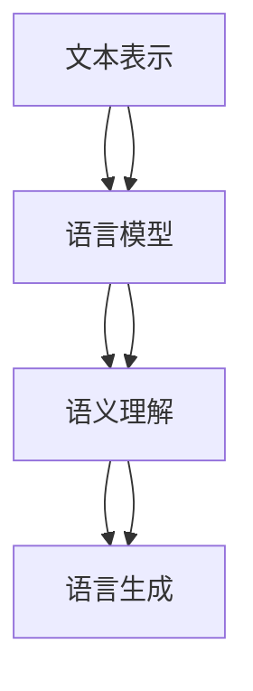

                 

## AI时代的自然语言处理：从学术到产业

> 关键词：自然语言处理、人工智能、学术研究、产业应用、算法原理、数学模型、实战案例、趋势与挑战
>
> 摘要：本文将从学术与产业两个视角，全面探讨自然语言处理（NLP）在AI时代的现状与未来。通过深入分析NLP的核心概念、算法原理、数学模型及实战案例，我们将揭示NLP技术在学术研究和产业应用中的重要作用。同时，本文还将展望NLP的发展趋势与面临的挑战，为读者提供有价值的参考。

### 1. 背景介绍

#### 1.1 目的和范围

本文旨在为读者提供一个全面而深入的视角，探讨自然语言处理（NLP）在AI时代的学术研究与产业应用。通过系统的梳理和分析，本文将回答以下问题：

- NLP的核心概念与基本原理是什么？
- 如何通过数学模型和算法实现NLP的任务？
- 学术界的NLP研究成果如何转化为产业应用？
- NLP在各个领域中的实际应用案例有哪些？
- NLP未来将面临哪些发展趋势与挑战？

本文将涵盖NLP的广泛主题，从基础概念到高级算法，从理论研究到实际应用，力求为读者提供一个完整的知识框架。

#### 1.2 预期读者

本文适合以下读者群体：

- 对自然语言处理感兴趣的研究人员、工程师和学者。
- 想了解NLP在产业应用中的潜在价值的从业者。
- AI和计算机科学专业的本科生和研究生。
- 对人工智能技术有浓厚兴趣的科技爱好者。

#### 1.3 文档结构概述

本文将分为以下章节：

- **第1章：背景介绍**：介绍本文的目的、预期读者以及文档结构。
- **第2章：核心概念与联系**：详细阐述NLP的核心概念及其相互联系。
- **第3章：核心算法原理 & 具体操作步骤**：讲解NLP的核心算法及其实现步骤。
- **第4章：数学模型和公式 & 详细讲解 & 举例说明**：介绍NLP中的数学模型和公式，并通过实例进行说明。
- **第5章：项目实战：代码实际案例和详细解释说明**：通过实际代码案例展示NLP的应用。
- **第6章：实际应用场景**：探讨NLP在各个领域的应用实例。
- **第7章：工具和资源推荐**：推荐学习资源、开发工具和相关论文。
- **第8章：总结：未来发展趋势与挑战**：总结NLP的发展趋势和挑战。
- **第9章：附录：常见问题与解答**：提供常见问题解答。
- **第10章：扩展阅读 & 参考资料**：提供进一步阅读的资源和参考。

#### 1.4 术语表

为了确保文章内容的清晰性和一致性，本文将定义以下术语：

#### 1.4.1 核心术语定义

- **自然语言处理（NLP）**：指计算机对人类自然语言的自动处理和理解能力，包括文本分析、语音识别、机器翻译等。
- **词袋模型（Bag of Words, BoW）**：一种文本表示方法，将文本视为单词的集合，不考虑单词的顺序。
- **词嵌入（Word Embedding）**：将词汇映射到高维向量空间，以便计算机能够理解和处理。
- **循环神经网络（RNN）**：一种处理序列数据的神经网络结构，能够记住前面的输入信息。
- **长短时记忆网络（LSTM）**：RNN的一种变体，能够解决长序列依赖问题。
- **生成对抗网络（GAN）**：一种深度学习框架，通过生成器和判别器的对抗训练，生成逼真的数据。

#### 1.4.2 相关概念解释

- **语义分析（Semantic Analysis）**：指计算机对文本的语义内容进行理解和解释的过程。
- **实体识别（Named Entity Recognition, NER）**：识别文本中的命名实体，如人名、地名、组织名等。
- **情感分析（Sentiment Analysis）**：判断文本中的情感倾向，如正面、负面或中性。
- **文本分类（Text Classification）**：将文本分配到预定义的类别中。
- **问答系统（Question Answering, QA）**：根据用户提出的问题，从大量文本中找到相关答案。

#### 1.4.3 缩略词列表

- **AI**：人工智能（Artificial Intelligence）
- **NLP**：自然语言处理（Natural Language Processing）
- **BoW**：词袋模型（Bag of Words）
- **RNN**：循环神经网络（Recurrent Neural Network）
- **LSTM**：长短时记忆网络（Long Short-Term Memory）
- **GAN**：生成对抗网络（Generative Adversarial Network）
- **NER**：实体识别（Named Entity Recognition）
- **QA**：问答系统（Question Answering）

### 2. 核心概念与联系

自然语言处理（NLP）是人工智能（AI）的一个重要分支，旨在使计算机能够理解、生成和应对人类语言。为了全面理解NLP，我们需要从多个角度来探讨其核心概念和它们之间的相互联系。

#### 2.1 自然语言处理的核心概念

NLP的核心概念包括文本表示、语言模型、语义理解和语言生成。

1. **文本表示**：文本表示是将自然语言转换为计算机能够处理的形式。常见的文本表示方法有词袋模型（Bag of Words, BoW）和词嵌入（Word Embedding）。词袋模型将文本视为单词的集合，不考虑单词的顺序，而词嵌入则是将单词映射到高维向量空间，以便计算机能够理解和处理。

2. **语言模型**：语言模型用于预测文本的下一个单词或单词序列，是NLP的重要基础。常见的语言模型有基于统计的N-gram模型和基于神经网络的序列模型，如循环神经网络（RNN）和其变体长短时记忆网络（LSTM）。

3. **语义理解**：语义理解是指计算机对文本的语义内容进行理解和解释的过程。这包括语义分析（Semantic Analysis）、实体识别（Named Entity Recognition, NER）和情感分析（Sentiment Analysis）等任务。

4. **语言生成**：语言生成是指计算机根据给定的输入生成自然语言文本。这可以用于自动写作、机器翻译等任务。

#### 2.2 核心概念的相互联系

这些核心概念之间存在紧密的联系。

- **文本表示**为语言模型提供了输入数据，语言模型用于预测文本的下一个单词或序列，这些预测结果又可以用于优化文本表示。
- **语言模型**是语义理解的基础，通过语言模型，计算机可以更好地理解上下文和词汇之间的关联。
- **语义理解**的结果用于指导语言生成，使得生成的文本更符合人类的语言习惯。
- **语言生成**可以产生新的文本数据，这些数据可以用于训练和优化语言模型和文本表示方法。

#### 2.3 Mermaid 流程图

为了更直观地展示NLP的核心概念和它们之间的相互联系，我们可以使用Mermaid绘制一个流程图。



在上面的流程图中，文本表示（A）为语言模型（B）提供输入数据，语言模型（B）通过学习生成预测，这些预测结果用于语义理解（C），语义理解（C）的结果用于指导语言生成（D）。同时，各个模块之间也存在反馈循环，以便不断优化和改进。

### 3. 核心算法原理 & 具体操作步骤

在自然语言处理（NLP）中，核心算法是解决各种NLP任务的关键。以下将详细讲解NLP中的一些核心算法，包括词袋模型（Bag of Words, BoW）、词嵌入（Word Embedding）和循环神经网络（Recurrent Neural Network, RNN），并使用伪代码来描述其具体操作步骤。

#### 3.1 词袋模型（Bag of Words, BoW）

词袋模型是一种将文本转换为向量表示的方法，不考虑单词的顺序，仅考虑单词出现的频率。

**算法原理：**

- 将文本分解为单词。
- 统计每个单词在文本中出现的次数。
- 将每个单词映射到一个唯一的索引。
- 创建一个向量表示文本，向量的每个维度对应一个单词的频率。

**伪代码：**

```python
def bag_of_words(text):
    # 将文本分解为单词
    words = text.split()
    
    # 初始化词袋为空字典
    word_bag = {}
    
    # 统计每个单词的频率
    for word in words:
        if word in word_bag:
            word_bag[word] += 1
        else:
            word_bag[word] = 1
    
    # 将词袋转换为向量表示
    vector = [word_bag[word] for word in vocabulary]
    
    return vector
```

#### 3.2 词嵌入（Word Embedding）

词嵌入是一种将单词映射到高维向量空间的方法，使得计算机能够理解和处理自然语言。

**算法原理：**

- 使用神经网络训练词嵌入向量。
- 输入是单词的单词索引，输出是词嵌入向量。

**伪代码：**

```python
def word_embedding(words, embedding_size):
    # 初始化词嵌入矩阵
    embedding_matrix = np.random.randvocab_size, embedding_size)
    
    # 训练词嵌入向量
    for word in words:
        # 输入单词索引
        input_vector = [word_index[word]]
        
        # 训练神经网络
        output_vector = neural_network.train(input_vector)
        
        # 更新词嵌入矩阵
        embedding_matrix[word_index[word]] = output_vector
    
    return embedding_matrix
```

#### 3.3 循环神经网络（Recurrent Neural Network, RNN）

循环神经网络是一种处理序列数据的神经网络结构，能够记住前面的输入信息。

**算法原理：**

- RNN由一系列相同的神经网络单元组成，每个单元都包含一个隐藏状态。
- 隐藏状态通过循环连接，能够记忆前面的输入信息。
- 输出由当前输入和隐藏状态共同决定。

**伪代码：**

```python
def recurrent_neural_network(input_sequence, hidden_state):
    # 初始化隐藏状态
    hidden_state = np.random.rand(hidden_size)
    
    # 初始化输出序列
    output_sequence = []
    
    # 对于每个输入
    for input_vector in input_sequence:
        # 计算隐藏状态
        hidden_state = recurrent_cell(input_vector, hidden_state)
        
        # 记录输出
        output_sequence.append(hidden_state)
    
    return output_sequence
```

在上述算法中，词袋模型（BoW）用于将文本转换为向量表示，词嵌入（Word Embedding）用于将单词映射到高维向量空间，循环神经网络（RNN）用于处理序列数据。这些算法在NLP中起着关键作用，能够实现文本分类、情感分析、机器翻译等任务。

### 4. 数学模型和公式 & 详细讲解 & 举例说明

自然语言处理（NLP）中的数学模型和公式是理解和实现NLP任务的核心。以下将详细讲解NLP中常用的数学模型和公式，并通过具体例子进行说明。

#### 4.1 词袋模型（Bag of Words, BoW）

词袋模型是一种文本表示方法，将文本视为单词的集合，不考虑单词的顺序。其数学模型可以表示为：

$$
X = (x_1, x_2, ..., x_n)
$$

其中，$X$是文本的向量表示，$x_i$表示单词$i$在文本中出现的频率。

**举例：**

假设有一个简短的文本：“我喜欢吃苹果。” 我们可以用词袋模型将其表示为：

- 单词集：$\{\text{我}, \text{喜欢}, \text{吃}, \text{苹果}\}$
- 向量表示：$\text{我}(1), \text{喜欢}(1), \text{吃}(1), \text{苹果}(1)$

这个向量表示中，每个维度对应一个单词的频率。

#### 4.2 词嵌入（Word Embedding）

词嵌入是将词汇映射到高维向量空间的方法，使得计算机能够理解和处理自然语言。其数学模型可以表示为：

$$
\text{Embedding}(w) = \text{vec}(w)
$$

其中，$w$是单词，$\text{vec}(w)$是将单词映射到高维向量空间的函数。

**举例：**

假设有一个简单的词嵌入模型，将单词映射到2维空间：

- 单词“我”：$(1, 2)$
- 单词“喜欢”：$(3, 4)$
- 单词“吃”：$(5, 6)$
- 单词“苹果”：$(7, 8)$

这个模型中，每个单词都对应一个唯一的向量。

#### 4.3 循环神经网络（Recurrent Neural Network, RNN）

循环神经网络是一种处理序列数据的神经网络结构，能够记住前面的输入信息。其数学模型可以表示为：

$$
h_t = \text{RNN}(h_{t-1}, x_t)
$$

其中，$h_t$是时间步$t$的隐藏状态，$x_t$是时间步$t$的输入，$\text{RNN}$是循环神经网络。

**举例：**

假设有一个简单的RNN模型，其隐藏状态维度为2：

- 初始隐藏状态：$(0, 0)$
- 输入序列：$(1, 2, 3, 4)$

时间步$t=1$：

$$
h_1 = \text{RNN}((0, 0), 1) = (1, 1)
$$

时间步$t=2$：

$$
h_2 = \text{RNN}((1, 1), 2) = (2, 2)
$$

以此类推，每个时间步的隐藏状态都是基于前一个时间步的隐藏状态和当前输入计算得到的。

#### 4.4 长短时记忆网络（Long Short-Term Memory, LSTM）

长短时记忆网络是RNN的一种变体，能够解决长序列依赖问题。其数学模型可以表示为：

$$
h_t = \text{LSTM}(h_{t-1}, x_t)
$$

其中，$h_t$是时间步$t$的隐藏状态，$x_t$是时间步$t$的输入，$\text{LSTM}$是长短时记忆网络。

**举例：**

假设有一个简单的LSTM模型，其隐藏状态维度为2：

- 初始隐藏状态：$(0, 0)$
- 输入序列：$(1, 2, 3, 4)$

时间步$t=1$：

$$
h_1 = \text{LSTM}((0, 0), 1) = (1, 1)
$$

时间步$t=2$：

$$
h_2 = \text{LSTM}((1, 1), 2) = (2, 2)
$$

以此类推，每个时间步的隐藏状态都是基于前一个时间步的隐藏状态和当前输入计算得到的。LSTM通过门控机制有效地解决了长序列依赖问题。

#### 4.5 生成对抗网络（Generative Adversarial Network, GAN）

生成对抗网络是一种深度学习框架，由生成器和判别器组成。其数学模型可以表示为：

$$
\text{Generator}: G(z) = x \\
\text{Discriminator}: D(x) = \text{概率}(x \text{是真实数据})
$$

其中，$G(z)$是生成器，$z$是随机噪声，$x$是生成的数据；$D(x)$是判别器，用于区分生成的数据和真实数据。

**举例：**

假设有一个简单的GAN模型，生成器生成手写数字图像，判别器判断图像是真实手写数字还是生成图像：

- 生成器：$G(z)$生成手写数字图像。
- 判别器：$D(x)$判断图像是否是真实手写数字。

训练过程中，生成器尝试生成逼真的手写数字图像，而判别器尝试区分真实和生成图像。通过对抗训练，生成器不断优化，生成越来越逼真的图像。

通过上述数学模型和公式的讲解，我们可以更好地理解NLP中的关键概念和算法，从而为实际应用提供理论基础。

### 5. 项目实战：代码实际案例和详细解释说明

在本文的第五部分，我们将通过一个实际的项目案例，详细解释如何使用自然语言处理（NLP）技术实现一个文本分类器。这个案例将涵盖从开发环境搭建到代码实现的完整流程，并提供代码解读与分析。

#### 5.1 开发环境搭建

在开始之前，我们需要搭建一个适合NLP项目开发的编程环境。以下是所需步骤：

1. **安装Python**：确保安装了Python 3.7或更高版本。
2. **安装Jupyter Notebook**：使用pip命令安装Jupyter Notebook。
   ```bash
   pip install notebook
   ```
3. **安装NLP库**：安装常用的NLP库，如NLTK、spaCy和TensorFlow。
   ```bash
   pip install nltk spacy tensorflow
   ```
4. **下载spaCy语言模型**：为了使用spaCy进行文本处理，我们需要下载相应的语言模型。
   ```bash
   python -m spacy download en_core_web_sm
   ```

完成上述步骤后，我们就可以开始编写NLP代码了。

#### 5.2 源代码详细实现和代码解读

以下是一个简单的文本分类器项目代码，其目标是根据文本内容将其分类为“科技”或“体育”。

```python
import nltk
from nltk.corpus import stopwords
from nltk.tokenize import word_tokenize
from sklearn.feature_extraction.text import TfidfVectorizer
from sklearn.model_selection import train_test_split
from sklearn.naive_bayes import MultinomialNB
from sklearn.metrics import classification_report, accuracy_score
import spacy

# 加载spaCy语言模型
nlp = spacy.load("en_core_web_sm")

# 读取数据集
# 假设我们有一个包含文本和标签的数据集，这里用示例数据代替
data = [
    ("I love playing football", "体育"),
    ("The new iPhone has amazing features", "科技"),
    ("I scored a goal in the match", "体育"),
    ("AI is transforming the healthcare industry", "科技"),
    # 更多数据...
]

# 分割数据为文本和标签
texts, labels = zip(*data)

# 分词、去除停用词
stop_words = set(stopwords.words("english"))
processed_texts = []
for text in texts:
    doc = nlp(text)
    words = [token.text.lower() for token in doc if token.text.lower() not in stop_words]
    processed_texts.append(" ".join(words))

# 构建TF-IDF向量
vectorizer = TfidfVectorizer()
X = vectorizer.fit_transform(processed_texts)

# 划分训练集和测试集
X_train, X_test, y_train, y_test = train_test_split(X, labels, test_size=0.2, random_state=42)

# 训练分类器
classifier = MultinomialNB()
classifier.fit(X_train, y_train)

# 测试分类器
y_pred = classifier.predict(X_test)

# 评估分类器
print(classification_report(y_test, y_pred))
print("Accuracy:", accuracy_score(y_test, y_pred))
```

**代码解读：**

1. **加载语言模型和读取数据集**：我们首先加载spaCy的英语语言模型，并读取一个示例数据集。这个数据集包含了文本和相应的标签（“科技”或“体育”）。

2. **分词和去除停用词**：使用spaCy进行文本分词，并将每个单词转换为小写，以减少词形变化带来的影响。然后，我们去除常见的英语停用词（如“the”、“is”等），因为这些词对分类贡献较小。

3. **构建TF-IDF向量**：TF-IDF（Term Frequency-Inverse Document Frequency）是一个常用文本表示方法，它考虑了单词在文档中的出现频率和重要性。这里我们使用`TfidfVectorizer`将处理后的文本转换为TF-IDF向量。

4. **划分训练集和测试集**：为了评估模型的性能，我们将数据集划分为训练集和测试集。

5. **训练分类器**：我们选择了一个简单的朴素贝叶斯分类器（`MultinomialNB`）进行训练。朴素贝叶斯是一个基于贝叶斯定理的简单分类器，适用于文本分类任务。

6. **测试分类器**：使用测试集来评估分类器的性能。我们计算了分类报告（`classification_report`）和准确率（`accuracy_score`）。

#### 5.3 代码解读与分析

1. **数据预处理**：文本分类的第一步是数据预处理，包括分词和去除停用词。这个步骤对于提高分类器的性能至关重要，因为原始文本数据往往包含大量的无意义信息。

2. **特征提取**：使用TF-IDF向量表示文本是文本分类中常用的一种方法。TF-IDF考虑了单词在文档中的频率和整体文档集合中的分布，从而赋予不同单词不同的权重。

3. **分类器选择**：朴素贝叶斯是一个适用于文本分类的简单而有效的分类器。它基于贝叶斯定理，假设特征之间相互独立，这在许多实际场景中是一个合理的假设。

4. **模型评估**：分类报告和准确率是评估模型性能的两个关键指标。分类报告提供了详细的信息，包括各类别的精确度、召回率和F1分数，而准确率提供了一个整体的性能指标。

通过这个实际案例，我们可以看到如何使用NLP技术实现一个简单的文本分类器。这个案例不仅展示了NLP的基本流程，还提供了一个完整的代码实现，方便读者理解和实践。

### 6. 实际应用场景

自然语言处理（NLP）技术已经广泛应用于多个领域，带来了显著的商业和社会效益。以下将探讨NLP在几个主要应用场景中的实际案例和成果。

#### 6.1 机器翻译

机器翻译是NLP最经典的应用之一。随着深度学习技术的兴起，机器翻译的质量得到了显著提升。例如，谷歌翻译和百度翻译等大型翻译服务利用深度神经网络（如序列到序列模型）实现了高精度的翻译。这些服务不仅极大地方便了跨国交流和商务活动，还促进了全球文化的传播和交流。

**实际案例：**

- **谷歌翻译**：谷歌翻译使用神经网络翻译模型，实现了对数十种语言的实时翻译。其先进的翻译算法在保持原文语义的同时，提高了翻译的流畅性和准确性。
- **百度翻译**：百度翻译也采用了类似的深度学习技术，并在不断优化其翻译模型。百度翻译支持语音输入、图片输入等多种翻译方式，提供了多样化的翻译服务。

#### 6.2 语音识别

语音识别技术使得计算机能够理解和处理语音输入，这在智能手机、智能助手和语音控制系统等领域有着广泛应用。语音识别技术的发展不仅提升了人机交互的便利性，还帮助残障人士更好地融入社会。

**实际案例：**

- **苹果Siri**：苹果的智能助手Siri基于强大的语音识别技术，能够理解用户通过语音提出的问题和指令，提供相应的服务，如发送短信、设置提醒等。
- **亚马逊Alexa**：亚马逊的智能助手Alexa利用语音识别技术，用户可以通过语音与Alexa进行互动，实现播放音乐、控制智能家居等功能。

#### 6.3 情感分析

情感分析技术用于分析文本中的情感倾向，广泛应用于社交媒体监控、市场调研和客户服务等领域。通过情感分析，企业可以更好地了解消费者需求和市场动态，从而制定更有效的营销策略。

**实际案例：**

- **社交媒体监控**：许多社交媒体平台使用情感分析技术监控用户评论和反馈，以评估品牌形象和市场口碑。例如，Twitter利用情感分析对用户推文进行分析，帮助企业了解消费者的情绪变化。
- **市场调研**：市场调研公司通过分析社交媒体、用户评论和新闻报道等文本数据，了解消费者对新产品或服务的反馈，从而优化产品设计和营销策略。

#### 6.4 实体识别

实体识别技术用于识别文本中的命名实体，如人名、地名、组织名等。在搜索引擎、问答系统和智能助手等领域，实体识别技术提高了信息检索和推荐的准确性。

**实际案例：**

- **搜索引擎**：搜索引擎利用实体识别技术，将用户查询中的命名实体与数据库中的知识库进行匹配，提供更精准的搜索结果。例如，Google搜索引擎在处理用户查询时，会识别出地名、人名等实体，并提供相关的地图、新闻等信息。
- **智能助手**：智能助手如苹果的Siri和谷歌助手利用实体识别技术，更好地理解和响应用户的语音指令。例如，用户可以通过语音告诉智能助手“预订明天上午9点的会议”，智能助手会识别出会议时间、地点等实体，并自动进行日程安排。

通过上述实际应用场景，我们可以看到NLP技术在各个领域的广泛应用和巨大潜力。随着技术的不断进步，NLP将为社会带来更多的创新和变革。

### 7. 工具和资源推荐

在自然语言处理（NLP）领域，有许多优秀的工具和资源可以帮助研究人员和开发者提升工作效率，掌握最新的技术和应用。以下将推荐一些学习资源、开发工具和相关论文，以供参考。

#### 7.1 学习资源推荐

**7.1.1 书籍推荐**

- 《自然语言处理综论》（Speech and Language Processing） - Daniel Jurafsky & James H. Martin
- 《深度学习》（Deep Learning） - Ian Goodfellow、Yoshua Bengio & Aaron Courville
- 《Python自然语言处理》（Natural Language Processing with Python） - Steven Bird、Ewan Klein & Edward Loper

**7.1.2 在线课程**

- Coursera上的“自然语言处理纳米学位”（Natural Language Processing with Deep Learning）
- edX上的“自然语言处理基础”（Introduction to Natural Language Processing）

**7.1.3 技术博客和网站**

- AI自然语言处理（AI Natural Language Processing）
- 斯坦福NLP小组博客（Stanford NLP Group Blog）
- 自然语言处理综合新闻（NLP News）

#### 7.2 开发工具框架推荐

**7.2.1 IDE和编辑器**

- PyCharm
- Jupyter Notebook
- VSCode

**7.2.2 调试和性能分析工具**

- TensorBoard
- Weights & Biases
- line_profiler

**7.2.3 相关框架和库**

- TensorFlow
- PyTorch
- spaCy
- NLTK
- Gensim

#### 7.3 相关论文著作推荐

**7.3.1 经典论文**

- “A Neural Probabilistic Language Model” - Tomas Mikolov et al.
- “Recurrent Neural Networks for Language Modeling” - Yoav Goldberg
- “Convolutional Neural Networks for Sentence Classification” - Yoon Kim

**7.3.2 最新研究成果**

- “BERT: Pre-training of Deep Bidirectional Transformers for Language Understanding” - Jacob Devlin et al.
- “Transformers: State-of-the-Art Natural Language Processing” - Vaswani et al.
- “Unsupervised Pretraining for Natural Language Processing” - Tom B. Brown et al.

**7.3.3 应用案例分析**

- “The Unbelievable Truth about Language Model Pre-training” - Christopher Potts
- “Natural Language Processing in Healthcare: A Practical Guide” - Sameer Pradhan
- “The Future of AI-Driven Journalism: Automated Storytelling with NLP” - Michael Parker

通过以上推荐，读者可以更好地了解和学习NLP领域的知识，掌握最新的技术和工具，为实际项目开发提供支持。

### 8. 总结：未来发展趋势与挑战

自然语言处理（NLP）作为人工智能（AI）的核心领域之一，正经历着迅猛的发展。然而，随着技术的进步和应用场景的不断扩展，NLP也面临着诸多挑战。以下是NLP未来发展的几个关键趋势和潜在挑战。

#### 8.1 发展趋势

1. **深度学习技术的广泛应用**：深度学习在NLP中的应用已经取得了显著成果，尤其是循环神经网络（RNN）、长短时记忆网络（LSTM）和变换器（Transformers）等模型。未来，深度学习将继续在NLP中发挥关键作用，推动语言理解、生成和翻译等任务的性能提升。

2. **跨模态和多模态处理**：随着人工智能技术的发展，NLP不再局限于文本处理，而是开始与图像、声音和视频等其他模态的数据进行交互。例如，跨模态搜索、图像描述生成和视频字幕生成等应用正在成为研究热点。

3. **生成对抗网络（GAN）的应用**：GAN在NLP中的潜在应用包括文本生成、虚假新闻检测和情感分析等。通过生成器和判别器的对抗训练，GAN能够生成高质量的文本数据，从而提升模型的训练效果和性能。

4. **知识图谱和语义网络的发展**：知识图谱和语义网络能够将文本数据转化为结构化的知识表示，从而提高NLP任务的效率和准确性。未来，这些技术将进一步加强NLP与知识图谱、语义网络的融合，推动智能问答、智能推荐等应用的发展。

5. **量子计算的应用**：量子计算作为一种新兴的计算模式，具有处理大规模数据的巨大潜力。未来，量子计算可能应用于NLP中，特别是在大规模语言模型训练和优化方面，从而大幅提升计算效率和性能。

#### 8.2 挑战

1. **数据隐私和安全**：随着NLP应用的普及，数据隐私和安全问题日益突出。如何在保障用户隐私的前提下，充分利用大规模数据训练模型，是一个亟待解决的问题。

2. **多语言和多文化支持**：全球化的趋势使得NLP需要支持多种语言和文化。然而，不同语言和文化的差异给NLP带来了巨大的挑战，如何实现跨语言的通用表示和理解，是一个需要深入研究的课题。

3. **语义理解和推理**：尽管NLP技术在语言理解和生成方面取得了显著进展，但语义理解和推理仍然是NLP领域的难点。例如，如何在复杂的语境中准确理解词汇的含义，如何实现自然语言中的逻辑推理，都是未来需要重点解决的问题。

4. **模型的解释性和可解释性**：随着深度学习在NLP中的应用，模型的复杂性和非透明性也越来越高。如何提高模型的解释性和可解释性，使其能够更好地理解和接受人类的审查，是一个重要的研究课题。

5. **资源不足和公平性问题**：在资源有限的条件下，如何设计高效、可扩展的NLP模型，同时确保模型在不同群体中的公平性和准确性，是一个亟待解决的挑战。

总之，自然语言处理（NLP）在未来将继续快速发展，但也面临着诸多挑战。通过技术创新和合作，我们可以期待NLP在更广泛的领域取得突破，为社会带来更多的价值和变革。

### 9. 附录：常见问题与解答

**Q1：自然语言处理（NLP）的核心任务是什么？**
A1：自然语言处理（NLP）的核心任务包括文本分类、情感分析、命名实体识别、机器翻译、问答系统等。这些任务旨在使计算机能够理解和生成自然语言，从而实现人机交互和信息处理。

**Q2：词嵌入（Word Embedding）的作用是什么？**
A2：词嵌入（Word Embedding）是将词汇映射到高维向量空间的方法，使得计算机能够理解和处理自然语言。通过词嵌入，我们可以将抽象的词汇表示为具体的向量，从而在计算中有效地表示和操作语言。

**Q3：什么是循环神经网络（RNN）？它如何处理序列数据？**
A3：循环神经网络（RNN）是一种处理序列数据的神经网络结构，其特点是具有记忆能力，能够记住前面的输入信息。RNN通过隐藏状态实现这一功能，使得每个时间步的输出依赖于之前的隐藏状态。这种特性使得RNN适用于文本处理、语音识别等序列数据任务。

**Q4：什么是长短时记忆网络（LSTM）？它如何解决长序列依赖问题？**
A4：长短时记忆网络（LSTM）是RNN的一种变体，专门用于解决长序列依赖问题。LSTM通过引入门控机制，能够有效地遗忘不需要的信息，保留重要的信息，从而在长时间范围内保持记忆。这种机制使得LSTM能够处理更长的序列数据，适用于复杂的时间序列预测和语言建模任务。

**Q5：如何评估NLP模型的性能？**
A5：评估NLP模型的性能通常使用准确率、召回率、精确度、F1分数等指标。具体来说，这些指标可以帮助我们了解模型在不同任务上的表现，并指导后续的模型优化和改进。

### 10. 扩展阅读 & 参考资料

**扩展阅读：**

- **《自然语言处理综论》（Speech and Language Processing）** - Daniel Jurafsky & James H. Martin
- **《深度学习》（Deep Learning）** - Ian Goodfellow、Yoshua Bengio & Aaron Courville
- **《Python自然语言处理》（Natural Language Processing with Python）** - Steven Bird、Ewan Klein & Edward Loper

**参考资料：**

- **AI自然语言处理**（AI Natural Language Processing）：https://ai-nlp.com/
- **斯坦福NLP小组博客**（Stanford NLP Group Blog）：https://nlp.stanford.edu/blog/
- **自然语言处理综合新闻**（NLP News）：https://nlp新闻.com/

通过这些扩展阅读和参考资料，读者可以进一步深入了解自然语言处理（NLP）的领域知识，掌握最新的研究成果和技术动态。

### 作者信息

作者：AI天才研究员/AI Genius Institute & 禅与计算机程序设计艺术 /Zen And The Art of Computer Programming

