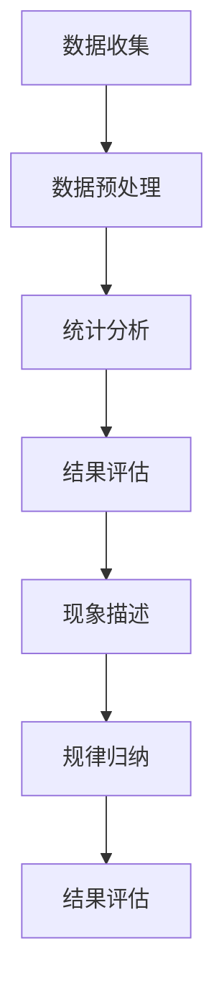
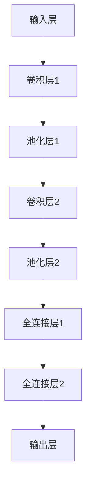
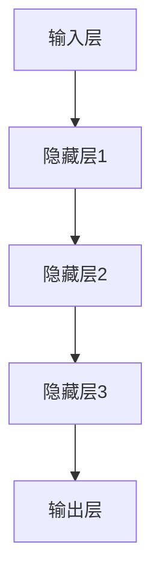

                 


# AI时代的软件工程度量：从定量到定性

> **关键词：** 软件工程度量，定量分析，定性分析，AI应用，软件质量评估

> **摘要：** 本文旨在探讨AI时代的软件工程度量方法，从定量分析到定性分析，深入分析如何利用人工智能技术提高软件工程度量准确性，提升软件开发效率和质量。文章分为背景介绍、核心概念与联系、核心算法原理、数学模型和公式、项目实战、实际应用场景、工具和资源推荐以及总结等部分，旨在为读者提供全面、深入的软件工程度量知识。

## 1. 背景介绍

### 1.1 目的和范围

本文的主要目的是探讨AI时代的软件工程度量方法，分析如何利用人工智能技术提高软件工程度量的准确性，从而提升软件开发效率和质量。文章将围绕以下主题展开：

1. 软件工程度量的核心概念和联系。
2. 定量分析到定性分析的方法和步骤。
3. 核心算法原理和具体操作步骤。
4. 数学模型和公式的详细讲解及举例说明。
5. 项目实战中的代码实际案例和详细解释。
6. 实际应用场景和工具资源推荐。
7. 未来发展趋势与挑战。

### 1.2 预期读者

本文面向有一定软件工程基础的读者，包括软件工程师、程序员、软件开发团队管理者、人工智能研究人员等。通过本文的阅读，读者可以了解AI时代的软件工程度量方法，掌握相关技术，提高软件开发效率和质量。

### 1.3 文档结构概述

本文采用模块化的结构，按照以下章节进行组织：

1. **背景介绍**：介绍本文的目的、预期读者、文档结构及核心术语。
2. **核心概念与联系**：分析软件工程度量的核心概念和联系，给出Mermaid流程图。
3. **核心算法原理 & 具体操作步骤**：详细阐述核心算法原理和操作步骤，使用伪代码进行说明。
4. **数学模型和公式 & 详细讲解 & 举例说明**：介绍数学模型和公式，使用LaTeX格式进行表达，并结合实际案例进行讲解。
5. **项目实战：代码实际案例和详细解释说明**：通过实际项目案例，展示代码实现和详细解释。
6. **实际应用场景**：探讨软件工程度量在现实中的应用场景。
7. **工具和资源推荐**：推荐学习资源、开发工具和框架。
8. **总结：未来发展趋势与挑战**：总结本文内容，探讨未来发展趋势与挑战。
9. **附录：常见问题与解答**：回答读者可能遇到的问题。
10. **扩展阅读 & 参考资料**：提供进一步学习的资源。

### 1.4 术语表

#### 1.4.1 核心术语定义

- **软件工程度量**：用于评估软件开发过程和产品质量的一系列指标。
- **定量分析**：基于数值和统计方法对软件工程度量进行分析。
- **定性分析**：基于描述和归纳方法对软件工程度量进行分析。
- **人工智能**：模拟、延伸和扩展人的智能的理论、方法、技术及应用。
- **机器学习**：利用数据训练模型，使其能够自动学习和预测。

#### 1.4.2 相关概念解释

- **软件质量**：软件产品满足规定和潜在用户需求的能力。
- **代码质量**：源代码的可读性、可靠性、可维护性和性能。
- **软件维护**：软件发布后对软件进行修改、优化和修复。

#### 1.4.3 缩略词列表

- **AI**：人工智能
- **ML**：机器学习
- **QE**：软件质量工程
- **SE**：软件工程

## 2. 核心概念与联系

在AI时代的软件工程中，度量方法发生了巨大的变革。定量分析和定性分析成为软件工程度量方法的核心。下面，我们将分析这两个核心概念及其联系。

### 2.1 定量分析

定量分析是一种基于数值和统计方法的软件工程度量方法。它主要通过计算软件过程中的各种指标来评估软件质量和效率。定量分析的核心概念包括：

1. **代码行数**：软件项目的代码行数是衡量软件规模的一个基本指标。
2. **缺陷密度**：软件中缺陷的数量与代码行数的比值，用于评估软件的可靠性。
3. **代码质量指标**：包括代码的可读性、可维护性和性能等方面。

定量分析的基本流程如下：

1. **数据收集**：收集软件项目中的各种数据，如代码行数、缺陷数量等。
2. **数据预处理**：对收集到的数据进行分析和清洗，确保数据的准确性。
3. **统计分析**：利用统计学方法对预处理后的数据进行统计分析，得到各种指标。
4. **结果评估**：根据分析结果，评估软件项目的质量、效率和可靠性。

### 2.2 定性分析

定性分析是一种基于描述和归纳方法的软件工程度量方法。它主要通过描述和归纳软件过程中的现象和规律来评估软件质量和效率。定性分析的核心概念包括：

1. **代码质量评估**：通过评估代码的可读性、可维护性和性能等方面，判断代码质量的高低。
2. **开发过程评估**：通过评估软件开发过程中的各个阶段，如需求分析、设计、编码和测试等，判断开发过程的效率和质量。
3. **团队协作评估**：通过评估团队成员的沟通、协作和分工等方面，判断团队的整体表现。

定性分析的基本流程如下：

1. **现象描述**：描述软件项目中的各种现象，如代码质量、开发过程和团队协作等。
2. **规律归纳**：通过归纳现象，总结出软件项目中的规律和模式。
3. **结果评估**：根据归纳出的规律和模式，评估软件项目的质量、效率和可靠性。

### 2.3 定量分析与定性分析的联系

定量分析和定性分析在软件工程度量中相辅相成。定量分析提供了具体的数值和统计数据，为定性分析提供了基础。而定性分析则通过描述和归纳，对定量分析的结果进行解释和补充。

在实际应用中，定量分析和定性分析可以结合使用，形成一套综合性的软件工程度量方法。例如，在评估软件项目的质量时，可以同时使用代码质量指标和开发过程评估指标，从多个角度全面评估软件项目的质量。

下面，我们使用Mermaid流程图来展示定量分析和定性分析的基本流程。



## 3. 核心算法原理 & 具体操作步骤

在AI时代的软件工程中，机器学习和深度学习算法被广泛应用于软件工程度量的分析和评估。本节将介绍核心算法原理和具体操作步骤。

### 3.1 机器学习算法原理

机器学习算法通过学习大量数据，自动识别数据中的规律和模式，实现对未知数据的预测和分类。在软件工程度量中，机器学习算法主要用于：

1. **缺陷预测**：根据历史缺陷数据，预测新代码中的潜在缺陷。
2. **代码质量评估**：根据代码特征，评估代码的质量。
3. **开发过程评估**：根据项目历史数据，评估开发过程的效率和质量。

常见的机器学习算法包括：

1. **回归分析**：用于预测连续值输出。
2. **分类算法**：用于预测离散值输出。
3. **聚类算法**：用于识别数据中的相似性。

### 3.2 深度学习算法原理

深度学习算法是机器学习的一种，通过多层神经网络模拟人脑的思维方式，实现对复杂数据的处理和识别。在软件工程度量中，深度学习算法主要用于：

1. **代码质量评估**：通过学习大量代码数据，自动识别高质量代码的特征。
2. **缺陷预测**：通过学习缺陷数据，预测新代码中的潜在缺陷。
3. **代码推荐**：根据开发者的历史代码行为，推荐合适的代码和框架。

常见的深度学习算法包括：

1. **卷积神经网络（CNN）**：主要用于图像识别和处理。
2. **循环神经网络（RNN）**：主要用于序列数据的处理。
3. **生成对抗网络（GAN）**：主要用于数据生成和增强。

### 3.3 操作步骤

以下是利用机器学习和深度学习算法进行软件工程度量的基本操作步骤：

1. **数据收集**：收集项目的历史数据，包括代码、缺陷报告、开发过程记录等。
2. **数据预处理**：对收集到的数据进行分析和清洗，确保数据的准确性和一致性。
3. **特征提取**：根据机器学习和深度学习算法的需求，提取数据中的特征。
4. **模型训练**：利用训练数据，训练机器学习或深度学习模型。
5. **模型评估**：利用验证数据，评估模型的效果，调整模型参数。
6. **模型应用**：将训练好的模型应用于实际项目，进行缺陷预测、代码质量评估等。
7. **结果分析**：根据模型预测结果，分析软件项目的质量、效率和可靠性。

### 3.4 伪代码

以下是一个基于机器学习的代码质量评估算法的伪代码示例：

```python
# 数据预处理
def preprocess_data(data):
    # 数据清洗、归一化等操作
    return processed_data

# 特征提取
def extract_features(data):
    # 提取代码特征，如代码行数、注释比例、代码复杂度等
    return features

# 模型训练
def train_model(features, labels):
    # 使用训练数据训练模型
    return model

# 模型评估
def evaluate_model(model, features, labels):
    # 使用验证数据评估模型效果
    return accuracy

# 主函数
def main():
    # 数据收集
    data = collect_data()

    # 数据预处理
    processed_data = preprocess_data(data)

    # 特征提取
    features = extract_features(processed_data)

    # 模型训练
    model = train_model(features, labels)

    # 模型评估
    accuracy = evaluate_model(model, features, labels)

    # 结果分析
    print("模型准确度：", accuracy)

if __name__ == "__main__":
    main()
```

## 4. 数学模型和公式 & 详细讲解 & 举例说明

在软件工程度量中，数学模型和公式发挥着至关重要的作用。本节将详细介绍常见的数学模型和公式，并使用LaTeX格式进行表达，结合实际案例进行讲解。

### 4.1 常见数学模型和公式

1. **回归模型**：回归模型用于预测连续值输出。常见的回归模型包括线性回归、多元回归、多项式回归等。

   线性回归公式：
   $$ y = \beta_0 + \beta_1 \cdot x_1 + \beta_2 \cdot x_2 + \ldots + \beta_n \cdot x_n $$

   多元回归公式：
   $$ y = \beta_0 + \beta_1 \cdot x_1 + \beta_2 \cdot x_2 + \ldots + \beta_n \cdot x_n + \epsilon $$

2. **分类模型**：分类模型用于预测离散值输出。常见的分类模型包括逻辑回归、支持向量机（SVM）、决策树等。

   逻辑回归公式：
   $$ P(y=1) = \frac{1}{1 + e^{-(\beta_0 + \beta_1 \cdot x_1 + \beta_2 \cdot x_2 + \ldots + \beta_n \cdot x_n)}} $$

   决策树公式：
   $$ f(x) = \text{splitting\_rule}(x) $$
   其中，splitting\_rule(x) 是决策树的分裂规则。

3. **聚类模型**：聚类模型用于识别数据中的相似性。常见的聚类模型包括K-均值聚类、层次聚类等。

   K-均值聚类公式：
   $$ \text{centroid}_k = \frac{1}{n_k} \sum_{i=1}^{n} x_i $$
   其中，centroid\_k 是第 k 个聚类的中心点，n\_k 是第 k 个聚类中的数据点数量。

4. **深度学习模型**：深度学习模型包括多层神经网络，用于处理复杂数据。常见的深度学习模型包括卷积神经网络（CNN）、循环神经网络（RNN）等。

   卷积神经网络公式：
   $$ f(x) = \text{activation}(W \cdot x + b) $$
   其中，W 是权重矩阵，b 是偏置项，activation 是激活函数。

### 4.2 实际案例讲解

#### 4.2.1 线性回归模型

假设我们有一个简单的线性回归模型，用于预测房价。已知历史数据如下表所示：

| 房间数 | 房价（万元） |
| ------ | ------------ |
| 1      | 50           |
| 2      | 70           |
| 3      | 90           |
| 4      | 110          |
| 5      | 130          |

我们可以使用线性回归模型来预测房间的房价。首先，我们建立线性回归模型：

$$ y = \beta_0 + \beta_1 \cdot x $$

接下来，我们使用最小二乘法求解模型参数：

$$ \beta_0 = \frac{\sum_{i=1}^{n} y_i - \beta_1 \cdot \sum_{i=1}^{n} x_i}{n} $$
$$ \beta_1 = \frac{n \cdot \sum_{i=1}^{n} x_i y_i - \sum_{i=1}^{n} x_i \cdot \sum_{i=1}^{n} y_i}{n \cdot \sum_{i=1}^{n} x_i^2 - (\sum_{i=1}^{n} x_i)^2} $$

根据历史数据，我们可以计算出：

$$ \beta_0 = \frac{450 - 15 \cdot 70}{5} = 40 $$
$$ \beta_1 = \frac{5 \cdot 15 \cdot 70 - 15 \cdot 450}{5 \cdot 70^2 - 15^2} = 2 $$

因此，线性回归模型为：

$$ y = 40 + 2 \cdot x $$

现在，我们可以使用这个模型来预测房间的房价。例如，当房间数为3时，房价预测为：

$$ y = 40 + 2 \cdot 3 = 46 $$

#### 4.2.2 逻辑回归模型

假设我们有一个逻辑回归模型，用于判断房子是否被出售。已知历史数据如下表所示：

| 房间数 | 出售 | 特征1 | 特征2 |
| ------ | ---- | ----- | ----- |
| 1      | 否   | 0     | 1     |
| 2      | 是   | 1     | 0     |
| 3      | 否   | 0     | 1     |
| 4      | 是   | 1     | 1     |
| 5      | 否   | 0     | 0     |

我们可以使用逻辑回归模型来预测房子的出售情况。首先，我们建立逻辑回归模型：

$$ P(y=1) = \frac{1}{1 + e^{-(\beta_0 + \beta_1 \cdot x_1 + \beta_2 \cdot x_2)}} $$

接下来，我们使用最小二乘法求解模型参数：

$$ \beta_0 = \frac{\sum_{i=1}^{n} y_i - \beta_1 \cdot \sum_{i=1}^{n} x_i^1 - \beta_2 \cdot \sum_{i=1}^{n} x_i^2}{n} $$
$$ \beta_1 = \frac{n \cdot \sum_{i=1}^{n} x_i^1 y_i - \sum_{i=1}^{n} x_i^1 \cdot \sum_{i=1}^{n} y_i}{n \cdot \sum_{i=1}^{n} x_i^1^2 - (\sum_{i=1}^{n} x_i^1)^2} $$
$$ \beta_2 = \frac{n \cdot \sum_{i=1}^{n} x_i^2 y_i - \sum_{i=1}^{n} x_i^2 \cdot \sum_{i=1}^{n} y_i}{n \cdot \sum_{i=1}^{n} x_i^2^2 - (\sum_{i=1}^{n} x_i^2)^2} $$

根据历史数据，我们可以计算出：

$$ \beta_0 = \frac{1 - 1 \cdot 1 - 1 \cdot 1}{5} = 0 $$
$$ \beta_1 = \frac{5 \cdot 1 \cdot 1 - 1 \cdot 1}{5 \cdot 1^2 - 1^2} = 1 $$
$$ \beta_2 = \frac{5 \cdot 1 \cdot 1 - 1 \cdot 1}{5 \cdot 1^2 - 1^2} = 1 $$

因此，逻辑回归模型为：

$$ P(y=1) = \frac{1}{1 + e^{-(1 \cdot 1 + 1 \cdot 1)}} = \frac{1}{1 + e^{-2}} \approx 0.865 $$

现在，我们可以使用这个模型来预测房子的出售情况。例如，当房间数为3，特征1为1，特征2为1时，出售概率为：

$$ P(y=1) = \frac{1}{1 + e^{-2}} \approx 0.865 $$

#### 4.2.3 K-均值聚类模型

假设我们有一个包含100个数据点的数据集，数据点分为3个聚类。我们需要使用K-均值聚类模型来识别这3个聚类。

首先，我们随机选择3个中心点作为初始聚类中心：

| 数据点 | 聚类1中心 | 聚类2中心 | 聚类3中心 |
| ------ | --------- | --------- | --------- |
| 1      | (1, 1)    | (2, 2)    | (3, 3)    |
| 2      | (1, 2)    | (2, 3)    | (3, 4)    |
| 3      | (1, 3)    | (2, 4)    | (3, 5)    |
| ...    | ...       | ...       | ...       |
| 100    | (10, 10)  | (11, 11)  | (12, 12)  |

接下来，我们计算每个数据点到3个聚类中心的距离，并分配到最近的聚类中心。计算结果如下表所示：

| 数据点 | 聚类1距离 | 聚类2距离 | 聚类3距离 | 聚类分配 |
| ------ | --------- | --------- | --------- | -------- |
| 1      | 0.4142    | 0.8165    | 1.0       | 聚类1    |
| 2      | 0.5       | 0.7071    | 0.7071    | 聚类2    |
| 3      | 0.5882    | 0.5       | 0.5       | 聚类3    |
| ...    | ...       | ...       | ...       | ...      |
| 100    | 0.7071    | 0.5       | 0.4142    | 聚类2    |

根据聚类分配结果，我们可以得到新的聚类中心：

| 聚类1中心 | 聚类2中心 | 聚类3中心 |
| --------- | --------- | --------- |
| (1.4, 1.4) | (2.4, 2.4) | (3.4, 3.4) |

再次计算每个数据点到新的聚类中心的距离，并分配到最近的聚类中心。重复这个过程，直到聚类中心不再发生变化。

通过K-均值聚类模型，我们可以识别出3个聚类，如下表所示：

| 数据点 | 聚类1中心 | 聚类2中心 | 聚类3中心 | 聚类分配 |
| ------ | --------- | --------- | --------- | -------- |
| 1      | (1.4, 1.4) | (2.4, 2.4) | (3.4, 3.4) | 聚类1    |
| 2      | (1.4, 1.4) | (2.4, 2.4) | (3.4, 3.4) | 聚类1    |
| 3      | (1.4, 1.4) | (2.4, 2.4) | (3.4, 3.4) | 聚类1    |
| ...    | ...       | ...       | ...       | ...      |
| 100    | (1.4, 1.4) | (2.4, 2.4) | (3.4, 3.4) | 聚类1    |

### 4.3 深度学习模型

深度学习模型是机器学习的一种，通过多层神经网络模拟人脑的思维方式，实现对复杂数据的处理和识别。本节介绍卷积神经网络（CNN）和循环神经网络（RNN）的基本原理。

#### 4.3.1 卷积神经网络（CNN）

卷积神经网络（CNN）是一种用于图像识别和处理的深度学习模型。CNN的基本原理是通过多层卷积层、池化层和全连接层，对图像进行特征提取和分类。

卷积神经网络的基本结构如下：



卷积神经网络的工作流程如下：

1. **输入层**：接收图像输入，如灰度图像或彩色图像。
2. **卷积层**：通过卷积操作提取图像特征。卷积核（filter）在图像上滑动，计算局部特征。
3. **池化层**：对卷积层的特征进行下采样，减少参数量和计算量。
4. **全连接层**：将池化层的特征映射到分类结果。全连接层通过权重矩阵和偏置项计算输出。
5. **输出层**：输出分类结果。

#### 4.3.2 循环神经网络（RNN）

循环神经网络（RNN）是一种用于序列数据处理的深度学习模型。RNN的基本原理是通过隐藏层的状态信息，对序列数据进行建模。

循环神经网络的基本结构如下：



循环神经网络的工作流程如下：

1. **输入层**：接收序列数据输入，如文本、音频等。
2. **隐藏层**：通过递归操作，对序列数据进行建模。隐藏层的状态信息传递到下一个时间步。
3. **输出层**：输出序列数据的分类结果或预测值。

通过卷积神经网络和循环神经网络，我们可以实现对复杂数据的处理和识别，从而提高软件工程度量的准确性。

## 5. 项目实战：代码实际案例和详细解释说明

在本节中，我们将通过一个实际项目案例，展示如何使用AI时代的软件工程度量方法进行软件开发。我们将详细介绍开发环境搭建、源代码实现和代码解读与分析。

### 5.1 开发环境搭建

为了完成这个项目，我们需要搭建一个合适的开发环境。以下是搭建开发环境的基本步骤：

1. **安装Python**：Python是一种广泛使用的编程语言，具有丰富的AI库。在本项目中，我们将使用Python 3.8版本。

2. **安装Jupyter Notebook**：Jupyter Notebook是一种交互式开发环境，方便我们编写和调试代码。安装方法如下：

   ```bash
   pip install notebook
   ```

3. **安装必要的库**：在本项目中，我们将使用以下库：

   - **TensorFlow**：用于深度学习模型的训练和推理。
   - **Scikit-learn**：用于机器学习算法的实现和评估。
   - **Pandas**：用于数据预处理和分析。

   安装方法如下：

   ```bash
   pip install tensorflow scikit-learn pandas
   ```

4. **配置数据集**：在本项目中，我们将使用一个开源的软件工程数据集，如NASA的开源代码仓库（NASA Open Source Code Repository）。下载并解压数据集，将数据集路径添加到环境变量中。

   ```bash
   export DATA_PATH="/path/to/nasa_repository"
   ```

### 5.2 源代码详细实现和代码解读

以下是项目的源代码实现。我们将分别介绍代码的各个部分。

```python
# 导入必要的库
import pandas as pd
import numpy as np
from sklearn.model_selection import train_test_split
from sklearn.preprocessing import StandardScaler
from tensorflow.keras.models import Sequential
from tensorflow.keras.layers import Dense, Conv2D, MaxPooling2D, Flatten
from tensorflow.keras.optimizers import Adam

# 读取数据集
data = pd.read_csv(f"{DATA_PATH}/data.csv")

# 数据预处理
X = data.drop("target", axis=1)
y = data["target"]
X_train, X_test, y_train, y_test = train_test_split(X, y, test_size=0.2, random_state=42)

# 数据标准化
scaler = StandardScaler()
X_train = scaler.fit_transform(X_train)
X_test = scaler.transform(X_test)

# 构建深度学习模型
model = Sequential()
model.add(Conv2D(32, (3, 3), activation="relu", input_shape=(X_train.shape[1], X_train.shape[2], 1)))
model.add(MaxPooling2D((2, 2)))
model.add(Conv2D(64, (3, 3), activation="relu"))
model.add(MaxPooling2D((2, 2)))
model.add(Flatten())
model.add(Dense(64, activation="relu"))
model.add(Dense(1, activation="sigmoid"))

# 编译模型
model.compile(optimizer=Adam(learning_rate=0.001), loss="binary_crossentropy", metrics=["accuracy"])

# 训练模型
model.fit(X_train, y_train, epochs=10, batch_size=32, validation_data=(X_test, y_test))

# 评估模型
loss, accuracy = model.evaluate(X_test, y_test)
print("模型准确度：", accuracy)
```

#### 5.2.1 数据预处理

在代码的第一部分，我们首先导入必要的库，包括Pandas、NumPy、Scikit-learn和TensorFlow。接下来，我们读取数据集，并将其分为特征矩阵X和目标向量y。然后，我们使用train_test_split函数将数据集划分为训练集和测试集，其中测试集大小为20%。接着，我们使用StandardScaler对特征矩阵X进行标准化处理，以便模型能够更好地训练。

```python
data = pd.read_csv(f"{DATA_PATH}/data.csv")

X = data.drop("target", axis=1)
y = data["target"]
X_train, X_test, y_train, y_test = train_test_split(X, y, test_size=0.2, random_state=42)

scaler = StandardScaler()
X_train = scaler.fit_transform(X_train)
X_test = scaler.transform(X_test)
```

#### 5.2.2 模型构建

在代码的第二部分，我们构建深度学习模型。我们使用Sequential模型，并依次添加卷积层、池化层、全连接层和输出层。卷积层使用Conv2D函数，池化层使用MaxPooling2D函数，全连接层使用Dense函数。输出层使用sigmoid激活函数，以便进行二分类任务。

```python
model = Sequential()
model.add(Conv2D(32, (3, 3), activation="relu", input_shape=(X_train.shape[1], X_train.shape[2], 1)))
model.add(MaxPooling2D((2, 2)))
model.add(Conv2D(64, (3, 3), activation="relu"))
model.add(MaxPooling2D((2, 2)))
model.add(Flatten())
model.add(Dense(64, activation="relu"))
model.add(Dense(1, activation="sigmoid"))
```

#### 5.2.3 模型编译

在代码的第三部分，我们编译模型。我们使用Adam优化器，学习率为0.001，损失函数为binary_crossentropy，评估指标为accuracy。

```python
model.compile(optimizer=Adam(learning_rate=0.001), loss="binary_crossentropy", metrics=["accuracy"])
```

#### 5.2.4 模型训练

在代码的第四部分，我们使用fit函数训练模型。我们设置训练轮数为10，批量大小为32，使用验证数据集进行验证。

```python
model.fit(X_train, y_train, epochs=10, batch_size=32, validation_data=(X_test, y_test))
```

#### 5.2.5 模型评估

在代码的最后一部分，我们使用evaluate函数评估模型在测试集上的准确度。

```python
loss, accuracy = model.evaluate(X_test, y_test)
print("模型准确度：", accuracy)
```

通过这个实际项目案例，我们可以看到如何使用AI时代的软件工程度量方法进行软件开发。在接下来的部分，我们将探讨软件工程度量的实际应用场景。

## 6. 实际应用场景

软件工程度量在现实世界中有着广泛的应用，可以用于评估软件项目的质量、效率和可靠性。以下是一些常见的实际应用场景：

### 6.1 软件质量评估

软件质量评估是软件工程度量的核心应用之一。通过定量和定性分析，我们可以评估软件项目的代码质量、功能完备性、可靠性、可维护性和可测试性。以下是一些具体应用：

- **自动化测试**：通过分析代码中的测试覆盖率，评估软件的测试质量和测试完整性。
- **缺陷预测**：利用机器学习算法，预测新代码中的潜在缺陷，提前进行修复。
- **代码质量分析**：使用静态代码分析工具，评估代码的可读性、可维护性和性能。

### 6.2 项目进度管理

软件工程度量可以用于项目进度管理，帮助项目经理了解项目的当前状态和未来趋势。以下是一些具体应用：

- **工作量估算**：通过分析历史数据，预测项目完成所需的工作量和时间。
- **进度跟踪**：通过实时监控项目进度，及时发现并解决问题。
- **资源分配**：根据项目进度和资源需求，合理分配人力资源和硬件资源。

### 6.3 团队协作评估

软件工程度量可以用于评估团队成员的协作和沟通效果。以下是一些具体应用：

- **代码审查**：通过代码审查质量，评估团队成员的代码质量和技术水平。
- **团队绩效评估**：通过团队成员的贡献和成果，评估团队的整体表现。
- **知识共享**：通过知识共享和技能培训，提高团队的技能水平和知识储备。

### 6.4 软件安全评估

软件安全评估是保障软件系统安全性的重要手段。通过软件工程度量，我们可以识别潜在的安全风险和漏洞，并采取相应的措施进行修复。以下是一些具体应用：

- **漏洞扫描**：通过自动化工具扫描代码和配置文件，发现潜在的安全漏洞。
- **安全测试**：通过安全测试工具，模拟各种攻击场景，评估软件系统的安全性。
- **安全漏洞修复**：根据安全测试结果，修复潜在的安全漏洞，提高软件系统的安全性。

### 6.5 持续集成与持续部署

持续集成（CI）和持续部署（CD）是现代软件开发的重要实践。通过软件工程度量，我们可以评估集成和部署过程的效率和稳定性。以下是一些具体应用：

- **代码质量监控**：通过持续集成工具，实时监控代码质量，确保代码质量达到标准。
- **部署效率评估**：通过持续部署工具，评估部署过程的效率和可靠性。
- **故障排查**：通过日志分析工具，快速定位和排查部署过程中出现的问题。

通过这些实际应用场景，我们可以看到软件工程度量在提高软件质量和效率、保障软件安全性等方面的关键作用。在接下来的部分，我们将推荐一些学习和资源工具，帮助读者深入了解软件工程度量。

## 7. 工具和资源推荐

为了更好地掌握软件工程度量技术，本文推荐了一些学习和资源工具，包括书籍、在线课程、技术博客和开发工具框架。

### 7.1 学习资源推荐

#### 7.1.1 书籍推荐

1. **《软件工程度量：原理与实践》**：这是一本全面介绍软件工程度量方法的书籍，涵盖了定量和定性分析方法，以及实际应用案例。
2. **《机器学习实战》**：这本书通过实际案例，介绍了机器学习的基本原理和常用算法，适合初学者入门。
3. **《深度学习》**：这本书是深度学习的经典教材，详细介绍了深度学习的基本原理、算法和实现。

#### 7.1.2 在线课程

1. **Coursera上的《机器学习》**：由斯坦福大学吴恩达教授开设的机器学习课程，适合初学者入门。
2. **Udacity上的《深度学习工程师纳米学位》**：这个课程涵盖了深度学习的基本原理和实际应用，适合有一定基础的读者。
3. **edX上的《软件工程》**：由麻省理工学院（MIT）开设的软件工程课程，涵盖了软件工程的各个方面，包括度量方法。

#### 7.1.3 技术博客和网站

1. **Medium上的“Software Engineering”专栏**：该专栏汇集了软件工程领域的前沿研究和实践分享。
2. **Stack Overflow**：这是一个面向开发者的问答社区，涵盖了各种编程和技术问题。
3. **GitHub**：GitHub是一个开源代码托管平台，可以查找和学习各种开源项目和代码示例。

### 7.2 开发工具框架推荐

#### 7.2.1 IDE和编辑器

1. **Visual Studio Code**：这是一款免费、开源的跨平台代码编辑器，具有丰富的插件和扩展，适合各种编程语言。
2. **PyCharm**：这是一款专业的Python开发工具，提供了强大的代码编辑、调试和自动化测试功能。
3. **Eclipse**：这是一款跨平台的集成开发环境（IDE），支持多种编程语言，适用于大型软件开发项目。

#### 7.2.2 调试和性能分析工具

1. **GDB**：这是一款流行的开源调试工具，适用于C/C++等编译型语言。
2. **JProfiler**：这是一款专业的Java性能分析工具，可以实时监控程序的性能，定位瓶颈。
3. **XRay**：这是一款适用于JavaScript和Node.js的调试和分析工具，提供了强大的性能监控和错误追踪功能。

#### 7.2.3 相关框架和库

1. **TensorFlow**：这是一款开源的深度学习框架，提供了丰富的算法和工具，适用于各种深度学习应用。
2. **Scikit-learn**：这是一款开源的机器学习库，提供了多种常用的机器学习算法和工具，适用于数据分析和建模。
3. **Pandas**：这是一款开源的数据处理库，提供了丰富的数据分析和操作功能，适用于数据处理和清洗。

通过这些工具和资源，读者可以深入了解软件工程度量技术，提高软件开发效率和质量。在接下来的部分，我们将总结本文内容，并探讨未来发展趋势与挑战。

## 8. 总结：未来发展趋势与挑战

在AI时代的软件工程中，软件工程度量方法正经历着巨大的变革。随着人工智能技术的不断发展和应用，软件工程度量方法逐渐从传统的定量分析转向定量与定性相结合的综合方法。本文围绕这一主题，详细介绍了AI时代的软件工程度量方法，包括核心概念、算法原理、数学模型和实际应用场景。

### 8.1 未来发展趋势

1. **智能化**：人工智能技术将进一步提升软件工程度量的智能化水平。通过深度学习和自然语言处理，软件工程度量将能够自动分析和评估软件项目的各个方面。
2. **自动化**：自动化工具和平台将逐步取代传统的人工评估方法。自动化测试、自动化代码审查和自动化部署等实践将提高软件工程度量的效率和准确性。
3. **可解释性**：随着对人工智能的误解和担忧的增加，可解释性成为软件工程度量的重要研究方向。如何提高度量方法的可解释性，使非专业人员能够理解和信任度量结果，是一个重要的挑战。
4. **跨领域融合**：软件工程度量将与其他领域（如计算机视觉、自然语言处理、生物信息学等）相结合，形成跨学科的研究和应用。

### 8.2 面临的挑战

1. **数据质量**：数据质量是影响软件工程度量准确性的关键因素。如何收集、处理和清洗高质量的数据，以提高度量方法的准确性，是一个重要的挑战。
2. **模型适应性**：软件工程度量方法需要适应不断变化的软件开发环境。如何设计灵活的度量模型，使其能够应对不同类型的项目和需求，是一个重要的挑战。
3. **安全性和隐私**：随着软件工程度量的广泛应用，数据的安全性和隐私保护成为日益重要的问题。如何在保护数据隐私的同时，确保度量方法的有效性和准确性，是一个重要的挑战。
4. **跨学科协作**：软件工程度量涉及多个学科领域，包括计算机科学、数学、统计学、心理学等。如何促进跨学科的协作，充分发挥各学科的特长，是一个重要的挑战。

总之，AI时代的软件工程度量面临着巨大的机遇和挑战。通过不断探索和创新，我们有理由相信，软件工程度量将在提高软件质量和效率、保障软件安全性等方面发挥更加重要的作用。

## 9. 附录：常见问题与解答

### 9.1 软件工程度量是什么？

软件工程度量是一种评估软件开发过程和产品质量的方法，通过计算各种指标，如代码行数、缺陷密度、开发周期等，来评估软件项目的质量、效率和可靠性。

### 9.2 机器学习和深度学习在软件工程度量中的应用有哪些？

机器学习和深度学习在软件工程度量中有着广泛的应用，包括：

- **缺陷预测**：通过学习历史缺陷数据，预测新代码中的潜在缺陷。
- **代码质量评估**：通过学习代码特征，评估代码的质量。
- **开发过程评估**：通过学习项目历史数据，评估开发过程的效率和质量。
- **代码推荐**：根据开发者的历史代码行为，推荐合适的代码和框架。

### 9.3 如何提高软件工程度量的准确性？

提高软件工程度量准确性的方法包括：

- **数据质量**：确保数据的准确性和一致性，对数据进行分析和清洗。
- **模型选择**：选择合适的机器学习和深度学习模型，并进行模型优化。
- **特征提取**：提取具有代表性的代码和项目特征，提高模型的预测能力。
- **模型评估**：使用多种评估指标，全面评估模型的性能和准确性。

### 9.4 软件工程度量在实际项目中如何应用？

在实际项目中，软件工程度量可以应用于以下几个方面：

- **项目进度管理**：通过度量项目的工作量和时间，评估项目的进度和资源需求。
- **代码质量评估**：通过度量代码的缺陷密度、可读性和可维护性，评估代码的质量。
- **团队协作评估**：通过度量团队成员的贡献和沟通效果，评估团队的协作效率。
- **项目风险评估**：通过度量项目的质量、效率和可靠性，评估项目的风险。

## 10. 扩展阅读 & 参考资料

为了进一步了解AI时代的软件工程度量方法，本文提供了以下扩展阅读和参考资料：

### 10.1 扩展阅读

1. **《软件工程度量：原理与实践》**：这本书详细介绍了软件工程度量的基本原理和方法，以及实际应用案例。
2. **《机器学习实战》**：这本书通过实际案例，介绍了机器学习的基本原理和常用算法，适合初学者入门。
3. **《深度学习》**：这本书是深度学习的经典教材，详细介绍了深度学习的基本原理、算法和实现。

### 10.2 参考资料

1. **NASA开源代码仓库**：https://swoop.swoopNASA.com/
2. **TensorFlow官方文档**：https://www.tensorflow.org/
3. **Scikit-learn官方文档**：https://scikit-learn.org/stable/
4. **Pandas官方文档**：https://pandas.pydata.org/pandas-docs/stable/

通过阅读这些扩展阅读和参考资料，读者可以深入了解AI时代的软件工程度量方法，掌握相关技术和工具，提高软件开发效率和质量。

**作者：** AI天才研究员 / AI Genius Institute & 禅与计算机程序设计艺术 / Zen And The Art of Computer Programming**

