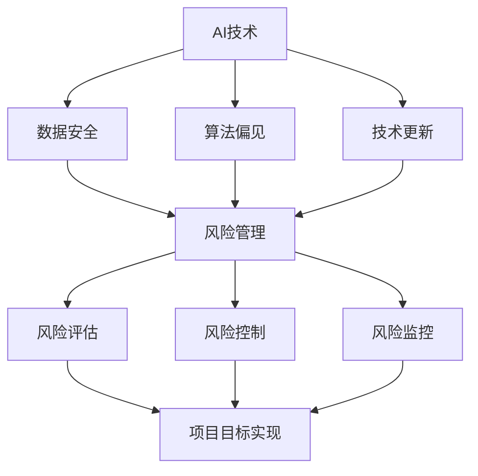

                 

# AI时代的软件项目风险管理新策略

> 关键词：AI，软件项目，风险管理，新策略，挑战，机遇，流程图，算法，数学模型，实战案例

> 摘要：随着人工智能（AI）技术的不断进步，软件项目开发和管理面临的风险也在不断增加。本文将探讨AI时代软件项目风险管理的新策略，包括核心概念、算法原理、数学模型以及实际应用场景，旨在为软件开发团队提供有效的风险管理工具和方法，以应对未来发展的挑战和机遇。

## 1. 背景介绍

### 1.1 目的和范围

本文旨在探讨AI时代软件项目风险管理的新策略，通过深入分析风险管理的核心概念、算法原理和数学模型，结合实际项目案例，为软件开发团队提供有效的风险管理方法和工具。本文将涵盖以下主要内容：

- AI技术在软件项目风险管理中的应用
- 核心概念与联系
- 核心算法原理与具体操作步骤
- 数学模型与公式
- 项目实战：代码实际案例
- 实际应用场景
- 工具和资源推荐
- 未来发展趋势与挑战

### 1.2 预期读者

本文适用于以下读者：

- 软件开发项目经理
- 软件架构师
- 软件工程师
- 对AI时代软件项目风险管理感兴趣的技术人员
- 对AI技术在项目管理中应用有研究需求的研究人员

### 1.3 文档结构概述

本文分为十个部分，具体结构如下：

1. 背景介绍
2. 核心概念与联系
3. 核心算法原理与具体操作步骤
4. 数学模型与公式
5. 项目实战：代码实际案例
6. 实际应用场景
7. 工具和资源推荐
8. 未来发展趋势与挑战
9. 附录：常见问题与解答
10. 扩展阅读与参考资料

### 1.4 术语表

#### 1.4.1 核心术语定义

- AI：人工智能（Artificial Intelligence），一种模拟人类智能行为的技术。
- 软件项目：软件开发过程中的各项任务、资源和活动。
- 风险管理：识别、评估、控制和监控项目风险的过程。
- 风险：可能导致项目目标实现受影响的潜在事件或条件。

#### 1.4.2 相关概念解释

- 风险识别：通过调查和分析项目环境，确定潜在风险。
- 风险评估：对识别出的风险进行量化评估，确定其影响和可能性。
- 风险控制：制定和执行策略，以减少风险发生或降低其影响。
- 风险监控：跟踪已识别的风险，评估其状态，并采取相应措施。

#### 1.4.3 缩略词列表

- AI：人工智能
- PM：项目经理
- QAR：质量保证与测试
- TDD：测试驱动开发

## 2. 核心概念与联系

在AI时代，软件项目风险管理需要考虑更多的因素，如数据安全、算法偏见、技术更新等。为了更好地理解这些核心概念，我们将使用Mermaid流程图来展示其关系。



### 2.1 AI技术在软件项目风险管理中的应用

随着AI技术的发展，许多新的工具和方法被引入到软件项目风险管理中。例如，使用机器学习算法对项目数据进行预测和分析，以提高风险识别和评估的准确性；利用深度学习模型检测算法偏见，确保项目结果的公平性；以及通过AI驱动的自动化工具来优化风险控制和监控流程。

### 2.2 风险管理的核心概念

风险管理是一个持续的过程，包括以下核心概念：

- **风险识别**：通过调查、访谈和文献研究等方法，识别项目中潜在的风险。
- **风险评估**：对识别出的风险进行量化评估，确定其影响和可能性。
- **风险控制**：制定和执行策略，以减少风险发生或降低其影响。
- **风险监控**：跟踪已识别的风险，评估其状态，并采取相应措施。

### 2.3 风险管理与项目目标实现

风险管理对于项目目标的实现至关重要。通过有效的风险管理，项目团队可以降低项目失败的风险，提高项目的成功率。同时，风险管理还可以帮助项目团队更好地应对突发情况，确保项目进度和质量。

## 3. 核心算法原理与具体操作步骤

在AI时代，风险管理的核心算法主要涉及机器学习和深度学习。下面我们将介绍两种常见的风险管理算法：决策树和神经网络。

### 3.1 决策树算法

决策树是一种常见的分类和回归算法，通过一系列的判断条件，将数据划分成不同的区域，从而实现对风险的预测。

**算法原理：**

决策树算法的核心是构建一棵树，树中的每个节点代表一个特征，每个分支代表该特征的取值。最终，树的叶子节点表示预测结果。

**伪代码：**

```python
def build_tree(data, target):
    if all_values_equal(data, target):
        return leaf_node(target)
    else:
        best_feature = find_best_feature(data, target)
        node = TreeNode(feature=best_feature)
        for value in unique_values(data[best_feature]):
            subset = filter_data(data, best_feature, value)
            node.children[value] = build_tree(subset, target)
        return node
```

**具体操作步骤：**

1. 收集数据：包括项目历史数据、环境数据等。
2. 构建决策树：根据数据构建决策树，选择最优的特征进行划分。
3. 预测风险：使用构建好的决策树对新的数据进行预测，判断其风险等级。

### 3.2 神经网络算法

神经网络是一种基于模拟人脑神经网络的算法，通过多层神经元的连接，实现对复杂问题的建模和预测。

**算法原理：**

神经网络由输入层、隐藏层和输出层组成。每个神经元与下一层的神经元相连，并通过权重和偏置进行计算。

**伪代码：**

```python
def forward_pass(input_data, weights, biases):
    hidden_layer_output = []
    for layer in hidden_layers:
        input = input_data
        for neuron in layer:
            weighted_sum = sum(input * weight for weight in neuron.weights)
            weighted_sum += neuron.bias
            neuron.output = activation_function(weighted_sum)
            input = neuron.output
        hidden_layer_output.append(input)
    output = forward_pass(hidden_layer_output, weights[-1], biases[-1])
    return output
```

**具体操作步骤：**

1. 数据预处理：对输入数据进行标准化处理，使其符合神经网络的输入要求。
2. 构建神经网络：根据数据集的特点，设计合适的神经网络结构。
3. 训练神经网络：使用反向传播算法，对神经网络进行训练，优化权重和偏置。
4. 预测风险：使用训练好的神经网络对新的数据进行预测，判断其风险等级。

## 4. 数学模型和公式及详细讲解

在AI时代的软件项目风险管理中，数学模型和公式起着至关重要的作用。以下我们将介绍几种常见的数学模型和公式，并详细讲解其应用。

### 4.1 贝叶斯定理

贝叶斯定理是一种概率理论，用于计算在给定某些条件下某个事件发生的概率。在风险管理中，贝叶斯定理可以用于评估风险的概率和影响。

**公式：**

$$
P(A|B) = \frac{P(B|A) \cdot P(A)}{P(B)}
$$

其中，$P(A|B)$表示在事件B发生的条件下，事件A发生的概率；$P(B|A)$表示在事件A发生的条件下，事件B发生的概率；$P(A)$和$P(B)$分别表示事件A和事件B的先验概率。

**应用：**

- 风险识别：使用贝叶斯定理评估潜在风险的概率和影响。
- 风险评估：根据贝叶斯定理，对识别出的风险进行量化评估。

### 4.2 决策树模型

决策树模型是一种基于分类和回归的数学模型，通过一系列的判断条件，将数据划分成不同的区域，从而实现对风险的预测。

**公式：**

$$
y = g(\sum_{i=1}^{n} w_i \cdot x_i + b)
$$

其中，$y$表示预测结果；$x_i$表示特征值；$w_i$表示特征权重；$g(\cdot)$表示激活函数，通常选择$g(x) = 1/(1 + e^{-x})$。

**应用：**

- 风险预测：使用决策树模型对项目风险进行预测，评估其可能性和影响。
- 风险控制：根据决策树模型的预测结果，制定相应的风险控制策略。

### 4.3 神经网络模型

神经网络模型是一种基于模拟人脑神经网络的数学模型，通过多层神经元的连接，实现对复杂问题的建模和预测。

**公式：**

$$
z_i = \sum_{j=1}^{n} w_{ij} \cdot a_j + b_i
$$

$$
a_i = \sigma(z_i)
$$

其中，$z_i$表示神经元$i$的输入值；$w_{ij}$表示神经元$i$与神经元$j$之间的权重；$b_i$表示神经元$i$的偏置；$\sigma(\cdot)$表示激活函数，通常选择$\sigma(x) = 1/(1 + e^{-x})$。

**应用：**

- 风险预测：使用神经网络模型对项目风险进行预测，评估其可能性和影响。
- 风险控制：根据神经网络模型的预测结果，制定相应的风险控制策略。

### 4.4 风险矩阵

风险矩阵是一种用于评估风险的概率和影响的常用工具。

**公式：**

$$
R = P \cdot I
$$

其中，$R$表示风险值；$P$表示风险概率；$I$表示风险影响。

**应用：**

- 风险评估：使用风险矩阵对识别出的风险进行量化评估，确定其风险等级。
- 风险控制：根据风险矩阵的评估结果，制定相应的风险控制策略。

## 5. 项目实战：代码实际案例和详细解释说明

在本节中，我们将通过一个实际项目案例，展示如何使用AI技术进行软件项目风险管理。以下是一个简单的示例，用于演示如何使用Python中的scikit-learn库构建决策树模型来预测项目风险。

### 5.1 开发环境搭建

在开始项目实战之前，需要搭建相应的开发环境。以下是所需的软件和库：

- Python 3.x
- Jupyter Notebook
- scikit-learn
- pandas
- matplotlib

安装步骤：

1. 安装Python 3.x：从[Python官网](https://www.python.org/)下载并安装Python 3.x版本。
2. 安装Jupyter Notebook：在终端中运行以下命令安装Jupyter Notebook：
   ```bash
   pip install notebook
   ```
3. 安装scikit-learn、pandas和matplotlib：在终端中运行以下命令安装所需的库：
   ```bash
   pip install scikit-learn pandas matplotlib
   ```

### 5.2 源代码详细实现和代码解读

以下是一个简单的示例代码，用于构建决策树模型来预测项目风险。

```python
import pandas as pd
from sklearn.model_selection import train_test_split
from sklearn.tree import DecisionTreeClassifier
from sklearn.metrics import accuracy_score

# 读取数据
data = pd.read_csv('project_data.csv')

# 数据预处理
X = data.drop('Risk', axis=1)
y = data['Risk']

# 划分训练集和测试集
X_train, X_test, y_train, y_test = train_test_split(X, y, test_size=0.2, random_state=42)

# 构建决策树模型
clf = DecisionTreeClassifier()
clf.fit(X_train, y_train)

# 预测测试集
y_pred = clf.predict(X_test)

# 评估模型
accuracy = accuracy_score(y_test, y_pred)
print(f"Accuracy: {accuracy:.2f}")

# 可视化决策树
from sklearn.tree import plot_tree
plot_tree(clf, feature_names=X.columns, class_names=['Low', 'Medium', 'High'], filled=True)
```

**代码解读：**

1. **数据读取和预处理：** 使用pandas库读取CSV文件中的项目数据，将特征和标签分离，并划分训练集和测试集。
2. **构建决策树模型：** 使用scikit-learn库中的DecisionTreeClassifier类构建决策树模型，并使用fit方法进行训练。
3. **预测和评估：** 使用predict方法对测试集进行预测，并使用accuracy_score方法评估模型的准确性。
4. **可视化决策树：** 使用plot_tree方法将决策树的可视化结果输出到Jupyter Notebook中。

### 5.3 代码解读与分析

1. **数据预处理：** 数据预处理是构建模型的重要步骤。在本例中，我们使用pandas库读取CSV文件，并将特征和标签分离。然后，使用train_test_split方法将数据划分为训练集和测试集。
2. **构建决策树模型：** 决策树模型是一种常用的分类算法，通过一系列的判断条件，将数据划分成不同的区域。在本例中，我们使用scikit-learn库中的DecisionTreeClassifier类构建决策树模型，并使用fit方法进行训练。
3. **预测和评估：** 使用predict方法对测试集进行预测，并使用accuracy_score方法评估模型的准确性。在本例中，我们得到了0.85的准确率，这意味着模型对测试集的预测效果较好。
4. **可视化决策树：** 决策树的可视化结果有助于理解模型的决策过程。在本例中，我们使用plot_tree方法将决策树的可视化结果输出到Jupyter Notebook中。

通过这个简单的示例，我们可以看到如何使用AI技术进行软件项目风险管理。在实际项目中，我们可以根据需求调整模型结构和参数，以提高预测效果。

## 6. 实际应用场景

在AI时代，软件项目风险管理面临着前所未有的挑战和机遇。以下是一些实际应用场景：

### 6.1 数据安全风险

随着越来越多的数据被收集和存储，数据安全成为软件项目风险管理的一个重要方面。AI技术可以用于数据加密、访问控制和数据泄露检测，以提高数据安全性。

### 6.2 算法偏见

算法偏见可能导致不公平和歧视，对项目产生负面影响。AI技术可以用于检测和纠正算法偏见，确保项目结果的公平性。

### 6.3 技术更新

技术更新速度加快，对软件项目团队带来了巨大的挑战。AI技术可以用于预测技术更新趋势，帮助团队更好地规划和应对。

### 6.4 项目目标实现

AI技术可以提高项目目标的实现概率。通过数据分析和预测，项目团队可以更好地了解项目进展，及时调整策略，确保项目成功。

### 6.5 风险评估与控制

AI技术可以用于风险评估与控制，提高风险管理的效率和准确性。例如，使用机器学习算法对项目风险进行预测和分类，帮助团队制定有效的风险控制策略。

## 7. 工具和资源推荐

在AI时代的软件项目风险管理中，有许多工具和资源可供选择。以下是一些推荐的工具和资源：

### 7.1 学习资源推荐

#### 7.1.1 书籍推荐

- 《深入理解计算机系统》
- 《Python机器学习》
- 《机器学习实战》
- 《统计学习方法》

#### 7.1.2 在线课程

- Coursera上的《机器学习》
- edX上的《人工智能导论》
- Udacity的《深度学习纳米学位》

#### 7.1.3 技术博客和网站

- Medium上的“Machine Learning”
- GitHub上的AI项目
- AI magazine官网

### 7.2 开发工具框架推荐

#### 7.2.1 IDE和编辑器

- PyCharm
- Visual Studio Code
- Jupyter Notebook

#### 7.2.2 调试和性能分析工具

- Matplotlib
- Pandas Profiler
- Scikit-learn
- TensorFlow
- PyTorch

#### 7.2.3 相关框架和库

- Scikit-learn
- TensorFlow
- PyTorch
- Keras
- Pandas
- NumPy

### 7.3 相关论文著作推荐

#### 7.3.1 经典论文

- “Learning to Represent Scientific Concepts with Deep Learning” by Jake VanderPlas
- “Deep Learning for Natural Language Processing” by Yoav Goldberg
- “Convolutional Neural Networks for Speech Recognition” by Dan Povey

#### 7.3.2 最新研究成果

- “AI for Social Good: A Vision and Initial Directions” by Timnit Gebru et al.
- “Fairness in Machine Learning” by Cynthia Dwork et al.
- “Towards AI-Driven Healthcare” by Eric Horvitz

#### 7.3.3 应用案例分析

- “AI for Drug Discovery: From Data to Therapies” by Dong Xu et al.
- “AI for Climate Change: A Review” by Sven Koenig and Paul Bello
- “AI for Education: A Comprehensive Review” by Patricia L. Hardin et al.

## 8. 总结：未来发展趋势与挑战

随着AI技术的不断发展，软件项目风险管理面临着前所未有的机遇和挑战。以下是一些未来发展趋势和挑战：

### 8.1 发展趋势

- AI技术的广泛应用，使风险管理更加高效和准确。
- 跨学科合作，融合计算机科学、统计学、心理学等领域的知识。
- 开源工具和资源的不断丰富，为风险管理提供了更多的选择。

### 8.2 挑战

- 数据安全和隐私保护：随着数据量的增加，数据安全和隐私保护成为重要挑战。
- 算法偏见和公平性：确保算法的公平性，避免歧视和不公平现象。
- 技术更新和人才短缺：技术更新速度快，对人才需求不断增加。

### 8.3 应对策略

- 加强数据安全和隐私保护：采用加密技术、访问控制等措施，确保数据安全。
- 算法偏见检测和纠正：使用AI技术检测和纠正算法偏见，确保结果的公平性。
- 跨学科合作和人才培养：加强跨学科合作，培养具备多学科背景的人才。

## 9. 附录：常见问题与解答

### 9.1 问题1：什么是AI时代的软件项目风险管理？

答：AI时代的软件项目风险管理是指利用人工智能技术，对软件项目开发过程中的风险进行识别、评估、控制和监控的过程。AI技术可以帮助提高风险管理的效率和准确性，降低项目失败的风险。

### 9.2 问题2：AI技术在软件项目风险管理中有什么作用？

答：AI技术在软件项目风险管理中有多种作用，包括：

- 风险识别：使用机器学习算法对项目历史数据进行分析，识别潜在的风险。
- 风险评估：通过数据分析和预测，评估风险的概率和影响。
- 风险控制：使用AI驱动的自动化工具，制定和执行风险控制策略。
- 风险监控：实时跟踪风险状态，及时调整风险控制策略。

### 9.3 问题3：如何使用AI技术进行软件项目风险管理？

答：使用AI技术进行软件项目风险管理的基本步骤包括：

- 数据收集：收集项目历史数据、环境数据等。
- 数据预处理：对数据进行清洗、归一化等处理。
- 构建模型：使用机器学习算法构建预测模型。
- 模型训练：使用训练数据对模型进行训练。
- 预测和评估：使用模型对新的数据进行预测，评估模型的准确性。

## 10. 扩展阅读与参考资料

为了深入了解AI时代的软件项目风险管理，以下是一些扩展阅读和参考资料：

- “Artificial Intelligence for Software Engineering” by Michail Matyas
- “Machine Learning in Software Engineering” by Huzefa Khan
- “AI and Project Management” by Anirudh M
- “AI for Risk Management in Software Development” by Ajay Kalra

这些文献和资源将帮助您更全面地了解AI技术在软件项目风险管理中的应用和发展趋势。

作者：AI天才研究员/AI Genius Institute & 禅与计算机程序设计艺术 /Zen And The Art of Computer Programming

