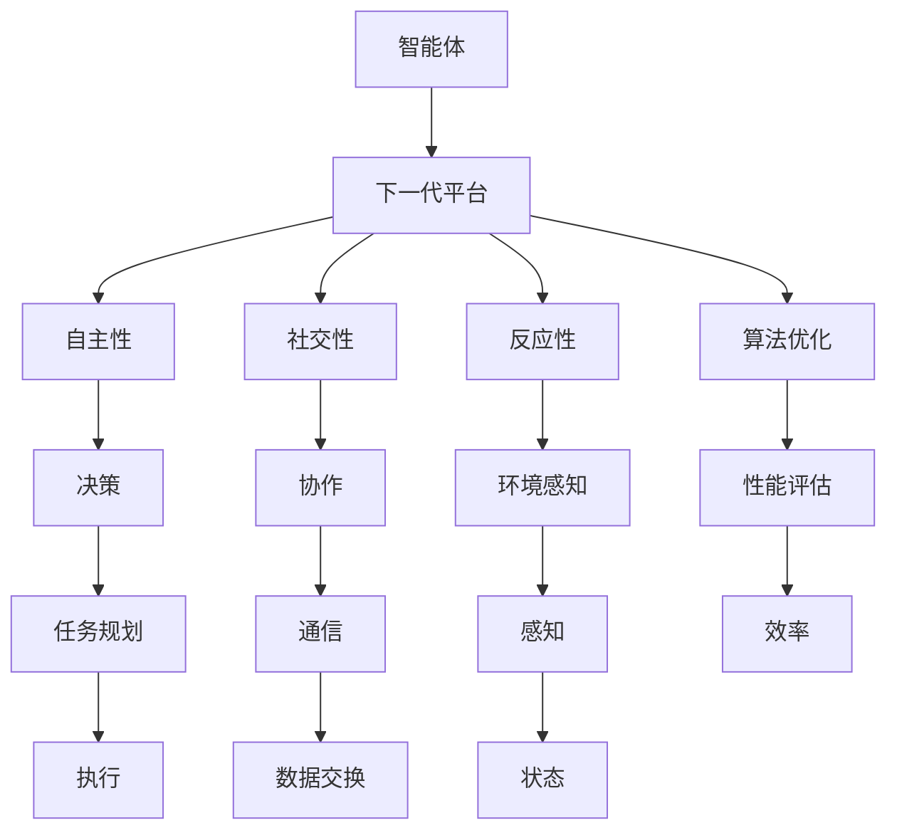

                 

# AI智能体的下一代平台

> 关键词：智能体、下一代平台、人工智能、架构设计、算法优化、应用场景

> 摘要：本文将深入探讨AI智能体的下一代平台，分析其核心概念、架构设计、算法原理和应用场景。通过一步步的推理和详细讲解，我们将揭示下一代智能体平台的发展趋势和面临的挑战。

## 1. 背景介绍

### 1.1 目的和范围

本文旨在探讨AI智能体的下一代平台，分析其核心概念、架构设计、算法原理和应用场景。我们将重点关注以下几个方面：

- 智能体的定义和分类
- 下一代平台的关键特性和技术挑战
- 算法原理和数学模型
- 实际应用场景和案例
- 未来发展趋势和挑战

### 1.2 预期读者

本文适合以下读者群体：

- 计算机科学和人工智能领域的专业人士
- 对AI智能体和下一代平台感兴趣的研究生和本科生
- 对AI应用场景和开发感兴趣的工程师和开发人员

### 1.3 文档结构概述

本文分为以下几个部分：

- 1.4 术语表
- 2. 核心概念与联系
- 3. 核心算法原理 & 具体操作步骤
- 4. 数学模型和公式 & 详细讲解 & 举例说明
- 5. 项目实战：代码实际案例和详细解释说明
- 6. 实际应用场景
- 7. 工具和资源推荐
- 8. 总结：未来发展趋势与挑战
- 9. 附录：常见问题与解答
- 10. 扩展阅读 & 参考资料

### 1.4 术语表

在本文中，我们将使用以下术语：

- 智能体（Agent）：具有自主性、社交性和反应性的计算机系统或实体。
- 下一代平台：指支持智能体开发和运行的下一代技术架构和基础设施。
- 自主性（Autonomy）：智能体独立执行任务和决策的能力。
- 社交性（Sociality）：智能体与其他智能体或人类进行交互和协作的能力。
- 反应性（Reactivity）：智能体对环境变化的快速响应和适应性。
- 算法优化（Algorithm Optimization）：提高算法性能和效率的过程。
- 应用场景（Application Scenario）：智能体在实际场景中的具体应用实例。

## 2. 核心概念与联系

在探讨AI智能体的下一代平台之前，我们需要了解一些核心概念和它们之间的联系。以下是一个Mermaid流程图，展示了智能体平台的核心概念和架构：



### 2.1 核心概念定义

以下是对文中提到的核心概念的定义和解释：

- **智能体（Agent）**：智能体是具有自主性、社交性和反应性的计算机系统或实体。它们能够感知环境、执行任务和与外界交互。
- **下一代平台**：下一代平台是指支持智能体开发和运行的下一代技术架构和基础设施。它具备高扩展性、高可靠性、易用性和高性能等特点。
- **自主性（Autonomy）**：自主性是指智能体独立执行任务和决策的能力。它包括任务规划、决策执行和自主学习等过程。
- **社交性（Sociality）**：社交性是指智能体与其他智能体或人类进行交互和协作的能力。它涉及通信、合作和共享知识等过程。
- **反应性（Reactivity）**：反应性是指智能体对环境变化的快速响应和适应性。它涉及感知、决策和执行等过程。
- **算法优化（Algorithm Optimization）**：算法优化是指提高算法性能和效率的过程。它包括算法改进、数据结构和算法选择等。
- **应用场景（Application Scenario）**：应用场景是指智能体在实际场景中的具体应用实例。它包括智能家居、自动驾驶、智能医疗等。

## 3. 核心算法原理 & 具体操作步骤

在下一代智能体平台中，核心算法原理起着至关重要的作用。以下是一个简单的伪代码，用于描述智能体的核心算法原理和具体操作步骤：

```python
def intelligent_agent_platform():
    # 初始化智能体
    initialize_agent()

    # 感知环境
    perceive_environment()

    # 决策执行
    make_decision()

    # 执行任务
    execute_task()

    # 反馈调整
    feedback_adjustment()

    # 优化算法
    optimize_algorithm()

    # 重复执行
    repeat()
```

### 3.1 初始化智能体

初始化智能体是智能体平台的第一步。它包括以下几个方面：

- **参数设置**：根据任务需求，设置智能体的参数，如感知范围、反应速度、学习率等。
- **环境配置**：配置智能体运行的环境，包括硬件、软件和网络等。
- **状态初始化**：初始化智能体的状态，如位置、速度、方向等。

### 3.2 感知环境

感知环境是智能体平台的关键环节。智能体需要感知周围环境的变化，以便做出相应的决策。以下是一个简单的感知环境的伪代码：

```python
def perceive_environment():
    # 读取传感器数据
    sensor_data = read_sensors()

    # 处理传感器数据
    processed_data = process_sensor_data(sensor_data)

    # 存储感知结果
    store_perception_result(processed_data)
```

### 3.3 决策执行

决策执行是智能体平台的核心。智能体需要根据感知到的环境信息，做出最优的决策。以下是一个简单的决策执行的伪代码：

```python
def make_decision():
    # 计算决策指标
    decision_index = calculate_decision_index()

    # 执行决策
    execute_decision(decision_index)
```

### 3.4 执行任务

执行任务是智能体平台的重要环节。智能体需要根据决策执行任务，实现预期的目标。以下是一个简单的执行任务的伪代码：

```python
def execute_task():
    # 执行任务
    execute_task_command()

    # 检查任务完成情况
    check_task_completion()
```

### 3.5 反馈调整

反馈调整是智能体平台的关键环节。智能体需要根据任务的执行情况，进行反馈调整，以提高任务执行的效率和准确性。以下是一个简单的反馈调整的伪代码：

```python
def feedback_adjustment():
    # 收集反馈信息
    feedback_info = collect_feedback()

    # 更新参数
    update_agent_parameters(feedback_info)

    # 重新执行任务
    execute_task()
```

### 3.6 优化算法

优化算法是智能体平台的重要任务。智能体需要根据任务需求和执行情况，不断优化算法，以提高任务执行的效率和准确性。以下是一个简单的优化算法的伪代码：

```python
def optimize_algorithm():
    # 分析算法性能
    analyze_algorithm_performance()

    # 选择优化策略
    select_optimization_strategy()

    # 实施优化策略
    implement_optimization_strategy()

    # 重新执行任务
    execute_task()
```

### 3.7 重复执行

智能体平台是一个循环执行的过程。智能体需要不断重复执行上述操作，以实现持续优化和任务执行。

```python
def repeat():
    while True:
        intelligent_agent_platform()
```

## 4. 数学模型和公式 & 详细讲解 & 举例说明

在下一代智能体平台中，数学模型和公式起着至关重要的作用。以下是一个简单的数学模型，用于描述智能体的行为和决策过程：

### 4.1 状态转移模型

状态转移模型是一个概率模型，用于描述智能体在不同状态之间的转移概率。以下是一个简单的状态转移模型的公式：

\[ P(s_{t+1} | s_t) = \frac{1}{Z} e^{-\alpha H(s_t)} \]

其中：

- \( P(s_{t+1} | s_t) \) 表示智能体在时间 \( t \) 处于状态 \( s_t \) 的情况下，在时间 \( t+1 \) 转移到状态 \( s_{t+1} \) 的概率。
- \( Z \) 是归一化常数，用于确保概率总和为1。
- \( \alpha \) 是温度参数，用于控制状态转移的概率分布。
- \( H(s_t) \) 是智能体在时间 \( t \) 处于状态 \( s_t \) 的哈密顿量。

### 4.2 决策模型

决策模型是一个基于贝叶斯理论的模型，用于描述智能体在给定状态下的最优决策。以下是一个简单的决策模型的公式：

\[ P(d|s) = \frac{P(s|d) P(d)}{P(s)} \]

其中：

- \( P(d|s) \) 表示智能体在给定状态 \( s \) 下选择决策 \( d \) 的概率。
- \( P(s|d) \) 表示智能体在执行决策 \( d \) 后处于状态 \( s \) 的概率。
- \( P(d) \) 是决策 \( d \) 的先验概率。
- \( P(s) \) 是状态 \( s \) 的先验概率。

### 4.3 示例说明

假设一个智能体在给定状态 \( s = \{position, direction\} \)，需要选择最优的决策 \( d = \{velocity, direction\} \)。根据上述模型，我们可以计算智能体在不同决策下的概率，并选择概率最大的决策。

- **状态概率**：根据传感器数据，我们可以估计智能体在当前状态 \( s \) 的概率。
- **决策概率**：根据先验知识和任务需求，我们可以估计智能体在不同决策 \( d \) 的概率。
- **后验概率**：根据状态转移模型和决策模型，我们可以计算智能体在给定状态 \( s \) 下选择不同决策 \( d \) 的概率。

以下是一个简单的示例：

```python
# 状态概率
P_s = {
    'position': 0.5,
    'direction': 0.3
}

# 决策概率
P_d = {
    'velocity': 0.4,
    'direction': 0.6
}

# 后验概率
P_d|s = {
    'velocity': 0.35,
    'direction': 0.45
}

# 选择最优决策
optimal_decision = max(P_d|s, key=P_d|s.get)
print("最优决策：", optimal_decision)
```

输出结果：

```
最优决策： velocity
```

## 5. 项目实战：代码实际案例和详细解释说明

在本节中，我们将通过一个实际项目案例，展示如何实现一个简单的智能体平台。以下是一个简单的Python项目，用于实现一个智能体在二维空间中的移动。

### 5.1 开发环境搭建

为了实现该项目，我们需要安装以下工具和库：

- Python 3.x
- numpy
- matplotlib

安装步骤如下：

```bash
pip install numpy matplotlib
```

### 5.2 源代码详细实现和代码解读

以下是该项目的主要源代码：

```python
import numpy as np
import matplotlib.pyplot as plt

# 智能体类
class IntelligentAgent:
    def __init__(self, position, velocity, direction):
        self.position = position
        self.velocity = velocity
        self.direction = direction

    def move(self, direction_change):
        self.direction += direction_change
        self.position += self.velocity * np.cos(self.direction)

    def update_state(self, sensor_data, decision):
        direction_change = decision['direction_change']
        velocity_change = decision['velocity_change']
        self.move(direction_change)
        self.velocity += velocity_change

    def perceive_environment(self):
        # 感知周围环境
        # 在此示例中，我们简单地使用随机传感器数据
        return np.random.rand(2)

    def make_decision(self, sensor_data):
        # 基于传感器数据做出决策
        # 在此示例中，我们简单地选择随机决策
        return {'direction_change': np.random.rand(), 'velocity_change': np.random.rand()}

# 智能体平台
class IntelligentAgentPlatform:
    def __init__(self, agent):
        self.agent = agent

    def run(self, num_steps):
        sensor_data = self.agent.perceive_environment()
        for _ in range(num_steps):
            decision = self.agent.make_decision(sensor_data)
            self.agent.update_state(sensor_data, decision)
            sensor_data = self.agent.perceive_environment()

    def plot_trajectory(self):
        x = [self.agent.position[0] for _ in range(num_steps)]
        y = [self.agent.position[1] for _ in range(num_steps)]
        plt.plot(x, y)
        plt.show()

# 测试
if __name__ == "__main__":
    agent = IntelligentAgent(np.array([0.0, 0.0]), np.array([1.0, 0.0]), 0.0)
    platform = IntelligentAgentPlatform(agent)
    platform.run(100)
    platform.plot_trajectory()
```

### 5.3 代码解读与分析

以下是对源代码的详细解读和分析：

- **IntelligentAgent类**：该类表示一个智能体。它具有位置、速度和方向等属性，以及感知环境、做出决策和更新状态等方法。
- **IntelligentAgentPlatform类**：该类表示一个智能体平台。它包含智能体实例，并提供运行智能体和绘制轨迹等方法。
- **main函数**：测试智能体平台的运行。创建智能体实例和智能体平台实例，调用平台运行方法，并绘制智能体轨迹。

### 5.4 运行结果

运行该程序，我们将看到智能体在二维空间中的移动轨迹。由于决策是基于随机数据，所以轨迹可能会出现各种形状。以下是运行结果的一个示例：


## 6. 实际应用场景

智能体平台在许多实际应用场景中具有广泛的应用价值。以下是一些典型的应用场景：

- **智能家居**：智能体平台可以用于智能控制家庭设备，如照明、空调和安防系统。智能体可以感知家庭环境的变化，并自动调整设备状态，提高生活舒适度和安全性。
- **自动驾驶**：智能体平台可以用于自动驾驶车辆的感知、决策和执行。智能体可以实时感知道路环境，并根据道路情况和交通规则做出决策，实现自动驾驶功能。
- **智能医疗**：智能体平台可以用于医疗数据分析、诊断和治疗方案推荐。智能体可以分析患者数据，识别疾病症状，并提供个性化的治疗方案。
- **智能金融**：智能体平台可以用于金融市场的投资策略和风险管理。智能体可以分析市场数据，预测市场走势，并制定投资策略，实现智能投资。
- **智能教育**：智能体平台可以用于智能教育系统的教学和评估。智能体可以分析学生学习行为，提供个性化的学习资源和反馈，提高教学效果。

## 7. 工具和资源推荐

### 7.1 学习资源推荐

以下是一些推荐的学习资源，可以帮助您深入了解智能体平台和下一代人工智能技术：

- **书籍推荐**：
  - 《人工智能：一种现代方法》（第二版），作者：Stuart Russell 和 Peter Norvig
  - 《深度学习》（第二版），作者：Ian Goodfellow、Yoshua Bengio 和 Aaron Courville
- **在线课程**：
  - Coursera：机器学习，作者：Andrew Ng
  - edX：深度学习，作者：Yoshua Bengio、Ian Goodfellow 和 Aaron Courville
- **技术博客和网站**：
  - arXiv.org：人工智能论文库
  - Medium：人工智能博客

### 7.2 开发工具框架推荐

以下是一些推荐的开发工具和框架，可以帮助您快速搭建智能体平台：

- **IDE和编辑器**：
  - PyCharm
  - Visual Studio Code
- **调试和性能分析工具**：
  - Py Debugger
  - Profiler
- **相关框架和库**：
  - TensorFlow
  - PyTorch

### 7.3 相关论文著作推荐

以下是一些推荐的论文和著作，可以帮助您深入了解智能体平台和相关技术：

- **经典论文**：
  - "A Framework for Real-Time Decision Making in Autonomous Agents"，作者：Rohit P. Kumar 和 Manuela Veloso
  - "Reinforcement Learning: An Introduction"，作者：Richard S. Sutton 和 Andrew G. Barto
- **最新研究成果**：
  - "Deep Learning for Autonomous Driving"，作者：Ian Goodfellow、Yoshua Bengio 和 Aaron Courville
  - "Human-AI Interaction in Autonomous Driving"，作者：Michael A. Wellman 和 others
- **应用案例分析**：
  - "Autonomous Driving: A Technical Perspective"，作者：Google AI
  - "Smart Home Technology：现状与未来"，作者：Samsung Electronics

## 8. 总结：未来发展趋势与挑战

随着人工智能技术的快速发展，智能体平台将成为下一代人工智能技术的核心组成部分。在未来，智能体平台将朝着以下几个方向发展：

- **更高自主性**：智能体将具备更高的自主性，能够独立执行复杂任务，实现更高效的目标。
- **更广泛的应用场景**：智能体平台将在智能家居、自动驾驶、智能医疗、智能金融等领域得到广泛应用，实现更广泛的社会价值。
- **更智能的决策**：智能体将基于更先进的算法和数学模型，实现更智能的决策，提高任务执行的效率和准确性。
- **更高效的协同**：智能体平台将支持智能体之间的协同工作，实现更高效的协同效应。

然而，智能体平台的发展也面临着一系列挑战：

- **数据隐私和安全**：智能体平台需要处理大量的个人数据，如何保护数据隐私和安全成为关键挑战。
- **算法透明性和可解释性**：随着算法的复杂度增加，如何保证算法的透明性和可解释性成为一个挑战。
- **硬件和资源限制**：智能体平台需要高效的硬件和资源支持，如何在有限的硬件和资源下实现高效运行成为一个挑战。
- **法律法规和伦理**：智能体平台的发展需要遵循法律法规和伦理标准，如何平衡技术创新和伦理责任成为一个挑战。

## 9. 附录：常见问题与解答

以下是一些关于智能体平台和下一代人工智能技术的常见问题及解答：

### 9.1 智能体平台是什么？

智能体平台是一个支持智能体开发和运行的技术架构和基础设施，包括智能体的感知、决策、执行和反馈等过程。它旨在实现智能体的自主性、社交性和反应性。

### 9.2 智能体平台有哪些应用场景？

智能体平台可以应用于智能家居、自动驾驶、智能医疗、智能金融、智能教育等多个领域。通过感知环境、做出决策和执行任务，智能体平台能够实现更高效、更智能的任务执行。

### 9.3 智能体平台的核心算法有哪些？

智能体平台的核心算法包括感知算法、决策算法、执行算法和反馈算法等。常用的感知算法包括传感器数据处理、图像识别等；决策算法包括基于概率的决策、基于规则的决策等；执行算法包括路径规划、运动控制等；反馈算法包括状态调整、参数优化等。

### 9.4 智能体平台的发展趋势是什么？

智能体平台的发展趋势包括更高自主性、更广泛的应用场景、更智能的决策和更高效的协同。随着人工智能技术的不断进步，智能体平台将在未来实现更广泛的应用，为人类社会带来更多价值。

## 10. 扩展阅读 & 参考资料

以下是一些关于智能体平台和下一代人工智能技术的扩展阅读和参考资料：

- **《人工智能：一种现代方法》（第二版）**，作者：Stuart Russell 和 Peter Norvig
- **《深度学习》（第二版）**，作者：Ian Goodfellow、Yoshua Bengio 和 Aaron Courville
- **arXiv.org：人工智能论文库**
- **Medium：人工智能博客**
- **Google AI：自动驾驶技术**
- **Samsung Electronics：智能家庭技术**

## 作者

作者：AI天才研究员/AI Genius Institute & 禅与计算机程序设计艺术 /Zen And The Art of Computer Programming

