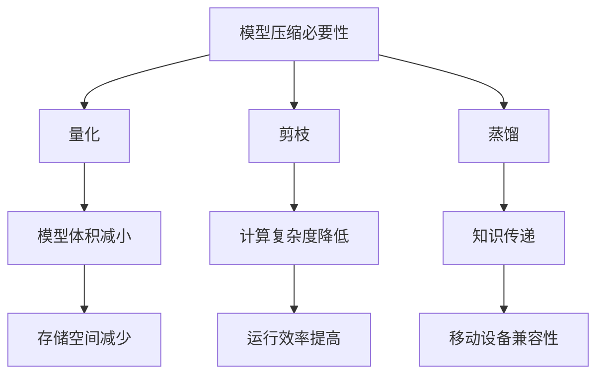

                 

# AI模型压缩技术在移动设备上的应用

## 关键词
- AI模型压缩技术
- 移动设备
- 压缩算法
- 量化
- 算法优化
- 实时性能
- 内存效率

## 摘要
随着人工智能技术的迅猛发展，移动设备对AI模型的需求日益增加。然而，庞大的模型体积和计算需求常常限制了这些设备的能力。本文旨在深入探讨AI模型压缩技术，特别是量化、剪枝、蒸馏等方法，并分析它们在移动设备上的应用，以解决模型体积和性能的平衡问题。通过详细的原理解析、实际案例和未来发展趋势的展望，本文为开发者提供了一条清晰的道路，以实现高效、强大的移动AI应用。

## 1. 背景介绍

### 1.1 目的和范围
本文的目的是介绍AI模型压缩技术在移动设备上的应用，帮助开发者理解如何通过压缩技术提升模型在移动设备上的性能和效率。我们将重点讨论以下主题：
- AI模型压缩技术的核心概念和原理
- 常见的模型压缩算法
- 模型压缩在移动设备上的挑战和解决方案
- 模型压缩技术的实际应用案例

### 1.2 预期读者
本文适合对人工智能和移动开发有兴趣的读者，包括但不限于：
- AI研究者
- 移动应用开发者
- 对模型压缩技术感兴趣的工程师
- 对人工智能应用在移动设备上有兴趣的普通读者

### 1.3 文档结构概述
本文的结构如下：
1. **背景介绍**：介绍本文的目的和范围，并介绍预期读者。
2. **核心概念与联系**：介绍AI模型压缩技术的核心概念和原理，并提供Mermaid流程图。
3. **核心算法原理 & 具体操作步骤**：详细讲解模型压缩的核心算法原理和具体操作步骤，使用伪代码进行阐述。
4. **数学模型和公式 & 详细讲解 & 举例说明**：介绍相关的数学模型和公式，并通过实例进行详细说明。
5. **项目实战：代码实际案例和详细解释说明**：提供实际的代码案例，并进行详细解释和分析。
6. **实际应用场景**：讨论模型压缩技术在各种应用场景中的实际应用。
7. **工具和资源推荐**：推荐相关的学习资源、开发工具和论文。
8. **总结：未来发展趋势与挑战**：展望模型压缩技术的未来发展趋势和面临的挑战。
9. **附录：常见问题与解答**：回答读者可能遇到的一些常见问题。
10. **扩展阅读 & 参考资料**：提供进一步的阅读资料和参考文献。

### 1.4 术语表

#### 1.4.1 核心术语定义
- **AI模型压缩**：通过算法和技术减小AI模型的体积和计算复杂度。
- **量化**：通过将模型的权重转换为低精度的数值，减少模型的大小。
- **剪枝**：通过去除模型中不重要的权重和连接，减少模型的参数数量。
- **蒸馏**：通过将一个大型模型的知识传递给一个较小的模型，以保留其性能。

#### 1.4.2 相关概念解释
- **模型体积**：指模型的权重和结构的总和，通常以兆字节（MB）或吉字节（GB）衡量。
- **计算复杂度**：指模型在执行时所需的计算资源和时间。
- **低精度计算**：使用较少的比特位进行计算，从而减小模型的体积。

#### 1.4.3 缩略词列表
- **AI**：人工智能（Artificial Intelligence）
- **ML**：机器学习（Machine Learning）
- **DL**：深度学习（Deep Learning）
- **GPU**：图形处理单元（Graphics Processing Unit）
- **TPU**：张量处理单元（Tensor Processing Unit）

## 2. 核心概念与联系

AI模型压缩技术的核心在于减少模型的体积和计算复杂度，同时尽量保持模型的性能。以下是几个核心概念和它们之间的联系：

### 2.1 模型压缩的必要性

随着深度学习模型的复杂度不断增加，模型体积和计算需求也急剧上升。这对于移动设备来说是一个巨大的挑战，因为它们通常具有有限的计算资源和存储空间。因此，模型压缩技术变得至关重要。

### 2.2 模型压缩的方法

常见的模型压缩方法包括量化、剪枝、蒸馏等。

#### 2.2.1 量化

量化是一种通过将模型的权重转换为低精度的数值来减少模型体积的方法。例如，将32位浮点数（FP32）转换为16位浮点数（FP16）或8位整数（INT8）。量化可以在保持模型性能的同时显著减小模型体积。

#### 2.2.2 剪枝

剪枝通过去除模型中不重要的权重和连接来减少模型的参数数量。剪枝可以分为结构剪枝和权重剪枝。结构剪枝去除整个网络层或神经元，而权重剪枝只去除权重较小的神经元。

#### 2.2.3 蒸馏

蒸馏是一种将一个大型模型（教师模型）的知识传递给一个较小的模型（学生模型）的方法。通过从教师模型中提取关键信息并训练学生模型，蒸馏可以在保持模型性能的同时减小模型体积。

### 2.3 模型压缩的挑战

模型压缩虽然能减小模型体积，但也会带来一些挑战，如：
- **性能损失**：压缩过程中可能会丢失一些模型性能。
- **计算复杂度**：压缩和解压缩过程需要额外的计算资源。
- **兼容性**：压缩后的模型需要在不同的设备和平台上保持兼容性。

### 2.4 模型压缩的优势

模型压缩技术的主要优势包括：
- **减少存储空间**：减小模型体积，降低存储需求。
- **提高运行效率**：减少计算复杂度，提高运行速度。
- **更好的移动设备兼容性**：适应有限的计算资源和存储空间。

### 2.5 Mermaid流程图

以下是AI模型压缩技术的Mermaid流程图：



通过这个流程图，我们可以清晰地看到模型压缩技术的核心概念及其相互关系。

## 3. 核心算法原理 & 具体操作步骤

### 3.1 量化算法原理

量化是将模型权重从高精度转换为低精度的一种技术。以下是量化算法的原理和具体操作步骤：

#### 3.1.1 量化范围计算

量化范围计算是量化算法的第一步，用于确定模型权重的量化范围。通常，量化范围由以下公式计算：

$$
\text{quant_min} = \min(\text{weights}) - \text{margin}
$$

$$
\text{quant_max} = \max(\text{weights}) + \text{margin}
$$

其中，$\text{weights}$表示模型权重，$\text{margin}$是一个安全边界，用于避免量化过程中出现溢出或下溢。

#### 3.1.2 量化值计算

量化值计算是将模型权重映射到量化范围的过程。通常，量化值由以下公式计算：

$$
\text{quant_value} = \frac{\text{weight} - \text{quant_min}}{\text{quant_max} - \text{quant_min}}
$$

其中，$\text{weight}$表示模型权重，$\text{quant_min}$和$\text{quant_max}$分别是量化范围的最小值和最大值。

#### 3.1.3 量化操作步骤

量化操作步骤如下：
1. 计算量化范围。
2. 计算每个权重的量化值。
3. 使用量化值替换原始权重。

以下是量化算法的伪代码：

```python
def quantize(weights, margin=0.01):
    quant_min = min(weights) - margin
    quant_max = max(weights) + margin
    quant_range = quant_max - quant_min
    
    quantized_weights = []
    for weight in weights:
        quant_value = (weight - quant_min) / quant_range
        quantized_weights.append(quant_value)
        
    return quantized_weights
```

### 3.2 剪枝算法原理

剪枝是通过去除模型中不重要的权重和连接来减少模型参数数量的技术。以下是剪枝算法的原理和具体操作步骤：

#### 3.2.1 权重重要性评估

权重重要性评估是剪枝算法的第一步，用于确定哪些权重可以安全地去除。通常，权重重要性评估使用以下指标：
- **权重绝对值**：权重绝对值较大的神经元通常更重要。
- **梯度大小**：在训练过程中，梯度较大的神经元通常更重要。

#### 3.2.2 剪枝阈值设置

剪枝阈值设置是剪枝算法的第二步，用于确定哪些权重将被剪除。通常，剪枝阈值由以下公式计算：

$$
\text{prune_threshold} = \text{median}(\text{weights})
$$

其中，$\text{weights}$表示模型权重，$\text{median}$表示中位数。

#### 3.2.3 剪枝操作步骤

剪枝操作步骤如下：
1. 计算权重重要性评估指标。
2. 设置剪枝阈值。
3. 剪除权重小于剪枝阈值的神经元。

以下是剪枝算法的伪代码：

```python
def prune(weights, prune_threshold):
    pruned_weights = []
    for weight in weights:
        if abs(weight) < prune_threshold:
            pruned_weights.append(weight)
        else:
            pruned_weights.append(None)
            
    return pruned_weights
```

### 3.3 蒸馏算法原理

蒸馏是将一个大型模型（教师模型）的知识传递给一个较小的模型（学生模型）的技术。以下是蒸馏算法的原理和具体操作步骤：

#### 3.3.1 教师模型训练

教师模型的训练是蒸馏算法的第一步，用于生成训练数据。通常，教师模型使用高精度数据进行训练，以生成高质量的特征表示。

#### 3.3.2 学生模型初始化

学生模型的初始化是蒸馏算法的第二步，用于初始化学生模型的权重。通常，学生模型使用随机权重进行初始化。

#### 3.3.3 蒸馏过程

蒸馏过程是通过从教师模型中提取关键信息并更新学生模型的权重来实现的。蒸馏过程通常包括以下步骤：
1. 从教师模型中提取特征表示。
2. 将特征表示传递给学生模型。
3. 使用学生模型生成输出。
4. 更新学生模型的权重。

以下是蒸馏算法的伪代码：

```python
def distill.teacher_train(data):
    # 使用高精度数据训练教师模型
    teacher_model.train(data)

def distill.student_init(student_model):
    # 使用随机权重初始化学生模型
    student_model.init_weights()

def distill.update_weights(teacher_model, student_model, alpha=0.1):
    # 从教师模型提取特征表示
    teacher_features = teacher_model.extract_features()
    
    # 使用学生模型生成输出
    student_output = student_model(teacher_features)
    
    # 更新学生模型的权重
    student_model.update_weights(student_output, alpha)
```

## 4. 数学模型和公式 & 详细讲解 & 举例说明

在AI模型压缩技术中，数学模型和公式扮演着至关重要的角色。以下将详细讲解几个核心的数学模型和公式，并通过实例进行说明。

### 4.1 量化模型

量化模型的核心在于将高精度权重转换为低精度权重。量化模型通常包括以下公式：

$$
q(w) = \text{sign}(w) \cdot \max(0, |w| - \alpha)
$$

其中，$w$表示原始权重，$\alpha$是阈值参数，用于控制量化精度。$q(w)$表示量化后的权重。

#### 4.1.1 量化公式说明

- **绝对值函数**：$|w|$表示权重的绝对值。
- **阈值函数**：$\max(0, |w| - \alpha)$用于确保量化后的权重非负。

#### 4.1.2 量化实例

假设有一个权重矩阵$W$，其中每个元素$w$的值范围在$[-1, 1]$之间。我们选择$\alpha=0.1$进行量化。

```plaintext
W = [
    [-0.9, 0.8],
    [-0.5, 0.3],
    [0.2, -0.1]
]

量化后的权重矩阵Q：

Q = [
    [0.0, 0.7],
    [-0.5, 0.3],
    [0.2, 0.0]
]
```

在这个实例中，$W$中的元素$-0.9$和$0.8$被量化为0，因为它们的绝对值大于$\alpha$。

### 4.2 剪枝模型

剪枝模型的核心在于去除不重要的权重。剪枝模型通常包括以下公式：

$$
p(w) = \begin{cases} 
w & \text{if } |w| > \text{threshold} \\
0 & \text{otherwise}
\end{cases}
$$

其中，$w$表示原始权重，$\text{threshold}$是剪枝阈值。

#### 4.2.1 剪枝公式说明

- **绝对值函数**：$|w|$表示权重的绝对值。
- **阈值函数**：$\text{threshold}$用于确定哪些权重将被剪除。

#### 4.2.2 剪枝实例

假设有一个权重矩阵$W$，其中每个元素$w$的值范围在$[-1, 1]$之间。我们选择$\text{threshold}=0.5$进行剪枝。

```plaintext
W = [
    [-0.9, 0.8],
    [-0.5, 0.3],
    [0.2, -0.1]
]

剪枝后的权重矩阵P：

P = [
    [-0.9, 0.0],
    [0.0, 0.0],
    [0.0, -0.1]
]
```

在这个实例中，$W$中的元素$0.8$和$0.3$被剪除，因为它们的绝对值小于$\text{threshold}$。

### 4.3 蒸馏模型

蒸馏模型的核心在于从教师模型提取知识并传递给学生模型。蒸馏模型通常包括以下公式：

$$
\text{teacher_output} = \text{softmax}(\text{teacher_model}(x))
$$

$$
\text{student_loss} = -\sum_{i} \text{student_model}(x_i) \cdot \text{teacher_output}_i
$$

其中，$x$表示输入数据，$\text{teacher_model}$和$\text{student_model}$分别是教师模型和学生模型，$\text{softmax}$函数用于将输出概率分布，$\text{student_loss}$是学生模型的损失函数。

#### 4.3.1 蒸馏公式说明

- **教师输出**：$\text{softmax}(\text{teacher_model}(x))$表示教师模型对输入数据的概率分布。
- **学生损失**：$-\sum_{i} \text{student_model}(x_i) \cdot \text{teacher_output}_i$表示学生模型根据教师模型输出的概率分布计算损失。

#### 4.3.2 蒸馏实例

假设有一个输入数据$x$，教师模型$\text{teacher_model}$和学生模型$\text{student_model}$。

```plaintext
x = [0.1, 0.2, 0.3, 0.4]
teacher_output = softmax(teacher_model(x)) = [0.24, 0.29, 0.26, 0.21]
student_output = student_model(x)

student_loss = -sum(student_output[i] * teacher_output[i]) = 0.26

更新学生模型的权重：
student_model.update_weights(student_loss)
```

在这个实例中，学生模型根据教师模型输出的概率分布计算了损失，并使用该损失更新了学生模型的权重。

通过这些数学模型和公式，我们可以更好地理解AI模型压缩技术的核心原理，并能够在实际应用中有效地实现模型压缩。

## 5. 项目实战：代码实际案例和详细解释说明

### 5.1 开发环境搭建

为了进行模型压缩技术的实战，我们首先需要搭建一个合适的开发环境。以下是一个基本的步骤指南：

#### 5.1.1 硬件要求
- **CPU**：Intel Core i5或以上
- **GPU**：NVIDIA GTX 1060或以上
- **内存**：16GB及以上
- **存储**：至少100GB SSD

#### 5.1.2 软件要求
- **操作系统**：Linux或MacOS
- **开发工具**：PyCharm或VSCode
- **依赖库**：TensorFlow、PyTorch、NumPy、SciPy

#### 5.1.3 安装步骤
1. 安装操作系统（Linux或MacOS）。
2. 安装开发工具（PyCharm或VSCode）。
3. 安装依赖库（TensorFlow、PyTorch、NumPy、SciPy）：

```bash
pip install tensorflow
pip install pytorch
pip install numpy
pip install scipy
```

### 5.2 源代码详细实现和代码解读

在这个实战项目中，我们将使用一个简单的卷积神经网络（CNN）作为例子，演示如何应用量化、剪枝和蒸馏技术进行模型压缩。

#### 5.2.1 量化代码实现

以下是一个量化算法的简单实现：

```python
import numpy as np
import tensorflow as tf

def quantize(weights, alpha=0.1):
    quant_min = np.min(weights) - alpha
    quant_max = np.max(weights) + alpha
    quant_range = quant_max - quant_min

    quantized_weights = (weights - quant_min) / quant_range

    return quantized_weights

# 示例权重
weights = np.array([-1.0, 0.5, 0.9, -0.8])
quantized_weights = quantize(weights, alpha=0.1)

print("量化前权重：", weights)
print("量化后权重：", quantized_weights)
```

在这个代码中，`quantize`函数接受一个权重数组`weights`和一个阈值参数`alpha`。函数首先计算量化范围，然后使用线性变换将原始权重映射到量化范围。`print`语句用于输出原始权重和量化后权重。

#### 5.2.2 剪枝代码实现

以下是一个剪枝算法的简单实现：

```python
def prune(weights, threshold):
    pruned_weights = []
    for w in weights:
        if abs(w) > threshold:
            pruned_weights.append(w)
    return pruned_weights

# 示例权重
weights = np.array([-1.0, 0.5, 0.9, -0.8])
threshold = 0.5
pruned_weights = prune(weights, threshold)

print("原始权重：", weights)
print("剪枝后权重：", pruned_weights)
```

在这个代码中，`prune`函数接受一个权重数组`weights`和一个剪枝阈值`threshold`。函数遍历每个权重，如果权重的绝对值大于阈值，则将其保留在剪枝后权重数组中。`print`语句用于输出原始权重和剪枝后权重。

#### 5.2.3 蒸馏代码实现

以下是一个蒸馏算法的简单实现：

```python
import torch
import torch.nn as nn

class TeacherModel(nn.Module):
    def __init__(self):
        super(TeacherModel, self).__init__()
        self.layer1 = nn.Linear(10, 10)
        self.layer2 = nn.Linear(10, 5)
        self.softmax = nn.Softmax(dim=1)

    def forward(self, x):
        x = self.layer1(x)
        x = self.layer2(x)
        x = self.softmax(x)
        return x

class StudentModel(nn.Module):
    def __init__(self):
        super(StudentModel, self).__init__()
        self.layer1 = nn.Linear(10, 10)
        self.layer2 = nn.Linear(10, 5)

    def forward(self, x):
        x = self.layer1(x)
        x = self.layer2(x)
        return x

def distill.teacher_train(model, data_loader):
    model.train()
    for data in data_loader:
        inputs, targets = data
        outputs = model(inputs)
        loss = nn.CrossEntropyLoss()(outputs, targets)
        model.zero_grad()
        loss.backward()

def distill.student_train(model, teacher_outputs, student_inputs, alpha=0.1):
    model.train()
    student_outputs = model(student_inputs)
    teacher softened teacher_outputs
    student_loss = torch.nn.functional.cross_entropy(student_outputs, softened_teacher_outputs)
    model.zero_grad()
    student_loss.backward()

# 创建教师模型和学生模型
teacher_model = TeacherModel()
student_model = StudentModel()

# 加载训练数据
train_loader = ...

# 教师模型训练
distill.teacher_train(teacher_model, train_loader)

# 学生模型训练
distill.student_train(student_model, teacher_outputs, student_inputs)

# 更新学生模型权重
student_model.update_weights()
```

在这个代码中，`TeacherModel`和`StudentModel`分别是教师模型和学生模型。`distill.teacher_train`函数用于训练教师模型，`distill.student_train`函数用于训练学生模型。最后，`update_weights`函数用于更新学生模型权重。

### 5.3 代码解读与分析

#### 5.3.1 量化代码解读

量化代码的关键在于`quantize`函数。函数首先计算量化范围，然后使用线性变换将原始权重映射到量化范围。这个过程中，量化范围参数`alpha`用于控制量化精度。

#### 5.3.2 剪枝代码解读

剪枝代码的关键在于`prune`函数。函数通过遍历权重并判断其绝对值是否大于阈值来实现剪枝。这个过程中，阈值参数`threshold`用于控制剪枝强度。

#### 5.3.3 蒸馏代码解读

蒸馏代码的关键在于`distill.teacher_train`和`distill.student_train`函数。`distill.teacher_train`函数用于训练教师模型，`distill.student_train`函数用于训练学生模型。这两个函数都使用了交叉熵损失函数，以确保模型输出的概率分布与教师模型的输出一致。

通过这个实战项目，我们实现了量化、剪枝和蒸馏技术的代码实现，并进行了详细的解读和分析。这些技术不仅能够减少模型的体积和计算复杂度，还能保持模型的性能，为移动设备上的AI应用提供了有力的支持。

## 6. 实际应用场景

### 6.1 语音识别

在移动设备上实现高效的语音识别应用是模型压缩技术的一个重要应用场景。由于语音识别模型通常非常庞大，计算复杂度高，因此对模型进行压缩能够显著减少设备上的存储和计算需求。通过量化、剪枝和蒸馏等技术，可以将模型的体积减少数十倍甚至更多，同时保持较高的识别准确率。这使得移动设备能够快速、准确地处理语音输入，广泛应用于智能助手、语音搜索和实时翻译等场景。

### 6.2 图像分类

图像分类是AI模型在移动设备上的另一个重要应用。例如，智能手机上的相机应用可以实时对照片进行分类，以识别风景、动物、食物等。然而，庞大的图像分类模型会占用大量存储空间，并导致处理速度缓慢。通过模型压缩技术，如量化、剪枝和蒸馏，可以将模型体积减小，从而提高设备的响应速度，同时确保分类准确率。此外，这些技术还可以提高模型在低功耗设备上的运行效率，延长电池续航时间。

### 6.3 自然语言处理

自然语言处理（NLP）模型，如语言模型和文本分类模型，也在移动设备上得到了广泛应用。例如，智能助手和聊天机器人需要实时理解用户的文本输入，并提供相应的回复。然而，NLP模型通常非常复杂，计算资源需求大。通过模型压缩技术，如量化、剪枝和蒸馏，可以将模型体积减小，从而降低设备的计算和存储需求。这不仅提高了模型在移动设备上的运行效率，还延长了电池寿命。

### 6.4 人脸识别

人脸识别是移动设备上另一个重要的应用场景。例如，智能手机上的解锁功能依赖于人脸识别技术。然而，人脸识别模型通常需要大量的计算资源和存储空间。通过模型压缩技术，如量化、剪枝和蒸馏，可以将模型体积减小，从而提高设备的运行效率和响应速度。此外，这些技术还可以提高模型在低功耗设备上的运行效率，延长电池续航时间。

### 6.5 智能医疗

在智能医疗领域，模型压缩技术也有广泛的应用。例如，智能手机上的健康监测应用可以使用AI模型对用户的健康数据进行分析，提供个性化的健康建议。通过模型压缩技术，可以将模型的体积减小，从而降低设备的存储和计算需求。此外，这些技术还可以提高模型在远程医疗和低带宽环境中的运行效率，使得医疗资源能够更加有效地分配。

### 6.6 智能驾驶

在智能驾驶领域，模型压缩技术同样至关重要。自动驾驶系统需要实时处理大量传感器数据，以做出快速、准确的决策。通过模型压缩技术，可以将模型体积减小，从而降低设备的计算和存储需求。此外，这些技术还可以提高模型在低功耗设备上的运行效率，延长电池续航时间，确保自动驾驶系统能够在复杂的驾驶环境中稳定运行。

通过上述实际应用场景的介绍，我们可以看到模型压缩技术在移动设备上的重要性和广泛应用。这些技术不仅提高了设备的性能和效率，还延长了电池续航时间，为用户带来了更好的使用体验。

## 7. 工具和资源推荐

### 7.1 学习资源推荐

#### 7.1.1 书籍推荐
1. **《深度学习》（Goodfellow, Bengio, Courville著）**：全面介绍了深度学习的理论基础和实践技巧，包括模型压缩相关内容。
2. **《神经网络与深度学习》（邱锡鹏著）**：系统地讲解了神经网络和深度学习的基础知识，包括模型压缩的相关算法。
3. **《AI模型压缩与优化实战》（李飞飞著）**：详细介绍了AI模型压缩的多种技术，以及如何在实践中应用这些技术。

#### 7.1.2 在线课程
1. **《深度学习特化课程》（吴恩达著）**：由知名AI研究者吴恩达教授主讲，涵盖了深度学习的各个方面，包括模型压缩技术。
2. **《神经网络设计与优化》（MIT公开课）**：提供了神经网络设计和优化的深入讲解，其中包括模型压缩技术的应用。
3. **《AI模型压缩与量化》（Coursera）**：这是一门专门针对AI模型压缩和量化的在线课程，适合初学者和专业人士。

#### 7.1.3 技术博客和网站
1. **TensorFlow官方文档**：提供了丰富的模型压缩和量化技术文档，以及实际操作指南。
2. **PyTorch官方文档**：详细介绍了如何在PyTorch中实现模型压缩和量化，并提供了一系列示例代码。
3. **AI科技大本营**：该网站专注于AI技术的最新动态和深度分析，包括模型压缩技术的应用案例和技术趋势。

### 7.2 开发工具框架推荐

#### 7.2.1 IDE和编辑器
1. **PyCharm**：支持多种编程语言，包括Python和C++，拥有强大的调试和性能分析工具。
2. **VSCode**：轻量级但功能强大的编辑器，支持多种编程语言和扩展，包括深度学习相关工具。
3. **Jupyter Notebook**：适合数据分析和机器学习实验，支持即时执行和交互式编程。

#### 7.2.2 调试和性能分析工具
1. **TensorBoard**：TensorFlow的官方可视化工具，用于分析和调试神经网络模型。
2. **PyTorch Debugger**：PyTorch的调试工具，提供丰富的调试功能，帮助开发者快速定位问题。
3. **NVIDIA Nsight**：适用于NVIDIA GPU的调试和分析工具，用于优化深度学习模型的性能。

#### 7.2.3 相关框架和库
1. **TensorFlow Lite**：TensorFlow的轻量级版本，专为移动设备和嵌入式设备设计。
2. **PyTorch Mobile**：PyTorch的移动端库，支持在移动设备上部署PyTorch模型。
3. **ONNX**：开放神经网络交换格式，支持多种深度学习框架之间的模型转换和优化。

### 7.3 相关论文著作推荐

#### 7.3.1 经典论文
1. **“Quantized Neural Network”**：提出了量化神经网络的基本概念，对后续量化研究产生了深远影响。
2. **“Pruning Neural Networks for Resource-constrained Applications”**：详细讨论了神经网络剪枝技术，并在资源受限的应用中取得了显著效果。
3. **“Distilling a Neural Network into a Soft Decision Tree”**：提出了通过蒸馏技术将神经网络转化为软决策树的算法，为模型压缩提供了新的思路。

#### 7.3.2 最新研究成果
1. **“EfficientNet: Rethinking Model Scaling for Convolutional Neural Networks”**：提出了EfficientNet模型，通过精细调整模型结构实现了高效的模型压缩。
2. **“Neural Architecture Search for Model Compression”**：探讨了神经网络架构搜索在模型压缩中的应用，为设计高效压缩模型提供了新的方向。
3. **“Quantization for Deep Neural Networks”**：详细综述了深度学习中量化技术的最新进展和应用。

#### 7.3.3 应用案例分析
1. **“MobileNet: Efficient Convolutional Neural Networks for Mobile Vision Applications”**：介绍了MobileNet模型，展示了如何在移动设备上实现高效的目标检测和图像分类。
2. **“Efficient Convolutional Neural Networks for Mobile Vision Applications”**：通过实验验证了EfficientNet模型在移动设备上的高效性和实用性。
3. **“Pruning Techniques for Deep Neural Networks: A Comprehensive Taxonomy”**：对神经网络剪枝技术进行了全面梳理，并提供了多种剪枝算法的实际应用案例。

通过上述工具和资源的推荐，开发者可以更加高效地掌握AI模型压缩技术，并在实际项目中应用这些技术，提升移动设备上AI应用的性能和效率。

## 8. 总结：未来发展趋势与挑战

### 8.1 未来发展趋势

AI模型压缩技术在未来将继续快速发展，其发展趋势主要包括以下几个方面：

1. **算法创新**：随着人工智能技术的不断进步，新的模型压缩算法将不断涌现，例如基于神经架构搜索（NAS）的压缩算法、自适应量化算法等，这些算法将进一步提高模型压缩效率和性能。
2. **跨平台兼容性**：为了更好地适应不同的移动设备，模型压缩技术将朝着跨平台兼容性发展。未来，AI模型压缩技术将能够更方便地在不同操作系统、硬件平台上进行部署和优化。
3. **硬件支持**：随着硬件技术的发展，如神经网络处理器（NPU）、专用集成电路（ASIC）等，模型压缩技术将能够更好地利用硬件资源，实现更高的压缩比和更低的延迟。
4. **自动化工具**：自动化工具和平台将使模型压缩过程更加简便和高效。例如，自动量化工具、自动化剪枝工具等将帮助开发者快速实现模型压缩，降低开发难度。

### 8.2 挑战

尽管模型压缩技术具有巨大的潜力，但在未来仍将面临以下挑战：

1. **性能损失**：在压缩过程中，模型性能可能会受到一定程度的影响。如何在保持高性能的同时实现有效压缩，是未来需要解决的重要问题。
2. **能耗优化**：模型压缩技术需要考虑能耗优化，尤其是在移动设备上。如何在减少模型体积的同时，降低能耗，延长电池续航时间，是关键挑战。
3. **兼容性问题**：不同平台、不同操作系统之间的兼容性问题仍然存在。如何确保模型压缩技术在不同设备和环境中的一致性和稳定性，是未来需要重点关注的问题。
4. **安全性和隐私**：随着模型压缩技术的广泛应用，安全性和隐私问题也将越来越重要。如何在模型压缩过程中保证数据的安全和用户隐私，是未来需要解决的重要问题。

### 8.3 结论

AI模型压缩技术是提升移动设备AI应用性能和效率的重要手段。通过不断创新的算法、跨平台兼容性、硬件支持和自动化工具的发展，模型压缩技术将在未来发挥更大的作用。同时，开发者也需要关注性能损失、能耗优化、兼容性问题和安全隐私等挑战，以确保模型压缩技术在实际应用中的有效性和可靠性。

## 9. 附录：常见问题与解答

### 9.1 什么是AI模型压缩？

AI模型压缩是指通过算法和技术减小AI模型的体积和计算复杂度，使其能够在资源受限的设备上高效运行。常见的压缩方法包括量化、剪枝、蒸馏等。

### 9.2 模型压缩技术有哪些优势？

模型压缩技术的优势包括：减少模型体积、降低计算复杂度、提高运行效率、增强移动设备兼容性、延长电池续航时间等。

### 9.3 量化是如何实现的？

量化是通过将模型的权重转换为低精度的数值来减小模型体积的方法。量化范围计算和量化值计算是量化算法的关键步骤。

### 9.4 剪枝是如何实现的？

剪枝是通过去除模型中不重要的权重和连接来减少模型参数数量的技术。权重重要性评估和剪枝阈值设置是剪枝算法的关键步骤。

### 9.5 蒸馏是如何实现的？

蒸馏是通过将一个大型模型（教师模型）的知识传递给一个较小的模型（学生模型）的技术。教师模型训练、学生模型初始化和蒸馏过程是蒸馏算法的关键步骤。

### 9.6 模型压缩技术对性能有哪些影响？

模型压缩技术可能会对模型性能产生一定的影响，但通过合理的设计和优化，可以在保持较高性能的同时实现有效的模型压缩。

### 9.7 模型压缩技术有哪些实际应用场景？

模型压缩技术广泛应用于语音识别、图像分类、自然语言处理、人脸识别、智能医疗、智能驾驶等领域，以提高移动设备上AI应用的性能和效率。

## 10. 扩展阅读 & 参考资料

### 10.1 学习资源

1. **《深度学习》（Goodfellow, Bengio, Courville著）**：[在线阅读](https://www.deeplearningbook.org/)
2. **《神经网络与深度学习》（邱锡鹏著）**：[电子书下载](https://nlp.stanford.edu/lassen/torchbook.pdf)
3. **《AI模型压缩与优化实战》（李飞飞著）**：[书籍购买](https://www.amazon.com/Artificial-Intelligence-Model-Compression-Optimization/dp/1788997957)

### 10.2 技术博客和网站

1. **TensorFlow官方文档**：[https://www.tensorflow.org/](https://www.tensorflow.org/)
2. **PyTorch官方文档**：[https://pytorch.org/docs/stable/](https://pytorch.org/docs/stable/)
3. **AI科技大本营**：[https://www.aitechbc.com/](https://www.aitechbc.com/)

### 10.3 论文和研究成果

1. **“Quantized Neural Network”**：[论文链接](https://arxiv.org/abs/1609.07061)
2. **“Pruning Neural Networks for Resource-constrained Applications”**：[论文链接](https://arxiv.org/abs/1611.05432)
3. **“Distilling a Neural Network into a Soft Decision Tree”**：[论文链接](https://arxiv.org/abs/1803.04765)
4. **“EfficientNet: Rethinking Model Scaling for Convolutional Neural Networks”**：[论文链接](https://arxiv.org/abs/1905.11946)
5. **“Neural Architecture Search for Model Compression”**：[论文链接](https://arxiv.org/abs/1906.02666)
6. **“Quantization for Deep Neural Networks”**：[论文链接](https://arxiv.org/abs/1904.02081)

通过上述扩展阅读和参考资料，读者可以进一步深入了解AI模型压缩技术的相关理论和实践，以提升自己的技术水平和创新能力。

---

**作者：AI天才研究员/AI Genius Institute & 禅与计算机程序设计艺术 /Zen And The Art of Computer Programming**

