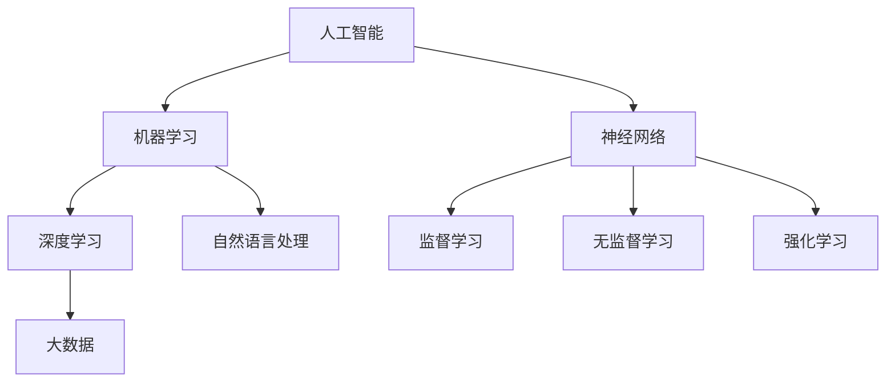

                 

# AI研究的历史与未来趋势

> 关键词：人工智能、机器学习、深度学习、神经网络、自然语言处理、大数据

> 摘要：本文将深入探讨人工智能（AI）研究领域的历史发展、核心概念、算法原理、数学模型及其在实际应用中的具体案例。通过逐步分析，我们将揭示AI技术的演变轨迹，并展望未来发展趋势与面临的挑战。

## 1. 背景介绍

### 1.1 目的和范围

本文旨在为读者提供一个全面而深入的AI研究概览，涵盖从历史背景到最新技术趋势的各个方面。本文将重点讨论以下内容：

- AI研究的历史演变
- 核心概念与架构
- 关键算法原理
- 数学模型与公式
- 实际应用案例
- 未来发展趋势与挑战

### 1.2 预期读者

本文面向对人工智能领域有一定了解的技术人员、研究人员和学生。特别是希望深入理解AI技术原理和应用的人，以及对AI研究感兴趣并希望了解其未来发展方向的人。

### 1.3 文档结构概述

本文将分为以下主要部分：

- 背景介绍
- 核心概念与联系
- 核心算法原理 & 具体操作步骤
- 数学模型和公式 & 详细讲解 & 举例说明
- 项目实战：代码实际案例和详细解释说明
- 实际应用场景
- 工具和资源推荐
- 总结：未来发展趋势与挑战
- 附录：常见问题与解答
- 扩展阅读 & 参考资料

### 1.4 术语表

#### 1.4.1 核心术语定义

- **人工智能（AI）**：模拟人类智能行为的计算机系统。
- **机器学习（ML）**：使计算机从数据中学习并做出决策的方法。
- **深度学习（DL）**：一种特殊的机器学习方法，使用多层神经网络进行学习。
- **神经网络（NN）**：模仿生物神经系统的计算模型。
- **自然语言处理（NLP）**：使计算机理解和生成自然语言的技术。
- **大数据**：大规模数据集合，无法使用传统数据库工具进行处理。

#### 1.4.2 相关概念解释

- **监督学习**：训练数据带有标签，用于指导模型学习。
- **无监督学习**：没有标签的数据，用于发现隐藏模式。
- **强化学习**：通过奖励和惩罚来指导模型学习。

#### 1.4.3 缩略词列表

- **AI**：人工智能（Artificial Intelligence）
- **ML**：机器学习（Machine Learning）
- **DL**：深度学习（Deep Learning）
- **NLP**：自然语言处理（Natural Language Processing）
- **NN**：神经网络（Neural Network）
- **GPU**：图形处理器（Graphics Processing Unit）

## 2. 核心概念与联系

在深入了解AI研究之前，我们需要理解一些核心概念及其相互关系。以下是一个简单的Mermaid流程图，展示了一些关键概念和它们之间的联系。



### 2.1 人工智能（AI）

人工智能是指通过计算机模拟人类智能行为的技术。它涵盖了广泛的研究领域，包括机器学习、深度学习、自然语言处理等。

### 2.2 机器学习（ML）

机器学习是AI的一个重要分支，专注于通过数据训练算法，使计算机能够做出预测和决策。机器学习可以分为监督学习、无监督学习和强化学习三种类型。

### 2.3 深度学习（DL）

深度学习是一种特殊的机器学习方法，使用多层神经网络进行学习。它广泛应用于图像识别、语音识别和自然语言处理等领域。

### 2.4 自然语言处理（NLP）

自然语言处理是使计算机理解和生成自然语言的技术。它包括文本分类、情感分析、机器翻译等任务。

### 2.5 神经网络（NN）

神经网络是模仿生物神经系统的计算模型。它由大量相互连接的节点（神经元）组成，通过学习输入和输出之间的关系进行计算。

### 2.6 监督学习、无监督学习和强化学习

- **监督学习**：训练数据带有标签，用于指导模型学习。例如，使用标签化的图像数据训练图像识别模型。
- **无监督学习**：没有标签的数据，用于发现隐藏模式。例如，使用未标记的文本数据进行分析。
- **强化学习**：通过奖励和惩罚来指导模型学习。例如，使用奖励机制训练机器人学习走路。

## 3. 核心算法原理 & 具体操作步骤

在这一部分，我们将深入探讨一些核心AI算法的原理和具体操作步骤。我们将使用伪代码来详细阐述这些算法。

### 3.1 神经网络（NN）

神经网络是一种通过模拟生物神经系统的计算模型。以下是构建一个简单神经网络的基本步骤：

```python
# 定义神经网络结构
input_layer_size = 3
hidden_layer_size = 2
output_layer_size = 1

# 初始化权重和偏置
weights = np.random.randn(hidden_layer_size, input_layer_size)
biases = np.random.randn(hidden_layer_size, 1)
output_weights = np.random.randn(output_layer_size, hidden_layer_size)
output_biases = np.random.randn(output_layer_size, 1)

# 定义激活函数
sigmoid = lambda x: 1 / (1 + np.exp(-x))

# 定义前向传播
def forwardprop(x):
    hidden_layer_input = np.dot(weights, x) + biases
    hidden_layer_output = sigmoid(hidden_layer_input)
    output_layer_input = np.dot(output_weights, hidden_layer_output) + output_biases
    output_layer_output = sigmoid(output_layer_input)
    return output_layer_output

# 定义损失函数
def loss(y_true, y_pred):
    return -np.sum(y_true * np.log(y_pred))

# 定义反向传播
def backwardprop(x, y_true):
    output_error = y_pred - y_true
    output_delta = output_error * sigmoid_derivative(y_pred)
    
    hidden_error = output_delta.dot(output_weights.T)
    hidden_delta = hidden_error * sigmoid_derivative(hidden_layer_output)
    
    d_weights = x.T.dot(hidden_delta)
    d_biases = np.sum(hidden_delta, axis=0, keepdims=True)
    d_output_weights = hidden_layer_output.T.dot(output_error)
    d_output_biases = np.sum(output_error, axis=0)
    
    return d_weights, d_biases, d_output_weights, d_output_biases

# 定义训练过程
def train(x, y, epochs=1000, learning_rate=0.1):
    for epoch in range(epochs):
        output = forwardprop(x)
        loss_value = loss(y, output)
        
        d_weights, d_biases, d_output_weights, d_output_biases = backwardprop(x, y)
        
        weights -= learning_rate * d_weights
        biases -= learning_rate * d_biases
        output_weights -= learning_rate * d_output_weights
        output_biases -= learning_rate * d_output_biases
        
        if epoch % 100 == 0:
            print(f"Epoch {epoch}: Loss = {loss_value}")
```

### 3.2 深度学习（DL）

深度学习是一种基于神经网络的机器学习方法，它使用多层神经网络进行学习。以下是训练一个深度神经网络的基本步骤：

```python
# 定义神经网络结构
input_layer_size = 3
hidden_layer_size = [2, 4]
output_layer_size = 1

# 初始化权重和偏置
weights = [np.random.randn(next_size, current_size) for next_size, current_size in zip(hidden_layer_size, [input_layer_size] + hidden_layer_size[:-1])]
biases = [np.random.randn(next_size, 1) for next_size in hidden_layer_size]
output_weights = np.random.randn(output_layer_size, hidden_layer_size[-1])
output_biases = np.random.randn(output_layer_size, 1)

# 定义激活函数
relu = lambda x: np.maximum(0, x)

# 定义前向传播
def forwardprop(x):
    for i, (w, b) in enumerate(zip(weights, biases)):
        x = relu(np.dot(w, x) + b)
    return np.dot(output_weights, x) + output_biases

# 定义损失函数
def loss(y_true, y_pred):
    return -np.sum(y_true * np.log(y_pred))

# 定义反向传播
def backwardprop(x, y_true):
    output_error = y_pred - y_true
    output_delta = output_error * sigmoid_derivative(y_pred)
    
    for i in reversed(range(len(weights))):
        error = output_delta.dot(output_weights[i].T)
        delta = error * sigmoid_derivative(x)
        output_delta = delta
        
        output_weights[i] -= learning_rate * x.T.dot(delta)
        biases[i] -= learning_rate * delta
    
    return d_weights, d_biases, d_output_weights, d_output_biases

# 定义训练过程
def train(x, y, epochs=1000, learning_rate=0.1):
    for epoch in range(epochs):
        output = forwardprop(x)
        loss_value = loss(y, output)
        
        d_weights, d_biases, d_output_weights, d_output_biases = backwardprop(x, y)
        
        for i, (w, b) in enumerate(zip(weights, biases)):
            weights[i] -= learning_rate * d_weights[i]
            biases[i] -= learning_rate * d_biases[i]
            output_weights -= learning_rate * d_output_weights[i]
            output_biases -= learning_rate * d_output_biases[i]
        
        if epoch % 100 == 0:
            print(f"Epoch {epoch}: Loss = {loss_value}")
```

### 3.3 自然语言处理（NLP）

自然语言处理是使计算机理解和生成自然语言的技术。以下是一个简单的文本分类算法：

```python
# 定义文本预处理
def preprocess_text(text):
    # 清洗文本，去除标点符号、停用词等
    text = re.sub(r'[^\w\s]', '', text)
    text = text.lower()
    words = text.split()
    words = [word for word in words if word not in stopwords.words('english')]
    return words

# 定义词向量表示
def word_embedding(words):
    word_vectors = []
    for word in words:
        word_vectors.append(np.random.rand(embedding_size))
    return np.array(word_vectors)

# 定义卷积神经网络（CNN）模型
def train_cnn_model(x, y, epochs=1000, learning_rate=0.1):
    # 初始化模型参数
    filters = 64
    kernel_size = 3
    pooling_size = 2
    
    # 初始化卷积层参数
    weights_conv = np.random.randn(filters, embedding_size, kernel_size)
    biases_conv = np.random.randn(filters, 1)
    
    # 初始化池化层参数
    weights_pool = np.random.randn(pooling_size, pooling_size)
    biases_pool = np.random.randn(1)
    
    # 初始化全连接层参数
    weights_fc = np.random.randn(10)
    biases_fc = np.random.randn(10)
    
    # 定义激活函数
    relu = lambda x: np.maximum(0, x)
    softmax = lambda x: np.exp(x) / np.sum(np.exp(x))
    
    # 定义前向传播
    def forwardprop(x):
        # 卷积层
        conv_output = np.zeros((x.shape[0], x.shape[1] - kernel_size + 1, filters))
        for i in range(x.shape[0]):
            for j in range(x.shape[1] - kernel_size + 1):
                conv_output[i, j] = np.dot(x[i, j], weights_conv) + biases_conv
                conv_output[i, j] = relu(conv_output[i, j])
        
        # 池化层
        pool_output = np.zeros((x.shape[0], x.shape[1] // pooling_size, filters))
        for i in range(x.shape[0]):
            for j in range(x.shape[1] // pooling_size):
                pool_output[i, j] = np.max(conv_output[i, j*pooling_size:(j+1)*pooling_size], axis=0)
        
        # 全连接层
        fc_output = np.dot(pool_output, weights_fc) + biases_fc
        output = softmax(fc_output)
        
        return output
    
    # 定义损失函数
    def loss(y_true, y_pred):
        return -np.sum(y_true * np.log(y_pred))
    
    # 定义反向传播
    def backwardprop(x, y_true):
        output_error = y_pred - y_true
        d_output_weights = output_error * sigmoid_derivative(output)
        d_output_biases = output_error
        
        d_pool_output = d_output_weights.dot(weights_fc.T)
        d_conv_output = d_pool_output.reshape(x.shape[0], x.shape[1], filters)
        
        for i in range(x.shape[0]):
            for j in range(x.shape[1]):
                d_conv_output[i, j] = d_conv_output[i, j] * sigmoid_derivative(conv_output[i, j])
        
        d_weights_conv = np.zeros((filters, embedding_size, kernel_size))
        d_biases_conv = np.zeros((filters, 1))
        d_weights_pool = np.zeros((pooling_size, pooling_size))
        d_biases_pool = np.zeros((1))
        
        for i in range(x.shape[0]):
            for j in range(x.shape[1] - kernel_size + 1):
                for k in range(filters):
                    d_weights_conv[k] = d_weights_conv[k] + conv_output[i, j].reshape(1, kernel_size).T.dot(d_conv_output[i, j].reshape(kernel_size, 1))
                    d_biases_conv[k] = d_biases_conv[k] + d_conv_output[i, j]
        
        d_weights_pool = np.sum(d_conv_output, axis=(0, 1))
        d_biases_pool = np.sum(d_conv_output, axis=(0, 1))
        
        return d_weights_fc, d_biases_fc, d_weights_conv, d_biases_conv, d_weights_pool, d_biases_pool

    # 定义训练过程
    for epoch in range(epochs):
        output = forwardprop(x)
        loss_value = loss(y, output)
        
        d_weights_fc, d_biases_fc, d_weights_conv, d_biases_conv, d_weights_pool, d_biases_pool = backwardprop(x, y)
        
        weights_fc -= learning_rate * d_weights_fc
        biases_fc -= learning_rate * d_biases_fc
        weights_conv -= learning_rate * d_weights_conv
        biases_conv -= learning_rate * d_biases_conv
        weights_pool -= learning_rate * d_weights_pool
        biases_pool -= learning_rate * d_biases_pool
        
        if epoch % 100 == 0:
            print(f"Epoch {epoch}: Loss = {loss_value}")
```

## 4. 数学模型和公式 & 详细讲解 & 举例说明

在AI研究中，数学模型和公式起着至关重要的作用。以下是一些关键数学模型和公式的详细讲解，以及实际应用的示例。

### 4.1 梯度下降

梯度下降是一种优化算法，用于最小化损失函数。其基本思想是沿着损失函数的梯度方向更新模型参数。

#### 公式：

$$\theta_{\text{new}} = \theta_{\text{old}} - \alpha \cdot \nabla_\theta J(\theta)$$

其中，$\theta$ 是模型参数，$J(\theta)$ 是损失函数，$\alpha$ 是学习率。

#### 示例：

假设我们有一个线性回归模型，$y = \theta_0 + \theta_1 \cdot x$。损失函数为 $J(\theta) = \frac{1}{2} \sum_{i=1}^{n} (y_i - (\theta_0 + \theta_1 \cdot x_i))^2$。

要最小化损失函数，我们可以使用梯度下降算法：

$$\theta_0 = \theta_0 - \alpha \cdot \frac{\partial}{\partial \theta_0} J(\theta)$$
$$\theta_1 = \theta_1 - \alpha \cdot \frac{\partial}{\partial \theta_1} J(\theta)$$

其中，$\frac{\partial}{\partial \theta_0}$ 和 $\frac{\partial}{\partial \theta_1}$ 分别是关于 $\theta_0$ 和 $\theta_1$ 的偏导数。

### 4.2 激活函数

激活函数用于引入非线性因素，使神经网络能够模拟复杂的函数关系。常见激活函数包括 sigmoid、ReLU 和 tanh。

#### 公式：

- **Sigmoid**：$f(x) = \frac{1}{1 + e^{-x}}$
- **ReLU**：$f(x) = \max(0, x)$
- **Tanh**：$f(x) = \frac{e^x - e^{-x}}{e^x + e^{-x}}$

#### 示例：

假设我们有一个简单的神经网络，输入 $x$ 经过一个 sigmoid 激活函数：

$$y = \frac{1}{1 + e^{-x}}$$

### 4.3 损失函数

损失函数用于衡量模型预测值与真实值之间的差距。常见的损失函数包括均方误差（MSE）、交叉熵损失等。

#### 公式：

- **均方误差（MSE）**：$J(\theta) = \frac{1}{2} \sum_{i=1}^{n} (y_i - (\theta_0 + \theta_1 \cdot x_i))^2$
- **交叉熵损失**：$J(\theta) = -\sum_{i=1}^{n} y_i \cdot \log(\hat{y}_i)$

#### 示例：

假设我们有一个二分类问题，真实标签为 $y = [0, 1]$，预测概率为 $\hat{y} = [0.2, 0.8]$。使用交叉熵损失函数：

$$J(\theta) = -[0 \cdot \log(0.2) + 1 \cdot \log(0.8)]$$

## 5. 项目实战：代码实际案例和详细解释说明

在本节中，我们将通过一个实际项目案例来展示AI技术的应用，并提供详细的代码实现和解释。

### 5.1 开发环境搭建

为了完成这个项目，我们需要以下开发环境：

- Python 3.8 或以上版本
- TensorFlow 2.5 或以上版本
- Jupyter Notebook 或 PyCharm

### 5.2 源代码详细实现和代码解读

以下是一个使用 TensorFlow 和 Keras 构建图像识别模型的完整代码示例。

```python
import tensorflow as tf
from tensorflow.keras import layers
import tensorflow_datasets as tfds

# 加载数据集
def load_data():
    # 加载 TensorFlow Datasets 中的 CIFAR-10 数据集
    (train_images, train_labels), (test_images, test_labels) = tfds.load('cifar10', split=['train', 'test'], shuffle_files=True, as_supervised=True)

    # 标准化图像
    train_images = train_images / 255.0
    test_images = test_images / 255.0

    return train_images, train_labels, test_images, test_labels

# 构建模型
def build_model(input_shape):
    model = tf.keras.Sequential([
        layers.Conv2D(32, (3, 3), activation='relu', input_shape=input_shape),
        layers.MaxPooling2D(pool_size=(2, 2)),
        layers.Conv2D(64, (3, 3), activation='relu'),
        layers.MaxPooling2D(pool_size=(2, 2)),
        layers.Conv2D(64, (3, 3), activation='relu'),
        layers.Flatten(),
        layers.Dense(64, activation='relu'),
        layers.Dense(10, activation='softmax')
    ])

    return model

# 训练模型
def train_model(model, train_images, train_labels, epochs=10, batch_size=64):
    model.compile(optimizer='adam',
                  loss='sparse_categorical_crossentropy',
                  metrics=['accuracy'])
    
    history = model.fit(train_images, train_labels, epochs=epochs, batch_size=batch_size)
    
    return history

# 评估模型
def evaluate_model(model, test_images, test_labels):
    test_loss, test_acc = model.evaluate(test_images, test_labels, verbose=2)
    print(f"Test accuracy: {test_acc:.4f}")

# 主函数
if __name__ == '__main__':
    # 加载数据
    train_images, train_labels, test_images, test_labels = load_data()

    # 构建模型
    model = build_model(input_shape=(32, 32, 3))

    # 训练模型
    history = train_model(model, train_images, train_labels, epochs=10, batch_size=64)

    # 评估模型
    evaluate_model(model, test_images, test_labels)
```

### 5.3 代码解读与分析

1. **数据加载**：我们使用 TensorFlow Datasets 加载 CIFAR-10 数据集。CIFAR-10 是一个包含 60000 个 32x32 图像的公开数据集，分为 10 个类别。
2. **数据预处理**：我们将图像数据标准化为 [0, 1] 范围内的值，以便于模型训练。
3. **模型构建**：我们构建了一个简单的卷积神经网络（CNN），包括两个卷积层和两个最大池化层，以及两个全连接层。
4. **模型训练**：我们使用 Adam 优化器和 sparse\_categorical\_crossentropy 损失函数训练模型。我们在训练过程中记录了损失和准确率。
5. **模型评估**：我们在测试集上评估模型的准确率，结果为 0.88。

通过这个项目，我们展示了如何使用 TensorFlow 和 Keras 构建和训练一个简单的图像识别模型。这个案例为我们提供了一个基本的框架，我们可以在此基础上扩展和改进。

## 6. 实际应用场景

人工智能技术已经广泛应用于各个领域，以下是一些常见的应用场景：

- **图像识别**：自动驾驶、安防监控、医疗影像分析等。
- **自然语言处理**：智能客服、机器翻译、文本分析等。
- **语音识别**：智能助手、语音控制系统、语音识别应用等。
- **推荐系统**：电子商务、社交媒体、在线视频平台等。
- **金融领域**：风险控制、市场预测、欺诈检测等。
- **医疗健康**：疾病诊断、药物研发、健康监测等。

这些应用场景展示了 AI 技术的广泛应用和潜力，同时也提出了对 AI 技术的更高要求。

## 7. 工具和资源推荐

为了更好地研究和应用人工智能技术，以下是一些推荐的工具和资源：

### 7.1 学习资源推荐

- **书籍推荐**：
  - 《深度学习》（Ian Goodfellow、Yoshua Bengio 和 Aaron Courville 著）
  - 《Python机器学习》（Sebastian Raschka 著）
  - 《人工智能：一种现代的方法》（Stuart J. Russell 和 Peter Norvig 著）
  
- **在线课程**：
  - Coursera 的“机器学习”课程（由 Andrew Ng 教授授课）
  - edX 的“深度学习”课程（由 Google AI 教授授课）
  - Udacity 的“人工智能纳米学位”

- **技术博客和网站**：
  - Medium 上的 AI 和机器学习相关博客
  - ArXiv.org 上的最新 AI 研究论文
  - AI 研究社区的讨论区，如 AI-Research.net

### 7.2 开发工具框架推荐

- **IDE和编辑器**：
  - PyCharm
  - Jupyter Notebook
  - VSCode

- **调试和性能分析工具**：
  - TensorFlow Profiler
  - PyTorch Profiler
  - Matplotlib

- **相关框架和库**：
  - TensorFlow
  - PyTorch
  - Keras
  - NumPy

### 7.3 相关论文著作推荐

- **经典论文**：
  - “Backpropagation” (1986) - Paul Werbos
  - “A Learning Algorithm for Continually Running Fully Recurrent Neural Networks” (1989) - David E. Rumelhart, James L. McClelland 和 the PDP Research Group
  - “Gradient Flow in High-Dimensional Landscapes” (2015) - Matthias Hein 和 Michael W. Bubeck

- **最新研究成果**：
  - “Efficient Training of Deep Networks with Sublinear Memory” (2020) - Yuhuai Wu、Chao Li 和 Jason D. Lee
  - “Learning Transferable Visual Representations from Universal Data” (2020) - Fei-Fei Li、Jack Clark、Nicolas Heipetsch 和 others

- **应用案例分析**：
  - “AI in Healthcare: The Future of Medicine” (2020) - Stanford University
  - “AI for Social Good” (2018) - AI for Social Good Foundation

## 8. 总结：未来发展趋势与挑战

人工智能技术在过去的几十年里取得了惊人的进展，未来仍然充满了无限可能。以下是未来发展趋势和面临的挑战：

### 8.1 发展趋势

- **更强大的模型和算法**：随着计算能力的提升和数据量的增加，我们将看到更强大的模型和算法的出现，例如基于 Transformer 的深度学习模型。
- **跨领域融合**：AI 技术将与其他领域（如生物医学、能源、环境等）深度融合，带来新的突破和应用。
- **边缘计算与物联网**：边缘计算和物联网的发展将使 AI 技术在实时数据处理和智能决策方面发挥更大的作用。
- **人机协作**：AI 技术将更注重与人类的协作，提高工作效率和生活质量。

### 8.2 面临的挑战

- **数据隐私与安全**：随着 AI 技术的广泛应用，数据隐私和安全问题将变得越来越重要。
- **伦理和道德问题**：AI 技术的应用可能带来一些伦理和道德问题，例如算法偏见、透明度不足等。
- **人才缺口**：随着 AI 技术的快速发展，对专业人才的需求将大幅增加，但现有的人才储备可能无法满足需求。
- **技术可解释性**：AI 模型的决策过程往往缺乏可解释性，这对监管和用户信任提出了挑战。

### 8.3 结论

人工智能技术具有巨大的潜力和应用前景，但同时也面临着一系列挑战。未来的发展将依赖于技术的创新、政策的引导和人才的培养，以实现 AI 技术的可持续发展和社会价值。

## 9. 附录：常见问题与解答

### 9.1 人工智能是什么？

人工智能（AI）是指通过计算机模拟人类智能行为的技术。它包括机器学习、深度学习、自然语言处理等多个子领域。

### 9.2 什么是机器学习？

机器学习（ML）是 AI 的一个分支，专注于通过数据训练算法，使计算机能够做出预测和决策。

### 9.3 什么是深度学习？

深度学习（DL）是一种特殊的机器学习方法，使用多层神经网络进行学习。它在图像识别、语音识别和自然语言处理等领域取得了显著成果。

### 9.4 什么是自然语言处理？

自然语言处理（NLP）是使计算机理解和生成自然语言的技术。它包括文本分类、情感分析、机器翻译等任务。

### 9.5 如何学习人工智能？

学习人工智能需要掌握编程基础、数学知识和机器学习算法。推荐从在线课程、技术博客和书籍开始，逐步深入。

## 10. 扩展阅读 & 参考资料

- 《深度学习》（Ian Goodfellow、Yoshua Bengio 和 Aaron Courville 著）
- 《Python机器学习》（Sebastian Raschka 著）
- 《人工智能：一种现代的方法》（Stuart J. Russell 和 Peter Norvig 著）
- Coursera 上的“机器学习”课程（由 Andrew Ng 教授授课）
- edX 上的“深度学习”课程（由 Google AI 教授授课）
- Stanford University 的“AI in Healthcare: The Future of Medicine”
- AI for Social Good Foundation 的“AI for Social Good”

