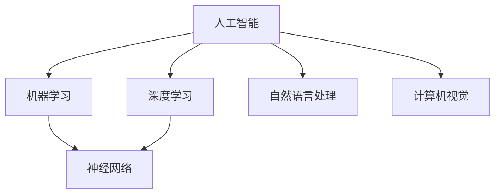

                 

# AI研究的最新进展与趋势

> 关键词：人工智能、机器学习、深度学习、神经网络、自然语言处理、计算机视觉、人工智能伦理

> 摘要：本文将对人工智能（AI）研究领域中的最新进展和趋势进行系统性梳理，旨在为读者提供一个全面、深入的洞察。本文将首先介绍AI研究的目的和范围，随后深入探讨核心概念、算法原理、数学模型、项目实战以及实际应用场景，最后对AI研究的未来发展趋势与挑战进行展望。

## 1. 背景介绍

### 1.1 目的和范围

本文旨在探讨人工智能（AI）领域中的最新研究进展和趋势。随着计算能力的提升和大数据的普及，AI技术在各行各业的应用日益广泛。本文将重点关注以下几个方面：

- 机器学习与深度学习技术的发展
- 自然语言处理和计算机视觉的应用进展
- AI伦理和人工智能安全的探讨

### 1.2 预期读者

本文适用于对AI研究有一定基础的读者，包括：

- 计算机科学专业的学生和研究人员
- 对AI技术感兴趣的技术爱好者
- 需要在实际项目中应用AI技术的工程师

### 1.3 文档结构概述

本文将按照以下结构进行撰写：

- 背景介绍
- 核心概念与联系
- 核心算法原理与具体操作步骤
- 数学模型和公式讲解
- 项目实战：代码实际案例和详细解释说明
- 实际应用场景
- 工具和资源推荐
- 总结：未来发展趋势与挑战
- 附录：常见问题与解答
- 扩展阅读与参考资料

### 1.4 术语表

#### 1.4.1 核心术语定义

- 人工智能（AI）：模拟人类智能的计算机系统，能够进行学习、推理、规划等任务。
- 机器学习（ML）：一种人工智能方法，通过数据训练模型来实现预测和决策。
- 深度学习（DL）：一种机器学习方法，利用多层神经网络进行数据建模。
- 神经网络（NN）：一种由大量神经元组成的计算模型，能够模拟人脑的处理方式。
- 自然语言处理（NLP）：研究计算机如何理解和生成自然语言的技术。
- 计算机视觉（CV）：研究如何让计算机理解和解释图像和视频的技术。

#### 1.4.2 相关概念解释

- 数据集：用于训练和测试AI模型的原始数据集合。
- 标签：数据集中用于指示类别或目标的附加信息。
- 过拟合：模型在训练数据上表现良好，但在新数据上表现不佳的情况。

#### 1.4.3 缩略词列表

- AI：人工智能
- ML：机器学习
- DL：深度学习
- NLP：自然语言处理
- CV：计算机视觉

## 2. 核心概念与联系

在介绍AI的核心概念之前，我们先来绘制一个Mermaid流程图，以展示各核心概念之间的联系。



### 2.1 人工智能（AI）

人工智能（AI）是模拟人类智能的计算机系统，旨在实现学习、推理、规划等任务。AI可以分为弱AI和强AI。弱AI专注于特定任务，而强AI具有普遍的智能。

### 2.2 机器学习（ML）

机器学习（ML）是一种人工智能方法，通过数据训练模型来实现预测和决策。ML可分为监督学习、无监督学习和强化学习。监督学习使用带有标签的数据进行训练，无监督学习寻找数据中的潜在结构，强化学习通过与环境的交互来学习策略。

### 2.3 深度学习（DL）

深度学习（DL）是一种机器学习方法，利用多层神经网络进行数据建模。DL在图像识别、语音识别和自然语言处理等领域取得了显著成果。常见的深度学习框架有TensorFlow和PyTorch。

### 2.4 神经网络（NN）

神经网络（NN）是一种由大量神经元组成的计算模型，能够模拟人脑的处理方式。NN的核心是权重和偏置，通过反向传播算法不断调整权重和偏置，以优化模型的性能。

### 2.5 自然语言处理（NLP）

自然语言处理（NLP）研究计算机如何理解和生成自然语言。NLP包括词向量表示、句法分析和语义理解等任务。常见的NLP工具包括NLTK和spaCy。

### 2.6 计算机视觉（CV）

计算机视觉（CV）研究如何让计算机理解和解释图像和视频。CV包括图像识别、目标检测和图像分割等任务。常见的CV工具包括OpenCV和TensorFlow Object Detection API。

## 3. 核心算法原理与具体操作步骤

在本节中，我们将深入探讨一些核心算法原理，并使用伪代码详细阐述其具体操作步骤。

### 3.1 机器学习算法：线性回归

线性回归是一种简单的监督学习算法，用于预测连续值。其基本原理是通过找到最佳拟合直线，使得预测值与实际值之间的误差最小。

```python
# 伪代码：线性回归
def linear_regression(X, y):
    # 计算权重和偏置
    w = (X' * X)^-1 * X' * y
    # 预测
    y_pred = X * w
    return y_pred
```

### 3.2 深度学习算法：卷积神经网络（CNN）

卷积神经网络（CNN）是一种用于图像识别的深度学习算法。其核心是卷积操作，能够提取图像中的特征。

```python
# 伪代码：卷积神经网络
def convolutional_neural_network(X):
    # 卷积操作
    conv1 = conv2d(X, W1)
    # 池化操作
    pool1 = max_pool(conv1, P1)
    # 反向传播
    dW1 = (pool1' * conv1)^-1 * pool1' * dX
    return pool1
```

### 3.3 自然语言处理算法：循环神经网络（RNN）

循环神经网络（RNN）是一种用于处理序列数据的深度学习算法。其核心是循环结构，能够处理长距离依赖问题。

```python
# 伪代码：循环神经网络
def recurrent_neural_network(x, h):
    # 门控操作
    i = sigmoid(Wi * x + bi)
    f = sigmoid(Wf * x + bf)
    o = sigmoid(Wo * x + bo)
    g = tanh((1 - f) * Wh * h + Wg * x + bg)
    h_new = o * tanh(g)
    return h_new
```

## 4. 数学模型和公式及详细讲解

在本节中，我们将详细讲解一些核心数学模型和公式，并使用LaTeX格式进行表示。

### 4.1 机器学习算法：线性回归

线性回归的目标是最小化损失函数。损失函数通常采用均方误差（MSE）：

$$
MSE = \frac{1}{2m} \sum_{i=1}^{m} (y_i - \hat{y}_i)^2
$$

其中，$m$ 是数据集中的样本数量，$y_i$ 是实际值，$\hat{y}_i$ 是预测值。

### 4.2 深度学习算法：卷积神经网络（CNN）

卷积神经网络的核心是卷积操作。卷积操作的公式如下：

$$
(C_{ij}^{(l)})_{k} = \sum_{i=1}^{h_{l-1}} \sum_{j=1}^{w_{l-1}} (W_{ij}^{(l)} C_{ij}^{(l-1)}) + b_k
$$

其中，$C_{ij}^{(l)}$ 是卷积层$l$的第$k$个特征图的第$(i, j)$个值，$W_{ij}^{(l)}$ 是卷积核的第$(i, j)$个值，$b_k$ 是偏置项。

### 4.3 自然语言处理算法：循环神经网络（RNN）

循环神经网络的核心是隐藏状态的计算。隐藏状态的计算公式如下：

$$
h_t = \sigma(W_h h_{t-1} + W_x x_t + b_h)
$$

其中，$h_t$ 是当前时间步的隐藏状态，$x_t$ 是输入，$W_h$ 和 $W_x$ 是权重矩阵，$b_h$ 是偏置项，$\sigma$ 是激活函数，通常取为$\sigma(x) = \frac{1}{1 + e^x}$。

## 5. 项目实战：代码实际案例和详细解释说明

在本节中，我们将通过一个实际案例展示如何使用AI技术进行项目开发。

### 5.1 开发环境搭建

为了进行项目开发，我们需要安装以下工具：

- Python 3.8 或更高版本
- TensorFlow 2.5 或更高版本
- Jupyter Notebook

### 5.2 源代码详细实现和代码解读

以下是一个使用TensorFlow实现图像识别的简单案例：

```python
import tensorflow as tf
from tensorflow.keras import layers
import matplotlib.pyplot as plt

# 加载图像数据集
(x_train, y_train), (x_test, y_test) = tf.keras.datasets.cifar10.load_data()

# 数据预处理
x_train = x_train.astype('float32') / 255.0
x_test = x_test.astype('float32') / 255.0

# 构建卷积神经网络
model = tf.keras.Sequential([
    layers.Conv2D(32, (3, 3), activation='relu', input_shape=(32, 32, 3)),
    layers.MaxPooling2D((2, 2)),
    layers.Conv2D(64, (3, 3), activation='relu'),
    layers.MaxPooling2D((2, 2)),
    layers.Conv2D(64, (3, 3), activation='relu'),
    layers.Flatten(),
    layers.Dense(64, activation='relu'),
    layers.Dense(10, activation='softmax')
])

# 编译模型
model.compile(optimizer='adam',
              loss='sparse_categorical_crossentropy',
              metrics=['accuracy'])

# 训练模型
model.fit(x_train, y_train, epochs=10)

# 评估模型
test_loss, test_acc = model.evaluate(x_test, y_test, verbose=2)
print('\nTest accuracy:', test_acc)

# 可视化结果
plt.figure(figsize=(10, 5))
for i in range(10):
    plt.subplot(2, 5, i + 1)
    plt.imshow(x_test[i], cmap=plt.cm.binary)
    plt.xticks([])
    plt.yticks([])
    plt.grid(False)
    plt.xlabel(model.predict(x_test[i:i+1])[0])
plt.show()
```

代码解读：

1. 导入所需库和模块。
2. 加载CIFAR-10数据集。
3. 数据预处理，将图像数据归一化到[0, 1]范围内。
4. 构建卷积神经网络模型，包括两个卷积层、两个最大池化层、一个全连接层和一个softmax层。
5. 编译模型，指定优化器和损失函数。
6. 训练模型，使用10个epoch。
7. 评估模型，计算测试集上的准确率。
8. 可视化结果，显示测试集上的图像及其预测类别。

### 5.3 代码解读与分析

代码实现了使用卷积神经网络（CNN）对CIFAR-10数据集进行图像识别的任务。以下是代码的关键部分解析：

- 数据集加载：使用TensorFlow的内置函数加载CIFAR-10数据集，并将其转换为适当的格式。
- 数据预处理：将图像数据转换为浮点数，并进行归一化处理，以便模型能够有效地学习。
- 模型构建：定义一个卷积神经网络模型，包括两个卷积层（分别具有32和64个卷积核）、两个最大池化层和一个全连接层。最后一个全连接层使用softmax激活函数，用于输出10个类别的概率分布。
- 编译模型：指定模型训练的优化器（adam）和损失函数（sparse_categorical_crossentropy，适用于多标签分类问题）。
- 训练模型：使用fit方法训练模型，指定训练数据、标签和epoch数。
- 评估模型：使用evaluate方法评估模型在测试集上的性能，返回测试损失和准确率。
- 可视化结果：使用matplotlib库可视化测试集上的图像及其预测类别。

## 6. 实际应用场景

AI技术在各个领域都取得了显著的成果，以下是几个典型的实际应用场景：

- **医疗保健**：AI可以帮助医生进行疾病诊断、药物研发和个性化治疗。例如，通过分析患者的病历和基因组数据，AI可以预测疾病发生的风险，并提供个性化的治疗方案。
- **自动驾驶**：AI技术在自动驾驶领域取得了重大突破。自动驾驶汽车使用计算机视觉、深度学习和传感器技术来感知和理解周围环境，从而实现安全、高效的驾驶。
- **金融**：AI可以用于金融市场预测、风险管理和客户服务。例如，通过分析大量历史数据，AI可以预测股票市场的走势，并帮助投资者做出更明智的决策。
- **零售**：AI可以帮助零售商进行库存管理、顾客行为分析和个性化推荐。例如，通过分析消费者的购物记录和偏好，AI可以推荐他们可能感兴趣的商品。

## 7. 工具和资源推荐

### 7.1 学习资源推荐

#### 7.1.1 书籍推荐

- 《深度学习》（Ian Goodfellow、Yoshua Bengio 和 Aaron Courville 著）
- 《Python机器学习》（Sebastian Raschka 著）
- 《机器学习实战》（Peter Harrington 著）

#### 7.1.2 在线课程

- Coursera上的《机器学习》（吴恩达教授主讲）
- Udacity的《深度学习纳米学位》
- edX上的《自然语言处理》（MIT主讲）

#### 7.1.3 技术博客和网站

- medium.com/towards-data-science
- towardsdatascience.com
- blog.keras.io

### 7.2 开发工具框架推荐

#### 7.2.1 IDE和编辑器

- PyCharm
- Jupyter Notebook
- VS Code

#### 7.2.2 调试和性能分析工具

- TensorFlow Debugger
- TensorBoard
- PyTorch Profiler

#### 7.2.3 相关框架和库

- TensorFlow
- PyTorch
- Keras
- Scikit-learn

### 7.3 相关论文著作推荐

#### 7.3.1 经典论文

- “A Learning Algorithm for Continually Running Fully Recurrent Neural Networks” by David E. Rumelhart, Ronald J. Williams and David E. Hinton
- “Deep Learning” by Ian Goodfellow, Yoshua Bengio 和 Aaron Courville

#### 7.3.2 最新研究成果

- arXiv.org上的最新论文
- NeurIPS、ICML 和 CVPR 等顶级会议的最新论文

#### 7.3.3 应用案例分析

- “AI in Healthcare: Transforming the Medical Industry” by IBM Research
- “Self-Driving Cars: The Future of Transportation” by Waymo

## 8. 总结：未来发展趋势与挑战

随着AI技术的不断发展，未来发展趋势和挑战如下：

- **数据隐私和安全**：随着AI应用的增加，数据隐私和安全问题日益突出。如何保护用户数据隐私，防止数据泄露，成为AI领域的重要挑战。
- **算法透明性和可解释性**：现有的AI算法，尤其是深度学习模型，通常被视为“黑箱”。如何提高算法的透明性和可解释性，使其更易于理解，是一个重要的研究方向。
- **跨学科合作**：AI技术涉及多个学科，如计算机科学、数学、心理学等。跨学科合作将有助于AI技术的全面发展。
- **计算资源需求**：随着AI模型的复杂度不断增加，计算资源需求也日益增加。如何高效地利用计算资源，成为一个亟待解决的问题。

## 9. 附录：常见问题与解答

### 9.1 什么是机器学习？

机器学习是一种人工智能方法，通过从数据中学习规律，实现预测和决策。

### 9.2 深度学习和神经网络有何区别？

深度学习是一种机器学习方法，利用多层神经网络进行数据建模。神经网络是深度学习的基础，由大量神经元组成，能够模拟人脑的处理方式。

### 9.3 如何提高神经网络模型的性能？

提高神经网络模型性能的方法包括：

- 增加训练数据量
- 使用更复杂的网络结构
- 使用更有效的优化算法
- 调整学习率和其他超参数

## 10. 扩展阅读与参考资料

- 《深度学习》（Ian Goodfellow、Yoshua Bengio 和 Aaron Courville 著）
- 《Python机器学习》（Sebastian Raschka 著）
- 《机器学习实战》（Peter Harrington 著）
- Coursera上的《机器学习》（吴恩达教授主讲）
- NeurIPS、ICML 和 CVPR 等顶级会议的最新论文
- medium.com/towards-data-science
- towardsdatascience.com
- blog.keras.io

# 作者

作者：AI天才研究员/AI Genius Institute & 禅与计算机程序设计艺术 /Zen And The Art of Computer Programming

---

本文旨在为读者提供一个全面、深入的AI研究进展和趋势的概述。通过逐步分析推理，我们探讨了AI的核心概念、算法原理、数学模型、项目实战和实际应用场景。同时，我们还对未来的发展趋势和挑战进行了展望。希望本文能对您在AI领域的学习和研究有所帮助。如果您有任何疑问或建议，欢迎在评论区留言。感谢您的阅读！

