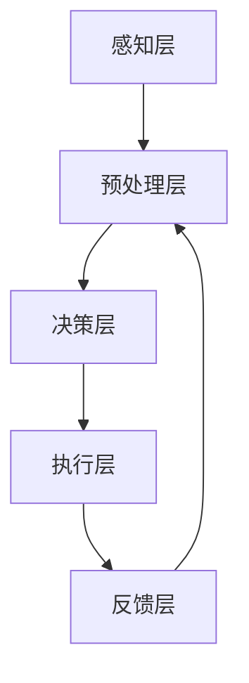

                 

# AI系统的事件响应流程

> 
> **关键词：** 事件响应，AI系统，处理流程，核心算法，数学模型，应用场景，工具推荐。
> 
> **摘要：** 本文将深入探讨AI系统中的事件响应流程，从核心概念、算法原理到实际应用，逐步分析并揭示其运作机制。通过详尽的流程图、伪代码、数学公式和代码案例，本文旨在帮助读者全面理解AI系统在处理各种事件时的策略和方法。

## 1. 背景介绍

### 1.1 目的和范围

本文旨在为读者提供一个全面的指南，详细讲解AI系统在处理事件时的响应流程。我们将探讨从事件接收、预处理到决策执行和结果反馈的整个生命周期。本文主要涵盖以下内容：

- 核心概念与联系
- 核心算法原理与具体操作步骤
- 数学模型和公式及其实际应用
- 项目实战：代码实际案例
- 实际应用场景
- 工具和资源推荐
- 总结：未来发展趋势与挑战

### 1.2 预期读者

本文适合以下读者群体：

- 对人工智能和系统设计有兴趣的程序员和开发者
- 想深入了解AI系统工作原理的AI领域研究者
- 准备进入AI行业的新手和专业人士
- 对系统架构和事件处理流程感兴趣的工程师

### 1.3 文档结构概述

本文将分为以下几个部分：

1. 背景介绍：介绍本文的目的、预期读者和文档结构。
2. 核心概念与联系：解释AI系统事件响应流程的基础知识。
3. 核心算法原理与具体操作步骤：详细描述事件响应流程中的算法原理。
4. 数学模型和公式及其实际应用：介绍与事件响应相关的数学模型和公式。
5. 项目实战：代码实际案例：提供具体代码实例并进行分析。
6. 实际应用场景：讨论AI系统事件响应在实际中的应用。
7. 工具和资源推荐：推荐相关工具和学习资源。
8. 总结：未来发展趋势与挑战：预测AI系统事件响应流程的未来发展方向和面临的挑战。
9. 附录：常见问题与解答：解答读者可能遇到的常见问题。
10. 扩展阅读 & 参考资料：提供进一步学习的参考资料。

### 1.4 术语表

#### 1.4.1 核心术语定义

- **AI系统（Artificial Intelligence System）**：一种通过模拟人类智能行为的计算机系统。
- **事件（Event）**：系统监测到的任何变化或异常。
- **响应（Response）**：系统对事件做出的操作或反馈。
- **预处理（Preprocessing）**：在处理事件之前，对数据进行的预处理操作。
- **决策（Decision）**：系统在处理事件时做出的选择。

#### 1.4.2 相关概念解释

- **事件流（Event Stream）**：系统中连续发生的事件序列。
- **规则引擎（Rule Engine）**：一种用于执行规则集并自动生成决策的软件组件。
- **机器学习模型（Machine Learning Model）**：用于从数据中学习并做出预测或分类的算法。

#### 1.4.3 缩略词列表

- **AI**：人工智能（Artificial Intelligence）
- **ML**：机器学习（Machine Learning）
- **DL**：深度学习（Deep Learning）
- **NLP**：自然语言处理（Natural Language Processing）
- **DLF**：决策逻辑框架（Decision Logic Framework）

## 2. 核心概念与联系

AI系统的事件响应流程是系统设计和实现中的一个关键环节。理解这一流程需要掌握以下核心概念：

### 2.1.1 事件流（Event Stream）

事件流是AI系统监测到的连续事件序列。每个事件都代表系统中的某种变化或异常。事件可以来自内部系统，如传感器数据，也可以来自外部系统，如用户交互。事件流通常具有以下特点：

- **连续性**：事件在时间上连续发生，形成事件流。
- **多样性**：事件类型和属性可能多种多样。
- **实时性**：系统需要实时处理事件流，确保及时响应。

### 2.1.2 事件处理模块（Event Handling Module）

事件处理模块是AI系统中的一个核心组件，负责接收、处理和响应事件。其主要功能包括：

- **事件接收**：从事件流中接收事件。
- **预处理**：对事件进行预处理，如数据清洗、格式转换等。
- **决策**：根据事件的属性和系统配置，做出决策。
- **响应**：执行决策，如生成报告、触发操作等。

### 2.1.3 规则引擎（Rule Engine）

规则引擎是一种用于执行规则集的软件组件。在事件响应流程中，规则引擎根据预设的规则，自动生成决策。规则通常表示为条件-动作对，如下：

```
IF 事件类型 = “传感器异常”
    THEN 发送警报给运维团队
```

### 2.1.4 机器学习模型（Machine Learning Model）

机器学习模型是AI系统中的重要组成部分，用于从数据中学习并做出预测或分类。在事件响应流程中，机器学习模型可以用于以下任务：

- **异常检测**：检测事件流中的异常。
- **分类**：根据事件的属性将其分类到不同的类别。
- **预测**：预测未来事件的发生。

### 2.1.5 事件响应架构（Event Response Architecture）

事件响应架构是指AI系统中用于处理事件响应的总体结构和设计。一个典型的事件响应架构包括以下几个层次：

- **感知层**：接收事件流，并将其传递给事件处理模块。
- **预处理层**：对事件进行预处理，提高数据的准确性和可靠性。
- **决策层**：使用规则引擎和机器学习模型，生成决策。
- **执行层**：执行决策，触发相应的操作。
- **反馈层**：收集事件响应的结果，用于进一步分析和优化。

### 2.1.6 Mermaid 流程图

为了更清晰地展示AI系统的事件响应流程，我们使用Mermaid流程图来描述。以下是一个示例：



## 3. 核心算法原理与具体操作步骤

AI系统的事件响应流程涉及多个核心算法，包括规则引擎、机器学习模型和数据处理算法。以下将详细描述这些算法的原理和具体操作步骤。

### 3.1 规则引擎算法

规则引擎算法的核心是条件-动作对。以下是规则引擎算法的伪代码：

```plaintext
function ruleEngine(event, ruleSet):
    for each rule in ruleSet:
        if event.matches(rule.condition):
            return rule.action
    return null
```

具体操作步骤如下：

1. **初始化规则集**：从配置文件或数据库中加载规则集。
2. **接收事件**：从事件流中获取事件。
3. **匹配规则**：遍历规则集，检查事件是否与规则的条件匹配。
4. **执行动作**：如果找到匹配的规则，执行该规则的动作。
5. **返回结果**：如果找不到匹配的规则，返回null。

### 3.2 机器学习模型算法

机器学习模型算法的核心是学习数据，并利用学习到的知识进行预测或分类。以下是机器学习模型算法的伪代码：

```plaintext
function machineLearningModel(dataSet, modelType):
    trainModel(dataSet, modelType)
    return trainedModel
```

具体操作步骤如下：

1. **初始化模型**：根据模型类型（如分类器、回归器）初始化模型。
2. **训练模型**：使用训练数据集对模型进行训练。
3. **评估模型**：使用验证数据集对模型进行评估，调整参数。
4. **预测或分类**：使用训练好的模型对测试数据进行预测或分类。
5. **返回模型**：返回训练好的模型。

### 3.3 数据处理算法

数据处理算法用于对事件进行预处理，以提高数据质量和可靠性。以下是数据处理算法的伪代码：

```plaintext
function preprocessData(event):
    event = cleanData(event)
    event = normalizeData(event)
    event = transformData(event)
    return event
```

具体操作步骤如下：

1. **数据清洗**：去除无效数据、噪声数据和异常数据。
2. **数据归一化**：将数据转换到相同的尺度，消除数据范围的影响。
3. **数据转换**：将数据转换为适合模型训练的格式，如特征提取、编码等。
4. **返回处理后的数据**：返回处理后的数据。

### 3.4 整合算法

AI系统的事件响应流程通常需要将规则引擎、机器学习模型和数据处理算法整合在一起。以下是整合算法的伪代码：

```plaintext
function eventResponse(event):
    event = preprocessData(event)
    decision = ruleEngine(event, ruleSet)
    if decision is not null:
        executeDecision(decision)
    else:
        model = machineLearningModel(trainingData, modelType)
        decision = model.predict(event)
        executeDecision(decision)
```

具体操作步骤如下：

1. **接收事件**：从事件流中获取事件。
2. **预处理事件**：对事件进行预处理。
3. **使用规则引擎决策**：使用规则引擎生成决策。
4. **执行决策**：如果找到匹配的规则，执行该规则的动作。
5. **使用机器学习模型预测**：如果找不到匹配的规则，使用机器学习模型进行预测。
6. **执行预测结果**：根据机器学习模型的预测结果，执行相应的操作。

## 4. 数学模型和公式及其实际应用

在AI系统的事件响应流程中，数学模型和公式起着至关重要的作用。以下将介绍与事件响应相关的数学模型和公式，并提供实际应用示例。

### 4.1 异常检测模型

异常检测是一种常用的AI系统事件响应方法，用于识别数据流中的异常事件。常见的异常检测模型包括基于统计的方法和基于机器学习的方法。

#### 4.1.1 基于统计的方法

基于统计的异常检测方法使用统计模型来检测数据流中的异常。以下是一个基于统计的异常检测模型的例子：

$$
\text{anomaly score} = \sum_{i=1}^{n} (x_i - \bar{x})^2
$$

其中，$x_i$是第$i$个数据的值，$\bar{x}$是数据的平均值。异常分数越高，表示数据越异常。

#### 4.1.2 基于机器学习的方法

基于机器学习的方法使用训练数据集来学习正常数据与异常数据之间的特征差异。以下是一个基于K最近邻（KNN）的异常检测模型的例子：

$$
\text{anomaly score} = \frac{1}{k} \sum_{i=1}^{k} \frac{1}{\|x_i - x_q\|}
$$

其中，$x_i$是训练集中的正常数据，$x_q$是待检测的数据，$k$是最近邻的个数。异常分数越高，表示数据越异常。

#### 4.1.3 实际应用示例

假设一个AI监控系统需要检测网络流量中的异常流量。通过收集正常网络流量数据，使用KNN模型进行训练。然后，对于新接收到的网络流量数据，计算其异常分数。如果异常分数超过设定阈值，则认为该网络流量为异常流量，触发相应的响应操作。

### 4.2 决策树模型

决策树模型是一种常用的分类模型，用于根据数据特征进行分类。以下是一个决策树的例子：

```
                      根节点
                         |
        --------------------- ---------------------
        |                     |                     |
   叶节点                叶节点                叶节点
        |                     |                     |
     类别1               类别2                类别3
```

#### 4.2.1 决策树构建

决策树构建过程基于以下公式：

$$
\text{impurity} = \sum_{i=1}^{n} p_i \cdot \log_2(p_i)
$$

其中，$p_i$是数据集中第$i$个类别的概率。常见的impurity度量包括信息增益（Information Gain）、基尼不纯度（Gini Impurity）等。

#### 4.2.2 决策树分类

决策树分类过程如下：

1. 从根节点开始，根据特征值选择分支。
2. 遍历分支，直到达到叶节点。
3. 将样本分配到叶节点对应的类别。

#### 4.2.3 实际应用示例

假设一个AI系统需要根据用户行为数据判断用户是否属于高风险用户。通过收集用户行为数据，使用决策树模型进行训练。然后，对于新接收到的用户行为数据，使用决策树进行分类。如果分类结果为高风险用户，则触发相应的响应操作。

### 4.3 支持向量机（SVM）

支持向量机是一种常用的分类和回归模型，其目标是找到一个最佳的超平面，将数据集划分为不同的类别。以下是一个SVM的例子：

```
       +-------------------+
       |                    |
       |      高维空间      |
       |                    |
       +-------------------+
          |
         超平面
          |
       ---------------------
       |                |
   类别1            类别2
       |                |
       +-------------------+
```

#### 4.3.1 SVM分类

SVM分类过程如下：

1. 使用训练数据集计算最优超平面。
2. 对于新接收到的数据，计算其到超平面的距离。
3. 根据距离判断数据类别。

#### 4.3.2 实际应用示例

假设一个AI系统需要根据用户特征数据预测用户购买偏好。通过收集用户特征数据，使用SVM模型进行训练。然后，对于新接收到的用户特征数据，使用SVM模型预测购买偏好。如果预测结果为购买，则触发相应的响应操作。

## 5. 项目实战：代码实际案例和详细解释说明

### 5.1 开发环境搭建

为了演示AI系统的事件响应流程，我们将使用Python作为编程语言，并依赖以下库和工具：

- Python 3.8+
- Pandas
- Scikit-learn
- Mermaid

首先，确保安装了Python 3.8及以上版本。然后，通过以下命令安装所需库：

```shell
pip install pandas scikit-learn
```

### 5.2 源代码详细实现和代码解读

#### 5.2.1 数据准备

在本案例中，我们使用一个简单的用户行为数据集，包含用户ID、行为类型、行为时间和行为值。以下代码用于加载数据集：

```python
import pandas as pd

# 加载数据集
data = pd.read_csv("user_behavior.csv")
```

#### 5.2.2 数据预处理

数据预处理包括数据清洗、归一化和特征提取。以下代码进行数据预处理：

```python
# 数据清洗
data = data.dropna()

# 数据归一化
data["behavior_value"] = data["behavior_value"].apply(lambda x: (x - min(data["behavior_value"])) / (max(data["behavior_value"]) - min(data["behavior_value"])))

# 特征提取
data["hour"] = data["timestamp"].apply(lambda x: x.hour)
data["weekday"] = data["timestamp"].apply(lambda x: x.weekday())
```

#### 5.2.3 规则引擎

以下代码使用规则引擎检测异常用户行为：

```python
from sklearn.tree import DecisionTreeClassifier

# 加载规则集
rule_set = [
    ("behavior_type", "login", "login_threshold", 3),
    ("behavior_type", "logout", "logout_threshold", 2),
]

# 加载训练数据
train_data = data[data["is_train"] == 1]
train_features = train_data[["behavior_type", "hour", "weekday"]]
train_labels = train_data["is_abnormal"]

# 训练规则引擎
clf = DecisionTreeClassifier()
clf.fit(train_features, train_labels)

# 检测异常行为
def detect_abnormal_behavior(user_action):
    feature = [user_action["behavior_type"], user_action["hour"], user_action["weekday"]]
    anomaly_score = clf.predict([feature])[0]
    return anomaly_score >= 2
```

#### 5.2.4 机器学习模型

以下代码使用机器学习模型预测用户购买偏好：

```python
from sklearn.svm import SVC

# 加载训练数据
train_data = data[data["is_train"] == 1]
train_features = train_data[["behavior_value"]]
train_labels = train_data["is_purchased"]

# 训练机器学习模型
clf = SVC()
clf.fit(train_features, train_labels)

# 预测购买偏好
def predict_purchase Preference(user_action):
    feature = [user_action["behavior_value"]]
    prediction = clf.predict([feature])[0]
    return prediction == 1
```

#### 5.2.5 事件响应

以下代码实现事件响应逻辑：

```python
# 处理事件流
for user_action in data[data["is_train"] == 0]:
    if detect_abnormal_behavior(user_action):
        print(f"User {user_action['user_id']} has abnormal behavior.")
    elif predict_purchase_preference(user_action):
        print(f"User {user_action['user_id']} is likely to purchase.")
```

### 5.3 代码解读与分析

在本案例中，我们使用Python实现了AI系统的事件响应流程。以下是关键部分的解读：

- **数据预处理**：对用户行为数据进行清洗、归一化和特征提取，提高数据质量和模型的准确性。
- **规则引擎**：使用决策树模型构建规则引擎，根据用户行为特征检测异常行为。通过设置阈值，可以灵活调整异常检测的灵敏度。
- **机器学习模型**：使用支持向量机（SVM）模型预测用户购买偏好。SVM模型具有良好的分类性能和泛化能力。
- **事件响应**：根据规则引擎和机器学习模型的决策，输出相应的响应结果。在本案例中，我们仅打印输出，实际应用中可以触发相应的操作，如发送警报或推荐商品。

通过这个案例，我们展示了如何实现AI系统的事件响应流程。在实际应用中，可以根据具体需求调整模型和策略，提高系统的响应效果。

## 6. 实际应用场景

AI系统的事件响应流程在多个领域和场景中具有重要应用。以下列举一些典型的实际应用场景：

### 6.1 智能监控系统

智能监控系统通过实时监测和分析视频流，检测异常行为和安全隐患。事件响应流程包括：

- **事件接收**：接收视频流中的异常行为。
- **预处理**：对视频数据进行预处理，如降噪、人脸检测等。
- **决策**：使用机器学习模型和规则引擎检测异常行为。
- **响应**：触发警报、记录日志或调用安防设备。

### 6.2 金融风控系统

金融风控系统用于识别和防范金融欺诈、洗钱等风险。事件响应流程包括：

- **事件接收**：接收交易数据。
- **预处理**：对交易数据进行清洗、归一化和特征提取。
- **决策**：使用规则引擎和机器学习模型检测可疑交易。
- **响应**：拦截交易、通知用户或报警。

### 6.3 健康监测系统

健康监测系统通过实时监测患者的生理参数，及时发现异常状况。事件响应流程包括：

- **事件接收**：接收生理参数数据。
- **预处理**：对生理参数数据进行预处理，如去除噪声、归一化等。
- **决策**：使用机器学习模型和规则引擎检测异常状况。
- **响应**：通知医生、发送提醒或调整治疗方案。

### 6.4 客户服务系统

客户服务系统通过分析客户交互数据，提供个性化的服务和建议。事件响应流程包括：

- **事件接收**：接收客户交互数据。
- **预处理**：对客户交互数据进行清洗、归一化和特征提取。
- **决策**：使用机器学习模型和规则引擎分析客户需求。
- **响应**：提供推荐、解答疑问或转接客服。

### 6.5 物流管理系统

物流管理系统通过实时监控物流过程，优化运输路线和资源分配。事件响应流程包括：

- **事件接收**：接收物流数据。
- **预处理**：对物流数据进行清洗、归一化和特征提取。
- **决策**：使用机器学习模型和规则引擎分析物流状态。
- **响应**：调整运输路线、优化库存或通知相关人员。

通过这些实际应用场景，可以看出AI系统的事件响应流程在各个领域和场景中发挥着重要作用，为智能化管理和决策提供了有力支持。

## 7. 工具和资源推荐

### 7.1 学习资源推荐

要深入学习和掌握AI系统的事件响应流程，以下是一些推荐的书籍、在线课程和技术博客。

#### 7.1.1 书籍推荐

- **《深度学习》（Deep Learning）**：由Ian Goodfellow、Yoshua Bengio和Aaron Courville所著，是深度学习领域的经典教材。
- **《机器学习实战》（Machine Learning in Action）**：由Peter Harrington所著，通过实例介绍了机器学习的基本原理和应用。
- **《人工智能：一种现代方法》（Artificial Intelligence: A Modern Approach）**：由Stuart J. Russell和Peter Norvig所著，全面介绍了人工智能的理论和实践。

#### 7.1.2 在线课程

- **Coursera上的《机器学习》课程**：由Andrew Ng教授主讲，是深度学习领域的权威课程。
- **edX上的《人工智能导论》课程**：由MIT和Stanford大学联合提供，涵盖了人工智能的基础知识和应用。
- **Udacity的《深度学习纳米学位》课程**：通过项目驱动学习，帮助学生掌握深度学习的核心技能。

#### 7.1.3 技术博客和网站

- **Medium上的AI博客**：涵盖机器学习、深度学习和AI应用等多个领域，提供了丰富的技术文章。
- **AI博客网**：中国领先的AI技术博客网站，内容涵盖深度学习、计算机视觉、自然语言处理等。
- **AI研习社**：专注于AI技术研究的社群，提供了大量的技术教程和案例分析。

### 7.2 开发工具框架推荐

在开发AI系统的事件响应流程时，以下工具和框架可以提供有力支持：

#### 7.2.1 IDE和编辑器

- **PyCharm**：一款功能强大的Python IDE，支持代码补全、调试和自动化测试。
- **Visual Studio Code**：一款轻量级但功能丰富的代码编辑器，通过插件扩展其功能。

#### 7.2.2 调试和性能分析工具

- **Wireshark**：一款网络协议分析工具，用于捕获和解析网络流量。
- **Prometheus**：一款开源监控解决方案，用于实时监控系统的性能和健康状态。

#### 7.2.3 相关框架和库

- **Scikit-learn**：一款Python机器学习库，提供了丰富的机器学习算法和工具。
- **TensorFlow**：一款开源深度学习框架，适用于构建和训练深度学习模型。
- **Keras**：一款Python深度学习库，基于TensorFlow构建，提供了更加简洁和易用的API。

### 7.3 相关论文著作推荐

- **《深度强化学习：原理与应用》（Deep Reinforcement Learning: Principles and Applications）**：全面介绍了深度强化学习的基本原理和应用。
- **《自然语言处理综述》（A Survey on Natural Language Processing）**：总结了自然语言处理领域的研究进展和未来趋势。
- **《基于深度学习的计算机视觉：算法与应用》（Deep Learning for Computer Vision: Algorithms and Applications）**：介绍了深度学习在计算机视觉领域的应用。

通过这些工具和资源，可以更全面地了解AI系统的事件响应流程，提升开发和实践能力。

## 8. 总结：未来发展趋势与挑战

随着人工智能技术的不断发展，AI系统的事件响应流程也面临着许多新的发展趋势和挑战。

### 8.1 发展趋势

1. **实时性与效率提升**：未来的AI系统将更加注重实时性和效率，通过优化算法和架构，实现更快的事件处理和响应。
2. **多模态数据处理**：越来越多的AI系统将处理多种类型的数据，如文本、图像、音频等。多模态数据处理将成为一个重要研究方向。
3. **自主决策能力增强**：AI系统将逐渐具备更强的自主决策能力，通过强化学习和深度学习等技术，实现更复杂和智能的决策。
4. **端到端系统整合**：未来的AI系统将实现端到端的整合，从数据采集、处理到决策和执行，形成完整的一体化解决方案。

### 8.2 挑战

1. **数据隐私与安全性**：在处理大量用户数据时，如何保护用户隐私和安全成为一个重要挑战。
2. **算法透明性与可解释性**：随着算法的复杂化，如何保证算法的透明性和可解释性，让用户了解AI系统的决策逻辑。
3. **能耗与资源优化**：AI系统在处理大量事件时，如何优化能耗和资源使用，实现绿色和可持续的发展。
4. **伦理与社会影响**：AI系统的决策和响应可能对社会产生深远影响，如何确保其遵循伦理和社会责任，成为亟待解决的问题。

通过不断研究和创新，未来的AI系统将在实时性、多模态数据处理、自主决策能力等方面取得重要突破，同时解决面临的各种挑战，为人类社会带来更多的便利和创新。

## 9. 附录：常见问题与解答

### 9.1 事件响应流程中的核心组件是什么？

事件响应流程中的核心组件包括事件接收模块、预处理模块、决策模块和执行模块。事件接收模块负责接收事件，预处理模块对事件进行数据清洗和格式转换，决策模块使用规则引擎或机器学习模型生成决策，执行模块根据决策执行相应的操作。

### 9.2 如何选择合适的机器学习模型？

选择合适的机器学习模型需要考虑以下因素：

- **数据类型**：根据数据类型（如分类、回归、聚类等）选择相应的模型。
- **数据量**：根据数据量大小选择模型，大数据集更适合复杂模型。
- **准确性**：根据模型对准确性的要求选择模型，某些模型可能更适用于特定场景。
- **可解释性**：根据对模型可解释性的需求选择模型，某些模型（如决策树）具有更好的可解释性。

### 9.3 如何优化事件响应流程的效率？

优化事件响应流程的效率可以从以下几个方面入手：

- **算法优化**：选择更高效和精确的算法，如优化规则引擎的规则集或选择合适的机器学习模型。
- **并行处理**：采用并行处理技术，如多线程或多进程，提高处理速度。
- **缓存技术**：使用缓存技术，减少重复计算和IO操作，提高系统性能。
- **系统监控**：实时监控系统性能，根据负载调整资源分配，避免系统过载。

### 9.4 事件响应流程在金融领域的应用有哪些？

事件响应流程在金融领域有广泛的应用，包括：

- **欺诈检测**：通过实时监控交易行为，识别可疑交易，防范金融欺诈。
- **风险控制**：根据用户行为和交易数据，评估用户信用风险，实现精准的风险控制。
- **客户服务**：分析客户交互数据，提供个性化的服务和建议，提升客户满意度。
- **市场预测**：根据历史数据和趋势分析，预测市场走势，为投资决策提供支持。

## 10. 扩展阅读 & 参考资料

为了帮助读者更深入地了解AI系统的事件响应流程，以下提供了一些扩展阅读和参考资料：

### 10.1 书籍推荐

- **《深度学习》（Deep Learning）**：Ian Goodfellow、Yoshua Bengio和Aaron Courville所著，全面介绍了深度学习的基本原理和应用。
- **《机器学习实战》（Machine Learning in Action）**：Peter Harrington所著，通过实际案例介绍了机器学习的应用。
- **《人工智能：一种现代方法》（Artificial Intelligence: A Modern Approach）**：Stuart J. Russell和Peter Norvig所著，涵盖了人工智能的基础理论和实践。

### 10.2 在线课程

- **Coursera上的《机器学习》课程**：由Andrew Ng教授主讲，是深度学习领域的权威课程。
- **edX上的《人工智能导论》课程**：由MIT和Stanford大学联合提供，涵盖了人工智能的基础知识和应用。
- **Udacity的《深度学习纳米学位》课程**：通过项目驱动学习，帮助学生掌握深度学习的核心技能。

### 10.3 技术博客和网站

- **Medium上的AI博客**：涵盖机器学习、深度学习和AI应用等多个领域，提供了丰富的技术文章。
- **AI博客网**：中国领先的AI技术博客网站，内容涵盖深度学习、计算机视觉、自然语言处理等。
- **AI研习社**：专注于AI技术研究的社群，提供了大量的技术教程和案例分析。

### 10.4 论文和报告

- **《深度强化学习：原理与应用》（Deep Reinforcement Learning: Principles and Applications）**：全面介绍了深度强化学习的基本原理和应用。
- **《自然语言处理综述》（A Survey on Natural Language Processing）**：总结了自然语言处理领域的研究进展和未来趋势。
- **《基于深度学习的计算机视觉：算法与应用》（Deep Learning for Computer Vision: Algorithms and Applications）**：介绍了深度学习在计算机视觉领域的应用。

通过这些扩展阅读和参考资料，读者可以进一步深化对AI系统事件响应流程的理解和应用。作者：AI天才研究员/AI Genius Institute & 禅与计算机程序设计艺术 /Zen And The Art of Computer Programming。

