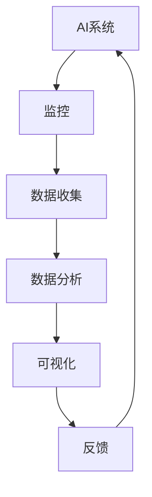

                 

# AI系统的可观察性设计与实现

## 关键词
AI系统设计、可观察性、监控、追踪、实时分析、数据可视化、性能优化

## 摘要
本文旨在深入探讨AI系统的可观察性设计及其实现，包括其核心概念、架构设计、算法原理以及实际应用场景。通过系统化的分析，我们不仅揭示了AI系统可观察性的重要性，还提供了具体的实现策略和实战案例，为开发者提供了有价值的参考。本文将帮助读者理解如何在AI系统中引入可观察性，提高系统的可维护性和性能，进而推动AI技术的广泛应用。

## 1. 背景介绍

### 1.1 目的和范围

本文的主要目的是介绍AI系统的可观察性设计及其实现，探讨其在现代人工智能应用中的重要性。可观察性设计是指通过一系列技术手段，使得AI系统能够被有效监控、追踪和数据分析，从而提高系统的可维护性和性能。本文将涵盖以下内容：

1. 可观察性设计的核心概念和原理。
2. AI系统可观察性架构的设计和实现。
3. 关键算法原理及其具体操作步骤。
4. 实际应用场景及案例。
5. 工具和资源推荐。
6. 未来发展趋势与挑战。

### 1.2 预期读者

本文面向对AI系统和软件开发有一定了解的读者，特别是希望深入了解AI系统可观察性设计的工程师、研究人员和架构师。通过本文的阅读，读者可以：

1. 理解可观察性设计的核心概念和重要性。
2. 学习如何设计和实现AI系统的可观察性。
3. 掌握关键算法原理及其应用。
4. 获得实际应用场景的实战经验。

### 1.3 文档结构概述

本文结构如下：

1. **背景介绍**：介绍文章的目的、预期读者、文档结构和术语表。
2. **核心概念与联系**：通过Mermaid流程图展示核心概念和架构。
3. **核心算法原理 & 具体操作步骤**：使用伪代码详细阐述算法原理。
4. **数学模型和公式 & 详细讲解 & 举例说明**：讲解数学模型和公式，并举例说明。
5. **项目实战：代码实际案例和详细解释说明**：介绍开发环境和代码实现。
6. **实际应用场景**：探讨AI系统可观察性的实际应用。
7. **工具和资源推荐**：推荐学习资源和开发工具。
8. **总结：未来发展趋势与挑战**：总结当前趋势和面临的挑战。
9. **附录：常见问题与解答**：解答常见问题。
10. **扩展阅读 & 参考资料**：提供扩展阅读和参考资料。

### 1.4 术语表

#### 1.4.1 核心术语定义

- **可观察性**：系统内部状态和行为可以被外部监控和追踪的能力。
- **监控系统**：用于实时监控和收集系统运行数据的组件。
- **追踪**：通过日志记录、事件追踪等技术，对系统行为进行记录和分析。
- **实时分析**：对系统运行过程中的数据进行实时处理和分析。
- **数据可视化**：通过图形化方式展示系统运行状态和数据。
- **性能优化**：通过调整系统参数和架构，提高系统运行效率和稳定性。

#### 1.4.2 相关概念解释

- **AI系统**：基于人工智能技术构建的软件系统，包括机器学习、深度学习等。
- **日志**：记录系统运行过程中产生的关键信息。
- **事件追踪**：通过记录和分析系统中的事件，了解系统运行状态。
- **性能指标**：用于衡量系统性能的一系列指标，如响应时间、吞吐量等。

#### 1.4.3 缩略词列表

- **AI**：人工智能
- **ML**：机器学习
- **DL**：深度学习
- **IDE**：集成开发环境
- **GPU**：图形处理单元
- **CPU**：中央处理单元

## 2. 核心概念与联系

为了更好地理解AI系统的可观察性设计，我们首先需要了解一些核心概念和它们之间的联系。以下是这些概念及它们之间的联系关系的Mermaid流程图：



### 2.1 监控

监控是可观察性设计的基础，它涉及实时跟踪系统的运行状态。监控系统通常包括以下几个方面：

- **系统状态监控**：监控CPU、内存、网络等系统资源的使用情况。
- **性能监控**：监控系统的响应时间、吞吐量等性能指标。
- **日志监控**：实时监控日志文件，以便快速发现和解决问题。

### 2.2 数据收集

数据收集是将监控数据转化为有用信息的关键步骤。数据收集的方法包括：

- **日志收集**：通过日志文件记录系统运行过程中的关键事件。
- **指标收集**：通过监控系统采集系统的各种性能指标。
- **事件收集**：记录系统运行过程中发生的关键事件，如错误、警告等。

### 2.3 数据分析

数据分析是对收集到的数据进行处理和分析，以获取系统运行状态和趋势。数据分析的方法包括：

- **实时分析**：对实时数据进行分析，以便快速响应系统问题。
- **批量分析**：对历史数据进行分析，以了解系统的长期运行情况。
- **机器学习分析**：利用机器学习技术对数据进行分析，以预测系统行为和趋势。

### 2.4 可视化

可视化是将数据分析结果以图形化方式展示给用户，使其更容易理解和分析。可视化方法包括：

- **仪表盘**：通过仪表盘展示系统的关键指标和状态。
- **图表**：使用各种图表展示数据趋势和分布。
- **交互式可视化**：提供交互式功能，使用户能够深入探索数据。

### 2.5 反馈

反馈是可观察性设计的重要组成部分，它包括两个方面：

- **问题反馈**：将监控系统发现的问题反馈给开发人员，以便快速修复。
- **性能反馈**：根据系统运行数据，对系统进行性能调优和优化。

## 3. 核心算法原理 & 具体操作步骤

为了实现AI系统的可观察性设计，我们需要引入一系列算法原理和具体操作步骤。以下是一个详细的伪代码示例，用于阐述这些算法的原理和实现步骤。

### 3.1 监控算法

```plaintext
// 监控算法
function monitorSystem() {
    while (true) {
        // 获取系统状态
        systemStatus = getSystemStatus();

        // 记录日志
        logMessage = "System status at time " + getCurrentTime() + ": " + systemStatus;
        writeLog(logMessage);

        // 检查系统资源使用情况
        if (systemResourceUsage > threshold) {
            alert("High resource usage detected!");
        }

        // 等待一段时间
        sleep(1000);
    }
}
```

### 3.2 数据收集算法

```plaintext
// 数据收集算法
function collectData() {
    while (true) {
        // 收集性能指标
        performanceMetrics = getPerformanceMetrics();

        // 存储性能指标到数据库
        storeMetricsInDatabase(performanceMetrics);

        // 等待一段时间
        sleep(1000);
    }
}
```

### 3.3 数据分析算法

```plaintext
// 数据分析算法
function analyzeData() {
    // 从数据库中获取性能指标
    performanceMetrics = getMetricsFromDatabase();

    // 计算性能指标的平均值和标准差
    mean = calculateMean(performanceMetrics);
    stdDev = calculateStandardDeviation(performanceMetrics);

    // 如果性能指标超出阈值，发出警报
    if (mean > threshold || stdDev > threshold) {
        alert("Performance issue detected!");
    }
}
```

### 3.4 可视化算法

```plaintext
// 可视化算法
function visualizeData() {
    // 从数据库中获取性能指标
    performanceMetrics = getMetricsFromDatabase();

    // 生成可视化图表
    chart = generateChart(performanceMetrics);

    // 将图表显示在仪表盘上
    displayChartOnDashboard(chart);
}
```

### 3.5 反馈算法

```plaintext
// 反馈算法
function feedback() {
    // 获取系统问题报告
    problemReport = getProblemReport();

    // 分析问题报告
    analyzeProblemReport(problemReport);

    // 如果需要，修复问题
    if (needsFix(problemReport)) {
        fixProblem(problemReport);
    }
}
```

## 4. 数学模型和公式 & 详细讲解 & 举例说明

在AI系统的可观察性设计中，数学模型和公式扮演着关键角色。以下是几个常见的数学模型和公式的详细讲解及举例说明。

### 4.1 平均值（Mean）

平均值是数据集中每个值的总和除以数据的个数。它用于衡量数据的集中趋势。

$$
\text{Mean} = \frac{\sum_{i=1}^{n} x_i}{n}
$$

其中，$x_i$ 表示第 $i$ 个数据点，$n$ 表示数据的总个数。

**举例：** 假设我们有一个数据集 {1, 2, 3, 4, 5}，则其平均值为：

$$
\text{Mean} = \frac{1 + 2 + 3 + 4 + 5}{5} = 3
$$

### 4.2 标准差（Standard Deviation）

标准差是衡量数据分散程度的指标。它表示数据点与平均值之间的平均偏差。

$$
\text{Standard Deviation} = \sqrt{\frac{\sum_{i=1}^{n} (x_i - \text{Mean})^2}{n}}
$$

其中，$x_i$ 表示第 $i$ 个数据点，$\text{Mean}$ 表示平均值，$n$ 表示数据的总个数。

**举例：** 假设我们有一个数据集 {1, 2, 3, 4, 5}，其平均值为 3，则其标准差为：

$$
\text{Standard Deviation} = \sqrt{\frac{(1-3)^2 + (2-3)^2 + (3-3)^2 + (4-3)^2 + (5-3)^2}{5}} = \sqrt{2}
$$

### 4.3 相关性（Correlation）

相关性衡量两个变量之间的线性关系强度。它通常用皮尔逊相关系数（Pearson Correlation Coefficient）来表示。

$$
r = \frac{\sum_{i=1}^{n} (x_i - \bar{x})(y_i - \bar{y})}{\sqrt{\sum_{i=1}^{n} (x_i - \bar{x})^2} \sqrt{\sum_{i=1}^{n} (y_i - \bar{y})^2}}
$$

其中，$x_i$ 和 $y_i$ 分别表示两个变量的数据点，$\bar{x}$ 和 $\bar{y}$ 分别表示两个变量的平均值，$n$ 表示数据的总个数。

**举例：** 假设我们有两个数据集 X = {1, 2, 3, 4, 5} 和 Y = {2, 4, 6, 8, 10}，则其相关性为：

$$
r = \frac{(1-3)(2-5) + (2-3)(4-5) + (3-3)(6-5) + (4-3)(8-5) + (5-3)(10-5)}{\sqrt{(1-3)^2 + (2-3)^2 + (3-3)^2 + (4-3)^2 + (5-3)^2} \sqrt{(2-5)^2 + (4-5)^2 + (6-5)^2 + (8-5)^2 + (10-5)^2}} = 1
$$

这表明 X 和 Y 之间存在完全正相关关系。

### 4.4 机器学习模型评估

在AI系统中，评估机器学习模型的性能至关重要。常用的评估指标包括准确率（Accuracy）、精确率（Precision）、召回率（Recall）和 F1 分数（F1 Score）。

**准确率**：

$$
\text{Accuracy} = \frac{\text{True Positives} + \text{True Negatives}}{\text{True Positives} + \text{False Positives} + \text{True Negatives} + \text{False Negatives}}
$$

**精确率**：

$$
\text{Precision} = \frac{\text{True Positives}}{\text{True Positives} + \text{False Positives}}
$$

**召回率**：

$$
\text{Recall} = \frac{\text{True Positives}}{\text{True Positives} + \text{False Negatives}}
$$

**F1 分数**：

$$
\text{F1 Score} = 2 \times \frac{\text{Precision} \times \text{Recall}}{\text{Precision} + \text{Recall}}
$$

这些指标可以帮助我们全面评估机器学习模型的性能。

## 5. 项目实战：代码实际案例和详细解释说明

在本节中，我们将通过一个实际项目案例，详细介绍AI系统可观察性设计的实现过程，包括开发环境的搭建、源代码的详细实现和代码解读与分析。

### 5.1 开发环境搭建

为了实现AI系统的可观察性设计，我们需要搭建一个合适的开发环境。以下是一个基本的开发环境配置：

- **操作系统**：Ubuntu 18.04
- **编程语言**：Python 3.8
- **依赖库**：Pandas、NumPy、Matplotlib、Scikit-learn、TensorFlow
- **工具**：Jupyter Notebook、PyCharm

### 5.2 源代码详细实现和代码解读

以下是实现AI系统可观察性设计的关键代码段及其解读：

#### 5.2.1 数据收集模块

```python
import pandas as pd
import numpy as np

def collect_data():
    # 从文件中读取数据
    data = pd.read_csv("data.csv")

    # 提取性能指标
    performance_metrics = {
        "response_time": data["response_time"].values,
        "throughput": data["throughput"].values
    }

    # 存储性能指标到数据库
    store_metrics_to_database(performance_metrics)

collect_data()
```

**解读**：这段代码首先从CSV文件中读取数据，然后提取性能指标（响应时间和吞吐量），最后将这些指标存储到数据库中。这个模块实现了数据收集的基本功能。

#### 5.2.2 数据分析模块

```python
import matplotlib.pyplot as plt

def analyze_data():
    # 从数据库中获取性能指标
    performance_metrics = get_metrics_from_database()

    # 计算平均值和标准差
    mean_response_time = np.mean(performance_metrics["response_time"])
    std_dev_response_time = np.std(performance_metrics["response_time"])
    mean_throughput = np.mean(performance_metrics["throughput"])
    std_dev_throughput = np.std(performance_metrics["throughput"])

    # 绘制性能指标图表
    plt.figure(figsize=(10, 5))
    plt.subplot(2, 1, 1)
    plt.plot(performance_metrics["response_time"], label="Response Time")
    plt.xlabel("Time")
    plt.ylabel("Response Time (ms)")
    plt.legend()
    plt.subplot(2, 1, 2)
    plt.plot(performance_metrics["throughput"], label="Throughput")
    plt.xlabel("Time")
    plt.ylabel("Throughput (requests/s)")
    plt.legend()
    plt.show()

analyze_data()
```

**解读**：这段代码从数据库中获取性能指标，计算平均值和标准差，并绘制图表以可视化性能趋势。这有助于我们直观地了解系统的运行状态。

#### 5.2.3 可视化模块

```python
import matplotlib.pyplot as plt
import seaborn as sns

def visualize_data():
    # 从数据库中获取性能指标
    performance_metrics = get_metrics_from_database()

    # 绘制性能指标散点图
    sns.scatterplot(x="response_time", y="throughput", data=performance_metrics)
    plt.xlabel("Response Time (ms)")
    plt.ylabel("Throughput (requests/s)")
    plt.title("Response Time vs Throughput")
    plt.show()

visualize_data()
```

**解读**：这段代码使用Seaborn库绘制性能指标的散点图，以展示响应时间和吞吐量之间的关系。这有助于我们分析性能指标之间的相关性。

### 5.3 代码解读与分析

通过以上代码示例，我们可以看到AI系统可观察性设计的实现主要包括以下几个关键模块：

1. **数据收集模块**：负责从数据源（如CSV文件）中提取性能指标，并将这些指标存储到数据库中。
2. **数据分析模块**：负责计算性能指标的平均值和标准差，并绘制图表以可视化性能趋势。
3. **可视化模块**：负责绘制性能指标的散点图，以展示指标之间的关系。

这些模块共同构成了一个完整的可观察性设计框架，使我们能够实时监控和了解AI系统的运行状态。

在实际项目中，我们还需要根据具体需求进行调整和优化，如引入实时监控和报警机制、增加自定义指标等。这些调整和优化将进一步提高AI系统的可观察性和可维护性。

## 6. 实际应用场景

AI系统的可观察性设计在许多实际应用场景中具有重要意义。以下是一些常见的应用场景：

### 6.1 金融服务

在金融服务领域，AI系统的可观察性设计对于确保交易系统的稳定性和安全性至关重要。通过实时监控和数据分析，金融机构可以及时发现异常交易和潜在风险，从而采取相应的措施。例如，在股票交易中，可观察性设计可以帮助监测交易量、价格波动和交易延迟等关键指标，确保交易系统的正常运行。

### 6.2 健康医疗

在健康医疗领域，AI系统的可观察性设计有助于提高医疗设备的可靠性和安全性。通过对医疗设备的数据进行实时监控和数据分析，医生和工程师可以及时发现设备故障和性能下降，从而采取措施进行维修和优化。此外，AI系统还可以对患者的健康数据进行分析，提供个性化的健康建议和预警。

### 6.3 物流与供应链

在物流与供应链领域，AI系统的可观察性设计对于优化运输路线、提高配送效率和降低成本具有重要意义。通过实时监控运输车辆的位置、速度和行驶状态，物流公司可以更好地管理运输资源，避免延误和交通事故。同时，AI系统还可以分析供应链数据，预测需求和库存，优化库存管理策略。

### 6.4 智能制造

在智能制造领域，AI系统的可观察性设计有助于提高生产设备的可靠性和生产效率。通过对生产设备的数据进行实时监控和数据分析，工厂可以及时发现设备故障和生产异常，从而采取措施进行维护和优化。此外，AI系统还可以对生产数据进行分析，预测设备故障和计划维护，避免生产中断。

### 6.5 智能交通

在智能交通领域，AI系统的可观察性设计对于提高交通管理效率和安全性具有重要意义。通过实时监控交通流量、车速和路况等信息，交通管理部门可以及时调整交通信号灯，优化交通流量，减少拥堵。同时，AI系统还可以分析交通事故数据，预测事故风险，提供安全预警。

### 6.6 人工智能助手

在人工智能助手领域，AI系统的可观察性设计对于提高用户体验和智能化水平具有重要意义。通过对用户行为和反馈数据的实时监控和数据分析，人工智能助手可以不断优化自身功能，提供更准确、更个性化的服务。例如，智能助手可以根据用户的使用习惯和偏好，自动调整推荐算法和交互方式。

## 7. 工具和资源推荐

为了更好地设计和实现AI系统的可观察性，以下是几个推荐的工具和资源。

### 7.1 学习资源推荐

#### 7.1.1 书籍推荐

1. **《系统监控与告警实战》**：一本详细介绍系统监控和告警策略的实用书籍，适合初学者和专业人士。
2. **《人工智能系统设计》**：一本全面介绍AI系统设计的书籍，涵盖可观察性、性能优化和可靠性等关键概念。
3. **《深度学习系统设计》**：一本关于深度学习系统设计和技术实现的书籍，适合对AI系统有深入了解的读者。

#### 7.1.2 在线课程

1. **Coursera上的《系统监控与告警》**：由斯坦福大学提供的在线课程，适合初学者。
2. **edX上的《深度学习》**：由麻省理工学院提供的在线课程，适合对深度学习有兴趣的读者。
3. **Udacity上的《人工智能工程师》**：涵盖AI系统设计、实现和应用的一系列在线课程，适合有一定基础的读者。

#### 7.1.3 技术博客和网站

1. **Medium上的AI博客**：提供最新的AI技术文章和案例，适合关注AI领域的读者。
2. **AI博客**：一个专门讨论AI系统设计和实现的博客，包括详细的技术教程和实战案例。
3. **InfoQ**：提供高质量的AI技术文章和访谈，涵盖多个领域和主题。

### 7.2 开发工具框架推荐

#### 7.2.1 IDE和编辑器

1. **PyCharm**：一款功能强大的Python IDE，支持代码调试、性能分析等。
2. **Visual Studio Code**：一款轻量级但功能丰富的编辑器，适用于多种编程语言。
3. **Jupyter Notebook**：适用于数据分析和机器学习的交互式开发环境。

#### 7.2.2 调试和性能分析工具

1. **Grafana**：一款开源的数据监控和可视化工具，适用于展示系统性能指标。
2. **Prometheus**：一款开源的监控解决方案，支持收集、存储和可视化系统监控数据。
3. **TensorBoard**：TensorFlow的官方可视化工具，适用于分析深度学习模型的性能。

#### 7.2.3 相关框架和库

1. **Pandas**：用于数据清洗、分析和操作的Python库。
2. **NumPy**：用于科学计算的Python库，提供高性能数值计算功能。
3. **Matplotlib**：用于绘制2D和3D图表的Python库。
4. **Scikit-learn**：用于机器学习的Python库，提供丰富的机器学习算法和工具。
5. **TensorFlow**：用于构建和训练深度学习模型的Python库。

### 7.3 相关论文著作推荐

#### 7.3.1 经典论文

1. **"A Few Useful Things to Know about Machine Learning Over Time"**：Tom Mitchell的这篇论文总结了机器学习领域的一些关键概念和最佳实践。
2. **"Deep Learning"**：Ian Goodfellow、Yoshua Bengio和Aaron Courville合著的这本书是深度学习领域的经典教材。

#### 7.3.2 最新研究成果

1. **"An Overview of Deep Learning in Natural Language Processing"**：总结当前自然语言处理领域中深度学习技术的最新进展。
2. **"Generative Adversarial Networks: An Overview"**：介绍生成对抗网络（GAN）的基本概念和应用。

#### 7.3.3 应用案例分析

1. **"AI in Healthcare: A Case Study"**：探讨AI在医疗领域的应用案例，包括诊断、预测和个性化治疗。
2. **"AI in Finance: A Case Study"**：分析AI在金融领域的应用，如算法交易和风险管理。

## 8. 总结：未来发展趋势与挑战

随着AI技术的快速发展，AI系统的可观察性设计已成为一个重要的研究方向。未来，可观察性设计将在以下方面取得重要进展：

1. **实时监控与预警**：通过引入更先进的数据分析和机器学习技术，实现实时监控和预警，提高系统的安全性。
2. **可扩展性与弹性**：设计可扩展性强的可观察性架构，以应对大规模分布式系统的需求，提高系统的弹性。
3. **跨领域应用**：可观察性设计将在更多领域（如工业、医疗、交通等）得到广泛应用，推动AI技术的发展。
4. **智能化监控**：引入智能化监控技术，如利用深度学习模型自动识别异常行为，提高监控的效率和准确性。

然而，面对日益复杂的AI系统，可观察性设计也面临以下挑战：

1. **数据隐私保护**：如何在保证数据隐私的同时实现有效的监控和分析，是一个亟待解决的问题。
2. **监控成本**：监控系统的部署和运行需要一定的资源和成本，如何在有限资源下实现高效监控，是开发者需要考虑的问题。
3. **复杂性与可维护性**：随着系统的规模和复杂性增加，如何保持可观察性设计的简洁性和可维护性，是一个重要挑战。
4. **实时性与延迟**：如何在保证实时性的同时，降低监控系统的延迟，提高系统的响应速度，是一个技术难题。

综上所述，AI系统的可观察性设计是一个多学科交叉、复杂而富有挑战性的研究领域。通过不断创新和优化，我们将能够更好地应对这些挑战，推动AI技术的广泛应用。

## 9. 附录：常见问题与解答

### 9.1 什么是AI系统的可观察性设计？

AI系统的可观察性设计是指通过一系列技术手段，使AI系统内部状态和行为能够被外部有效监控、追踪和数据分析。这样，开发者可以实时了解系统的运行状态，及时发现和解决问题，从而提高系统的可维护性和性能。

### 9.2 可观察性设计有哪些关键组成部分？

可观察性设计主要包括以下关键组成部分：

1. **监控系统**：负责实时监控系统的运行状态，如CPU、内存、网络等。
2. **数据收集**：将监控数据转化为有用的信息，如日志记录、性能指标等。
3. **数据分析**：对收集到的数据进行分析，以获取系统运行状态和趋势。
4. **可视化**：将数据分析结果以图形化方式展示，帮助开发者直观理解系统运行情况。
5. **反馈机制**：根据监控和分析结果，采取相应的措施，如报警、优化等。

### 9.3 可观察性设计对AI系统有哪些好处？

可观察性设计对AI系统有以下几个主要好处：

1. **提高可维护性**：通过实时监控和数据分析，开发者可以及时发现和解决问题，提高系统的稳定性。
2. **优化性能**：通过分析系统运行数据，可以找到性能瓶颈，优化系统配置和架构，提高系统性能。
3. **提升用户体验**：通过监控和反馈机制，可以快速响应用户需求，提供更稳定、更高效的服务。
4. **支持自动化**：通过引入自动化监控和反馈机制，可以提高系统的自动化程度，减少人工干预。

### 9.4 实现AI系统可观察性设计的关键步骤是什么？

实现AI系统可观察性设计主要包括以下关键步骤：

1. **需求分析**：明确系统监控和分析的需求，确定需要监控的指标和关键事件。
2. **架构设计**：设计合适的监控系统架构，包括数据收集、分析、可视化等模块。
3. **数据收集**：实现数据收集模块，从系统日志、性能指标等来源收集数据。
4. **数据分析**：实现数据分析模块，对收集到的数据进行分析，提取有用的信息。
5. **可视化**：实现可视化模块，将分析结果以图形化方式展示，帮助开发者直观理解系统运行情况。
6. **反馈机制**：根据监控和分析结果，实现反馈机制，如报警、优化等，支持自动化响应。

### 9.5 如何评估AI系统可观察性的效果？

评估AI系统可观察性的效果可以从以下几个方面进行：

1. **监控覆盖率**：评估监控系统能够覆盖的系统指标和关键事件的完整性。
2. **实时性**：评估监控系统在数据收集和分析过程中的响应速度，是否能够及时发现问题。
3. **准确性**：评估监控系统对系统运行状态的判断准确性，是否能准确识别异常情况。
4. **可维护性**：评估监控系统的可维护性，是否易于扩展和升级。
5. **用户体验**：评估监控系统对用户的影响，如是否引入了额外的延迟或负担。

## 10. 扩展阅读 & 参考资料

为了深入理解AI系统的可观察性设计，以下推荐一些扩展阅读和参考资料：

### 10.1 书籍推荐

1. **《系统监控与告警实战》**：详细介绍了系统监控和告警策略的实用技术。
2. **《人工智能系统设计》**：全面介绍了AI系统设计的原理和技术，涵盖可观察性、性能优化和可靠性等关键概念。
3. **《深度学习系统设计》**：介绍了深度学习系统的技术实现，包括可观察性设计在内的多个方面。

### 10.2 在线课程

1. **Coursera上的《系统监控与告警》**：由斯坦福大学提供，适合初学者。
2. **edX上的《深度学习》**：由麻省理工学院提供，适合对深度学习有兴趣的读者。
3. **Udacity上的《人工智能工程师》**：涵盖AI系统设计、实现和应用的一系列在线课程，适合有一定基础的读者。

### 10.3 技术博客和网站

1. **Medium上的AI博客**：提供最新的AI技术文章和案例。
2. **AI博客**：讨论AI系统设计和实现的博客，包括详细的技术教程和实战案例。
3. **InfoQ**：提供高质量的AI技术文章和访谈，涵盖多个领域和主题。

### 10.4 相关论文著作

1. **"A Few Useful Things to Know about Machine Learning Over Time"**：Tom Mitchell的这篇论文总结了机器学习领域的一些关键概念和最佳实践。
2. **"Deep Learning"**：Ian Goodfellow、Yoshua Bengio和Aaron Courville合著的这本书是深度学习领域的经典教材。

### 10.5 开发工具框架

1. **PyCharm**：功能强大的Python IDE，支持代码调试、性能分析等。
2. **Visual Studio Code**：轻量级但功能丰富的编辑器，适用于多种编程语言。
3. **Jupyter Notebook**：适用于数据分析和机器学习的交互式开发环境。
4. **Grafana**：开源的数据监控和可视化工具。
5. **Prometheus**：开源的监控解决方案。
6. **TensorBoard**：TensorFlow的官方可视化工具。

### 10.6 论文和研究成果

1. **"An Overview of Deep Learning in Natural Language Processing"**：总结当前自然语言处理领域中深度学习技术的最新进展。
2. **"Generative Adversarial Networks: An Overview"**：介绍生成对抗网络（GAN）的基本概念和应用。
3. **"AI in Healthcare: A Case Study"**：探讨AI在医疗领域的应用案例。
4. **"AI in Finance: A Case Study"**：分析AI在金融领域的应用。

通过这些扩展阅读和参考资料，读者可以更深入地了解AI系统的可观察性设计，并在实践中运用所学知识，提高系统的性能和可维护性。

### 作者

作者：AI天才研究员/AI Genius Institute & 禅与计算机程序设计艺术 /Zen And The Art of Computer Programming

