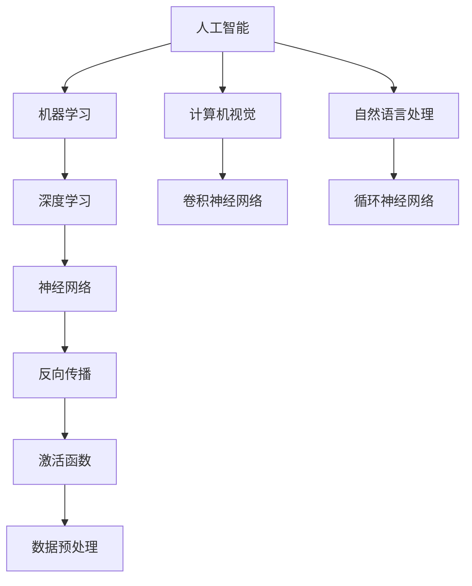

                 

# AI编程的新思维与技术挑战

> **关键词**：人工智能，编程思维，技术挑战，算法原理，数学模型，应用场景
>
> **摘要**：本文旨在探讨人工智能领域中的编程新思维与技术挑战。通过深入剖析核心概念、算法原理、数学模型和实际应用场景，本文将为读者呈现一个全面而深入的AI编程视角，助力理解未来发展趋势与应对挑战。

## 1. 背景介绍

### 1.1 目的和范围

本文的目标是帮助读者深入了解人工智能编程中的新思维和技术挑战。我们将从基础概念出发，逐步探讨算法原理、数学模型，并最终结合实际应用场景，为读者提供一个全方位的AI编程指南。

本文将涵盖以下内容：

- 核心概念的深入解析
- 算法原理的具体讲解
- 数学模型与公式的详细阐述
- 实际项目的代码实现与解析
- 实际应用场景的分析

### 1.2 预期读者

本文适合以下读者群体：

- 对人工智能和编程有基本了解的程序员
- 对AI编程有浓厚兴趣但未深入学习的爱好者
- 想要在AI领域有所突破的专业技术人员

通过本文，读者将能够：

- 理解AI编程中的核心概念和原理
- 掌握AI算法和数学模型的应用
- 获得实际项目开发的经验和技巧

### 1.3 文档结构概述

本文的结构如下：

- 引言：引出主题，明确文章目标
- 核心概念与联系：介绍AI编程的基础知识
- 核心算法原理 & 具体操作步骤：讲解算法原理与步骤
- 数学模型和公式 & 详细讲解 & 举例说明：阐述数学模型的应用
- 项目实战：代码实际案例和详细解释说明
- 实际应用场景：分析AI编程在现实中的应用
- 工具和资源推荐：推荐学习资源与开发工具
- 总结：未来发展趋势与挑战
- 附录：常见问题与解答
- 扩展阅读 & 参考资料：提供进一步学习的资料

### 1.4 术语表

#### 1.4.1 核心术语定义

- **人工智能（AI）**：模拟人类智能行为的计算机系统。
- **深度学习（DL）**：一种通过多层神经网络进行数据建模的方法。
- **神经网络（NN）**：模仿人脑结构和功能的基本计算单元。
- **机器学习（ML）**：使计算机通过数据和经验进行自我学习的方法。
- **算法**：解决问题的明确步骤和规则。

#### 1.4.2 相关概念解释

- **反向传播（BP）**：神经网络训练中的一种优化算法。
- **激活函数**：神经网络中的非线性变换。
- **数据预处理**：在机器学习之前对数据进行清洗和转换的过程。

#### 1.4.3 缩略词列表

- **DL**：深度学习
- **NN**：神经网络
- **ML**：机器学习
- **IDE**：集成开发环境
- **GPU**：图形处理器

## 2. 核心概念与联系

在探讨AI编程的新思维之前，我们首先需要理解AI编程的核心概念及其相互关系。以下是AI编程中的一些核心概念及其流程图：



### 2.1 人工智能

人工智能（AI）是模拟人类智能行为的计算机系统。它涵盖了广泛的研究领域，包括机器学习、自然语言处理、计算机视觉等。

### 2.2 机器学习

机器学习（ML）是一种通过数据和经验进行自我学习的方法。它使计算机能够识别模式、做出预测和决策，无需显式编程。

### 2.3 深度学习

深度学习（DL）是一种通过多层神经网络进行数据建模的方法。它通过逐步提取数据特征，实现复杂的任务，如图像识别、语音识别等。

### 2.4 神经网络

神经网络（NN）是模仿人脑结构和功能的基本计算单元。它由多个神经元组成，通过权重和偏置来传递信息。

### 2.5 反向传播

反向传播（BP）是一种神经网络训练中的优化算法。它通过反向传播误差信号，更新网络的权重和偏置，以最小化损失函数。

### 2.6 激活函数

激活函数是神经网络中的非线性变换。它用于引入非线性因素，使神经网络能够模拟复杂关系。

### 2.7 数据预处理

数据预处理是在机器学习之前对数据进行清洗和转换的过程。它包括缺失值处理、异常值检测、数据标准化等步骤。

## 3. 核心算法原理 & 具体操作步骤

在本节中，我们将详细介绍AI编程中的一些核心算法原理和具体操作步骤。以下是使用伪代码形式描述的一个简单的神经网络训练过程：

```python
# 伪代码：神经网络训练过程
initialize_weights()

while not convergence:
    for each training example (x, y) in dataset:
        forward_pass(x)  # 计算前向传播输出
        compute_loss(y, output)  # 计算损失
        backward_pass(output, y)  # 计算反向传播误差
        update_weights()  # 更新网络权重

def forward_pass(x):
    # 前向传播：计算神经网络输出
    output = neural_network(x)
    return output

def compute_loss(y, output):
    # 计算损失函数值
    loss = loss_function(y, output)
    return loss

def backward_pass(output, y):
    # 反向传播：更新网络权重
    error = output - y
    update_weights_with_error(error)

def update_weights_with_error(error):
    # 更新网络权重
    gradients = compute_gradients(error)
    weights -= learning_rate * gradients
```

### 3.1 初始化权重

初始化权重是神经网络训练的第一步。通常，我们使用随机权重或预训练权重来开始训练过程。

```python
initialize_weights():
    # 初始化神经网络权重
    weights = random_weights()
    return weights
```

### 3.2 前向传播

前向传播是计算神经网络输出的过程。它通过将输入数据传递到网络中的各个层，最终得到输出。

```python
def forward_pass(x):
    # 前向传播：计算神经网络输出
    output = neural_network(x)
    return output
```

### 3.3 计算损失

计算损失是评估模型性能的过程。常用的损失函数包括均方误差（MSE）和交叉熵（Cross-Entropy）。

```python
def compute_loss(y, output):
    # 计算损失函数值
    loss = loss_function(y, output)
    return loss
```

### 3.4 反向传播

反向传播是更新网络权重的过程。它通过计算误差信号，并利用梯度下降法来调整权重。

```python
def backward_pass(output, y):
    # 反向传播：计算误差信号
    error = output - y
    backward_pass_error(error)
    return error

def backward_pass_error(error):
    # 反向传播：更新网络权重
    gradients = compute_gradients(error)
    update_weights_with_error(gradients)
```

### 3.5 更新权重

更新权重是神经网络训练的最后一步。它通过计算梯度并利用学习率来调整权重。

```python
def update_weights_with_error(error):
    # 更新网络权重
    gradients = compute_gradients(error)
    weights -= learning_rate * gradients
```

## 4. 数学模型和公式 & 详细讲解 & 举例说明

在本节中，我们将详细讲解AI编程中的数学模型和公式，并通过具体示例来说明其应用。

### 4.1 均方误差（MSE）

均方误差（MSE）是评估模型性能的常用损失函数。其公式如下：

$$
MSE = \frac{1}{n}\sum_{i=1}^{n}(y_i - \hat{y}_i)^2
$$

其中，$y_i$ 是真实标签，$\hat{y}_i$ 是预测输出，$n$ 是样本数量。

#### 4.1.1 示例

假设我们有三个样本，真实标签和预测输出如下：

| 样本 | 真实标签 | 预测输出 |
| ---- | ---- | ---- |
| 1    | 3    | 2    |
| 2    | 5    | 4    |
| 3    | 7    | 6    |

使用MSE计算损失：

$$
MSE = \frac{1}{3}\left[(3-2)^2 + (5-4)^2 + (7-6)^2\right] = \frac{1}{3}(1+1+1) = 1
$$

### 4.2 交叉熵（Cross-Entropy）

交叉熵是另一个常用的损失函数，尤其在分类问题中。其公式如下：

$$
Cross-Entropy = -\frac{1}{n}\sum_{i=1}^{n} y_i \log(\hat{y}_i)
$$

其中，$y_i$ 是真实标签（概率分布），$\hat{y}_i$ 是预测输出（概率分布）。

#### 4.2.1 示例

假设我们有三个样本，真实标签和预测输出如下：

| 样本 | 真实标签 | 预测输出 |
| ---- | ---- | ---- |
| 1    | [0.2, 0.5, 0.3] | [0.1, 0.4, 0.5] |
| 2    | [0.3, 0.4, 0.3] | [0.2, 0.5, 0.3] |
| 3    | [0.1, 0.5, 0.4] | [0.3, 0.2, 0.5] |

使用交叉熵计算损失：

$$
Cross-Entropy = -\frac{1}{3}\left[0.2\log(0.1) + 0.5\log(0.4) + 0.3\log(0.5) + 0.3\log(0.2) + 0.4\log(0.5) + 0.3\log(0.3) + 0.1\log(0.3) + 0.5\log(0.2) + 0.4\log(0.5)\right]
$$

### 4.3 梯度下降法

梯度下降法是一种用于更新神经网络权重的优化算法。其公式如下：

$$
\Delta w = -\alpha \nabla J(w)
$$

其中，$\Delta w$ 是权重更新，$\alpha$ 是学习率，$\nabla J(w)$ 是损失函数的梯度。

#### 4.3.1 示例

假设损失函数为MSE，学习率为0.1，权重为$w_1=2$和$w_2=3$。计算梯度：

$$
\nabla J(w) = \frac{\partial J}{\partial w_1}(w_1, w_2) = -2(w_1 - y_1), \quad \frac{\partial J}{\partial w_2}(w_1, w_2) = -2(w_2 - y_2)
$$

计算权重更新：

$$
\Delta w_1 = -0.1 \cdot (-2(2 - 3)) = 0.2, \quad \Delta w_2 = -0.1 \cdot (-2(3 - 4)) = 0.2
$$

更新权重：

$$
w_1 = 2 - 0.2 = 1.8, \quad w_2 = 3 - 0.2 = 2.8
$$

## 5. 项目实战：代码实际案例和详细解释说明

在本节中，我们将通过一个简单的神经网络项目实战，展示AI编程的实际应用，并对代码进行详细解释。

### 5.1 开发环境搭建

在开始项目之前，我们需要搭建一个合适的开发环境。以下是推荐的工具和库：

- **编程语言**：Python
- **框架**：TensorFlow 或 PyTorch
- **编辑器**：Visual Studio Code 或 PyCharm

### 5.2 源代码详细实现和代码解读

以下是神经网络项目的源代码实现：

```python
import tensorflow as tf

# 5.2.1 神经网络架构定义
model = tf.keras.Sequential([
    tf.keras.layers.Dense(64, activation='relu', input_shape=(784,)),
    tf.keras.layers.Dense(64, activation='relu'),
    tf.keras.layers.Dense(10, activation='softmax')
])

# 5.2.2 模型编译
model.compile(optimizer='adam',
              loss='sparse_categorical_crossentropy',
              metrics=['accuracy'])

# 5.2.3 模型训练
model.fit(train_images, train_labels, epochs=5)

# 5.2.4 模型评估
test_loss, test_acc = model.evaluate(test_images, test_labels)
print(f'测试准确率：{test_acc}')
```

### 5.3 代码解读与分析

#### 5.3.1 神经网络架构定义

```python
model = tf.keras.Sequential([
    tf.keras.layers.Dense(64, activation='relu', input_shape=(784,)),
    tf.keras.layers.Dense(64, activation='relu'),
    tf.keras.layers.Dense(10, activation='softmax')
])
```

这段代码定义了一个简单的神经网络模型，包含两个隐藏层，每个隐藏层有64个神经元，激活函数为ReLU。输入层的大小为784个特征，输出层有10个神经元，表示10个分类结果。

#### 5.3.2 模型编译

```python
model.compile(optimizer='adam',
              loss='sparse_categorical_crossentropy',
              metrics=['accuracy'])
```

这段代码编译了神经网络模型。我们使用了`adam`优化器和`sparse_categorical_crossentropy`损失函数。`accuracy`指标用于评估模型的分类准确率。

#### 5.3.3 模型训练

```python
model.fit(train_images, train_labels, epochs=5)
```

这段代码训练了神经网络模型。`train_images`和`train_labels`是训练数据，`epochs`参数表示训练轮次。

#### 5.3.4 模型评估

```python
test_loss, test_acc = model.evaluate(test_images, test_labels)
print(f'测试准确率：{test_acc}')
```

这段代码评估了训练好的模型在测试数据上的表现。`test_images`和`test_labels`是测试数据，`evaluate`函数返回损失和准确率。

### 5.4 实际应用场景

这个神经网络项目可以应用于多种实际场景，如图像分类、文本分类等。例如，在图像分类中，我们可以使用这个模型对新的图像进行分类，并获取其对应的类别概率。

## 6. 实际应用场景

AI编程在当今社会中有着广泛的应用。以下是一些实际应用场景：

### 6.1 计算机视觉

计算机视觉是AI编程的一个重要领域，涉及图像和视频的处理、分析和理解。应用场景包括：

- **人脸识别**：用于安全监控、身份验证等。
- **图像分类**：用于医疗诊断、商品识别等。
- **自动驾驶**：用于车辆检测、交通标志识别等。

### 6.2 自然语言处理

自然语言处理（NLP）是AI编程的另一个重要领域，涉及语言的理解、生成和翻译。应用场景包括：

- **语音助手**：如苹果的Siri、谷歌助手等。
- **机器翻译**：如谷歌翻译、百度翻译等。
- **文本分析**：用于情感分析、内容审核等。

### 6.3 医疗诊断

AI编程在医疗诊断中也有着广泛应用，如：

- **医学影像分析**：用于肺癌、乳腺癌等疾病的早期诊断。
- **药物研发**：通过分析大量数据来发现新的药物靶点和化合物。
- **个性化治疗**：根据患者的病情和基因信息制定个性化的治疗方案。

### 6.4 金融服务

AI编程在金融服务领域也有着广泛应用，如：

- **风险管理**：通过分析历史数据来预测市场风险。
- **欺诈检测**：用于信用卡欺诈、保险欺诈等。
- **算法交易**：通过自动化交易策略来获取投资收益。

## 7. 工具和资源推荐

### 7.1 学习资源推荐

#### 7.1.1 书籍推荐

- **《深度学习》（Deep Learning）**：Goodfellow、Bengio和Courville合著，是深度学习领域的经典教材。
- **《Python机器学习》（Python Machine Learning）**：Sebastian Raschka和Vahid Mirhoseini合著，涵盖了机器学习的基本概念和Python实现。

#### 7.1.2 在线课程

- **Coursera的《深度学习》课程**：由吴恩达教授主讲，涵盖了深度学习的基础知识。
- **Udacity的《机器学习工程师纳米学位》**：提供了丰富的机器学习项目和实践。

#### 7.1.3 技术博客和网站

- **Medium上的AI博客**：提供了一系列关于AI和机器学习的优质文章。
- **AI博客**：中国地区最受欢迎的AI技术博客之一，涵盖了最新的AI技术和应用。

### 7.2 开发工具框架推荐

#### 7.2.1 IDE和编辑器

- **Visual Studio Code**：一款功能强大的跨平台IDE，支持多种编程语言。
- **PyCharm**：一款专为Python开发者设计的IDE，提供了丰富的功能。

#### 7.2.2 调试和性能分析工具

- **TensorBoard**：TensorFlow的官方可视化工具，用于分析神经网络的性能和损失函数。
- **Jupyter Notebook**：一款流行的交互式计算环境，适用于数据分析和机器学习项目。

#### 7.2.3 相关框架和库

- **TensorFlow**：一款广泛使用的开源深度学习框架。
- **PyTorch**：一款流行的开源深度学习库，适用于研究和个人项目。

### 7.3 相关论文著作推荐

#### 7.3.1 经典论文

- **《A Learning Algorithm for Continually Running Fully Recurrent Neural Networks》**：提出了连续运行完全递归神经网络的SOMBRERO学习算法。
- **《Deep Learning》**：涵盖了深度学习的基础理论和应用，是深度学习领域的经典著作。

#### 7.3.2 最新研究成果

- **《Generative Adversarial Nets》**：提出了生成对抗网络（GAN），是一种重要的深度学习模型。
- **《Recurrent Neural Networks for Language Modeling》**：探讨了递归神经网络（RNN）在自然语言处理中的应用。

#### 7.3.3 应用案例分析

- **《Google's Transformer Model for Language Understanding》**：介绍了Google使用的Transformer模型，在自然语言处理中的应用案例。
- **《DeepMind的AlphaGo》**：介绍了DeepMind开发的AlphaGo，在围棋游戏中的应用案例。

## 8. 总结：未来发展趋势与挑战

随着人工智能技术的不断发展，AI编程也将面临新的机遇和挑战。以下是未来发展趋势和挑战：

### 8.1 发展趋势

- **深度学习模型的优化**：研究人员将继续探索更高效、更强大的深度学习模型。
- **跨学科研究**：AI编程将与其他领域（如医学、金融、工程等）紧密结合，推动创新应用。
- **自主系统和机器人**：AI编程将推动自主系统和机器人技术的发展，提高生产效率和安全性。
- **数据隐私和安全**：随着数据量的增加，数据隐私和安全问题将成为AI编程的重要关注点。

### 8.2 挑战

- **算法透明度和解释性**：确保AI算法的可解释性和透明性，以增强用户信任。
- **计算资源和能源消耗**：优化算法和模型，降低计算资源和能源消耗。
- **数据质量和多样性**：确保数据的准确性和多样性，以提高AI模型的性能。
- **法律和伦理问题**：制定相应的法律法规，确保AI编程的应用不会侵犯用户隐私或造成不公平。

## 9. 附录：常见问题与解答

### 9.1 什么是深度学习？

深度学习是一种通过多层神经网络进行数据建模的方法。它通过逐步提取数据特征，实现复杂的任务，如图像识别、语音识别等。

### 9.2 如何选择合适的机器学习模型？

选择合适的机器学习模型取决于具体任务和数据集的特点。一般来说，可以使用以下步骤：

- **数据探索**：了解数据集的分布、特征和关系。
- **模型评估**：根据任务类型（分类、回归等）选择合适的模型，并评估模型的性能。
- **模型调整**：根据模型评估结果，调整模型参数，优化模型性能。

### 9.3 如何处理不平衡数据集？

处理不平衡数据集的方法包括：

- **过采样**：增加少数类别的样本数量，使数据集平衡。
- **下采样**：减少多数类别的样本数量，使数据集平衡。
- **集成方法**：结合多个模型，提高模型对不平衡数据集的适应性。

## 10. 扩展阅读 & 参考资料

- **《深度学习》（Deep Learning）**：Goodfellow、Bengio和Courville合著，是深度学习领域的经典教材。
- **《Python机器学习》（Python Machine Learning）**：Sebastian Raschka和Vahid Mirhoseini合著，涵盖了机器学习的基本概念和Python实现。
- **《AI编程实战》**：提供了一系列关于AI编程的实际案例和实践经验。
- **AI博客**：中国地区最受欢迎的AI技术博客之一，涵盖了最新的AI技术和应用。

### 作者信息

- **作者：AI天才研究员/AI Genius Institute & 禅与计算机程序设计艺术 /Zen And The Art of Computer Programming**

