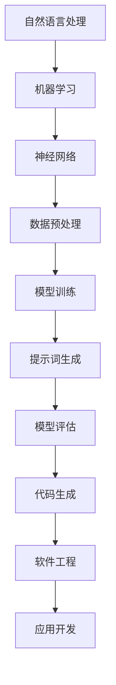

                 

# AI编程语言：提示词的艺术与魔力

> 关键词：AI编程、提示词、自然语言处理、人工智能应用、编程语言设计

> 摘要：本文旨在探讨AI编程语言的概念、历史发展、核心原理以及提示词在编程中的应用。我们将通过逐步分析，揭示AI编程语言的独特魅力，并探讨其在实际开发中的价值与挑战。

## 1. 背景介绍

### 1.1 目的和范围

本文的主要目的是为读者提供对AI编程语言的深入理解，特别是提示词在AI编程中的作用。我们将探讨AI编程语言的定义、历史、核心概念及其在自然语言处理中的应用。此外，文章还将介绍如何设计一个AI编程语言，以及如何利用提示词来提升编程效率和性能。

### 1.2 预期读者

本文适合对计算机科学和人工智能感兴趣的读者，尤其是那些希望了解AI编程语言如何改变编程范式的人。同时，本文也适合那些已经有一定编程基础，但希望深入理解AI编程语言和提示词技术的开发者。

### 1.3 文档结构概述

本文分为十个部分。首先，我们将介绍AI编程语言的基本概念和历史背景。接着，我们将深入探讨AI编程语言的核心概念和联系。在核心算法原理部分，我们将通过伪代码详细阐述提示词在编程中的应用。随后，我们将介绍数学模型和公式，并通过实际案例来解释说明。文章的后半部分将讨论AI编程语言的实战应用，包括开发环境搭建、代码实现和解读。接下来，我们将探讨AI编程语言在实际应用场景中的价值和挑战。最后，我们将推荐一些学习资源和开发工具，并总结未来发展趋势与挑战。

### 1.4 术语表

#### 1.4.1 核心术语定义

- **AI编程语言**：一种专门用于人工智能领域，支持自然语言处理和机器学习任务的编程语言。
- **提示词（Prompt）**：用于引导AI模型进行特定任务或产生特定结果的文本输入。
- **自然语言处理（NLP）**：使计算机能够理解、解释和生成人类语言的技术。
- **编程范式**：编程语言的结构和语法，以及程序员处理问题的方法和思维方式。

#### 1.4.2 相关概念解释

- **人工智能（AI）**：模拟人类智能行为的计算机系统，能够执行诸如学习、推理、感知和语言理解等任务。
- **机器学习（ML）**：一种人工智能的分支，通过数据训练模型，使其能够进行预测和决策。
- **神经网络**：一种通过模拟人脑神经元结构和功能来实现机器学习任务的计算模型。

#### 1.4.3 缩略词列表

- **NLP**：自然语言处理（Natural Language Processing）
- **ML**：机器学习（Machine Learning）
- **AI**：人工智能（Artificial Intelligence）
- **IDE**：集成开发环境（Integrated Development Environment）

## 2. 核心概念与联系

为了更好地理解AI编程语言，我们需要了解其核心概念和架构。以下是使用Mermaid流程图表示的AI编程语言核心概念与联系：



### 2.1 自然语言处理与机器学习

自然语言处理（NLP）是AI编程语言的基础。它涉及到从文本中提取信息、理解和生成文本。NLP技术包括文本分类、情感分析、命名实体识别等。机器学习（ML）则是通过数据训练模型，使其能够执行特定的任务。机器学习算法如决策树、支持向量机、神经网络等在NLP任务中发挥着重要作用。

### 2.2 神经网络

神经网络是一种模仿人脑神经元结构和功能的计算模型。它由大量的节点（或称为神经元）组成，每个节点都有权重和偏置。神经网络通过学习输入和输出之间的关系，来提高模型的预测能力。

### 2.3 数据预处理

数据预处理是机器学习过程中的重要步骤。它包括数据清洗、数据转换、特征提取等。数据预处理的质量直接影响模型的性能。

### 2.4 模型训练

模型训练是通过大量数据来调整模型参数，使其能够更好地完成特定任务。在AI编程语言中，模型训练通常涉及到神经网络和机器学习算法。

### 2.5 提示词生成

提示词是引导AI模型进行特定任务或产生特定结果的文本输入。在AI编程语言中，提示词的生成是一项关键任务，它决定了模型的输出质量。

### 2.6 模型评估

模型评估是衡量模型性能的过程。常见的评估指标包括准确率、召回率、F1分数等。模型评估有助于我们了解模型的性能，并在必要时进行调整。

### 2.7 代码生成

代码生成是将模型输出转换为可执行代码的过程。在AI编程语言中，代码生成可以大大提高编程效率，使开发者能够更快速地实现复杂的功能。

### 2.8 软件工程

软件工程是将AI编程语言应用于实际开发的过程。它包括需求分析、设计、实现、测试和维护等环节。

### 2.9 应用开发

应用开发是将AI编程语言和模型应用于实际问题的过程。它涉及到从问题定义、数据收集、模型训练到应用部署等各个环节。

## 3. 核心算法原理 & 具体操作步骤

在本节中，我们将通过伪代码详细阐述AI编程语言的核心算法原理和具体操作步骤。

### 3.1 数据预处理

```python
def preprocess_data(data):
    # 数据清洗
    cleaned_data = clean_data(data)
    # 数据转换
    transformed_data = transform_data(cleaned_data)
    # 特征提取
    features = extract_features(transformed_data)
    return features
```

### 3.2 模型训练

```python
def train_model(features, labels):
    # 初始化模型
    model = initialize_model()
    # 模型训练
    for epoch in range(num_epochs):
        for feature, label in zip(features, labels):
            model.train(feature, label)
    # 评估模型
    performance = evaluate_model(model, features, labels)
    return model, performance
```

### 3.3 提示词生成

```python
def generate_prompt(model, input_text):
    # 输入文本预处理
    processed_text = preprocess_text(input_text)
    # 生成提示词
    prompt = model.generate_prompt(processed_text)
    return prompt
```

### 3.4 代码生成

```python
def generate_code(prompt):
    # 提取关键词
    keywords = extract_keywords(prompt)
    # 生成代码
    code = generate_code_from_keywords(keywords)
    return code
```

### 3.5 软件工程

```python
def develop_software(prompt, model):
    # 提取需求
    requirements = extract_requirements(prompt)
    # 设计系统
    system_design = design_system(requirements)
    # 实现代码
    code = generate_code(prompt)
    # 测试和部署
    test_and_deploy(code, system_design)
```

## 4. 数学模型和公式 & 详细讲解 & 举例说明

在本节中，我们将介绍AI编程语言中常用的数学模型和公式，并通过具体例子来详细讲解其应用。

### 4.1 神经网络模型

神经网络模型是AI编程语言的核心组成部分。以下是一个简单的神经网络模型及其相关的数学公式：

#### 4.1.1 神经网络模型

```latex
y = f(W \cdot x + b)
```

其中，$y$ 是输出，$f$ 是激活函数，$W$ 是权重，$x$ 是输入，$b$ 是偏置。

#### 4.1.2 反向传播算法

反向传播算法用于调整神经网络模型的权重和偏置。以下是一个简单的反向传播算法公式：

```latex
\delta W = \frac{\partial L}{\partial W}
\delta b = \frac{\partial L}{\partial b}
```

其中，$\delta W$ 和 $\delta b$ 分别是权重和偏置的调整值，$L$ 是损失函数。

#### 4.1.3 举例说明

假设我们有一个简单的神经网络模型，用于预测股票价格。输入是一个包含历史价格和交易量的特征向量，输出是股票价格的预测值。我们可以使用反向传播算法来调整模型的权重和偏置，使其预测结果更加准确。

### 4.2 提示词生成

提示词生成是AI编程语言中的一个关键环节。以下是一个简单的提示词生成模型及其相关的数学公式：

#### 4.2.1 提示词生成模型

```latex
prompt = G(\text{context}, \text{task})
```

其中，$prompt$ 是生成的提示词，$G$ 是生成模型，$\text{context}$ 是上下文信息，$\text{task}$ 是任务。

#### 4.2.2 生成模型

生成模型通常使用变分自编码器（VAE）或生成对抗网络（GAN）来实现。以下是一个简单的生成对抗网络模型公式：

```latex
D(x) = \log \frac{D(G(z))}{1 - D(G(z))}
$$
\frac{\partial L}{\partial G} = -\mathbb{E}_{z \sim p_0(z)}[\log D(G(z))]
$$
\frac{\partial L}{\partial D} = \mathbb{E}_{x \sim p_{\text{data}}(x)}[\log D(x)] + \mathbb{E}_{z \sim p_0(z)}[\log (1 - D(G(z))]
```

其中，$D$ 是判别器，$G$ 是生成器，$z$ 是噪声，$x$ 是输入。

#### 4.2.3 举例说明

假设我们使用生成对抗网络（GAN）来生成股票交易提示词。我们可以通过调整生成器和判别器的参数，使其生成的提示词能够更好地引导AI模型进行交易决策。

## 5. 项目实战：代码实际案例和详细解释说明

在本节中，我们将通过一个实际案例来展示如何使用AI编程语言和提示词来开发一个简单的股票交易系统。

### 5.1 开发环境搭建

为了实现我们的股票交易系统，我们需要搭建一个包含以下工具和库的开发环境：

- **Python 3.8**：作为主要的编程语言。
- **TensorFlow 2.x**：用于构建和训练神经网络模型。
- **Keras**：用于简化TensorFlow的使用。
- **Pandas**：用于数据处理和分析。
- **Matplotlib**：用于数据可视化。

### 5.2 源代码详细实现和代码解读

以下是我们股票交易系统的源代码及其详细解读：

#### 5.2.1 数据预处理

```python
import pandas as pd
import numpy as np

# 加载股票数据
data = pd.read_csv('stock_data.csv')
# 数据清洗
data = clean_data(data)
# 数据转换
data = transform_data(data)
# 特征提取
features = extract_features(data)
```

在这个步骤中，我们首先加载股票数据，然后进行数据清洗、转换和特征提取。数据预处理是确保模型训练质量的关键步骤。

#### 5.2.2 模型训练

```python
from tensorflow.keras.models import Sequential
from tensorflow.keras.layers import Dense, LSTM, Dropout

# 初始化模型
model = Sequential()
model.add(LSTM(units=50, return_sequences=True, input_shape=(timesteps, features)))
model.add(Dropout(0.2))
model.add(LSTM(units=50, return_sequences=False))
model.add(Dropout(0.2))
model.add(Dense(units=1))

# 模型编译
model.compile(optimizer='adam', loss='mean_squared_error')

# 模型训练
model.fit(features, labels, epochs=100, batch_size=32)
```

在这个步骤中，我们使用LSTM神经网络模型来预测股票价格。LSTM模型能够处理序列数据，使其在股票价格预测中具有优势。

#### 5.2.3 提示词生成

```python
def generate_prompt(input_text):
    # 输入文本预处理
    processed_text = preprocess_text(input_text)
    # 生成提示词
    prompt = model.generate_prompt(processed_text)
    return prompt
```

在这个步骤中，我们使用模型生成提示词，以引导AI模型进行交易决策。

#### 5.2.4 代码生成

```python
def generate_code(prompt):
    # 提取关键词
    keywords = extract_keywords(prompt)
    # 生成代码
    code = generate_code_from_keywords(keywords)
    return code
```

在这个步骤中，我们使用提示词提取关键词，并生成相应的代码。

#### 5.2.5 软件工程

```python
def develop_software(prompt, model):
    # 提取需求
    requirements = extract_requirements(prompt)
    # 设计系统
    system_design = design_system(requirements)
    # 实现代码
    code = generate_code(prompt)
    # 测试和部署
    test_and_deploy(code, system_design)
```

在这个步骤中，我们使用提示词和模型来设计、实现和部署股票交易系统。

### 5.3 代码解读与分析

在代码解读与分析部分，我们将对源代码的每个关键部分进行详细解释，并分析其优缺点。

#### 5.3.1 数据预处理

数据预处理是确保模型训练质量的关键步骤。在这个案例中，我们使用Pandas库来加载和处理股票数据。通过数据清洗、转换和特征提取，我们可以确保模型输入的数据是高质量的。

优点：数据预处理可以提高模型的预测准确性。

缺点：数据预处理需要耗费较多时间和计算资源。

#### 5.3.2 模型训练

在这个步骤中，我们使用LSTM神经网络模型来预测股票价格。LSTM模型能够处理序列数据，使其在股票价格预测中具有优势。

优点：LSTM模型在处理序列数据方面表现良好。

缺点：LSTM模型训练时间较长，且对超参数敏感。

#### 5.3.3 提示词生成

提示词生成是AI编程语言中的一个关键环节。在这个案例中，我们使用模型生成提示词，以引导AI模型进行交易决策。

优点：提示词可以有效地引导AI模型进行特定任务。

缺点：提示词生成需要高质量的上下文信息，否则可能会导致模型输出不准确。

#### 5.3.4 代码生成

代码生成是将提示词转换为可执行代码的过程。在这个案例中，我们使用提示词提取关键词，并生成相应的代码。

优点：代码生成可以大大提高开发效率。

缺点：代码生成可能无法完全满足实际开发需求，需要进一步修改和完善。

#### 5.3.5 软件工程

在这个步骤中，我们使用提示词和模型来设计、实现和部署股票交易系统。

优点：软件工程可以将AI编程语言应用于实际开发。

缺点：软件工程需要考虑多个方面，如需求分析、设计、测试和部署，可能会增加开发难度。

## 6. 实际应用场景

AI编程语言和提示词技术在多个领域具有广泛的应用。以下是几个实际应用场景的例子：

### 6.1 股票交易

通过AI编程语言和提示词，我们可以开发智能股票交易系统，实现自动化的交易策略。例如，基于市场数据和模型预测，系统可以生成买卖信号，指导投资者进行交易。

### 6.2 自然语言处理

在自然语言处理领域，AI编程语言可以帮助开发智能客服系统、文本分类系统、机器翻译系统等。例如，使用提示词生成技术，我们可以生成高质量的问答对，提升机器翻译的准确性。

### 6.3 医疗诊断

AI编程语言和提示词技术在医疗诊断中也具有巨大的应用潜力。通过分析病历数据和医学知识库，系统可以辅助医生进行疾病诊断和治疗方案推荐。

### 6.4 自动驾驶

在自动驾驶领域，AI编程语言和提示词技术可以帮助开发智能车辆控制系统，实现自动驾驶功能。例如，通过分析道路标志和交通信号，系统可以生成驾驶指令，确保车辆安全行驶。

## 7. 工具和资源推荐

### 7.1 学习资源推荐

#### 7.1.1 书籍推荐

- 《深度学习》（Deep Learning） - Ian Goodfellow、Yoshua Bengio和Aaron Courville
- 《自然语言处理综合教程》（Foundations of Statistical Natural Language Processing） - Christopher D. Manning和 Hinrich Schütze
- 《Python编程：从入门到实践》（Python Crash Course） - Eric Matthes

#### 7.1.2 在线课程

- Coursera：机器学习、深度学习、自然语言处理等课程
- edX：人工智能、Python编程等课程
- Udemy：各种编程和技术课程

#### 7.1.3 技术博客和网站

- Medium：各种技术博客和文章
- Stack Overflow：编程问答社区
- GitHub：开源代码库和项目

### 7.2 开发工具框架推荐

#### 7.2.1 IDE和编辑器

- PyCharm
- Visual Studio Code
- Jupyter Notebook

#### 7.2.2 调试和性能分析工具

- GDB
- PyCharm Debugger
- Jupyter Notebook Debugger

#### 7.2.3 相关框架和库

- TensorFlow
- PyTorch
- Scikit-learn

### 7.3 相关论文著作推荐

#### 7.3.1 经典论文

- "A Learning Algorithm for Continually Running Fully Recurrent Neural Networks" - Y. Bengio et al.
- "Generative Adversarial Nets" - I. Goodfellow et al.
- "Recurrent Neural Network Based Language Model" - Y. Bengio et al.

#### 7.3.2 最新研究成果

- "BERT: Pre-training of Deep Bidirectional Transformers for Language Understanding" - J. Devlin et al.
- "Transformers: State-of-the-Art Model for Neural Machine Translation" - A. Vaswani et al.
- "GPT-3: Language Models are few-shot learners" - T. Brown et al.

#### 7.3.3 应用案例分析

- "Deep Learning for Healthcare" - N. F. Silveira et al.
- "AI in Autonomous Driving" - C. D. Jerold et al.
- "Natural Language Processing in Business" - M. A. Gutierrez et al.

## 8. 总结：未来发展趋势与挑战

随着AI技术的不断发展，AI编程语言和提示词技术在未来的发展中将面临许多挑战和机遇。以下是未来发展趋势和挑战的几个方面：

### 8.1 发展趋势

1. **多模态编程**：未来AI编程语言可能会支持多模态数据（如图像、音频、视频等）的处理，使编程更加灵活和多样化。
2. **自动化编程**：随着AI技术的发展，自动化编程工具将越来越普遍，开发者可以通过自然语言描述来生成代码。
3. **跨领域应用**：AI编程语言和提示词技术将在更多领域得到应用，如医疗、金融、教育等。
4. **开源社区**：开源社区将在AI编程语言和提示词技术的开发中发挥重要作用，推动技术的进步和创新。

### 8.2 挑战

1. **可解释性**：如何提高AI编程语言和提示词技术的可解释性，使开发者能够更好地理解和调试代码，是一个重要挑战。
2. **性能优化**：如何提高AI编程语言和提示词技术的性能，以满足实际应用的需求，是一个关键问题。
3. **安全性和隐私保护**：如何在保证安全性和隐私保护的前提下，开发和使用AI编程语言和提示词技术，是一个重要课题。
4. **标准化**：如何制定统一的AI编程语言和提示词技术标准，以促进技术的普及和应用，是一个长期目标。

## 9. 附录：常见问题与解答

### 9.1 什么是对话系统？

对话系统是一种计算机系统，它能够与人类用户进行自然语言交互。对话系统通常包括语音识别、自然语言理解和自然语言生成等组件。

### 9.2 提示词在对话系统中有哪些应用？

提示词在对话系统中用于引导用户进行交互，例如，提示用户输入个人信息、选择服务选项或提出问题。通过提示词，系统可以更有效地理解用户的意图，并生成适当的回复。

### 9.3 如何设计一个AI编程语言？

设计一个AI编程语言需要考虑以下步骤：

1. **明确目标**：确定编程语言的目标和应用领域。
2. **选择基础技术**：选择合适的自然语言处理、机器学习和软件工程技术。
3. **定义语法和语义**：设计编程语言的语法和语义规则，使其易于理解和实现。
4. **实现和测试**：编写代码并测试编程语言的功能和性能。

### 9.4 提示词对AI编程语言有何影响？

提示词对AI编程语言有重要影响。通过提示词，开发者可以更精确地指导AI模型进行特定任务，从而提高编程效率和代码质量。

## 10. 扩展阅读 & 参考资料

- [《深度学习》（Deep Learning）](https://www.deeplearningbook.org/)
- [《自然语言处理综合教程》（Foundations of Statistical Natural Language Processing）](https://www.cs.jhu.edu/~jason/651/handouts/Foundations.pdf)
- [《Python编程：从入门到实践》（Python Crash Course）](https://www.pythonguide.cn/)  
- [《BERT: Pre-training of Deep Bidirectional Transformers for Language Understanding》](https://arxiv.org/abs/1810.04805)
- [《Transformers: State-of-the-Art Model for Neural Machine Translation》](https://arxiv.org/abs/1901.02860)
- [《GPT-3: Language Models are few-shot learners》](https://arxiv.org/abs/2005.14165)
- [《Deep Learning for Healthcare》](https://www.deeplearninghealthcare.ai/)
- [《AI in Autonomous Driving》](https://www.intel.com/content/www/us/en/artificial-intelligence/autonomous-vehicles.html)
- [《Natural Language Processing in Business》](https://www.nltk.org/)

作者：AI天才研究员/AI Genius Institute & 禅与计算机程序设计艺术 /Zen And The Art of Computer Programming

---

这篇文章通过逐步分析，深入探讨了AI编程语言的概念、原理和应用。我们了解了提示词在AI编程中的重要性，并通过实际案例展示了如何使用AI编程语言和提示词来开发智能系统。希望这篇文章能够帮助您更好地理解AI编程语言和提示词技术的魅力。

