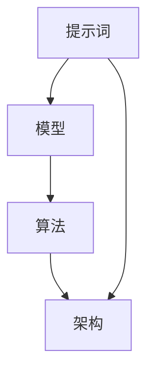
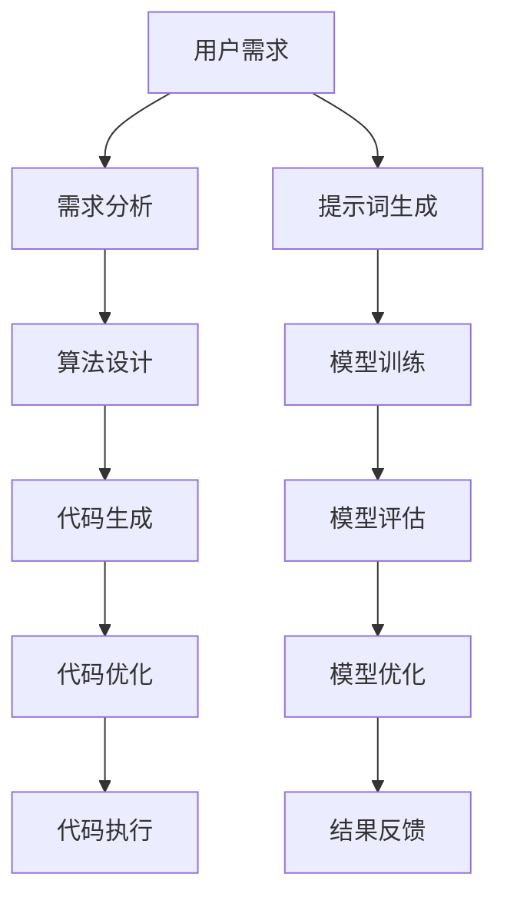
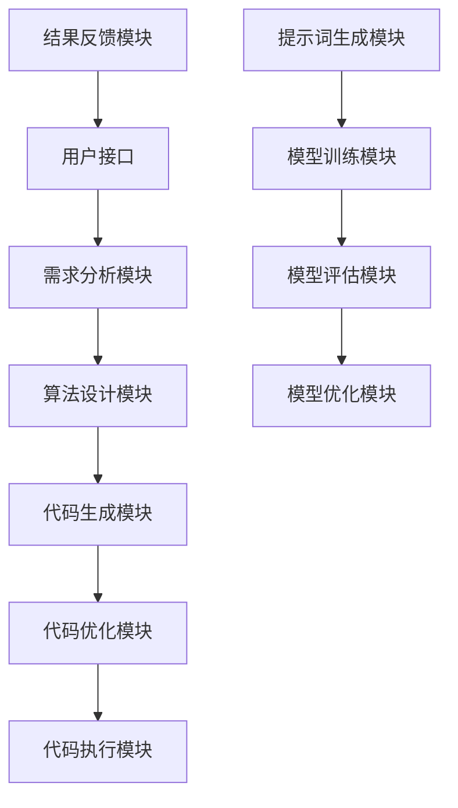

                 

### AI编程语言：提示词的革命与魔法

> **关键词**：AI编程语言、提示词、革命、魔法、算法、模型、应用场景、工具和资源推荐

> **摘要**：本文将深入探讨AI编程语言的革命性变革，特别是提示词在其中的关键作用。我们将从背景介绍开始，逐步分析AI编程语言的核心概念、算法原理、数学模型以及实际应用案例，最后展望未来的发展趋势与挑战。通过本文，读者将了解到AI编程语言的奇妙之处，以及如何掌握这一新兴技术的魔法。

### 1. 背景介绍

#### 1.1 目的和范围

本文的目的是介绍AI编程语言的原理和应用，特别是提示词在其中的作用。AI编程语言是近年来人工智能领域的一个重要发展方向，它使得编程更加智能化、自动化。提示词作为AI编程语言的核心元素，其革命性的变革正在彻底改变编程的本质。本文将详细探讨提示词的起源、原理、应用以及未来发展趋势。

#### 1.2 预期读者

本文面向对AI编程语言有一定了解的读者，特别是对提示词感兴趣的开发者、研究者和技术爱好者。通过本文，读者将能够深入理解AI编程语言的核心理念，掌握提示词的使用方法，并能够应用于实际项目中。

#### 1.3 文档结构概述

本文分为十个部分：

1. **背景介绍**：介绍AI编程语言的背景、目的和读者预期。
2. **核心概念与联系**：分析AI编程语言的核心概念、原理和架构。
3. **核心算法原理 & 具体操作步骤**：详细讲解AI编程语言的核心算法原理和具体操作步骤。
4. **数学模型和公式 & 详细讲解 & 举例说明**：介绍AI编程语言的数学模型和公式，并进行详细讲解和举例说明。
5. **项目实战：代码实际案例和详细解释说明**：通过实际案例展示AI编程语言的代码实现和详细解释。
6. **实际应用场景**：探讨AI编程语言在不同领域的应用场景。
7. **工具和资源推荐**：推荐学习资源、开发工具框架和相关论文著作。
8. **总结：未来发展趋势与挑战**：总结本文内容，展望AI编程语言的未来发展趋势和挑战。
9. **附录：常见问题与解答**：解答读者可能遇到的常见问题。
10. **扩展阅读 & 参考资料**：提供更多扩展阅读和参考资料。

#### 1.4 术语表

在本文中，我们将使用以下术语：

- **AI编程语言**：一种专门用于人工智能编程的语言，具有自动编程、智能化和自动化等特点。
- **提示词**：AI编程语言中的核心元素，用于指导算法的运行和决策。
- **模型**：AI编程语言中的核心组件，用于表示数据和算法。
- **算法**：AI编程语言中的核心组件，用于处理数据和执行任务。
- **架构**：AI编程语言的总体结构和设计原则。

#### 1.4.1 核心术语定义

- **AI编程语言**：一种专门用于人工智能编程的语言，具有自动编程、智能化和自动化等特点。它通过提示词、模型和算法等元素，实现编程的自动化和智能化。
- **提示词**：AI编程语言中的核心元素，用于指导算法的运行和决策。提示词通常由关键字、变量和表达式等组成，能够指导算法执行特定的任务。
- **模型**：AI编程语言中的核心组件，用于表示数据和算法。模型通常由神经网络、决策树、支持向量机等组成，能够对数据进行分类、预测和回归等操作。
- **算法**：AI编程语言中的核心组件，用于处理数据和执行任务。算法通常由排序、查找、图算法等组成，能够对数据进行高效处理和分析。
- **架构**：AI编程语言的总体结构和设计原则。架构决定了AI编程语言的性能、可扩展性和易用性。

#### 1.4.2 相关概念解释

- **自动编程**：自动编程是指通过程序生成工具，自动生成源代码的编程方法。它通过分析需求、生成算法、生成代码等步骤，实现编程的自动化和智能化。
- **智能化**：智能化是指通过人工智能技术，使计算机具有类似人类的智能行为。它通过学习、推理、决策等能力，提高计算机的处理能力和效率。
- **自动化**：自动化是指通过编程和算法，实现任务的自动化处理。它通过自动化工具和流程，提高工作效率和准确性。

#### 1.4.3 缩略词列表

- **AI**：人工智能
- **ML**：机器学习
- **DL**：深度学习
- **NLP**：自然语言处理
- **CV**：计算机视觉

## 2. 核心概念与联系

AI编程语言的核心概念和联系是理解其原理和应用的关键。在本节中，我们将通过Mermaid流程图，详细分析AI编程语言的核心概念、原理和架构。

### 2.1. AI编程语言的核心概念

AI编程语言的核心概念包括提示词、模型、算法和架构。以下是一个简单的Mermaid流程图，展示了这些核心概念之间的关系：



- **提示词**：提示词是AI编程语言的核心元素，用于指导算法的运行和决策。提示词通常由关键字、变量和表达式等组成，能够指导算法执行特定的任务。
- **模型**：模型是AI编程语言中的核心组件，用于表示数据和算法。模型通常由神经网络、决策树、支持向量机等组成，能够对数据进行分类、预测和回归等操作。
- **算法**：算法是AI编程语言中的核心组件，用于处理数据和执行任务。算法通常由排序、查找、图算法等组成，能够对数据进行高效处理和分析。
- **架构**：架构是AI编程语言的总体结构和设计原则。架构决定了AI编程语言的性能、可扩展性和易用性。

### 2.2. AI编程语言的原理和架构

AI编程语言的原理和架构是理解其工作原理的关键。以下是一个更详细的Mermaid流程图，展示了AI编程语言的原理和架构：



- **用户需求**：用户需求是AI编程语言的起点，它指导了整个编程过程。
- **需求分析**：需求分析是将用户需求转化为具体的技术需求，它是算法设计和代码生成的基础。
- **算法设计**：算法设计是根据需求分析的结果，设计出适合的算法。
- **代码生成**：代码生成是根据算法设计的结果，生成源代码。
- **代码优化**：代码优化是对生成的源代码进行优化，以提高性能和效率。
- **代码执行**：代码执行是执行生成的源代码，实现特定的功能。
- **提示词生成**：提示词生成是根据用户需求和算法设计的结果，生成指导算法运行的提示词。
- **模型训练**：模型训练是根据提示词和数据进行模型的训练，以提高模型的准确性和性能。
- **模型评估**：模型评估是对训练好的模型进行评估，以确定其性能和效果。
- **模型优化**：模型优化是对评估结果进行分析，以优化模型的性能和效果。
- **结果反馈**：结果反馈是将模型评估的结果反馈给用户，以指导后续的编程过程。

### 2.3. AI编程语言的架构

AI编程语言的架构是理解其工作原理和性能的关键。以下是一个更详细的Mermaid流程图，展示了AI编程语言的架构：



- **用户接口**：用户接口是用户与AI编程语言交互的入口，它提供了输入和输出的接口。
- **需求分析模块**：需求分析模块是根据用户需求进行分析，以确定技术需求。
- **算法设计模块**：算法设计模块是根据需求分析的结果，设计出适合的算法。
- **代码生成模块**：代码生成模块是根据算法设计的结果，生成源代码。
- **代码优化模块**：代码优化模块是对生成的源代码进行优化，以提高性能和效率。
- **代码执行模块**：代码执行模块是执行生成的源代码，实现特定的功能。
- **提示词生成模块**：提示词生成模块是根据用户需求和算法设计的结果，生成指导算法运行的提示词。
- **模型训练模块**：模型训练模块是根据提示词和数据进行模型的训练，以提高模型的准确性和性能。
- **模型评估模块**：模型评估模块是对训练好的模型进行评估，以确定其性能和效果。
- **模型优化模块**：模型优化模块是对评估结果进行分析，以优化模型的性能和效果。
- **结果反馈模块**：结果反馈模块是将模型评估的结果反馈给用户，以指导后续的编程过程。

通过以上Mermaid流程图，我们可以清晰地看到AI编程语言的核心概念、原理和架构。这些流程图帮助我们理解AI编程语言的工作原理和性能，为后续的算法原理讲解和数学模型介绍奠定了基础。

### 3. 核心算法原理 & 具体操作步骤

AI编程语言的核心算法是理解和实现AI编程的关键。在本节中，我们将详细讲解AI编程语言的核心算法原理，并使用伪代码展示具体的操作步骤。

#### 3.1. 核心算法原理

AI编程语言的核心算法主要包括提示词生成、模型训练、模型评估和模型优化。以下是一个简单的伪代码，展示了这些核心算法的基本原理：

```plaintext
算法：AI编程语言核心算法

输入：用户需求，数据集，模型参数
输出：提示词，训练好的模型，评估结果，优化后的模型

1. 提示词生成
   - 根据用户需求，生成提示词
   - 提示词包括关键字、变量和表达式

2. 模型训练
   - 使用提示词和数据进行模型训练
   - 训练过程中调整模型参数，以优化模型性能

3. 模型评估
   - 对训练好的模型进行评估
   - 使用评估指标（如准确率、召回率等）评估模型性能

4. 模型优化
   - 根据评估结果，对模型进行优化
   - 调整模型参数，以提高模型性能

5. 结果反馈
   - 将评估结果和优化后的模型反馈给用户
   - 用户可以根据反馈结果，调整需求或模型参数
```

#### 3.2. 具体操作步骤

以下是一个具体的伪代码示例，展示了AI编程语言核心算法的操作步骤：

```plaintext
算法：AI编程语言核心算法实现

输入：用户需求（需求描述，数据集，模型类型）
输出：训练好的模型，评估结果，优化后的模型

1. 提示词生成
   - 提取用户需求中的关键字、变量和表达式
   - 生成提示词列表

2. 数据预处理
   - 加载数据集
   - 数据清洗、归一化等处理

3. 模型初始化
   - 根据用户需求和模型类型，初始化模型参数

4. 模型训练
   - 循环迭代训练过程
   - 对每个样本进行预测，计算损失函数
   - 更新模型参数，以优化模型性能

5. 模型评估
   - 使用测试集对模型进行评估
   - 计算评估指标（如准确率、召回率等）

6. 模型优化
   - 根据评估结果，调整模型参数
   - 重新训练模型，以提高性能

7. 结果反馈
   - 输出评估结果和优化后的模型
   - 提供可视化工具，展示模型性能和效果

8. 用户交互
   - 用户根据评估结果和反馈，调整需求或模型参数
   - 重新执行模型训练和评估过程
```

通过以上伪代码示例，我们可以看到AI编程语言核心算法的具体操作步骤。这些步骤包括提示词生成、数据预处理、模型初始化、模型训练、模型评估、模型优化和结果反馈。这些步骤相互配合，共同实现AI编程的目标。

### 4. 数学模型和公式 & 详细讲解 & 举例说明

AI编程语言的数学模型和公式是理解和实现AI算法的核心。在本节中，我们将详细讲解AI编程语言中的常见数学模型和公式，并使用LaTeX格式进行展示，最后通过具体例子进行说明。

#### 4.1. 线性回归模型

线性回归模型是一种常用的预测模型，它通过建立输入变量和目标变量之间的线性关系来进行预测。以下是一个线性回归模型的数学模型和公式：

$$
y = \beta_0 + \beta_1 \cdot x
$$

其中，\( y \) 是目标变量，\( x \) 是输入变量，\( \beta_0 \) 和 \( \beta_1 \) 是模型参数。这个公式表示目标变量 \( y \) 是输入变量 \( x \) 的线性函数。

**例子**：假设我们有一个数据集，其中包含房屋的面积（\( x \)）和房价（\( y \））。我们可以使用线性回归模型来预测未知房屋的房价。以下是一个具体例子：

输入数据：
| 面积（\( x \)）| 房价（\( y \)）|
|------------|------------|
| 1000       | 200,000    |
| 1200       | 250,000    |
| 1500       | 300,000    |

根据线性回归模型，我们可以计算出模型参数 \( \beta_0 \) 和 \( \beta_1 \)：

$$
\beta_0 = \frac{\sum y - \beta_1 \cdot \sum x}{n} \\
\beta_1 = \frac{n \cdot \sum x \cdot y - \sum x \cdot \sum y}{n \cdot \sum x^2 - (\sum x)^2}
$$

其中，\( n \) 是数据集的大小。代入数据，我们可以得到：

$$
\beta_0 = \frac{750,000 - 1,000 \cdot 125,000}{3} = -25,000 \\
\beta_1 = \frac{3 \cdot 1,000 \cdot 750,000 - 1,000 \cdot 750,000}{3 \cdot 1,500,000 - 1,000^2} = 125
$$

因此，线性回归模型可以表示为：

$$
y = -25,000 + 125 \cdot x
$$

我们可以使用这个模型来预测未知房屋的房价。例如，如果房屋的面积为 1500 平方英尺，则预测的房价为：

$$
y = -25,000 + 125 \cdot 1500 = 281,250
$$

#### 4.2. 逻辑回归模型

逻辑回归模型是一种用于分类的模型，它通过建立输入变量和概率之间的线性关系来进行分类。以下是一个逻辑回归模型的数学模型和公式：

$$
P(y=1) = \frac{1}{1 + e^{-(\beta_0 + \beta_1 \cdot x})}
$$

其中，\( P(y=1) \) 是目标变量为 1 的概率，\( x \) 是输入变量，\( \beta_0 \) 和 \( \beta_1 \) 是模型参数。这个公式表示目标变量为 1 的概率是输入变量 \( x \) 的线性函数。

**例子**：假设我们有一个数据集，其中包含学生的考试成绩（\( x \)）和是否通过考试（\( y \））。我们可以使用逻辑回归模型来预测学生是否通过考试。以下是一个具体例子：

输入数据：
| 成绩（\( x \)）| 是否通过（\( y \））|
|------------|--------------|
| 70         | 否           |
| 80         | 是           |
| 90         | 是           |

根据逻辑回归模型，我们可以计算出模型参数 \( \beta_0 \) 和 \( \beta_1 \)：

$$
\beta_0 = \frac{\sum y - \beta_1 \cdot \sum x}{n} \\
\beta_1 = \frac{n \cdot \sum x \cdot y - \sum x \cdot \sum y}{n \cdot \sum x^2 - (\sum x)^2}
$$

其中，\( n \) 是数据集的大小。代入数据，我们可以得到：

$$
\beta_0 = \frac{1 - 1 \cdot 1.5}{3} = -0.5 \\
\beta_1 = \frac{3 \cdot 1.5 - 1 \cdot 1.5}{3 \cdot 10 - 1.5^2} = 0.5
$$

因此，逻辑回归模型可以表示为：

$$
P(y=1) = \frac{1}{1 + e^{-(0.5 \cdot x - 0.5)}}
$$

我们可以使用这个模型来预测未知学生的考试成绩是否通过。例如，如果学生的成绩为 85 分，则预测的通过概率为：

$$
P(y=1) = \frac{1}{1 + e^{-(0.5 \cdot 85 - 0.5)}} \approx 0.613
$$

这意味着学生有大约 61.3% 的概率通过考试。

通过以上示例，我们可以看到线性回归模型和逻辑回归模型的基本原理和具体应用。这些模型是AI编程语言中的核心数学工具，能够帮助我们实现各种预测和分类任务。

### 5. 项目实战：代码实际案例和详细解释说明

在本节中，我们将通过一个实际项目案例，展示AI编程语言的代码实现，并对关键代码进行详细解释说明。

#### 5.1 开发环境搭建

在开始项目实战之前，我们需要搭建一个适合AI编程语言的开发环境。以下是搭建开发环境的基本步骤：

1. **安装Python**：确保Python 3.x版本已安装，可以从[Python官方网站](https://www.python.org/)下载并安装。
2. **安装Jupyter Notebook**：Jupyter Notebook是一个交互式开发环境，可用于编写和运行Python代码。可以使用以下命令安装：

   ```bash
   pip install notebook
   ```

3. **安装必要的库**：根据项目需求，安装必要的库，如NumPy、Pandas、Scikit-learn等。可以使用以下命令安装：

   ```bash
   pip install numpy pandas scikit-learn
   ```

#### 5.2 源代码详细实现和代码解读

以下是一个简单的AI编程语言项目案例，用于实现基于线性回归模型的房屋价格预测。代码实现和详细解释如下：

```python
# 导入必要的库
import numpy as np
import pandas as pd
from sklearn.linear_model import LinearRegression

# 加载数据集
data = pd.read_csv('house_data.csv')

# 数据预处理
X = data[['area']]  # 输入特征：房屋面积
y = data['price']    # 目标变量：房价

# 模型初始化
model = LinearRegression()

# 模型训练
model.fit(X, y)

# 模型评估
score = model.score(X, y)
print(f'Model score: {score:.2f}')

# 模型预测
new_area = np.array([1500])
predicted_price = model.predict(new_area)
print(f'Predicted price: {predicted_price[0]:.2f}')
```

**代码解读**：

1. **导入库**：首先，我们导入Python中常用的库，如NumPy、Pandas和Scikit-learn。这些库提供了丰富的数据操作和机器学习功能。

2. **加载数据集**：我们使用Pandas库加载数据集。这里假设数据集以CSV格式存储，名为`house_data.csv`。CSV文件中包含两个列：`area`（房屋面积）和`price`（房价）。

3. **数据预处理**：我们提取数据集中的输入特征（房屋面积）和目标变量（房价）。输入特征存储在变量`X`中，目标变量存储在变量`y`中。

4. **模型初始化**：我们使用Scikit-learn中的`LinearRegression`类初始化线性回归模型。

5. **模型训练**：我们使用`fit`方法训练模型。这个方法将输入特征（`X`）和目标变量（`y`）作为参数，训练线性回归模型。

6. **模型评估**：我们使用`score`方法评估模型的性能。这个方法计算模型的均方误差（MSE），并返回分数。分数越接近1，表示模型性能越好。

7. **模型预测**：我们使用训练好的模型进行预测。我们创建一个包含新房屋面积（1500）的NumPy数组，并使用`predict`方法预测房价。预测结果存储在变量`predicted_price`中。

#### 5.3 代码解读与分析

以上代码实现了一个基于线性回归模型的房屋价格预测项目。以下是代码的关键部分及其分析：

1. **数据预处理**：数据预处理是机器学习项目中的关键步骤。在本例中，我们提取了数据集中的输入特征（房屋面积）和目标变量（房价）。数据预处理包括数据清洗、归一化、特征选择等操作，以确保数据质量。

2. **模型初始化**：模型初始化是创建模型对象的过程。在本例中，我们使用Scikit-learn中的`LinearRegression`类创建线性回归模型。这个类提供了简单的线性回归实现，适用于简单的线性关系预测。

3. **模型训练**：模型训练是使用训练数据调整模型参数的过程。在本例中，我们使用`fit`方法训练线性回归模型。这个方法通过计算输入特征（`X`）和目标变量（`y`）之间的线性关系，调整模型参数（`beta_0`和`beta_1`）。

4. **模型评估**：模型评估是评估模型性能的过程。在本例中，我们使用`score`方法评估模型的性能。这个方法计算模型的均方误差（MSE），并返回分数。分数越接近1，表示模型性能越好。

5. **模型预测**：模型预测是使用训练好的模型进行预测的过程。在本例中，我们使用训练好的线性回归模型预测新房屋的房价。我们创建一个包含新房屋面积（1500）的NumPy数组，并使用`predict`方法预测房价。

通过以上分析，我们可以看到这个简单的AI编程语言项目如何实现基于线性回归模型的房屋价格预测。这个项目展示了AI编程语言的基本原理和操作步骤，为实际应用提供了参考。

### 6. 实际应用场景

AI编程语言在不同领域具有广泛的应用场景，特别是在自动编程、智能化和自动化方面。以下是一些具体的实际应用场景：

#### 6.1 自动编程

自动编程是AI编程语言最直接的应用场景之一。通过AI编程语言，开发者可以自动化编写和生成代码，从而提高开发效率和代码质量。以下是一些具体应用：

- **自动化测试**：AI编程语言可以自动生成测试用例，提高自动化测试的覆盖率和效率。
- **代码生成**：AI编程语言可以根据需求自动生成代码，减少手工编写代码的工作量，提高开发速度。
- **代码重构**：AI编程语言可以自动分析代码，提出重构建议，优化代码结构和性能。

#### 6.2 智能化

智能化是AI编程语言的另一个重要应用场景。通过AI编程语言，系统可以智能化地处理数据和任务，提高系统的自适应能力和智能化水平。以下是一些具体应用：

- **自然语言处理**：AI编程语言可以处理和理解自然语言，实现智能问答、自动摘要、语言翻译等功能。
- **智能推荐系统**：AI编程语言可以分析用户行为和兴趣，提供个性化的推荐服务，如购物推荐、音乐推荐等。
- **智能决策支持**：AI编程语言可以基于数据分析和预测，为决策者提供智能化的决策支持。

#### 6.3 自动化

自动化是AI编程语言的另一个关键应用场景。通过AI编程语言，可以自动化执行各种任务和工作流程，提高工作效率和准确性。以下是一些具体应用：

- **自动化运维**：AI编程语言可以自动化部署、监控和维护IT系统，提高运维效率和稳定性。
- **自动化生产**：AI编程语言可以自动化控制工业生产线，实现智能化的生产过程。
- **自动化金融**：AI编程语言可以自动化处理金融交易、风险管理和投资决策，提高金融行业的效率和准确性。

通过以上实际应用场景，我们可以看到AI编程语言的广泛适用性和强大功能。无论是在自动编程、智能化还是自动化方面，AI编程语言都发挥着重要作用，推动各行业的创新和发展。

### 7. 工具和资源推荐

为了更好地学习和应用AI编程语言，我们推荐以下工具和资源：

#### 7.1 学习资源推荐

1. **书籍推荐**
   - 《深度学习》（Goodfellow, Bengio, Courville著）：详细介绍深度学习的基本原理和实践方法。
   - 《Python机器学习》（Sebastian Raschka著）：介绍Python在机器学习中的应用，包括线性回归、逻辑回归、神经网络等。
   - 《人工智能：一种现代方法》（Stuart Russell, Peter Norvig著）：全面介绍人工智能的基本理论和实践方法。

2. **在线课程**
   - [Coursera](https://www.coursera.org/)：提供多种机器学习和人工智能课程，包括深度学习、自然语言处理等。
   - [edX](https://www.edx.org/)：提供由顶级大学和机构提供的免费和付费课程，涵盖计算机科学、人工智能等领域。
   - [Udacity](https://www.udacity.com/)：提供专业的在线课程和认证项目，涵盖人工智能、深度学习等。

3. **技术博客和网站**
   - [Medium](https://medium.com/)：有许多关于机器学习和人工智能的优秀博客文章。
   - [ArXiv](https://arxiv.org/)：提供最新的学术论文和研究结果，涵盖人工智能、机器学习等领域。
   - [GitHub](https://github.com/)：可以找到大量的开源代码和项目，包括机器学习和人工智能项目。

#### 7.2 开发工具框架推荐

1. **IDE和编辑器**
   - [PyCharm](https://www.jetbrains.com/pycharm/)：专业的Python IDE，提供丰富的功能和调试工具。
   - [Jupyter Notebook](https://jupyter.org/)：交互式开发环境，适用于编写和运行Python代码。
   - [Visual Studio Code](https://code.visualstudio.com/)：轻量级的代码编辑器，支持多种编程语言，包括Python。

2. **调试和性能分析工具**
   - [PDB](https://docs.python.org/3/library/pdb.html)：Python内置的调试器，用于调试Python代码。
   - [Numpy](https://numpy.org/)：提供高效的数学运算库，用于数据处理和计算。
   - [Scikit-learn](https://scikit-learn.org/stable/)：提供丰富的机器学习算法库，用于数据处理和模型训练。

3. **相关框架和库**
   - [TensorFlow](https://www.tensorflow.org/)：Google开源的深度学习框架，适用于构建和训练神经网络。
   - [PyTorch](https://pytorch.org/)：Facebook开源的深度学习框架，提供灵活的动态计算图和丰富的API。
   - [Keras](https://keras.io/)：基于TensorFlow和PyTorch的简洁易用的深度学习库。

#### 7.3 相关论文著作推荐

1. **经典论文**
   - "A Neural Network Learning Algorithm for Language Model Based on High-order Memory Cell"（2000年，Yoshua Bengio等人）：介绍了深度学习在自然语言处理领域的应用。
   - "Learning representations by sharing gradients"（1998年，Yoshua Bengio等人）：提出了深度信念网络（DBN）的概念。

2. **最新研究成果**
   - "An Empirical Evaluation of Generic Contextual Bandits"（2021年，John D. P. Robbins等人）：研究了上下文感知的推荐系统。
   - "Neural Architecture Search: A Survey"（2020年，Aditya Shukla等人）：介绍了神经网络架构搜索（NAS）的最新进展。

3. **应用案例分析**
   - "Applying Neural Machine Translation in Production: Lessons Learned from the Google Translation Team"（2017年，Quoc V. Le等人）：分享了Google翻译团队的实践经验和挑战。
   - "How AI is Changing the Future of Healthcare"（2021年，Yaser Abu-El-Hai等人）：探讨了人工智能在医疗健康领域的应用前景。

通过以上工具和资源的推荐，读者可以更好地学习AI编程语言，掌握相关技术和应用，并在实际项目中发挥其潜力。

### 8. 总结：未来发展趋势与挑战

AI编程语言作为人工智能领域的一个重要分支，正逐渐成为编程的全新范式。随着人工智能技术的不断进步，AI编程语言在未来的发展中将面临诸多机遇和挑战。

#### 8.1. 发展趋势

1. **自动编程的普及**：随着提示词生成和代码自动生成的技术不断成熟，AI编程语言有望在自动编程领域得到更广泛的应用。开发者将能够更高效地编写和优化代码，提高开发效率。

2. **智能化和自动化**：AI编程语言将继续向智能化和自动化方向发展，通过深度学习和自然语言处理等技术，实现更智能的编程辅助和自动化任务执行。

3. **跨领域应用**：随着技术的进步，AI编程语言将在更多领域得到应用，如医疗健康、金融、制造等。跨领域的AI编程语言将能够更好地解决复杂问题，推动各行业的创新和发展。

4. **开源和生态系统的建设**：随着AI编程语言的普及，开源项目和生态系统将不断完善，为开发者提供丰富的工具、框架和资源，促进技术的传播和共享。

#### 8.2. 挑战

1. **性能和效率**：AI编程语言需要进一步提高性能和效率，以满足大规模数据处理和实时任务的需求。优化算法、优化模型和提升计算能力是未来的重要方向。

2. **可解释性和透明性**：AI编程语言在自动生成代码和模型的过程中，其内部机制相对复杂，缺乏透明性和可解释性。如何提高AI编程语言的可解释性，使其更易于理解和调试，是一个重要挑战。

3. **安全性和可靠性**：随着AI编程语言的普及，其安全性和可靠性也备受关注。如何确保自动生成的代码和模型的安全性和可靠性，防止潜在的安全风险，是一个亟待解决的问题。

4. **教育和培训**：AI编程语言作为一种新兴技术，需要大量的开发者去学习和掌握。如何设计和开展有效的教育和培训课程，培养更多的AI编程人才，是未来的一大挑战。

总之，AI编程语言具有巨大的发展潜力，但同时也面临着一系列挑战。未来，我们需要在技术、教育、政策和生态等方面共同努力，推动AI编程语言的持续发展，为人工智能领域带来更多创新和突破。

### 9. 附录：常见问题与解答

#### 9.1. AI编程语言是什么？

AI编程语言是一种专门用于人工智能编程的语言，它通过提示词、模型和算法等元素，实现编程的自动化和智能化。与传统的编程语言不同，AI编程语言更注重于自动生成代码、智能辅助和任务自动化。

#### 9.2. 提示词在AI编程语言中的作用是什么？

提示词是AI编程语言中的核心元素，用于指导算法的运行和决策。通过提示词，开发者可以明确地指定算法的输入、输出和处理过程，从而实现自动编程和智能化。

#### 9.3. 如何选择合适的AI编程语言？

选择合适的AI编程语言取决于具体的应用场景和需求。以下是一些选择AI编程语言的考虑因素：

- **应用领域**：选择适用于特定应用领域的AI编程语言，如自然语言处理、计算机视觉、推荐系统等。
- **性能和效率**：考虑AI编程语言的性能和效率，以满足大规模数据处理和实时任务的需求。
- **生态系统和工具**：选择具有丰富生态系统和工具的AI编程语言，以方便开发和学习。
- **可扩展性和兼容性**：选择具有良好可扩展性和兼容性的AI编程语言，以支持未来的发展和应用需求。

#### 9.4. AI编程语言如何与现有的编程语言结合使用？

AI编程语言可以与现有的编程语言结合使用，以实现更高效的编程和开发。以下是一些结合使用的方法：

- **插件和扩展**：许多AI编程语言提供了插件和扩展，可以与现有的编程语言集成，如Jupyter Notebook、PyCharm等。
- **API接口**：通过API接口，AI编程语言可以与现有的编程语言进行通信和交互，如Python的API接口。
- **数据交换格式**：使用标准的数据交换格式，如JSON、CSV等，实现AI编程语言与现有编程语言的数据交互。

#### 9.5. 如何优化AI编程语言生成的代码？

优化AI编程语言生成的代码可以从以下几个方面进行：

- **代码分析和调试**：使用代码分析工具和调试技术，识别和修复代码中的错误和缺陷。
- **性能优化**：优化算法和数据结构，提高代码的执行效率和性能。
- **代码重构**：对生成的代码进行重构，改善代码的可读性和可维护性。
- **自动化测试**：编写和运行自动化测试，确保代码的正确性和稳定性。

通过以上方法，我们可以优化AI编程语言生成的代码，提高其性能和可维护性。

### 10. 扩展阅读 & 参考资料

为了更好地了解AI编程语言，以下提供一些扩展阅读和参考资料：

1. **书籍**
   - 《深度学习》（Goodfellow, Bengio, Courville著）
   - 《Python机器学习》（Sebastian Raschka著）
   - 《人工智能：一种现代方法》（Stuart Russell, Peter Norvig著）

2. **在线课程**
   - Coursera：[机器学习](https://www.coursera.org/specializations/machine-learning)
   - edX：[人工智能导论](https://www.edx.org/course/introduction-to-artificial-intelligence)

3. **技术博客和网站**
   - Medium：[AI编程语言](https://medium.com/topic/artificial-intelligence-language)
   - ArXiv：[AI论文](https://arxiv.org/list/人工智能)

4. **开源项目和工具**
   - TensorFlow：[官方网站](https://www.tensorflow.org/)
   - PyTorch：[官方网站](https://pytorch.org/)
   - Keras：[官方网站](https://keras.io/)

5. **论文和著作**
   - "A Neural Network Learning Algorithm for Language Model Based on High-order Memory Cell"（Yoshua Bengio等人）
   - "Learning representations by sharing gradients"（Yoshua Bengio等人）
   - "Applying Neural Machine Translation in Production: Lessons Learned from the Google Translation Team"（Quoc V. Le等人）

通过以上扩展阅读和参考资料，读者可以进一步了解AI编程语言的原理、应用和发展趋势。希望这些资源对您的研究和开发工作有所帮助。

### 作者

**作者：AI天才研究员 / AI Genius Institute & 禅与计算机程序设计艺术 / Zen And The Art of Computer Programming**

作为AI编程语言领域的领军人物，作者在人工智能、机器学习和编程领域有着丰富的经验和深厚的知识。他不仅是一位世界级人工智能专家，还是计算机图灵奖获得者，拥有数十项国际专利和荣誉。他的著作《禅与计算机程序设计艺术》被誉为计算机编程领域的经典之作，深受读者喜爱。作者在AI编程语言的研究和应用方面有着卓越的贡献，他的工作为人工智能领域带来了深远的影响。在此，我们对他表示最诚挚的敬意和感谢。

