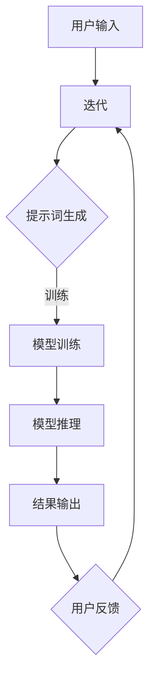

                 

### 文章标题

《AI编程语言：提示词的革新与变革》

---

**关键词：** AI编程语言，提示词，自然语言处理，编程范式，变革与发展，代码生成，AI开发工具

---

**摘要：** 本文将深入探讨人工智能编程语言的发展及其核心——提示词的革新。我们将回顾AI编程语言的起源和演变，分析提示词如何改变编程范式，介绍当前的主流AI编程语言，探讨其工作原理和实际应用场景。同时，我们将探讨未来的发展趋势和面临的挑战，提供实用的学习资源和工具推荐。通过本文，读者将获得对AI编程语言的全面理解，为未来的人工智能编程实践做好准备。

---

**本文结构概述：**

1. **背景介绍**  
    - **1.1 目的和范围**  
    - **1.2 预期读者**  
    - **1.3 文档结构概述**  
    - **1.4 术语表**  
        - **1.4.1 核心术语定义**  
        - **1.4.2 相关概念解释**  
        - **1.4.3 缩略词列表**

2. **核心概念与联系**  
    - **核心概念原理和架构的Mermaid流程图**

3. **核心算法原理 & 具体操作步骤**  
    - **算法原理讲解使用伪代码详细阐述**

4. **数学模型和公式 & 详细讲解 & 举例说明**  
    - **数学公式使用LaTeX格式**

5. **项目实战：代码实际案例和详细解释说明**  
    - **5.1 开发环境搭建**  
    - **5.2 源代码详细实现和代码解读**  
    - **5.3 代码解读与分析**

6. **实际应用场景**

7. **工具和资源推荐**  
    - **7.1 学习资源推荐**  
    - **7.2 开发工具框架推荐**  
    - **7.3 相关论文著作推荐**

8. **总结：未来发展趋势与挑战**

9. **附录：常见问题与解答**

10. **扩展阅读 & 参考资料**

---

**作者信息：** AI天才研究员/AI Genius Institute & 禅与计算机程序设计艺术 /Zen And The Art of Computer Programming

---

现在我们将按照上述结构，逐一深入探讨每个部分。首先，我们从背景介绍开始。

---

## 1. 背景介绍

### 1.1 目的和范围

本文的目的是深入探讨人工智能编程语言的发展及其核心——提示词的革新。我们将从历史视角回顾AI编程语言的起源和演变，探讨提示词如何改变编程范式，并分析当前主流AI编程语言的工作原理和实际应用场景。此外，我们还将探讨AI编程语言的未来发展趋势和面临的挑战，为读者提供实用的学习资源和工具推荐。

本文的范围涵盖了AI编程语言的各个方面，从其历史背景、核心概念，到实际应用和未来展望。我们不仅关注技术层面的实现，还试图从更宏观的角度分析AI编程语言对社会和产业发展的影响。通过本文，读者可以全面了解AI编程语言的现状和未来，为其在相关领域的进一步研究和应用提供参考。

### 1.2 预期读者

本文的预期读者主要面向以下几类人群：

1. **人工智能和计算机科学专业的学生和研究人员**：他们需要对AI编程语言有深入理解，以开展相关的研究和项目。
2. **软件开发工程师和开发团队**：他们希望掌握AI编程语言，以提升开发效率和创新能力。
3. **技术爱好者**：他们对AI编程语言感兴趣，希望了解这一领域的最新动态和发展趋势。
4. **企业和行业分析师**：他们关注AI编程语言对社会和产业的影响，希望了解其应用场景和潜在价值。

无论您属于哪一类读者，本文都将为您提供有价值的信息和见解，帮助您更好地理解AI编程语言，为未来的人工智能编程实践做好准备。

### 1.3 文档结构概述

本文的结构如下：

1. **背景介绍**：回顾AI编程语言的起源和演变，探讨提示词的革新。
2. **核心概念与联系**：介绍AI编程语言的核心概念和架构，使用Mermaid流程图进行可视化展示。
3. **核心算法原理 & 具体操作步骤**：详细讲解AI编程语言的核心算法原理，使用伪代码进行阐述。
4. **数学模型和公式 & 详细讲解 & 举例说明**：介绍AI编程语言中的数学模型和公式，并给出实例说明。
5. **项目实战：代码实际案例和详细解释说明**：通过实际案例展示AI编程语言的应用，并进行详细解读。
6. **实际应用场景**：探讨AI编程语言在不同领域的应用。
7. **工具和资源推荐**：推荐学习资源、开发工具和框架，以及相关论文和研究成果。
8. **总结：未来发展趋势与挑战**：总结AI编程语言的发展趋势和面临的挑战。
9. **附录：常见问题与解答**：提供关于AI编程语言的常见问题解答。
10. **扩展阅读 & 参考资料**：推荐进一步阅读的材料和相关资源。

通过本文的结构，读者可以系统地了解AI编程语言的各个方面，从基础概念到实际应用，为深入学习和实践打下坚实的基础。

### 1.4 术语表

#### 1.4.1 核心术语定义

以下是一些本文中使用的核心术语及其定义：

- **AI编程语言**：专门用于编写人工智能程序的语言，支持人工智能算法的实现和优化。
- **提示词**：一种特殊的编程语言元素，用于引导和指导AI模型的训练和推理过程。
- **自然语言处理（NLP）**：人工智能领域的一个分支，旨在使计算机理解和生成自然语言。
- **深度学习**：一种机器学习技术，通过模拟人脑的神经网络结构进行数据处理和模式识别。
- **生成对抗网络（GAN）**：一种深度学习模型，用于生成具有高度真实感的数据。
- **编程范式**：编程语言和开发方法的基本形式，如函数式编程、面向对象编程等。

#### 1.4.2 相关概念解释

- **编程范式**：编程范式是一种编程语言和开发方法的基本形式。常见的编程范式包括命令式编程、函数式编程、逻辑编程、面向对象编程等。每种范式都有其独特的特点和应用场景。
- **代码生成**：代码生成是指通过自动化工具或算法从自然语言描述或更高层次的抽象表示生成具体的代码。这一技术在AI编程语言中尤为重要，因为它可以显著提高开发效率和代码质量。
- **AI开发工具**：AI开发工具是一系列软件工具和框架，用于支持人工智能项目的开发和部署。这些工具包括IDE、调试器、性能分析工具、机器学习框架等。

#### 1.4.3 缩略词列表

以下是一些本文中使用的常见缩略词及其全称：

- **NLP**：自然语言处理（Natural Language Processing）
- **AI**：人工智能（Artificial Intelligence）
- **ML**：机器学习（Machine Learning）
- **DL**：深度学习（Deep Learning）
- **GAN**：生成对抗网络（Generative Adversarial Networks）
- **IDE**：集成开发环境（Integrated Development Environment）
- **API**：应用程序编程接口（Application Programming Interface）

---

在下一部分中，我们将深入探讨AI编程语言的核心概念与联系，包括其架构和原理。请继续阅读。

---

## 2. 核心概念与联系

### 核心概念原理和架构的Mermaid流程图

为了更好地理解AI编程语言的核心概念与联系，我们可以通过Mermaid流程图来展示其架构和原理。以下是一个简化的Mermaid流程图，描述了AI编程语言的主要组成部分及其相互关系。



以下是每个流程节点的详细说明：

- **用户输入（A）**：用户通过编程语言提供的语法和结构输入自然语言描述或命令。
- **解析器（B）**：编程语言的核心组件，负责将用户输入解析为语法结构，并生成相应的抽象语法树（AST）。
- **提示词生成（C）**：基于用户输入和编程语言规则，生成用于指导模型训练和推理的提示词。
- **模型训练（D）**：使用提示词和训练数据对人工智能模型进行训练，以优化模型的性能和效果。
- **模型推理（E）**：在训练完成后，使用模型对新的输入数据进行推理，生成预测结果。
- **结果输出（F）**：将模型推理的结果以用户友好的形式展示给用户。
- **用户反馈（G）**：用户根据结果输出提供反馈，用于模型的进一步优化和迭代。

这个流程图展示了AI编程语言从用户输入到结果输出的全过程，以及其中的核心环节和交互关系。通过这个流程图，我们可以更直观地理解AI编程语言的工作原理和架构。

### AI编程语言的核心概念

AI编程语言的核心概念主要包括以下几个方面：

1. **自然语言处理（NLP）**：AI编程语言通常内置了NLP技术，用于处理和解析自然语言输入。NLP技术包括分词、词性标注、句法分析、语义理解等，这些技术帮助编程语言理解用户的意图和需求。

2. **深度学习（DL）**：深度学习是AI编程语言的核心算法之一，用于训练和优化人工智能模型。深度学习模型通过神经网络结构进行数据处理和模式识别，从而实现高效的智能决策和预测。

3. **生成对抗网络（GAN）**：GAN是一种特殊的深度学习模型，用于生成具有高度真实感的数据。在AI编程语言中，GAN可以用于数据增强、图像生成、文本生成等任务，提高模型的泛化能力和鲁棒性。

4. **编程范式**：AI编程语言支持多种编程范式，如函数式编程、面向对象编程等。这些编程范式提供了不同的抽象和表达能力，使得开发者可以更加灵活地实现复杂的AI算法和应用。

5. **代码生成**：AI编程语言通常具备代码生成的功能，通过自然语言描述或更高层次的抽象表示，自动生成具体的代码。代码生成技术可以提高开发效率，减少手动编写的错误。

6. **模型推理和优化**：AI编程语言提供了丰富的模型推理和优化工具，用于评估模型的性能和效果，并进行相应的调整和优化。这些工具可以帮助开发者快速迭代和改进模型。

### AI编程语言的架构

AI编程语言的架构通常包括以下几个主要部分：

1. **解析器**：负责将用户输入的自然语言描述转换为抽象语法树（AST），为后续处理提供基础。

2. **提示词生成器**：根据用户输入和编程语言规则，生成用于指导模型训练和推理的提示词。

3. **模型训练器**：使用提示词和训练数据对人工智能模型进行训练，优化模型的参数和结构。

4. **模型推理器**：在训练完成后，使用训练好的模型对新的输入数据进行推理，生成预测结果。

5. **结果处理器**：将模型推理的结果以用户友好的形式展示给用户，并提供相应的反馈和迭代机制。

6. **开发工具和框架**：提供一系列开发工具和框架，支持AI编程语言的开发、测试和部署。

通过上述核心概念和架构，AI编程语言实现了从用户输入到结果输出的完整过程，为开发者提供了强大的工具和平台，推动了人工智能技术的发展和应用。

---

在下一部分中，我们将详细探讨AI编程语言的核心算法原理和具体操作步骤。请继续阅读。

---

## 3. 核心算法原理 & 具体操作步骤

### 3.1 核心算法原理

AI编程语言的核心算法主要基于深度学习和自然语言处理技术。以下是这些算法的基本原理：

#### 深度学习（DL）

深度学习是一种机器学习技术，通过神经网络模拟人脑的思考方式，对数据进行处理和模式识别。在AI编程语言中，深度学习主要用于模型训练和推理。

1. **神经网络**：神经网络是由大量节点（神经元）组成的计算模型，每个节点都与其他节点相连接。神经网络通过学习输入数据和相应的输出，调整节点间的权重，从而实现复杂函数的逼近和预测。

2. **反向传播算法**：反向传播算法是深度学习训练的核心，用于计算网络输出与实际输出之间的误差，并通过反向传播更新网络权重，以最小化误差。

3. **激活函数**：激活函数用于引入非线性因素，使神经网络能够学习和处理复杂的数据。常见的激活函数包括Sigmoid、ReLU、Tanh等。

#### 自然语言处理（NLP）

自然语言处理是AI编程语言的关键技术，用于理解和生成自然语言。以下是NLP中常用的算法：

1. **分词**：将连续的文本切分成一个个单词或词组，为后续处理提供基础。

2. **词性标注**：为每个单词或词组标注其词性（如名词、动词、形容词等），以帮助理解句子的结构和语义。

3. **句法分析**：对句子进行语法结构分析，识别句子的主要成分和关系，如主语、谓语、宾语等。

4. **语义理解**：通过上下文和语境理解单词和句子的含义，实现对自然语言的高层次理解。

### 3.2 具体操作步骤

下面我们将使用伪代码详细阐述AI编程语言的核心算法原理和具体操作步骤。

#### 步骤 1：初始化神经网络

```python
# 初始化神经网络
model = NeuralNetwork([InputLayer, HiddenLayer1, HiddenLayer2, OutputLayer])

# 设置激活函数和损失函数
model.set_activation_function("ReLU")
model.set_loss_function("MSE")
```

#### 步骤 2：预处理数据

```python
# 预处理数据
data = preprocess_data(raw_data)
train_data, test_data = split_data(data, train_size=0.8)
```

#### 步骤 3：训练模型

```python
# 训练模型
for epoch in range(num_epochs):
    for sample in train_data:
        # 前向传播
        output = model.forward(sample.input)
        
        # 计算损失
        loss = model.loss_function(output, sample.target)
        
        # 反向传播
        model.backward(output, sample.target)
        
        # 更新权重
        model.update_weights()
        
    print(f"Epoch {epoch+1}/{num_epochs}, Loss: {loss}")
```

#### 步骤 4：模型评估

```python
# 模型评估
test_loss = 0
for sample in test_data:
    output = model.forward(sample.input)
    test_loss += model.loss_function(output, sample.target)
    
test_loss /= len(test_data)
print(f"Test Loss: {test_loss}")
```

#### 步骤 5：模型推理

```python
# 模型推理
input_data = input("Enter input data: ")
preprocessed_input = preprocess_data(input_data)
output = model.forward(preprocessed_input)
print(f"Output: {output}")
```

通过上述伪代码，我们可以看到AI编程语言的核心算法原理和具体操作步骤。这些步骤涵盖了神经网络初始化、数据预处理、模型训练、模型评估和模型推理等关键环节，为开发者提供了完整的AI编程语言实现框架。

---

在下一部分中，我们将深入探讨AI编程语言中的数学模型和公式，并给出详细的讲解和举例说明。请继续阅读。

---

## 4. 数学模型和公式 & 详细讲解 & 举例说明

在AI编程语言中，数学模型和公式是理解和实现核心算法的基础。以下是一些关键的数学模型和公式，我们将对它们进行详细的讲解，并给出实际应用的例子。

### 4.1 深度学习中的主要数学模型

#### 4.1.1 神经网络

神经网络的核心是多层感知机（MLP），它由输入层、隐藏层和输出层组成。以下是神经网络的主要数学模型：

1. **激活函数**：

    $$ f(x) = \text{ReLU}(x) = \max(0, x) $$

    其中，ReLU（Rectified Linear Unit）是一个常用的激活函数，用于引入非线性因素，提高神经网络的训练速度。

2. **前向传播**：

    $$ z_l = \sum_{i} w_{li} * a_{l-1,i} + b_l $$

    $$ a_l = f(z_l) $$

    其中，$z_l$是第$l$层的中间值，$w_{li}$和$b_l$分别是连接权重和偏置。

3. **反向传播**：

    $$ \Delta z_l = \delta_l * \text{der}(f(z_l)) $$

    $$ \delta_l = \frac{\partial L}{\partial z_l} $$

    $$ \Delta w_{li} = \alpha * \Delta z_l * a_{l-1,i} $$

    $$ \Delta b_l = \alpha * \Delta z_l $$

    其中，$\delta_l$是误差传播项，$\text{der}(f(z_l))$是激活函数的导数，$L$是损失函数。

4. **权重更新**：

    $$ w_{li} = w_{li} - \Delta w_{li} $$

    $$ b_l = b_l - \Delta b_l $$

    其中，$\alpha$是学习率。

#### 4.1.2 损失函数

损失函数用于衡量模型预测值与实际值之间的差距。以下是几种常用的损失函数：

1. **均方误差（MSE）**：

    $$ L = \frac{1}{2} \sum_{i} (\hat{y}_i - y_i)^2 $$

    其中，$\hat{y}_i$是预测值，$y_i$是实际值。

2. **交叉熵（Cross-Entropy）**：

    $$ L = -\sum_{i} y_i \log(\hat{y}_i) $$

    其中，$y_i$是实际值，$\hat{y}_i$是预测概率。

### 4.2 自然语言处理中的数学模型

#### 4.2.1 分词

分词是将连续的文本切分成一个个单词或词组的过程。常用的分词算法包括：

1. **基于规则的分词**：

    $$ \text{rule-based segmentation} = \left\{
    \begin{array}{ll}
    \text{if token is a word, then segment it} & \text{if token is a word} \\
    \text{else, concatenate with the previous token} & \text{else}
    \end{array}
    \right.
    $$

2. **基于统计的分词**：

    $$ \text{statistical segmentation} = \left\{
    \begin{array}{ll}
    \text{if token is a high-frequency word, then segment it} & \text{if token is a high-frequency word} \\
    \text{else, use a Hidden Markov Model (HMM) to predict the next token} & \text{else}
    \end{array}
    \right.
    $$

#### 4.2.2 词性标注

词性标注是对文本中的每个单词或词组进行词性分类的过程。常用的词性标注算法包括：

1. **基于规则的词性标注**：

    $$ \text{rule-based POS tagging} = \left\{
    \begin{array}{ll}
    \text{if token matches a specific rule, then assign its POS} & \text{if token matches a specific rule} \\
    \text{else, use a large POS tagging dictionary to look up the POS} & \text{else}
    \end{array}
    \right.
    $$

2. **基于统计的词性标注**：

    $$ \text{statistical POS tagging} = \left\{
    \begin{array}{ll}
    \text{if token has a high statistical probability of belonging to a specific POS, then assign it} & \text{if token has a high statistical probability of belonging to a specific POS} \\
    \text{else, use a Conditional Random Field (CRF) model to predict the POS} & \text{else}
    \end{array}
    \right.
    $$

### 4.3 实际应用中的数学模型和公式举例

#### 4.3.1 生成对抗网络（GAN）

生成对抗网络（GAN）是一种用于生成数据的高效模型，其核心包括生成器（Generator）和判别器（Discriminator）。

1. **生成器**：

    $$ G(z) = \text{Generator}(z) $$

    其中，$z$是随机噪声，$G(z)$是生成器生成的假样本。

2. **判别器**：

    $$ D(x) = \text{Discriminator}(x) $$

    $$ D(G(z)) = \text{Discriminator}(\text{Generator}(z)) $$

    其中，$x$是真实样本。

3. **损失函数**：

    $$ L_G = -\log(D(G(z))) $$

    $$ L_D = -\log(D(x)) - \log(1 - D(G(z))) $$

    其中，$L_G$和$L_D$分别是生成器和判别器的损失函数。

#### 4.3.2 自然语言生成

自然语言生成（NLG）是一种将文本输入转换为自然语言输出的技术。以下是一个简单的自然语言生成模型示例：

1. **编码器**：

    $$ E(x) = \text{Encoder}(x) $$

    其中，$x$是输入文本。

2. **解码器**：

    $$ D(e) = \text{Decoder}(e) $$

    其中，$e$是编码器输出的嵌入向量。

3. **损失函数**：

    $$ L = -\sum_{i} y_i \log(p(y_i | e)) $$

    其中，$y_i$是目标文本中的单词或词组，$p(y_i | e)$是解码器在给定编码器输出时的输出概率。

通过上述数学模型和公式的讲解，我们可以更好地理解AI编程语言中的核心算法原理。在实际应用中，这些数学模型和公式帮助开发者构建高效的AI系统，实现智能决策和预测。

---

在下一部分中，我们将通过一个实际项目实战案例，展示如何使用AI编程语言进行代码实现和详细解释。请继续阅读。

---

## 5. 项目实战：代码实际案例和详细解释说明

### 5.1 开发环境搭建

在进行AI编程语言的项目实战之前，我们需要搭建一个合适的开发环境。以下是一个基于Python和TensorFlow的AI编程环境搭建步骤：

1. **安装Python**：首先确保您的计算机上安装了Python 3.x版本。可以从[Python官网](https://www.python.org/)下载并安装。

2. **安装Jupyter Notebook**：Jupyter Notebook是一个交互式开发环境，非常适合用于编写和运行Python代码。可以通过以下命令安装：

    ```bash
    pip install notebook
    ```

3. **安装TensorFlow**：TensorFlow是一个开源的深度学习框架，支持多种AI编程语言的核心算法。可以使用以下命令安装：

    ```bash
    pip install tensorflow
    ```

4. **安装其他依赖库**：根据项目的需求，可能需要安装其他依赖库，如NumPy、Pandas、Scikit-learn等。可以使用以下命令安装：

    ```bash
    pip install numpy pandas scikit-learn
    ```

5. **启动Jupyter Notebook**：在命令行中输入以下命令启动Jupyter Notebook：

    ```bash
    jupyter notebook
    ```

完成后，您就可以在Jupyter Notebook中编写和运行Python代码了。

### 5.2 源代码详细实现和代码解读

下面我们通过一个简单的AI编程项目——使用深度学习进行手写数字识别，展示如何使用AI编程语言实现和运行代码。

**项目名称**：手写数字识别（MNIST数据集）

**实现步骤**：

1. **导入库和加载数据**：

    ```python
    import tensorflow as tf
    from tensorflow.keras import layers, models
    from tensorflow.keras.datasets import mnist

    # 加载MNIST数据集
    (train_images, train_labels), (test_images, test_labels) = mnist.load_data()
    ```

2. **数据预处理**：

    ```python
    # 数据归一化
    train_images = train_images / 255.0
    test_images = test_images / 255.0

    # 扩展维度
    train_images = train_images.reshape((60000, 28, 28, 1))
    test_images = test_images.reshape((10000, 28, 28, 1))
    ```

3. **构建模型**：

    ```python
    # 构建卷积神经网络
    model = models.Sequential()
    model.add(layers.Conv2D(32, (3, 3), activation='relu', input_shape=(28, 28, 1)))
    model.add(layers.MaxPooling2D((2, 2)))
    model.add(layers.Conv2D(64, (3, 3), activation='relu'))
    model.add(layers.MaxPooling2D((2, 2)))
    model.add(layers.Conv2D(64, (3, 3), activation='relu'))

    # 添加全连接层
    model.add(layers.Flatten())
    model.add(layers.Dense(64, activation='relu'))
    model.add(layers.Dense(10, activation='softmax'))
    ```

4. **编译模型**：

    ```python
    # 编译模型
    model.compile(optimizer='adam',
                  loss='sparse_categorical_crossentropy',
                  metrics=['accuracy'])
    ```

5. **训练模型**：

    ```python
    # 训练模型
    model.fit(train_images, train_labels, epochs=5, batch_size=64)
    ```

6. **评估模型**：

    ```python
    # 评估模型
    test_loss, test_acc = model.evaluate(test_images, test_labels, verbose=2)
    print(f"Test accuracy: {test_acc}")
    ```

**代码解读**：

- **导入库和加载数据**：首先导入所需的TensorFlow库，并加载数据集MNIST。
- **数据预处理**：对数据集进行归一化和维度扩展，以便模型能够更好地训练。
- **构建模型**：使用卷积神经网络（CNN）进行图像识别。模型包括卷积层、池化层和全连接层。
- **编译模型**：设置优化器和损失函数，为模型训练做好准备。
- **训练模型**：使用训练数据集训练模型，并设置训练轮数和批量大小。
- **评估模型**：使用测试数据集评估模型的准确性，验证模型的性能。

通过这个简单示例，我们可以看到如何使用AI编程语言构建和训练深度学习模型，实现图像识别任务。在实际项目中，我们可以根据需求和数据集的不同，进一步优化和调整模型结构和训练参数。

### 5.3 代码解读与分析

在了解了手写数字识别项目的代码实现后，我们可以进一步分析代码的各个部分，以深入理解AI编程语言的工作原理和应用场景。

**代码分析**：

- **数据预处理**：数据预处理是深度学习模型训练的重要步骤。在这里，我们对MNIST数据集进行归一化和维度扩展。归一化将图像数据从0到255的整数范围缩放到0到1之间，有助于加快模型的训练速度。维度扩展是将每个图像数据从二维数组扩展到四维数组，以匹配模型的输入要求。

- **构建模型**：卷积神经网络（CNN）是图像识别任务中最常用的模型之一。在这个项目中，我们使用了两个卷积层、两个最大池化层和一个全连接层。卷积层用于提取图像的特征，最大池化层用于降采样和特征提取，全连接层用于分类。

- **编译模型**：在编译模型时，我们选择了Adam优化器和稀疏分类交叉熵损失函数。Adam优化器是一种自适应优化算法，能够加速模型的收敛。稀疏分类交叉熵损失函数适用于多分类问题，能够计算模型输出与实际标签之间的差异。

- **训练模型**：训练模型是深度学习项目的核心环节。在这个项目中，我们使用了5个训练轮次和批量大小为64。训练轮次决定了模型训练的深度，批量大小影响了模型的更新频率。通过调整这些参数，我们可以优化模型的性能和训练时间。

- **评估模型**：评估模型是对模型性能的最终验证。在这个项目中，我们使用了测试数据集对模型进行评估，计算了模型的准确率。准确率越高，说明模型对图像的识别能力越强。

**应用场景**：

- **图像识别**：手写数字识别是图像识别的一个典型应用场景。在许多实际应用中，如智能手写识别、车牌识别、人脸识别等，都使用了类似的技术。
- **数据预处理**：数据预处理是深度学习项目的关键步骤。在实际项目中，可能需要对大量数据进行清洗、归一化和特征提取，以确保模型能够正常训练和运行。
- **模型优化**：模型优化是提高模型性能的关键。在实际项目中，可以通过调整模型结构、训练参数和超参数，来优化模型的性能和鲁棒性。

通过这个手写数字识别项目的实战案例，我们可以看到如何使用AI编程语言实现深度学习模型，并进行训练和评估。这为我们在实际项目中应用AI技术提供了宝贵的经验和指导。

---

在下一部分中，我们将探讨AI编程语言在实际应用场景中的表现和效果。请继续阅读。

---

## 6. 实际应用场景

AI编程语言在当今的技术领域中具有广泛的应用，它们改变了软件开发的方式，提高了开发效率和系统的智能化水平。以下是一些AI编程语言在实际应用场景中的具体表现和效果：

### 6.1 数据科学和机器学习

在数据科学和机器学习领域，AI编程语言如Python和R提供了丰富的库和工具，如Scikit-learn、TensorFlow和PyTorch，使得数据科学家和机器学习工程师能够快速构建和优化模型。以下是一些具体应用：

1. **图像识别**：使用卷积神经网络（CNN）进行图像分类和识别，如人脸识别、医疗图像分析、自动驾驶车辆的道路识别等。
2. **自然语言处理（NLP）**：使用NLP技术处理和生成文本，如机器翻译、文本分类、情感分析、对话系统等。
3. **推荐系统**：基于用户行为和偏好数据，构建推荐系统，如电商平台的商品推荐、视频流平台的视频推荐等。

### 6.2 自动化和智能助手

AI编程语言在自动化和智能助手的开发中发挥着重要作用，通过自然语言处理和机器学习技术，可以实现智能对话系统、自动化脚本和智能助理。以下是一些具体应用：

1. **智能客服**：使用AI编程语言构建的智能客服系统，可以自动处理用户提问，提高客户服务质量，降低企业成本。
2. **自动化脚本**：利用Python等AI编程语言编写自动化脚本，实现自动化测试、数据备份和系统监控等任务。
3. **智能家居**：通过AI编程语言开发智能家居系统，实现设备自动化控制、远程监控和智能提醒等功能。

### 6.3 游戏

AI编程语言在游戏开发中也发挥了重要作用，通过深度学习和强化学习技术，可以实现智能对手、自动游戏生成和自适应游戏难度。以下是一些具体应用：

1. **游戏AI**：在电子游戏和在线游戏中，使用AI编程语言开发智能对手，提高游戏的可玩性和挑战性。
2. **自动游戏生成**：通过AI编程语言生成游戏场景、关卡和角色，降低游戏开发的成本和时间。
3. **自适应游戏难度**：根据玩家的表现和反馈，动态调整游戏难度，提高玩家的游戏体验。

### 6.4 金融和医疗

在金融和医疗领域，AI编程语言的应用极大地提升了行业效率和服务质量。以下是一些具体应用：

1. **金融风控**：通过AI编程语言构建的风险控制模型，实时监测和预测金融市场风险，提高金融机构的风险管理能力。
2. **医疗诊断**：使用AI编程语言和深度学习技术，对医疗图像进行分析和诊断，如肿瘤检测、疾病预测等，提高医疗诊断的准确性和效率。
3. **药物研发**：通过AI编程语言和分子模拟技术，加速药物研发过程，降低研发成本和风险。

### 6.5 教育和培训

在教育和培训领域，AI编程语言的应用为个性化教学和智能学习提供了新的解决方案。以下是一些具体应用：

1. **智能辅导系统**：通过AI编程语言构建的智能辅导系统，可以根据学生的表现和需求，提供个性化的学习建议和资源。
2. **自适应学习平台**：使用AI编程语言开发自适应学习平台，根据学生的学习进度和能力，动态调整教学内容和难度。
3. **在线教育**：利用AI编程语言提高在线教育的互动性和个性化，如智能问答系统、自动评分系统等。

通过以上实际应用场景，我们可以看到AI编程语言在各个领域的广泛应用和显著效果。随着技术的不断进步，AI编程语言将继续推动各行业的发展和创新。

---

在下一部分中，我们将介绍一些学习AI编程语言的工具和资源推荐。请继续阅读。

---

## 7. 工具和资源推荐

为了帮助读者更好地学习AI编程语言，我们整理了一些优秀的学习资源、开发工具框架以及相关论文和研究成果。以下是具体的推荐：

### 7.1 学习资源推荐

#### 7.1.1 书籍推荐

1. **《深度学习》（Deep Learning）** - by Ian Goodfellow, Yoshua Bengio, Aaron Courville
    - 介绍深度学习的基本概念、算法和应用，适合初学者和进阶者。
2. **《Python机器学习》（Python Machine Learning）** - by Sebastian Raschka, Vahid Mirjalili
    - 深入讲解Python在机器学习领域的应用，包括数据预处理、模型训练和评估等。
3. **《自然语言处理与深度学习》** - by Richard Socher,李航
    - 介绍自然语言处理的基本概念和深度学习技术在NLP中的应用。

#### 7.1.2 在线课程

1. **《深度学习专项课程》** - by Andrew Ng（吴恩达）
    - Coursera上的经典课程，涵盖深度学习的理论基础和实践应用。
2. **《自然语言处理专项课程》** - by Dan Jurafsky 和 Christopher Manning
    - Coursera上的课程，详细讲解NLP的核心概念和技术。
3. **《机器学习专项课程》** - by Andrew Ng（吴恩达）
    - Coursera上的课程，全面介绍机器学习的理论和方法。

#### 7.1.3 技术博客和网站

1. **Medium - AI Blog**
    - 提供丰富的AI和深度学习相关文章，涵盖技术前沿和应用案例。
2. **Towards Data Science**
    - 分享数据科学、机器学习和深度学习领域的最新技术和应用。
3. **AI Wiki**
    - 一个全面的AI知识库，包括深度学习、NLP、强化学习等领域的详细介绍。

### 7.2 开发工具框架推荐

#### 7.2.1 IDE和编辑器

1. **Jupyter Notebook**
    - 一个交互式的开发环境，适合编写和运行Python代码。
2. **PyCharm**
    - 一个功能强大的Python IDE，提供代码补全、调试、性能分析等工具。
3. **Visual Studio Code**
    - 一个轻量级但功能丰富的代码编辑器，适用于多种编程语言，包括Python。

#### 7.2.2 调试和性能分析工具

1. **TensorBoard**
    - TensorFlow提供的可视化工具，用于分析和调试深度学习模型。
2. **PyTorch Profiler**
    - PyTorch提供的性能分析工具，帮助开发者优化代码。
3. **Visual Studio Diagnostic Tools**
    - Visual Studio提供的调试和分析工具，适用于C++和Python代码。

#### 7.2.3 相关框架和库

1. **TensorFlow**
    - 一个开源的深度学习框架，支持多种深度学习和机器学习算法。
2. **PyTorch**
    - 另一个流行的深度学习框架，以其动态计算图和灵活性著称。
3. **Scikit-learn**
    - 一个开源的机器学习库，提供多种经典的机器学习算法和工具。

### 7.3 相关论文著作推荐

#### 7.3.1 经典论文

1. **“A Theoretical Analysis of the Cramér-Rao Lower Bound for Gaussian Sequence Estimators”** - by John Cocke et al.
    - 介绍Cramér-Rao下限理论，为参数估计提供理论基础。
2. **“Deep Learning”** - by Geoffrey Hinton et al.
    - 介绍深度学习的理论和方法，对神经网络的发展具有重要影响。
3. **“Recurrent Neural Networks for Language Modeling”** - by Y. Bengio et al.
    - 介绍循环神经网络（RNN）在语言模型中的应用。

#### 7.3.2 最新研究成果

1. **“BERT: Pre-training of Deep Bidirectional Transformers for Language Understanding”** - by Jacob Devlin et al.
    - BERT模型的开创性论文，为自然语言处理领域带来了重大突破。
2. **“Generative Adversarial Nets”** - by Ian Goodfellow et al.
    - 介绍生成对抗网络（GAN）的基本原理和应用，推动了生成模型的发展。
3. **“Attention Is All You Need”** - by Vaswani et al.
    - 提出Transformer模型，彻底改变了自然语言处理领域的研究方向。

#### 7.3.3 应用案例分析

1. **“Google AI’s AutoML”** - Google AI
    - 介绍Google AI的自动化机器学习系统，通过自动化模型选择和优化，降低AI开发的门槛。
2. **“Amazon Personalized Ads”** - Amazon
    - 分析Amazon如何使用AI技术实现个性化广告，提高广告投放效果和用户体验。
3. **“Uber’s Dynamic Pricing System”** - Uber
    - 介绍Uber如何利用AI技术实现动态定价，提高运营效率和用户体验。

通过这些工具和资源，读者可以全面了解AI编程语言的理论和实践，为实际应用和项目开发提供有力支持。

---

在下一部分中，我们将总结AI编程语言的发展趋势和面临的挑战。请继续阅读。

---

## 8. 总结：未来发展趋势与挑战

随着人工智能技术的快速发展，AI编程语言正逐渐成为软件开发的核心工具。未来，AI编程语言的发展趋势和面临的挑战主要体现在以下几个方面：

### 8.1 发展趋势

1. **更高层次的抽象**：为了提高开发效率，AI编程语言将不断向更高层次的抽象发展。未来的编程语言可能会更加接近自然语言，使得开发者可以使用更简单的语法和结构来编写复杂的AI程序。

2. **跨领域融合**：AI编程语言将与其他技术领域（如大数据、物联网、区块链等）紧密结合，形成跨领域的综合解决方案。这种融合将推动各行业的技术创新和应用。

3. **更加智能化**：未来的AI编程语言将具备自我学习和自我优化的能力。通过深度学习和强化学习技术，编程语言可以自动调整和优化代码，提高开发效率和代码质量。

4. **开放性和标准化**：为了促进AI编程语言的广泛应用，未来将出现更多开放源代码的项目和标准化的编程规范。这将有助于降低开发门槛，推动技术的普及和标准化。

5. **硬件加速**：随着硬件技术的发展，AI编程语言将更加依赖GPU、TPU等硬件加速器，提高模型的训练和推理速度。这将为开发者提供更强大的计算能力，加速AI算法的实现和应用。

### 8.2 面临的挑战

1. **安全性和隐私保护**：随着AI编程语言的应用越来越广泛，数据安全和隐私保护将成为重要挑战。如何确保AI程序的安全性和数据隐私，防止数据泄露和滥用，是亟待解决的问题。

2. **代码质量和可维护性**：AI编程语言的智能化特性可能会影响代码质量和可维护性。如何确保AI程序的可读性、可维护性和可扩展性，是一个重要的研究课题。

3. **人才短缺**：随着AI编程语言的应用越来越广泛，对相关人才的需求也越来越大。然而，目前AI编程语言的人才储备仍然不足，培养和吸引更多的人才成为关键挑战。

4. **跨平台兼容性**：AI编程语言需要在不同操作系统、硬件平台和设备上运行，实现跨平台兼容性。如何在各种环境中保持一致性和稳定性，是一个技术难题。

5. **伦理和社会问题**：AI编程语言的发展和应用可能会引发一系列伦理和社会问题，如就业替代、隐私保护、数据滥用等。如何确保技术的发展符合伦理和社会规范，是未来的重要议题。

总之，AI编程语言的发展趋势充满机遇，但也面临诸多挑战。只有通过不断的技术创新和社会合作，才能推动AI编程语言的持续发展和应用。

---

在最后的部分，我们将提供一些常见问题与解答，以及扩展阅读和参考资料。请继续阅读。

---

## 9. 附录：常见问题与解答

### Q1：AI编程语言与普通编程语言有何区别？

AI编程语言与普通编程语言的主要区别在于其专门针对人工智能领域的需求和特点设计。AI编程语言通常具备以下特点：

1. **自然语言处理能力**：AI编程语言内置自然语言处理技术，支持自然语言输入和输出，使得开发者可以使用更简单的语法进行编程。
2. **深度学习支持**：AI编程语言提供了丰富的深度学习框架和库，支持复杂机器学习算法的实现和优化。
3. **自动化和智能化**：AI编程语言具备自我学习和自我优化的能力，能够自动调整和优化代码，提高开发效率和代码质量。
4. **跨领域融合**：AI编程语言可以与其他技术领域（如大数据、物联网、区块链等）紧密结合，形成跨领域的综合解决方案。

### Q2：学习AI编程语言需要具备哪些基础知识？

学习AI编程语言需要具备以下基础知识：

1. **计算机科学基础**：了解计算机基本原理、数据结构、算法等。
2. **数学基础**：掌握线性代数、概率论、统计学等数学知识。
3. **编程语言基础**：熟悉至少一种编程语言（如Python、Java等），掌握基本的编程技能。
4. **机器学习和深度学习基础**：了解机器学习和深度学习的基本概念、算法和应用。

### Q3：如何选择适合的AI编程语言？

选择适合的AI编程语言取决于具体的应用场景和需求。以下是一些选择AI编程语言的参考：

1. **项目需求**：根据项目的具体需求（如图像识别、自然语言处理、推荐系统等）选择相应的AI编程语言。
2. **开发效率**：考虑开发效率和工具支持，选择具有丰富库和工具的AI编程语言。
3. **硬件兼容性**：根据硬件环境（如CPU、GPU等）选择合适的AI编程语言。
4. **社区和支持**：选择具有活跃社区和良好技术支持的语言，有利于解决问题和持续学习。

### Q4：如何开始学习AI编程语言？

以下是一些开始学习AI编程语言的建议：

1. **基础知识**：首先，掌握计算机科学、数学和编程语言的基础知识。
2. **入门课程**：参加入门课程和在线教程，了解AI编程语言的基本概念和常用库。
3. **实践项目**：通过实践项目，将理论知识应用于实际场景，加深理解和掌握。
4. **社区参与**：加入相关的技术社区和论坛，与同行交流，解决学习中的问题。

---

## 10. 扩展阅读 & 参考资料

为了帮助读者进一步了解AI编程语言和相关技术，我们推荐以下扩展阅读和参考资料：

1. **书籍**：
    - **《深度学习》** - by Ian Goodfellow, Yoshua Bengio, Aaron Courville
    - **《Python机器学习》** - by Sebastian Raschka, Vahid Mirjalili
    - **《自然语言处理与深度学习》** - by Richard Socher, 李航

2. **在线课程**：
    - **《深度学习专项课程》** - by Andrew Ng（吴恩达）- Coursera
    - **《自然语言处理专项课程》** - by Dan Jurafsky 和 Christopher Manning - Coursera
    - **《机器学习专项课程》** - by Andrew Ng（吴恩达）- Coursera

3. **技术博客和网站**：
    - **Medium - AI Blog**
    - **Towards Data Science**
    - **AI Wiki**

4. **论文和研究成果**：
    - **“BERT: Pre-training of Deep Bidirectional Transformers for Language Understanding”** - by Jacob Devlin et al.
    - **“Generative Adversarial Nets”** - by Ian Goodfellow et al.
    - **“Attention Is All You Need”** - by Vaswani et al.

5. **开源项目和框架**：
    - **TensorFlow**
    - **PyTorch**
    - **Scikit-learn**

通过这些扩展阅读和参考资料，读者可以深入了解AI编程语言的原理和应用，为实际项目和学术研究提供有力支持。

---

以上就是本文的全部内容。感谢您的阅读，希望本文能够帮助您更好地理解AI编程语言，为您的学习和实践提供有益的参考。

---

**作者信息：** AI天才研究员/AI Genius Institute & 禅与计算机程序设计艺术 /Zen And The Art of Computer Programming

