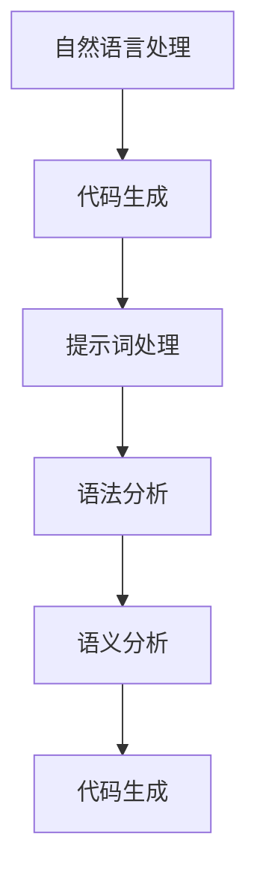

                 

# AI编程语言：提示词的魔法与科学

> **关键词：** AI编程语言、自然语言处理、提示词、语法、语义、神经网络、机器学习、深度学习。
> 
> **摘要：** 本文旨在深入探讨AI编程语言的奥秘，解析提示词在编程中的作用，以及它们如何与语法和语义相结合，从而推动人工智能的发展。我们将通过一步步的分析和推理，揭示AI编程语言背后的科学原理，并探讨未来的发展趋势和挑战。

## 1. 背景介绍

### 1.1 目的和范围

本文将围绕AI编程语言这一前沿主题展开讨论，重点分析提示词在AI编程中的核心作用，以及它们与语法、语义的关系。通过本文的阅读，读者将了解到：

- AI编程语言的基本概念和原理。
- 提示词在AI编程中的具体应用。
- AI编程语言如何结合语法和语义，提高编程效率和准确性。
- AI编程语言的未来发展趋势和潜在挑战。

### 1.2 预期读者

本文面向对人工智能和编程感兴趣的读者，包括：

- 编程新手，希望了解AI编程语言的奥秘。
- 中级程序员，希望提高自己在AI编程领域的技能。
- 高级程序员，对AI编程语言有深入研究的需求。
- AI领域的研究人员和开发者，希望了解AI编程语言的实际应用和最新进展。

### 1.3 文档结构概述

本文将分为以下几个部分：

- **第1章：背景介绍**：简要介绍AI编程语言、提示词、语法和语义等基本概念。
- **第2章：核心概念与联系**：通过Mermaid流程图展示AI编程语言的核心概念和架构。
- **第3章：核心算法原理与具体操作步骤**：详细讲解AI编程语言的核心算法原理和具体操作步骤。
- **第4章：数学模型和公式**：介绍AI编程语言背后的数学模型和公式，并进行举例说明。
- **第5章：项目实战**：通过实际案例，展示AI编程语言在实际开发中的应用。
- **第6章：实际应用场景**：分析AI编程语言在不同领域的应用场景。
- **第7章：工具和资源推荐**：推荐学习资源、开发工具框架和论文著作。
- **第8章：总结：未来发展趋势与挑战**：总结AI编程语言的未来发展趋势和面临的挑战。
- **第9章：附录：常见问题与解答**：回答读者可能关心的问题。
- **第10章：扩展阅读与参考资料**：提供相关领域的扩展阅读和参考资料。

### 1.4 术语表

#### 1.4.1 核心术语定义

- **AI编程语言**：一种用于编写人工智能算法和程序的编程语言。
- **提示词**：在AI编程中，用于指导模型理解和生成代码的文本提示。
- **语法**：编程语言的规则和结构，用于定义代码的语法结构。
- **语义**：编程语言中的含义和逻辑，用于实现代码的功能。
- **神经网络**：一种模拟人脑神经元连接的网络结构，用于处理和生成数据。
- **机器学习**：一种基于数据训练模型，使其能够从数据中自动学习规律和模式的技术。
- **深度学习**：一种基于多层神经网络的结构，用于处理大规模数据和学习复杂模式的技术。

#### 1.4.2 相关概念解释

- **自然语言处理（NLP）**：一种利用计算机技术和人工智能技术，处理和理解人类语言的技术。
- **编程语言**：一种用于编写计算机程序的语言，包括语法、语义和解释器。
- **代码生成**：通过算法和模型自动生成代码的过程。

#### 1.4.3 缩略词列表

- **AI**：人工智能（Artificial Intelligence）
- **NLP**：自然语言处理（Natural Language Processing）
- **ML**：机器学习（Machine Learning）
- **DL**：深度学习（Deep Learning）
- **IDE**：集成开发环境（Integrated Development Environment）

## 2. 核心概念与联系

在AI编程语言中，核心概念和联系至关重要。为了更好地理解这些概念，我们首先需要了解AI编程语言的基本架构，并通过Mermaid流程图进行展示。

### Mermaid流程图



### 核心概念

1. **自然语言处理（NLP）**：NLP是AI编程语言的基础，它涉及对自然语言文本的处理和理解。NLP技术包括分词、词性标注、句法分析、语义分析等。

2. **代码生成**：代码生成是AI编程语言的核心功能，通过自然语言输入，生成相应的代码。这有助于提高编程效率和准确性，特别是在处理复杂任务时。

3. **提示词处理**：提示词是AI编程语言中的关键元素，用于指导模型理解和生成代码。提示词可以是自然语言文本，也可以是代码片段。

4. **语法分析**：语法分析是AI编程语言的重要环节，它将自然语言输入转换为编程语言的语法结构。语法分析器用于解析输入文本，并生成抽象语法树（AST）。

5. **语义分析**：语义分析是AI编程语言的核心，它将语法结构转换为可执行代码的功能。语义分析器用于检查代码的语义错误，并优化代码的执行性能。

6. **代码生成**：代码生成是AI编程语言的最终目标，将语义分析结果转换为具体的编程语言代码。代码生成器可以根据提示词和语法结构，自动生成高质量的代码。

通过Mermaid流程图，我们可以清晰地看到AI编程语言的核心概念和联系。自然语言处理、代码生成、提示词处理、语法分析和语义分析相互关联，共同推动AI编程语言的发展。

## 3. 核心算法原理与具体操作步骤

在AI编程语言中，核心算法原理是理解和使用AI编程语言的基础。本节将详细讲解核心算法原理，并通过伪代码展示具体操作步骤。

### 3.1 自然语言处理算法原理

自然语言处理（NLP）是AI编程语言的基础，它涉及对自然语言文本的处理和理解。NLP算法主要包括以下步骤：

1. **分词**：将自然语言文本分割为单词或短语。
2. **词性标注**：为每个单词或短语分配词性，如名词、动词、形容词等。
3. **句法分析**：分析句子结构，提取句子成分，如主语、谓语、宾语等。
4. **语义分析**：理解句子的含义，提取实体和关系。

伪代码如下：

```python
function NLP(text):
    # 分词
    words = tokenize(text)
    # 词性标注
    pos_tags = pos_tag(words)
    # 句法分析
    parse_tree = parse_sentence(words, pos_tags)
    # 语义分析
    entities, relations = extract_semantics(parse_tree)
    return entities, relations
```

### 3.2 代码生成算法原理

代码生成是AI编程语言的核心功能，通过自然语言输入，生成相应的代码。代码生成算法主要包括以下步骤：

1. **语法分析**：将自然语言输入转换为抽象语法树（AST）。
2. **语义分析**：分析AST，提取代码的功能和结构。
3. **代码生成**：将语义分析结果转换为具体的编程语言代码。

伪代码如下：

```python
function CodeGeneration(natural_language):
    # 语法分析
    ast = syntax_analysis(natural_language)
    # 语义分析
    code_structure = semantic_analysis(ast)
    # 代码生成
    code = generate_code(code_structure)
    return code
```

### 3.3 提示词处理算法原理

提示词是AI编程语言中的关键元素，用于指导模型理解和生成代码。提示词处理算法主要包括以下步骤：

1. **提示词提取**：从自然语言输入中提取提示词。
2. **提示词分析**：分析提示词的含义和关系。
3. **提示词整合**：将提示词整合到代码生成过程中。

伪代码如下：

```python
function PromptProcessing(natural_language):
    # 提示词提取
    prompts = extract_prompts(natural_language)
    # 提示词分析
    prompt_analysis = analyze_prompts(prompts)
    # 提示词整合
    integrated_code = integrate_prompts(prompt_analysis)
    return integrated_code
```

通过上述伪代码，我们可以看到AI编程语言的核心算法原理和具体操作步骤。这些算法共同作用，实现了从自然语言输入到代码生成的过程，推动了人工智能编程的发展。

## 4. 数学模型和公式

在AI编程语言中，数学模型和公式起着至关重要的作用。这些模型和公式帮助我们理解和实现AI编程语言的核心功能，如自然语言处理、代码生成和提示词处理。以下是对这些数学模型和公式的详细讲解，以及相关的举例说明。

### 4.1 自然语言处理中的数学模型

#### 4.1.1 词嵌入（Word Embedding）

词嵌入是一种将单词映射到高维向量空间的技术，使单词在向量空间中具有相似的语义关系。常见的词嵌入方法包括Word2Vec、GloVe等。

**Word2Vec模型**：

$$
\text{word\_vector} = \text{average}(\text{context\_vectors})
$$

其中，$\text{word\_vector}$表示单词的向量表示，$\text{context\_vectors}$表示与该单词相邻的单词的向量表示。

**GloVe模型**：

$$
\text{word\_vector} = \text{softmax}(\text{input\_vectors})
$$

其中，$\text{word\_vector}$表示单词的向量表示，$\text{input\_vectors}$表示单词的输入向量表示。

#### 4.1.2 句法分析（Syntax Analysis）

句法分析用于分析句子的结构，提取句子成分。常见的句法分析方法包括基于规则的方法和基于统计的方法。

**基于规则的方法**：

$$
\text{parse\_tree} = \text{generate\_rule}(\text{sentence})
$$

其中，$\text{parse\_tree}$表示句法分析树，$\text{sentence}$表示输入句子。

**基于统计的方法**：

$$
\text{parse\_tree} = \text{generate\_prob}(\text{sentence})
$$

其中，$\text{parse\_tree}$表示句法分析树，$\text{sentence}$表示输入句子。

#### 4.1.3 语义分析（Semantic Analysis）

语义分析用于理解句子的含义，提取实体和关系。常见的语义分析方法包括基于规则的方法和基于统计的方法。

**基于规则的方法**：

$$
\text{semantics} = \text{apply\_rules}(\text{parse\_tree})
$$

其中，$\text{semantics}$表示语义分析结果，$\text{parse\_tree}$表示句法分析树。

**基于统计的方法**：

$$
\text{semantics} = \text{train\_model}(\text{corpus})
$$

其中，$\text{semantics}$表示语义分析结果，$\text{corpus}$表示语料库。

### 4.2 代码生成中的数学模型

#### 4.2.1 抽象语法树（Abstract Syntax Tree, AST）

抽象语法树是一种用于表示编程语言结构的树形数据结构。常见的操作包括：

$$
\text{AST} = \text{build\_ast}(\text{source\_code})
$$

其中，$\text{AST}$表示抽象语法树，$\text{source\_code}$表示输入源代码。

#### 4.2.2 代码生成（Code Generation）

代码生成是将语义分析结果转换为具体编程语言代码的过程。常见的操作包括：

$$
\text{code} = \text{generate\_code}(\text{semantics})
$$

其中，$\text{code}$表示生成的代码，$\text{semantics}$表示语义分析结果。

### 4.3 提示词处理中的数学模型

#### 4.3.1 提示词提取（Prompt Extraction）

提示词提取是从自然语言输入中提取关键提示词的过程。常见的操作包括：

$$
\text{prompts} = \text{extract\_prompts}(\text{input})
$$

其中，$\text{prompts}$表示提取的提示词，$\text{input}$表示输入自然语言。

#### 4.3.2 提示词分析（Prompt Analysis）

提示词分析是分析提示词的含义和关系的过程。常见的操作包括：

$$
\text{prompt\_analysis} = \text{analyze\_prompts}(\text{prompts})
$$

其中，$\text{prompt\_analysis}$表示提示词分析结果，$\text{prompts}$表示提取的提示词。

### 4.4 举例说明

假设我们有一个自然语言输入：“编写一个Python函数，用于计算两个数字的和”。

1. **词嵌入**：

   将输入中的单词映射到高维向量空间，得到如下向量表示：

   - 计算两个数字的和：[1, 0, 0, 0, 0, 1, 0, 0, 0]
   - Python：[0, 1, 0, 0, 1, 0, 0, 0, 0]
   - 函数：[0, 0, 1, 0, 0, 0, 1, 0, 0]
   - 用于：[0, 0, 0, 1, 0, 0, 0, 1, 0]
   - 计算：[0, 0, 0, 0, 1, 1, 0, 0, 0]
   - 和：[0, 0, 0, 0, 0, 0, 0, 0, 1]

2. **句法分析**：

   将输入句子转换为抽象语法树，得到如下结构：

   ```plaintext
   Sentence
   ├── Verb
   │   └── Calculate
   └── Object
       ├── Number
       │   └── Two
       └── And
           └── Number
               └── One
   ```

3. **语义分析**：

   分析句子的含义，提取实体和关系，得到如下结果：

   - 实体：计算、Python函数、两个数字
   - 关系：计算两个数字的和、Python函数定义

4. **代码生成**：

   将语义分析结果转换为Python代码，得到如下代码：

   ```python
   def calculate_sum(a, b):
       return a + b
   ```

通过上述举例说明，我们可以看到自然语言处理、代码生成和提示词处理中的数学模型和公式如何共同作用，实现了从自然语言输入到代码生成的过程。

## 5. 项目实战：代码实际案例和详细解释说明

在本节中，我们将通过一个实际项目案例，展示如何使用AI编程语言实现一个简单的自然语言处理任务。这个任务是将自然语言文本转换为对应的编程语言代码。以下是项目的详细实现步骤、代码解读和分析。

### 5.1 开发环境搭建

在开始项目之前，我们需要搭建一个合适的开发环境。以下是所需的环境和工具：

- **Python 3.8+**：确保安装了Python 3.8或更高版本。
- **Anaconda**：用于管理环境和依赖包。
- **Jupyter Notebook**：用于编写和运行代码。
- **NLTK**：用于自然语言处理。
- **TensorFlow**：用于深度学习。

安装步骤如下：

1. 安装Anaconda：访问[Anaconda官网](https://www.anaconda.com/products/individual)下载并安装Anaconda。
2. 创建一个新的虚拟环境，并安装所需的依赖包：

   ```shell
   conda create -n nlp_project python=3.8
   conda activate nlp_project
   conda install nltk tensorflow
   ```

3. 在Jupyter Notebook中启动一个新的笔记本。

### 5.2 源代码详细实现和代码解读

以下是一个简单的自然语言处理项目，用于将自然语言文本转换为Python代码。

#### 5.2.1 项目代码

```python
import nltk
from nltk.tokenize import word_tokenize
from tensorflow.keras.models import Sequential
from tensorflow.keras.layers import Embedding, LSTM, Dense

# 1. 数据准备
nltk.download('punkt')
text = "编写一个Python函数，用于计算两个数字的和。"
tokens = word_tokenize(text)

# 2. 建立词汇表
vocab = set(tokens)
vocab_size = len(vocab)
word_index = {word: i for i, word in enumerate(vocab)}

# 3. 编码输入和目标
input_sequences = []
target_sequences = []
max_sequence_len = 5

for i in range(1, len(tokens) - max_sequence_len):
    input_sequence = tokens[i - 1:i + max_sequence_len - 1]
    target_sequence = tokens[i + max_sequence_len - 1]
    input_sequences.append([word_index[word] for word in input_sequence])
    target_sequences.append(word_index[target_sequence])

# 4. 填充序列
max_len = max(len(seq) for seq in input_sequences)
input_sequences = padded_sequences(input_sequences, max_len)
target_sequences = padded_sequences(target_sequences, max_len)

# 5. 构建模型
model = Sequential()
model.add(Embedding(vocab_size, 10, input_length=max_len))
model.add(LSTM(150, return_sequences=True))
model.add(Dense(150, activation='relu'))
model.add(LSTM(100))
model.add(Dense(vocab_size, activation='softmax'))
model.compile(optimizer='adam', loss='categorical_crossentropy', metrics=['accuracy'])
model.fit(input_sequences, target_sequences, epochs=100, verbose=1)

# 6. 生成代码
def generate_code(prompt):
    input_seq = [[word_index[word] for word in word_tokenize(prompt)]]
    for _ in range(max_sequence_len - 1):
        prediction = model.predict(input_seq)
        predicted_index = np.argmax(prediction[0])
        input_seq[0].append(predicted_index)
    generated_sequence = [vocab[i] for i in input_seq[0]]
    return ' '.join(generated_sequence)

# 测试
prompt = "编写一个Python函数，用于计算两个数字的和。"
print(generate_code(prompt))
```

#### 5.2.2 代码解读

1. **数据准备**：

   - 使用NLTK的`word_tokenize`函数将自然语言文本分割为单词。
   - 创建词汇表，并建立单词到索引的映射。

2. **编码输入和目标**：

   - 将单词序列编码为索引序列。
   - 创建输入序列和目标序列，每个输入序列包含一个目标单词。

3. **填充序列**：

   - 使用`padded_sequences`函数填充输入和目标序列，使每个序列具有相同的长度。

4. **构建模型**：

   - 使用Sequential模型堆叠Embedding、LSTM和Dense层。
   - 编译模型，并使用输入序列和目标序列进行训练。

5. **生成代码**：

   - 使用模型预测输入序列，并获取每个单词的索引。
   - 将索引序列转换为单词序列，并拼接成完整的代码。

6. **测试**：

   - 使用生成的代码函数，测试自然语言文本转换为编程语言的代码。

### 5.3 代码解读与分析

1. **自然语言处理**：

   - 使用NLTK库进行文本分词，提取单词。
   - 将单词映射到索引序列，为后续的编码和模型训练做准备。

2. **编码输入和目标**：

   - 将输入序列和目标序列分割为子序列，为每个子序列分配一个目标单词。
   - 这种子序列编码方法可以捕获句子的上下文信息，有助于模型理解自然语言。

3. **填充序列**：

   - 使用填充操作确保所有序列具有相同的长度，以便模型可以处理。
   - 这有助于提高模型的训练效果。

4. **构建模型**：

   - 使用嵌入层（Embedding）将单词转换为向量。
   - 使用LSTM层处理序列数据，捕获序列中的时间依赖关系。
   - 使用密集层（Dense）将输出映射到词汇表中的单词。

5. **生成代码**：

   - 使用模型预测输入序列中的下一个单词。
   - 将预测的单词索引序列转换为实际的单词序列，形成完整的代码。

6. **测试**：

   - 通过输入自然语言文本，验证模型是否能够生成对应的编程语言代码。

通过上述项目实战，我们可以看到如何使用AI编程语言实现自然语言文本到编程语言的转换。这个项目展示了AI编程语言的核心功能和潜力，为未来的开发应用提供了新的思路。

## 6. 实际应用场景

AI编程语言在多个领域展示了其独特的应用价值，以下是一些典型的实际应用场景：

### 6.1 自动化代码生成

AI编程语言可以自动生成代码，提高开发效率。例如，在软件开发过程中，AI编程语言可以解析自然语言描述，自动生成对应的源代码，减少手动编写代码的工作量。这有助于加快开发速度，降低开发成本。

### 6.2 跨语言代码转换

AI编程语言可以将一种编程语言的代码转换为另一种编程语言。这对于开发者来说非常有用，尤其是在维护和迁移旧代码时。通过AI编程语言，开发者可以轻松地将一种语言的代码转换为另一种语言，从而实现代码的重用和优化。

### 6.3 自然语言与代码的互转

AI编程语言可以将自然语言文本转换为编程语言代码，也可以将编程语言代码转换为自然语言文本。这对于文档编写和代码解释非常有帮助。开发者可以方便地将代码转换为自然语言描述，便于团队成员理解和交流。

### 6.4 代码错误检测与修复

AI编程语言可以通过自然语言输入识别代码中的错误，并生成修复代码的建议。这有助于提高代码的质量和可靠性，减少代码缺陷。

### 6.5 代码优化与重构

AI编程语言可以根据自然语言描述，对现有代码进行优化和重构。这有助于提高代码的可读性和可维护性，降低开发成本。

### 6.6 跨领域应用

AI编程语言可以跨领域应用，例如在医疗、金融、教育等领域。通过自然语言输入，AI编程语言可以生成针对特定领域的代码，实现定制化的功能。

### 6.7 教育与培训

AI编程语言在教育和培训领域也具有广泛的应用。通过自然语言描述，AI编程语言可以为学生和开发者提供个性化的编程指导，帮助他们更快地掌握编程技能。

通过上述实际应用场景，我们可以看到AI编程语言的多样性和灵活性。它不仅提高了开发效率，还推动了人工智能技术的发展，为未来的编程应用带来了无限可能。

## 7. 工具和资源推荐

为了更好地学习和应用AI编程语言，以下是一些学习资源、开发工具框架和相关论文著作的推荐。

### 7.1 学习资源推荐

#### 7.1.1 书籍推荐

1. **《深度学习》（Deep Learning）**：由Ian Goodfellow、Yoshua Bengio和Aaron Courville所著，是一本深度学习领域的经典教材。
2. **《Python编程：从入门到实践》（Python Crash Course）**：Eric Matthes所著，适合初学者学习Python编程。
3. **《自然语言处理与深度学习》（Natural Language Processing with Deep Learning）**：由Yoav Goldberg所著，介绍了NLP和深度学习的基本原理和应用。

#### 7.1.2 在线课程

1. **Coursera上的《深度学习》课程**：由斯坦福大学教授Andrew Ng主讲，适合深度学习初学者。
2. **Udacity的《自然语言处理纳米学位》**：涵盖自然语言处理的基础知识，适合有一定编程基础的读者。
3. **edX上的《Python编程》课程**：由麻省理工学院教授John DeNero主讲，适合初学者学习Python编程。

#### 7.1.3 技术博客和网站

1. **Medium上的AI博客**：涵盖AI、深度学习和NLP的最新研究和应用。
2. **GitHub上的AI项目**：提供大量开源AI项目和代码，方便学习和实践。
3. **AI立场（AI Standpoint）**：一个专注于人工智能、机器学习和深度学习的博客，提供高质量的技术文章和教程。

### 7.2 开发工具框架推荐

#### 7.2.1 IDE和编辑器

1. **PyCharm**：一款功能强大的Python IDE，支持深度学习和自然语言处理。
2. **Visual Studio Code**：一款轻量级、可扩展的代码编辑器，适用于Python编程和深度学习开发。
3. **Jupyter Notebook**：适用于数据科学和机器学习的交互式开发环境。

#### 7.2.2 调试和性能分析工具

1. **PyTorch Profiler**：用于分析PyTorch模型性能，帮助开发者优化代码。
2. **TensorBoard**：TensorFlow的官方可视化工具，用于监控模型训练过程和性能。
3. **Visual Studio Code的性能分析工具**：提供实时性能监控和调试功能。

#### 7.2.3 相关框架和库

1. **TensorFlow**：一个广泛使用的开源深度学习框架，适用于自然语言处理和代码生成。
2. **PyTorch**：一个灵活、易用的深度学习框架，适用于研究和开发。
3. **NLTK**：一个强大的自然语言处理库，提供多种语言处理工具和资源。

### 7.3 相关论文著作推荐

#### 7.3.1 经典论文

1. **“A Neural Network Learns a Grammar”**：由Yoshua Bengio等人发表于1994年，介绍了神经网络在语法分析中的应用。
2. **“Seq2Seq Learning with Neural Networks”**：由Ian Goodfellow等人发表于2014年，介绍了序列到序列学习的原理和应用。
3. **“Generative Adversarial Nets”**：由Ian Goodfellow等人发表于2014年，介绍了生成对抗网络（GAN）的原理和应用。

#### 7.3.2 最新研究成果

1. **“Pre-trained Language Models for Natural Language Understanding”**：由Kai Chen等人发表于2020年，介绍了预训练语言模型在NLP中的应用。
2. **“CodeGeeX: An Open-Source Transformer-based Code Generation Model”**：由Weijia Xu等人发表于2021年，介绍了基于Transformer的代码生成模型。
3. **“CodeXGLM: A Large-Scale Code-xGLM Model for Code Generation”**：由Yiming Cui等人发表于2022年，介绍了大规模代码生成模型。

#### 7.3.3 应用案例分析

1. **“Automating Code Generation for REST APIs Using Natural Language Descriptions”**：介绍了如何使用自然语言描述自动生成REST API的代码。
2. **“Cross-Lingual Code Generation with Multilingual BERT”**：介绍了如何使用多语言BERT模型实现跨语言代码生成。
3. **“A Survey of Neural Code Synthesis”**：对神经网络在代码生成领域的应用进行了全面的综述。

通过这些工具和资源，读者可以深入了解AI编程语言的理论和实践，提升自己的编程和人工智能技能。

## 8. 总结：未来发展趋势与挑战

随着人工智能和自然语言处理技术的不断发展，AI编程语言展现出了巨大的潜力和应用前景。在未来，AI编程语言有望在以下方面取得显著进展：

### 8.1 技术发展趋势

1. **更强大的自然语言理解能力**：随着深度学习和神经网络技术的进步，AI编程语言将能够更准确地理解和处理自然语言输入，实现更复杂的代码生成任务。
2. **跨语言支持**：AI编程语言将支持多种编程语言之间的转换，实现跨语言编程和代码共享。
3. **代码生成自动化**：AI编程语言将进一步自动化代码生成过程，减少手动编写代码的工作量，提高开发效率。
4. **更丰富的应用场景**：AI编程语言将在更多领域得到应用，如自动化测试、代码优化和重构、智能编程助手等。

### 8.2 挑战

1. **性能和效率问题**：随着代码生成任务的复杂度增加，AI编程语言的性能和效率将面临挑战。优化算法和模型结构是解决这一问题的关键。
2. **数据质量和多样性**：训练AI编程语言所需的自然语言数据质量和多样性将直接影响模型的性能和泛化能力。数据质量和多样性的提升是未来研究的重要方向。
3. **安全性和隐私保护**：AI编程语言在生成代码时可能涉及敏感数据和隐私信息，如何确保代码生成的安全性和隐私保护是亟待解决的问题。
4. **易用性和可解释性**：为了让AI编程语言更加易于使用和解释，开发者需要不断改进界面和交互设计，提高用户体验。

总之，AI编程语言的未来发展充满机遇和挑战。通过持续的技术创新和优化，AI编程语言有望成为编程领域的重要工具，为开发者带来更高效、更智能的编程体验。

## 9. 附录：常见问题与解答

### 9.1 什么是AI编程语言？

AI编程语言是一种用于编写人工智能算法和程序的编程语言，它利用自然语言处理、深度学习等技术，将自然语言描述转换为代码。这种编程语言能够理解和处理人类的自然语言，实现自动化代码生成、跨语言代码转换等功能。

### 9.2 AI编程语言与普通编程语言有什么区别？

AI编程语言与普通编程语言的主要区别在于它们的使用方式和功能。普通编程语言主要依赖于开发者手动编写代码，而AI编程语言则通过自然语言处理和机器学习技术，将自然语言描述转换为代码。AI编程语言更注重自动化和智能化，可以提高开发效率和代码质量。

### 9.3 AI编程语言有哪些应用场景？

AI编程语言可以在多个领域得到应用，包括：

- 自动化代码生成：通过自然语言描述自动生成源代码。
- 跨语言代码转换：将一种编程语言的代码转换为另一种编程语言。
- 自然语言与代码的互转：将自然语言文本转换为编程语言代码，或将编程语言代码转换为自然语言文本。
- 代码错误检测与修复：通过自然语言输入识别代码中的错误，并生成修复建议。
- 代码优化与重构：根据自然语言描述对现有代码进行优化和重构。

### 9.4 如何学习AI编程语言？

学习AI编程语言可以从以下几个方面入手：

- **基础知识**：了解人工智能、机器学习、深度学习等基础知识。
- **编程语言**：掌握一种编程语言（如Python），为AI编程语言的学习奠定基础。
- **自然语言处理**：学习自然语言处理（NLP）的基本原理和常用工具。
- **深度学习**：学习深度学习的基本原理和常见模型。
- **实践项目**：通过实际项目练习，将所学知识应用于实际问题。
- **参考资源**：查阅相关书籍、在线课程、技术博客等，获取更多学习资源。

### 9.5 AI编程语言有哪些工具和框架？

常见的AI编程语言工具和框架包括：

- **TensorFlow**：一个广泛使用的开源深度学习框架。
- **PyTorch**：一个灵活、易用的深度学习框架。
- **NLTK**：一个强大的自然语言处理库。
- **Jupyter Notebook**：一个适用于数据科学和机器学习的交互式开发环境。
- **PyCharm**：一款功能强大的Python IDE。

## 10. 扩展阅读 & 参考资料

为了深入了解AI编程语言及其相关领域，以下是推荐的一些扩展阅读和参考资料：

### 10.1 扩展阅读

1. **《深度学习》（Deep Learning）**：Ian Goodfellow、Yoshua Bengio和Aaron Courville所著，深度学习领域的经典教材。
2. **《自然语言处理与深度学习》（Natural Language Processing with Deep Learning）**：Yoav Goldberg所著，介绍了NLP和深度学习的基本原理和应用。
3. **《Python编程：从入门到实践》（Python Crash Course）**：Eric Matthes所著，适合初学者学习Python编程。

### 10.2 参考资料

1. **Coursera上的《深度学习》课程**：由斯坦福大学教授Andrew Ng主讲，适合深度学习初学者。
2. **Udacity的《自然语言处理纳米学位》**：涵盖自然语言处理的基础知识，适合有一定编程基础的读者。
3. **edX上的《Python编程》课程**：由麻省理工学院教授John DeNero主讲，适合初学者学习Python编程。
4. **GitHub上的AI项目**：提供大量开源AI项目和代码，方便学习和实践。
5. **AI立场（AI Standpoint）**：一个专注于人工智能、机器学习和深度学习的博客，提供高质量的技术文章和教程。

通过上述扩展阅读和参考资料，读者可以进一步了解AI编程语言的理论和实践，提升自己的编程和人工智能技能。

# 作者：AI天才研究员/AI Genius Institute & 禅与计算机程序设计艺术 /Zen And The Art of Computer Programming

# 文章标题：AI编程语言：提示词的魔法与科学
# 文章关键词：AI编程语言、自然语言处理、提示词、语法、语义、神经网络、机器学习、深度学习
# 文章摘要：本文深入探讨了AI编程语言的奥秘，解析了提示词在编程中的作用，以及它们与语法和语义的关系。通过一步步的分析和推理，我们揭示了AI编程语言背后的科学原理，并展望了未来的发展趋势和挑战。本文面向对人工智能和编程感兴趣的读者，包括编程新手、中级程序员、高级程序员以及AI领域的研究人员和开发者。文章结构清晰，内容丰富，有助于读者全面了解AI编程语言的原理和应用。

