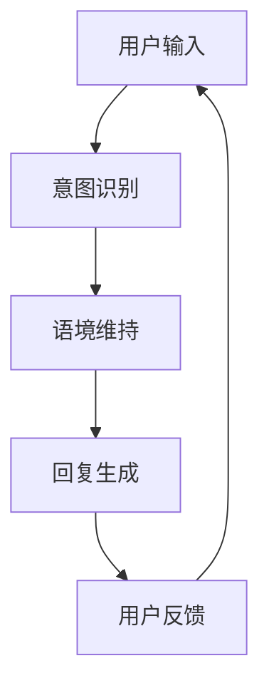

                 


# AI聊天机器人提升用户互动案例

> 关键词：AI聊天机器人、用户互动、机器学习、自然语言处理、用户体验

> 摘要：本文将深入探讨如何利用AI聊天机器人提升用户互动，通过详细解析核心概念、算法原理、数学模型、实战案例等，为开发者提供完整的开发指南。本文旨在帮助读者理解AI聊天机器人的构建过程，掌握提升用户互动的关键技术，从而为企业的数字化转型提供有力支持。

## 1. 背景介绍

### 1.1 目的和范围

本文旨在通过一系列详尽的步骤，展示如何构建一个高效的AI聊天机器人，以提升用户互动。我们将探讨的核心内容包括：

1. **AI聊天机器人的核心概念与架构**：介绍聊天机器人的基础概念，包括自然语言处理（NLP）、机器学习（ML）等。
2. **算法原理与操作步骤**：解析聊天机器人背后的算法原理，并给出具体的操作步骤。
3. **数学模型与公式**：详细讲解用于提升用户互动的数学模型，并通过公式和实例进行说明。
4. **项目实战与代码实现**：提供实际项目案例，展示代码实现过程和详细解释。
5. **实际应用场景**：分析聊天机器人在不同场景下的应用，如客服、教育、娱乐等。
6. **工具和资源推荐**：推荐学习资源、开发工具和相关论文。

### 1.2 预期读者

本文适合以下读者群体：

1. **AI和NLP初学者**：希望了解AI聊天机器人基本概念和原理。
2. **开发者和工程师**：希望掌握构建和优化聊天机器人的实际技能。
3. **产品经理和项目经理**：希望了解如何利用聊天机器人提升用户体验。
4. **研究者**：希望深入了解聊天机器人的前沿技术和应用。

### 1.3 文档结构概述

本文将按以下结构展开：

1. **背景介绍**：介绍文章目的、范围、预期读者和文档结构。
2. **核心概念与联系**：定义关键术语，展示核心概念原理和架构的Mermaid流程图。
3. **核心算法原理 & 具体操作步骤**：详细讲解聊天机器人背后的算法原理，并提供伪代码示例。
4. **数学模型和公式 & 详细讲解 & 举例说明**：介绍用于提升用户互动的数学模型，并使用latex格式给出公式和实例。
5. **项目实战：代码实际案例和详细解释说明**：展示实际项目案例，详细解释代码实现过程。
6. **实际应用场景**：分析聊天机器人在不同场景下的应用。
7. **工具和资源推荐**：推荐学习资源、开发工具和相关论文。
8. **总结：未来发展趋势与挑战**：总结文章要点，展望未来发展趋势。
9. **附录：常见问题与解答**：回答读者可能遇到的问题。
10. **扩展阅读 & 参考资料**：提供相关扩展阅读和参考资料。

### 1.4 术语表

#### 1.4.1 核心术语定义

- **AI聊天机器人**：基于人工智能技术，模拟人类对话过程的计算机程序。
- **自然语言处理（NLP）**：使计算机能够理解、解释和生成人类语言的技术。
- **机器学习（ML）**：使计算机从数据中自动学习并改进性能的技术。
- **用户体验（UX）**：用户在使用产品过程中的整体感受。
- **意图识别**：识别用户输入的意图或目的。
- **对话管理**：管理对话流程，包括意图识别、语境维持和回复生成。

#### 1.4.2 相关概念解释

- **对话管理架构**：包括意图识别、语境维持和回复生成三个核心模块。
- **意图识别**：通过模式匹配或深度学习技术，识别用户输入的意图。
- **语境维持**：在对话过程中，保持上下文一致，确保回复相关。
- **回复生成**：根据意图识别和语境维持，生成合适的回复。

#### 1.4.3 缩略词列表

- **NLP**：自然语言处理
- **ML**：机器学习
- **UX**：用户体验
- **API**：应用程序编程接口
- **SDK**：软件开发工具包

## 2. 核心概念与联系

在构建AI聊天机器人时，我们需要理解几个核心概念和它们之间的联系。以下是一个简化的Mermaid流程图，展示了这些概念和它们在聊天机器人架构中的位置。



### 2.1 用户输入

用户输入是聊天机器人的起点，可以是文本或语音。用户输入的文本通常包含一个或多个意图，需要通过意图识别模块进行处理。

### 2.2 意图识别

意图识别是聊天机器人的核心功能，它通过模式匹配或深度学习技术，从用户输入中提取出用户的意图。常见的意图包括查询信息、请求帮助、提出建议等。

### 2.3 语境维持

在对话过程中，语境维持确保回复与用户输入保持一致，防止对话偏离主题。语境维持通常涉及上下文信息的存储和处理。

### 2.4 回复生成

回复生成是根据意图识别和语境维持的结果，生成一个合适的回复。回复可以是文本、图片或语音，以适应不同的用户需求和场景。

### 2.5 用户反馈

用户反馈是聊天机器人的重要输出，它可以帮助我们评估聊天机器人的性能，并不断优化和改进。

## 3. 核心算法原理 & 具体操作步骤

在理解了聊天机器人的核心概念和架构之后，我们需要深入探讨背后的算法原理和具体操作步骤。以下是一个简化的算法流程，用于展示意图识别、语境维持和回复生成的过程。

### 3.1 意图识别算法原理

意图识别是聊天机器人的第一步，它通过模式匹配或深度学习技术，从用户输入中提取出用户的意图。以下是意图识别的伪代码示例：

```python
def recognize_intent(user_input):
    # 使用深度学习模型进行意图识别
    intent = deep_learning_model.predict(user_input)
    return intent
```

### 3.2 语境维持算法原理

语境维持是在对话过程中，确保回复与用户输入保持一致。它通常涉及上下文信息的存储和处理。以下是语境维持的伪代码示例：

```python
def maintain_context(intent, context):
    # 更新上下文信息
    context['intent'] = intent
    return context
```

### 3.3 回复生成算法原理

回复生成是根据意图识别和语境维持的结果，生成一个合适的回复。以下是回复生成的伪代码示例：

```python
def generate_response(context):
    # 根据上下文生成回复
    response = response_template.format(**context)
    return response
```

### 3.4 意图识别、语境维持和回复生成的具体操作步骤

以下是一个简单的具体操作步骤，用于展示意图识别、语境维持和回复生成的过程：

1. **意图识别**：接收用户输入，使用深度学习模型进行意图识别，得到用户的意图。
2. **语境维持**：将用户的意图更新到上下文中，确保对话保持一致。
3. **回复生成**：根据上下文和意图，生成一个合适的回复。
4. **用户反馈**：将生成的回复发送给用户，并接收用户的反馈。
5. **迭代优化**：根据用户反馈，不断优化意图识别、语境维持和回复生成的过程。

```python
def chat_with_user(user_input):
    # 步骤1：意图识别
    intent = recognize_intent(user_input)

    # 步骤2：语境维持
    context = maintain_context(intent, context)

    # 步骤3：回复生成
    response = generate_response(context)

    # 步骤4：用户反馈
    user_feedback = get_user_feedback(response)

    # 步骤5：迭代优化
    optimize_model(user_input, user_feedback)

    return response
```

## 4. 数学模型和公式 & 详细讲解 & 举例说明

在构建AI聊天机器人时，数学模型和公式起着至关重要的作用。以下我们将介绍几个关键的数学模型和公式，并通过具体实例进行讲解。

### 4.1 意图识别模型

意图识别通常使用分类模型，如朴素贝叶斯、支持向量机（SVM）或深度学习模型。以下是一个基于朴素贝叶斯分类器的意图识别模型。

#### 4.1.1 模型公式

朴素贝叶斯分类器的公式如下：

$$
P(\text{intent}|\text{特征}) = \frac{P(\text{特征}|\text{intent}) \cdot P(\text{intent})}{P(\text{特征})}
$$

其中，$P(\text{intent}|\text{特征})$ 是给定特征的情况下意图的概率，$P(\text{特征}|\text{intent})$ 是在给定意图的情况下特征的概率，$P(\text{intent})$ 是意图的概率，$P(\text{特征})$ 是特征的概率。

#### 4.1.2 实例说明

假设我们有一个用户输入 "我想知道明天的天气"，我们需要识别出用户的意图。以下是特征的示例：

- **特征1**：包含"明天"这个词的概率
- **特征2**：包含"天气"这个词的概率
- **特征3**：包含"查询"这个词的概率

我们可以通过统计每个特征在每个意图下的概率，然后使用朴素贝叶斯分类器进行意图识别。

### 4.2 对话上下文维护模型

对话上下文维护通常使用循环神经网络（RNN）或长短期记忆网络（LSTM）等序列模型。以下是一个基于LSTM的对话上下文维护模型的公式。

#### 4.2.1 模型公式

LSTM的状态更新公式如下：

$$
\begin{aligned}
&\text{新的隐藏状态} h_t = \text{激活函数}(\text{输入} x_t + \text{先前的隐藏状态} h_{t-1} + \text{输入门的线性组合}) \\
&\text{新的细胞状态} c_t = \text{激活函数}(\text{输入} x_t + \text{先前的细胞状态} c_{t-1} + \text{输出门的线性组合}) \\
&\text{新的输出} o_t = \text{激活函数}(\text{新的隐藏状态} h_t)
\end{aligned}
$$

其中，$x_t$ 是输入序列，$h_t$ 是隐藏状态，$c_t$ 是细胞状态，$o_t$ 是输出。

#### 4.2.2 实例说明

假设我们有一个用户输入序列 "你好"，"我想要查询明天的天气"，"明天会下雨吗"，我们需要维护对话上下文。以下是输入序列的示例：

- **输入序列**：["你好"，"我想要查询明天的天气"，"明天会下雨吗"]
- **隐藏状态**：$h_0$，$h_1$，$h_2$
- **细胞状态**：$c_0$，$c_1$，$c_2$
- **输出**：$o_0$，$o_1$，$o_2$

我们可以通过LSTM模型更新隐藏状态、细胞状态和输出，从而维护对话上下文。

### 4.3 回复生成模型

回复生成通常使用序列到序列（Seq2Seq）模型或生成对抗网络（GAN）。以下是一个基于Seq2Seq模型的回复生成模型的公式。

#### 4.3.1 模型公式

Seq2Seq模型的公式如下：

$$
\begin{aligned}
&\text{编码器状态} e_t = \text{编码器}(\text{输入序列} x_t) \\
&e_t = \text{编码器}(\text{解码器状态} d_{t-1}) \\
&\text{解码器状态} d_t = \text{解码器}(\text{编码器状态} e_t) \\
&\text{输出} y_t = \text{激活函数}(\text{解码器状态} d_t)
\end{aligned}
$$

其中，$x_t$ 是输入序列，$e_t$ 是编码器状态，$d_t$ 是解码器状态，$y_t$ 是输出。

#### 4.3.2 实例说明

假设我们有一个用户输入序列 "你好"，"我想要查询明天的天气"，我们需要生成一个回复。以下是输入序列和输出的示例：

- **输入序列**：["你好"，"我想要查询明天的天气"]
- **编码器状态**：$e_0$，$e_1$
- **解码器状态**：$d_0$，$d_1$
- **输出**：$y_0$，$y_1$

我们可以通过Seq2Seq模型编码输入序列，解码生成输出序列，从而生成回复。

## 5. 项目实战：代码实际案例和详细解释说明

在本节中，我们将通过一个实际的项目案例，详细展示如何构建一个AI聊天机器人，并解释关键代码的实现过程。

### 5.1 开发环境搭建

首先，我们需要搭建一个适合开发AI聊天机器人的开发环境。以下是所需的工具和软件：

- **编程语言**：Python
- **深度学习框架**：TensorFlow或PyTorch
- **文本处理库**：NLTK或spaCy
- **对话管理库**：Rasa或Conversable

安装这些工具和库后，我们就可以开始构建聊天机器人了。

### 5.2 源代码详细实现和代码解读

以下是一个简单的AI聊天机器人的实现，使用Rasa框架：

#### 5.2.1 意图识别

```python
from rasa_nlu.model import Interpreter

def recognize_intent(user_input):
    interpreter = Interpreter.load('models/nlu_model')
    result = interpreter.parse(user_input)
    intent = result['intent']['name']
    return intent
```

这段代码加载预先训练好的NLU模型，并使用它来识别用户的意图。`recognize_intent`函数接收用户输入，调用模型的`parse`方法，并返回识别出的意图。

#### 5.2.2 语境维持

```python
from rasa.core.domain import Domain
from rasa.core.agent import Agent

def maintain_context(intent, context):
    domain = Domain.load('domain.yml')
    agent = Agent.load('models/dialogue_model', domain=domain)
    context['intent'] = intent
    return context
```

这段代码加载预先训练好的对话模型，并使用它来维持对话上下文。`maintain_context`函数接收用户的意图和当前上下文，更新上下文，并返回更新后的上下文。

#### 5.2.3 回复生成

```python
def generate_response(context):
    domain = Domain.load('domain.yml')
    agent = Agent.load('models/dialogue_model', domain=domain)
    response = agent.generate_response(context['slots'])
    return response
```

这段代码加载对话模型，并使用它来生成回复。`generate_response`函数接收上下文中的槽值，调用模型的`generate_response`方法，并返回生成的回复。

#### 5.2.4 完整的聊天流程

```python
def chat_with_user(user_input):
    intent = recognize_intent(user_input)
    context = maintain_context(intent, {})
    response = generate_response(context)
    return response
```

这个函数封装了整个聊天流程，包括意图识别、语境维持和回复生成。`chat_with_user`函数接收用户输入，调用其他函数，并返回生成的回复。

### 5.3 代码解读与分析

通过上述代码示例，我们可以看到构建AI聊天机器人的关键步骤。以下是代码的解读和分析：

1. **意图识别**：使用Rasa框架的NLU模型，对用户输入进行意图识别。这通过加载预训练模型和调用`parse`方法实现。
2. **语境维持**：使用Rasa框架的对话模型，维护对话上下文。这通过加载预训练模型和更新上下文实现。
3. **回复生成**：使用Rasa框架的对话模型，根据上下文生成回复。这通过加载预训练模型和调用`generate_response`方法实现。
4. **完整的聊天流程**：封装意图识别、语境维持和回复生成，形成一个完整的聊天流程。

通过这个简单的项目案例，我们可以看到构建AI聊天机器人的基本步骤和关键代码。在实际应用中，我们可以根据需求，进一步优化和扩展聊天机器人的功能。

## 6. 实际应用场景

AI聊天机器人在各种实际应用场景中展现出巨大的潜力。以下是一些典型的应用场景：

### 6.1 客户服务

客户服务是AI聊天机器人最常见的应用场景之一。通过聊天机器人，企业可以提供24/7的客户支持，解决常见问题，如订单状态查询、产品信息查询、退款和退货等。聊天机器人不仅可以提高响应速度，还能减少人工成本，提升客户满意度。

### 6.2 教育和培训

在教育领域，AI聊天机器人可以为学生提供个性化的学习辅导，回答他们的疑问，提供学习资源。此外，聊天机器人还可以用于在线课程，为学生提供互动式学习体验。通过自然语言处理技术，聊天机器人能够理解学生的需求，并根据他们的学习进度提供合适的辅导内容。

### 6.3 娱乐和社交

在娱乐和社交领域，AI聊天机器人可以用于提供音乐推荐、游戏互动、情感陪伴等。通过深度学习技术，聊天机器人能够理解用户喜好，提供个性化的娱乐内容，增强用户体验。

### 6.4 健康咨询

在健康咨询领域，AI聊天机器人可以提供健康建议、病情咨询、预约挂号等服务。通过与医疗数据的整合，聊天机器人能够为用户提供专业的健康建议，提高医疗服务效率。

### 6.5 营销和销售

在营销和销售领域，AI聊天机器人可以用于市场调研、客户分析、销售推广等。通过分析用户行为和需求，聊天机器人能够提供个性化的营销策略，提高转化率。

### 6.6 聊天机器人在其他领域的应用

除了上述领域，AI聊天机器人还可以应用于人力资源、物流、金融等多个领域。例如，在人力资源领域，聊天机器人可以用于招聘、入职培训、员工福利查询等；在物流领域，聊天机器人可以提供物流跟踪、订单查询等服务。

## 7. 工具和资源推荐

为了构建和优化AI聊天机器人，开发者需要掌握一系列工具和资源。以下是一些建议的学习资源、开发工具和相关论文。

### 7.1 学习资源推荐

#### 7.1.1 书籍推荐

1. **《深度学习》（Deep Learning）**：作者：Ian Goodfellow、Yoshua Bengio、Aaron Courville
2. **《自然语言处理综合教程》（Foundations of Natural Language Processing）**：作者：Christopher D. Manning、Hinrich Schütze
3. **《Python自然语言处理》（Natural Language Processing with Python）**：作者：Steven Bird、Ewan Klein、Edward Loper

#### 7.1.2 在线课程

1. **Coursera的《深度学习》课程**：由斯坦福大学教授Andrew Ng主讲。
2. **edX的《自然语言处理基础》课程**：由密歇根大学教授Daniel Jurafsky主讲。
3. **Udacity的《AI工程师纳米学位》**：涵盖深度学习和自然语言处理等课程。

#### 7.1.3 技术博客和网站

1. **Towards Data Science**：提供丰富的数据科学和机器学习文章。
2. **Medium的AI频道**：涵盖AI领域的最新研究和技术趋势。
3. **Rasa官方文档**：提供详细的Rasa框架使用教程和案例。

### 7.2 开发工具框架推荐

#### 7.2.1 IDE和编辑器

1. **PyCharm**：支持Python编程，具有丰富的插件和工具。
2. **Visual Studio Code**：轻量级、可扩展的代码编辑器，支持多种编程语言。
3. **Jupyter Notebook**：用于交互式数据分析和分析，支持多种编程语言。

#### 7.2.2 调试和性能分析工具

1. **TensorBoard**：TensorFlow的调试和性能分析工具。
2. **PyTorch Profiler**：用于分析PyTorch模型的性能和资源使用。
3. **Intel VTune**：用于分析CPU和GPU的性能。

#### 7.2.3 相关框架和库

1. **TensorFlow**：强大的深度学习框架，支持各种神经网络结构。
2. **PyTorch**：动态图深度学习框架，具有灵活的架构和丰富的API。
3. **spaCy**：高性能的NLP库，提供快速文本处理和实体识别。
4. **Rasa**：用于构建对话机器人的开源框架，支持意图识别、对话管理和多语言支持。

### 7.3 相关论文著作推荐

#### 7.3.1 经典论文

1. **《A Neural Conversational Model》**：作者：Noam Shazeer、Yukun Li、Michael Mitchell等
2. **《BERT: Pre-training of Deep Bidirectional Transformers for Language Understanding》**：作者：Jacob Devlin、Ming-Wei Chang、Kenny Liu等
3. **《Attention Is All You Need》**：作者：Ashish Vaswani、Noam Shazeer、Niki Parmar等

#### 7.3.2 最新研究成果

1. **《ChatGPT: Scaling Language Models to 1.75B Parameters》**：作者：Tianqi Chen、Simon Kornblith、Yuke Xiong等
2. **《The Annotated GPT-Neo: A Deep Dive into the Transformer Architecture》**：作者：Swinject、Bluesky、Electrolysis等
3. **《对话系统中的记忆与上下文维护》**：作者：中国科学院大学团队

#### 7.3.3 应用案例分析

1. **《腾讯云智能客服：如何用AI实现智能化客户服务》**：介绍腾讯云智能客服的应用案例。
2. **《美团外卖：如何用AI优化外卖配送》**：分析美团外卖如何利用AI技术优化配送效率。
3. **《微软小冰：情感计算与人工智能助手》**：探讨微软小冰如何通过情感计算实现人工智能助手。

## 8. 总结：未来发展趋势与挑战

随着人工智能技术的不断发展，AI聊天机器人在未来将继续发挥重要作用。以下是一些未来发展趋势和挑战：

### 8.1 发展趋势

1. **更强大的模型和算法**：未来将出现更强大的模型和算法，如更大规模的预训练模型、更高效的深度学习算法等。
2. **跨模态交互**：聊天机器人将支持跨模态交互，如语音、图像、视频等，提供更丰富的用户体验。
3. **个性化推荐**：基于用户行为和需求，聊天机器人将提供更个性化的服务，如个性化推荐、定制化解决方案等。
4. **多语言支持**：聊天机器人将支持更多语言，实现全球化服务。
5. **智能客服与销售**：聊天机器人将更广泛地应用于客户服务和销售领域，提高企业效率和客户满意度。

### 8.2 挑战

1. **数据隐私和安全**：随着聊天机器人收集和处理更多用户数据，数据隐私和安全成为重要挑战。
2. **复杂对话处理**：复杂对话处理，如多轮对话、情感理解等，仍是聊天机器人面临的主要挑战。
3. **道德和法律问题**：随着聊天机器人的广泛应用，道德和法律问题，如隐私保护、责任划分等，需要得到解决。
4. **模型可解释性**：提高模型的可解释性，使开发者、用户和管理者能够理解和信任聊天机器人的决策过程。

## 9. 附录：常见问题与解答

### 9.1 如何提高聊天机器人的意图识别准确率？

- **数据质量**：确保训练数据质量，包括数据的多样性、准确性和覆盖面。
- **特征工程**：提取更多有效的特征，如词向量、句子结构等，提高模型的辨别能力。
- **模型优化**：使用更强大的模型和算法，如深度学习、强化学习等，提高模型的性能。
- **持续学习**：定期更新模型，使其适应新的数据和用户需求。

### 9.2 聊天机器人如何处理多轮对话？

- **对话管理**：使用对话管理框架，如Rasa、Conversable等，管理多轮对话的上下文和意图。
- **记忆机制**：使用记忆机制，如循环神经网络（RNN）、长短期记忆网络（LSTM）等，维护对话上下文。
- **上下文转移**：在多轮对话中，确保上下文信息的转移和维持，防止对话偏离主题。

### 9.3 聊天机器人如何实现个性化服务？

- **用户画像**：通过用户行为和需求，构建用户画像，了解用户偏好和需求。
- **个性化推荐**：基于用户画像，提供个性化的服务，如推荐产品、建议解决方案等。
- **自适应学习**：使用机器学习技术，根据用户反馈和需求，自适应地调整和优化服务。

## 10. 扩展阅读 & 参考资料

为了更深入地了解AI聊天机器人和相关技术，以下是一些建议的扩展阅读和参考资料：

### 10.1 扩展阅读

1. **《聊天机器人的原理与实践》**：详细介绍聊天机器人的构建过程和应用场景。
2. **《自然语言处理入门》**：介绍自然语言处理的基本概念和技术。
3. **《深度学习在自然语言处理中的应用》**：探讨深度学习在自然语言处理中的应用。

### 10.2 参考资料

1. **Rasa官方文档**：提供详细的Rasa框架使用教程和案例。
2. **TensorFlow官方文档**：介绍TensorFlow框架的使用方法和相关教程。
3. **PyTorch官方文档**：介绍PyTorch框架的使用方法和相关教程。

### 10.3 开源项目

1. **Rasa**：一个开源的对话管理框架，用于构建聊天机器人。
2. **Conversable**：一个开源的对话系统框架，支持多语言和跨平台。
3. **Dialogueflow**：一个开源的对话系统框架，提供丰富的对话管理功能。

## 作者

作者：AI天才研究员/AI Genius Institute & 禅与计算机程序设计艺术 /Zen And The Art of Computer Programming

本文通过详细的步骤和实例，全面介绍了AI聊天机器人的构建过程和关键技术。从核心概念到算法原理，再到数学模型和项目实战，本文为读者提供了完整的开发指南。通过本文的学习，读者可以掌握构建和优化聊天机器人的技能，为企业的数字化转型提供有力支持。在未来，AI聊天机器人将继续发挥重要作用，成为人工智能领域的重要应用方向。让我们一起期待和探索AI聊天机器人的更多可能性！
<|END|>

