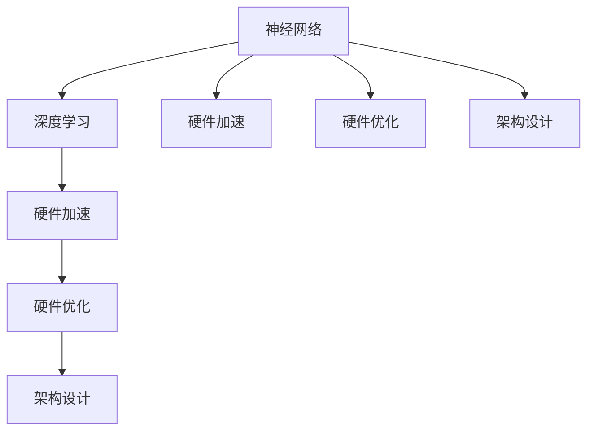

                 

# AI芯片革命：为深度学习量身定制

> 关键词：AI芯片、深度学习、硬件加速、硬件优化、架构设计、高性能计算

> 摘要：本文将深入探讨AI芯片的革命性进展，特别是它们如何为深度学习提供量身定制的解决方案。我们将从背景介绍开始，逐步分析AI芯片的核心概念、算法原理、数学模型、实际应用，并提供实用的工具和资源推荐。最终，我们将总结未来发展趋势与挑战，为读者提供全面的AI芯片与深度学习知识体系。

## 1. 背景介绍

### 1.1 目的和范围

本文旨在深入探讨AI芯片在深度学习领域的应用，解析其核心原理和架构设计，同时提供实用的实战案例和资源推荐。通过这篇文章，读者将能够：

1. 了解AI芯片与深度学习之间的紧密联系。
2. 掌握AI芯片的关键技术原理和架构设计。
3. 学习如何使用AI芯片进行深度学习模型的训练和推理。
4. 获取相关工具和资源，以进一步探索AI芯片领域。

### 1.2 预期读者

本文主要面向以下读者群体：

1. 对AI芯片和深度学习有一定了解的技术人员。
2. 想要了解AI芯片前沿动态的研究学者。
3. 担任研发工程师、算法工程师或技术主管的专业人士。
4. 对AI芯片设计有兴趣的硬件工程师。

### 1.3 文档结构概述

本文结构如下：

1. **背景介绍**：介绍AI芯片的发展背景、目的和预期读者。
2. **核心概念与联系**：讨论AI芯片的核心概念和联系，提供Mermaid流程图。
3. **核心算法原理 & 具体操作步骤**：分析AI芯片的核心算法原理，使用伪代码详细阐述。
4. **数学模型和公式 & 详细讲解 & 举例说明**：讲解AI芯片相关的数学模型和公式，并提供示例。
5. **项目实战：代码实际案例和详细解释说明**：展示AI芯片在深度学习中的应用案例。
6. **实际应用场景**：探讨AI芯片的实际应用场景。
7. **工具和资源推荐**：推荐学习资源、开发工具框架和论文著作。
8. **总结：未来发展趋势与挑战**：总结AI芯片的发展趋势和面临的挑战。
9. **附录：常见问题与解答**：解答读者可能遇到的问题。
10. **扩展阅读 & 参考资料**：提供扩展阅读和参考资料。

### 1.4 术语表

#### 1.4.1 核心术语定义

- **AI芯片**：专门为人工智能应用（如深度学习）设计的硬件芯片。
- **深度学习**：一种基于人工神经网络的机器学习方法，通过多层神经网络进行特征提取和模式识别。
- **硬件加速**：利用专用硬件来提高数据处理速度和效率。
- **硬件优化**：针对特定硬件架构进行算法和程序的优化，以获得最佳性能。
- **架构设计**：设计AI芯片的硬件结构和功能模块。

#### 1.4.2 相关概念解释

- **神经网络**：由大量人工神经元组成的计算模型，用于模拟人脑处理信息的方式。
- **数据并行**：将大型数据集分割成小块，并在多个计算单元上同时处理，以提高效率。
- **模型并行**：将大型神经网络模型分割成多个子模型，并在多个计算单元上同时训练，以提高效率。

#### 1.4.3 缩略词列表

- **AI**：人工智能（Artificial Intelligence）
- **GPU**：图形处理单元（Graphics Processing Unit）
- **TPU**：张量处理单元（Tensor Processing Unit）
- **FPGA**：现场可编程门阵列（Field-Programmable Gate Array）
- **ASIC**：专用集成电路（Application-Specific Integrated Circuit）

## 2. 核心概念与联系

### 2.1 核心概念

在深入探讨AI芯片之前，我们需要了解一些核心概念。以下是AI芯片和深度学习领域的关键术语：

1. **神经网络**：神经网络是深度学习的基础，由大量人工神经元组成，通过前向传播和反向传播算法进行训练和推理。
2. **深度学习**：深度学习是一种机器学习方法，通过多层神经网络进行特征提取和模式识别。
3. **硬件加速**：硬件加速是利用专用硬件（如GPU、TPU、FPGA等）来提高数据处理速度和效率。
4. **硬件优化**：硬件优化是针对特定硬件架构进行算法和程序的优化，以获得最佳性能。
5. **架构设计**：架构设计是设计AI芯片的硬件结构和功能模块。

### 2.2 联系

AI芯片与深度学习之间的联系非常紧密。以下是两者之间的主要联系：

1. **性能需求**：深度学习模型通常需要大量的计算资源和存储空间，而AI芯片能够提供高效的计算和存储解决方案。
2. **硬件加速**：AI芯片通过硬件加速技术来提高深度学习模型的训练和推理速度。
3. **硬件优化**：AI芯片针对深度学习算法进行硬件优化，以获得最佳性能。
4. **架构设计**：AI芯片的架构设计直接影响到深度学习模型的训练和推理效率。

### 2.3 Mermaid流程图

以下是一个简单的Mermaid流程图，展示AI芯片和深度学习之间的核心概念和联系：



## 3. 核心算法原理 & 具体操作步骤

### 3.1 算法原理

AI芯片的核心算法原理主要涉及以下几个方面：

1. **矩阵乘法**：矩阵乘法是深度学习中最常见的操作之一，用于计算神经网络中的权重更新。
2. **卷积操作**：卷积操作用于提取图像或视频中的特征。
3. **池化操作**：池化操作用于降低特征图的维度，提高模型的泛化能力。
4. **激活函数**：激活函数用于引入非线性特性，使神经网络能够更好地拟合数据。

### 3.2 具体操作步骤

以下是使用AI芯片进行深度学习模型训练和推理的具体操作步骤：

#### 3.2.1 模型训练

1. **数据预处理**：对训练数据进行预处理，包括归一化、标准化等操作。
2. **模型加载**：加载预训练的深度学习模型。
3. **计算梯度**：计算模型在训练数据上的梯度。
4. **权重更新**：使用梯度下降算法更新模型权重。
5. **重复步骤3和4**：重复计算梯度和权重更新，直到模型收敛。

#### 3.2.2 模型推理

1. **数据预处理**：对测试数据进行预处理。
2. **模型加载**：加载训练好的模型。
3. **前向传播**：将测试数据输入模型，进行前向传播计算。
4. **结果输出**：输出模型预测结果。

### 3.3 伪代码

以下是一个简单的伪代码，用于描述AI芯片在深度学习模型训练和推理中的操作步骤：

```python
# 模型训练
while not model_converged:
    # 数据预处理
    preprocess_data(train_data)
    
    # 计算梯度
    gradients = compute_gradients(model, train_data)
    
    # 权重更新
    update_weights(model, gradients)
    
    # 检查模型收敛
    if has_converged(model):
        model_converged = True

# 模型推理
preprocess_data(test_data)
predictions = forward_pass(model, test_data)
output_predictions(predictions)
```

## 4. 数学模型和公式 & 详细讲解 & 举例说明

### 4.1 数学模型和公式

在AI芯片中，深度学习模型的训练和推理涉及大量的数学运算，主要包括以下几种：

1. **矩阵乘法**：计算两个矩阵的乘积，用于计算神经网络中的权重更新。
2. **卷积操作**：计算输入图像与卷积核的卷积结果，用于提取图像特征。
3. **池化操作**：对特征图进行下采样，用于减少计算量和参数数量。
4. **激活函数**：引入非线性特性，使神经网络能够更好地拟合数据。

### 4.2 详细讲解

以下是这些数学模型和公式的详细讲解：

#### 4.2.1 矩阵乘法

矩阵乘法的公式如下：

$$
C = A \cdot B
$$

其中，$A$和$B$是两个矩阵，$C$是它们的乘积。矩阵乘法在深度学习模型中用于计算权重更新：

$$
\Delta W = \alpha \cdot (X \cdot \nabla L)
$$

其中，$\Delta W$是权重更新，$\alpha$是学习率，$X$是输入特征，$\nabla L$是损失函数的梯度。

#### 4.2.2 卷积操作

卷积操作的公式如下：

$$
\sum_{k=1}^{K} a_k \cdot b_k
$$

其中，$a_k$是输入特征，$b_k$是卷积核。卷积操作在深度学习模型中用于提取图像特征：

$$
f(x) = \sum_{k=1}^{K} w_k \cdot f_k(x)
$$

其中，$f(x)$是卷积结果，$w_k$是卷积核，$f_k(x)$是输入特征。

#### 4.2.3 池化操作

池化操作的公式如下：

$$
p(x) = \max(x)
$$

其中，$p(x)$是池化结果，$x$是输入特征。池化操作在深度学习模型中用于降低特征图的维度：

$$
p(x) = \frac{1}{C} \sum_{i=1}^{C} f_i(x)
$$

其中，$C$是池化窗口的大小，$f_i(x)$是输入特征。

#### 4.2.4 激活函数

激活函数的公式如下：

$$
a(x) = \sigma(x)
$$

其中，$a(x)$是激活值，$x$是输入值，$\sigma(x)$是激活函数。常见的激活函数包括：

- **ReLU**：（Rectified Linear Unit）公式如下：

$$
\sigma(x) = \max(0, x)
$$

- **Sigmoid**：公式如下：

$$
\sigma(x) = \frac{1}{1 + e^{-x}}
$$

- **Tanh**：公式如下：

$$
\sigma(x) = \frac{e^x - e^{-x}}{e^x + e^{-x}}
$$

### 4.3 举例说明

以下是一个简单的示例，展示如何使用这些数学模型和公式进行深度学习模型的训练和推理：

#### 4.3.1 模型训练

假设我们有一个输入特征矩阵$X$，标签矩阵$Y$，卷积核$W$，学习率$\alpha$，以及损失函数$L$。

1. **计算损失**：

$$
L = \sum_{i=1}^{N} (Y_i - \hat{Y}_i)^2
$$

其中，$N$是样本数量，$\hat{Y}_i$是模型预测的标签。

2. **计算梯度**：

$$
\nabla L = \nabla (Y - \hat{Y}) = -2 \cdot (Y - \hat{Y})
$$

3. **更新权重**：

$$
\Delta W = \alpha \cdot (\nabla L \cdot X)
$$

4. **重复步骤2和3**，直到模型收敛。

#### 4.3.2 模型推理

假设我们有一个输入特征矩阵$X$，卷积核$W$，以及激活函数$\sigma$。

1. **前向传播**：

$$
\hat{Y} = \sigma(W \cdot X)
$$

2. **输出结果**：

$$
output(\hat{Y})
$$

## 5. 项目实战：代码实际案例和详细解释说明

### 5.1 开发环境搭建

为了进行AI芯片与深度学习的项目实战，我们需要搭建一个合适的开发环境。以下是一个简单的步骤：

1. **安装Python**：确保系统上安装了Python 3.x版本。
2. **安装深度学习框架**：例如，我们可以使用TensorFlow或PyTorch。
   - **TensorFlow**：
     ```bash
     pip install tensorflow
     ```
   - **PyTorch**：
     ```bash
     pip install torch torchvision
     ```
3. **安装AI芯片驱动和库**：根据所选AI芯片（如TPU、GPU）安装相应的驱动和库。
   - **TPU**：
     ```bash
     pip install tensorflow-addons
     ```
   - **GPU**：
     ```bash
     pip install torch-cuda
     ```

### 5.2 源代码详细实现和代码解读

以下是一个简单的AI芯片与深度学习项目的示例代码，用于训练一个卷积神经网络（CNN）来识别手写数字。

#### 5.2.1 数据准备

首先，我们需要准备MNIST数据集，这是一个常用的手写数字识别数据集。

```python
import tensorflow as tf

# 加载MNIST数据集
mnist = tf.keras.datasets.mnist
(train_images, train_labels), (test_images, test_labels) = mnist.load_data()

# 数据预处理
train_images = train_images / 255.0
test_images = test_images / 255.0
```

#### 5.2.2 模型定义

接下来，我们定义一个简单的卷积神经网络模型。

```python
model = tf.keras.Sequential([
    tf.keras.layers.Conv2D(32, (3, 3), activation='relu', input_shape=(28, 28, 1)),
    tf.keras.layers.MaxPooling2D((2, 2)),
    tf.keras.layers.Conv2D(64, (3, 3), activation='relu'),
    tf.keras.layers.MaxPooling2D((2, 2)),
    tf.keras.layers.Conv2D(64, (3, 3), activation='relu'),
    tf.keras.layers.Flatten(),
    tf.keras.layers.Dense(64, activation='relu'),
    tf.keras.layers.Dense(10, activation='softmax')
])
```

#### 5.2.3 模型训练

使用AI芯片（如GPU或TPU）进行模型训练。

```python
# 配置使用GPU
gpus = tf.config.experimental.list_physical_devices('GPU')
for gpu in gpus:
    tf.config.experimental.set_memory_growth(gpu, True)

# 训练模型
model.compile(optimizer='adam',
              loss='sparse_categorical_crossentropy',
              metrics=['accuracy'])

model.fit(train_images, train_labels, epochs=5)
```

#### 5.2.4 代码解读与分析

1. **数据准备**：我们使用TensorFlow的内置函数加载MNIST数据集，并进行归一化处理。
2. **模型定义**：我们定义了一个简单的卷积神经网络，包含两个卷积层、两个最大池化层和一个全连接层。
3. **模型训练**：我们使用GPU进行模型训练，使用`model.fit()`函数进行训练，并设置优化器和损失函数。

### 5.3 代码解读与分析

以下是代码的详细解读和分析：

1. **数据准备**：我们使用TensorFlow的内置函数加载MNIST数据集，并进行归一化处理。这有助于提高模型的训练效果和泛化能力。

```python
mnist = tf.keras.datasets.mnist
(train_images, train_labels), (test_images, test_labels) = mnist.load_data()

train_images = train_images / 255.0
test_images = test_images / 255.0
```

2. **模型定义**：我们定义了一个简单的卷积神经网络模型，包含两个卷积层、两个最大池化层和一个全连接层。卷积层用于提取图像特征，最大池化层用于降低特征图的维度，全连接层用于分类。

```python
model = tf.keras.Sequential([
    tf.keras.layers.Conv2D(32, (3, 3), activation='relu', input_shape=(28, 28, 1)),
    tf.keras.layers.MaxPooling2D((2, 2)),
    tf.keras.layers.Conv2D(64, (3, 3), activation='relu'),
    tf.keras.layers.MaxPooling2D((2, 2)),
    tf.keras.layers.Conv2D(64, (3, 3), activation='relu'),
    tf.keras.layers.Flatten(),
    tf.keras.layers.Dense(64, activation='relu'),
    tf.keras.layers.Dense(10, activation='softmax')
])
```

3. **模型训练**：我们使用GPU进行模型训练，使用`model.fit()`函数进行训练，并设置优化器和损失函数。

```python
gpus = tf.config.experimental.list_physical_devices('GPU')
for gpu in gpus:
    tf.config.experimental.set_memory_growth(gpu, True)

model.compile(optimizer='adam',
              loss='sparse_categorical_crossentropy',
              metrics=['accuracy'])

model.fit(train_images, train_labels, epochs=5)
```

## 6. 实际应用场景

AI芯片在深度学习领域的实际应用场景非常广泛，以下是一些典型的应用场景：

1. **计算机视觉**：AI芯片被广泛应用于计算机视觉任务，如图像分类、目标检测、图像分割等。例如，自动驾驶车辆使用AI芯片对道路场景进行实时分析，以提高安全性和准确性。
2. **语音识别**：AI芯片在语音识别领域也发挥了重要作用，如智能助手、语音翻译等。这些应用依赖于高效的语音处理能力，AI芯片能够提供强大的计算支持。
3. **自然语言处理**：AI芯片在自然语言处理（NLP）任务中也得到广泛应用，如文本分类、机器翻译、情感分析等。这些应用需要处理大量的文本数据，AI芯片能够加速模型的训练和推理过程。
4. **智能推荐系统**：AI芯片在智能推荐系统中的应用也非常广泛，如电商平台的个性化推荐、社交媒体的内容推荐等。这些系统需要实时处理海量数据，AI芯片能够提供高效的计算支持。
5. **医疗健康**：AI芯片在医疗健康领域的应用也越来越广泛，如疾病诊断、影像分析、基因组学等。这些应用需要处理大量的医疗数据，AI芯片能够加速模型的训练和推理，提高诊断的准确性和效率。

## 7. 工具和资源推荐

### 7.1 学习资源推荐

#### 7.1.1 书籍推荐

1. **《深度学习》（Ian Goodfellow, Yoshua Bengio, Aaron Courville著）**：这本书是深度学习的经典教材，适合初学者和高级研究人员阅读。
2. **《AI芯片架构设计与优化》（作者：吴波）**：这本书详细介绍了AI芯片的架构设计、硬件优化和算法实现，适合从事AI芯片设计和优化工作的专业人士。
3. **《TensorFlow实战》（作者：Peter Morgan）**：这本书通过实际案例介绍了TensorFlow的用法，适合希望学习TensorFlow的读者。

#### 7.1.2 在线课程

1. **《深度学习专项课程》（吴恩达，Coursera）**：这门课程由深度学习领域的专家吴恩达讲授，适合初学者系统学习深度学习知识。
2. **《AI芯片设计与优化》（作者：吴波，网易云课堂）**：这门课程介绍了AI芯片的架构设计、硬件优化和算法实现，适合从事AI芯片设计和优化工作的专业人士。

#### 7.1.3 技术博客和网站

1. **ArXiv**：这是一个包含最新研究论文的预印本网站，适合关注AI芯片和深度学习领域最新研究成果的读者。
2. **TensorFlow官方文档**：这是一个提供详细API文档和教程的网站，适合学习TensorFlow的读者。
3. **PyTorch官方文档**：这是一个提供详细API文档和教程的网站，适合学习PyTorch的读者。

### 7.2 开发工具框架推荐

#### 7.2.1 IDE和编辑器

1. **PyCharm**：这是一个功能强大的Python IDE，支持多种编程语言，适用于AI芯片和深度学习项目的开发。
2. **Visual Studio Code**：这是一个轻量级的跨平台代码编辑器，具有丰富的扩展插件，适用于AI芯片和深度学习项目的开发。

#### 7.2.2 调试和性能分析工具

1. **TensorBoard**：这是一个基于Web的图形化工具，用于分析TensorFlow模型的性能和调试。
2. **NVIDIA Nsight**：这是一个针对NVIDIA GPU的调试和性能分析工具，适用于深度学习模型的性能优化。

#### 7.2.3 相关框架和库

1. **TensorFlow**：这是一个开源的深度学习框架，适用于AI芯片和深度学习模型的开发。
2. **PyTorch**：这是一个开源的深度学习框架，适用于AI芯片和深度学习模型的开发。
3. **Caffe**：这是一个基于GPU的深度学习框架，适用于图像识别和计算机视觉任务。

### 7.3 相关论文著作推荐

#### 7.3.1 经典论文

1. **“A Theoretically Grounded Application of Dropout in Recurrent Neural Networks”（Yarin Gal and Zoubin Ghahramani，2016）**：这篇论文介绍了如何将dropout方法应用于循环神经网络，以提高模型的泛化能力。
2. **“ResNet: Training Deep Neural Networks with Deep Residual Connections”（Kaiming He et al.，2015）**：这篇论文提出了残差网络（ResNet），用于解决深度学习模型中的梯度消失问题。

#### 7.3.2 最新研究成果

1. **“AI Chips for AI Applications: Challenges and Opportunities”（Xin Li et al.，2021）**：这篇论文探讨了AI芯片在AI应用中的挑战和机遇，包括硬件加速、硬件优化和架构设计等方面。
2. **“MegEngine: A High-Performance Deep Learning Compiler System”（Zhiyun Qian et al.，2020）**：这篇论文介绍了MegEngine，一个高性能的深度学习编译系统，旨在提高AI芯片的运行效率。

#### 7.3.3 应用案例分析

1. **“Tensor Processing Units: A New Architectural Paradigm for Deep Learning Computation”（Gary L. Brown et al.，2017）**：这篇论文介绍了Google的Tensor Processing Units（TPU），并探讨了TPU在深度学习计算中的应用。
2. **“AI Chips for Autonomous Driving: A Review”（Yuxiang Zhou et al.，2021）**：这篇论文回顾了自动驾驶领域中的AI芯片应用，包括硬件加速、硬件优化和架构设计等方面。

## 8. 总结：未来发展趋势与挑战

随着深度学习的快速发展，AI芯片作为其核心支撑技术，也在不断演进。未来，AI芯片的发展趋势和挑战主要表现在以下几个方面：

### 8.1 发展趋势

1. **硬件加速**：随着AI应用的不断扩展，对硬件加速的需求也越来越高。未来，AI芯片将继续朝向更高性能、更低功耗的方向发展，以满足日益增长的计算需求。
2. **硬件优化**：为了提高AI芯片的性能和能效，硬件优化将成为一个重要方向。通过针对特定应用场景进行优化，AI芯片将能够提供更加定制化的解决方案。
3. **架构创新**：随着硬件技术的不断发展，AI芯片的架构也将不断创新。例如，新型的神经网络架构、存储架构和通信架构等，将为AI芯片带来更高的性能和更低的功耗。
4. **多模态处理**：随着多模态数据的应用越来越广泛，AI芯片将需要具备处理多种数据类型的能力。未来，AI芯片将支持多种数据格式的输入和输出，以实现更广泛的应用场景。

### 8.2 挑战

1. **功耗与散热**：随着AI芯片性能的提升，功耗和散热问题也将日益突出。未来，如何降低AI芯片的功耗、提高散热效率，将成为一个重要挑战。
2. **安全性与隐私**：随着AI芯片在关键领域的应用，安全性和隐私保护也将成为重要挑战。如何确保AI芯片的安全性和数据隐私，是未来需要重点关注的问题。
3. **生态建设**：AI芯片的发展需要强大的生态系统支持。未来，如何构建一个开放、包容的生态体系，将是一个重要挑战。
4. **标准化与兼容性**：随着AI芯片的多样化发展，标准化和兼容性也将成为一个重要挑战。如何制定统一的接口规范、实现不同芯片之间的兼容，是未来需要解决的问题。

## 9. 附录：常见问题与解答

### 9.1 常见问题

1. **什么是AI芯片？**
   - AI芯片是一种专门为人工智能应用（如深度学习）设计的硬件芯片，通过硬件加速和硬件优化技术，提高深度学习模型的训练和推理速度。

2. **AI芯片与GPU有什么区别？**
   - GPU是一种通用图形处理单元，可以通过并行计算提高计算速度。而AI芯片是一种专门为人工智能应用设计的硬件芯片，通过硬件加速和硬件优化技术，提高深度学习模型的训练和推理速度。

3. **如何选择合适的AI芯片？**
   - 选择合适的AI芯片需要考虑以下几个因素：应用场景、性能需求、功耗和散热要求、开发环境兼容性等。根据实际需求选择合适的AI芯片，可以更好地满足应用需求。

### 9.2 解答

1. **什么是AI芯片？**
   - AI芯片是一种专门为人工智能应用（如深度学习）设计的硬件芯片，通过硬件加速和硬件优化技术，提高深度学习模型的训练和推理速度。AI芯片通常具有以下特点：
     - **硬件加速**：AI芯片采用特殊的架构设计，能够高效执行深度学习算法中的关键操作，如矩阵乘法、卷积操作等。
     - **硬件优化**：AI芯片针对深度学习算法进行硬件优化，以提高计算速度和能效比。
     - **定制化设计**：AI芯片通常根据特定应用场景进行定制化设计，以满足不同应用的需求。

2. **AI芯片与GPU有什么区别？**
   - GPU是一种通用图形处理单元，可以通过并行计算提高计算速度。而AI芯片是一种专门为人工智能应用设计的硬件芯片，通过硬件加速和硬件优化技术，提高深度学习模型的训练和推理速度。具体区别如下：
     - **设计目的**：GPU最初是为图形处理设计的，而AI芯片则是专门为深度学习等人工智能应用设计的。
     - **架构设计**：AI芯片的架构更贴近深度学习算法的需求，例如，具有专门的矩阵乘法单元和卷积运算单元。
     - **优化方向**：AI芯片的优化方向是针对深度学习算法的性能和能效，而GPU的优化方向则更广泛，包括图形渲染、科学计算等。

3. **如何选择合适的AI芯片？**
   - 选择合适的AI芯片需要考虑以下几个因素：
     - **应用场景**：根据实际应用场景选择合适的AI芯片，如计算机视觉、语音识别、自然语言处理等。
     - **性能需求**：根据模型的复杂度和数据规模选择具有合适性能的AI芯片，以避免计算资源不足或浪费。
     - **功耗和散热要求**：考虑AI芯片的功耗和散热性能，以确保系统稳定运行。
     - **开发环境兼容性**：选择与开发环境兼容的AI芯片，如支持Python、TensorFlow、PyTorch等开发框架。

## 10. 扩展阅读 & 参考资料

### 10.1 扩展阅读

1. **《深度学习》（Ian Goodfellow, Yoshua Bengio, Aaron Courville著）**：这本书是深度学习的经典教材，涵盖了深度学习的理论基础、算法实现和应用案例，适合深度学习爱好者阅读。
2. **《AI芯片架构设计与优化》（作者：吴波）**：这本书详细介绍了AI芯片的架构设计、硬件优化和算法实现，适合从事AI芯片设计和优化工作的专业人士。

### 10.2 参考资料

1. **TensorFlow官方文档**：这是一个提供详细API文档和教程的网站，适合学习TensorFlow的读者。
   - [TensorFlow官方文档](https://www.tensorflow.org/)
2. **PyTorch官方文档**：这是一个提供详细API文档和教程的网站，适合学习PyTorch的读者。
   - [PyTorch官方文档](https://pytorch.org/)
3. **AI芯片相关研究论文**：这些论文涵盖了AI芯片的设计、优化和应用，提供了丰富的理论和实践参考。
   - **“Tensor Processing Units: A New Architectural Paradigm for Deep Learning Computation”（Gary L. Brown et al.，2017）**
   - **“MegEngine: A High-Performance Deep Learning Compiler System”（Zhiyun Qian et al.，2020）**
   - **“AI Chips for AI Applications: Challenges and Opportunities”（Xin Li et al.，2021）**
4. **AI芯片行业报告**：这些报告分析了AI芯片的市场趋势、技术发展和应用前景，为行业从业者提供了有价值的参考。
   - **“AI Chips 2021: A Market and Technology Overview”（Morgan Stanley，2021）**
   - **“AI Chips: The Next Wave of Computing Innovation”（Morgan Stanley，2020）**
5. **AI芯片制造商官方网站**：这些网站提供了AI芯片的详细介绍、技术支持和应用案例，有助于深入了解AI芯片。
   - **Google TPU**：[Google TPU官方网站](https://www.tensorflow.org/tpu)
   - **NVIDIA GPU**：[NVIDIA GPU官方网站](https://www.nvidia.com/en-us/data-center/gpu/)

