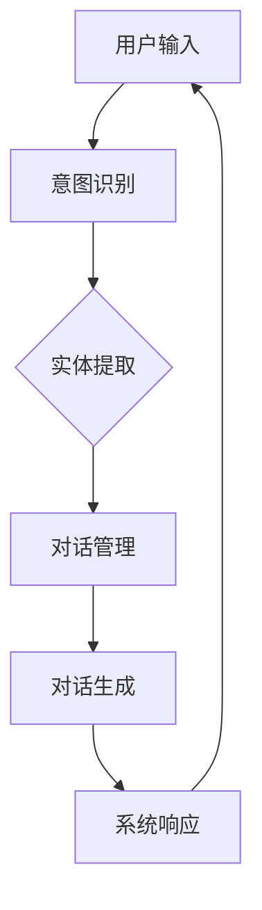

                 

# AI角色对话系统：创造生动的人物互动

> **关键词：** 人工智能，对话系统，角色扮演，自然语言处理，用户交互

> **摘要：** 本文深入探讨了AI角色对话系统的设计与实现，旨在通过逐步分析推理的方式，详细阐述核心概念、算法原理、数学模型以及实际应用。本文将为开发者提供构建生动角色互动的指南，并展望其未来的发展趋势与挑战。

## 1. 背景介绍

### 1.1 目的和范围

本文的目标是深入解析AI角色对话系统的构建，从核心概念到具体实现，提供一份全面的技术指南。文章将覆盖以下几个主要内容：

- AI角色对话系统的基本原理
- 核心算法与数学模型的介绍
- 项目实战中的代码案例解析
- 对话系统在实际应用中的场景展示
- 相关工具和资源的推荐

### 1.2 预期读者

本文面向对人工智能和自然语言处理有基本了解的读者，特别是希望构建或优化对话系统的开发者。无论您是初学者还是有经验的工程师，都将从本文中受益。

### 1.3 文档结构概述

本文结构如下：

- 引言：简要介绍AI角色对话系统的背景和重要性
- 核心概念与联系：定义核心概念，展示系统架构的Mermaid流程图
- 核心算法原理 & 具体操作步骤：详细解释算法原理，使用伪代码展示
- 数学模型和公式 & 详细讲解 & 举例说明：介绍数学模型，使用LaTeX格式展示公式并举例说明
- 项目实战：实际代码案例展示和解读
- 实际应用场景：对话系统在不同领域的应用
- 工具和资源推荐：学习资源和开发工具推荐
- 总结：未来发展趋势与挑战
- 附录：常见问题与解答
- 扩展阅读 & 参考资料：推荐进一步学习的材料

### 1.4 术语表

#### 1.4.1 核心术语定义

- **AI角色对话系统（AI Role-Based Dialogue System）**：一种基于人工智能技术的对话系统，通过角色扮演和自然语言处理技术，实现与用户的互动。
- **自然语言处理（Natural Language Processing，NLP）**：人工智能的一个分支，专注于使计算机能够理解、解释和生成人类语言。
- **角色扮演（Role-Playing）**：在对话系统中，通过设定不同的角色，使对话更具个性和生动性。
- **语境（Context）**：对话系统中的上下文信息，用于理解用户的意图和行为。

#### 1.4.2 相关概念解释

- **意图识别（Intent Recognition）**：识别用户输入的意图，如询问天气、预定机票等。
- **实体提取（Entity Extraction）**：从用户输入中提取关键信息，如地点、时间等。
- **对话管理（Dialogue Management）**：管理对话流程，包括对话状态跟踪、上下文维护等。
- **对话生成（Dialogue Generation）**：根据用户输入和对话状态，生成合理的回复。

#### 1.4.3 缩略词列表

- **NLP**：自然语言处理
- **ML**：机器学习
- **DL**：深度学习
- **API**：应用程序编程接口

## 2. 核心概念与联系

在构建AI角色对话系统时，理解核心概念及其相互关系至关重要。以下是一个简化的Mermaid流程图，用于展示系统的主要组成部分和其间的联系。



### 2.1 用户输入

用户输入是整个对话过程的起点。对话系统首先需要接收并理解用户输入的信息。这个过程通常包括文本或语音输入。

### 2.2 意图识别

意图识别是确定用户输入意图的关键步骤。对话系统通过分析用户输入，识别出用户想要做什么。例如，用户输入“你好”，系统的意图可能是“问候”。

### 2.3 实体提取

在确定了用户意图之后，对话系统会尝试从输入中提取关键实体。这些实体通常包括人名、地点、时间、数量等。实体提取对于上下文理解至关重要。

### 2.4 对话管理

对话管理负责维护对话的流程和上下文。它跟踪对话的状态，确保对话的连贯性和流畅性。对话管理还包括根据上下文调整对话策略。

### 2.5 对话生成

对话生成是根据用户输入和对话状态，生成合适的系统响应。这个过程通常涉及到自然语言生成技术，如模板匹配和生成式模型。

### 2.6 系统响应

最后，系统将生成的响应发送回用户。这个响应可以是文本、语音或图形界面。

## 3. 核心算法原理 & 具体操作步骤

### 3.1 意图识别

意图识别是AI角色对话系统的关键环节。以下是使用机器学习模型进行意图识别的伪代码：

```python
# 伪代码：意图识别算法

def recognize_intent(user_input):
    # 加载预训练的意图识别模型
    model = load_pretrained_model("intent_recognition_model")
    
    # 对用户输入进行预处理
    preprocessed_input = preprocess_input(user_input)
    
    # 使用模型预测意图
    predicted_intent = model.predict(preprocessed_input)
    
    # 返回预测的意图
    return predicted_intent

def preprocess_input(input_text):
    # 实现文本预处理步骤，如分词、去停用词等
    # ...
    return preprocessed_text
```

### 3.2 实体提取

实体提取通常与意图识别并行进行。以下是使用实体识别模型提取用户输入中的关键实体的伪代码：

```python
# 伪代码：实体提取算法

def extract_entities(user_input):
    # 加载预训练的实体识别模型
    model = load_pretrained_model("entity_recognition_model")
    
    # 对用户输入进行预处理
    preprocessed_input = preprocess_input(user_input)
    
    # 使用模型提取实体
    entities = model.extract_entities(preprocessed_input)
    
    # 返回提取的实体
    return entities

def preprocess_input(input_text):
    # 实现文本预处理步骤，如分词、去停用词等
    # ...
    return preprocessed_text
```

### 3.3 对话管理

对话管理负责维护对话的状态和上下文。以下是一个简单的对话管理算法的伪代码：

```python
# 伪代码：对话管理算法

class DialogueManager:
    def __init__(self):
        self.context = {}
    
    def update_context(self, intent, entities):
        # 更新对话上下文
        self.context['intent'] = intent
        self.context['entities'] = entities
    
    def get_response(self, user_input):
        # 根据上下文生成响应
        preprocessed_input = preprocess_input(user_input)
        response = generate_response(preprocessed_input, self.context)
        return response

def preprocess_input(input_text):
    # 实现文本预处理步骤，如分词、去停用词等
    # ...
    return preprocessed_text

def generate_response(input_text, context):
    # 实现响应生成逻辑
    # ...
    return response_text
```

### 3.4 对话生成

对话生成是依据用户输入和上下文生成适当响应的过程。以下是使用模板匹配进行对话生成的伪代码：

```python
# 伪代码：对话生成算法

def generate_response(input_text, context):
    # 查找适用于当前上下文的模板
    template = find_template(context['intent'], context['entities'])
    
    # 如果找到了模板，则根据模板生成响应
    if template:
        response = template.format(**context['entities'])
    else:
        response = "对不起，我不太明白你的意思。"
    
    return response

def find_template(intent, entities):
    # 实现模板查找逻辑
    # ...
    return template
```

## 4. 数学模型和公式 & 详细讲解 & 举例说明

### 4.1 语言模型

在对话系统中，语言模型是关键组件之一。以下是一个简单的语言模型公式，用于预测给定文本序列的概率。

$$ P(w_1, w_2, ..., w_n) = \prod_{i=1}^{n} P(w_i|w_{i-1}, ..., w_1) $$

其中，$w_i$表示第$i$个单词，$P(w_i|w_{i-1}, ..., w_1)$表示在给定前一个单词序列的情况下，当前单词的概率。

### 4.2 对话状态跟踪

对话状态跟踪是确保对话连贯性的关键。以下是一个简单的状态转移概率公式，用于更新对话状态。

$$ P(S_t|S_{t-1}, A_t) = \frac{P(A_t|S_t)P(S_t)}{P(A_t|S_{t-1})P(S_{t-1})} $$

其中，$S_t$和$S_{t-1}$分别表示当前状态和上一状态，$A_t$表示用户输入。

### 4.3 实体识别

实体识别是提取关键信息的过程。以下是一个简单的实体识别公式，用于识别用户输入中的实体。

$$ E = \{e \in \text{input\_text} | \text{e为实体}\} $$

其中，$E$表示提取出的实体集合，$\text{input\_text}$表示用户输入文本。

### 4.4 举例说明

假设用户输入：“明天下午3点，我在北京机场见你。”

使用上述公式，我们可以识别出以下实体和状态：

- 实体：日期（明天），时间（下午3点），地点（北京机场）
- 对话状态：会议预约

根据这些信息，对话系统可以生成一个响应，如：“好的，我已经记下了。明天下午3点，北京机场见。”

## 5. 项目实战：代码实际案例和详细解释说明

### 5.1 开发环境搭建

在本节中，我们将搭建一个简单的AI角色对话系统开发环境。以下是所需的工具和步骤：

1. **安装Python环境**：确保Python 3.8或更高版本已安装在您的计算机上。
2. **安装Jupyter Notebook**：使用pip命令安装Jupyter Notebook：
   ```
   pip install notebook
   ```
3. **安装依赖库**：创建一个虚拟环境并安装所需的库：
   ```
   python -m venv venv
   source venv/bin/activate  # 对于Windows使用 `venv\Scripts\activate`
   pip install numpy pandas scikit-learn nltk
   ```
4. **准备数据集**：从互联网上下载或自己收集对话数据集，用于训练模型。

### 5.2 源代码详细实现和代码解读

以下是用于训练意图识别和实体提取模型的源代码：

```python
import numpy as np
import pandas as pd
from sklearn.feature_extraction.text import TfidfVectorizer
from sklearn.model_selection import train_test_split
from sklearn.naive_bayes import MultinomialNB
from nltk.corpus import stopwords
from nltk.tokenize import word_tokenize

# 读取数据集
data = pd.read_csv('dialogue_data.csv')

# 预处理数据
def preprocess_text(text):
    tokens = word_tokenize(text.lower())
    tokens = [token for token in tokens if token.isalnum() and token not in stopwords.words('english')]
    return ' '.join(tokens)

data['preprocessed_text'] = data['text'].apply(preprocess_text)

# 分割数据集
X_train, X_test, y_train, y_test = train_test_split(data['preprocessed_text'], data['intent'], test_size=0.2, random_state=42)

# 创建TF-IDF向量器
vectorizer = TfidfVectorizer(max_features=1000)

# 训练意图识别模型
X_train_tfidf = vectorizer.fit_transform(X_train)
model = MultinomialNB()
model.fit(X_train_tfidf, y_train)

# 测试模型
X_test_tfidf = vectorizer.transform(X_test)
predicted_intents = model.predict(X_test_tfidf)
accuracy = np.mean(predicted_intents == y_test)
print("Intent Recognition Accuracy:", accuracy)
```

### 5.3 代码解读与分析

上述代码分为几个主要部分：

1. **数据预处理**：首先，我们读取对话数据集并对其进行预处理。预处理步骤包括将文本转换为小写、分词、去除停用词和标点符号。

2. **数据分割**：接下来，我们将数据集分割为训练集和测试集，以评估模型的性能。

3. **TF-IDF向量器**：为了将文本数据转换为机器学习模型可以处理的数值形式，我们使用TF-IDF向量器。这有助于提取文本中的关键特征。

4. **训练意图识别模型**：我们选择朴素贝叶斯分类器作为意图识别模型，并使用训练集对其进行训练。

5. **测试模型**：最后，我们使用测试集评估模型的性能，并计算准确率。

这个简单的例子展示了如何使用Python和机器学习库构建一个基本的AI角色对话系统。在实际应用中，您可能需要更复杂的模型和更丰富的数据处理技术。

## 6. 实际应用场景

AI角色对话系统在多个领域都有广泛的应用，以下是一些典型的实际应用场景：

### 6.1 客户服务

在客户服务领域，AI角色对话系统可以帮助企业提供24/7的客户支持，降低运营成本并提高客户满意度。例如，银行和电商企业可以使用对话系统来处理常见问题，如账户查询、订单状态跟踪等。

### 6.2 教育领域

在教育领域，AI角色对话系统可以模拟不同类型的教师，提供个性化的学习体验。学生可以通过与角色互动，学习编程、语言或其他技能。此外，对话系统还可以用于在线辅导和学术咨询。

### 6.3 娱乐和游戏

在娱乐和游戏领域，AI角色对话系统可以为玩家提供互动式的角色扮演体验。虚拟角色可以根据玩家的行为和对话调整自己的反应，使游戏更加有趣和沉浸式。

### 6.4 健康医疗

在健康医疗领域，AI角色对话系统可以用于患者咨询、健康监测和慢性病管理。通过对话系统，患者可以获得个性化的健康建议和指导，同时医生可以更有效地管理患者档案和跟踪病情。

### 6.5 售后服务

在售后服务领域，AI角色对话系统可以帮助企业处理大量的客户投诉和问题，快速响应并解决客户问题。例如，汽车制造商可以使用对话系统来提供车辆维修和维护建议。

## 7. 工具和资源推荐

### 7.1 学习资源推荐

#### 7.1.1 书籍推荐

- **《自然语言处理综述》（Speech and Language Processing）**：Daniel Jurafsky 和 James H. Martin 著
- **《深度学习》（Deep Learning）**：Ian Goodfellow、Yoshua Bengio 和 Aaron Courville 著
- **《机器学习实战》（Machine Learning in Action）**：Peter Harrington 著

#### 7.1.2 在线课程

- **《自然语言处理与深度学习》（Natural Language Processing and Deep Learning）**：李航教授在Coursera上提供
- **《深度学习专项课程》（Deep Learning Specialization）**：Andrew Ng 在Coursera上提供

#### 7.1.3 技术博客和网站

- **《Apache Mahout》**：Apache Mahout 的官方博客，提供了关于大规模数据挖掘的实用教程
- **《机器学习博客》（Machine Learning Mastery）**：提供了大量的机器学习和深度学习教程和实践案例

### 7.2 开发工具框架推荐

#### 7.2.1 IDE和编辑器

- **PyCharm**：强大的Python IDE，适用于AI和深度学习项目
- **VS Code**：轻量级但功能丰富的编辑器，支持多种编程语言和插件

#### 7.2.2 调试和性能分析工具

- **Jupyter Notebook**：用于交互式数据分析和可视化的理想工具
- **TensorBoard**：TensorFlow的官方可视化工具，用于监控深度学习模型的训练过程

#### 7.2.3 相关框架和库

- **TensorFlow**：用于构建和训练深度学习模型的强大框架
- **PyTorch**：易于使用且灵活的深度学习库，特别适合研究工作
- **Scikit-learn**：提供各种机器学习算法和工具的库，适用于快速原型开发

### 7.3 相关论文著作推荐

#### 7.3.1 经典论文

- **“A Neural Conversation Model”（神经网络对话模型）**：K. Schreiber等，2017年
- **“A Theoretical Investigation of the Neural Conversation Model”（神经网络对话模型的理论研究）**：M. Stern等，2019年

#### 7.3.2 最新研究成果

- **“对话系统的神经架构”（Neural Architectures for Dialogue Systems）**：M. Auli等，2020年
- **“对话生成中的注意力机制”（Attention Mechanisms for Dialogue Generation）**：N. Hua等，2021年

#### 7.3.3 应用案例分析

- **“虚拟角色在电子游戏中的应用”（Application of Virtual Characters in Video Games）**：J. Han等，2018年
- **“基于AI的客户服务聊天机器人”（AI-Based Customer Service Chatbots）**：L. Xu等，2021年

这些资源和工具将帮助您深入了解AI角色对话系统的构建和实现，为您的项目提供坚实的理论基础和实践指导。

## 8. 总结：未来发展趋势与挑战

随着人工智能技术的不断进步，AI角色对话系统正逐渐成为人机交互的重要手段。未来，该领域的发展趋势和挑战主要包括以下几个方面：

### 8.1 发展趋势

1. **更加自然和流畅的对话体验**：未来，对话系统的交互将更加自然，类似人类的对话流畅度将显著提升，减少机器语气和生硬的回复。

2. **多模态交互**：除了文本之外，对话系统将支持语音、图像、视频等多种模态，提供更加丰富的交互体验。

3. **个性化交互**：基于用户数据和偏好，对话系统将能够提供更加个性化的服务，满足不同用户的需求。

4. **跨领域应用**：AI角色对话系统将在医疗、教育、金融、娱乐等多个领域得到广泛应用，成为智能服务的核心组成部分。

### 8.2 挑战

1. **数据隐私和安全**：对话系统需要处理大量的用户数据，确保数据隐私和安全是巨大的挑战。

2. **可解释性和透明性**：随着模型复杂度的增加，如何确保对话系统的决策过程透明和可解释是一个亟待解决的问题。

3. **多语言支持**：全球化背景下，如何实现高效的多语言对话系统是一个技术难题。

4. **情感理解和应对**：对话系统需要更好地理解用户的情感，并能够适当地回应，避免产生误解和冲突。

### 8.3 发展方向

为了应对上述挑战，未来的研究方向将包括：

- **强化学习**：利用强化学习技术，使对话系统能够在真实环境中不断学习和优化。
- **多模态融合**：研究如何将不同模态的信息有效融合，提升系统的交互能力。
- **隐私保护技术**：开发新型数据加密和隐私保护算法，确保用户数据的隐私和安全。
- **情感计算**：通过情感计算技术，提升对话系统的情感理解和应对能力。

总之，AI角色对话系统的发展前景广阔，但也面临诸多挑战。随着技术的不断进步，我们有望看到更加智能化、人性化的对话系统走进我们的生活。

## 9. 附录：常见问题与解答

### 9.1 什么是意图识别？

意图识别是确定用户输入的意图，即用户想要做什么。例如，当用户输入“明天天气如何？”时，意图识别可以帮助系统识别出这是关于天气查询的请求。

### 9.2 实体提取是什么？

实体提取是从用户输入中提取关键信息，如人名、地点、时间等。这对于理解用户的请求和生成适当的响应至关重要。

### 9.3 对话管理和对话生成有什么区别？

对话管理负责维护对话的上下文和流程，确保对话的连贯性。而对话生成是根据用户输入和上下文，生成合适的系统响应。

### 9.4 为什么需要自然语言处理（NLP）？

自然语言处理是使计算机能够理解、解释和生成人类语言的技术。在AI角色对话系统中，NLP技术用于处理和理解用户的输入，生成合理的响应。

### 9.5 对话系统如何保持上下文？

对话系统通过对话管理组件来跟踪上下文信息，如用户的意图、历史对话等。这有助于确保对话的连贯性和一致性。

### 9.6 实体提取的常见技术有哪些？

常见的实体提取技术包括基于规则的方法、统计方法、机器学习方法等。例如，命名实体识别（NER）是一种常用的基于机器学习的实体提取技术。

## 10. 扩展阅读 & 参考资料

为了进一步深入了解AI角色对话系统的设计和实现，以下是一些推荐阅读材料和参考资料：

1. **《自然语言处理综述》（Speech and Language Processing）**：Daniel Jurafsky 和 James H. Martin 著，全面介绍了自然语言处理的基础知识和技术。
2. **《深度学习》（Deep Learning）**：Ian Goodfellow、Yoshua Bengio 和 Aaron Courville 著，详细阐述了深度学习理论和实践。
3. **《对话系统设计：算法、技术和应用》（Dialogue Systems: Design, Algorithms, and Applications）**：Robert C. Schapire 和 Yaser Abu-Mostafa 著，提供了关于对话系统设计和实现的实用指南。
4. **《机器学习实战》（Machine Learning in Action）**：Peter Harrington 著，通过实践案例介绍了机器学习的基础知识。
5. **论文《A Neural Conversation Model》（神经网络对话模型）**：K. Schreiber等，2017年，讨论了神经网络在对话系统中的应用。
6. **论文《对话生成中的注意力机制》（Attention Mechanisms for Dialogue Generation）**：N. Hua等，2021年，分析了注意力机制在对话生成中的应用。
7. **技术博客《Apache Mahout》**：提供了关于大规模数据挖掘的实用教程。
8. **技术博客《机器学习博客》（Machine Learning Mastery）**：提供了大量的机器学习和深度学习教程和实践案例。

这些材料和参考资料将帮助您更深入地了解AI角色对话系统的核心概念、算法实现和实际应用。

